> 导航：[总目录](../../../README.md) · [documentation](../../../_indexes/documentation.md) · [Xcode Workspace Guide](Introduction.md)


[Next](Refactoring%20Code.md)[Previous](File%20Management.md)

# The Text Editor

Xcode contains a full-featured _text editor_ for editing your project’s text files. You have many options for using this editor to view and modify the text files in your project; you can edit files in a dedicated editor window or use the editor pane attached to most Xcode windows. You can also choose whether to have multiple editor windows open at once or use a single editor window for all the text files that you open.

This chapter describes the Xcode text editor, shows how to open files in a standalone window or in an editor pane, and how to control the appearance of the editor.

The Xcode text editor provides many ways to move between files and to find and navigate to information in a file. The navigation bar of the editor provides a number of menus for navigating within and between files.

You can view the text editor in two ways:

- __A text editor window:__ A window whose main purpose is to let you edit a file.
- __A text editor pane:__ Also known as an attached editor, these panes are part of other windows, such as the project window, debugger window, or build results window.

In either case, the content looks the same and the same controls are available. When you open a file in the text editor, you see something similar to Figure 4-1.

__Figure 4-1__  The text editor

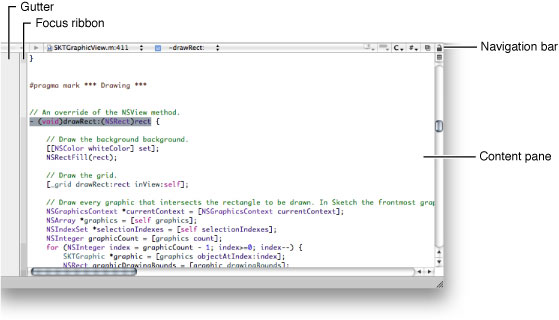

Here’s what the text editor contains:

- __Gutter.__ The gutter displays file line numbers, as well as information about the location of breakpoints, errors, or warnings in the file. See [Displaying the Gutter](#apple-f4xwc4dqnrsv64tfmyxwi33df52wszbpkridimbqgazdmnzzfvjvoni) to learn more about the contents of the gutter, as well as how to show and hide the gutter.
- __Focus ribbon.__ The focus ribbon allows you to navigate the scope of a code file and to fold and unfold parts of a code file. To learn more about folding/unfolding code, see [Code Folding](#apple-f4xwc4dqnrsv64tfmyxwi33df52wszbpkridimbqgazdmnzzfvjvomzw).
- __Navigation bar.__ The bar along the top of the editor contains several menus and buttons that let you quickly see, and jump to, locations within the current file and in other files open in the editor. [Navigation Bar](#apple-f4xwc4dqnrsv64tfmyxwi33df52wszbpkridimbqgazdmnzzfvjvomy) describes the contents of the navigation bar and how to use it to navigate source code files.
- __Content pane.__ The content pane displays the contents of the file.

The _navigation bar_ contains a number of controls that you can use to move between files you’ve viewed, jump to symbols, and open related files. Figure 4-2 shows the navigation bar.

__Figure 4-2__  Text editor navigation bar

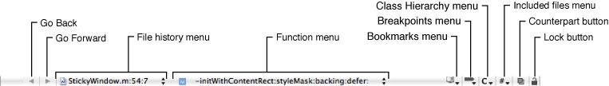

Here is what the navigation bar contains:

- __Go Back/Go Forward.__ Move between and within open files in the editor. See [Navigating Code](#apple-f4xwc4dqnrsv64tfmyxwi33df52wszbpkridimbqgazdmnzzfvjvomi) for details.
- __File History menu.__ Lists the files recently viewed in the current text editor. Choosing a file from this menu displays that file in the editor, without having to repeatedly click the Next or Previous arrows.
- __Function menu.__ Shows the function and method definitions in the current file. When you choose a definition from this menu, the editor scrolls to the location of that definition. For information on how to configure the Function menu, see [The Function Menu](#apple-f4xwc4dqnrsv64tfmyxwi33df52wszbpkridimbqgazdmnzzfvjvomjq).
- __Bookmarks menu.__ Contains any bookmarked locations in the current file. When you choose a bookmark from this menu, the editor scrolls to the location of the bookmark. See [Defining Bookmarks](Project%20Organization.md#apple-f4xwc4dqnrsv64tfmyxwi33df52wszbpkridimbqgazdmnrxfvbeeq2gjbaugsa) to learn more about bookmarks in your project.
- __Breakpoints menu.__ Lists breakpoints in the current file. Choosing a breakpoint from this menu scrolls the editor to the location at which the breakpoint is set. See [Managing Program Execution](https://developer.apple.com/library/archive/documentation/DeveloperTools/Conceptual/XcodeDebugging/200-Managing_Program_Execution/program_execution.html#//apple_ref/doc/uid/TP40007057-CH8) to learn more about breakpoints.
- __Class Hierarchy menu.__ Allows you to navigate the class hierarchy of an Objective-C class.
- __Counterpart button.__ Opens the counterpart of the current file or jumps to the symbolic counterpart of the currently selected symbol. See [Jumping to the Counterpart of a File or Symbol](#apple-f4xwc4dqnrsv64tfmyxwi33df52wszbpkridimbqgazdmnzzfvjvomjr) for more information on the Counterpart button.
- __Included Files menu.__ Lists the files included by the current file, as well as the files that include the current file. Choosing a file from this menu opens that file in the editor. This menu is described more in [Opening Header Files and Other Related Files](File%20Management.md#apple-f4xwc4dqnrsv64tfmyxwi33df52wszbpkridimbqgazdmnzxfvjvona).
- __Lock button.__ Indicates whether the current file is editable and allows you to change the locked status of the file. (When clicked, Xcode attempts to change the file's permissions accordingly.)

The _File History menu_ lists the files that you have viewed in the current editor, with the current file at the top of the menu. To go to any of these files, simply choose it from the list. The menu has a couple of commands: Clear File History and History Capacity.

You can clear the File History menu by choosing Clear File History. This removes all but the current file in the editor from the list. By default, Xcode places no limit on the number of files that it places in this menu. You can limit the size of the File History menu with the History Capacity command.

The _Function menu_ lets you jump to many points in the current file, including any identifier it declares or defines. You can also add items that aren’t definitions or declarations. In this menu, you can see:

- Declarations and definitions for classes, functions, and methods
- Type declarations
- `#define` directives
- `#pragma` marks
- Comments containing:

  - `MARK:`
  - `TODO:`
  - `FIXME:`
  - `!!!:`
  - `???:`

To scroll to the location of any of these identifiers, choose it from the menu. Figure 4-3 shows the Function menu.

__Figure 4-3__  The Function menu

!

The contents of the Function menu are sorted in the order in which they appear in the file. Hold down the Option key while using the Function menu to toggle the sort order of the items between alphabetical order and the order in which they appear in the source file.

You can also change the default behavior for the Function menu in Code Sense preferences. To choose which items appear in the Function menu and the order they appear in, use:

- The “Show declarations” option to specify whether the menu shows declarations as well as definitions
- The “Sort list alphabetically” option to specify whether the items are sorted alphabetically or in the order they appear in the file

To add a marker to a source file and make that marker appear in the Function menu, use the `#pragma mark` statement in your source code. For example, the following statement adds “PRINTING FUNCTIONS” to the Function menu:

```
#pragma mark PRINTING FUNCTIONS
```

To add a separator to the Function menu use:

```
#pragma mark -
```


Clicking the Counterpart button opens the related header or source file for the file currently open in the text editor. For example, if the file currently open in the editor is `MyFile.c`, clicking this button opens `MyFile.h`, and vice versa. When your project contains files with the same name, Xcode gives preference to files located in the same folder as their counterparts. You can also open the current file’s related header or implementation file by choosing View > Switch to Header/Source File.

Option-clicking the Counterpart button displays the counterpart of the currently selected symbol—class, method, function, and so on—opening the corresponding file and scrolling to the appropriate section within it if necessary. If the selected symbol is a class, method, or function declaration, the editor scrolls to the definition for that item. If a class, function, or method definition is currently selected, the editor scrolls to the symbol’s declaration.

By default, Xcode opens the file or symbol counterpart in the current editor; however, you can have Xcode open counterparts in a separate editor window. This makes it easy to view both a header and its implementation file, or a symbol declaration and its definition, at once. To have Xcode open counterparts in a separate window, go to General preferences, and deselect the “Open counterparts in same editor” option.

If you prefer, you can use a dedicated window for editing source files. Regardless of your preference for whether Xcode automatically opens the attached text editor in Xcode windows, you can always open a file in a separate editor window by doing either of the following:

- Double-click the file in the Groups & Files list or the detail view in the project window.
- Choose ”Open in Separate Editor” from the file shortcut menu.

Figure 4-4 shows a text editor window.

__Figure 4-4__  The text editor in a standalone window

!!

In addition to the basic editor interface, the standalone editor window also contains a toolbar and a status bar. The status bar is similar to the status bar of other Xcode windows, described in [The Project Window Status Bar](The%20Project%20Window.md#apple-f4xwc4dqnrsv64tfmyxwi33df52wszbpkridimbqgazdmnrvfvjvomy).

Like the toolbar in other Xcode windows, the toolbar in the text editor window provides easy access to common tasks. In addition to the buttons for building, running, and debugging the current target, it also contains the following buttons:

- __Breakpoints menu.__ Adds breakpoints to the current file. The menu has preconfigured breakpoint actions. When you choose one of these actions Xcode adds a breakpoint at the current location of the insertion point and configures it with the specified action. See [Managing Program Execution](https://developer.apple.com/library/archive/documentation/DeveloperTools/Conceptual/XcodeDebugging/200-Managing_Program_Execution/program_execution.html#//apple_ref/doc/uid/TP40007057-CH8) for more information.
- __Activate/Deactivate button.__ Toggles breakpoints on or off.
- __Project button.__ Jumps to the file in the project window. Clicking this button brings the project window to the front.
- __Grouped/Ungrouped button.__ Controls whether opening a file, using any of the methods described earlier in this section, opens an editor window for that file or opens the file in the current window. Clicking the button toggles the state. If the label is Grouped, indicated by the icon of a single window, double-clicking a file opens it in the current editor. If the label is Ungrouped, indicated by an icon of multiple layered windows, each file opens in a separate editor window.

To preserve the state of any open text editor windows when you close a project, select the “Save window state” option in General preferences.

You can also edit your source files from within other Xcode windows, such as the project window and the debugger window, as shown in Figure 4-5. To open a file in a window’s text editor pane, first make sure that the editor is visible in the window. If the editor is not already visible, you can open it by clicking Editor in the toolbar. This reveals the text editor pane of the project window. If the editor pane is at its maximum size, clicking the Editor button returns the pane to its previous size. To adjust the size of the editor pane to a different size, drag the separator to the size that you prefer. Another way to view a file in the editor pane is to select the file and choose View > Zoom Editor In.

Selecting a file, an error or warning, a bookmark, a find result or a project symbol opens the associated file in the editor pane as long as it is visible. You can also have Xcode automatically show the editor pane when you select one of these items in the detail view. Select the “Automatically open/close attached editor” option in General preferences.

__Figure 4-5__  The text editor pane in a project window

!!

Xcode allows you to simultaneously view multiple files or multiple sections of the same file without increasing the number of open windows. It does this by splitting a text editor. Figure 4-6 shows an editor that has been split to display two parts of the same file.

__Figure 4-6__  Splitting a text editor

!

To split a text editor, make sure that the editor has focus and do one of the following:

- To split the editor vertically click the Split button. The Split button—identical to the Split button in the Groups & Files list, described in [Splitting the Groups & Files View](The%20Project%20Window.md#apple-f4xwc4dqnrsv64tfmyxwi33df52wszbpkridimbqgazdmnrvfvjvona)—appears above the vertical scrollbar of the editor window.
- To split a code editor horizontally Option-click the Split button.

To close a split, click the Close Split button. You can resize the panes of a split editor by dragging the resize control between them.

Xcode provides seamless navigation throughout the source-code files you have opened in a text editor window. The Go Back and Go Forward buttons in the navigation bar let you move between interesting locations within a file, and switch between the files you have opened in that text editor window. In-file navigation is limited to C-based source files, though.

After opening a file and making changes throughout the file, you can jump back through the changed locations by clicking the Go Back button. Navigating past the first visited location in the file causes the text editor to switch to the file that was active before the current file opened. Conversely, you can jump forward between opened files and interesting locations within files by clicking the Go Forward button.

Clicking the Go Back or Go Forward buttons and holding down the mouse button displays a lost of the opened source files, including the interesting locations within those files.

When you want to jump directly to the previous or next file, Option-click the Go Back or Go Forward buttons, respectively.

Xcode provides a number of layout options to help you keep your code well formed and readable. Syntax-aware indenting helps you keep your code neat by automatically indenting code as you type. This section describes options for indenting code and matching parentheses.

The text editor supports syntax-aware indenting (automatic code indentation) to make it simple to author neat and readable code. You can also choose to indent code manually.

This section shows how to configure syntax-aware indenting, how to manually format text in the text editor, and how to control tab layout and automatic indentation.

The _syntax-aware indenting_ feature of the Xcode text editor gives you a number of ways to control how it automatically lays out your code. When you use syntax-aware indenting, the editor automatically indents your code as you type; pressing Return or Tab moves the insertion point to the appropriate level by examining the syntax of the surrounding lines. You can control which characters cause the editor to indent a line, what happens when you press the Tab key, and how the editor indents braces and comments.

To turn on syntax-aware indenting, select the “Syntax-aware indenting” option in Indentation preferences. See [Indentation Preferences](#apple-f4xwc4dqnrsv64tfmyxwi33df52wszbpkridimbqgazdmnzzfvjvonru) for details.

When you use syntax-aware indenting, you usually press the Tab key to tell the editor to indent the text on the current line. But when you’re at the end of the line, you may want to insert a tab character before, say, you insert a comment. To choose the circumstances for which pressing the Tab key reindents a line, use the “Tab indents” menu in Indentation preferences..

You can choose among always indenting, never indenting, or indenting only at the beginning of a line or after a space. See [Indentation Preferences](#apple-f4xwc4dqnrsv64tfmyxwi33df52wszbpkridimbqgazdmnzzfvjvonru) for more information.

To insert a tab character regardless of how “Tab indents” is set, press Option-Tab. Similarly, to perform syntax-aware indenting regardless of this option’s setting, press Control-I.

You can have the editor automatically indent braces to help you easily see the level of nesting in your code and to keep your code readable. In addition, to help you keep braces balanced, you can have the editor automatically insert a closing brace when you type an opening brace.

To set how much an opening brace is indented when it appears on a line by itself, use the “Indent solo “{” by” text field in Indentation preferences.

When the value of the field is greater than 0, Xcode automatically indents opening braces to the level of the previous line plus the specified number of characters.

To specify whether to insert a closing brace automatically when you type an opening brace, select the “Automatically insert closing “}”” option.

To set which characters cause the text editor to automatically indent a line whenever they’re typed, use the options under “Automatically indented characters” in Indentation preferences. See [Indentation Preferences](#apple-f4xwc4dqnrsv64tfmyxwi33df52wszbpkridimbqgazdmnzzfvjvonru) for details.

You can choose how to indent C++–style (`//`) comments when they appear on lines by themselves.

To specify whether to indent `//` comments and whether to align consecutive `//` comments, use the options for these comments in Indentation preferences.

If you choose not to use syntax-aware indenting, you must manually indent code you want indented. When syntax-aware indenting is turned off, pressing Tab inserts a tab character and pressing Return inserts a carriage return and moves the cursor to the same level as the previous line. You can also indent a block of text to the left or right by selecting the text and choosing Edit > Format > Shift Left or Edit > Format > Shift Right.

When syntax-aware indenting is turned off, the text editor may still indent newly added lines to the level of the previous line when you press Return. You can turn this indenting off in Key Binding preferences. Click Text Key Bindings and add the Return key to the keyboard shortcuts list of the Insert Newline action. See [Keyboard Shortcuts](Keyboard%20Shortcuts.md#apple-f4xwc4dqnrsv64tfmyxwi33df52wszbpkridimbqgazdombwfvbecqskizbuqry) for details.

Whether you indent a line manually or rely on syntax-aware indenting, you can control the width of tabs and indents, and you can specify whether the text editor inserts tab characters or spaces. You can specify default values for all files you open in the text editor and customize these settings for individual files.

You can set how many spaces to indent when the editor automatically indents or when you press the Tab key. To set the default indent or tab width for every file you open, use the “Tab width” and “Indent width” text fields in Indentation preferences.

To override the default indent or tab width for one or more specific files, select the files in the Groups & Files list and open the File Info window. In the General pane, change the Indent Width or Tab Width setting.

To ensure that your code looks the same to other developers regardless of their tab layout settings, you can have the editor insert a series of spaces instead of a tab character whenever it indents code or when you press Tab.

To specify that the text editor use tabs instead of spaces, select the “Tab key inserts tab, not spaces” option in Indentation preferences..

You can also specify this setting on a per-file basis. To choose whether the editor uses tabs or spaces when editing a certain file, select the file in the Groups & Files list, open the File Info window, and in the General pane select “Editor uses tabs.”

Xcode provides a number of ways to help you match pairs of delimiters (parentheses, braces, and brackets):

- When you type a closing delimiter, Xcode causes its counterpart to blink.
- When syntax-aware indenting is turned on, Xcode can automatically insert a closing brace each time you type an opening brace, as described in [Choosing How to Indent Braces](#apple-f4xwc4dqnrsv64tfmyxwi33df52wszbpkridimbqgazdmnzzfvkfawcsivddcmbu).
- When you double-click any delimiter, Xcode selects the entire expression that it and its counterpart enclose. You can also choose to select the delimiters themselves.
- When you choose Edit > Format > Balance, Xcode selects the text surrounding the insertion point, up to the nearest set of enclosing delimiters.

You can further control Xcode’s behavior when selecting text within a pair of enclosing braces or parentheses using the options under Editing Options in Text Editing preferences. See [Text Editing Preferences](#apple-f4xwc4dqnrsv64tfmyxwi33df52wszbpkridimbqgazdmnzzfvjvomrv) for details.

To keep all your code visible in the text editor, you can have it wrap lines when they reach the right edge of the content pane. To turn on line wrapping for all files you open in the text editor, select the “Wrap lines in editor” option in Indentation preferences.

Using the “Indent wrapped lines by” option, also in Indentation preferences, you can have the text editor automatically indent wrapped lines, to visually distinguish them from other lines.

To wrap lines for an individual file in the current editor, choose View > Text > Wrap Lines.

_Syntax formatting_ (also known as _syntax coloring_) makes it easy to identify elements of your code by using different fonts and colors to identify particular elements, such as keywords and comments. For example, you can display comments in green and keywords in boldface.

Xcode supports syntax formatting for many programming languages; to see the languages that it supports, choose View > Syntax Coloring.

The same menu allows you to toggle syntax formatting for the selected file:

- __None.__ Turns syntax formatting off for the file.
- __Default for file type.__ Turns syntax formatting on for the file, using the global syntax formatting settings in the Fonts & Colors pane of Xcode preferences.

To specify whether Xcode applies syntax formatting to all files that you open, select the “Use syntax-based formatting” option in Fonts & Colors preferences.

When syntax formatting is active, Xcode uses element categories to determine the formatting to apply to particular elements in a file. An element category is a name that identifies a type of source-code element or text-editor user interface. You can see a list of the categories and change the font and color for each in Fonts & Colors preferences.

Xcode provides several syntax formatting themes, which assign colors and fonts to all the element categories. You can also create your own themes.

Using its knowledge of the syntax of a programming language, Xcode assigns keywords or textual constructs in a file, such as numbers or strings (text within quotation marks) to an element category to determine how it's formatted in the editor. In addition, you can tell Xcode to use a project’s Code Sense index to provide a richer store of symbol information to assign code fragments to element categories. That is, instead of only the current file, Xcode uses information about all the source files in the project to associate code fragments to categories.

For further details about configuring syntax formatting, see [Fonts & Colors Preferences](#apple-f4xwc4dqnrsv64tfmyxwi33df52wszbpkridimbqgazdmnzzfvjvonbs).

When you write code, you often must type or copy and paste long identifier names and lists of arguments. _Code completion_ offers you a shortcut. As you type the beginning of an identifier or a keyword, code completion suggests likely completions, based on the text you have already typed and the surrounding context within the file.

Code completion is implemented using an index of the symbols defined in your project and its included files. Xcode supports code completion for C, C++, Objective-C, Objective-C++, Java, and AppleScript. To learn more about source-code indexing, see Code Sense.

This section describes how to use code completion and how to set code completion options.

To turn on code completion, use the Automatically Suggest menu in Code Sense preferences.

Code completion offers the best suggestion inline. You can also display the list of completions for the text you’ve typed. The following sections describe these two modes of code completion.

As you type, Xcode builds a list of the symbols that match the _token_ (string containing no spaces) you’ve entered; it further modifies the list by analyzing the token’s context within the file. When Xcode finds completions, the text editor shows the most likely completion inline, as shown in Figure 4-7 (the following descriptions are based on the Sketch example project).

__Figure 4-7__  Inline code completion

!!

In this case, the text typed is `per`. Xcode has built a list of possible completions and shown the completion that it guesses is the most appropriate, `performSelector:(SEL)aSelector`. In addition, the `form` text is highlighted because, in the list that Xcode built, all possible completions start with `perform`. Pressing Tab accepts the highlighted portion of the completion. The gray-text part of the completion, `Selector:(SEL)aSelector` in this case, can be changed with further typing.

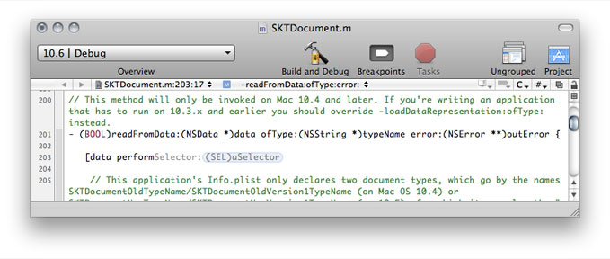

In this example, most of the possible completions start with `performS`, but there is also one completion that starts with `performD`. This is why even after typing `perform`, Xcode doesn’t fully suggest a completion that starts with `performSelector`: You may mean to type the `performDragOperation:` method name.

With the cursor to the right of the `perform` token, typing `S` makes Xcode fully suggest the `performSelector:(SEL)aSelector` completion (no gray text) because that symbol name represents an indexed symbol that would be appropriate in the token’s context. Pressing Tab accepts that completion.

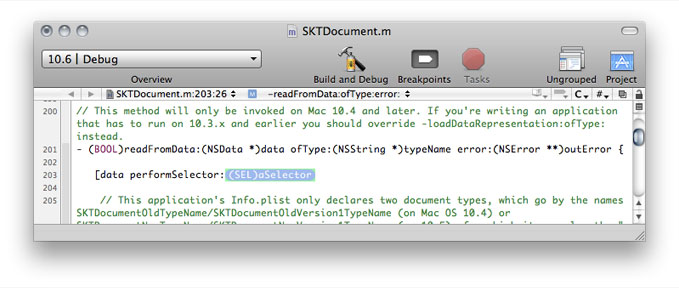

Because the `performSelector:` method has one parameter, after accepting the completion, Xcode displays a placeholder for the method’s parameter and selects it so that you can enter the parameter’s value. With methods with multiple parameters, you can press Tab to move through their placeholders.

If you rather work with parameters as plain text instead of in their placeholder form, you can convert a placeholder to text. To convert a placeholder to text, select the placeholder and press Return.

Before accepting a completion, you can choose the next completion in the completion list by choosing Edit > Next Completion.

You can change the keyboard shortcuts associated with code completion commands in Key Bindings preferences. Click Text Key Bindings and look for the actions that begin with “Code Sense” in the alphabetical list:

- Code Sense Complete List
- Code Sense Next Completion
- Code Sense Previous Completion
- Code Sense Select Next Placeholder
- Code Sense Select Previous Placeholder

For more information on keyboard shortcuts, see [Keyboard Shortcuts](Keyboard%20Shortcuts.md#apple-f4xwc4dqnrsv64tfmyxwi33df52wszbpkridimbqgazdombwfvbecqskizbuqry).

At any time, you can open the _completion list_ Xcode has built so far for the typed token by choosing Edit > Completion List or pressing Escape.

Figure 4-8 shows the completion list. The button in the bottom-right corner of the list lets you specify the sort order of the completion suggestions. You can sort completions alphabetically or by relevance.

__Figure 4-8__  Code completion list

!!

You can choose the appropriate match from this list or continue typing to narrow the list further. To enter a symbol from the completion list, select it and press Return.

Xcode lets you specify whether and how the text editor makes code completion suggestions and how much of a symbol’s information the completion list displays. You make these choices in Code Sense preferences. See [Code Sense Preferences](#apple-f4xwc4dqnrsv64tfmyxwi33df52wszbpkridimbqgazdmnzzfvjvonrw) for details.

The text editor provides two ways for you to focus on the part of the source file that interests you:

- Code focus, which highlights scope levels
- Code folding, which allows you to collapse portions of code

This section shows how to survey a source file’s scope levels and how to hide areas of a file in which you’re not interested.

Code focus highlights a source file’s scope levels using a grayscale. The code at the current scope, called the _focus center_, is demarcated in the _focus box_, which uses a white background. The editor delineates subsequent scopes in boxes using progressively darker backgrounds. Figure 4-9 shows the code focus interface.

__Figure 4-9__  Code-focus controls

!

Code focus is toggled on or off in Text Editing preferences.

To survey a source file’s scope levels, use the _focus ribbon_, which is located to the right of the editor gutter. It also uses levels of gray to identify the scope level of the corresponding code lines. The focus box changes as you move the pointer through the focus ribbon to show the focus center that corresponds to the pointer’s position within the file.

In addition to following the pointer in the focus ribbon, you can have the focus box follow the cursor’s position in the content view by choosing View > Code Folding > Focus Follows Selection.

When you’re trying to focus your attention on a specific aspect of your code, such as methods that deal with a particular instance variable, other aspects (for example, other methods or comments about your code) can get in the way. _Code folding_ helps you zero in on the code you want to see by letting you hide the code you don’t want to see.

In [Figure 4-9](#apple-f4xwc4dqnrsv64tfmyxwi33df52wszbpkridimbqgazdmnzzfvjvomru) the editor reveals only one of the methods of the `SKTDocument.m` file. The other methods are folded (hidden) away from view.

These are the code folding actions you can perform:

- __Fold the focus center.__ To fold the focus center, click the area in the focus ribbon that corresponds to the focus box.
- __Unfold code.__ To unfold code, click either the corresponding triangle in the focus ribbon or the icon containing the ellipsis (…) in the content pane.

You can perform other code folding actions using the Code Folding submenu of the View menu.

As you modify existing code or use code templates, you may want to change the name of function or method parameters to produce self-documenting code, for instance. You may also want to highlight all the places a symbol appears to see how extensively it’s used within a code block. The Edit All in Scope command in the Edit menu facilitates these tasks. This command lets you select a symbol in a code block and highlight or change all occurrences of the symbol within the code block simultaneously.

For example, take this code listing:

```objc
- (void)setSearchKey:(NSString *) value {
    if (_searchKey != value) {
        [_searchKey release];
        if (value == nil) value = @"";
        _searchKey = [value copy];
        [self createSearchPredicate];
    }
}
```

Instead of `value` you may want to use `searchKey` to identify the method’s argument. To do that, you select an occurrence of `value` anywhere within the method and choose Edit > Edit All in Scope.

You can then change `value` to `searchKey` once. Xcode replaces all occurrences of `value` with `searchKey` within the method while you type the new name, as shown in Figure 4-10.

__Figure 4-10__  Editing the name of a symbol

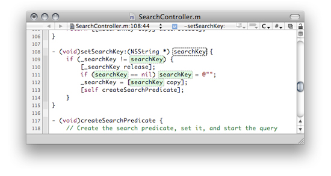

To exit editing in a scope, click anywhere in the file, outside highlighted text.

To cycle among the symbol occurrences within the code block, choose Edit > Select Next Placeholder (hold the Shift key to select the previous occurrence).

To learn how to customize the behavior of the Edit All in Scope command, see [Code Sense Preferences](#apple-f4xwc4dqnrsv64tfmyxwi33df52wszbpkridimbqgazdmnzzfvjvonrw).

Using code completion to automatically complete symbol names saves you a lot of typing. In the course of writing source code, however, you still spend a lot of time typing the same basic code constructs—such as `alloc` and `init` methods in Objective-C programs—over and over again. To help you with this, Xcode includes a set of text macros. _Text macros_ let you insert common constructs and blocks of code with a menu item or keystroke, instead of typing them in directly.

You can insert a text macro in either of these ways:

- Choose Edit > Insert Text Macro.

  Then choose a text macro from one of the language-specific submenus. Xcode provides built-in text macros for common C, C++, Objective-C, Java, and HTML constructs.
- Type the completion prefix for the text macro ([Text Macros with Completion Prefixes](#apple-f4xwc4dqnrsv64tfmyxwi33df52wszbpkridimbqgazdmnzzfvjvomzv)) and use code completion (press Escape) to insert the remaining text, just as you would to complete a symbol name. Most of the text macros provided by Xcode have a completion prefix, a string that Code Sense uses to identify the text macro. When you type this string, Xcode includes the text macro in the completion list; you can select it from this list or cycle through the appropriate completions, as described in [Completing Code](#apple-f4xwc4dqnrsv64tfmyxwi33df52wszbpkridimbqgazdmnzzfvjvomrt).

The inserted text includes placeholders for arguments, variables, and other program-specific information. For example, choosing Insert Text Macro > C > If Block inserts the following text at the current insertion point in the active editor:

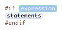

Replace the placeholders `expression` and `statements` with your code. You can cycle through the placeholders in a text macro in the same way you can cycle through function arguments with code completion. A text macro can also define one placeholder to be replaced with the current selection, if any. When you select text in the active editor and insert a text macro, Xcode substitutes the selected text for this placeholder. For the If Block text macro described above, Xcode substitutes the selected text for the `statement` placeholder. For example, if the current selection in the text editor is `CFRelease(someString);`, inserting the If Block text macro gives you the following:

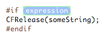

If there is no selection, Xcode simply inserts the `statements` placeholder, as in the previous example.

Some text macros have several variants. For example, the text macro for inserting an HTML heading has variants for the different levels of headings. For text macros that have multiple variants, repeatedly choosing that text macro from the Insert Text Macro menus cycles through the different versions of that macro. For example, choosing Insert Text Macro > HTML > Heading a single time produces:

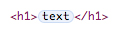

Choosing it again modifies the text to:

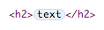

To create your own text macros, you have to create a language specification for the language to which you want to apply the macro. Then, place the language specification in:

```
~/Library/Application Support/Developer/Shared/Xcode/Specifications
```

For examples of language specifications, see:

```
<Xcode>/Applications/Xcode.app/Contents/PlugIns/TextMacros.xctxtmacro
```


The following tables list the built-in text macros with completion prefixes for C, Objective-C, and C++.

__Table 4-1__  C text macros with completion prefixes

| Text macro name | Completion prefix |
| If Block | `if` |
| If / Else Block | `ifelse` |
| Else If Block | `elseif` |
| For Loop | `for` |
| For i Loop | `fori` |
| While Loop | `while` |
| Do While Loop | `do` |
| Switch Block | `switch` |
| Case Block | `case` |
| Else Block | `else` |
| Enum Definition | `enum` |
| Struct Definition | `struct` |
| Union Definition | `union` |
| Type Definition | `typedef` |
| Printf() Call | `printf` |
| #Pragma Mark | `pm` |
| Pragma Mark | `pragma` |
| #Import Statement | `pim` |
| #Import Statement (System) | `pims` |
| #Import Statement (Framework) | `pimf` |
| #Include Statement | `pin` |
| #Include Statement (System) | `pins` |
| #If Block | `pif` |
| #Ifdef Block | `pifd` |
| #if / Else Block | `pife` |
| #Ifdef / Else Block | `pifde` |
| #if 0 Block | `pifz` |
| Copyright Comment | `copyright` |
| Comment Selection | `comment` |
| Separator Comment | `cseparator` |

__Table 4-2__  Objective-C text macros with completion prefixes

| Text macro name | Completion prefix |
| Try / Catch Block | `@try` |
| Catch Block | `@catch` |
| Finally Block | `@finally` |
| NSLog() Call | `log` |
| Alloc / Init Call | `a` |
| Array Declaration | `aa` |
| Mutable Array Declaration | `ma` |
| Array For Loop | `fora` |
| Array Foreach Loop | `fore` |
| init Definition | `init` |
| dealloc Definition | `dealloc` |
| observeValueForKeyPath: Definition | `observeValueForKeyPath` |
| observeValueForKeyPath: Declaration | `observeValueForKeyPath` |
| bind: Definition | `bind` |
| bind: Declaration | `bind` |
| @interface Definition | `@interface` |
| @implementation Definition | `@implementation` |
| @protocol Definition | `@protocol` |
| NSString | `nss` |
| NSMutableString | `nsms` |
| NSArray | `nsa` |
| NSMutableArray | `nsma` |
| NSDictionary | `nsd` |
| NSMutableDictionary | `nsmd` |

__Table 4-3__  C++ text macros with completion prefixes

| Text macro name | Completion prefix |
| #Ifdef Block | `pifdcpp` |
| #Ifdef/Else Block | `pifdecpp` |
| Static Cast | `static_cast` |
| Dynamic Cast | `dynamic_cast` |
| Reinterpret Cast | `reinterpret_cast` |
| Try / Catch Block | `try` |
| Catch Block | `catch` |
| Cout Statement | `cout` |
| Cout Message | `coutm` |
| Namespace Definition | `namespace` |
| Class Definition | `class` |
| Extern \"C\" Statement | `extern` |
| Extern \"C\" Block | `externb` |

To help keep your attention on as few windows as possible, Xcode can display some information generated as you work on a project in the text editor. The editor displays this information through message bubbles. _Message bubbles_ display project messages in a concise way in the code line from which they are generated (in the case of build messages) or at which they are placed (in the case of breakpoints). You can view and dismiss build messages and modify breakpoints without taking your focus away from the file you’re editing in the text editor.

Figure 4-11 shows a build message bubble.

__Figure 4-11__  Build message bubbles

!

To show or hide message bubbles in the text editor, use the Message Bubbles submenu of the View menu.

The Message Bubbles submenu also allows you to display and hide message bubbles as well as specify the kind of messages in which you’re interested.

Xcode provides a keyboard shortcut for executing any shell command that appears in a text editor window. To use this feature, select the command text and press Control-R. The results appear below the command in the text editor window, automatically scrolling if necessary to show the output.

Xcode creates a shell each time you execute a command, so there is no shared context between different executions. For example, if you execute a command that changes the directory, the next command you execute does not execute in that directory. To overcome this, you can select two commands and press Control-R.

One way to take advantage of this feature is to keep a file of commonly used commands and execute them as needed. Or you might use an empty text file as a scratch area to type and execute commands.

You can also add custom menu items to execute frequently used shell scripts. Any scripts you execute can take advantage of many special script variables and built-in scripts defined by Xcode. For more information, see [User Scripts](User%20Scripts.md#apple-f4xwc4dqnrsv64tfmyxwi33df52wszbpkridimbqgazdombxfvbusscjiffecqq).

Xcode gives you a great deal of flexibility to customize the appearance of the editor. You can change the fonts and colors used to display text in the editor to suit your own preferences. You can also control the amount of information that Xcode displays about file locations and contents. This section describes how to change the default font and text editing colors for the text editor, and how to use the gutter, page guide, and file history menu to locate information in a file.

To help keep code lines no longer than a specified length, you can have Xcode display a guide line in the editor at that column position in the text view. You activate the guide line in Text Editing preferences. Select “Show page guide” option. Enter the location, in number of characters, at which you want the guide line displayed in the “Display at column” field. Xcode displays a gray line in the right margin of the text editor, at the specified column.

Xcode does not wrap your code lines when they reach the guide line. The line only serves as a visual cue.

The _gutter_ that appears on the left side of the content pane in the editor helps you quickly locate items in a file. The gutter can display:

- __Line numbers for the current file.__ Line numbers make it easy to find a location in a file. To show line numbers, select the “Show line numbers” option in Text Editing preferences.
- __Errors and warnings.__ To help you locate and fix problems in your code, Xcode displays error and warning icons next to the line at which an error or warning occurred. Clicking the icon or hovering the pointer over the icon displays the error or warning message.
- __Breakpoints.__ You can use the gutter to set, remove, and otherwise control the breakpoints in a file. Xcode indicates the location of a breakpoint by displaying an arrow next to the line at which the breakpoint is set. For more information on using breakpoints, see [Using Breakpoints](../Xcode%20Debugging%20Guide/Managing%20Program%20Execution.md#apple-f4xwc4dqnrsv64tfmyxwi33df52wszbpkridimbqga3tanjxfvbuqobnknltcmy).

To show or hide the gutter in the text editor, use the “Show gutter” option in Text Editing preferences.

The File History menu in the navigation bar not only lets you move between currently open files, it also shows your current location in the file. The File History menu shows the name of the current file and the line number of the line containing the insertion point. You can also have the File History menu display the column position of the insertion point. Figure 4-12 shows the location of the current insertion point in the File History menu.

__Figure 4-12__  Line numbers and column positions in the File History menu

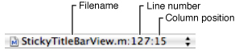

To set whether the text editor displays the column position of the insertion point, use the “Show column position” option in Text Editing preferences.

The Text Editing pane of Xcode preferences contains options that control the appearance and behavior of the text editor. Figure 4-13 shows Text Editing preferences.

__Figure 4-13__  Text Editing preferences pane

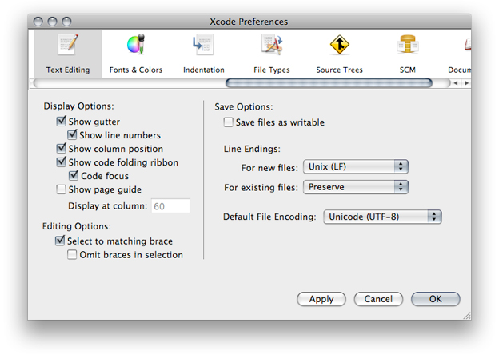

Here is what the pane contains:

- __Display Options.__ These options control the appearance of the text editor, whether it appears as a separate window or as a pane attached to another Xcode window. See [Customizing the Editor](#apple-f4xwc4dqnrsv64tfmyxwi33df52wszbpkridimbqgazdmnzzfvjvomjy) to learn more about changing the appearance of Xcode’s editor. The options are:

  - __Show gutter.__ Specifies when Xcode displays the gutter in the editor. The gutter shows information about the current file such as the location of breakpoints, line numbers, and the location of errors or warnings. If this option is selected, Xcode always shows the gutter in all open editors; otherwise, it shows the gutter only when debugging. See [Displaying the Gutter](#apple-f4xwc4dqnrsv64tfmyxwi33df52wszbpkridimbqgazdmnzzfvjvoni) for more information.
  - __Show line numbers.__ Specifies whether Xcode shows a file’s line numbers in the editor gutter. If this option is selected, Xcode shows line numbers for a file whenever the editor gutter is visible. See [Displaying the Gutter](#apple-f4xwc4dqnrsv64tfmyxwi33df52wszbpkridimbqgazdmnzzfvjvoni) for more information
  - __Show column position.__ Specifies whether Xcode shows the current position of the cursor in the Function menu of the editor. If this option is selected, Xcode shows the character position of the insertion point along the current line.
  - __Show code folding ribbon.__ Specifies whether the text editor shows the folding ribbon used to view a source file’s scope levels and to perform code folding operations. See [Scoping Code](#apple-f4xwc4dqnrsv64tfmyxwi33df52wszbpkridimbqgazdmnzzfvjvomrz) for more information.

    __Code focus.__ Specifies whether code focus is active. See [Code Focus](#apple-f4xwc4dqnrsv64tfmyxwi33df52wszbpkridimbqgazdmnzzfvjvomzu) for details.
  - __Show page guide.__ Specifies whether Xcode displays the page guide in the editor. If this option is selected, Xcode displays a gray guide line in the editor to show you the right margin of the editor; to the right of this margin, Xcode colors the background of the editor light gray. This is just a guide, and does not actually affect the margin width in the editor. See [Displaying a Page Guide](#apple-f4xwc4dqnrsv64tfmyxwi33df52wszbpkridimbqgazdmnzzfvjvomrq) for more information.

    __Display at column.__ Controls the column position at which Xcode displays the page guide. This position is specified in number of characters. To change the position at which the page guide is shown, enter a new number in the field. See [Displaying a Page Guide](#apple-f4xwc4dqnrsv64tfmyxwi33df52wszbpkridimbqgazdmnzzfvjvomrq) for more information.
- __Editing Options.__ These options control Xcode’s selection behavior for source code. The options are:

  - __Select to matching brace.__ Specifies whether Xcode automatically selects text contained in braces when you double-click the brace. If this option is selected, double-clicking a brace, bracket, or parenthesis in a source code file automatically selects the text up to, and including, the matching brace. See [Matching Parentheses, Braces, and Brackets](#apple-f4xwc4dqnrsv64tfmyxwi33df52wszbpkridimbqgazdmnzzfvbegskcinauira).
  - __Omit braces in selection.__ Specifies whether Xcode includes the braces themselves in text selected by double-clicking a brace, bracket, or parenthesis. If this option is selected, double-clicking a brace, bracket, or parenthesis selects the text between the braces, but not the braces themselves. See [Matching Parentheses, Braces, and Brackets](#apple-f4xwc4dqnrsv64tfmyxwi33df52wszbpkridimbqgazdmnzzfvbegskcinauira) for more information.
- __Save Options.__ These options let you specify how Xcode stores files that you edit in the text editor.

  - __Save files as writable.__ Specifies the permissions that Xcode uses for files that it saves. If this option is selected, Xcode adds write permission to files that you edit and save in Xcode. Otherwise, Xcode preserves permissions for files as they are on disk. Files that you create in Xcode already have write permission.
  - __Line Encodings.__ Controls the default line endings used for files in Xcode. You can use Unix, Windows, or Mac line endings for files that you open and edit in the text editor; the type of line endings used for a file can affect which file editors and other tools can interpret the file. See [Changing Line Endings](File%20Management.md#apple-f4xwc4dqnrsv64tfmyxwi33df52wszbpkridimbqgazdmnzxfvbegskfifbegsi) for more information on line endings. The menus are:

    - __For new files.__ Specifies the type of line endings used for files that Xcode creates. You can choose Unix, Mac, or Windows line endings. The default value for this setting is Unix.
    - __For existing files.__ Specifies the type of line endings used for preexisting files that you open and edit in Xcode. If you choose Unix, Mac, or Windows from this menu, Xcode saves all files that you open and edit in Xcode with line endings of this type, changing them the next time it saves the file, if necessary. If you choose Preserve from this menu, Xcode uses whatever type of line endings the file already has.
  - __Default File Encoding.__ Specifies the default file encoding that Xcode uses for new files that you create in Xcode. You can choose any of the file encoding supported by your Mac OS X system from this menu. See [Choosing File Encodings](File%20Management.md#apple-f4xwc4dqnrsv64tfmyxwi33df52wszbpkridimbqgazdmnzxfvbecqshjbbuqra) for more information.

The Indentation pane of Xcode preferences controls formatting options for files in the text editor. Figure 4-14 shows the Indentation preferences pane.

__Figure 4-14__  Indentation preferences pane

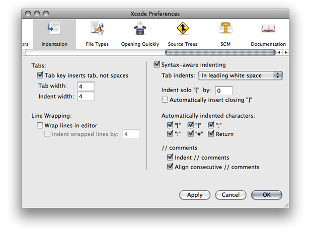

Here is what the pane contains:

- __Tabs.__ These options specify how the text editor inserts space into files while editing (see [Tab and Indent Layout Options](#apple-f4xwc4dqnrsv64tfmyxwi33df52wszbpkridimbqgazdmnzzfvbegskdi5begsi) for more information):

  - __Tab key inserts tab, not spaces.__ Specifies whether Xcode inserts tab characters when you press the Tab key in the editor. If this option is selected, pressing the Tab key inserts a Tab character. Otherwise, Xcode inserts space characters.
  - __Tab width.__ Specifies the default width, in number of characters, used to display tabs in the editor. To change the width of a tab, type a number in the text field. You can override this setting for individual files, as described in [Tab and Indent Layout Options](#apple-f4xwc4dqnrsv64tfmyxwi33df52wszbpkridimbqgazdmnzzfvbegskdi5begsi).
  - __Indent width.__ Specifies the default width, in number of characters, used to indent lines in the editor. To change the indentation width, type a number in the text field. You can override this setting for individual files, as described in [Tab and Indent Layout Options](#apple-f4xwc4dqnrsv64tfmyxwi33df52wszbpkridimbqgazdmnzzfvbegskdi5begsi).
- __Line Wrapping.__ These options specify how the text editor wraps lines in files displayed in the editor. These options affect how the file is displayed onscreen, not line breaks or other information stored with the file. See [Wrapping Lines](#apple-f4xwc4dqnrsv64tfmyxwi33df52wszbpkridimbqgazdmnzzfvbegskcijbeeqi) for more information. The options are:

  - __Wrap lines in editor.__ Specifies whether the editor wraps lines. If this option is selected, the editor wraps text to the next line when it reaches the outer edge of the text editing area onscreen. Otherwise, Xcode moves text to the next line only when a carriage return or new line characters is inserted.
  - __Indent wrapped lines by.__ Specifies how the editor indents text that it wraps to the next line. If this number is greater than 0, the editor indents wrapped text by the specified number of characters, as a visual indication that the text has been wrapped (as opposed to being moved to the next line by the insertion of a carriage return or new line character). To change the amount by which lines are indented, type a new number in the field.
- __Syntax-Aware Indenting.__ This option, and the options below it, control automatic formatting for source code in the text editor. If this option is selected, Xcode assists you in writing source code by automatically inserting formatting information appropriate for the current context. See [Indenting Code](#apple-f4xwc4dqnrsv64tfmyxwi33df52wszbpkridimbqgazdmnzzfvbuuqsfizbeqsq) to learn more. The options are:

  - __Tab indents.__ Specifies when pressing Tab in the editor inserts an indentation. You can choose the following:

    - In leading white space: Pressing Tab inserts an indentation only at the beginning of a line or following a space.
    - Never: Pressing Tab never causes an indentation.
    - Always: Pressing Tab always causes an indentation.
  - __Indent solo “{“ by.__ Controls the amount by which a left brace character ({) on a line by itself is indented. If this number is greater than 0, Xcode automatically indents a left brace that appears on a line by itself (that is, a left brace that is preceded by a newline or carriage return) by the specified number of characters. The default value of this field is 0.
  - __Automatically insert closing “}”.__ Controls whether Xcode automatically inserts a matching right brace when you type an opening brace. If this option is selected, typing an opening brace causes Xcode to insert a matching closing brace.
  - __Automatically indented characters.__ Controls which characters trigger Xcode to automatically cause an indentation. When any of the following options is selected, typing that character in an editor causes Xcode to indent the current line or the following line.
  - __Indent // comments.__ Controls whether Xcode automatically indents C++-style comments. If this option is selected, Xcode automatically indents comments beginning with `//`.
  - __Align consecutive //comments.__ Controls whether Xcode automatically indents consecutive C++-style comments to the same level.

The Code Sense pane of Xcode preferences contains options for controlling symbol indexing, the text editor’s Function menu, and its code completion interface. Figure 4-15 shows the Code Sense pane. For more information about Code Sense, see Code Sense.

__Figure 4-15__  Code Sense preferences pane

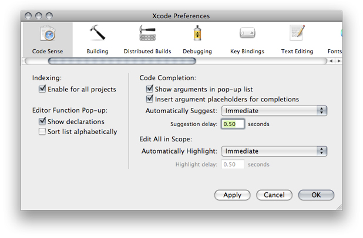

Here’s what the pane contains:

- __Indexing.__

  - __Enable for all projects:__ Specifies whether symbol indexing is active for the projects you open.

    When inactive, features that rely on this index (such as the Project Symbols smart group, refactoring, and code completion) do not work. For more information about symbol indexing, see Code Sense.
- __Editor Function Pop-up.__ This area contains options for configuring the text editor Function menu ([The Function Menu](#apple-f4xwc4dqnrsv64tfmyxwi33df52wszbpkridimbqgazdmnzzfvjvomjq)).

  - __Show declarations.__ Specifies whether the Function menu shows function and method declarations (in addition to definitions).
  - __Sort list alphabetically.__ Specifies whether the contents of the Function menu are sorted alphabetically.

    When unselected, the Function menu shows items in the order they appear in the file.
- __Code Completion.__ This area contains options for configuring code completion. For more information about code completion, see [Completing Code](#apple-f4xwc4dqnrsv64tfmyxwi33df52wszbpkridimbqgazdmnzzfvjvomrt). (Your code completion settings apply to all projects that you open.)

  - __Show arguments in pop-up list.__ Specifies whether Xcode displays arguments for functions and methods in the completion list. When this option is selected, Xcode displays the return type and arguments for functions and methods in the list of completion suggestions. Otherwise, Xcode shows only the symbol name.
  - __Insert argument placeholders for completions.__ Specifies whether Xcode inserts the arguments to a function or method when you accept a completion suggestion. When selected, inserting a function or method using code completion also inserts placeholders for arguments. Otherwise, Xcode inserts only the symbol name.
  - __Automatically Suggest.__ Specifies whether and when Xcode shows completion suggestions. You can choose between immediate and delayed suggestions.
  - __Suggestion delay.__ The number of seconds the text editor waits before showing its best completion suggestion when using delayed completion suggestions.
- __Edit All in Scope.__ This area contains options for configuring Edit All in Scope behavior (see [Editing Symbol Names](#apple-f4xwc4dqnrsv64tfmyxwi33df52wszbpkridimbqgazdmnzzfvjvonjr) for details about this feature).

  - __Automatically Highlight:__ Specifies whether and when Xcode highlights the occurrences of a symbol whose name can be edited using Edit All in Scope. You can choose between immediate and delayed suggestions.
  - __Highlight delay.__ The number of seconds the text editor waits before highlighting symbol occurrences when using delayed highlighting.

The Fonts & Colors pane of Xcode preferences (Figure 4-16) is where you configure syntax formatting, which identifies elements of the source files you edit in the text editor (see [Formatting Code](#apple-f4xwc4dqnrsv64tfmyxwi33df52wszbpkridimbqgazdmnzzfvbegskdijcecry) for details).

__Figure 4-16__  Fonts & Colors preferences pane

!

Here is what the pane contains:

- __Color Theme:__ Lists of syntax formatting themes. Each theme applies a set of fonts and colors to all the syntax formatting element categories Xcode supports.
- __Duplicate:__ Duplicates the current syntax formatting theme.
- __Delete:__ Deletes the current syntax formatting theme.
- __Category list:__ List of the syntax formatting element categories.

  To change the font or color for a category, double-click the font or color you want to change to display the Fonts window or the Colors window.

  You can select more than one category to modify the font and color for a set of categories at the same time.
- __Use syntax-based formatting:__ Activates syntax formatting.
- __Color indexed symbols:__ Specifies whether to use the project’s Code Sense index to assign symbols in source files to element categories. When turned off, the text editor uses only the file’s language to assign symbols and text to categories.
- __Use colors when printing:__ Preserves syntax formatting when you print source files from Xcode.
- __Copy colors and fonts:__ Places syntax formatting on the Clipboard when you copy text from the text editor.

[Next](Refactoring%20Code.md)[Previous](File%20Management.md)

