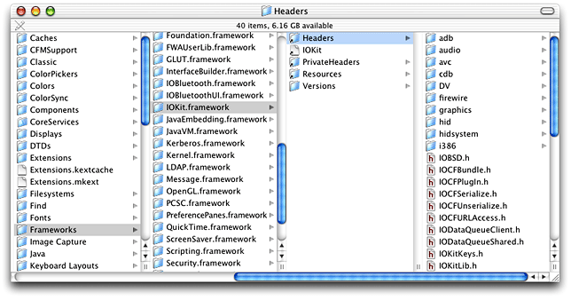
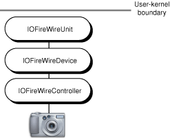
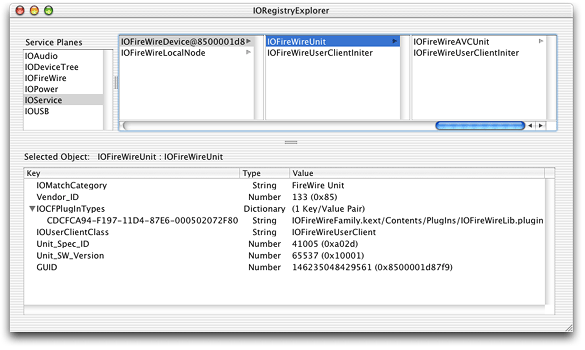
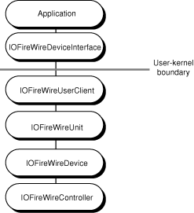
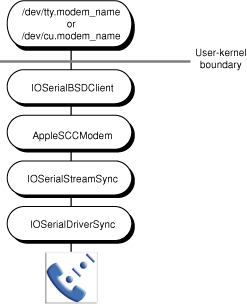
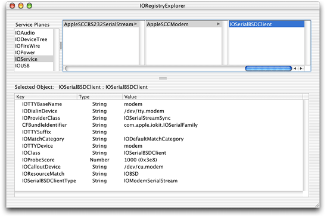
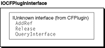
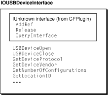

> 导航：[总目录](../../../README.md) · [documentation](../../../_indexes/documentation.md) · [Accessing Hardware From Applications](Introduction%20to%20Accessing%20Hardware%20From%20Applications.md)

[Next](Finding%20and%20Accessing%20Devices.md)[Previous](Hardware-Access%20Options.md)

# Device Access and the I/O Kit

In OS X, kernel space is the protected memory partition in which the kernel resides, while user space is memory outside the kernel’s partition. Most device drivers reside in kernel space, typically because they take primary interrupts (which requires them to live in the kernel) or because their primary client resides in the kernel (such as a device driver for an Ethernet card that resides in the kernel because the network stacks reside there).

Because only code running in the kernel can directly access hardware devices, OS X provides two mechanisms that allow your application or other user-space code to make use of kernel-resident drivers and other kernel services. These mechanisms are I/O Kit device interfaces and POSIX support, using device files.

This chapter summarizes fundamental I/O Kit concepts and terms and describes some of the actions the I/O Kit takes to support devices attached to an OS X computer. Then, it introduces device interfaces and device files, describing how they work and where they fit into the I/O Kit’s layered, runtime architecture.

As the object-oriented framework for device-driver development for OS X, the I/O Kit defines objects that represent the various hardware and software entities that form I/O connections in a running OS X system. Using these objects, the I/O Kit models the layered, provider-client relationships between devices, drivers, and driver families.

The I/O Kit also provides services, accessible through a procedural interface, for obtaining device information and accessing devices from non-kernel code. By using this interface, you can obtain the hardware support your application needs without taking on the complexity of writing kernel-resident code.

This section first defines I/O Kit terms that describe the objects you find in a running OS X system and some of the processes that act on them. Then, it summarizes the device-discovery process and how the use of device interfaces affects the layered architecture of the running system. For more in-depth coverage of the I/O Kit, see _[IOKit Fundamentals](../IOKit%20Fundamentals/Introduction%20to%20I-O%20Kit%20Fundamentals.md#apple-f4xwc4dqnrsv64tfmyxwi33df52wszbpkridambqgaydcmi)_.

The I/O Kit defines objects that represent both devices and the software that supports them. To work with device interfaces or device files, you should be familiar with the I/O Kit’s object-oriented view of the devices and software that make up a running OS X system. The following list describes the I/O Kit elements, processes, and data structures you’ll encounter in the rest of this document.

- A _family_ (or device family) is a collection of software abstractions that are common to all devices of a particular category. Families provide functionality and services to drivers (defined next). The I/O Kit defines families for bus protocols (such as USB and FireWire), storage devices, human interface devices, and many others. For a full list of families and what types of application-based access they support, see [I/O Kit Family Device-Access Support](I-O%20Kit%20Family%20Device-Access%20Support.md#apple-f4xwc4dqnrsv64tfmyxwi33df52wszbpkridgmbqgaydmojtfvbecqsdinbessq).
- A _driver_ is an I/O Kit object that manages a specific piece of hardware. When the I/O Kit loads a driver, it may need to load one or more families, too. Drivers are written as kernel extensions (or KEXTs) and are usually installed in the directory `/System/Library/Extensions`.

  Many of a driver’s characteristics are found in its property list, a text file in XML (Extensible Markup Language) format that describes the contents, settings, and requirements of the driver. A driver usually stores its property list (or `Info.plist` file) in its `Contents` directory, where you can view it using the Property List Editor.
- A _nub_ is an I/O Kit object that represents a detected, controllable entity, such as a device or logical service. A nub may represent a bus, a disk, a graphics adapter, or any number of similar entities. When it supports a specific piece of hardware, a nub can also be a driver.

  A nub supports dynamic configuration by providing a connection match point between two drivers (and, by extension, between two families). A nub can also provide services to code running in user space through a device interface (defined below).
- A _service_ is an I/O Kit entity, based on a subclass of IOService, that provides certain capabilities to other I/O Kit objects. All driver and nub classes inherit from the IOService class. In the I/O Kit’s layered architecture, each layer is a client of the layer below it and a provider of services to the layer above it. A family, nub, or driver can be a service provider to other I/O Kit objects.
- A _device interface_ is a user-space library or plug-in that provides an interface that an application can use to communicate with or control a device. A device interface communicates with its in-kernel counterpart, called a user client (defined next), to transmit commands from an application or user-space process to the in-kernel object that represents a device. A family that provides a device interface also provides a user client to handle the kernel-side communication with the device. For information on which I/O Kit families provide the device interface–user client mechanism, see [I/O Kit Family Device-Access Support](I-O%20Kit%20Family%20Device-Access%20Support.md#apple-f4xwc4dqnrsv64tfmyxwi33df52wszbpkridgmbqgaydmojtfvbecqsdinbessq).
- A _user client_ is an in-kernel object that inherits from IOService and provides a connection between an in-kernel device driver or device nub and an application or process in user space. Some documentation uses the term “user client” to refer to the combination of the user-space device interface and the in-kernel user client object, but for this discussion, “user client” refers to the in-kernel object alone.
- The _I/O Registry_ is a dynamic database that describes a collection of ”live” objects, each of which represents an I/O Kit entity (such as a driver, family, or nub). You can think of the I/O Registry as a tree with a nub representing the computer’s main logic board at the root, and various device drivers and nubs as the leaves. In response to the addition or removal of hardware or other changes in the system, the I/O Registry automatically updates to reflect the current hardware configuration. (For an in-depth look at this structure, see [The I/O Registry](https://developer.apple.com/library/archive/documentation/DeviceDrivers/Conceptual/IOKitFundamentals/TheRegistry/TheRegistry.html#//apple_ref/doc/uid/TP0000014) in _[IOKit Fundamentals](../IOKit%20Fundamentals/Introduction%20to%20I-O%20Kit%20Fundamentals.md#apple-f4xwc4dqnrsv64tfmyxwi33df52wszbpkridambqgaydcmi)_.)

  The developer version of OS X includes I/O Registry Explorer (located in `/Developer/Applications`), an application that allows you to examine the I/O Registry of your currently running system. There is also a command-line tool called `ioreg` that you can run in a Terminal window to display current I/O Registry information (the Terminal application is located in `/Applications/Utilities`). For more information about how to use `ioreg`, type `man ioreg` in a Terminal window.
- A _driver personality_ is a dictionary of key-value pairs that specify device property values, such as family type, vendor name, or product name. A driver is suitable for any device whose properties match one of the driver’s personalities. In its `Info.plist` file, a driver stores its personalities as values of the `IOKitPersonalities` key.
- _Driver matching_ is the process the I/O Kit performs at boot time (and whenever the system’s hardware configuration changes) to find in-kernel device drivers for all devices currently attached to the system. When it finds the driver personality that is most suitable for a particular device, the I/O Kit instantiates that personality, places a copy of its personality dictionary in the I/O Registry, and (in most cases) starts the driver.
- A _matching dictionary_ is a dictionary of key-value pairs that describe the properties of a device or other service. You create a matching dictionary to specify the types of devices your application needs to access. The I/O Kit provides several general keys you can use in your matching dictionary and many device families define specific keys and matching protocols. During device matching (described next) the values in a matching dictionary are compared against nub properties in the I/O Registry.
- _Device matching_ is the process of searching the I/O Registry for objects representing a specific device or device type in the current system. For example, an application or other code running in OS X can initiate a search for all USB storage devices. In device matching, the I/O Kit compares the keys and values in the matching dictionary an application supplies with a device nub’s properties stored in the I/O Registry.
- A _device file_ is a special file the I/O Kit creates in the `/dev` folder for each serial and storage device it discovers. If your application needs to access such a device, you use I/O Kit functions to get the path to the device and use the POSIX API to communicate with it.

The I/O Kit framework (stored on disk as `IOKit.framework` in `/System/Library/Frameworks`) contains a wide range of APIs that allow your application to work with devices. In addition to many folders that contain device-interface libraries and other user-space APIs for I/O Kit families, such as FireWire and Storage, the I/O Kit framework contains several files that define general I/O Kit APIs. These files, such as `IOCFPlugIn.h` (introduced in [Inside the Device-Interface Mechanism](#apple-f4xwc4dqnrsv64tfmyxwi33df52wszbpkridgmbqgaydgnzyfvbuuqkiifeemqy)) and `IOKitLib.h` (covered in [The IOKitLib API](The%20IOKitLib%20API.md#apple-f4xwc4dqnrsv64tfmyxwi33df52wszbpkridgmbqgaydgobqfvbecsseiffeisq)), provide the foundation for kernel–user space communication. [Figure 2-1](#apple-f4xwc4dqnrsv64tfmyxwi33df52wszbpkridgmbqgaydgnzyfvbuuqkjiveemqy) shows the location of the I/O Kit APIs as they appear on the desktop.

__Figure 2-1__  The I/O Kit framework

To use any of the I/O Kit APIs, your application must link with `IOKit.framework`.

At boot time and whenever a system’s hardware configuration changes, the I/O Kit discovers new devices and instantiates and loads nub and driver objects to support them. The nubs and drivers form a stack of objects that model the dynamic client-provider relationships among the various I/O Kit entities representing the hardware and software components in an I/O connection. As an example, consider the objects the I/O Kit instantiates when it discovers a FireWire device (shown in [Figure 2-2](#apple-f4xwc4dqnrsv64tfmyxwi33df52wszbpkridgmbqgaydgnzyfvbuuqkjivbuora)).

__Figure 2-2__  I/O Kit objects supporting a FireWire device

In this example, the IOFireWire family and the I/O Kit take the following steps:

1. The I/O Kit instantiates an IOFireWireController object for each FireWire hardware interface, such as FireWire OHCI (Open Host Controller Interface), on an OS X system.
2. The IOFireWire family queries each device on the bus and publishes an IOFireWireDevice object for each device that responds with its bus information.
3. In its turn, the IOFireWireDevice object queries the device and publishes an IOFireWireUnit object for each unit directory it finds on the device.

Although this is not shown in [Figure 2-2](#apple-f4xwc4dqnrsv64tfmyxwi33df52wszbpkridgmbqgaydgnzyfvbuuqkjivbuora), the I/O Kit matches drivers to particular unit types, such as SBP-2 or AV/C, which then publish nubs representing logical units.

You can also think of the driver stack as a branch in the I/O Registry tree. You can view the entities in any branch (driver stack) with I/O Registry Explorer. For example, [Figure 2-3](#apple-f4xwc4dqnrsv64tfmyxwi33df52wszbpkridgmbqgaydgnzyfvbuuqkji5beksa) shows the I/O Registry Explorer view of part of the driver stack shown in [Figure 2-2](#apple-f4xwc4dqnrsv64tfmyxwi33df52wszbpkridgmbqgaydgnzyfvbuuqkjivbuora), beginning with the IOFireWireDevice object. Note that [Figure 2-3](#apple-f4xwc4dqnrsv64tfmyxwi33df52wszbpkridgmbqgaydgnzyfvbuuqkji5beksa) also shows the IOFireWireAVCUnit object representing the logical AV/C unit.

__Figure 2-3__  I/O Kit objects supporting a FireWire device in I/O Registry Explorer

Notice the driver personality information (or, for a nub, the property table information) that the I/O Registry Explorer displays for the currently selected element. This information can help you choose key-value pairs to use for driver matching (for more information on the driver-matching process, see [Finding and Accessing Devices](Finding%20and%20Accessing%20Devices.md#apple-f4xwc4dqnrsv64tfmyxwi33df52wszbpkridgmbqgaydgnzzfvbecsseiffeisq)). For example, you might choose to look up devices with a specific vendor ID or GUID (globally unique ID), both of which are properties of a FireWire unit, as shown in [Figure 2-3](#apple-f4xwc4dqnrsv64tfmyxwi33df52wszbpkridgmbqgaydgnzyfvbuuqkji5beksa).

When you use a device interface to communicate with a device, a user client object joins the driver stack. A family that provides a device interface also provides the user client object that transmits an application’s commands from the device interface to the device. When your application requests a device interface for a particular device, the device’s family instantiates the appropriate user client object, typically attaching it in the I/O Registry as a client of the device nub.

Revisiting the example of the FireWire device shown in [Figure 2-2](#apple-f4xwc4dqnrsv64tfmyxwi33df52wszbpkridgmbqgaydgnzyfvbuuqkjivbuora), the acquisition of the IOFireWireDeviceInterface that the IOFireWire family provides results in the stack shown in [Figure 2-4](#apple-f4xwc4dqnrsv64tfmyxwi33df52wszbpkridgmbqgaydgnzyfvbuuqkcifcusrq).

__Figure 2-4__  Adding a device interface to the FireWire driver stack

When the I/O Kit discovers a serial or storage device, it builds a stack of drivers and nubs similar to those shown in [Figure 2-2](#apple-f4xwc4dqnrsv64tfmyxwi33df52wszbpkridgmbqgaydgnzyfvbuuqkjivbuora) for the FireWire device. In addition, however, the I/O Kit automatically creates a device file in the `/dev` directory, even if there is no current request for user-space access to the device. [Figure 2-5](#apple-f4xwc4dqnrsv64tfmyxwi33df52wszbpkridgmbqgaydgnzyfvkfawcsivddcmjq) shows the driver stack for a serial device.

__Figure 2-5__  I/O Kit objects supporting a serial device

As with the FireWire device objects shown in [Figure 2-3](#apple-f4xwc4dqnrsv64tfmyxwi33df52wszbpkridgmbqgaydgnzyfvbuuqkji5beksa), you can use the I/O Registry Explorer application to view the objects supporting a serial device, as [Figure 2-6](#apple-f4xwc4dqnrsv64tfmyxwi33df52wszbpkridgmbqgaydgnzyfvbuuqkejjceuqq) shows.

__Figure 2-6__  I/O Kit objects supporting a serial device in I/O Registry Explorer

This section takes a closer look at the two main gateways to user-space device access, device interfaces and device files. The information in this section provides a conceptual overview of these mechanisms and does not constitute a step-by-step guide for using them. If you’re more interested in finding out how to use device interfaces or device files in your application, you can skip ahead to [Finding and Accessing Devices](Finding%20and%20Accessing%20Devices.md#apple-f4xwc4dqnrsv64tfmyxwi33df52wszbpkridgmbqgaydgnzzfvbecsseiffeisq).

This section concludes with a brief description of how the I/O Kit uses Mach ports to allow user-space processes to communicate with the kernel.

Accessing hardware in OS X with a device interface is similar in concept to using the Device Manager in previous versions of the Mac OS. Instead of calling Device Manager functions such as `OpenDriver`, `CloseDriver`, and `Control`, however, you call functions from the I/O Kit to obtain a device interface, then call functions the device interface defines, such as `open`, `close`, and `getInquiryData`.

A _device interface_ is a plug-in interface that conforms to the Core Foundation plug-in model (described in Core Foundation developer documentation, available in the [Core Foundation Reference Library](https://developer.apple.com/library/archive/navigation/redirect.html#//apple_ref/doc/uid/TP30000943-TP30000421)). As such, it is compatible with the basics of Microsoft’s COM (Component Object Model) architecture. In practice, the only elements a device interface shares with COM are the layout of the interface itself (which conforms to the COM guidelines) and its inheritance from the COM-compatible `IUnknown` interface.

Following the Core Foundation plug-in model, an I/O Kit family that provides a device interface first defines a type that represents the collection of interfaces it supports. Then, it defines each interface, declaring the functions the interface implements. The type and the interfaces each receive a UUID (universal unique identifier, or ID), a 128-bit value that uniquely and permanently identifies it. The family makes these UUIDs available as a predefined name your application uses when it requests a device interface. For example, the IOFireWire family defines its version 5 FireWire device interface UUID as `kIOFireWireDeviceInterfaceID_v5`, which is much easier to use than the UUID string itself, `127A12F6-C69F-11D6-9D11-0003938BEB0A`.

Before an application can get a specific, family-defined device interface, it first gets an instance of an intermediate plug-in of type IOCFPlugInInterface. Defined in `IOCFPlugIn.h` (in the I/O Kit framework), the IOCFPlugInInterface structure begins with the `IUNKNOWN_C_GUTS` macro, defined in `CFPlugInCOM.h` (in the Core Foundation framework). This macro expands into the structure definition of the COM `IUnknown` interface. This means that an instance of the IOCFPlugInInterface begins with the `IUnknown` interface functions, required for all interfaces based on the Core Foundation plug-in model, shown in [Figure 2-7](#apple-f4xwc4dqnrsv64tfmyxwi33df52wszbpkridgmbqgaydgnzyfvbuuqkeifeeoqq).

__Figure 2-7__  The IOCFPlugInInterface functions

The `AddRef` and `Release` functions operate on the reference counts of the IOCFPlugInInterface object and the `QueryInterface` function creates new instances of the passed-in interface type, such as a device interface an I/O Kit family defines.

The `IOCFPlugIn.h` file also defines the function `IOCreatePlugInInterfaceForService`, which creates a new IOCFPlugInInterface object, and `IODestroyPlugInInterface`, which destroys the specified IOCFPlugInInterface object.

After your application gets the IOCFPlugInInterface object, it then calls its `QueryInterface` function, supplying it with (among other arguments) the family-defined UUID name of the particular device interface the application needs. The `QueryInterface` function returns an instance of the requested device interface and the application then has access to all the functions the device interface provides. For example, the USB family’s device interface for USB devices provides the functions shown in [Figure 2-8](#apple-f4xwc4dqnrsv64tfmyxwi33df52wszbpkridgmbqgaydgnzyfvbuuqkiireuuqq).

__Figure 2-8__  Some of the IOUSBDeviceInterface functions

As shown in [Figure 2-8](#apple-f4xwc4dqnrsv64tfmyxwi33df52wszbpkridgmbqgaydgnzyfvbuuqkiireuuqq), the family-defined device interface also begins with the `AddRef`, `Release`, and `QueryInterface` functions. This is because the family’s device interface, like the IOCFPlugInInterface, fulfills the COM requirement that all interfaces must inherit from the `IUnknown` interface. Your application will probably never need to use these three functions from within the device interface, however, because most family-defined device interfaces provide their own accessor and reference-counting functions.

An application that has acquired a device interface for a device can act as a user-space driver for that device. For example, an application can drive a scanner that complies with the SCSI Architecture Model specifications because Apple does not supply an in-kernel driver for such a device. See the documentation for the family of the device you want to access for more information.

Darwin, the OS X kernel, implements a version of 4.4BSD, a UNIX-based operating system that serves as the basis for the file systems and networking facilities of OS X. In addition, Darwin’s implementation of BSD includes much of the POSIX API. Darwin exports programmatic interfaces consistent with the POSIX API to application space that allow applications to communicate with serial, storage, and network devices through device files.

In a UNIX file system, an I/O _device file_ is a special file that represents a block or character device such as a terminal, disk drive, printer, scanner, or tape drive. In essence, the device file acts as a buffer or stream of data for the device. Historically, device files reside in the `/dev` directory and have standard names, such as `mt0` for the first magnetic tape device, `tty0` for the first terminal, and so on. Because a UNIX system treats a device file like any other disk file, you can use UNIX commands with device files to perform input and output operations on devices. When you send data to a device file, the kernel intercepts it and redirects it to the device. Similarly, when a process reads from a device file, the kernel gets the data from the device and passes it to the application.

As it does with other devices, when the I/O Kit discovers a serial or storage device, it builds up a driver stack to support it. In addition, it instantiates a BSD user-client object that creates a device file node in the `/dev` directory. The BSD user-client object acts as a conduit between a client accessing a device through a device file and the in-kernel objects representing the device. For a serial device, the I/O Kit instantiates an IOSerialBSDClient object and for a storage device, the I/O Kit instantiates an IOMediaBSDClient object.

When an application needs to access a serial or storage device for which it does not already have the device-file path, it can use I/O Kit functions to find a matching device in the I/O Registry. The application can then examine the object’s properties to get its device-file path name. The properties you use to create the pathname string vary somewhat depending on whether you’re accessing a serial or storage device; for more details, see [Finding and Accessing Devices](Finding%20and%20Accessing%20Devices.md#apple-f4xwc4dqnrsv64tfmyxwi33df52wszbpkridgmbqgaydgnzzfvbecsseiffeisq).

In [Figure 2-9](#apple-f4xwc4dqnrsv64tfmyxwi33df52wszbpkridgmbqgaydgnzyfvbuuqkkineuqri), the I/O Registry Explorer application displays the properties of the IOSerialBSDClient for a modem.

__Figure 2-9__  An IOSerialBSDClient object in I/O Registry Explorer

Because of the dynamic and parallel nature of an OS X system, a device may receive a different device-file name every time the I/O Kit discovers it. For this reason, you must search the I/O Registry for the device you’re interested in to get the current device-file path before you attempt to access the device instead of hard-coding a device-file name, such as `/dev/cu.modem` or `/dev/rdisk0`, in your application. When you have the correct path to the device (including the device-file name), you then use either POSIX functions, such as`open` and`close`, to communicate with a storage device or the POSIX `termios` API for traditional UNIX serial port access to a serial device. For serial devices, data is also routed through PPP via the device file.

For information on the POSIX standard, see [http://standards.ieee.org](http://standards.ieee.org/). For a POSIX programming reference, see _POSIX Programmer’s Guide: Writing Portable Unix Programs with the POSIX_ by Donald A. Lewine.

If your application needs to access a network connection, it does so using a particular IP address and standard socket functions. The I/O Kit builds up stacks of objects to support networking devices that are similar to the driver stacks for other devices. Because your application is concerned with accessing a connection instead of a device object, however, finding these objects in the I/O Registry is unnecessary.

OS X provides networking APIs in Carbon and Cocoa that should handle most standard networking requirements for applications. You can also use the BSD sockets API to obtain network services. A recommended network programming book is _Unix Network Programming, Volume 1, Second Edition_, by W. Richard Stevens, Prentice-Hall PTR, 1998.

Whether your application uses device interfaces or device files to access devices, it must communicate with the I/O Kit. The I/O Kit API (in the I/O Kit framework) includes functions to search the I/O Registry for specific devices or groups of devices, to access I/O Kit objects, and to access device and driver personality properties published in the I/O Registry. When an application uses these functions, it communicates with the I/O Kit through a Mach port, a unidirectional communication channel between a client that requests a service and a server (in this case, the I/O Kit) that provides the service.

Darwin’s fundamental services and primitives are based on an Apple-enhanced version of Mach 3.0. Apple’s improvements allow Mach to provide object-based APIs with communication channels (such as ports), a complete set of IPC (interprocess communication) primitives, and improved portability, among other features. When an application or other user-space process communicates with the I/O Kit, it does so by using RPC (remote procedure calls) on the I/O Kit’s master port.

Specifically, your application requests the I/O Kit master port, using the I/O Kit function `IOMasterPort`, before it attempts to access any in-kernel objects, such as I/O Registry objects that represent devices. (Alternatively, it can use the convenience constant `kIOMasterPortDefault` to access the I/O Kit master port—for more information on how to do this, see [Getting the I/O Kit Master Port](Finding%20and%20Accessing%20Devices.md#apple-f4xwc4dqnrsv64tfmyxwi33df52wszbpkridgmbqgaydgnzzfvbecqshifeuqrq).)

The `IOMasterPort` function calls the `host_get_io_master` function of `mach_host.c`, which returns a send right to the application. This means that the application has the right to use the port to access an object on the other side of the port, in this case, an I/O Kit object.

Don’t worry if you’re not knowledgeable about Mach. Except for the acquisition of the I/O Kit master port and some reference-counting issues (discussed in [Object Reference-Counting and Introspection](The%20IOKitLib%20API.md#apple-f4xwc4dqnrsv64tfmyxwi33df52wszbpkridgmbqgaydgobqfvbecqsdinceqrq)), Darwin’s Mach-based infrastructure is seldom exposed when using the I/O Kit to access hardware. If you’re interested in learning more about how Darwin uses Mach, however, see _[Kernel Programming Guide](../../Darwin/Kernel%20Programming%20Guide/About%20This%20Document.md#apple-f4xwc4dqnrsv64tfmyxwi33df52wszbpkridgmbqgaydsmbv)_ for a good introduction.

[Next](Finding%20and%20Accessing%20Devices.md)[Previous](Hardware-Access%20Options.md)

