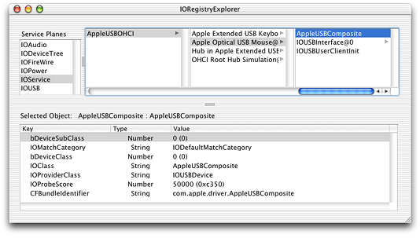
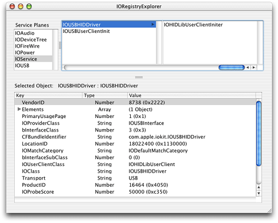

> 导航：[总目录](../../../README.md) · [documentation](../../../_indexes/documentation.md) · [Accessing Hardware From Applications](Introduction%20to%20Accessing%20Hardware%20From%20Applications.md)


[Next](The%20IOKitLib%20API.md)[Previous](Device%20Access%20and%20the%20I-O%20Kit.md)

# Finding and Accessing Devices

This chapter assumes you have an application or other user-space code that needs to access one or more specific types of device and that you:

- Have determined that your application can’t satisfy its hardware needs with the higher-level APIs described in [Hardware-Access Options](Hardware-Access%20Options.md#apple-f4xwc4dqnrsv64tfmyxwi33df52wszbpkridgmbqgaydgnzxfvbecsseiffeisq)
- Are familiar with the I/O Kit summary information in [Device Access and the I/O Kit](Device%20Access%20and%20the%20I-O%20Kit.md#apple-f4xwc4dqnrsv64tfmyxwi33df52wszbpkridgmbqgaydgnzyfvbecsseiffeisq)
- Want to know how to access hardware with an I/O Kit device interface or using the POSIX API

This chapter provides a generic blueprint for accessing devices with I/O Kit device interfaces and device files. It describes several ways to find devices in the I/O Registry and how to examine each device you find. It then describes how to access a device through a device interface or a device file.

Your code will implement many of the functions discussed in this chapter because some actions, such as getting a Mach port to communicate with the I/O Kit and looking up your devices in the I/O Registry, are common to all applications that use the I/O Kit API to access hardware.

This chapter describes how to use several I/O Kit and Core Foundation functions. You can view the header file describing the I/O Kit functions in `/System/Library/Frameworks/IOKit.framework/Headers/IOKitLib.h` and the Core Foundation functions in various files in `/System/Library/Frameworks/CoreFoundation.framework/Headers`. You can also view header documentation for these files on disk in `/Developer/Documentation` or on the web in the Device Drivers Reference Library. Complete sample projects are available in [Sample Code > Hardware & Drivers](https://developer.apple.com/library/archive/navigation/redirect.html#//apple_ref/doc/uid/TP30000925-TP40003576-TP30000511) and, when you install the Developer package, in `/Developer/Examples/IOKit`.

Before you can communicate with your device through a device interface or using POSIX functions, you must first find it. If your device is plugged in, it’s represented in the I/O Registry, the dynamically updated database of all I/O Kit objects that make up a running OS X system.

The I/O Kit provides functions you can use to find devices matching your criteria in the I/O Registry. This section describes the device-matching process in detail, showing how to use I/O Kit functions to create matching dictionaries and look up matching devices in the I/O Registry.

Applications that use the I/O Kit to access hardware are typically looking for a particular device, such as an ATA, USB, FireWire, or other device. In the general case, if the desired device is plugged in to an OS X system, there is an object that represents it attached in the I/O Registry. The process of finding this object is called _device matching_.

Recall that at boot time (and whenever devices are attached or removed), the I/O Kit:

- Instantiates a nub object that represents the device
- Attaches the nub to the I/O Registry
- Registers the nub

The device family publishes device properties in the nub object, which the I/O Kit uses to find a suitable driver for the device. You can view these properties with the I/O Registry Explorer application (available at `/Developer/Applications`) or on the command line with `ioreg`.

To find devices in the I/O Registry, you perform the following steps:

1. Get the I/O Kit master port to communicate with the I/O Kit.
2. Find the appropriate keys and values that sufficiently define the target device or set of devices.
3. Use the key-value pairs to create a matching dictionary.
4. Use the matching dictionary to look up matching devices in the I/O Registry.

To perform these steps, you use a combination of I/O Kit and Core Foundation functions. The following sections describe each of these steps in detail.

When your application uses functions that communicate directly with objects in the kernel, such as objects that represent devices, it does so through a Mach port, namely, the I/O Kit master port. Several I/O Kit functions require you to pass in an argument identifying the port you’re using. Starting with OS X version 10.2, you can fulfill this requirement in either of two ways:

- You can get the I/O Kit master port from the function [IOMasterPort](https://developer.apple.com/documentation/iokit/1514652-iomasterport) and pass that port to the I/O Kit functions that require a port argument.
- You can pass the constant [kIOMasterPortDefault](https://developer.apple.com/documentation/iokit/kiomasterportdefault) to all I/O Kit functions that require a port argument.

In versions of OS X prior to OS X version 10.2, an application was required to use the first option and explicitly request the I/O Kit master port (you will encounter this procedure in older documentation and sample code). If you choose this method, you add code like the following to your application:

```
mach_port_t myMasterPort;
kern_return_t result;

result = IOMasterPort(MACH_PORT_NULL, &myMasterPort);
```

Then, in calls to I/O Kit functions that require a port argument, such as [IOServiceGetMatchingServices](https://developer.apple.com/documentation/iokit/1514494-ioservicegetmatchingservices), you pass in `myMasterPort`, as in this example:

```
IOServiceGetMatchingServices(myMasterPort, myMatchingDictionary,
                            &myIterator);
```

When you’re completely finished with the port you received from `IOMasterPort`, you should release it, using `mach_port_deallocate`. Although multiple calls to `IOMasterPort` will not result in leaking ports (each call to `IOMasterPort` adds another send right to the port), it’s good programming practice to deallocate the port when you’re finished with it.

Starting with OS X version 10.2, you can bypass this procedure entirely and use instead the convenience constant `kIOMasterPortDefault` (defined in `IOKitLib.h` in the I/O Kit framework). This means that when you call a function that requires the I/O Kit master port, such as `IOServiceGetMatchingServices`, you can pass in `kIOMasterPortDefault` instead of the `mach_port_t` object you get from `IOMasterPort`, as in this example:

```
IOServiceGetMatchingServices(kIOMasterPortDefault, myMatchingDictionary,
                            &myIterator);
```


An application begins device matching by creating a matching dictionary that defines which device (or set of devices) the application needs to access. A matching dictionary is a Core Foundation [CFMutableDictionaryRef](https://developer.apple.com/documentation/corefoundation/cfmutabledictionaryref) object, containing a set of key-value pairs that describe particular device properties.

You have a few options for obtaining keys and values for device matching:

- You can obtain matching keys from header files in `Kernel.framework` or `IOKit.framework` and you can define constants for property values.
- You can examine driver personality information that is stored in on-disk drivers.
- You can examine objects in the I/O Registry to obtain property information for the devices they represent.

Each of these options is described in the following sections.

The file `IOKitKeys.h` (located in the I/O Kit framework) defines many general matching keys, some of which are shown in [Listing 3-1](#apple-f4xwc4dqnrsv64tfmyxwi33df52wszbpkridgmbqgaydgnzzfvkfawcsivddcmbu).

__Listing 3-1__  Matching keys from IOKitKeys.h

```
// Keys for matching IOService properties by name
#define kIOProviderClassKey     "IOProviderClass"
#define kIONameMatchKey         "IONameMatch"
#define kIOPropertyMatchKey     "IOPropertyMatch"
#define kIOPathMatchKey         "IOPathMatch"
#define kIOLocationMatchKey     "IOLocationMatch"
#define kIOResourceMatchKey     "IOResourceMatch"
```

[Figure 3-1](#apple-f4xwc4dqnrsv64tfmyxwi33df52wszbpkridgmbqgaydgnzzfvkfawcsivddcmbv) shows the AppleUSBComposite driver personality as it appears in I/O Registry Explorer (the AppleUSBComposite driver matches on composite-class USB devices for which there are no vendor-specific drivers). Notice that several of the keys in the AppleUSBComposite personality are defined in `IOKitKeys.h`.

__Figure 3-1__  The I/O Registry Explorer application, showing various keys and values for the AppleUSBComposite driver



One key of particular importance is the `IOProviderClass` key, which is included in all driver personalities. This key specifies the name of the nub class or nub superclass the driver attaches to. Although all device-matching dictionaries contain this key, few contain only this key because the resulting set of matching devices would be very large.

In most cases, you need to add more key-value pairs to make your matching dictionary more specific. By convention, keys for specific device properties are defined in device header files, such as `IOSerialKeys.h`, which defines property keys for serial devices, and `IOHIDKeys.h`, which defines property keys for HID (Human Interface Device) class devices. You can find these header files among the headers in the I/O Kit or Kernel frameworks. A partial listing of `IOHIDKeys.h` is shown in [Listing 3-2](#apple-f4xwc4dqnrsv64tfmyxwi33df52wszbpkridgmbqgaydgnzzfvbuuqkiinbuurq).

__Listing 3-2__  HID class device matching keys from IOHIDKeys.h

```
#define kIOHIDDeviceKey                     "IOHIDDevice"
#define kIOHIDTransportKey                  "Transport"
#define kIOHIDVendorIDKey                   "VendorID"
#define kIOHIDProductIDKey                  "ProductID"
#define kIOHIDVersionNumberKey              "VersionNumber"
#define kIOHIDManufacturerKey               "Manufacturer"
#define kIOHIDProductKey                    "Product"
#define kIOHIDSerialNumberKey               "SerialNumber"
#define kIOHIDLocationIDKey                 "LocationID"
#define kIOHIDPrimaryUsageKey               "PrimaryUsage"
#define kIOHIDPrimaryUsagePageKey           "PrimaryUsagePage"
```

Your application must supply a value for each device-property key it uses in a matching dictionary. You may have access to header files that define values for these keys—for example, you may be working on an application to access a device driver supplied by your own company. If you don’t have predefined header files, you can define your own constants. For example, you can define property value constants for a device whose driver properties you have found with the I/O Registry Explorer application, as described in [Examining the I/O Registry](#apple-f4xwc4dqnrsv64tfmyxwi33df52wszbpkridgmbqgaydgnzzfvbecqsgindeesa).

As a further example, suppose you have examined the keys and values for the driver of type IOUSBHIDDriver, in this case a driver for a joystick, shown in [Figure 3-2](#apple-f4xwc4dqnrsv64tfmyxwi33df52wszbpkridgmbqgaydgnzzfvbuuqkeijeumsq).

__Figure 3-2__  Some keys and values for a HID class device, shown in I/O Registry Explorer



To find the device this driver supports, you set up a matching dictionary to look up all HID class devices, using the `kIOHIDDeviceKey` (shown in [Listing 3-2](#apple-f4xwc4dqnrsv64tfmyxwi33df52wszbpkridgmbqgaydgnzzfvbuuqkiinbuurq)). Then, you can narrow the search to HID class devices on the USB bus by setting the transport key (identified by the constant `kIOHIDTransportKey`  from `IOHIDKeys.h`) to the value “USB” as defined by the following constant in your code:

```
#define kMyDeviceTransportValue "USB"
```

For more detail on how to modify a matching dictionary, see [Setting Up a Matching Dictionary to Find Devices](#apple-f4xwc4dqnrsv64tfmyxwi33df52wszbpkridgmbqgaydgnzzfvbecqskjjcumqq).

Another way to get the keys and values you need to describe a device is to examine the driver personality information in a device’s on-disk driver.

Before a device driver is loaded, it is stored on disk or in ROM as a kernel extension, or KEXT. KEXTs are usually located in `/System/Library/Extensions`. A KEXT file on disk is a bundle that contains other files and folders. Each driver KEXT includes an information property list, in XML format, typically in a file named `Info.plist`. The property list includes one or more driver personalities—dictionaries whose properties specify which devices the driver is suitable to manage.

A KEXT usually stores its `Info.plist` file in its `Contents` directory. You can examine its property list with the Property List Editor application (which is located in `/Developer/Applications`), by displaying it in the Terminal application (using `more` or another text-display command), or by opening the property list with an application such as Xcode. [Listing 3-3](#apple-f4xwc4dqnrsv64tfmyxwi33df52wszbpkridgmbqgaydgnzzfvbecqsjijeuuri) shows a partial dictionary listing for the AppleFWAudio driver. It contains keys such as the class key and the provider class key, as well as values for these keys (the strings “AppleFWAudioDevice” and “IOFireWireAVCUnit,” respectively).

__Listing 3-3__  A partial listing of the personality dictionary for the AppleFWAudio driver

```
    <key>IOKitPersonalities</key>
    <dict>
        <key>AppleFWAudioDevice (AVC)</key>
        <dict>
            <key>CFBundleIdentifier</key>
            <string>com.apple.driver.AppleFWAudio</string>
            <key>IOClass</key>
            <string>AppleFWAudioDevice</string>
            <key>IOProviderClass</key>
            <string>IOFireWireAVCUnit</string>
            ...
        </dict> ...
```

By examining a driver’s personality dictionary, your application can determine the keys and values to put in a matching dictionary to specify that driver’s device.

You can examine the I/O Registry to obtain driver personality keys and values to use in a matching dictionary. When the I/O Kit loads a driver for a device, it stores a copy of the matching personality information for that device in the I/O Registry. The developer version of OS X includes the I/O Registry Explorer application, which displays the I/O Registry for your currently running system. You can see examples of I/O Registry Explorer’s display in [Figure 3-1](#apple-f4xwc4dqnrsv64tfmyxwi33df52wszbpkridgmbqgaydgnzzfvkfawcsivddcmbv) and [Figure 3-2](#apple-f4xwc4dqnrsv64tfmyxwi33df52wszbpkridgmbqgaydgnzzfvbuuqkeijeumsq).

The developer version of OS X also includes `ioreg`, a tool you can use to examine the I/O Registry. You run the tool in a Terminal window to display I/O Registry information for your current system. Using the application or the tool, you can examine the personality information of loaded drivers and the property information in device nubs.

If you find driver personality keys and values you want to use in your application, you may be able to obtain constants for them in Apple or third-party headers, or you may need to define your own constants. For more information, see [Personality Property Keys and Values](#apple-f4xwc4dqnrsv64tfmyxwi33df52wszbpkridgmbqgaydgnzzfvbecqsjivcukra).

When you’ve determined the keys and values that define your device, you can use that information to set up a matching dictionary to find the device in the I/O Registry. The I/O Kit provides functions that create a CFMutableDictionary object containing a specific key and the value you pass to it. Bear in mind, however, that you are not limited by the dictionaries these functions create. If you require a different or more focused search, you can modify these dictionaries or even create your own, as described later in this section.

You can use any of the following I/O Kit functions to create a matching dictionary:

- [IOServiceMatching](https://developer.apple.com/documentation/iokit/1514687-ioservicematching) creates a dictionary you can use to match on an object’s class or superclass. The dictionary that `IOServiceMatching` creates consists of the `IOProviderClass` key and the value you pass to `IOServiceMatching`.

  You can initiate a very broad search of the I/O Registry by using `IOServiceMatching` to create a dictionary that matches on a specific object class (and its subclasses). For example, you can create a dictionary to match on all objects of class IOUSBDevice by using code like the following:

```
CFMutableDictionaryRef myUSBMatchDictionary = NULL;
myUSBMatchDictionary = IOServiceMatching(kIOUSBDeviceName);
```
- [IOServiceNameMatching](https://developer.apple.com/documentation/iokit/1514416-ioservicenamematching) creates a dictionary that consists of the key `IONameMatch` and the value you pass to the function.

  You might use `IOServiceNameMatching` to create a dictionary that matches on a device’s name, rather that its class, perhaps if your company’s device has a unique name. For example:

```
CFMutableDictionaryRef myCompanyDeviceMatchDictionary = NULL;
myCompanyDeviceMatchDictionary = IOServiceNameMatching("MyCompany");
```
- [IOBSDNameMatching](https://developer.apple.com/documentation/kernel/1575336-iobsdnamematching) creates a dictionary you can use to find devices that have device-file representations in the BSD layer, such as storage devices. The dictionary the `IOBSDNameMatching` function creates consists of the `kIOBSDNameMatching` key (defined in `IOKitServer.h`) and the name of the device file you pass to the function.

  If you’ve determined the device-file name of your device (by, for example, looking in the `/dev` directory using the Terminal application), you can create a dictionary to match on it using the `IOBSDNameMatching` function, using code like the following:

```
CFMutableDictionaryRef myBSDMatchDictionary = NULL;
myBSDMatchDictionary = IOBSDNameMatching(kIOMasterPortDefault, 0,
                            "disk1s8");
```

  Note that `IOBSDNameMatching` expects only the device-file name in the last parameter, not the complete path.

  It’s possible for a storage device to receive a different device-file name each time the I/O Kit discovers it, however, so your code should not rely on a device-file name remaining unchanged.

You use the dictionaries these I/O Kit functions create to pass to one of the I/O Kit look-up functions (described in [Looking Up Devices in the I/O Registry](#apple-f4xwc4dqnrsv64tfmyxwi33df52wszbpkridgmbqgaydgnzzfvbecqsfivbegsq)). The I/O Kit look-up functions each consume one reference to the dictionary. If you use the dictionary in some other way, however, you must use `CFRelease` to release it when you’re finished.

The I/O Kit dictionary-creation functions each create a dictionary with a single key-value pair. Unless you’re looking for a device that is sufficiently described by such a key-value pair, you probably want to either modify one of these dictionaries or create your own.

Many I/O Kit families define matching rules that help you narrow down your search. The USB family, for example, bases its matching rules on the USB Common Class specification. Before you modify an existing dictionary or create one of your own, you should become thoroughly familiar with your device family’s matching rules. This is especially important when you use your matching dictionary to search the I/O Registry. The I/O Kit look-up functions apply family-defined matching rules so it is essential for your matching dictionary to contain the correct combination of properties.

To modify an existing dictionary, you get a generic dictionary, such as one created by `IOServiceMatching`, and use the Core Foundation function [CFDictionaryAddValue](https://developer.apple.com/documentation/corefoundation/1516777-cfdictionaryaddvalue) to add other key-value pairs. For example, to find a FireWire unit, you can call `IOServiceMatching` to create a dictionary containing the key `IOProviderClass` and the value `IOFireWireUnit`. Then, a call to `CFDictionaryAddValue` modifies the dictionary by adding the IOFireWire family–defined key `Unit_SW_Version` and the application-defined value `myFireWireUnitSWVersionID`. [Listing 3-4](#apple-f4xwc4dqnrsv64tfmyxwi33df52wszbpkridgmbqgaydgnzzfvbecqsdivbeesq) shows how to do this.

__Listing 3-4__  Modifying a matching dictionary

```
CFMutableDictionaryRef  matchingDictionary =
                                    IOServiceMatching("IOFireWireUnit" );
UInt32 value;
CFNumberRef cfValue;
value = myFireWireUnitSwVersionID;
cfValue = CFNumberCreate( kCFAllocatorDefault, kCFNumberSInt32Type, &value );
CFDictionaryAddValue( matchingDictionary, CFSTR( "Unit_SW_Version" ),
                        cfValue);
CFRelease( cfValue );
```

Occasionally, you may find that you must perform a look-up on a handful of properties that don’t follow any device family’s matching rules. Perhaps there are no family-defined matching rules for the device you’re interested in or you’re creating a tool to test device matching. Although you should always follow your device family’s matching rules (when they exist), you can use the special `IOPropertyMatch` key (defined in `IOKitKeys.h` in the I/O Kit framework) to create a dictionary containing a set of arbitrary matching properties.

To do this, you create two dictionaries: one that contains the set of key-value pairs that describe your device and one that contains the `IOPropertyMatch` key and your first dictionary as its value. You use the Core Foundation function [CFDictionaryCreateMutable](https://developer.apple.com/documentation/corefoundation/1516791-cfdictionarycreatemutable) to create both dictionaries. The following code fragment shows how to create the subdictionary (the dictionary containing your key-value pairs that you’ll place in your matching dictionary):

```
CFMutableDictionaryRef mySubDictionary;

mySubDictionary = CFDictionaryCreateMutable(kCFAllocatorDefault, 0,
                    &kCFTypeDictionaryKeyCallBacks,
                    &kCFTypeDictionaryValueCallBacks);
CFDictionarySetValue(mySubDictionary, CFSTR(kMyDevicePropertyKey),
                    CFSTR(kMyDevicePropertyValue));
```

Now you use `CFDictionaryCreateMutable` again, this time to create your matching dictionary. The matching dictionary should contain only the key `IOPropertyMatch` and your subdictionary as its value. The `IOPropertyMatch` key signals the I/O Kit to match on the set of properties in the subdictionary without regard to any family-defined matching rules. The following code fragment shows how to create your matching dictionary:

```
CFMutableDictionaryRef myMatchingDictionary;

myMatchingDictionary = CFDictionaryCreateMutable(kCFAllocatorDefault, 0,
                    &kCFTypeDictionaryKeyCallBacks,
                    &kCFTypeDictionaryValueCallBacks);
CFDictionarySetValue(myMatchingDictionary, CFSTR(kIOPropertyMatchKey),
                    mySubDictionary);
```

The callback constants [kCFTypeDictionaryKeyCallBacks](https://developer.apple.com/documentation/corefoundation/kcftypedictionarykeycallbacks) and [kCFTypeDictionaryValueCallBacks](https://developer.apple.com/documentation/corefoundation/kcftypedictionaryvaluecallbacks) define Core Foundation callback structures you can use when the keys and values in your dictionary are all CFType-derived objects. You can find documentation about these structures in the [Core Foundation Reference Library](https://developer.apple.com/library/archive/navigation/redirect.html#//apple_ref/doc/uid/TP30000943-TP30000421).

You set up a matching dictionary to find serial or storage devices using the same I/O Kit dictionary-creation functions you use for other types of matching dictionaries. As with other devices, the provider-class name you use to create a matching dictionary depends on the type of device you’re looking for:

- All serial devices can be identified by the provider class IOSerialBSDClient. The `IOProviderClass` key you send to `IOServiceMatching` to create a matching dictionary is `kIOSerialBSDServiceValue`, defined in `IOSerialKeys.h` in the I/O Kit framework.

  Because each serial device object in the I/O Registry has a property with the key `kIOSerialBSDTypeKey`, you can refine your dictionary to match on specific types of serial devices. Currently, the possible values for this key (also defined in `IOSerialKeys.h`) are `kIOSerialBSDAllTypes`, `kIOSerialBSDModemType`, or `kIOSerialBSDRS232Type`.
- Storage device objects are members of the Storage family and their provider class is usually IOMedia, but can also depend on the device type. CD devices, for example, are subclasses of IOCDMedia. Check the Storage family header files (available in the I/O Kit framework) for the appropriate provider-class key to pass to `IOServiceMatching`.

  Also check the header files for additional keys and values you can use to refine your matching dictionary, such as the `kIOMediaEjectableKey`, which identifies whether the media is ejectable.

After you’ve created a matching dictionary, you pass it to one of the I/O Kit look-up functions. If devices matching your criteria exist in the I/O Registry, the look-up function returns an iterator you can use to access each matching object.

Device look-up is at the heart of the device-matching process: It consists of searching the I/O Registry for device objects that match the criteria specified in a matching dictionary. The I/O Kit contains a few functions that perform device look-up and provide access to objects that match your matching dictionary:

- [IOServiceGetMatchingServices](https://developer.apple.com/documentation/iokit/1514494-ioservicegetmatchingservices) follows the family-defined matching rules (if any) to find registered objects that match the passed-in matching dictionary. It supplies an IOIterator object that you can use to access the set of matching objects.
- [IOServiceGetMatchingService](https://developer.apple.com/documentation/iokit/1514535-ioservicegetmatchingservice) is similar to `IOServiceGetMatchingServices` except that it returns only the first IOService object that matches the passed-in matching dictionary. Because it returns the first matching IOService object itself, `IOServiceGetMatchingService` does not give you an iterator that allows you to access other objects that may meet the matching criteria. You might choose to use this function if you’re reasonably certain you can create a matching dictionary that will match only on your device and you want to bypass the code that iterates over a list of matching devices.

  `IOServiceGetMatchingService` also strictly follows the matching rules defined by the value of the passed-in `IOProviderClass` key.
- [IOServiceAddMatchingNotification](https://developer.apple.com/documentation/iokit/1514362-ioserviceaddmatchingnotification) follows the family-defined matching rules (if any) to find objects matching the passed-in matching dictionary whose state changes in the way you identify. When a matching object’s state change matches the state change you’re interested in (such as being registered or terminated), `IOServiceAddMatchingNotification` notifies the caller and provides an iterator with which to access the set of matching objects.

  Your application can use `IOServiceAddMatchingNotification` to receive notification of when matching devices come or go. This is particularly useful for applications that need to access hot-pluggable devices, such as FireWire or USB devices. For an outline of how to receive notifications about matching devices, see [Getting Notifications of Device Arrival and Departure](#apple-f4xwc4dqnrsv64tfmyxwi33df52wszbpkridgmbqgaydgnzzfvbecqsfifbugsq).

The I/O Kit look-up functions each consume one reference to the matching dictionary you pass to them. If you need to use the dictionary again, be sure to increase its reference count by calling[CFRetain](https://developer.apple.com/documentation/corefoundation/1521269-cfretain) on it before you send it to a look-up function.

If you use a look-up function that returns an iterator (`IOServiceGetMatchingServices` or `IOServiceAddMatchingNotification`), your application must release this iterator when it is finished with it. In the case of `IOServiceAddMatchingNotification`, make sure you release the iterator _only_ if you’re also ready to stop receiving notifications: When you release the iterator you receive from `IOServiceAddMatchingNotification`, you also disable the notification. If you use `IOServiceGetMatchingService`, your application is responsible for releasing the object reference it receives.

Applications typically use these look-up functions to find device nubs whose property information matches the criteria defined in the application’s matching dictionary. Occasionally, however, an application looks for a driver in the I/O Registry, instead of a nub. Your application would look for a driver, for example, if you’re writing both the application and the in-kernel driver and intend for them to work together. A key point is the distinction between drivers and nubs: Nubs are always registered in the I/O Registry (it’s the act of registration that triggers driver matching), but drivers can be attached in the I/O Registry without being registered. This is important, because the I/O Kit look-up functions find only registered objects. To find an unregistered object, you start by finding its registered provider or client and use an I/O Registry traversal function to step to the object you’re looking for.

If, for example, your application needs to access an unregistered object, you must first identify the object’s immediate parent or child, whichever is easiest to find. Let’s say you can find the registered child of the object you want: You create a matching dictionary that describes the child object and pass it to `IOServiceGetMatchingServices`. You use[IOIteratorNext](https://developer.apple.com/documentation/iokit/1514741-ioiteratornext) (discussed in [Examining Matching Objects](#apple-f4xwc4dqnrsv64tfmyxwi33df52wszbpkridgmbqgaydgnzzfvbecqsfineuorq)) to get access to the child object and then use the I/O Kit function [IORegistryEntryGetParentEntry](https://developer.apple.com/documentation/iokit/1514454-ioregistryentrygetparententry) to get access to its unregistered parent object. For more information on the I/O Registry traversal functions the I/O Kit provides, see [The IOKitLib API](The%20IOKitLib%20API.md#apple-f4xwc4dqnrsv64tfmyxwi33df52wszbpkridgmbqgaydgobqfvbecsseiffeisq).

If you’re working with hot-pluggable devices, such as FireWire or USB devices, you can use I/O Kit and Core Foundation functions to set up a mechanism that notifies you when the devices you’re interested in come or go. To set up such a mechanism, follow these steps:

1. Use the [IONotificationPortCreate](https://developer.apple.com/documentation/iokit/1514480-ionotificationportcreate) function to create a notification object that can listen for I/O Kit notifications, either on a run loop or a Mach port (these steps show only the recommended run-loop approach—for a brief description of the functions you use to set up a notification mechanism with a Mach port, see [The IOKitLib API](The%20IOKitLib%20API.md#apple-f4xwc4dqnrsv64tfmyxwi33df52wszbpkridgmbqgaydgobqfvbecsseiffeisq)):

```
IONotificationPortRef notificationObject;
mach_port_t masterPort; //This is the port you received from IOMasterPort.
        //Alternatively, you can pass kIOMasterPortDefault to the
        //IONotificationPortCreate function.

notificationObject = IONotificationPortCreate(masterPort);
```
2. Create a run-loop source for the notification object, using the [IONotificationPortGetRunLoopSource](https://developer.apple.com/documentation/iokit/1514599-ionotificationportgetrunloopsour) function:

```
CFRunLoopSourceRef notificationRunLoopSource;

//Use the notification object received from IONotificationPortCreate
notificationRunLoopSource =
            IONotificationPortGetRunLoopSource(notificationObject);
```
3. Add the run-loop source to your run loop (usually, your application’s current run loop), using the Core Foundation [CFRunLoopAddSource](https://developer.apple.com/documentation/corefoundation/1543356-cfrunloopaddsource) function:

```
CFRunLoopAddSource(CFRunLoopGetCurrent(), notificationRunLoopSource,
                    kCFRunLoopDefaultMode);
```
4. Call the `IOServiceAddMatchingNotification` function, passing it the following arguments:

   - The notification object you received from `IONotificationPortCreate`
   - A constant defining the type of event you want notification of, such as device registration or termination (these constants are defined in `IOKitKeys.h` in the I/O Kit framework)
   - The Core Foundation matching dictionary you’ve created to define the types of devices you’re interested in
   - The function you want called when a matching device’s state changes in the way you’ve identified
   - An optional reference constant for your callback function’s use
   - An `io_iterator_t` object to access the list of matching devices
5. Call `IOIteratorNext` (discussed in [Examining Matching Objects](#apple-f4xwc4dqnrsv64tfmyxwi33df52wszbpkridgmbqgaydgnzzfvbecqsfineuorq)) to access the matching devices that are already present in the I/O Registry and to arm the notification mechanism so you will receive notifications of future matching devices as your run loop runs.
6. Call the Core Foundation [CFRunLoopRun](https://developer.apple.com/documentation/corefoundation/1542011-cfrunlooprun) function to start the run loop and receive notifications when new matching devices arrive.

After you’ve successfully created a matching dictionary and passed it to one of the I/O Kit look-up functions, you receive an iterator you can use to access the list of matching objects. (Of course, if you used `IOServiceGetMatchingService`, you instead receive a reference to the first matching object itself, not an iterator.) The iterator is an object of class IOIterator and this section describes how you use it to examine a set of matching objects.

When you get an iterator from `IOServiceGetMatchingServices`, you pass it to the I/O Kit function`IOIteratorNext`, which returns a matching object from the list. With the matching object in hand, you can directly examine the properties it publishes in the I/O Registry. You might do this to determine if an object does, in fact, represent the device you want to access or if you want to display information about the matching device to a user.

The `IOIteratorNext` function returns an object of type`io_object_t`, which the caller should release when it is finished. Each call to `IOIteratorNext` returns the next object in the list of matching objects or zero if there are no more objects or if the iterator is no longer valid. If you receive zero when you think there may still be more matching objects in the list, you can call the [IOIteratorIsValid](https://developer.apple.com/documentation/iokit/1514556-ioiteratorisvalid) function to make sure the iterator is still valid. In the unlikely case that the iterator is invalid, it’s usually because the I/O Registry has changed in some way. If your iterator has become invalid, the best thing to do is to call the I/O Kit function[IOIteratorReset](https://developer.apple.com/documentation/iokit/1514379-ioiteratorreset) and begin iterating again.

Now that you have an `io_object_t` object representing one of the matching objects in the list, you can use other I/O Kit functions to examine it more closely. For example, you can call [IOObjectGetClass](https://developer.apple.com/documentation/iokit/1514756-ioobjectgetclass) to see the class name of the passed-in object. To look at a specific property, you can pass the corresponding property key to [IORegistryEntryCreateCFProperty](https://developer.apple.com/documentation/iokit/1514293-ioregistryentrycreatecfproperty), which returns a Core Foundation representation of that property’s value. See [The IOKitLib API](The%20IOKitLib%20API.md#apple-f4xwc4dqnrsv64tfmyxwi33df52wszbpkridgmbqgaydgobqfvbecsseiffeisq) for more object-examination functions.

Previous sections described how to:

- Find keys and values that identify a device’s properties
- Use the keys and values to create a matching dictionary
- Use the matching dictionary to look up matching devices in the I/O Registry

This section builds on that information to show how to get a device interface (or the pathname for a device file) and begin communicating with a device.

Let’s assume you used the `IOServiceGetMatchingServices` look-up function to find matching devices. This means that you received an iterator handle you can pass to the `IOIteratorNext` function to access each device object in turn. Whether you iterate over the entire list, examining each device, or just grab the first device in the list, the next step is communication with the device—a step that differs depending on whether you access the device through a device interface or a device file.

As described in [Device Access and the I/O Kit](Device%20Access%20and%20the%20I-O%20Kit.md#apple-f4xwc4dqnrsv64tfmyxwi33df52wszbpkridgmbqgaydgnzyfvbecsseiffeisq), many I/O Kit families supply device interfaces that provide user-space access to the devices they support. This section presents information that is appropriate for many types of device families but may vary from the specifics of any particular family.

As always, be sure to check the documentation for your device’s family before implementing the steps outlined in this section.

When you’ve determined that the `io_object_t` object you received from `IOIteratorNext` represents a device you want to access, you first create an intermediate Core Foundation plug-in interface for it, using the `IOCreatePlugInInterfaceForService` function (defined in `IOCFPlugIn.h` in the I/O Kit framework).

Before you get the intermediate plug-in, however, you must know which device interface type you need to get. I/O Kit families that support device interfaces define both an interface type that represents the collection of interfaces they provide and each individual interface in the type. You can get this information from your device family’s header files. For example, [Listing 3-5](#apple-f4xwc4dqnrsv64tfmyxwi33df52wszbpkridgmbqgaydgnzzfvbecqsdjjeeeqy) shows the USB family’s definition of the `kIOUSBDeviceUserClientTypeID` (its library of device interface types) and the `kIOUSBDeviceInterfaceID` (one of the individual device interfaces it provides).

__Listing 3-5__  Device interface definitions from IOUSBLib.h

```
#define kIOUSBDeviceUserClientTypeID CFUUIDGetConstantUUIDWithBytes(NULL,   \
    0x9d, 0xc7, 0xb7, 0x80, 0x9e, 0xc0, 0x11, 0xD4,         \
    0xa5, 0x4f, 0x00, 0x0a, 0x27, 0x05, 0x28, 0x61)
...
#define kIOUSBDeviceInterfaceID CFUUIDGetConstantUUIDWithBytes(NULL,    \
    0x5c, 0x81, 0x87, 0xd0, 0x9e, 0xf3, 0x11, 0xD4,         \
    0x8b, 0x45, 0x00, 0x0a, 0x27, 0x05, 0x28, 0x61)
```

To get an intermediate interface, you pass the following information to `IOCreatePlugInInterfaceForService`:

- The device reference (the `io_object_t` you received from `IOIteratorNext`)
- The family’s library type ID (from the family’s header files)
- The intermediate plug-in type (always `kIOCFPlugInInterfaceID`, defined in `IOCFPlugIn.h`)
- The address of an IOCFPlugInInterface object (to contain the intermediate plug-in)
- The address of an integer variable (currently unused)

[Listing 3-6](#apple-f4xwc4dqnrsv64tfmyxwi33df52wszbpkridgmbqgaydgnzzfvbecqseiveuisq) shows an application using `IOCreatePlugInInterfaceForService` to get an intermediate plug-in interface for the FireWire family’s IOFireWireLib (one of the FireWire family’s device interface libraries).

__Listing 3-6__  Getting an intermediate IOCFPlugInInterface object

```
IOCFPlugInInterface** cfPlugInInterface = 0;
IOReturn result;
SInt32 theScore;

// aDevice is the io_object_t from IOIteratorNext.
result = IOCreatePlugInInterfaceForService( aDevice, kIOFireWireLibTypeID,
            kIOCFPlugInInterfaceID, &cfPlugInInterface, &theScore );
```

Now that you have an intermediate interface, you use it to get the specific type of device interface you need. Again, see your device family’s header files for the definitions of specific device interface names. To get a particular device interface, you use the `QueryInterface` function of the IOCFPlugInInterface, passing it the following arguments:

- A reference to the IOCFPlugInInterface (received from the call to `IOCreatePlugInInterfaceForService`)
- The UUID of the device interface (you use the Core Foundation function `CFUUIDGetUUIDBytes` to get the actual UUID from the family’s device interface constant)
- The address of the device interface (to contain the new device interface)

[Listing 3-7](#apple-f4xwc4dqnrsv64tfmyxwi33df52wszbpkridgmbqgaydgnzzfvbecqsdi5cuqqi) shows an application using an intermediate IOCFPlugInInterface object to get the SCSI Architecture Model family’s MMC (Multimedia Commands) device interface (defined in `SCSITaskLib.h` in the I/O Kit framework).

__Listing 3-7__  Getting a specific device interface object

```swift
HRESULT herr;
MMCDeviceInterface **mmcInterface = NULL;

// plugInInterface is the IOCFPlugInInterface object from
// IOCFCreatePlugInInterfaceForService.
herr = ( *plugInInterface )->QueryInterface ( plugInInterface,
            CFUUIDGetUUIDBytes (
            kIOMMCDeviceInterfaceID ),
            ( LPVOID *) &mmcInterface );
```

The device interface provides you with a wide range of functions you can use to access your device. With an IOFireWireDeviceInterface object, for example, you can perform a FireWire bus reset or create FireWire command object interfaces to perform asynchronous read, write, and lock operations. When you’re finished with the device interface you acquired, you should call the IOCFPlugIn `Release` function to release it.

After you are completely finished with the specific device interface object, you should get rid of the intermediate IOCFPlugInInterface object by calling the `IODestroyPlugInInterface` function, defined in `IOCFPlugIn.h`.

Before you can access a serial or storage device, you use I/O Kit functions to extract specific properties from the I/O Registry object that represents it and use them to create the device-file path. As described in [Inside the Device-File Mechanism](Device%20Access%20and%20the%20I-O%20Kit.md#apple-f4xwc4dqnrsv64tfmyxwi33df52wszbpkridgmbqgaydgnzyfvkfawcsivddcmbs), device-file paths are usually of the form `/dev/`_device_name_, where _device_name_ is defined by the type of device.

In general, you create the device-file path either by getting a C-string representation of a particular property or by concatenating strings defined in various properties or constants. To get the C-string representation for a property, you first use the I/O Kit function `IORegistryEntryCreateCFProperty` to get the property value as a Core Foundation string object. Then, you use the Core Foundation function `CFStringGetCString` to transform the CFString object into a C string.

For example, [Listing 3-8](#apple-f4xwc4dqnrsv64tfmyxwi33df52wszbpkridgmbqgaydgnzzfvbecqseifdeqry) shows how to get the device name of a storage device from the value of the `kIOBSDNameKey` (defined in `IOBSD.h`) and use this string, along with a constant string defined in `paths.h`, to create the full device-file path.

__Listing 3-8__  Getting the device name of a storage device

```
io_object_t device; //This is the object IOIteratorNext returns
char deviceFilePath[MAXPATHLEN]; //MAXPATHLEN is defined in sys/param.h
size_t devPathLength;
CFTypeRef deviceNameAsCFString;
Boolean gotString = false;

deviceNameAsCFString = IORegistryEntryCreateCFProperty (
            device,
            CFSTR(kIOBSDNameKey),
            kCFAllocatorDefault,0);
if (deviceNameAsCFString) {
    deviceFilePath = '\0';
    devPathLength = strlen(_PATH_DEV); //_PATH_DEV is defined in paths.h
    strcpy(deviceFilePath, _PATH_DEV);
    //Add "r" before the BSD node name from the I/O Registry
    //to specify the raw disk node. The raw disk node receives
    //I/O requests directly and does not go through the
    //buffer cache.
    strcat(deviceFilePath, "r");
    gotString = CFStringGetCString( deviceNameAsCFString,
             deviceFilePath + strlen(deviceFilePath),
             MAXPATHLEN - strlen(deviceFilePath),
            kCFStringEncodingASCII);

    if (gotString)
        printf("Device file path: %s\n", deviceFilePath);
        //deviceFilePath will look something like /dev/rdisk1
}
```

Now that you have the device file pathname as a C string, you can use it with standard POSIX functions, such as `open`, `read`, and `close`, to access the device.

[Next](The%20IOKitLib%20API.md)[Previous](Device%20Access%20and%20the%20I-O%20Kit.md)

