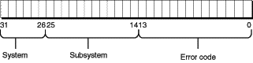

> 导航：[总目录](../../../README.md) · [documentation](../../../_indexes/documentation.md) · [Accessing Hardware From Applications](Introduction%20to%20Accessing%20Hardware%20From%20Applications.md)


[Next](I-O%20Kit%20Family%20Device-Access%20Support.md)[Previous](The%20IOKitLib%20API.md)

# Handling Errors

All programming tasks carry the potential for error. Aside from standard errors of syntax or logic, however, applications that access hardware may encounter specific types of errors that are outside the experience of many application developers.

This chapter covers some of the errors you might see while developing an application that uses the I/O Kit to access hardware on an OS X system. It describes how to “read” the I/O Kit’s error codes and then provides some information on the exclusive-access error.

Because you’ll be using I/O Kit functions extensively while looking up devices in the I/O Registry and examining the objects that represent them, you should be familiar with the structure of the I/O Kit’s error return values. This section describes how your application can interpret error values returned by I/O Kit functions.

The I/O Kit uses an error return mechanism, defined by the kernel framework, in which a 32-bit, unsigned return value supplies information in three separate bit fields, as shown in [Figure 5-1](#apple-f4xwc4dqnrsv64tfmyxwi33df52wszbpkridgmbqgaydgobrfvbecqsiinbuqsa). That is:

- The high 6 bits specify the system in which the error occurred.
- The next 12 bits specify the subsystem.
- The final 14 bits specify the error code itself.

To work with these error return values, the header file `IOReturn.h` defines the following type:

```
typedef kern_return_t IOReturn;    //kern_return_t is an int
```

You can use `kern_return_t` and `IOReturn` to obtain return values from I/O Kit functions that use either type.

__Figure 5-1__  Bit layout for kernel and I/O Kit error return values



[Listing 5-1](#apple-f4xwc4dqnrsv64tfmyxwi33df52wszbpkridgmbqgaydgobrfvbecqsdivbecrq) shows some common system error values that are defined in the header `Kernel.framework/Headers/mach/error.h`.

__Listing 5-1__  Error.h system error values

```
#define     err_kern    err_system(0x0)     /* kernel */
#define     err_us      err_system(0x1)     /* user space library */
#define     err_server  err_system(0x2)     /* user space servers */
#define     err_ipc     err_system(0x3)     /* old ipc errors */
#define     err_mach_ipc err_system(0x4)    /* mach-ipc errors */
#define     err_dipc    err_system(0x7)     /* distributed ipc */
#define     err_local   err_system(0x3e)    /* user defined errors */
#define     err_ipc_compat err_system(0x3f) /* (compatibility) mach-ipc errors */
#define     err_max_system 0x3f
```

This header also defines macros for defining system and subsystem error values and for extracting system, subsystem, and code values from an error return value, as shown in [Listing 5-2](#apple-f4xwc4dqnrsv64tfmyxwi33df52wszbpkridgmbqgaydgobrfvbecqsgjjcusqi).

__Listing 5-2__  Error.h macros for working with error return values

```
#define     err_system(x)       (((x)&0x3f)<<26)
#define     err_sub(x)          (((x)&0xfff)<<14)

#define     err_get_system(err) (((err)>>26)&0x3f)
#define     err_get_sub(err)    (((err)>>14)&0xfff)
#define     err_get_code(err)   ((err)&0x3fff)
```

Additional system values, as well as subsystem and code values, are defined in header files for particular systems. For example, the header file `Kernel.framework/Headers/IOKit/IOReturn.h` defines the values shown in [Listing 5-3](#apple-f4xwc4dqnrsv64tfmyxwi33df52wszbpkridgmbqgaydgobrfvbecqsii5eeeqq) for the I/O Kit.

__Listing 5-3__  IOReturn.h error return values

```
#ifndef sys_iokit
#define sys_iokit                   err_system(0x38)
#endif /* sys_iokit */
#define sub_iokit_common            err_sub(0)
#define sub_iokit_usb               err_sub(1)
#define sub_iokit_firewire          err_sub(2)
#define sub_iokit_reserved          err_sub(-1)
#define iokit_common_err(return)    (sys_iokit|sub_iokit_common|return)

#define kIOReturnSuccess         KERN_SUCCESS            // OK
#define kIOReturnError           iokit_common_err(0x2bc) // general error
#define kIOReturnNoMemory        iokit_common_err(0x2bd) // can't allocate memory
#define kIOReturnNoResources     iokit_common_err(0x2be) // resource shortage
#define kIOReturnIPCError        iokit_common_err(0x2bf) // error during IPC
#define kIOReturnNoDevice        iokit_common_err(0x2c0) // no such device
// ... (many more individual error codes)
```

Your application may be able to use these error values directly, without having to extract system, subsystem, or code values. For example, you could use code like the following to check for a no device error:

```
IOReturn returnVal;

returnVal = IOKitSomeFunction(...);

if (returnVal == kIOReturnNoDevice)
{
    // "No device returned" error in I/O Kit system, common subsystem.
}
```

However, in some cases you may want to isolate an error code value or determine which system or subsystem an error value came from. From the definitions shown in [Listing 5-3](#apple-f4xwc4dqnrsv64tfmyxwi33df52wszbpkridgmbqgaydgobrfvbecqsii5eeeqq), and a little bit of calculation, you can see that the error return value for a no device error (`kIOReturnNoDevice`) in the I/O Kit system and the I/O Kit common subsystem would have the following bit-field values:

- The high 6 bits (31–26) have the value `11 1000`, or `0x38`.
- The next 12 bits (25–14) have the value `00 0000 0000 00`, or `0x0`.
- The final 14 bits (13–0) have the value `00 0010 1010 0000`, or `0x2c0`.

The fully assembled bit representation is `1110 0000 0000 0000 0000 0010 1011 1100`, resulting in a hex value of `0xe00002c0`. To extract the system, subsystem, or code value from such an error return value, you use the macros shown in [Listing 5-2](#apple-f4xwc4dqnrsv64tfmyxwi33df52wszbpkridgmbqgaydgobrfvbecqsgjjcusqi) along with the constants defined in [Listing 5-3](#apple-f4xwc4dqnrsv64tfmyxwi33df52wszbpkridgmbqgaydgobrfvbecqsii5eeeqq). For example:

```
IOReturn returnVal;

returnVal = IOKitSomeFunction(...);

if (err_get_system(returnVal) == err_get_system(sys_iokit))
{
    // The error was in the I/O Kit system
    UInt32 codeValue = err_get_code(returnVal);
    // Can now perform test on error code, display it to user, or whatever.
}
```


Many types of devices are designed to allow only one process at a time to access the device. A scanner, for example, supports access by only one application at a time. Accordingly, I/O Kit families enforce the access policy for their devices, whether exclusive or shared. In addition, Classic (the Mac OS 9 environment that you can run in OS X) may expect its drivers to have exclusive access to some devices, such as USB devices. In the course of developing an application that accesses hardware, you may receive an exclusive-access error, even when you believe yours is the only process trying to open the device. When this happens, if there is no higher-level arbitration you can employ, you may need to present a dialog to the user and either try accessing another device of the same class or try to access the same device later or under different circumstances.

Defined in `IOReturn.h` (in the I/O Kit framework), the `kIOReturnExclusiveAccess` error tells your application that the device it is attempting to access has already been opened by another entity. In most cases, the user client enforces exclusive access in its `open` method. When an application uses a device interface’s `open` function, the device interface issues an `open` command to the user client. The user client responds by trying to open its provider (the device nub) and, if it fails, it returns the `kIOReturnExclusiveAccess` error. (If the user client finds that the provider is terminated, it will probably return the `kIOReturnNotAttached` error.)

Different I/O Kit device families handle the exclusive-access issue in different ways. The FireWire family, for example, enforces exclusive access to its devices, but also allows multiple device interfaces to open different objects in the FireWire driver stack. It does this by employing the concept of a session reference to refer to existing user space–kernel connections. Consider an application that uses a FireWire family device interface to open an AV/C unit on a FireWire device. If that application also wants to access the FireWire unit object that supports the AV/C unit, it can get a session reference from the AV/C device interface and use it to get the FireWire unit device interface. For more information on this process, see _[FireWire Device Interface Guide](../FireWire%20Device%20Interface%20Guide/Introduction%20to%20FireWire%20Device%20Interface%20Guide.md#apple-f4xwc4dqnrsv64tfmyxwi33df52wszbpkridimbqgaydsnrz)_.

The SCSI Architecture Model family, on the other hand, does not allow multiple device interfaces to simultaneously open different objects in the driver stack, but it does allow applications to get information about devices that in-kernel drivers currently have open. It also allows an application to gain exclusive access to an authoring or media-mastering device by tearing down the upper layers of the stack and requiring the in-kernel logical unit driver to yield control to the application. For more information about this process, see _[SCSI Architecture Model Device Interface Guide](../SCSI%20Architecture%20Model%20Device%20Interface%20Guide/Introduction%20to%20SCSI%20Architecture%20Model%20Device%20Interface%20Guide.md#apple-f4xwc4dqnrsv64tfmyxwi33df52wszbpkridimbqgaydsnzr)_.

For serial and storage devices you can access through device files, your application may fail to open the device for the following reasons:

- Another process has already opened the device.
- The file system itself has opened a storage device.
- Your application does not have the correct file-system permissions to access the device.

[Next](I-O%20Kit%20Family%20Device-Access%20Support.md)[Previous](The%20IOKitLib%20API.md)

