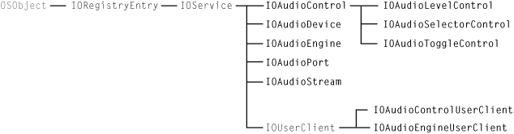
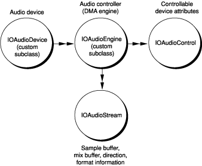
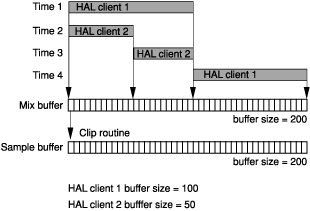
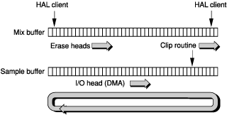
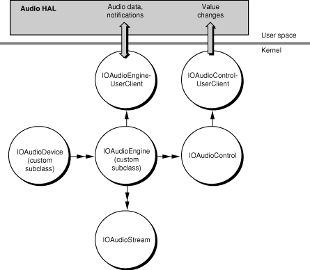

> 导航：[总目录](../../../README.md) · [documentation](../../../_indexes/documentation.md) · [Audio Device Driver Programming Guide](Introduction%20to%20Audio%20Device%20Driver%20Programming%20Guide.md)

[Next](Implementing%20an%20Audio%20Driver.md)[Previous](Audio%20on%20OS%20X.md)

# Audio Family Design

All audio drivers, regardless of platform, must perform the same general actions. For input streams, drivers receive digital audio data from the hardware in a stream of frames consistent with the current sampling rate and audio format. They modify the data, if necessary, to a form acceptable to the clients of the device (say, 32-bit floating point) and make the altered frames accessible to those clients at the current sampling rate. In the reverse (output) direction, the job of the audio driver is essentially the same. It accepts digital audio data from the clients of the device, changes that stream of sample frames to a form required by the hardware (say, 16-bit integer), and gives the data to the device’s controller at the current sampling rate.

Drivers must also initially configure the hardware, respond to client requests to change device attributes (for example, volume), and notify clients when some attribute or state of the audio device has changed. They must guard against data corruption in a multithreaded environment, and they must be prepared to respond to systemwide events, such as sleep/wake notifications.

The Audio family provides object-oriented abstractions to help your driver deal with many of these things. The family itself takes care of much of the work for you; you just supply the behavior that is specific to your hardware. To do this, it is useful to know how your code fits together with the family implementation, which is what this chapter is about.

As you can with any object-oriented system, you can come to an understanding of the design of the I/O Kit Audio family by examining the classes of the family. The examination in this section looks at the roles of the family, the properties they encapsulate, the audio entities they represent, and the relationships they have with each other. The relationships considered are not only the static relationships imposed by inheritance but also the dynamic relationships characterized by containment, dependency, and control.

The Audio family consists of about a dozen classes, all having the prefix “IOAudio”:

- [IOAudioDevice](https://developer.apple.com/documentation/kernel/ioaudiodevice)
- [IOAudioEngine](https://developer.apple.com/documentation/kernel/ioaudioengine)
- [IOAudioStream](https://developer.apple.com/documentation/kernel/ioaudiostream)
- [IOAudioControl](https://developer.apple.com/documentation/kernel/ioaudiocontrol)
- [IOAudioPort](https://developer.apple.com/documentation/kernel/ioaudioport)
- [IOAudioEngineUserClient](https://developer.apple.com/documentation/kernel/ioaudioengineuserclient)
- [IOAudioControlUserClient](https://developer.apple.com/documentation/kernel/ioaudiocontroluserclient)
- [IOAudioLevelControl](https://developer.apple.com/documentation/kernel/ioaudiolevelcontrol)
- [IOAudioSelectorControl](https://developer.apple.com/documentation/kernel/ioaudioselectorcontrol)
- [IOAudioToggleControl](https://developer.apple.com/documentation/kernel/ioaudiotogglecontrol)

The inheritance relationships among these classes, as depicted in [Figure 2-1](#apple-f4xwc4dqnrsv64tfmyxwi33df52wszbpkridgmbqgaydomzrfvbuuqskiffekra), are uncomplicated.

__Figure 2-1__  The Audio family class hierarchy

All classes of the Audio family directly or indirectly inherit from [IOService](https://developer.apple.com/documentation/kernel/ioservice); thus objects of these classes are full-fledged driver objects, with the capability for responding to driver life-cycle messages and for participating in the matching process. In practice, however, an instance of an [IOAudioDevice](https://developer.apple.com/documentation/kernel/ioaudiodevice) subclass, as root object of the audio driver, usually matches against the provider’s nub (the provider being a PCI controller or FireWire or USB device, in most cases). Audio drivers are typically “leaf” objects in the driver stack, and typically their only client is the Audio HAL, in user space. Therefore they do not publish nubs of their own.

Two classes, [IOAudioEngineUserClient](https://developer.apple.com/documentation/kernel/ioaudioengineuserclient) and [IOAudioControlUserClient](https://developer.apple.com/documentation/kernel/ioaudiocontroluserclient), inherit from the [IOUserClient](https://developer.apple.com/documentation/kernel/iouserclient) class. Objects of these classes represent user-client connections that enable the Audio family to communicate with the Audio HAL. Five of the Audio family classes are subclasses of [IOAudioControl](https://developer.apple.com/documentation/kernel/ioaudiocontrol), providing behavior specific to certain types of audio-device controls (mute switches, volume controls, and so on). For further details on the user-client and control classes of the Audio Family, see [The Roles of Audio Family Objects](#apple-f4xwc4dqnrsv64tfmyxwi33df52wszbpkridgmbqgaydomzrfvbuuqsfijcumqy).

An understanding of the static inheritance relationships between classes of the Audio family goes only so far to clarify what instances of those classes do in a typical audio driver. It is more illuminating to consider the dynamic relationships among these objects.

An I/O Kit audio driver consists of a variable number of objects that represent or encapsulate certain aspects of an audio device. Many of these objects own references to other objects. The most significant objects in a “live” audio driver derive from four Audio family classes:

- [IOAudioDevice](https://developer.apple.com/documentation/kernel/ioaudiodevice)
- [IOAudioEngine](https://developer.apple.com/documentation/kernel/ioaudioengine)
- [IOAudioStream](https://developer.apple.com/documentation/kernel/ioaudiostream)
- [IOAudioControl](https://developer.apple.com/documentation/kernel/ioaudiocontrol)

[Figure 2-2](#apple-f4xwc4dqnrsv64tfmyxwi33df52wszbpkridgmbqgaydomzrfvbuuqsfineekry) illustrates the dynamic relationships of these objects.

__Figure 2-2__  Audio family objects in a typical driver and what they represent

The root object in an audio driver is an instance of a custom subclass of [IOAudioDevice](https://developer.apple.com/documentation/kernel/ioaudiodevice). It represents an audio device in a general, overall sense. An [IOAudioDevice](https://developer.apple.com/documentation/kernel/ioaudiodevice) object is the root object for a couple of reasons: it creates and coordinates many of the other objects in the driver, and it is typically the object that must match against the provider’s nub.

The custom subclass of [IOAudioDevice](https://developer.apple.com/documentation/kernel/ioaudiodevice) adds attributes and implements behavior that are specific to the device. It is responsible for identifying, configuring, and creating all necessary audio-engine objects and attaching those objects to itself. It must map all hardware resources from the provider’s nub and, when requested by the system, it must change the values of controls.

Furthermore, an [IOAudioDevice](https://developer.apple.com/documentation/kernel/ioaudiodevice) object is the power controller and power policy maker for the driver; in coordination with its [IOAudioEngine](https://developer.apple.com/documentation/kernel/ioaudioengine) objects, it must properly determine system idleness and deal with power-state transitions (sleep and wake), deactivating and reactivating its audio engines as necessary. (See [Handling Sleep/Wake Notifications](Implementing%20an%20Audio%20Driver.md#apple-f4xwc4dqnrsv64tfmyxwi33df52wszbpkridgmbqgaydomzsfvbuuqskirfegqq) for more information.)

A driver’s [IOAudioDevice](https://developer.apple.com/documentation/kernel/ioaudiodevice) object contains one or more [IOAudioEngine](https://developer.apple.com/documentation/kernel/ioaudioengine) objects as instance variables. Each of these objects is an instance of a custom subclass of [IOAudioEngine](https://developer.apple.com/documentation/kernel/ioaudioengine). An [IOAudioEngine](https://developer.apple.com/documentation/kernel/ioaudioengine) object represents the I/O engine (usually a DMA engine) of the audio device; its job is to transfer audio data to or from one or more sample buffers and the hardware. The object starts and stops the audio I/O engine when requested; once started, it should run continuously, looping through the sample buffers until stopped. While it is running, an [IOAudioEngine](https://developer.apple.com/documentation/kernel/ioaudioengine) takes a timestamp and increments a loop count each time it “wraps around” a sample buffer (see [The Audio I/O Model Up Close](#apple-f4xwc4dqnrsv64tfmyxwi33df52wszbpkridgmbqgaydomzrfvbuuqsjiraueri)). The Core Audio framework (Audio HAL) uses this timing information to calculate the exact position of the audio engine at any time.

An audio driver needs only one [IOAudioEngine](https://developer.apple.com/documentation/kernel/ioaudioengine) object unless it needs to manage sample buffers of different sizes or to have sample frames transferred at different rates. In these cases, it should instantiate and configure the required number of [IOAudioEngine](https://developer.apple.com/documentation/kernel/ioaudioengine) instances.

An [IOAudioEngine](https://developer.apple.com/documentation/kernel/ioaudioengine) object itself contains one or more instances of the [IOAudioStream](https://developer.apple.com/documentation/kernel/ioaudiostream) class. An [IOAudioStream](https://developer.apple.com/documentation/kernel/ioaudiostream) object primarily represents a sample buffer, which it encapsulates. It also encapsulates the mix buffer for an output audio stream. It describes the direction of the stream as well as the format information that can be applied to the sample buffer. The format information includes such data as number of channels, sampling format, and bit depth. If a sample buffer has multiple channels, the channels are typically interleaved (although separate [IOAudioStream](https://developer.apple.com/documentation/kernel/ioaudiostream) instances can be used to represent non-interleaved different channels). Often an audio engine has one [IOAudioStream](https://developer.apple.com/documentation/kernel/ioaudiostream) object for an input stream and another for an output stream.

An [IOAudioEngine](https://developer.apple.com/documentation/kernel/ioaudioengine) also contains one or more [IOAudioControl](https://developer.apple.com/documentation/kernel/ioaudiocontrol) objects as instance variables. Such an object represents a controllable attribute of the audio device, such as mute, volume, or master gain. An [IOAudioControl](https://developer.apple.com/documentation/kernel/ioaudiocontrol) is usually associated with a specific channel in a specific stream. However, it can control all channels of an [IOAudioStream](https://developer.apple.com/documentation/kernel/ioaudiostream) or even all channels of an [IOAudioEngine](https://developer.apple.com/documentation/kernel/ioaudioengine). At hardware-initialization time, an [IOAudioEngine](https://developer.apple.com/documentation/kernel/ioaudioengine) (or perhaps the driver’s [IOAudioDevice](https://developer.apple.com/documentation/kernel/ioaudiodevice) object) creates the necessary [IOAudioControl](https://developer.apple.com/documentation/kernel/ioaudiocontrol) objects and adds them to the appropriate [IOAudioEngine](https://developer.apple.com/documentation/kernel/ioaudioengine).

Each [IOAudioControl](https://developer.apple.com/documentation/kernel/ioaudiocontrol) is known as a “default control” because the Audio HAL recognizes and uses it based on its attributes. Most value changes to the controls originate with clients of the Audio HAL, which passes them via the user-client interface to the designated value-change handlers in the driver. Notifications of value changes in audio controls can also travel in the other way; for example, if a user turns the volume knob on a speaker, the driver communicates this change to Audio HAL clients.

As it does with all I/O Kit drivers, the I/O Registry captures the client-provider relationships and the properties of audio drivers. By using the I/O Registry Explorer application or the `ioreg` command-line tool, you can view the objects of “live” audio drivers in the I/O Registry and examine the properties of those objects. The visual presentation that these tools provide clarifies the client-provider relationships among Audio-family objects and the relationships between audio objects and other objects in the driver stack. You can use these tools to verify driver status and for debugging problems.

[Figure 2-3](#apple-f4xwc4dqnrsv64tfmyxwi33df52wszbpkridgmbqgaydomzrfvbuuqshjbfeqqi) shows how some of the objects in a USB audio driver appear in the I/O Registry.

__Figure 2-3__  A USB audio driver displayed in the IORegistryExplorer application

In addition to these programming uses, the I/O Registry also serves a critical function in the architecture of the OS X audio system. The control properties of an audio driver—volume, mute, gain settings—are stored in the I/O Registry and are associated with an [IOAudioControl](https://developer.apple.com/documentation/kernel/ioaudiocontrol) object. The Audio HAL looks for, recognizes, and uses the object based on its attributes, which it discovers through the I/O Registry. See [IOAudioControl](#apple-f4xwc4dqnrsv64tfmyxwi33df52wszbpkridgmbqgaydomzrfvbuuqsjjfcuery) for further information.

For details on matching properties, device attributes, and other I/O Registry keys, see the header file `Kernel.framework/Headers/IOKit/audio/IOAudioDefines.h` or the associated reference documentation for `IOAudioDefines.h`.

The previous section looked in a general way at the major objects in a “live” audio driver, describing what those objects basically do and what their relationships are with one another. This section probes a little deeper and examines the roles of all Audio family classes (and objects) in more detail.

Every audio driver based on the Audio family must have one instance of a custom subclass of [IOAudioDevice](https://developer.apple.com/documentation/kernel/ioaudiodevice). The driver’s [IOAudioDevice](https://developer.apple.com/documentation/kernel/ioaudiodevice) object is the central, coordinating node of the driver’s object tree—the “root” object. All other objects ultimately depend on it or are contained by it.

Because of its status as root object, the [IOAudioDevice](https://developer.apple.com/documentation/kernel/ioaudiodevice) object represents the audio hardware generally. This central position gives it several roles:

- It is the object that usually matches against the provider’s nub.
- It initializes the device, mapping hardware resources from the provider’s nub, and otherwise reads and writes to the device registers as necessary.
- It creates the [IOAudioEngine](https://developer.apple.com/documentation/kernel/ioaudioengine) objects of the driver and can create the [IOAudioControl](https://developer.apple.com/documentation/kernel/ioaudiocontrol) objects used by the driver.
- It usually manages synchronization of values between hardware controls and the associated software controls associated with its audio-engine objects.
- It acts as the power controller and policy maker for the audio hardware; in this role, it must respond to system sleep, system wake, and domain idleness transitions by deactivating and reactivating its audio engines as necessary.

The driver’s [IOAudioDevice](https://developer.apple.com/documentation/kernel/ioaudiodevice) object fulfills other functions. It controls access to the audio hardware to ensure, in the driver’s multithreaded environment, that the hardware doesn’t get into an inconsistent state. Toward this end, the [IOAudioDevice](https://developer.apple.com/documentation/kernel/ioaudiodevice) superclass provides a separate work loop ([IOWorkLoop](https://developer.apple.com/documentation/kernel/ioworkloop)) and a command gate ([IOCommandGate](https://developer.apple.com/documentation/kernel/iocommandgate)) to synchronize access by all objects in the driver. All other objects in the driver—[IOAudioEngine](https://developer.apple.com/documentation/kernel/ioaudioengine), [IOAudioStream](https://developer.apple.com/documentation/kernel/ioaudiostream), and [IOAudioControl](https://developer.apple.com/documentation/kernel/ioaudiocontrol)—contain references to the [IOAudioDevice](https://developer.apple.com/documentation/kernel/ioaudiodevice)’s work loop and the command gate as instance variables. All Audio family classes take care of executing I/O and hardware-related code on the command gate for all calls into the driver that they know about. Generally, drivers should ensure that all I/O and hardware-specific operations are executed with the command gate closed.

[IOAudioDevice](https://developer.apple.com/documentation/kernel/ioaudiodevice) also offers timer services to the audio driver. These services allow different objects within the driver to receive notifications that are guaranteed to be delivered at the requested timer interval, if not sooner. Different target objects can register for timer callbacks at a specific interval; however, [IOAudioDevice](https://developer.apple.com/documentation/kernel/ioaudiodevice) makes the actual timer interval the smallest of those requested.

The idea behind this design is that there is no harm in having timed events in an audio driver occur sooner than requested. By coalescing the callback intervals, the Audio family obviates the overhead of multiple timers in a single driver.

In some cases, however, this may result in unexpected behavior if you make assumptions based on the amount of time elapsed, such as assuming that the hardware has played a certain number of samples. You should thus always make certain to test to make sure conditions are appropriate before performing such operations.

Your driver itself can have localized strings that are accessible by the Audio HAL. These strings can include such things as name, manufacturer, and input sources. Follow the OS X localization procedure for these strings, putting them in a file named `Localizable.strings` in the locale-specific subdirectories of your bundle. The driver should have a property named `IOAudioDeviceLocalizedBundleKey`, which has a value of the path of the bundle or kernel extension holding the localized strings, relative to `/System/Library/Extensions`. The driver’s [IOAudioDevice](https://developer.apple.com/documentation/kernel/ioaudiodevice) object should set this property in its implementation of the `initHardware` method.

An audio engine object represents and manages an audio device’s I/O engine. In an audio driver, the object is an instance of a custom subclass of [IOAudioEngine](https://developer.apple.com/documentation/kernel/ioaudioengine). The audio engine has two main roles:

- To configure a hardware DMA engine to transfer audio data (in the form of a stream of sample frames) between the device and the sample buffer at a specific sampling rate. (In the absence of a hardware DMA engine, the audio engine may emulate this functionality in software.)
- To move data between the sample buffer and the mix buffer after appropriately converting the data to the format expected by the client or hardware (depending on direction).

You can find more information on this topic in [The Audio I/O Model Up Close](#apple-f4xwc4dqnrsv64tfmyxwi33df52wszbpkridgmbqgaydomzrfvbuuqsjiraueri).)

An instance of [IOAudioStream](https://developer.apple.com/documentation/kernel/ioaudiostream) (described in [IOAudioStream](#apple-f4xwc4dqnrsv64tfmyxwi33df52wszbpkridgmbqgaydomzrfvbuuqshjbbuosq)) represents and encapsulates a sample buffer in a driver (and a mix buffer for output streams). Each [IOAudioEngine](https://developer.apple.com/documentation/kernel/ioaudioengine) in a driver must create one or more [IOAudioStream](https://developer.apple.com/documentation/kernel/ioaudiostream) objects for each sample buffer required by the I/O engine. A typical driver has at least an input [IOAudioStream](https://developer.apple.com/documentation/kernel/ioaudiostream) and an output [IOAudioStream](https://developer.apple.com/documentation/kernel/ioaudiostream).

An [IOAudioEngine](https://developer.apple.com/documentation/kernel/ioaudioengine) object may also create the audio-control objects ([IOAudioControl](https://developer.apple.com/documentation/kernel/ioaudiocontrol)) required by the device, although this task can be handled by the driver’s [IOAudioDevice](https://developer.apple.com/documentation/kernel/ioaudiodevice). During the initialization phase, the driver must add all created [IOAudioStream](https://developer.apple.com/documentation/kernel/ioaudiostream) instances and [IOAudioControl](https://developer.apple.com/documentation/kernel/ioaudiocontrol) instances to the [IOAudioEngine](https://developer.apple.com/documentation/kernel/ioaudioengine) as instance variables using the appropriate [IOAudioEngine](https://developer.apple.com/documentation/kernel/ioaudioengine) methods. This must happen before it activates the [IOAudioEngine](https://developer.apple.com/documentation/kernel/ioaudioengine) (with the `activateAudioEngine` method).

In addition to facilitating the transfer of audio data in and out of the sample and mix buffers, an [IOAudioEngine](https://developer.apple.com/documentation/kernel/ioaudioengine) has a number of functions:

- It must stop and start the I/O engine when requested.
- When the I/O engine is started, the [IOAudioEngine](https://developer.apple.com/documentation/kernel/ioaudioengine) object must ensure that it runs continuously and, at the end of the sample buffer, loops to the beginning of the buffer. As the engine loops, the [IOAudioEngine](https://developer.apple.com/documentation/kernel/ioaudioengine) takes a timestamp and increments a loop count.
- It must provide the current sample on demand.
- If the [IOAudioEngine](https://developer.apple.com/documentation/kernel/ioaudioengine) supports multiple stream formats or sampling rates, it must modify the hardware appropriately when a format or rate changes.

An [IOAudioEngine](https://developer.apple.com/documentation/kernel/ioaudioengine) has several attributes and structures associated with it. Most important of these is a status buffer ([IOAudioEngineStatus](https://developer.apple.com/documentation/kernel/ioaudioenginestatus)) that it shares with the Audio HAL. This status buffer is a structure that the [IOAudioEngine](https://developer.apple.com/documentation/kernel/ioaudioengine) must update each time the I/O engine loops around to the start of the sample buffer. The structure contains four fields, three of which hold critical values:

- The number of times the audio engine has looped to the start of the sample buffer
- The timestamp of the most recent occurrence of this looping
- The current location of the erase head (in terms of sample frame)

It is important that these fields, especially the timestamp field, be as accurate as possible. The Core Audio framework (Audio HAL) uses this timing information to calculate the exact position of the audio engine at any time. The shared status buffer is thus the basis for the timer and synchronization mechanism used by the OS X audio subsystem.

The erase head mentioned in the previous paragraph is another attribute of an [IOAudioEngine](https://developer.apple.com/documentation/kernel/ioaudioengine) object. The erase head is a software construct that zeroes out the mix and sample buffers just after the sample frames have been played in an output stream. It is always moving just behind the audio engine to avoid erasing data that has not yet been played. However, it also must remain well ahead of the [IOAudioEngine](https://developer.apple.com/documentation/kernel/ioaudioengine) clipping and conversion routines that convert the audio data in the mix buffer to ensure that no stale data from a previous loop iteration is mixed or clipped.

An [IOAudioEngine](https://developer.apple.com/documentation/kernel/ioaudioengine) object performs a number of initializations to fine-tune the synchronization mechanism described above. For example, it provides methods for setting the latency of the audio engine and for varying the offset between the Audio HAL and the audio engine’s I/O head.

An [IOAudioStream](https://developer.apple.com/documentation/kernel/ioaudiostream) object represents a single, independently addressable audio input or output stream (which may include multiple channels). It contains the following (as instance variables):

- A sample buffer
- A mix buffer (for output streams)
- Supported format information (sample rate, bit depth, and number of channels)
- The starting channel ID
- The number of current clients
- All [IOAudioControl](https://developer.apple.com/documentation/kernel/ioaudiocontrol) objects that affect the channels of the stream

An [IOAudioStream](https://developer.apple.com/documentation/kernel/ioaudiostream) is an instance variable of the [IOAudioEngine](https://developer.apple.com/documentation/kernel/ioaudioengine) object that creates it. When the audio engine creates an [IOAudioStream](https://developer.apple.com/documentation/kernel/ioaudiostream) object, it must list all supported sample formats as well as all the supported sample rates for each format. The current format must be explicitly set.

If a sample buffer has multiple channels, the channels are typically interleaved on a frame-by-frame basis. If your hardware uses separate buffers for each channel, however, you may use separate [IOAudioStream](https://developer.apple.com/documentation/kernel/ioaudiostream) instances for different channels.

The [IOAudioStream](https://developer.apple.com/documentation/kernel/ioaudiostream) class defines the `AudioIOFunction` type for the callbacks (typically implemented by the owning [IOAudioEngine](https://developer.apple.com/documentation/kernel/ioaudioengine)) that clip and convert output audio data from the float mix buffer to the sample buffer in the format required by the hardware. See [The Audio I/O Model Up Close](#apple-f4xwc4dqnrsv64tfmyxwi33df52wszbpkridgmbqgaydomzrfvbuuqsjiraueri) for further information.

[IOAudioStream](https://developer.apple.com/documentation/kernel/ioaudiostream) includes convenience methods that permit [IOAudioStream](https://developer.apple.com/documentation/kernel/ioaudiostream) objects to be created from and saved to [OSDictionary](https://developer.apple.com/documentation/iokit/osdictionary) objects.

An [IOAudioControl](https://developer.apple.com/documentation/kernel/ioaudiocontrol) object represents a controllable attribute of an audio device, such as mute, volume, input/output selector, or master gain. It is usually associated with a specific channel in a specific stream, but can be used to control all channels in an [IOAudioStream](https://developer.apple.com/documentation/kernel/ioaudiostream) or even all channels in an [IOAudioEngine](https://developer.apple.com/documentation/kernel/ioaudioengine).

[IOAudioControl](https://developer.apple.com/documentation/kernel/ioaudiocontrol) objects are typically instance variables of the owning [IOAudioEngine](https://developer.apple.com/documentation/kernel/ioaudioengine) object. However, [IOAudioControl](https://developer.apple.com/documentation/kernel/ioaudiocontrol) objects associated with a specific stream may also be stored in the relevant [IOAudioStream](https://developer.apple.com/documentation/kernel/ioaudiostream) object.

Usually an instance of an [IOAudioEngine](https://developer.apple.com/documentation/kernel/ioaudioengine) subclass creates its [IOAudioControl](https://developer.apple.com/documentation/kernel/ioaudiocontrol) instances when it initializes the hardware (in the `initHardware` method). However, the driver’s [IOAudioDevice](https://developer.apple.com/documentation/kernel/ioaudiodevice) object may be the object that creates the necessary [IOAudioControl](https://developer.apple.com/documentation/kernel/ioaudiocontrol) objects. In either case, the driver must add the control objects to the appropriate [IOAudioEngine](https://developer.apple.com/documentation/kernel/ioaudioengine) using the `addDefaultAudioControl` method.

Thus an [IOAudioControl](https://developer.apple.com/documentation/kernel/ioaudiocontrol) object is associated with an [IOAudioEngine](https://developer.apple.com/documentation/kernel/ioaudioengine) object, an [IOAudioStream](https://developer.apple.com/documentation/kernel/ioaudiostream) object, and a channel of the stream. All of its attributes are stored in the I/O Registry. It is known as a “default control” because the Audio HAL recognizes and uses it based on its attributes, which are discovered through the I/O Registry.

When the [IOAudioEngine](https://developer.apple.com/documentation/kernel/ioaudioengine) (or [IOAudioDevice](https://developer.apple.com/documentation/kernel/ioaudiodevice)) object creates [IOAudioControl](https://developer.apple.com/documentation/kernel/ioaudiocontrol) objects, it must obtain from the audio device the starting channel identifier (an integer) for the audio stream. When the driver creates the first [IOAudioControl](https://developer.apple.com/documentation/kernel/ioaudiocontrol) for the stream, it assigns this channel ID to it. When it creates [IOAudioControl](https://developer.apple.com/documentation/kernel/ioaudiocontrol) objects for any other channels of the stream (based on the number of channels the stream supports), it simply increments the ID of the channel associated with the control.

For audio devices with more than one audio stream, each stream should start at the next free ID beyond the highest numbered ID that the previous stream could contain. This can be obtained by adding the maximum number of channels in any given stream format to the starting ID.

The Audio family assigns `enum` identifiers to channel IDs in `IOAudioTypes.h`; these include identifiers for left, right, center, left-rear, and right-rear channels, as well as an identifier for all channels.

In addition to channel ID, the Audio family uses a multitier classification scheme (defined by enums in `IOAudioTypes.h`) to identify [IOAudioControl](https://developer.apple.com/documentation/kernel/ioaudiocontrol) types:

- Audio types: output, input, mixer, pass-through, and processing
- Audio subtypes:

  - For output: internal speaker, external speaker, headphones, line, and S/PDIF
  - For input: internal microphone, external microphone, CD, line, and S/PDIF
- Control types: level and selector
- Control subtypes: volume, mute, input, output, clock services
- Usage type: input, output, and pass-through

When you create an [IOAudioControl](https://developer.apple.com/documentation/kernel/ioaudiocontrol) object, you specify control type, control subtype, usage type, and channel name (in addition to channel ID).

The level and selector control types correspond to subclasses of [IOAudioControl](https://developer.apple.com/documentation/kernel/ioaudiocontrol), described in [Table 2-1](#apple-f4xwc4dqnrsv64tfmyxwi33df52wszbpkridgmbqgaydomzrfvbuuqski5duusi).

__Table 2-1__  Subclasses of IOAudioControl

| Subclass | Description |
| [IOAudioLevelControl](https://developer.apple.com/documentation/kernel/ioaudiolevelcontrol) | Implements an audio control based on a minimum and maximum value. A control subtype specifically creates a volume control using minimum and maximum decibels associated with these levels. |
| [IOAudioSelectorControl](https://developer.apple.com/documentation/kernel/ioaudioselectorcontrol) | Implements an audio control based on selection of discrete elements. Control subtypes include those for mute, input/output, and clock services. |
| [IOAudioToggleControl](https://developer.apple.com/documentation/kernel/ioaudiotogglecontrol) | Implements an audio control based on binary values (off and on, start and stop, and so on) such as might pertain to a mute control. |

Some objects in an audio driver—typically the [IOAudioDevice](https://developer.apple.com/documentation/kernel/ioaudiodevice) object because of its central role—must implement what is known as “value change handlers.” A value change handler is a callback routine that conforms to one of three prototypes defined in `IOAudioControl.h` based on the type of value (integer, [OSObject](https://developer.apple.com/documentation/kernel/osobject), or `void *` data). When invoked, a value change handler should write the change in value to the audio hardware.

Changes to control values that originate with clients of the Audio HAL—for example, a user moving the volume slider in the menu bar—initiate a long series of actions in the Audio HAL and the Audio family:

1. The Audio HAL goes through the I/O Registry to determine the property or properties associated with the value change.
2. Via the [IOAudioEngineUserClient](https://developer.apple.com/documentation/kernel/ioaudioengineuserclient) object, the [IOAudioControl](https://developer.apple.com/documentation/kernel/ioaudiocontrol) superclass’s implementation of `setProperties` is invoked.
3. Using the dictionary of properties passed into `setProperties`, [IOAudioControl](https://developer.apple.com/documentation/kernel/ioaudiocontrol) locates the target control object and calls `setValueAction` on it.
4. The `setValueAction` method calls `setValue` on the driver’s work loop while holding the driver’s command gate.
5. The `setValue` method first calls `performValueChange`, which does two things:

   1. It calls the value change handler for the [IOAudioControl](https://developer.apple.com/documentation/kernel/ioaudiocontrol) (which must conform to the appropriate function prototype for the callback).
   2. It sends a notification of the change to all clients of the [IOAudioControl](https://developer.apple.com/documentation/kernel/ioaudiocontrol) (`sendValueChangeNotification`).
6. Finally, `setValue` calls `updateValue` to update the I/O Registry with the new value.

When a change is physically made to audio hardware—for example, a user turns a volume dial on an external speaker—what must be done is much abbreviated. When the driver detects a control-value change in hardware, it simply calls `hardwareValueChanged` on the driver’s work loop. This method updates the value in the [IOAudioControl](https://developer.apple.com/documentation/kernel/ioaudiocontrol) instance and in the I/O Registry, and then sends a notification to all interested clients.

The Audio family provides two user-client classes, [IOAudioEngineUserClient](https://developer.apple.com/documentation/kernel/ioaudioengineuserclient) and [IOAudioControlUserClient](https://developer.apple.com/documentation/kernel/ioaudiocontroluserclient). The Audio family automatically instantiates objects of each class for each [IOAudioEngine](https://developer.apple.com/documentation/kernel/ioaudioengine) object and each [IOAudioControl](https://developer.apple.com/documentation/kernel/ioaudiocontrol) in a driver. These objects enable the communication of audio data and notifications between the driver and the Audio HAL. You should not have to do anything explicitly in your code to have the default user-client objects created for, and used by, your driver.

For further details, see [User Client Objects](#apple-f4xwc4dqnrsv64tfmyxwi33df52wszbpkridgmbqgaydomzrfvbuuqshjfaukqy).

The [IOAudioPort](https://developer.apple.com/documentation/kernel/ioaudioport) class instantiates objects that represent a logical or physical port, or a functional unit in an audio device. An [IOAudioPort](https://developer.apple.com/documentation/kernel/ioaudioport) object represents an element in the signal chain in the audio device and may contain one or more [IOAudioControl](https://developer.apple.com/documentation/kernel/ioaudiocontrol) objects through which different attributes of the port can be represented and adjusted.

The [IOAudioPort](https://developer.apple.com/documentation/kernel/ioaudioport) class is deprecated and may eventually be made obsolete. The class is currently public to maintain compatibility. Driver writers are discouraged from using [IOAudioPort](https://developer.apple.com/documentation/kernel/ioaudioport) objects in their code.

In the previous chapter, the section [The Audio I/O Model on OS X](Audio%20on%20OS%20X.md#apple-f4xwc4dqnrsv64tfmyxwi33df52wszbpkridgmbqgaydomzqfvbeeq2dindemqi) described the OS X audio I/O model from the perspective of how that model compares to the Mac OS 9 model. Because it was a comparative overview, that description left out some important details. The following discussion supplies those details, with the intent that a fuller understand of the audio I/O model is of particular benefit to audio driver writers.

In OS X, the driver’s audio engine programs the audio device’s DMA engine to read from or write to a single (typically large) ring buffer. In a ring buffer, the DMA engine (or a software emulation thereof) wraps around to the start of the buffer when it finishes writing to (or reading from) the end of the buffer. Thus the DMA engine continuously loops through the sample buffer, reading or writing audio data, depending on direction. As it wraps, the DMA engine is expected to fire an interrupt. The driver (in an [IOAudioEngine](https://developer.apple.com/documentation/kernel/ioaudioengine) object) records the time when this interrupt occurs by calling `takeTimeStamp` in the driver’s work loop.

In calling `takeTimeStamp`, the driver writes two critical pieces of data to an area of memory shared between the [IOAudioEngine](https://developer.apple.com/documentation/kernel/ioaudioengine) and its Audio HAL clients. The first is an extremely accurate timestamp (based on [utime](https://developer.apple.com/library/archive/documentation/System/Conceptual/ManPages_iPhoneOS/man3/utime.3.html#//apple_ref/doc/man/3/utime)), and the other is an incremented loop count. The structure defining these (and other) fields is [IOAudioEngineStatus](https://developer.apple.com/documentation/kernel/ioaudioenginestatus). The engine’s user-client object maps the memory holding the [IOAudioEngineStatus](https://developer.apple.com/documentation/kernel/ioaudioenginestatus) information into the address spaces of the Audio HAL clients.

For information about handling timestamp approximation, see [Faking Timestamps](Tips%2C%20Tricks%2C%20and%20Frequently%20Asked%20Questions.md#apple-f4xwc4dqnrsv64tfmyxwi33df52wszbpkridgmbqgaydomrzfvbuqmrtgywugsceinauescg).

The Audio HAL uses the accumulated timestamps and loop counts in a sophisticated calculation that predicts when the I/O engine will be at any location in the sample buffer; as a result, it can also predict when each client of a particular I/O engine should be ready to provide audio data to the hardware or accept audio data from it. This calculation takes into account not only the current sample-frame position of the I/O engine, but also the buffer sizes of the clients, which can vary.

Each client of the Audio HAL has its own I/O thread. The Audio HAL puts this thread to sleep until the time comes for the client to read or write audio data. Then the Audio HAL wakes the client thread. This is a kind of software-simulated interrupt, which involves much less overhead than a hardware interrupt.

Before going further, it is worthwhile to consider some of the theory behind this design. The OS X audio system makes the assumption that a hardware I/O engine, as it processes audio data in the sample buffer, is proceeding continuously at a _more or less_ constant rate. The “more or less” qualification is important here because, in reality, there will be slight variations in this rate for various reasons, such as imperfections in clock sources. So the mechanism by which the Audio HAL continually uses timestamps to calculate and predict a wake-up time for each of its client I/O threads can be considered an interpolation engine. It is a highly accurate predictive mechanism that “smooths out” these slight variations in engine rate, building in some leeway so that there is no discernible effect on audio quality.

As noted earlier, each client of the Audio HAL can define the size of its audio buffer. There are no restrictions, except that the buffer can be no larger than the size of the hardware sample buffer. For performance reasons, almost all clients prefer buffer sizes that are considerably smaller. Buffer sizes are typically a power of two. The Audio HAL takes the buffer sizes of its clients into account when it calculates the next I/O cycle for those clients.

Each client of the Audio HAL must also implement a callback function conforming to the type [AudioDeviceIOProc](https://developer.apple.com/documentation/coreaudio/audiodeviceioproc). When the Audio HAL wakes a sleeping client I/O thread, it calls this function, passing in the buffers (input and output) whose sizes were specified by the client. It is in this implementation of the [AudioDeviceIOProc](https://developer.apple.com/documentation/coreaudio/audiodeviceioproc) routine that the client gives audio data to the hardware or receives it from the hardware.

The following section, [A Walk Through the I/O Model](#apple-f4xwc4dqnrsv64tfmyxwi33df52wszbpkridgmbqgaydomzrfvbuuqseiffessi), discusses what happens next in detail.

With the essential timing mechanism used for audio I/O in mind, we can now follow a cycle of that I/O through the audio system to see exactly what happens. What happens is different between input and output audio streams. An output stream involves a more complicated path because each client is contributing, frame by frame, to the final sound played by speakers or recorded by some device.

Let’s begin with an output stream. [Figure 2-4](#apple-f4xwc4dqnrsv64tfmyxwi33df52wszbpkridgmbqgaydomzrfvbuuqsejfeusqi) illustrates the relationship between the buffers of Audio HAL clients and the buffers of the audio driver during an output cycle. Refer to this diagram during the following discussion.

__Figure 2-4__  Multiple Audio HAL client buffers and the mix buffer (output)

For each of its clients, the Audio HAL calculates intervals that are based on the accumulated timestamps and loop counts associated with an I/O engine as well as client buffer sizes. The Audio HAL sleeps the I/O threads of its clients for these intervals, waking each thread when it’s time for the client to give the hardware its data. In waking the thread, it calls the [AudioDeviceIOProc](https://developer.apple.com/documentation/coreaudio/audiodeviceioproc) routine implemented by the client, passing in a number of buffers and timestamps:

- A list of input buffers along with a timestamp that indicates when the data was recorded
- A list of output buffers along with a timestamp that indicates when the data will be played
- A timestamp to be used for “now” rather than the device clock

The input and output timestamps allow the client to make various calculations, such as how much time it has before the data is played. The inclusion of both input and output parameters enables clients that are both producers and consumers of audio data (for example, a recording unit with playback capabilities) to process both streams at the same time. In this case, the client first takes the data in the list of input buffers before filling the output buffers with 32-bit floating-point samples.

When the client returns in its [AudioDeviceIOProc](https://developer.apple.com/documentation/coreaudio/audiodeviceioproc) routine, the Audio HAL puts the I/O thread to sleep until the next time data is required from the client. The Audio HAL gives the samples in the output buffer to the associated [IOAudioEngineUserClient](https://developer.apple.com/documentation/kernel/ioaudioengineuserclient) object, which calls the appropriate [IOAudioStream](https://developer.apple.com/documentation/kernel/ioaudiostream) object to have the samples moved from the client buffer to the appropriate frames in the engine’s mix buffer. Other clients can also deposit data in the same locations in the mix buffer. If another client already has deposited data in those frames, the new client’s floating-point values are simply added to the existing values.

Clients can contribute output data to a frame almost until the I/O engine is ready for that data. The [IOAudioEngine](https://developer.apple.com/documentation/kernel/ioaudioengine) object containing the mix buffer knows how many clients it has and when each has contributed its share of data to any one frame of the mix buffer (for the current loop through it). In addition, the driver (through the Audio family) maintains a “watchdog” timer that tracks the current location of each client relative to the I/O engine. If a client has not provided audio data by the time the I/O engine needs to accesses it, the watchdog timer fires and clips all of the currently mixed samples into the sample buffer.

Because some time is needed to perform this clip operation, the watchdog actually fires a short amount of time before the data is needed. It is possible that a “late” client could attempt to put data in the location of the mix buffer after the watchdog has fired but before the I/O engine has processed the data. To accommodate this situation, the driver backs up and remixes and clips the data in an attempt to get the “late” samples to the I/O engine in time.

Next, the driver’s clip routine, `clipOutputSamples`, is invoked. In its implementation of this method, the driver must clip any excess floating-point values under –1.0 and over 1.0 —which can happen when multiple clients are adding their values to existing values in the same frame—and then convert these values to whatever format is required by the hardware. When `clipOutputSamples` returns, the converted values have been written to the corresponding locations in the sample buffer. The DMA engine grabs the frames as it progresses through the sample buffer and the hardware plays them as sound.

Since a picture is worth a thousand words, the interaction of these processes is described in [Figure 2-5](#apple-f4xwc4dqnrsv64tfmyxwi33df52wszbpkridgmbqgaydomzrfvkfawcsivddcmjw).

__Figure 2-5__  Interplay of the I/O engine, erase heads, and clip routine (output)

The Audio family includes a further refinement to the synchronized actions described in the preceding paragraphs. Between the I/O engine and the clipping and converting done by the driver, it runs parallel “erase heads” in both the mix and sample buffers. These erase heads simply zero-fill the corresponding frames at the same time. This precaution reduces the possibility that any frame could become polluted with leftover bits.

The erase heads are run in a separate thread and have their own timer. They are programmed to run four times per sample-buffer cycle. They do not erase the entire range of frames between the current locations of the DMA engine and the driver’s clip routine, allowing a little space for the remixing of data from tardy clients.

The erase head’s timer is run using [IOAudioDevice](https://developer.apple.com/documentation/kernel/ioaudiodevice)’s timer services. Its interval is, of course, closely tied to the rate of the I/O engine and the timestamps taken by the [IOAudioEngine](https://developer.apple.com/documentation/kernel/ioaudioengine).

With input audio streams, the picture is much simpler. There is no mix buffer and there are no erase heads. The Audio HAL clients are consumers of the data in this case, and not producers of it, so there is no need for these things.

Neither is there any need for a clip routine. The driver has to convert the integer data coming from the hardware to the 32-bit floating point required by the Audio HAL. But in the input direction, the driver is in a position to fit the converted data within the –1.0 to 1.0 floating-point maximum range.

So the simplified sequence is this: shortly after the I/O engine writes the input data into the sample buffer, the driver—in its implementation of the [IOAudioEngine](https://developer.apple.com/documentation/kernel/ioaudioengine) method `convertInputSamples`—converts that data to 32-bit floating point. Then the data is given, via the [IOAudioEngineUserClient](https://developer.apple.com/documentation/kernel/ioaudioengineuserclient) interface, to each Audio HAL client in that client’s [AudioDeviceIOProc](https://developer.apple.com/documentation/coreaudio/audiodeviceioproc) callback routine.

Audio drivers communicate with the Audio HAL and its clients using two mechanisms. The principal mechanism uses user-client objects to pass audio data, control value changes, and notifications across the kernel-user space boundary. The other mechanism allows driver writers to export custom device properties to Audio HAL clients.

As described earlier in [User Client Classes](#apple-f4xwc4dqnrsv64tfmyxwi33df52wszbpkridgmbqgaydomzrfvbuuqshizbusqi), the Audio family automatically configures and creates the appropriate number of user-client objects for a driver. These objects enable the communication of audio data and notifications between the driver and the Audio HAL. The objects typically are instances of either the [IOAudioEngineUserClient](https://developer.apple.com/documentation/kernel/ioaudioengineuserclient) class or the [IOAudioControlUserClient](https://developer.apple.com/documentation/kernel/ioaudiocontroluserclient) class. One [IOAudioEngineUserClient](https://developer.apple.com/documentation/kernel/ioaudioengineuserclient) object is created for each [IOAudioEngine](https://developer.apple.com/documentation/kernel/ioaudioengine) in a driver, and one [IOAudioControlUserClient](https://developer.apple.com/documentation/kernel/ioaudiocontroluserclient) object is created for each [IOAudioControl](https://developer.apple.com/documentation/kernel/ioaudiocontrol).

An [IOAudioEngineUserClient](https://developer.apple.com/documentation/kernel/ioaudioengineuserclient) object acts as the conduit through which audio data is passed between the audio driver and the Audio HAL. It is also the agent that maps the buffer maintained by an [IOAudioEngine](https://developer.apple.com/documentation/kernel/ioaudioengine) into memory shared with the associated Audio HAL device. (As you may recall, this buffer contains the timestamp and count of the most recent “wrap” of the sample buffer by the I/O engine.) Finally, the [IOAudioEngineUserClient](https://developer.apple.com/documentation/kernel/ioaudioengineuserclient) responds to requests by Audio HAL clients to get and set the properties of the hardware. An [IOAudioControlUserClient](https://developer.apple.com/documentation/kernel/ioaudiocontroluserclient) object has a more limited role compared to a [IOAudioEngineUserClient](https://developer.apple.com/documentation/kernel/ioaudioengineuserclient) object. It merely sends a notification to interested clients of the Audio HAL when the value of a control (represented by [IOAudioControl](https://developer.apple.com/documentation/kernel/ioaudiocontrol)) changes.

The interaction of these user clients with the Audio HAL and other parts of your driver is shown in [Figure 2-6](#apple-f4xwc4dqnrsv64tfmyxwi33df52wszbpkridgmbqgaydomzrfvkfawcsivddcmjx).

__Figure 2-6__  The Audio family’s user clients

You do not have to do anything explicitly in your code to have the Audio family create the default user-client objects for your driver, nor do you have to write any code to enable your driver to use these objects. It all happens automatically for your driver. But it could happen that you want custom behavior from your user clients; for example, you might want the user client to perform hardware mixing, writing the combined samples into a new buffer used by a single client. When you want custom user-client behavior, you can subclass the [IOAudioEngineUserClient](https://developer.apple.com/documentation/kernel/ioaudioengineuserclient) class or the [IOAudioControlUserClient](https://developer.apple.com/documentation/kernel/ioaudiocontroluserclient) class. These classes are described in `IOAppleEngineUserClient.h` and `IOAppleControlUserClient.h`.

Sometimes you might have an audio device with properties that are not covered by what the Audio HAL specifies (in the Core Audio framework’s `AudioHardware.h`). For these situations, you can create a bundle that contains code implementing these device-specific properties on behalf of the Audio HAL. Then you can put this bundle in a location where it can be exported to user space. The bundle must be accessible by Core Foundation Bundle Services APIs (CFBundle).

To give the Audio HAL access to your device-property code, the bundle must also present the programmatic interface defined in the Core Audio header file `AudioDriverPlugIn.h`. These routines allow the Audio HAL clients to open and close the device and to get and set the device properties. When the driver changes a property, it calls one of two notification callbacks implemented by clients (one defined for Audio HAL device properties and the other for stream properties) to notify them of the change.

When you have created a bundle conforming to the interface in `AudioDriverPlugIn.h`, you usually install it inside your driver’s kernel extension in `/System/Library/Extensions`. Because it is a bundle, it can also contain localizations of strings relevant to the new properties. The Audio HAL finds the bundle by looking in the I/O Registry for two keys: `kIOAudioEngineCoreAudioPlugInKey` and `kIOAudioDeviceLocalizedBundleKey`.

[Next](Implementing%20an%20Audio%20Driver.md)[Previous](Audio%20on%20OS%20X.md)

