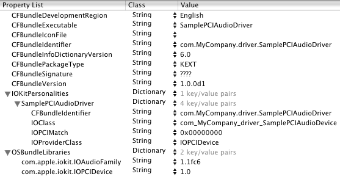
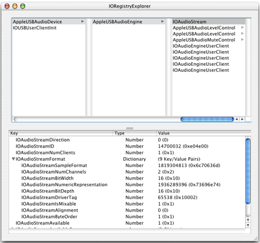
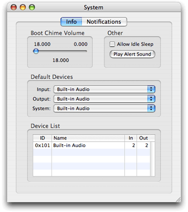
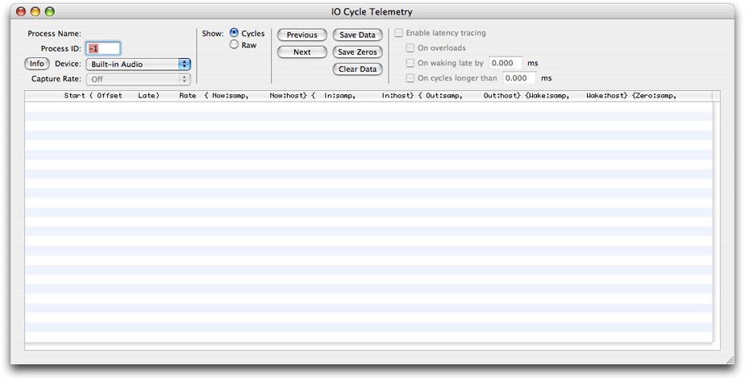
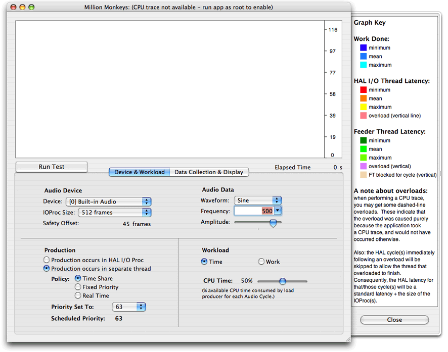
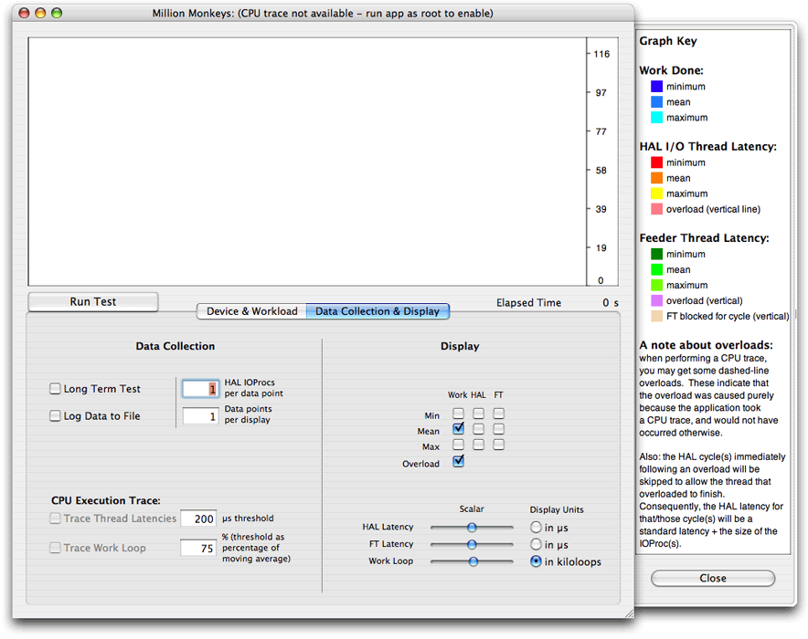

> 导航：[总目录](../../../README.md) · [documentation](../../../_indexes/documentation.md) · [Audio Device Driver Programming Guide](Introduction%20to%20Audio%20Device%20Driver%20Programming%20Guide.md)


[Next](Tips%2C%20Tricks%2C%20and%20Frequently%20Asked%20Questions.md)[Previous](Audio%20Family%20Design.md)

# Implementing an Audio Driver

As discussed in the chapter [Audio Family Design](Audio%20Family%20Design.md#apple-f4xwc4dqnrsv64tfmyxwi33df52wszbpkridgmbqgaydomzrfvbuuqscifduurq), writing an audio driver using the Audio family requires, in object-oriented terms, that you do some certain things in your code:

- Create a subclass of [IOAudioDevice](https://developer.apple.com/documentation/kernel/ioaudiodevice) which, among other things, initializes the hardware and registers for sleep/wake notifications.
- Create a subclass of [IOAudioEngine](https://developer.apple.com/documentation/kernel/ioaudioengine) which, among other things, initializes the I/O engine and stops and starts it.
- Create, configure, and attach to the [IOAudioEngine](https://developer.apple.com/documentation/kernel/ioaudioengine) object the number of [IOAudioStream](https://developer.apple.com/documentation/kernel/ioaudiostream) and [IOAudioControl](https://developer.apple.com/documentation/kernel/ioaudiocontrol) objects appropriate to your driver.
- Respond to value changes in the [IOAudioControl](https://developer.apple.com/documentation/kernel/ioaudiocontrol) objects.
- In a separate code module (but as part of the [IOAudioEngine](https://developer.apple.com/documentation/kernel/ioaudioengine) subclass implementation), implement the driver’s clipping and converting routines.

This chapter will guide you through these implementation steps. It uses as a code source the SamplePCIAudioDriver example project (located in `/Developer/Examples/Kernel/IOKit/Audio/Templates` when you install the Developer package). In the interest of brevity, this chapter does not use all the code found in that project and strips the comments from the code. Refer to the SamplePCIAudioDriver project for the full range of code and comments on it.

Even before you create a project for your audio driver, you should consider some elemental facets of design. Examine the audio hardware and decide which Audio-family objects are required to support it. Of course, your driver must have one [IOAudioDevice](https://developer.apple.com/documentation/kernel/ioaudiodevice) object (instantiated from a custom subclass), but how many [IOAudioEngine](https://developer.apple.com/documentation/kernel/ioaudioengine), [IOAudioStream](https://developer.apple.com/documentation/kernel/ioaudiostream), and [IOAudioControl](https://developer.apple.com/documentation/kernel/ioaudiocontrol) objects should you create?

[Table 3-1](#apple-f4xwc4dqnrsv64tfmyxwi33df52wszbpkridgmbqgaydomzsfvbuuqseijcuiqi) provides a decision matrix for determining how many Audio-family objects of each kind that you need.

__Table 3-1__  Deciding which Audio family objects to create (and other design decisions)

| Question | What to create |
| Are there sample buffers of different sizes? | Create a custom [IOAudioEngine](https://developer.apple.com/documentation/kernel/ioaudioengine) object for each sample buffer. |
| How many I/O or DMA engines are there on the device? | Create a custom [IOAudioEngine](https://developer.apple.com/documentation/kernel/ioaudioengine) object for each I/O or DMA engine. |
| How many separate or interleaved sample buffers are there? | Create an [IOAudioStream](https://developer.apple.com/documentation/kernel/ioaudiostream) object for each buffer (both input and output). |
| How many controllable attributes are there (volume, gain, mute, and so on)? | Create an [IOAudioControl](https://developer.apple.com/documentation/kernel/ioaudiocontrol) object for each attribute. |

The SamplePCIAudioDriver project requires one custom [IOAudioEngine](https://developer.apple.com/documentation/kernel/ioaudioengine) subclass object, two [IOAudioStream](https://developer.apple.com/documentation/kernel/ioaudiostream) objects (input and output), and six [IOAudioControl](https://developer.apple.com/documentation/kernel/ioaudiocontrol) objects (left and right output volume, left and right input gain, and input and output mute).

You also should decide what properties your driver must have to match against your provider’s nub and specify those properties in your driver’s `IOKitPersonalities` dictionary. In the SamplePCIAudioDriver personality (see [Figure 3-1](#apple-f4xwc4dqnrsv64tfmyxwi33df52wszbpkridgmbqgaydomzsfvbuuqsfjbdukra)), the provider is the PCI family and the nub class is [IOPCIDevice](https://developer.apple.com/documentation/kernel/iopcidevice). In addition, a PCI audio driver would usually specify the vendor and device ID registers (primary or subsystem) as the value of the `IOPCIMatch` key. (Note that in the SamplePCIAudioDriver example, the vendor and device ID registers are specified as zeros; for your driver, you would substitute the appropriate values.) Finally, for your `IOClass` property, append the name of your [IOAudioDevice](https://developer.apple.com/documentation/kernel/ioaudiodevice) subclass to the standard reverse-DNS construction `com_`_company_`_driver``_`; in the case of the SamplePCIAudioDriver project, the `IOClass` value is `com_MyCompany_driver_SamplePCIAudioDevice`.

__Figure 3-1__  Bundle settings of the sample PCI audio driver



Of course, if your driver’s provider is different (say, USB or FireWire), the matching properties that you would specify in an `IOKitPersonalities` dictionary would be different.

As [Figure 3-1](#apple-f4xwc4dqnrsv64tfmyxwi33df52wszbpkridgmbqgaydomzsfvbuuqsfjbdukra) suggests, also make sure that you specify other necessary properties in your driver’s `Info.plist` file, including the versioning and dependency information in the `OSBundleLibraries` dictionary.

Every I/O Kit audio driver must implement a subclass of [IOAudioDevice](https://developer.apple.com/documentation/kernel/ioaudiodevice). One instance of this class is created when the driver is loaded. An [IOAudioDevice](https://developer.apple.com/documentation/kernel/ioaudiodevice) object is the central, coordinating object of the driver; it represents the audio hardware in an overall sense.

Despite its central role, an [IOAudioDevice](https://developer.apple.com/documentation/kernel/ioaudiodevice) subclass generally does not do as much as an [IOAudioEngine](https://developer.apple.com/documentation/kernel/ioaudioengine) subclass. It merely initializes the hardware at startup and creates the custom [IOAudioEngine](https://developer.apple.com/documentation/kernel/ioaudioengine) objects required by the driver. It may also create the [IOAudioControl](https://developer.apple.com/documentation/kernel/ioaudiocontrol) objects used by the driver and respond to requests to change the values of these controls, but the [IOAudioEngine](https://developer.apple.com/documentation/kernel/ioaudioengine) subclass could do these tasks instead. In the example used for this chapter (SamplePCIAudioDriver), the [IOAudioDevice](https://developer.apple.com/documentation/kernel/ioaudiodevice) subclass creates and manages the device’s controls.

Begin by adding a header file and an implementation file for the [IOAudioDevice](https://developer.apple.com/documentation/kernel/ioaudiodevice) superclass you are going to implement. In the header file, specify [IOAudioDevice](https://developer.apple.com/documentation/kernel/ioaudiodevice) as the superclass and provide the necessary declarations.

[Listing 3-1](#apple-f4xwc4dqnrsv64tfmyxwi33df52wszbpkridgmbqgaydomzsfvbecssjizdukqy) shows the beginning of `SamplePCIAudioDevice.h`.

__Listing 3-1__  Partial class declaration of the IOAudioDevice subclass

```c
#include <IOKit/audio/IOAudioDevice.h>

typedef struct SamplePCIAudioDeviceRegisters {
    UInt32 reg1;
    UInt32 reg2;
    UInt32 reg3;
    UInt32 reg4;
} SamplePCIAudioDeviceRegisters;

class IOPCIDevice;
class IOMemoryMap;

#define SamplePCIAudioDevice com_MyCompany_driver_SamplePCIAudioDevice

class SamplePCIAudioDevice : public IOAudioDevice
{
    friend class SampleAudioEngine;

    OSDeclareDefaultStructors(SamplePCIAudioDevice)

    IOPCIDevice     *pciDevice;
    IOMemoryMap     *deviceMap;

    SamplePCIAudioDeviceRegisters *deviceRegisters;
// ...
};
```


I/O Kit audio drivers do not need to override the [IOService](https://developer.apple.com/documentation/kernel/ioservice)`::``start` method. Instead, the default [IOAudioDevice](https://developer.apple.com/documentation/kernel/ioaudiodevice) implementation of `start` first invokes the superclass implementation and then calls the `initHardware` method of the subclass. Your [IOAudioDevice](https://developer.apple.com/documentation/kernel/ioaudiodevice) subclass must override the `initHardware` method.

Your implementation of `initHardware` must do two general things:

- It must perform any necessary hardware-specific initializations (on both the provider and the audio sides), such as mapping resources and setting the hardware to a known state. It also involves creating and initializing the necessary Audio family objects.
- It must set the names by which the driver is to be known to the Audio HAL and its clients.

If the `initHardware` call succeeds, the [IOAudioDevice](https://developer.apple.com/documentation/kernel/ioaudiodevice) superclass (in the `start` method) sets up power management if the family is supposed to manage power and then calls `registerService` to make the [IOAudioDevice](https://developer.apple.com/documentation/kernel/ioaudiodevice) object visible in the I/O Registry.

[Listing 3-2](#apple-f4xwc4dqnrsv64tfmyxwi33df52wszbpkridgmbqgaydomzsfvbecsskizduesq) shows how the SamplePCIAudioDevice class implements the `initHardware` method.

__Listing 3-2__  Implementing the initHardware method

```swift
bool SamplePCIAudioDevice::initHardware(IOService *provider)
{
    bool result = false;

    IOLog("SamplePCIAudioDevice[%p]::initHardware(%p)\n",  this, provider);

    if (!super::initHardware(provider)) {
        goto Done;
    }

    pciDevice = OSDynamicCast(IOPCIDevice, provider);
    if (!pciDevice) {
        goto Done;
    }

    deviceMap = pciDevice->mapDeviceMemoryWithRegister(kIOPCIConfigBaseAddress0);
    if (!deviceMap) {
        goto Done;
    }

    deviceRegisters = (SamplePCIAudioDeviceRegisters  *)deviceMap->getVirtualAddress();
    if (!deviceRegisters) {
        goto Done;
    }

    pciDevice->setMemoryEnable(true);

    setDeviceName("Sample PCI Audio Device");
    setDeviceShortName("PCIAudio");
    setManufacturerName("My Company");

#error Put your own hardware initialization code here...and in other  routines!!

    if (!createAudioEngine()) {
        goto Done;
    }

    result = true;

Done:

    if (!result) {
        if (deviceMap) {
            deviceMap->release();
            deviceMap = NULL;
        }
    }

    return result;
}
```

The first part of this method does some provider-specific initializations. The implementation gets the provider, an [IOPCIDevice](https://developer.apple.com/documentation/kernel/iopcidevice) object, and with it, configures a map for the PCI configuration space base registers. With this map, it gets the virtual address for the registers. Then it enables PCI memory access by calling `setMemoryEnable`.

Next, the SamplePCIAudioDevice implementation sets the full and short name of the device as well as the manufacturer’s name, making this information available to the Audio HAL.

The last significant call in this implementation is a call to `createAudioEngine`. This method creates the driver’s [IOAudioEngine](https://developer.apple.com/documentation/kernel/ioaudioengine) and [IOAudioControl](https://developer.apple.com/documentation/kernel/ioaudiocontrol) objects (and, indirectly, the driver’s [IOAudioStream](https://developer.apple.com/documentation/kernel/ioaudiostream) objects).

In the `initHardware` method, create an instance of your driver’s [IOAudioEngine](https://developer.apple.com/documentation/kernel/ioaudioengine) subclass for each I/O engine on the device. After it’s created and initialized, call `activateAudioEngine` to signal to the Audio HAL that the engine is ready to begin vending audio services.

The SamplePCIAudioDevice subclass creates its sole [IOAudioEngine](https://developer.apple.com/documentation/kernel/ioaudioengine) object in a subroutine of `initHardware` named `createAudioEngine` (see [Listing 3-3](#apple-f4xwc4dqnrsv64tfmyxwi33df52wszbpkridgmbqgaydomzsfvbecssei5euori)).

__Listing 3-3__  Creating an IOAudioEngine object

```swift
bool SamplePCIAudioDevice::createAudioEngine()
{
    bool result = false;
    SamplePCIAudioEngine *audioEngine = NULL;
    IOAudioControl *control;

    audioEngine = new SamplePCIAudioEngine;
    if (!audioEngine) {
        goto Done;
    }
    if (!audioEngine->init(deviceRegisters)) {
        goto Done;
    }
     // example code skipped...
     // Here create the driver’s IOAudioControl objects
     // (see next section)...

    activateAudioEngine(audioEngine);

    audioEngine->release();
    result = true;

Done:
    if (!result && (audioEngine != NULL)) {
        audioEngine->release();
    }
    return result;
}
```

In this example, the [IOAudioDevice](https://developer.apple.com/documentation/kernel/ioaudiodevice) subclass creates a raw instance of the driver’s subclass of [IOAudioEngine](https://developer.apple.com/documentation/kernel/ioaudioengine) (SamplePCIAudioEngine) and then initializes it, passing in the device registers so the object can access those registers. You can define your `init` method to take any number of parameters.

Next, the [IOAudioDevice](https://developer.apple.com/documentation/kernel/ioaudiodevice) implementation activates the audio engine (`activateAudioEngine`); this causes the newly created [IOAudioEngine](https://developer.apple.com/documentation/kernel/ioaudioengine) object’s `start` and `initHardware` methods to be invoked. When `activateAudioEngine` returns, the [IOAudioEngine](https://developer.apple.com/documentation/kernel/ioaudioengine) is ready to begin vending audio services to the system. Because the [IOAudioDevice](https://developer.apple.com/documentation/kernel/ioaudiodevice) superclass retains the driver’s [IOAudioEngine](https://developer.apple.com/documentation/kernel/ioaudioengine) objects, be sure to release each [IOAudioEngine](https://developer.apple.com/documentation/kernel/ioaudioengine) object so that it is freed when the driver is terminated.

A typical I/O Kit audio driver must instantiate several [IOAudioControl](https://developer.apple.com/documentation/kernel/ioaudiocontrol) objects to help it manage the controllable attributes of the audio hardware. These attributes include such things as volume, mute, and input/output selection. You can create and manage these control objects in your [IOAudioEngine](https://developer.apple.com/documentation/kernel/ioaudioengine) subclass or in your [IOAudioDevice](https://developer.apple.com/documentation/kernel/ioaudiodevice) subclass; it doesn’t matter which.

As summarized in [Table 3-2](#apple-f4xwc4dqnrsv64tfmyxwi33df52wszbpkridgmbqgaydomzsfvbecsshjjcukqq), the Audio family provides three subclasses of [IOAudioControl](https://developer.apple.com/documentation/kernel/ioaudiocontrol) that implement behavior specific to three functional types of control. Instantiate a control from the subclass that is appropriate to a controllable attribute of the device.

__Table 3-2__  Subclasses of IOAudioControl

| Subclass | Purpose |
| [IOAudioLevelControl](https://developer.apple.com/documentation/kernel/ioaudiolevelcontrol) | For controls such as volume, where a range of measurable values (such as decibels) is associated with an integer range. |
| [IOAudioToggleControl](https://developer.apple.com/documentation/kernel/ioaudiotogglecontrol) | For controls such as mute, where the state is either off or on. |
| [IOAudioSelectorControl](https://developer.apple.com/documentation/kernel/ioaudioselectorcontrol) | For controls that select a discrete attribute, such as input gain. |

Each subclass (or control type) has a `create` method and a convenience method specific to a subtype of control. The `IOAudioTypes.h` header file, which defines constants for control type and subtype, also defines other constants intended to be supplied as parameters in the control-creation methods. [Table 3-3](#apple-f4xwc4dqnrsv64tfmyxwi33df52wszbpkridgmbqgaydomzsfvbecsskircegqi) summarizes the categories that these constants fall into.

__Table 3-3__  Categories of audio-control constants in IOAudioTypes.h

| Category | Purpose | Examples and comments |
| Type | General function of control | Level, toggle, or selector (each corresponding to an [IOAudioControl](https://developer.apple.com/documentation/kernel/ioaudiocontrol) subclass). |
| Subtype | Purpose of the control | Volume, mute, or input/output; subclass convenience methods assume a subtype. |
| Channel ID | Common defaults for channels | Default right channel, default center channel, default sub woofer, all channels. |
| Usage | How the control is to be used | Output, input, or pass-through. |

See `IOAudioTypes.h` for the complete set of audio-control constants.

After you create an [IOAudioControl](https://developer.apple.com/documentation/kernel/ioaudiocontrol) object you must take two further steps:

- Set the value-change handler for the control.

  The value-change handler is a callback routine that is invoked when a client of the Audio HAL requests a change in a controllable attribute. See [Implementing Control Value-Change Handlers](#apple-f4xwc4dqnrsv64tfmyxwi33df52wszbpkridgmbqgaydomzsfvbecssgirbuiqi) for more on these routines.
- Add the [IOAudioControl](https://developer.apple.com/documentation/kernel/ioaudiocontrol) to the [IOAudioEngine](https://developer.apple.com/documentation/kernel/ioaudioengine) object they are associated with.

In the SamplePCIAudioDriver example, the [IOAudioDevice](https://developer.apple.com/documentation/kernel/ioaudiodevice) subclass creates and initializes the driver’s [IOAudioControl](https://developer.apple.com/documentation/kernel/ioaudiocontrol) objects. This happens in the `createAudioEngine` method; [Listing 3-4](#apple-f4xwc4dqnrsv64tfmyxwi33df52wszbpkridgmbqgaydomzsfvbecsshi5cegry) shows the creation and initialization of one control.

__Listing 3-4__  Creating an IOAudioControl object and adding it to the IOAudioEngine object

```swift
    // ... from createAudioEngine()
    control = IOAudioLevelControl::createVolumeControl(
          65535,     // initial value
          0,     // min value
          65535,     // max value
          (-22 << 16) + (32768),     // -22.5 in IOFixed (16.16)
          0,     // max 0.0 in IOFixed
          kIOAudioControlChannelIDDefaultLeft,
          kIOAudioControlChannelNameLeft,
          0,     // control ID - driver-defined
          kIOAudioControlUsageOutput);
    if (!control) {
        goto Done;
    }
    control->setValueChangeHandler((IOAudioControl::IntValueChangeHandler)
                                    volumeChangeHandler, this );
    audioEngine->addDefaultAudioControl(control);
    control->release();

/* Here create more IOAudioControl objects for right output channel,
** output mute,left and right input gain, and input mute. For each,  set
** value change handler and add to the IOAudioEngine
*/
// ...
```

In this example, the [IOAudioDevice](https://developer.apple.com/documentation/kernel/ioaudiodevice) subclass creates a left output volume control with an integer range from 0 to 65535 and a corresponding decibel range from –22.5 to 0.0. A channel must always be associated with an [IOAudioControl](https://developer.apple.com/documentation/kernel/ioaudiocontrol) object. You do this when you create the object by specifying constants (defined in `IOAudioDefines.h`) for both channel ID and channel name. You must also specify a “usage” constant that indicates how the [IOAudioControl](https://developer.apple.com/documentation/kernel/ioaudiocontrol) will be used (input, output, or pass-through).

Once you have added an [IOAudioControl](https://developer.apple.com/documentation/kernel/ioaudiocontrol) to its [IOAudioEngine](https://developer.apple.com/documentation/kernel/ioaudioengine), you should release it so that it is properly freed when the [IOAudioEngine](https://developer.apple.com/documentation/kernel/ioaudioengine) object is done with it.

As the power controller for your device, it is necessary to register for sleep/wake notifications. At a minimum, your handlers should stop and restart any audio engines under their control. Depending on the device, this may not be sufficient, however.

In general—and particularly for PCI devices—device power will be cycled during sleep, but the device will not disappear from the device tree. This means that your driver will not be torn down and reinitialized. Thus, for these devices, it is crucial that you register for sleep/wake notifications and reinitialize your device registers to a known state on wake. Otherwise, unexpected behavior may result.

For information about how to register for sleep/wake notifications, see the Power Management chapter of _[IOKit Fundamentals](../IOKit%20Fundamentals/Introduction%20to%20I-O%20Kit%20Fundamentals.md#apple-f4xwc4dqnrsv64tfmyxwi33df52wszbpkridambqgaydcmi)_.

For each [IOAudioControl](https://developer.apple.com/documentation/kernel/ioaudiocontrol) object that your driver creates, it must implement what is known as a value-change handler for it. (This doesn’t imply that you need you need to create a separate handler for each control; one handler could be used to manage multiple controls of similar type.) The value-change handler is a callback routine that is invoked when the controllable device attribute associated with an [IOAudioControl](https://developer.apple.com/documentation/kernel/ioaudiocontrol) object needs to be changed.

The header file `IOAudioControl.h` defines three prototypes for control value-change handlers:

```
    typedef IOReturn (*IntValueChangeHandler)(OSObject *target,
        IOAudioControl *audioControl, SInt32 oldValue, SInt32 newValue);
    typedef IOReturn (*DataValueChangeHandler)(OSObject *target,
        IOAudioControl *audioControl, const void *oldData, UInt32
        oldDataSize, const void *newData, UInt32 newDataSize);
    typedef IOReturn (*ObjectValueChangeHandler)(OSObject *target,
        IOAudioControl *audioControl, OSObject *oldValue,
        OSObject *newValue);
```

Each prototype is intended for a different kind of control value: integer, pointer to raw data (`void *`), and (`libkern`) object. For most cases, the integer handler should be sufficient. All of the existing [IOAudioControl](https://developer.apple.com/documentation/kernel/ioaudiocontrol) subclasses pass integer values to the `IntValueChangeHandler` object.

The essential task of the value-change handler is to update the proper attribute of the audio hardware to the new control value. [Listing 3-5](#apple-f4xwc4dqnrsv64tfmyxwi33df52wszbpkridgmbqgaydomzsfvbecsskivdemsi) shows how one might implement a value-change handler (excluding the actual attribute-setting code).

__Listing 3-5__  Implementing a control value-change handler

```swift
IOReturn SamplePCIAudioDevice::volumeChangeHandler(IOService *target,
        IOAudioControl *volumeControl, SInt32 oldValue, SInt32 newValue)
{
    IOReturn result = kIOReturnBadArgument;
    SamplePCIAudioDevice *audioDevice;

    audioDevice = (SamplePCIAudioDevice *)target;
    if (audioDevice) {
        result = audioDevice->volumeChanged(volumeControl, oldValue,
                    newValue);
    }

    return result;
}

IOReturn SamplePCIAudioDevice::volumeChanged(IOAudioControl *volumeControl,
                            SInt32 oldValue, SInt32 newValue)
{
    IOLog("SamplePCIAudioDevice[%p]::volumeChanged(%p, %ld,  %ld)\n", this,
            volumeControl, oldValue, newValue);

    if (volumeControl) {
        IOLog("\t-> Channel %ld\n", volumeControl->getChannelID());
    }

    // Add hardware volume code change

    return kIOReturnSuccess;
}
```

The reason for the nested implementation in this example is that the value-change callback itself must be a straight C-language function (in this case, it’s a static member function). The static function simply forwards the message to the actual target for processing.

In addition to implementing a subclass of [IOAudioDevice](https://developer.apple.com/documentation/kernel/ioaudiodevice), writers of audio drivers must also implement a subclass of [IOAudioEngine](https://developer.apple.com/documentation/kernel/ioaudioengine). This subclass should define the attributes and behavior of the driver that are specific to the hardware’s I/O engine. These include specifying the size and characteristics of the sample and mix buffers, getting the current sample frame on demand, handling interrupts to take a timestamp, handling format changes, and starting and stopping the I/O engine upon request.

Start by defining the interface of your [IOAudioEngine](https://developer.apple.com/documentation/kernel/ioaudioengine) subclass in a header file. [Listing 3-6](#apple-f4xwc4dqnrsv64tfmyxwi33df52wszbpkridgmbqgaydomzsfvbecssdifbeusq) shows the main contents of the `SamplePCIAudioEngine.h` file.

__Listing 3-6__  Interface definition of the SamplePCIAudioEngine class

```
class SamplePCIAudioEngine : public IOAudioEngine
{
    OSDeclareDefaultStructors(SamplePCIAudioEngine)

    SamplePCIAudioDeviceRegisters   *deviceRegisters;

    SInt16                          *outputBuffer;
    SInt16                          *inputBuffer;

    IOFilterInterruptEventSource     *interruptEventSource;

public:

    virtual bool init(SamplePCIAudioDeviceRegisters *regs);
    virtual void free();

    virtual bool initHardware(IOService *provider);
    virtual void stop(IOService *provider);

    virtual IOAudioStream *createNewAudioStream(IOAudioStreamDirection
            direction, void *sampleBuffer, UInt32 sampleBufferSize);

    virtual IOReturn performAudioEngineStart();
    virtual IOReturn performAudioEngineStop();

    virtual UInt32 getCurrentSampleFrame();

    virtual IOReturn performFormatChange(IOAudioStream *audioStream,
            const IOAudioStreamFormat *newFormat, const IOAudioSampleRate
            *newSampleRate);

    virtual IOReturn clipOutputSamples(const void *mixBuf, void  *sampleBuf,
            UInt32 firstSampleFrame, UInt32 numSampleFrames, const
            IOAudioStreamFormat *streamFormat, IOAudioStream *audioStream);
    virtual IOReturn convertInputSamples(const void *sampleBuf,  void *destBuf,
            UInt32 firstSampleFrame, UInt32 numSampleFrames, const
            IOAudioStreamFormat *streamFormat, IOAudioStream *audioStream);

    static void interruptHandler(OSObject *owner, IOInterruptEventSource
            *source, int count);
    static bool interruptFilter(OSObject *owner, IOFilterInterruptEventSource
            *source);
    virtual void filterInterrupt(int index);
};
```

Most of the methods and types declared here are explained in the following sections—including (for example) why there is a cluster of interrupt-related methods.

As you did in your [IOAudioDevice](https://developer.apple.com/documentation/kernel/ioaudiodevice) subclass, you must implement the `initHardware` method in your [IOAudioEngine](https://developer.apple.com/documentation/kernel/ioaudioengine) subclass to perform certain hardware initializations. The [IOAudioEngine](https://developer.apple.com/documentation/kernel/ioaudioengine) `initHardware` method is invoked indirectly when the [IOAudioDevice](https://developer.apple.com/documentation/kernel/ioaudiodevice) object calls `activateAudioEngine` on an [IOAudioEngine](https://developer.apple.com/documentation/kernel/ioaudioengine) object.

In your implementation of `initHardware`, you should accomplish two general tasks: configure the I/O engine and create the [IOAudioStream](https://developer.apple.com/documentation/kernel/ioaudiostream) objects used by the engine. As part of initialization, you should also implement the `init` method if anything special should happen prior to the invocation of `initHardware`; in the case of the SamplePCIAudioEngine class, the `init` method calls the superclass implementation and then assigns the passed-in device registers to an instance variable.

Configuring the audio hardware’s I/O engine involves the completion of many recommended tasks:

- Determine the current sample rate and set the initial sample rate using `setSampleRate`.
- Call `setNumSampleFramesPerBuffer` to specify the number of sample frames in each buffer serviced by this I/O engine.
- Call `setDescription` to make the name of the I/O engine available to Audio HAL clients.
- Call `setOutputSampleLatency` or `setInputSampleLatency` (or both methods, if appropriate) to indicate how much latency exists on the input and output streams. The Audio family makes this information available to the Audio HAL so it can pass it along to its clients for synchronization purposes.
- Call `setSampleOffset` to make sure that the Audio HAL stays at least the specified number of samples away from the I/O engine’s head. This setting is useful for block-transfer devices.
- Create the [IOAudioStream](https://developer.apple.com/documentation/kernel/ioaudiostream) objects to be used by the I/O engine and add them to the [IOAudioEngine](https://developer.apple.com/documentation/kernel/ioaudioengine). See [Creating IOAudioStream Objects](#apple-f4xwc4dqnrsv64tfmyxwi33df52wszbpkridgmbqgaydomzsfvbecsscijaueqi) for details.
- Add a handler to your command gate for the interrupt fired by the I/O engine when it wraps to the beginning of the sample buffer. (This assumes a “traditional” interrupt.)
- Perform any necessary engine-specific initializations.

[Listing 3-7](#apple-f4xwc4dqnrsv64tfmyxwi33df52wszbpkridgmbqgaydomzsfvbecssdjbcuurq) illustrates how the SamplePCIAudioEngine class does some of these steps. Note that some initial values, such as `INITIAL_SAMPLE_RATE`, have been defined earlier using `#define` preprocessor commands.

__Listing 3-7__  Configuring the I/O engine

```swift
bool SamplePCIAudioEngine::initHardware(IOService *provider)
{
    bool result = false;
    IOAudioSampleRate initialSampleRate;
    IOAudioStream *audioStream;
    IOWorkLoop *workLoop;

    if (!super::initHardware(provider)) {
        goto Done;
    }
    initialSampleRate.whole = INITIAL_SAMPLE_RATE;
    initialSampleRate.fraction = 0;
    setSampleRate(&initialSampleRate);
    setDescription("Sample PCI Audio Engine");
    setNumSampleFramesPerBuffer(NUM_SAMPLE_FRAMES);

    workLoop = getWorkLoop();
    if (!workLoop) {
        goto Done;
    }

    interruptEventSource =  IOFilterInterruptEventSource::filterInterruptEventSource(this,
            OSMemberFunctionCast(IOInterruptEventAction, this,
                    &SamplePCIAudioEngine::interruptHandler),
            OSMemberFunctionCast(Filter, this,
                    &SamplePCIAudioEngine::interruptFilter),
            audioDevice->getProvider());
    if (!interruptEventSource) {
        goto Done;
    }
    workLoop->addEventSource(interruptEventSource);

    outputBuffer = (SInt16 *)IOMalloc(BUFFER_SIZE);
    if (!outputBuffer) {
        goto Done;
    }
    inputBuffer = (SInt16 *)IOMalloc(BUFFER_SIZE);
    if (!inputBuffer) {
        goto Done;
    }

    audioStream = createNewAudioStream(kIOAudioStreamDirectionOutput,
                outputBuffer, BUFFER_SIZE);
    if (!audioStream) {
        goto Done;
    }
    addAudioStream(audioStream);
    audioStream->release();

    audioStream = createNewAudioStream(kIOAudioStreamDirectionInput,
                inputBuffer, BUFFER_SIZE);
    if (!audioStream) {
        goto Done;
    }
    addAudioStream(audioStream);
    audioStream->release();
    result = true;
Done:
    return result;
}
```

The following section, [Creating IOAudioStream Objects](#apple-f4xwc4dqnrsv64tfmyxwi33df52wszbpkridgmbqgaydomzsfvbecsscijaueqi), describes the implementation of `createNewAudioStream`, which this method calls. A couple of other things in this method merit a bit more discussion.

First, in the middle of the method are a few lines of code that create a filter interrupt event source and add it to the work loop. Through this event source, an event handler specified by the driver will receive interrupts fired by the I/O engine. In the case of SamplePCIAudioEngine, the driver wants the interrupt at primary interrupt time instead of secondary interrupt time because of the better periodic accuracy. To do this, it creates an [IOFilterInterruptEventSource](https://developer.apple.com/documentation/kernel/iofilterinterrupteventsource) object that makes a filtering call to the primary interrupt handler (`interruptFilter`); the usual purpose of this callback is to determine which secondary interrupt handler should be called, if any. The SamplePCIAudioEngine in the `interruptFilter` routine (as you’ll see in [Taking a Timestamp](#apple-f4xwc4dqnrsv64tfmyxwi33df52wszbpkridgmbqgaydomzsfvbecssfivduiry)) calls the method that actually takes the timestamp and always returns `false` to indicate that the secondary handler should not be called. For the driver to receive interrupts, the event source must be enabled. This is typically done when the I/O engine is started.

Second, this method allocates input and output sample buffers in preparation for the creation of [IOAudioStream](https://developer.apple.com/documentation/kernel/ioaudiostream) objects in the two calls to `createNewAudioStream`. The method of allocation in this example is rather rudimentary and would be more robust in a real driver. Also note that `BUFFER_SIZE` is defined earlier as:

```
NUM_SAMPLE_FRAMES * NUM_CHANNELS * BIT_DEPTH / 8
```

In other words, compute the byte size of your sample buffers by multiplying the number of sample frames in the buffer by the number of the channels in the audio stream; then multiply that amount by the bit depth and divide the resulting amount by 8 (bit size of one byte).

Your [IOAudioEngine](https://developer.apple.com/documentation/kernel/ioaudioengine) subclass should also create its [IOAudioStream](https://developer.apple.com/documentation/kernel/ioaudiostream) objects when it initializes the I/O engine (`initHardware`). You should have one [IOAudioStream](https://developer.apple.com/documentation/kernel/ioaudiostream) instance for each sample buffer serviced by the I/O engine. In the process of creating an object, make sure that you do the following things:

- Initialize it with the [IOAudioEngine](https://developer.apple.com/documentation/kernel/ioaudioengine) object that uses it (in this case, your [IOAudioEngine](https://developer.apple.com/documentation/kernel/ioaudioengine) subclass instance).
- Initialize the fields of a [IOAudioStreamFormat](https://developer.apple.com/documentation/kernel/ioaudiostreamformat) structure with the values specific to a particular format.
- Call `setSampleBuffer` to pass the actual hardware sample buffer to the stream. If the sample buffer resides in main memory, it should be allocated before you make this call.

  The `SamplePCIAudioEngine` subclass allocates the sample buffers (input and output) in `initHardware` before it calls `createNewAudioStream`.
- Call `addAvailableFormat` for each format to which the stream can be set. As part of the `addAvailableFormat` call, specify the minimum and maximum sample rates for that format.
- Once you have added all supported formats to an [IOAudioStream](https://developer.apple.com/documentation/kernel/ioaudiostream), call `setFormat` to specify the initial format for the hardware. Currently, `performFormatChange` is invoked as a result of the `setFormat` call.

[Listing 3-8](#apple-f4xwc4dqnrsv64tfmyxwi33df52wszbpkridgmbqgaydomzsfvbecssfireeery) shows how the SamplePCIAudioEngine subclass creates and initializes an [IOAudioStream](https://developer.apple.com/documentation/kernel/ioaudiostream) object.

__Listing 3-8__  Creating and initializing an IOAudioStream object

```swift
IOAudioStream *SamplePCIAudioEngine::createNewAudioStream(IOAudioStreamDirection
                direction, void *sampleBuffer, UInt32 sampleBufferSize)
{
    IOAudioStream *audioStream;

    audioStream = new IOAudioStream;
    if (audioStream) {
        if (!audioStream->initWithAudioEngine(this, direction,  1)) {
            audioStream->release();
        } else {
            IOAudioSampleRate rate;
            IOAudioStreamFormat format = {
                2,      // number of channels
                kIOAudioStreamSampleFormatLinearPCM, // sample format
                kIOAudioStreamNumericRepresentationSignedInt,
                BIT_DEPTH,      // bit depth
                BIT_DEPTH,      // bit width
                kIOAudioStreamAlignmentHighByte,  // high byte aligned
                kIOAudioStreamByteOrderBigEndian, // big endian
                true,      // format is mixable
                0      // driver-defined tag - unused by this driver
            };
            audioStream->setSampleBuffer(sampleBuffer, sampleBufferSize);

            rate.fraction = 0;
            rate.whole = 44100;
            audioStream->addAvailableFormat(&format, &rate,  &rate);
            rate.whole = 48000;
            audioStream->addAvailableFormat(&format, &rate,  &rate);
            audioStream->setFormat(&format);
        }
    }

    return audioStream;
}
```


Your [IOAudioEngine](https://developer.apple.com/documentation/kernel/ioaudioengine) subclass must implement `performAudioEngineStart` and `performAudioEngineStop` to start and stop the I/O engine. When you start the engine, make sure it starts at the beginning of the sample buffer. Before starting the I/O engine, your implementation should do two things:

- Enable the interrupt event source to allow the I/O engine to fire interrupts as it wraps from the end to the beginning of the sample buffer; in its interrupt handler, the [IOAudioEngine](https://developer.apple.com/documentation/kernel/ioaudioengine) instance can continually take timestamps.
- Take an initial timestamp to mark the moment the audio engine started, but do so without incrementing the loop count.

By default, the method `takeTimeStamp` automatically increments the current loop count as it takes the current timestamp. But because you are starting a new run of the I/O engine and are not looping, you don't want the loop count to be incremented. To indicate that, pass `false` into `takeTimeStamp`.

[Listing 3-9](#apple-f4xwc4dqnrsv64tfmyxwi33df52wszbpkridgmbqgaydomzsfvbecssdifbeury) shows how the SamplePCIAudioEngine class implements the `performAudioEngineStart` method; the actual hardware-related code that starts the engine is not supplied.

__Listing 3-9__  Starting the I/O engine

```swift
IOReturn SamplePCIAudioEngine::performAudioEngineStart()
{
    IOLog("SamplePCIAudioEngine[%p]::performAudioEngineStart()\n",  this);


    assert(interruptEventSource);
    interruptEventSource->enable();

    takeTimeStamp(false);

    // Add audio - I/O start code here

#error performAudioEngineStart() - add engine-start code here; driver  will
                                not work without it

    return kIOReturnSuccess;
}
```

In `performAudioEngineStop`, be sure to disable the interrupt event source before you stop the I/O engine.

A major responsibility of your [IOAudioEngine](https://developer.apple.com/documentation/kernel/ioaudioengine) subclass is to take a timestamp each time the I/O engine loops from the end of the sample buffer to the beginning of the sample buffer. Typically, you program the hardware to throw the interrupt when this looping occurs. You must also set up an interrupt handler to receive and process the interrupt. In the interrupt handler, simply call `takeTimeStamp` with no parameters; this method does the following:

- It gets the current (machine) time and sets it as the loop timestamp in the [IOAudioEngineStatus](https://developer.apple.com/documentation/kernel/ioaudioenginestatus)-defined area of memory shared with Audio clients.
- It increments the loop count in the same [IOAudioEngineStatus](https://developer.apple.com/documentation/kernel/ioaudioenginestatus)-defined area of shared memory.

The Audio HAL requires both pieces of updated information so that it can track where the I/O engine currently is and predict where it will be in the immediate future.

The SamplePCIAudioEngine subclass uses an [IOFilterInterruptEventSource](https://developer.apple.com/documentation/kernel/iofilterinterrupteventsource) object in its interrupt-handling mechanism. As [Hardware Initialization](#apple-f4xwc4dqnrsv64tfmyxwi33df52wszbpkridgmbqgaydomzsfvbecssgjjduoqy) describes, when the subclass creates this object, it specifies both an interrupt-filter routine and an interrupt-handler routine. The interrupt-handler routine, however, is never called; instead, the interrupt-filter routine calls another routine directly (`filterInterrupt`), which calls `takeTimeStamp`. [Listing 3-10](#apple-f4xwc4dqnrsv64tfmyxwi33df52wszbpkridgmbqgaydomzsfvbecssfineuiri) shows this code.

__Listing 3-10__  The SamplePCIAudioEngine interrupt filter and handler

```swift
bool SamplePCIAudioEngine::interruptFilter(OSObject *owner,
                            IOFilterInterruptEventSource *source)
{
    SamplePCIAudioEngine *audioEngine = OSDynamicCast(SamplePCIAudioEngine,
            owner);

    if (audioEngine) {
        audioEngine->filterInterrupt(source->getIntIndex());
    }
    return false;
}

void SamplePCIAudioEngine::filterInterrupt(int index)
{

    takeTimeStamp();
}
```

Note that you can specify your own timestamp in place of the system’s by calling `takeTimeStamp` with an `[AbsoluteTime](../../../../Darwin/Conceptual/KernelProgramming/services/services.md#apple-f4xwc4dqnrsv64tfmyxwi33df52wszbpkridgmbqgaydsmbvfvbuqmrrhewugscejjbemrkg)` parameter (see [Technical Q&A QA1398](https://developer.apple.com/qa/qa2004/qa1398.html) and the “[Using Kernel Time Abstractions](../../Darwin/Kernel%20Programming%20Guide/Miscellaneous%20Kernel%20Services.md#apple-f4xwc4dqnrsv64tfmyxwi33df52wszbpkridgmbqgaydsmbvfvbuqmrrhewugscejjbemrkg)” section of _[Kernel Programming Guide](../../Darwin/Kernel%20Programming%20Guide/About%20This%20Document.md#apple-f4xwc4dqnrsv64tfmyxwi33df52wszbpkridgmbqgaydsmbv)_ for information on `[AbsoluteTime](../../../../Darwin/Conceptual/KernelProgramming/services/services.md#apple-f4xwc4dqnrsv64tfmyxwi33df52wszbpkridgmbqgaydsmbvfvbuqmrrhewugscejjbemrkg)`). This alternative typically isn’t necessary but may be used in cases where the looping isn’t detectable until some time after the actual loop time. In that case, the delay can be subtracted from the current time to indicate when the loop occurred in the past.

An [IOAudioEngine](https://developer.apple.com/documentation/kernel/ioaudioengine) subclass must implement the `getCurrentSampleFrame` to return the playback hardware’s current frame to the caller. This value (as you can see in [Figure 2-5](Audio%20Family%20Design.md#apple-f4xwc4dqnrsv64tfmyxwi33df52wszbpkridgmbqgaydomzrfvkfawcsivddcmjw)) tells the caller where playback is occurring relative to the start of the buffer.

The erase-head process uses this value; it erases (zeroes out) frames in the sample and mix buffers up to, but not including, the sample frame returned by this method. Thus, although the sample counter value returned doesn’t have to be exact, it should never be larger than the actual sample counter. If it is larger, audio data may be erased by the erase head before the hardware has a chance to play it.

If an audio driver supports multiple audio formats or sample rates, it must implement the `performFormatChange` method to make these changes in the hardware when clients request them. The method has parameters for a new format and for a new sample rate; if either of these parameters is `NULL`, the [IOAudioEngine](https://developer.apple.com/documentation/kernel/ioaudioengine) subclass should change only the item that isn’t `NULL`.

Although the SamplePCIAudioDriver driver deals with only one audio format, it is capable of two sample rates, 44.1 kilohertz and 48 kilohertz. [Listing 3-11](#apple-f4xwc4dqnrsv64tfmyxwi33df52wszbpkridgmbqgaydomzsfvbecsskinceeqq) illustrates how `performFormatChange` is implemented to change a sample rate upon request.

__Listing 3-11__  Changing the sample rate

```swift
IOReturn SamplePCIAudioEngine::performFormatChange(IOAudioStream
        *audioStream, const IOAudioStreamFormat *newFormat,
        const IOAudioSampleRate *newSampleRate)
{
    IOLog("SamplePCIAudioEngine[%p]::peformFormatChange(%p,  %p, %p)\n", this,
        audioStream, newFormat, newSampleRate);


    if (newSampleRate) {
        switch (newSampleRate->whole) {
            case 44100:
                IOLog("/t-> 44.1kHz selected\n");

                // Add code to switch hardware to 44.1khz
                break;
            case 48000:
                IOLog("/t-> 48kHz selected\n");

                // Add code to switch hardware to 48kHz
                break;
            default:
                IOLog("/t Internal Error - unknown sample rate  selected.\n");
                break;
        }
    }
    return kIOReturnSuccess;
}
```


Arguably, the most important work that an audio device driver does is converting audio samples between the format expected by the hardware and the format expected by the clients of the hardware. In OS X, the default format of audio data in the kernel as well as in the Audio HAL and all of its clients is 32-bit floating point. However, audio hardware typically requires audio data to be in an integer format.

To perform these conversions, your audio driver must implement at least one of two methods, depending on the directions of the audio streams supported:

- Implement `clipOutputSamples` if your driver has an output [IOAudioStream](https://developer.apple.com/documentation/kernel/ioaudiostream) object.
- Implement `convertInputSamples` if your driver has an input [IOAudioStream](https://developer.apple.com/documentation/kernel/ioaudiostream) object.

In addition to performing clipping and conversion, these methods are also a good place to add device-specific input and output filtering code. For example, a particular model of USB speakers might sound better with a slight high frequency roll-off. (Note that if this is the only reason for writing a driver, you should generally use an `AppleUSBAudio` plug-in instead, as described in the _[SampleUSBAudioPlugin](../../../samplecode/SampleUSBAudioPlugin/SampleUSBAudioPlugin.md#apple-f4xwc4dqnrsv64tfmyxwi33df52wszbpirkfgmjqgaydgnbxge)_ example code.)

Because these methods execute floating-point code, you cannot include them in the same source file as the other [IOAudioEngine](https://developer.apple.com/documentation/kernel/ioaudioengine) methods you implement. The compiler, by default, enables floating-point emulation to prevent floating-point instructions from being generated. To get around this, create a separate library that contains the floating-point code and compile and link this library into the resulting kernel module. The separate library for the SamplePCIAudioDriver project is `libAudioFloatLib`.

A common mistake that people make when developing an audio driver is either failing to write these methods or failing to include this additional library when linking the KEXT. When this occurs, you will execute the `clipOutputSamples` and `convertInputSamples` methods that are built into the base class. These methods are just stubs that return `kIOReturnUnsupported` (`0xe00002c7`, or `-536870201`). If you see this error returned by one of these methods, you should make sure you are linking your KEXT together correctly.

The `clipOutputSamples` method is passed six parameters:

- A pointer to the start of the source (mix) buffer
- A pointer to the start of the destination (sample) buffer
- The index of the first sample frame in the buffers to clip and convert
- The number of sample frames to clip and convert
- A pointer to the current format (structure [IOAudioStreamFormat](https://developer.apple.com/documentation/kernel/ioaudiostreamformat)) of the audio stream
- A pointer to the [IOAudioStream](https://developer.apple.com/documentation/kernel/ioaudiostream) object this method is working on

Your implementation must first clip any floating-point samples in the mix buffer that fall outside the range –1.0 to 1.0 and then convert the floating-point value to the comparable value in the format expected by the hardware. Then copy that value to the corresponding positions in the sample buffer. [Listing 3-12](#apple-f4xwc4dqnrsv64tfmyxwi33df52wszbpkridgmbqgaydomzsfvbecsshjfbuosq) illustrates how the SamplePCIAudioDriver implements the `clipOutputSamples` method.

__Listing 3-12__  Clipping and converting output samples

```swift
IOReturn SamplePCIAudioEngine::clipOutputSamples(const void *mixBuf,
        void *sampleBuf, UInt32 firstSampleFrame, UInt32 numSampleFrames,
        const IOAudioStreamFormat *streamFormat, IOAudioStream *audioStream)
{
    UInt32 sampleIndex, maxSampleIndex;
    float *floatMixBuf;
    SInt16 *outputBuf;

    floatMixBuf = (float *)mixBuf;
    outputBuf = (SInt16 *)sampleBuf;

    maxSampleIndex = (firstSampleFrame + numSampleFrames) *
                        streamFormat->fNumChannels;

    for (sampleIndex = (firstSampleFrame * streamFormat->fNumChannels);
                        sampleIndex < maxSampleIndex; sampleIndex++)  {
        float inSample;
        inSample = floatMixBuf[sampleIndex];
        const static float divisor = ( 1.0 / 32768 );

        // Note: A softer clipping operation could be done here
        if (inSample > (1.0 - divisor)) {
            inSample = 1.0 - divisor;
        } else if (inSample < -1.0) {
            inSample = -1.0;
        }
        outputBuf[sampleIndex] = (SInt16) (inSample * 32768.0);
    }
    return kIOReturnSuccess;
}
```

Here are a few comments on this specific example:

1. It starts by casting the `void *` buffers to `float *` for the mix buffer and `SInt16
   *` for the sample buffer; in this project, the hardware uses signed 16-bit integers for its samples while the mix buffer is always `float *`.
2. Next, it calculates the upper limit on the sample index for the upcoming clipping and converting loop.
3. The method loops through the mix and sample buffers and performs the clip and conversion operations on one sample at a time.

   1. It fetches the floating-point sample from the mix buffer and clips it (if necessary) to a range between -1.0 and 1.0.
   2. It scales and converts the floating-point value to the appropriate signed 16-bit integer sample and writes it to the corresponding location in the sample buffer.

The parameters passed into the `convertInputSamples` method are _almost_ the same as those for the `clipOutputSamples` method. The only difference is that, instead of a pointer to the mix buffer, a pointer to a floating-point destination buffer is passed; this is the buffer that the Audio HAL uses. In your driver’s implementation of this method, do the opposite of the `clipOutputSamples`: convert from the hardware format to the system 32-bit floating point format. No clipping is necessary because your conversion process can control the bounds of the floating-point values.

[Listing 3-13](#apple-f4xwc4dqnrsv64tfmyxwi33df52wszbpkridgmbqgaydomzsfvbecssejfcuisi) shows how the SamplePCIAudioDriver project implements this method.

__Listing 3-13__  Converting input samples.

```swift
IOReturn SamplePCIAudioEngine::convertInputSamples(const void *sampleBuf,
        void *destBuf, UInt32 firstSampleFrame, UInt32 numSampleFrames,
        const IOAudioStreamFormat *streamFormat, IOAudioStream
        *audioStream)
{
    UInt32 numSamplesLeft;
    float *floatDestBuf;
    SInt16 *inputBuf;

    // Note: Source is offset by firstSampleFrame
    inputBuf = &(((SInt16 *)sampleBuf)[firstSampleFrame *
                            streamFormat->fNumChannels]);

    // Note: Destination is not.
    floatDestBuf = (float *)destBuf;

    numSamplesLeft = numSampleFrames * streamFormat->fNumChannels;

    const static float divisor = ( 1.0 / 32768 );
    while (numSamplesLeft > 0) {
        SInt16 inputSample;
        inputSample = *inputBuf;

        if (inputSample >= 0) {
            *floatDestBuf = inputSample * divisor;
        }

        ++inputBuf;
        ++floatDestBuf;
        --numSamplesLeft;
    }

    return kIOReturnSuccess;
}
```

The code in Listing 3-13 does the following things:

1. It starts by casting the destination buffer to a `float *`.
2. It casts the sample buffer to a signed 16-bit integer and determines the starting point within this input buffer for conversion.
3. It calculates the number of actual samples to convert.
4. It loops through the samples, scaling each to within a range of –1.0 to 1.0 (thus converting it to a float) and storing it in the destination buffer at the proper location.

Many of the techniques you would use in debugging and testing an audio driver are the same ones you’d use with other types of device drivers. After all, any I/O Kit driver has a structure and a behavior that are similar to any other I/O Kit driver, regardless of family.

For example, it’s always a good idea when a driver is under development to make [IOLog](https://developer.apple.com/documentation/kernel/1575337-iolog) calls at critical points in your code, such as before and after an I/O transfer. The [IOLog](https://developer.apple.com/documentation/kernel/1575337-iolog) function writes a message to the console (accessible through the Console application) and to `/var/log/system.log`. You can format the message string with variable data in the style of `printf`.

Similarly, you can examine the I/O Registry with the I/O Registry Explorer application or the `ioreg` command-line utility. The I/O Registry will show the position of your driver’s objects in the driver stack, the client-provider relationships among them, and the attributes of those driver objects. In [Figure 3-2](#apple-f4xwc4dqnrsv64tfmyxwi33df52wszbpkridgmbqgaydomzsfvbecssdi5ceqsa), the I/O Registry Explorer shows part of the objects and their attributes in a USB audio device driver.

__Figure 3-2__  The I/O Registry (via I/O Registry Explorer)



However, as [Custom Debugging Information in the I/O Registry](#apple-f4xwc4dqnrsv64tfmyxwi33df52wszbpkridgmbqgaydomzsfvbuuqsdifeuerq) explains, your driver can insert information in the I/O Registry to assist the testing and debugging of your driver.

The OS X Developer package provides two applications that are helpful when you’re testing audio driver software. These items are not shipped as executables, but are instead included as example-code projects installed in `/Developer/Examples/CoreAudio/HAL`. The two projects that are of interest are HALLab and MillionMonkeys. To obtain the executables, copy the project folders to your home directory (or any file-system location where you have write access) and build the projects.

The HALLab application helps you verify the controls and other attributes of a loaded audio driver. With it, you can play back sound files to any channel of a device, check whether muting and volume changes work for every channel, test input operation, enable soft play through, view the device object hierarchy, and do various other tests.

[Figure 3-3](#apple-f4xwc4dqnrsv64tfmyxwi33df52wszbpkridgmbqgaydomzsfvbuuqscjjaucra) and [Figure 3-4](#apple-f4xwc4dqnrsv64tfmyxwi33df52wszbpkridgmbqgaydomzsfvbuuqseizfeurq) show you what two of the HALLab windows look like.

__Figure 3-3__  The HALLab System window



__Figure 3-4__  The HALLab IO Cycle Telemetry window



The MillionMonkeys application was designed for performance profiling of your driver. In particular, it allows you to determine latency at various steps of audio processing while the system is under load. This can aid in tracking down performance-related issues with audio drivers. [Figure 3-5](#apple-f4xwc4dqnrsv64tfmyxwi33df52wszbpkridgmbqgaydomzsfvbuuqseineugsq) and [Figure 3-6](#apple-f4xwc4dqnrsv64tfmyxwi33df52wszbpkridgmbqgaydomzsfvbuuqscjjeeora) show the two panes of the MillionMonkeys application window.

__Figure 3-5__  The MillionMonkeys Device & Workload pane



__Figure 3-6__  The MillionMonkeys Data Collection & Display pane



Another way you can test and debug your audio device driver is to write custom properties to the I/O Registry. For example, you may want to track hardware register state or internal driver state (if the driver has any). Whenever your driver makes a change to the hardware state, it could read the hardware register values and call `setProperty` with the current value. Then, when testing the driver, run the I/O Registry Explorer application and note what the I/O Registry shows this value to be. This technique allows you to easily determine if the driver is putting the hardware in the correct state.

[Next](Tips%2C%20Tricks%2C%20and%20Frequently%20Asked%20Questions.md)[Previous](Audio%20Family%20Design.md)

