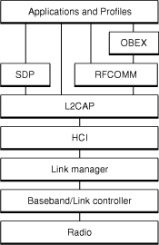
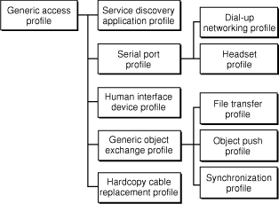

> 导航：[总目录](../../../README.md) · [documentation](../../../_indexes/documentation.md) · [Bluetooth Device Access Guide](Introduction%20to%20Bluetooth%20Device%20Access%20Guide.md)

[Next](Bluetooth%20on%20OS%20X.md)[Previous](Introduction%20to%20Bluetooth%20Device%20Access%20Guide.md)

# Bluetooth Technology Basics

This chapter provides an overview of Bluetooth technology, including a summary of the Bluetooth specification. You should read this chapter if you’re new to Bluetooth technology or if you need a brief overview of the Bluetooth specification.

Bluetooth is a cable-replacement technology designed to wirelessly connect peripherals, such as mice and mobile phones, to your desktop or laptop computer and to each other. An inexpensive, low-power, short-range radio-based technology, Bluetooth is not a wireless networking solution, such as AirPort. Rather, it is an alternative to the IrDA (Infrared Data Association) standard. Although the IrDA standard, too, supports wireless communication between peripherals and computers, it has two limiting requirements. First, IrDA devices must be very close, no more than about 1 meter apart. Second, the communicating devices must have a direct line of sight to each other.

Because it relies on radio waves, however, Bluetooth communication overcomes these strict requirements:

- Bluetooth devices can communicate at ranges of up to 10 meters.
- Bluetooth devices do not need to be in direct sight of each other.

This makes Bluetooth communication much more flexible and robust. It’s also important to note that because Bluetooth excels at low-bandwidth data transfer, it is not intended as a replacement for high-bandwidth cabled peripherals. For high-bandwidth devices, such as external hard drives or video cameras, cables are still the best option.

Apple's Bluetooth support is integrated into OS X, version 10.2 and later, and is based on the Bluetooth Special Interest Group (SIG) specification (discussed in [Bluetooth Architecture](#apple-f4xwc4dqnrsv64tfmyxwi33df52wszbpkridgmbqgaydsojxfvbuqmrrgqwugscejjeemrkg)). Apple also provides some high-level bridges between OS X functionality and the Bluetooth protocol stack. This means that many Bluetooth devices work transparently with computers running OS X version 10.2 and later. The OS X HID Manager, for example, handles a Bluetooth mouse just as it does a cabled mouse. In many cases, such high-level bridges allow your application to handle Bluetooth devices without including any Bluetooth-specific code.

Other applications may need to access Bluetooth-specific attributes and messages. For them, Apple provides a comprehensive API that allow you to take advantage of Bluetooth’s unique features. Be sure to read [Bluetooth on OS X](Bluetooth%20on%20OS%20X.md#apple-f4xwc4dqnrsv64tfmyxwi33df52wszbpkridgmbqgaydsojxfvbuqmrrguwviubz) for a description of the Bluetooth API available in OS X version 10.2 and later. For concrete examples showing how to use Apple’s Bluetooth API, see [Developing Bluetooth Applications](Developing%20Bluetooth%20Applications.md#apple-f4xwc4dqnrsv64tfmyxwi33df52wszbpkridgmbqgaydsojxfvbuqmrrgywviubz). Note that Apple does not provide a separate API for socket-based access to Bluetooth devices; instead, use the APIs described in [Bluetooth on OS X](Bluetooth%20on%20OS%20X.md#apple-f4xwc4dqnrsv64tfmyxwi33df52wszbpkridgmbqgaydsojxfvbuqmrrguwvgvzr).

The characteristics of Bluetooth technology—low cost, low power, and radio based— encouraged the concept of a personal area network (PAN). A PAN envelops the user in a small, mobile bubble of connectivity that is effortlessly available at any time. Bluetooth’s freedom from cables and potential ubiquity make it ideal for carrying your personal network around with you.

With a PAN, the possibilities are limitless:

- Imagine being able to connect to the Internet on a dial-up connection you access through your mobile phone. Surfing the Internet then becomes possible anywhere your mobile phone can connect to your internet service provider.
- Perhaps you prefer to use a traditional mouse with your laptop. Choose a Bluetooth enabled mouse and you won’t have to keep track of a mouse cable.
- If you have a Bluetooth enabled mobile phone that stores your business information in the Vcard format, you can easily share this information with your colleagues. Swap your Vcard with theirs, by wirelessly connecting to their Bluetooth enabled mobile phones.

Industry analysts predict the growing popularity and availability of Bluetooth enabled devices. This in turn raises consumer expectations for mobile PANs and provides many opportunities for vendors to create new products. At the end of 2003, the Bluetooth SIG released the second version (version 1.2) of the Bluetooth specification. This successor to version 1.1 provides a number of improvements, including:

- Enhanced quality of service (QOS). This guarantees that your human-interface (and other QOS) devices will get the time to transfer data when they need it.
- A more adaptive frequency-hopping algorithm. The new algorithm increases communication reliability and decreases interference from other wireless emitters operating the same frequency range.

Apple’s ongoing support for Bluetooth communication is evidenced by frequent Bluetooth software updates and up-to-date SDKs. Using the software frameworks and built-in support Apple provides, you can bring your Bluetooth applications to OS X with ease. Apple is committed to helping you find ways to provide your customers with the wireless connectivity they need.

This section seeks to give you an overview of the technology and specification that will provide context for the Bluetooth implementation on OS X. If you’re already familiar with the Bluetooth specification and how Bluetooth devices work, you might choose to skip ahead to [Bluetooth on OS X](Bluetooth%20on%20OS%20X.md#apple-f4xwc4dqnrsv64tfmyxwi33df52wszbpkridgmbqgaydsojxfvbuqmrrguwviubz).

Bluetooth devices operate at 2.4 GHz in the license-free, globally available ISM (Industrial, Scientific, and Medical) radio band. The advantage of operating in this band is worldwide availability and compatibility. A potential disadvantage is that Bluetooth devices must share this band with many other RF emitters. These include automobile security systems, other wireless communications standards (such as 802.11), and ordinary noise sources (such as microwave ovens).

To overcome this challenge, Bluetooth employs a fast frequency-hopping scheme and uses shorter packets than other standards in the ISM band. This scheme makes Bluetooth communication more robust and more secure.

Frequency hopping is literally jumping from frequency to frequency within the ISM band. After a Bluetooth device sends or receives a packet, it and the Bluetooth device or devices it is communicating with “hop” to another frequency before the next packet is sent. This scheme has three advantages:

- It allows Bluetooth devices to use the entirety of the available ISM band, while never transmitting from a fixed frequency for more than a very short time This ensures that Bluetooth conforms to the ISM restrictions on transmission quantity per frequency.
- It ensures that any interference will be short-lived. Any packet that doesn't arrive safely at its destination can be resent at the next frequency.
- It provides a base level of security because it's very difficult for an eavesdropping device to predict which frequency the Bluetooth devices will use next.

Of course, the connected devices must agree upon the next frequency to use. The Bluetooth specification ensures this in two ways. First, it defines a master-slave relationship between Bluetooth devices. Second, it specifies an algorithm that uses device-specific information to calculate frequency-hop sequences.

A Bluetooth device operating in master mode can communicate with up to seven slave devices. To each of its slaves, the master Bluetooth device sends its own unique device address (similar to an ethernet address) and the value of its internal clock. This information is used to calculate the frequency-hop sequence. Because the master device and all its slaves use the same algorithm with the same initial input, the connected devices always arrive together at the next frequency.

As a cable-replacement technology, it’s not surprising that Bluetooth devices are usually battery-powered devices, such as wireless mice and mobile phones. To conserve power, most Bluetooth devices operate as low-power, 1 mW radios (Class 3 radio power). This gives Bluetooth devices a range of about 5–10 meters. This range is far enough for comfortable wireless peripheral communication but close enough to avoid drawing too much power from the device’s power source.

Security is a challenge faced by every communications standard. Wireless communications present special security challenges. Bluetooth builds security into its model on several different levels, beginning with the security inherent in its frequency-hopping scheme (described in [Frequency Hopping](#apple-f4xwc4dqnrsv64tfmyxwi33df52wszbpkridgmbqgaydsojxfvbuqmrrgqwugsceivdecqkd)).

At the lowest levels of the protocol stack, Bluetooth uses the publicly available cipher algorithm known as SAFER+ to authenticate a device’s identity. The generic-access profile depends on this authentication for its device-pairing process. This process involves creating a special link to create and exchange a link key. Once verified, the link key is used to negotiate an encryption mode the devices will use for their communication.

The topic of Bluetooth security is beyond the scope of this document. For references that contain more information on Bluetooth’s encryption and authentication processes, see [See Also](Introduction%20to%20Bluetooth%20Device%20Access%20Guide.md#apple-f4xwc4dqnrsv64tfmyxwi33df52wszbpkridgmbqgaydsojxfvbuqmrrgmwugrkhjjceuqsb).

Bluetooth is both a hardware-based radio system and a software stack that specifies the linkages between layers. This supports flexibility in implementation across different devices and platforms. It also provides robust guidelines for maximum interoperability and compatibility.

In this section, you’ll learn about:

- The _Bluetooth protocol stack_. The protocol stack is the core of the Bluetooth specification that defines how the technology works.
- The _Bluetooth profiles_. The profiles define how to use Bluetooth technology to accomplish specific tasks.

The heart of the Bluetooth specification is the Bluetooth protocol stack. By providing well-defined layers of functionality, the Bluetooth specification ensures interoperability of Bluetooth devices and encourages adoption of Bluetooth technology. As you can see in [Figure 1-1](#apple-f4xwc4dqnrsv64tfmyxwi33df52wszbpkridgmbqgaydsojxfvbuqmrrgqwugsceizauqsck), these layers range from the low-level radio link to the profiles.

__Figure 1-1__  The Bluetooth protocol stack

At the base of the Bluetooth protocol stack is the _radio layer_. The radio module in a Bluetooth device is responsible for the modulation and demodulation of data into RF signals for transmission in the air. The radio layer describes the physical characteristics a Bluetooth device’s receiver-transmitter component must have. These include modulation characteristics, radio frequency tolerance, and sensitivity level.

Above the radio layer is the _baseband_ and _link controller layer_. The Bluetooth specification doesn’t establish a clear distinction between the responsibilities of the baseband and those of the link controller. The best way to think about it is that the baseband portion of the layer is responsible for properly formatting data for transmission to and from the radio layer. In addition, it handles the synchronization of links. The link controller portion of this layer is responsible for carrying out the link manager’s commands and establishing and maintaining the link stipulated by the link manager.

The _link manager_ itself translates the host controller interface (HCI) commands it receives into baseband-level operations. It is responsible for establishing and configuring links and managing power-change requests, among other tasks.

You’ve noticed links mentioned numerous times in the preceding paragraphs. The Bluetooth specification defines two types of links between Bluetooth devices:

- _Synchronous, Connection-Oriented (SCO)_, for isochronous and voice communication using, for example, headsets
- _Asynchronous, Connectionless (ACL)_, for data communication, such as the exchange of vCards

Each link type is associated with a specific packet type. A SCO link provides reserved channel bandwidth for communication between a master and a slave, and supports regular, periodic exchange of data with no retransmission of SCO packets.

An ACL link exists between a master and a slave the moment a connection is established. The data packets Bluetooth uses for ACL links all have 142 bits of encoding information in addition to a payload that can be as large as 2712 bits. The extra amount of data encoding heightens transmission security. It also helps to maintain a robust communication link in an environment filled with other devices and common noise.

The _HCI (host controller interface) layer_ acts as a boundary between the lower layers of the Bluetooth protocol stack and the upper layers. The Bluetooth specification defines a standard HCI to support Bluetooth systems that are implemented across two separate processors. For example, a Bluetooth system on a computer might use a Bluetooth module‘s processor to implement the lower layers of the stack (radio, baseband, link controller, and link manager). It might then use its own processor to implement the upper layers (L2CAP, RFCOMM, OBEX, and selected profiles). In this scheme, the lower portion is known as the _Bluetooth module_ and the upper portion as the _Bluetooth host_.

Of course, it’s not required to partition the Bluetooth stack in this way. Bluetooth headsets, for example, combine the module and host portions of the stack on one processor because they need to be small and self-contained. In such devices, the HCI may not be implemented at all unless device testing is required.

Because the Bluetooth HCI is well defined, you can write drivers that handle different Bluetooth modules from different manufacturers. Apple provides an HCI controller object that supports a USB implementation of the HCI layer.

Above the HCI layer are the upper layers of the protocol stack. The first of these is the _L2CAP (logical link control and adaptation protocol) layer_. The L2CAP is primarily responsible for:

- Establishing connections across existing ACL links or requesting an ACL link if one does not already exist
- Multiplexing between different higher layer protocols, such as RFCOMM and SDP, to allow many different applications to use a single ACL link
- Repackaging the data packets it receives from the higher layers into the form expected by the lower layers

The L2CAP employs the concept of channels to keep track of where data packets come from and where they should go. You can think of a channel as a logical representation of the data flow between the L2CAP layers in remote devices. Because it plays such a central role in the communication between the upper and lower layers of the Bluetooth protocol stack, the L2CAP layer is a required part of every Bluetooth system.

Above the L2CAP layer, the remaining layers of the Bluetooth protocol stack aren’t quite so linearly ordered. However, it makes sense to discuss the service discovery protocol next, because it exists independently of other higher-level protocol layers. In addition, it is common to every Bluetooth device.

The _SDP (service discovery protocol)_ defines actions for both servers and clients of Bluetooth services. The specification defines a service as any feature that is usable by another (remote) Bluetooth device. A single Bluetooth device can be both a server and a client of services. An example of this is the Macintosh computer itself. Using the file transfer profile (described in [The Bluetooth Profiles—A Hierarchy of Groups](#apple-f4xwc4dqnrsv64tfmyxwi33df52wszbpkridgmbqgaydsojxfvbuqmrrgqwugscejjdeercg)) a Macintosh computer can browse the files on another device and allow other devices to browse its files.

An SDP client communicates with an SDP server using a reserved channel on an L2CAP link to find out what services are available. When the client finds the desired service, it requests a separate connection to use the service. The reserved channel is dedicated to SDP communication so that a device always knows how to connect to the SDP service on any other device. An SDP server maintains its own SDP database, which is a set of service records that describe the services the server offers. Along with information describing how a client can connect to the service, the service record contains the service’s _UUID_, or _universally unique identifier_.

Also above the L2CAP layer in [Figure 1-1](#apple-f4xwc4dqnrsv64tfmyxwi33df52wszbpkridgmbqgaydsojxfvbuqmrrgqwugsceizauqsck) is the _RFCOMM layer_. The RFCOMM protocol emulates the serial cable line settings and status of an RS-232 serial port. RFCOMM connects to the lower layers of the Bluetooth protocol stack through the L2CAP layer.

By providing serial-port emulation, RFCOMM supports legacy serial-port applications. It also supports the OBEX protocol (discussed next) and several of the Bluetooth profiles (discussed in [The Bluetooth Profiles—A Hierarchy of Groups](#apple-f4xwc4dqnrsv64tfmyxwi33df52wszbpkridgmbqgaydsojxfvbuqmrrgqwugscejjdeercg)).

_OBEX (object exchange)_ is a transfer protocol that defines data objects and a communication protocol two devices can use to easily exchange those objects. Bluetooth adopted OBEX from the IrDA IrOBEX specification because the lower layers of the IrOBEX protocol are very similar to the lower layers of the Bluetooth protocol stack. In addition, the IrOBEX protocol is already widely accepted and therefore a good choice for the Bluetooth SIG, which strives to promote adoption by using existing technologies.

A Bluetooth device wanting to set up an OBEX communication session with another device is considered to be the client device.

1. The client first sends SDP requests to make sure the other device can act as a server of OBEX services.
2. If the server device can provide OBEX services, it responds with its OBEX service record. This record contains the RFCOMM channel number the client should use to establish an RFCOMM channel.
3. Further communication between the two devices is conveyed in packets, which contain requests and responses, and data. The format of the packet is defined by the OBEX session protocol.

Although OBEX can be supported over TCP/IP, this document does not discuss this option (nor is it described in the Bluetooth specification).

The Bluetooth specification defines a wide range of profiles, describing many different types of tasks, some of which have not yet been implemented by any device or system. By following the profiles’s procedures, developers can be sure that the applications they create will work with any device that conforms to the Bluetooth specification.This section focuses on those profiles that OS X supports. For information on other profiles, including those still in development, see the Bluetooth specification.

At a minimum, each profile specification contains information on the following topics:

- __Dependencies on other profiles.__ Every profile depends on the base profile, called the generic access profile, and some also depend on intermediate profiles.
- __Suggested user interface formats.__ Each profile describes how a user should view the profile so that a consistent user experience is maintained.
- __Specific parts of the Bluetooth protocol stack used by the profile.__ To perform its task, each profile uses particular options and parameters at each layer of the stack. This may include an outline of the required service record, if appropriate.

The Bluetooth profiles are organized into a hierarchy of groups, with each group depending upon the features provided by its predecessor. [Figure 1-2](#apple-f4xwc4dqnrsv64tfmyxwi33df52wszbpkridgmbqgaydsojxfvbuqmrrgqwugscejbcueqkg) illustrates the dependencies of the Bluetooth profiles.

__Figure 1-2__  The Bluetooth profiles

At the base of the profile hierarchy is the generic access profile (GAP), which defines a consistent means to establish a baseband link between Bluetooth devices. In addition to this, the GAP defines:

- Which features must be implemented in all Bluetooth devices
- Generic procedures for discovering and linking to devices
- Basic user-interface terminology

All other profiles are based on the GAP. This allows each profile to take advantage of the features the GAP provides and ensures a high degree of interoperability between applications and devices. It also makes it easier for developers to define new profiles by leveraging existing definitions.

The _service discovery application profile_ describes how an application should use the SDP (described in [The Bluetooth Protocol Stack](#apple-f4xwc4dqnrsv64tfmyxwi33df52wszbpkridgmbqgaydsojxfvbuqmrrgqwugscejjdugrkh)) to discover services on a remote device. As required by the GAP, any Bluetooth device should be able to connect to any other Bluetooth device. Based on this, the service discovery application profile requires that any application be able to find out what services are available on any Bluetooth device it connects to.

The _human interface device (HID) profile_ describes how to communicate with a HID class device using a Bluetooth link. It describes how to use the USB HID protocol to discover a HID class device’s feature set and how a Bluetooth device can support HID services using the L2CAP layer. For more information about the USB HID protocol, see [http://www.usb.org](http://www.usb.org/).

As its name suggests, the _serial port profile_ defines RS-232 serial-cable emulation for Bluetooth devices. As such, the profile allows legacy applications to use Bluetooth as if it were a serial-port link, without requiring any modification. The serial port profile uses the RFCOMM protocol to provide the serial-port emulation.

The _dial-up networking (DUN) profile_ is built on the serial port profile and describes how a data-terminal device, such as a laptop computer, can use a gateway device, such as a mobile phone or a modem, to access a telephone-based network. Like other profiles built on top of the serial port profile, the virtual serial link created by the lower layers of the Bluetooth protocol stack is transparent to applications using the DUN profile. Thus, the modem driver on the data-terminal device is unaware that it is communicating over Bluetooth. The application on the data-terminal device is similarly unaware that it is not connected to the gateway device by a cable.

The _headset profile_ describes how a Bluetooth enabled headset should communicate with a computer or other Bluetooth device (such as a mobile phone). When connected and configured, the headset can act as the remote device’s audio input and output interface.

The _hardcopy cable replacement profile_ describes how to send rendered data over a Bluetooth link to a device, such as a printer. Although other profiles can be used for printing, the HCRP is specially designed to support hardcopy applications.

The _generic object exchange profile_ provides a generic blueprint for other profiles using the OBEX protocol and defines the client and server roles for devices. As with all OBEX transactions, the generic object exchange profile stipulates that the client initiate all transactions. The profile does not, however, describe how applications should define the objects to exchange or exactly how the applications should implement the exchange. These details are left to the profiles that depend on the generic object exchange profile, namely the object push, file transfer, and synchronization profiles.

The _object push profile_ defines the roles of push server and push client. These roles are analogous to and must interoperate with the server and client device roles the generic object exchange profile defines. The object push profile focuses on a narrow range of object formats for maximum interoperability. The most common of the acceptable formats is the vCard format. If an application needs to exchange data in other formats, it should use another profile, such as the file transfer profile.

The _file transfer profile_ is also dependent on the generic object exchange profile. It provides guidelines for applications that need to exchange objects such as files and folders, instead of the more limited objects supported by the object push profile. The file transfer profile also defines client and server device roles and describes the range of their responsibilities in various scenarios. For example, if a client wishes to browse the available objects on the server, it is required to support the ability to pull from the server a folder-listing object. Likewise, the server is required to respond to this request by providing the folder-listing object.

The _synchronization profile_ is another dependent of the generic object exchange profile. It describes how applications can perform data synchronization, such as between a personal data assistant (PDA) and a computer. Not surprisingly, the synchronization profile, too, defines client and server device roles. The synchronization profile focuses on the exchange of personal information management (PIM) data, such as a to-do list, between Bluetooth enabled devices. A typical usage of this profile would be an application that synchronizes your computer’s and your PDA’s versions of your PIM data. The profile also describes how an application can support the automatic synchronization of data—in other words, synchronization that occurs when devices discover each other, rather than at a user’s command.

[Next](Bluetooth%20on%20OS%20X.md)[Previous](Introduction%20to%20Bluetooth%20Device%20Access%20Guide.md)

