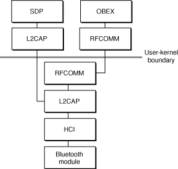
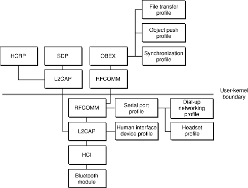
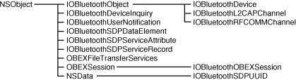
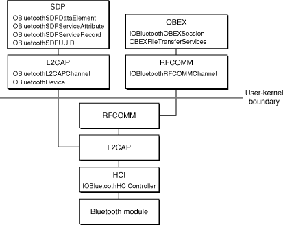

> 导航：[总目录](../../../README.md) · [documentation](../../../_indexes/documentation.md) · [Bluetooth Device Access Guide](Introduction%20to%20Bluetooth%20Device%20Access%20Guide.md)

[Next](Developing%20Bluetooth%20Applications.md)[Previous](Bluetooth%20Technology%20Basics.md)

# Bluetooth on OS X

Because Apple provides high-level managers and abstractions that transparently perform Bluetooth connection–oriented tasks for many types of applications, you may never need to use the API this chapter describes. There are some exceptions to this, however, such as:

- An application that must display Bluetooth-specific error messages to provide a more informative and responsive user experience
- An application that vends a new service
- An application that implements a new profile

In these applications, you will need to use the API the Bluetooth frameworks provide. To prepare a foundation for the discussion of the API, this chapter first describes the OS X implementation of the Bluetooth protocol stack. Then, it describes the various objects, methods, and functions available in the Bluetooth frameworks. For application-design considerations and outlines of how to use the Bluetooth API to perform specific tasks, see [Developing Bluetooth Applications](Developing%20Bluetooth%20Applications.md#apple-f4xwc4dqnrsv64tfmyxwi33df52wszbpkridgmbqgaydsojxfvbuqmrrgywviubz).

The foundation of OS X Bluetooth support is Apple’s implementation of the Bluetooth protocol stack. For reference, the Bluetooth protocol stack, as defined by the Bluetooth SIG, is described in [The Bluetooth Protocol Stack](Bluetooth%20Technology%20Basics.md#apple-f4xwc4dqnrsv64tfmyxwi33df52wszbpkridgmbqgaydsojxfvbuqmrrgqwugscejjdugrkh). [Figure 2-1](#apple-f4xwc4dqnrsv64tfmyxwi33df52wszbpkridgmbqgaydsojxfvbuqmrrguwugskbi5busq2d) shows the Bluetooth protocol stack that’s built into OS X version 10.2 and later.

__Figure 2-1__  The OS X Bluetooth protocol stack

The OS X implementation of the Bluetooth protocol stack includes both in-kernel and user-level portions. [Figure 2-1](#apple-f4xwc4dqnrsv64tfmyxwi33df52wszbpkridgmbqgaydsojxfvbuqmrrguwugskbi5busq2d) shows the layers of the stack that exist in the kernel and the corresponding user-level layers an application can access.

The _Bluetooth module_ at the bottom of the stack is the hardware component that implements the Bluetooth radio, baseband, and link manager protocols. Neither an application nor even the host has access to this layer of the stack.

As described in [The Bluetooth Protocol Stack](Bluetooth%20Technology%20Basics.md#apple-f4xwc4dqnrsv64tfmyxwi33df52wszbpkridgmbqgaydsojxfvbuqmrrgqwugscejjdugrkh), the _HCI layer_ transmits data and commands from the layers above to the Bluetooth module below. Conversely, the HCI layer receives events from the Bluetooth module and transmits them to the upper layers.

To implement the functions of the HCI layer in the kernel, Apple defines the abstract class IOBluetoothHCIController. IOBluetoothHCIController is the superclass of another in-kernel object, AppleBluetoothUSBHCIController, which provides support for Bluetooth over USB. Therefore, any hardware that supports the USB HCI specification should work with the Bluetooth implementation on OS X version 10.2 and later. It is possible, although certainly not trivial, to subclass the IOBluetoothHCIController object to provide vendor-specific functionality or to support Bluetooth over a transport other than USB. If you need to do this, you should contact Apple’s Developer Technical Support (at [http://developer.apple.com/technicalsupport](https://developer.apple.com/technicalsupport)) for assistance.

Apple implements the L2CAP and RFCOMM layers in the kernel. Applications can use objects in the user-level L2CAP and RFCOMM layers to access the corresponding in-kernel objects, although many applications will not need to do so directly.

Recall that the L2CAP (logical link control adaptation protocol) provides:

- Multiplexing of data channels
- Segmentation and reassembly of data packets to conform to a device’s maximum packet size
- Support for different channel types and channel IDs, such as RFCOMM

The in-kernel _L2CAP layer_ provides the transport for the higher-level protocols and profiles. As the primary communication gateway between two Bluetooth enabled devices, the OS X L2CAP layer implements the ability to register as a client of an L2CAP channel and write data to the channel. Using the L2CAP layer’s multiplexing feature, it is possible to send and receive data to and from the RFCOMM layer and the SDP layer at the same time.

Above the in-kernel L2CAP layer in [Figure 2-1](#apple-f4xwc4dqnrsv64tfmyxwi33df52wszbpkridgmbqgaydsojxfvbuqmrrguwugskbi5busq2d) is the RFCOMM protocol layer. The in-kernel _RFCOMM protocol layer_ is a serial-port emulation protocol. Its primary mission is to make a data channel appear as a serial port. It also implements the ability to create and destroy RFCOMM channels and to control the speed of the channel as if it were a physical serial-port cable.

The portion of the stack shown above the user-kernel boundary in [Figure 2-1](#apple-f4xwc4dqnrsv64tfmyxwi33df52wszbpkridgmbqgaydsojxfvbuqmrrguwugskbi5busq2d) is accessible to applications. The L2CAP and RFCOMM layers in user space are not duplicates of the in-kernel L2CAP and RFCOMM layers. Instead, they represent the user-level APIs an application uses to communicate with the corresponding in-kernel layers.

The _SDP (service discovery protocol) layer_ is more of a service than a protocol, but it is part of the built-in OS X Bluetooth protocol stack. It is shown connected to the user-level L2CAP layer because it uses an L2CAP channel to communicate with remote Bluetooth devices to discover their available services. Apple provides an SDP API you can use to discover what services a device supports.

Above the user-level RFCOMM layer is the _OBEX (object exchange) protocol layer_. The OBEX protocol is an HTTP-like protocol that supports the transfer of simple objects, like files, between devices. The OBEX protocol uses an RFCOMM channel for transport because of the similarities between IrDA (which defines the OBEX protocol) and serial-port communication.

In versions of OS X prior to 10.4, the OBEX API provides primitive commands, such as `CONNECT`, `PUT`, and `GET`. Beginning in OS X version 10.4, Apple introduced API that simplifies common OBEX operations found in the object push and file transfer profiles, such as getting and putting file objects on remote devices. This API makes it easy for a developer to create an application that adheres to the requirements of these profiles. Note that if you want to use OBEX for other profiles, however, you probably will still need to rely on the primitive commands provided by the OBEX API. For more information on the new API, see [OBEXFileTransferServices Class](#apple-f4xwc4dqnrsv64tfmyxwi33df52wszbpkridgmbqgaydsojxfvbuqmrrguwugsceineeersk) and [Objects in OBEX Connections](#apple-f4xwc4dqnrsv64tfmyxwi33df52wszbpkridgmbqgaydsojxfvbuqmrrguwviucykjcummrq).

In addition to the protocols shown in [Figure 2-1](#apple-f4xwc4dqnrsv64tfmyxwi33df52wszbpkridgmbqgaydsojxfvbuqmrrguwugskbi5busq2d), OS X implements several Bluetooth profiles. In general, a profile defines a particular usage of the protocols. [Figure 2-2](#apple-f4xwc4dqnrsv64tfmyxwi33df52wszbpkridgmbqgaydsojxfvbuqmrrguwugscei5becr2f) shows how each profile is built on top of particular protocols in the OS X Bluetooth protocol stack.

__Figure 2-2__  OS X Bluetooth profiles

In OS X version 10.2.8 and later, the available profiles are:

- _DUN (dial-up networking)_. Supports links between, for example, a mobile phone and a laptop computer. This allows you to access the Internet by connecting to an Internet service provider through your mobile phone.
- _HID (human interface device)_. Supports Bluetooth enabled HID-class devices, such as keyboards and mice. In most cases, this means that you can expect a Bluetooth enabled HID-class device to work transparently with an OS X system.

  Further, all Bluetooth enabled HID-class devices are supported by the OS X HID Manager. This means that you can use the HID Manager API to access your device.
- _Serial port_. Provides a bridge from the RFCOMM protocol to the built-in OS X serial port driver. You can use this profile to support legacy applications that depend on direct serial-port access.
- _Object push_. Allows the transfer of small files (several hundred Kilobytes in size or less) between Bluetooth enabled devices. You can use this profile to send and receive files in the vCard format, such as virtual business cards.
- _FTP (file transfer protocol)_. Allows a Bluetooth device to be treated as a remote file system. You can use the FTP profile to browse a remote Bluetooth device’s file system, get directory listings, and transfer files.
- _Synchronization_. Supports synchronization of data between a computer and a device such as a Bluetooth enabled PDA. You can use this profile to implement automatic data synchronization that occurs as soon as devices discover each other, rather than at a user’s command.

With version 1.5 of the Bluetooth software, two new profiles became available:

- _HCRP (hardcopy cable replacement profile)_. This profile allows the transfer of rendered data between Bluetooth enabled devices, such as between a laptop and a printer. It is assumed that the client device (in this case, the laptop) will include a driver that renders the data. Note that OS X supports Bluetooth printing through the OS X printing API.
- _Headset profile_. The headset profile allows an application to use a Bluetooth enabled headset as the input or output audio device. After a headset is properly configured using the Bluetooth Setup Assistant application, an input and an output audio device associated with the headset are available for selection.

OS X also provides a number of Bluetooth-specific applications. These applications guide users through various set-up procedures, such as configuring new Bluetooth devices and setting up serial-port communication.

In versions of OS X prior to 10.4, the Bluetooth applications are:

- _Bluetooth File Exchange_. This application uses the FTP profile to support the exchange of files between two connected Bluetooth devices.
- _Bluetooth Serial Utility_. This application allows an advanced user to set up serial-port emulation. Bluetooth Serial Utility encapsulates the functionality that was available in the System Preferences in previous versions of OS X.
- _Bluetooth Setup Assistant_. Using an easy, step-by-step approach, this application guides the user through the configuration of a new Bluetooth device, setting it up to work with system services, such as iSync.

In OS X, version 10.4, Apple introduced two new Bluetooth applications:

- _Bluetooth Explorer_. This application allows you to:

  - Verify that your new Bluetooth service is properly registered
  - View a computer’s Bluetooth hardware information
  - Perform inquiries and view detailed results regarding discovered devices
  - View active Bluetooth connections
  - Select different Bluetooth hardware attached to the computer (if more than one Bluetooth device is present on the computer)
- _Packet Logger_. This application monitors all Bluetooth traffic being transmitted on the computer and saves it to a log file. You can then view the captured data in the log file to help debug problems in your application, or with Bluetooth hardware.

These tools are available as part of the Hardware IO Tools package, which developers can download by going to the Xcode > Open Developer Tool > More Developer Tools… menu in Xcode.

Finally, you can use the Bluetooth preferences panel in System Preferences to place selected Bluetooth devices in categories, such as favorites. Note that the Bluetooth preferences panel appears in System Preferences only if a Bluetooth device is in range.

The OS X Bluetooth API consists of two frameworks that provide all the methods and functions you need to access Bluetooth-specific functionality in your application:

- `IOBluetooth.framework`
- `IOBluetoothUI.framework`

Both frameworks are in `/System/Library/Frameworks` and each has a specific target.

The _Bluetooth framework_ contains the API you use to perform Bluetooth-specific tasks. With the methods and functions in the Bluetooth framework, you can:

- Create and destroy connections to remote devices
- Discover services on a remote device
- Perform data transfers over various channels
- Receive Bluetooth-specific status codes or messages

The _Bluetooth UI framework_ contains the API you use to provide a consistent user interface in your applications. This API provides Aqua-compliant panels your application can present to the user. These panels help the user to perform tasks such as creating connections, pairing with remote devices, and discovering services.

For maximum flexibility, the Bluetooth and Bluetooth UI framework APIs are available in both C and Objective-C. To emphasize the parity between the two versions, the APIs follow a naming convention that makes it easy to see the correspondence between entities. For example, methods in the Objective-C API refer to the object representing a Bluetooth device as IOBluetoothDevice. Functions in the C API refer to the same entity with an `IOBluetoothDeviceRef` variable.

Whether you choose C or Objective-C to develop your application, it’s important to become comfortable with an object-oriented perspective of Bluetooth connections. The Bluetooth framework defines object-oriented abstractions that encapsulate all the components in a Bluetooth connection. Channels, connections, and remote devices are all represented by objects. Even if you choose to develop a Bluetooth application in C, it helps to view the various entities in the connection as objects with specific, well-defined capabilities and responsibilities. This helps you visualize a Bluetooth connection and keep track of each object’s scope of operation.

This section examines the Objective-C Bluetooth classes, describing their inheritance relationships and some of their functionality and displaying how they fit into the protocol stack. The next section, [Objects in Bluetooth Connections](#apple-f4xwc4dqnrsv64tfmyxwi33df52wszbpkridgmbqgaydsojxfvbuqmrrguwugskbjjeekqkd), examines the objects instantiated from these classes and describes their dynamic relationships in a particular Bluetooth connection.

The Bluetooth framework contains several classes, a few of which will never be handled directly by any application. Some of the classes are base classes that provide you with useful subclasses. Others are accessible only through instances that are created by intermediate objects. Nevertheless, an understanding of the class hierarchy will give you insight into the architecture of a Bluetooth connection in OS X.

[Figure 2-3](#apple-f4xwc4dqnrsv64tfmyxwi33df52wszbpkridgmbqgaydsojxfvbuqmrrguwugskbjfeumr2d) shows the inheritance relationships of the Bluetooth framework classes.

__Figure 2-3__  The OS X Bluetooth class hierarchy

As you can see in [Figure 2-3](#apple-f4xwc4dqnrsv64tfmyxwi33df52wszbpkridgmbqgaydsojxfvbuqmrrguwugskbjfeumr2d), the inheritance relationships among these classes are uncomplicated. All classes in the Bluetooth framework inherit directly or indirectly from NSObject, which is the root class of most Objective-C class hierarchies. NSObject provides its subclasses with the ability to behave as objects and with a basic interface to the run-time system for the Objective-C language.

The classes IOBluetoothDevice, IOBluetoothL2CAPChannel, and IOBluetoothRFCOMMChannel inherit from the _IOBluetoothObject class_. The IOBluetoothObject class imparts the ability to respond to Bluetooth-specific events. The _IOBluetoothDevice class_ provides instance methods to open and close baseband connections to a remote device and to get information about that connection.

OS X version 10.2.5 includes fully asynchronous versions of the IOBluetoothDevice methods to open and close L2CAP and RFCOMM channels. In Objective-C, these methods rely on the instantiation of a delegate object to receive notifications of incoming data and other callbacks. A delegate object is simply an object that performs a task on behalf of another object. For example, if an Objective-C application wants to receive notifications of the state of an L2CAP channel (such as open completed or closed) it can register its object as a delegate of the associated IOBluetoothL2CAPChannel object. The application then chooses to implement the delegate methods that relay information about the state of the channel. When the state of the L2CAP channel changes, the appropriate delegate method is called, notifying the application.

Because a C or C++ application does not have access to Objective-C delegates, it registers callback functions to receive notifications of the events it’s interested in. The Bluetooth framework follows a naming convention that emphasizes the functional similarity of the delegate methods and events. For example, the Objective-C delegate method `l2capChannelOpenComplete:status:` is equivalent to the C event type `kIOBluetoothL2CAPChannelEventTypeOpenComplete`.

The _IOBluetoothL2CAPChannel class_ and _IOBluetoothRFCOMMChannel class_ provide methods to write data to the channels and to register for various open and close notifications. These two classes can also use a delegate as a target for data and events. Be aware that to take advantage of the benefits delegates provide, you must:

- Be running on OS X version 10.2.5 or later
- Create a delegate object and register it as a client of the channel
- Implement at least the incoming data–callback method in your delegate

For more information on how to use the new asynchronous methods, see [Using Delegates to Receive Asynchronous Messages](Developing%20Bluetooth%20Applications.md#apple-f4xwc4dqnrsv64tfmyxwi33df52wszbpkridgmbqgaydsojxfvbuqmrrgywueqkdjbceqrch).

The _OBEXSession class_ (which descends directly from NSObject) provides the methods required to manipulate an OBEX session. The OBEXSession class doesn’t inherit from IOBluetoothObject, because the particular transport on which the connection is established is immaterial to the implementation of the OBEX protocol. With some work, you could use the OBEXSession class’s methods to implement an OBEX session over a non-Bluetooth transport, such as Ethernet. The OBEXSession class is strictly concerned with the details of communicating using the OBEX protocol, regardless of the underlying transport.

The Bluetooth framework hierarchy includes one subclass of the OBEXSession class, the _IOBluetoothOBEXSession class_. This class provides methods to manipulate an OBEX session with a Bluetooth RFCOMM channel as the transport.

In OS X version 10.4, Apple introduced the _OBEXFileTransferServices_ class. Inheriting from NSObject, the new OBEXFileTransferServices class supports file-transfer operations beyond the `PUT` and `GET` primitives in the OBEX API. Using a valid IOBluetoothOBEXSession object, you create an OBEXFileTransferServices object which you can use to perform FTP or object push operations.

The OBEXFileTransferServices API includes delegate methods that correspond to the class’s connection, disconnection, and folder manipulation instance methods.

The _IOBluetoothUserNotification class_ encapsulates a user notification registered on an OS X system. When your application registers for certain notifications (such as incoming channel notifications), it receives an IOBluetoothUserNotification object. The single method the IOBluetoothUserNotification class provides allows you to unregister from these notifications.

In OS X version 10.4, Apple introduced the _IOBluetoothDeviceInquiry_ class. A subclass of NSObject, the IOBluetoothDeviceInquiry class is intended for the small subset of applications that cannot use the GUI-based device-discovery API provided in the Bluetooth UI framework. Although the Bluetooth specification describes an inquiry process, there are good reasons not to implement it without restrictions (for more information on this, see [Inquiring and Paging](Developing%20Bluetooth%20Applications.md#apple-f4xwc4dqnrsv64tfmyxwi33df52wszbpkridgmbqgaydsojxfvbuqmrrgywviucykjcummjrg4)). The IOBluetoothDeviceInquiry class provides methods that allow applications to perform Bluetooth inquiries while enforcing limitations that ensure the best possible user experience.

The remaining classes shown in [Figure 2-3](#apple-f4xwc4dqnrsv64tfmyxwi33df52wszbpkridgmbqgaydsojxfvbuqmrrguwugskbjfeumr2d) are concerned with the implementation of the service discovery protocol. Recall that information about the services a Bluetooth device offers is contained in that device’s SDP database. The SDP database comprises a set of records, each of which uses service attributes to describe the service. The _IOBluetoothSDPServiceRecord class_ provides instance methods to get information about individual SDP service records. As its name suggests, the IOBluetoothSDPServiceAttribute class provides methods to create, initialize, and get information about the attributes of SDP service records.

The information contained in each service attribute is a value of a particular type (such as Boolean value or text string) with a particular size. A device must be prepared for the type and size of the information it receives in a service attribute, so the attributes are sent inside SDP data elements. An SDP data element is part type descriptor and part size descriptor. The _IOBluetoothSDPDataElement class_ maps the data types described in the Bluetooth specification onto various Foundation classes. These classes include NSNumber, NSString, and NSArray, as well as the NSData subclass, _IOBluetoothSDPUUID_, which provides methods to represent and manipulate UUIDs. In addition, the IOBluetoothSDPDataElement class provides methods to create, initialize, and get information about the data element of each service attribute. (NSNumber, NSArray, and NSData are subclasses of NSObject; for more information on these and other Foundation classes, see the Foundation API reference at [Cocoa Documentation](https://developer.apple.com/library/archive/navigation/redirect.html#//apple_ref/doc/uid/TP30000416).)

The inheritance relationships pictured in [Figure 2-3](#apple-f4xwc4dqnrsv64tfmyxwi33df52wszbpkridgmbqgaydsojxfvbuqmrrguwugskbjfeumr2d) display the hierarchical structure of the Bluetooth framework classes. This helps describe their spheres of influence. [Figure 2-4](#apple-f4xwc4dqnrsv64tfmyxwi33df52wszbpkridgmbqgaydsojxfvbuqmrrguwugsceirdecskh) shows the classes that applications can use (in addition to the IOBluetoothHCIController class you can subclass to support Bluetooth over an alternate transport) and how they fit into the protocol stack.

__Figure 2-4__  Bluetooth classes in the Bluetooth protocol stack

The next section describes the objects that are instantiated from these classes (with the exception of the IOBluetoothHCIController class) and how they work together to represent a connection to a remote Bluetooth device.

You can think of a connection to a remote Bluetooth device as a vertical slice through the Bluetooth protocol stack (shown in [Figure 2-1](#apple-f4xwc4dqnrsv64tfmyxwi33df52wszbpkridgmbqgaydsojxfvbuqmrrguwugskbi5busq2d)). Depending on precisely which protocols are involved, the connection is built of pieces from the appropriate layers. View these pieces as objects and you can see how a Bluetooth connection might be modeled.

This section describes the roles of the Bluetooth framework objects in Bluetooth connections. Bear in mind that many of these objects are automatically created by other objects. When a Bluetooth enabled device is discovered, low-level drivers and higher-level managers create objects to represent it. Most applications, therefore, never need to create directly many of these objects to perform their functions.

For more information on how to use these objects in a Bluetooth application, see [Developing Bluetooth Applications](Developing%20Bluetooth%20Applications.md#apple-f4xwc4dqnrsv64tfmyxwi33df52wszbpkridgmbqgaydsojxfvbuqmrrgywviubz).

The _IOBluetoothDevice object_ is the root object of every Bluetooth connection. You use this root object to create connections to the device, including the initial baseband connection. For example, you can open L2CAP and RFCOMM channels using methods of the IOBluetoothDevice object. You can also use its methods to perform SDP service searches.

The IOBluetoothDevice object is the only object in the Bluetooth stack that can be created without a concrete connection behind it. In other words, it can exist even before you create the baseband connection to the device. You might, for example, know a device’s address from an earlier device search. Using this device address, you can instantiate an IOBluetoothDevice object to represent the device. You can then access cached information about the device, such as device name and SDP attributes, while deferring the creation of the baseband connection until the user selects that device.

In OS X version 10.2.4 and later, the IOBluetoothDevice object includes API to support device categorization based on user-selected criteria. The new methods and functions allow you “mark” a device as a recently accessed device or as a user-designated favorite. Your application can use these new device attributes to display to the user only those devices in a specific category. For more information on the use of these attributes, see [Filtering and Validation](#apple-f4xwc4dqnrsv64tfmyxwi33df52wszbpkridgmbqgaydsojxfvbuqmrrguwugskbiveeqssd).

The _IOBluetoothL2CAPChannel object_ represents the data conduit between a local and a remote device and is a required component in every Bluetooth connection. This is because the L2CAP layer provides the facilities higher-layer protocols need to communicate across a Bluetooth link. An IOBluetoothL2CAPChannel object provides methods to read from and write to the channel. It also provides a `setDelegate:` method that allows a client to register itself as a client of the L2CAP channel.

An IOBluetoothL2CAPChannel object can also exist in the absence of a concrete channel. Unlike an IOBluetoothDevice object, however, it can be created only when an IOBluetoothDevice object opens an L2CAP channel. An IOBluetoothL2CAPChannel object can persist after the closure of its associated L2CAP channel, but it will return errors for any calls it receives.

The _IOBluetoothRFCOMMChannel object_ represents an RFCOMM channel. Like the IOBluetoothL2CAPChannel object, the IOBluetoothRFCOMMChannel object provides API to open and close the channel and read from and write to the channel. In addition, an RFCOMMChannel object makes available methods to receive event notifications.

An OBEXSession object represents an OBEX connection to a remote device. Because it handles the commands typical of an OBEX session, the object itself is agnostic about the type of transport underlying the connection. The object’s usefulness lies in the methods it provides the object of a transport-specific subclass, such as the RFCOMM-based IOBluetoothOBEXSession class. Thus, your Bluetooth application will never create or access a raw OBEXSession object. Instead, it will get an OBEXSession subclass object, like an IOBluetoothOBEXSession object. With this object, it can override some of the OBEXSession class’s methods to manipulate the OBEX session.

The _IOBluetoothOBEXSession object_ represents an OBEX session using a Bluetooth RFCOMM channel as the transport. If your application acts as an OBEX server or client over an RFCOMM channel, you first create an IOBluetoothOBEXSession object. Then, you use its methods (and some of its superclass’s) to open and close the transport connection and send and receive data.

Beginning in OS X version 10.4, if your application needs to perform FTP or object push operations over OBEX, you can use a valid IOBluetoothOBEXSession object to create an _OBEXFileTransferServices_ object. Note that the IOBluetoothOBEXSession does not have to be connected to a remote server to successfully create an OBEXFileTransferServices object. The connection can be made explicitly, using one of the OBEXFileTransferServices connection methods or implicitly, when you call any of its file-transfer methods.

Although most applications can perform discovery of in-range devices using the APIs in the Bluetooth UI framework, some must perform non-GUI inquiries. If your application is running in OS X version 10.4 or later, you can use the IOBluetoothDeviceInquiry object to find devices in proximity to the computer and, optionally, retrieve name information from them.

It’s important to realize that the device inquiry process, although it is supported by the Bluetooth specification, can negatively affect other devices in the vicinity. For this reason, you are encouraged to use the GUI-based device discovery methods the Bluetooth UI framework provides. For more information on the problems that can arise from device inquiries and pages, see [Inquiring and Paging](Developing%20Bluetooth%20Applications.md#apple-f4xwc4dqnrsv64tfmyxwi33df52wszbpkridgmbqgaydsojxfvbuqmrrgywviucykjcummjrg4).

If your application cannot use the GUI-based device discovery methods, you can use the methods of the IOBluetoothDeviceInquiry object. Before you use this object, however, it is essential that you are aware of both its built-in restrictions and the limits your application must observe when using it. For specific information on using the IOBluetoothDeviceInquiry object, see [Performing Device Inquiries](Developing%20Bluetooth%20Applications.md#apple-f4xwc4dqnrsv64tfmyxwi33df52wszbpkridgmbqgaydsojxfvbuqmrrgywueqkdizfeqrkc).

There are four objects that support SDP-related tasks:

- IOBluetoothSDPServiceRecord
- IOBluetoothSDPServiceAttribute
- IOBluetoothSDPDataElement
- IOBluetoothSDPUUID

The _IOBluetoothSDPServiceRecord object_ represents a service offered by a Bluetooth device. A Bluetooth device can make several services available; each is described by an instance of IOBluetoothSDPServiceRecord in its SDP database. Each IOBluetoothSDPServiceRecord object contains two elements that, together, describe the service:

- A reference to the device offering the service.
- An NSDictionary of service attributes.

When an SDP client (a device that is looking for a particular service) performs an SDP query, it looks for a service record that contains one or more specific attributes.

The _IOBluetoothSDPServiceAttribute object_ represents a single SDP service attribute. An IOBluetoothSDPServiceRecord object can contain several IOBluetoothSDPServiceAttribute objects in its instance of NSDictionary. Each IOBluetoothSDPServiceAttribute object contains an attribute ID (an unsigned 16-bit integer) and an instance of IOBluetoothSDPDataElement that describes one of the service’s attributes. The Bluetooth specification defines a large number of attributes a profile can use to describe a service, in addition to those the profile defines. Examples of attributes are the service’s name, list of supported Bluetooth profiles, and service ID.

An _IOBluetoothSDPDataElement object_ represents a single SDP data element. To alert a device to what type and size of data it is about to receive in a data element, the IOBluetoothSDPDataElement object provides this information along with the data itself. An IOBluetoothSDPDataElement object contains:

- A data element type descriptor
- A data element size descriptor (calculated from the actual size of the data element)
- The size of the data element
- The data element value itself

The Bluetooth specification defines nine types of data elements, including unsigned integer, URL, and text string. Apple has mapped these types onto appropriate Foundation classes such as NSNumber and NSString. In addition, Apple has defined the class _IOBluetoothSDPUUID_ to describe the UUID (universally unique ID) data element type. An IOBluetoothSDPUUID object can represent a UUID of any valid size (16, 32, or 128 bits) and contains methods to compare UUIDs and convert a smaller UUID to a larger one.

Because OS X automatically creates IOBluetoothSDPDataElement objects for most client and server operations, your application should never need to explicitly create them. The exception to this is if you plan to define a new SDP service and make it available to the system. In this case, you will appreciate Apple’s decision to use Foundation classes to represent both the collection of service attributes and the types of data elements.

Instead of writing a lot of code to build up a service record, you can define your new service with a collection of key-value pairs in a property list (`plist`) file. You can then import this file into your application, using the `IOBluetoothAddServiceDict` function to create a new IOBluetoothSDPServiceRecord object. The `IOBluetoothAddServiceDict` function uses the properties in your `plist` file to populate the IOBluetoothSDPServiceRecord’s NSDictionary of service attributes. For more information on how to do this, see [Providing a New Service](Developing%20Bluetooth%20Applications.md#apple-f4xwc4dqnrsv64tfmyxwi33df52wszbpkridgmbqgaydsojxfvbuqmrrgywueqkdjfducscd).

The Bluetooth UI framework provides objects, methods, and functions your application can use to perform user interface tasks. As with the API of the Bluetooth framework, the Bluetooth UI framework contains Objective-C and C versions of its API. The primary objects in the API are subclasses of NSWindowController, which supports the loading, displaying, and closing of windows, among other things.

By using the user interface objects defined in the Bluetooth UI API, you can obtain a consistent look and feel across all your Bluetooth applications—without having to write code to implement standard user interface tasks, such as searching for devices or services and creating paired-device relationships.

Common to both the C and Objective-C versions of the API are the following three objects:

- _Service browser controller_. In the Objective-C API, an IOBluetoothServiceBrowserController object and in the C API, an `IOBluetoothServiceBrowserControllerRef`

  This object displays a window in which a user can find in-range Bluetooth devices, perform SDP queries on them, and select SDP services.
- _Device selector controller_. In the Objective-C API, an IOBluetoothDevice SelectorController object and in the C API, an `IOBluetoothDeviceSelectorControllerRef`

  This object displays a window in which a user can select a particular device with which to communicate.
- _Pairing controller_. In the Objective-C API, an IOBluetoothPairingController object and in the C API, an `IOBluetoothPairingControllerRef`

  This object displays a window in which a user can initiate pairing with a remote Bluetooth device. If necessary, this object will also prompt the user for a personal identification number (PIN) to complete the pairing process.

In OS X version 10.2.4, the Bluetooth UI framework includes support for filtering and validation in its user interface objects. The service browser controller, device selector controller, and pairing controller objects allow the user to filter the list of available devices and services by the following categories:

- Device type
- Favorite devices
- Recently accessed devices

Not only does filtering narrow the list of available devices and services presented to the user, it also makes it easier for the user to connect to particular devices. For example, if a user marks a device as a favorite, it is listed as such in all user interface panels the Bluetooth UI framework provides. The user can then select this favorite device, usually with a single click, bypassing the device discovery process. This is especially useful in an environment filled with Bluetooth devices.

Filtering is a user-initiated process, designed to make it easier for users to find and connect to Bluetooth devices. Validation, on the other hand, is application-initiated. It is designed to ensure that the user can select only those devices that support services the application designates. To perform validation, the user interface objects available in OS X version 10.2.4 and later perform an SDP query on the device the user chooses. Before finalizing the user’s selection, the user interface object verifies that the device does indeed offer the service the application desires. If it does, the application is guaranteed to have access to the appropriate service. If it doesn’t, the user is prompted to make an alternate selection.

With service validation a part of the selection process, user experience is enhanced. Your application can quickly inform the user if the selected device is appropriate or not, while still in the context of the selection process. Otherwise, your application must accept the user’s selection, perform the validation, and repeat the selection process if the selection is invalid.

Also introduced in OS X version 10.2.4 is the option to run a user interface panel as a sheet on a target window or in a modal session.

A sheet is a dialog panel that’s attached to its associated window so that a user never loses track of which window the dialog belongs to. While a sheet is open, the user is prevented from doing anything else in the window that owns the sheet until the sheet is dismissed. When the sheet is dismissed, an application-defined delegate object receives the results of the user’s action.

By running a panel in a modal session, an application can perform lengthy operations while still sending events to the panel. If you choose to run a user interface panel in a modal session, the user interface object will validate the user’s selection before the method returns.

In addition, all text in a user interface panel can be customized and localized, regardless of display mode.

[Next](Developing%20Bluetooth%20Applications.md)[Previous](Bluetooth%20Technology%20Basics.md)

