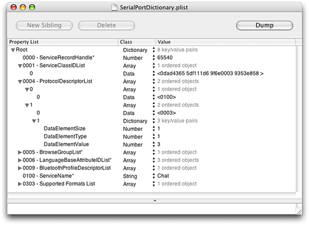

> 导航：[总目录](../../../README.md) · [documentation](../../../_indexes/documentation.md) · [Bluetooth Device Access Guide](Introduction%20to%20Bluetooth%20Device%20Access%20Guide.md)


[Next](Document%20Revision%20History.md)[Previous](Bluetooth%20on%20OS%20X.md)

# Developing Bluetooth Applications

This chapter describes how to develop Bluetooth applications for OS X. In this context, _Bluetooth applications_ encompasses the full range of applications that access Bluetooth enabled devices, directly or indirectly. Whether you’re interested in vending a Bluetooth service or in making sure your application handles a Bluetooth device just like any other, this chapter will help get you started.

This chapter first presents an overview of different types of Bluetooth applications. Then it discusses general design principles to consider while developing a Bluetooth application for OS X. Finally, it describes some specific tasks an application might need to perform.

Bluetooth applications run the gamut from games that can utilize a Bluetooth input device to applications that vend Bluetooth services or support new profiles. Different applications need different levels of “Bluetooth awareness” to successfully perform their functions. Some applications may be able to use a high-level manager that OS X provides without ever having to use the Bluetooth API. Others will use the Bluetooth API extensively to provide Bluetooth-specific services. The integration of Bluetooth support on OS X supports applications throughout this range.

To help you decide at what level your application needs to communicate with a Bluetooth device, this section surveys some typical actions a Bluetooth application might take. After you read this section, you’ll have a better idea of what parts of the OS X Bluetooth API (if any) you need to use.

If you’re writing a game or other application that accepts input from a HID-class device, you may be wondering if you need to do something special to support Bluetooth enabled devices. Alternatively, if you provide a Bluetooth enabled HID-class device, you might wonder how to implement special features in your driver. Fortunately, Apple has done most of the work for you. In OS X version 10.2.5 and later, Apple provides a fully compliant HID-class driver that supports Bluetooth. This means that Bluetooth enabled, HID-class devices work transparently on OS X version 10.2.5 and later: Your game or other application that accepts input from a HID-class device need not be concerned with the device’s transport. Equally as important, it also means that you do not have to use Apple’s Bluetooth API to access such devices.

When you configure a HID-class device, the Apple-provided HID-class driver loads and takes care of all the protocols and profiles that talk to the Bluetooth module on the device. You do not need to write a kernel-resident driver to gain access to the device. Instead, your application can access and even customize a HID-class device using Apple’s HID Manager client API. The OS X HID Manager client API provides access to a HID-class device through a device interface exported to user space by the HID family. For example, using the HID Manager client API you can:

- Open or close a device
- Get the most recent value of an element
- Set an element value

For more information on using the HID Manager client API to access a HID-class device, see _[HID Class Device Interface Guide](../HID%20Class%20Device%20Interface%20Guide/Introduction%20to%20Working%20With%20HID%20Class%20Device%20Interfaces.md#apple-f4xwc4dqnrsv64tfmyxwi33df52wszbpkridimbqgaydsnzq)_. For sample code illustrating how to use the HID Manager client API, see [Games Human Interface Device & Force Feedback Sample Code](https://developer.apple.com/library/archive/navigation/redirect.html#//apple_ref/doc/uid/TP30000925-TP30000467-TP30000855).

Although you don’t need to use the Bluetooth API to access a HID-class device, you may choose to use functions or methods from the Bluetooth framework to enhance the user’s experience. For example, your application can provide Bluetooth-specific information that lets the user know if a device doesn’t support a particular service. You can read about some of these tasks in [A Collection of Specific Tasks](#apple-f4xwc4dqnrsv64tfmyxwi33df52wszbpkridgmbqgaydsojxfvbuqmrrgywueqkdjjduirci).

The Bluetooth serial port profile forms the basis of a number of other profiles, such as dial-up networking, generic object exchange, and object push. In addition, the serial port profile provides a serial port emulation layer that supports applications that require direct serial port access. With the Bluetooth serial port profile, these applications can treat a Bluetooth link as a serial cable link using standard POSIX ttys.

In general, applications that depend on direct serial port access are legacy applications or, perhaps, the debugging components of other applications. Even though it may seem easier for legacy applications to use the serial port emulation layer exclusively when communicating with Bluetooth devices, there are drawbacks:

- All Bluetooth-specific errors are reported as a failure to open the serial port.

  Whether, for example, the Bluetooth device could not be found or it does not support the desired service, the user is informed that the serial port could not be opened. This is frustrating for the user because it does not accurately describe the problem and provides no guidance on how to fix it.
- The user must set up the serial port.

  A legacy serial port application requires the user to set up the serial port. This is not a trivial task and can be confusing for novice users.

As an alternative to using the serial port profile, Apple strongly recommends that legacy applications expecting direct serial port access be updated to use the Bluetooth RFCOMM API. Using the RFCOMM API, you get the best of both worlds:

- Unfettered access to the serial ports
- Complete control over the creation, behavior, and destruction of RFCOMM channels
- Fine-grained error reporting, including the reporting of Bluetooth-specific errors and status messages
- A clean and comprehensive user interface featuring integrated Bluetooth UI panels for device selection

Bluetooth support on OS X version 10.2 and later allows you to create new services in software and make them available to remote clients. Using the APIs in the Bluetooth frameworks, you define a service, ensure that it is visible to others, and serve it to remote clients.

Of course, which Bluetooth APIs you use depends on the nature of the service you plan to offer. One task that is common to all such applications, however, is the addition of the service to the local SDP database. A service must be present in the SDP database so remote clients can find it during an SDP inquiry. Apple has streamlined this task by defining:

- The scope of the service
- The format of the service’s attributes

A service’s scope can be either transient or persistent. A transient service exists only while the application that registered it is running. When that application closes, the service is automatically removed and the OS X Bluetooth system performs any necessary clean up. As its name suggests, a persistent service persists beyond the running of the application that registered it; it even persists across reboots. A persistent service can initiate the launch of a client application when a remote connection requests the service.

As described in [Objects in Bluetooth Connections](Bluetooth%20on%20OS%20X.md#apple-f4xwc4dqnrsv64tfmyxwi33df52wszbpkridgmbqgaydsojxfvbuqmrrguwugskbjjeekqkd), the Bluetooth system uses a dictionary format to define a Bluetooth service. In a service’s dictionary, each entry corresponds to a service attribute. This scheme makes a new service easy to define because you can describe it in a property list. It also makes it easy to add the dictionary to the SDP database. Using the Bluetooth framework API you can create an SDP service record from your dictionary, add it to the SDP database, and remove it from the database.

For specific examples detailing how to work with service-attribute dictionaries, see [Providing a New Service](#apple-f4xwc4dqnrsv64tfmyxwi33df52wszbpkridgmbqgaydsojxfvbuqmrrgywueqkdjfducscd).

Another task specific to creating a new service to vend is getting a UUID to identify it. The Bluetooth specification defines UUIDs for various profiles and services. In addition, the SDP describes a method of generating UUIDs that guarantees an extremely small chance of duplication. For more information on the basis of this method, see [http://www.opengroup.org/publications/catalog/c706.htm](http://www.opengroup.org/publications/catalog/c706.htm). Apple uses Core Foundation functions to generate UUIDs. For more information on how to do this, see [Generating a UUID](#apple-f4xwc4dqnrsv64tfmyxwi33df52wszbpkridgmbqgaydsojxfvbuqmrrgywueqkdjfeeur2g).

This section discusses general design considerations you should keep in mind as you develop a Bluetooth application for OS X. Presented in no particular order, these considerations will help you produce an application that is easy to use and takes full advantage of Bluetooth technology.

The Bluetooth specification describes an inquiry process designed to find all Bluetooth devices in the immediate area. The process consists of sending out frequent inquiries and waiting for acknowledgements from in-range devices. The Bluetooth specification also defines a paging process in which a device or application sends out frequent pages to a particular device. If the target device is in range (and willing to connect) it will send a positive response to the page.

Although the Bluetooth specification supports the inquiry and paging processes, the practical implementation of these processes can lead to some undesirable effects, such as:

- An application that is constantly performing inquiries is disrupting 802.11b traffic in the vicinity.

  This can severely degrade a system’s or device’s ability to send and receive other Bluetooth communication. In addition, it needlessly pollutes the wireless environment, adversely affecting other 802.11b devices.
- Performing frequent pages does not result in a positive user experience.

  One of the main reasons an application would want to perform device paging is to simulate a device-proximity detector: When the desired device comes into range, it responds to the application’s page and triggers some specific task in the application. The paging process is a lengthy one, however, and like the inquiry process, results in degraded Bluetooth communication for its duration. In the worst case (when the desired device is not present), the timeout for the page could be as much as 15 seconds.
- For a device to be visible to an inquiry, it must be in discoverable mode.

  The vast majority of devices are not in discoverable mode by default. The user must actively choose to make a device discoverable. In addition, a device that is always in discoverable mode is using more power. Since most Bluetooth enabled devices are wireless, this means a greater drain on the battery. Finally, a perpetually discoverable device is more vulnerable to unwanted connections.

The alternative to the discoverable mode is the connectable mode. When a device is connectable, it doesn’t respond to inquiries but it does respond to specific connection requests. Apple’s Bluetooth UI framework provides device and service discovery methods and functions that find known devices and avoid the problems listed above.

In OS X version 10.4, Apple introduced the IOBluetoothDeviceInquiry class. Using the IOBluetoothDeviceInquiry object instantiated from this class, your application can perform non-GUI device inquiries.

Bluetooth was developed as a low-bandwidth, wireless connectivity solution. It’s important to keep the bandwidth constraint in mind when designing your application. The total per-link budget for throughput and bandwidth is 720 kbps. This means that there are 720 kbps available to be shared among _all_ connections on a link. When an application assumes that all 720 kbps are available to a single connection, there are two negative consequences:

- The performance on other connections is degraded
- The application is likely to experience a much lower level of throughput, especially if the user has selected to use a Bluetooth mouse or keyboard. Quality-of-service constraints require OS X to devote bandwidth to these devices, as well.

It’s important to scrutinize your application’s bandwidth and throughput needs. If you do require a full 720 kbps of bandwidth, Bluetooth is probably the wrong choice for your wireless connectivity.

As described in [The Bluetooth Protocol Stack](Bluetooth%20Technology%20Basics.md#apple-f4xwc4dqnrsv64tfmyxwi33df52wszbpkridgmbqgaydsojxfvbuqmrrgqwugscejjdugrkh), SCO stands for synchronous, connection-oriented links. These links are used primarily for voice communication. With Bluetooth 1.5 (which runs in OS X version 10.3.2 and later), Apple introduced support for the headset profile, which is based on a SCO link. Using a computer equipped with an internal Apple Bluetooth module (or a D-Link DBT-120 rev. B or later) running the latest firmware, you can use a Bluetooth enabled headset to communicate using iChat AV 2.1 public beta or later.

It’s important to realize that, in its current implementation, SCO is not adequate for speech recognition in OS X. Although the operating system could support it, most SCO-based headsets would not be able to deliver the 22 kHz, 16-bit resolution required for speech recognition.

If you’re familiar with the I/O Kit, Apple’s object-oriented framework for developing device drivers, you may also be familiar with the concept of a device interface. A device interface is an I/O Kit construct that allows you to access hardware from applications. Using a device interface, you can develop an application-based device driver that enjoys the same level of control available to in-kernel drivers.

You do _not_ need to use a device interface to access a Bluetooth device from an application. The Bluetooth framework APIs available in OS X version 10.2 and later provide everything you need to access both Bluetooth devices and objects in the Bluetooth protocol stack. Using the Bluetooth framework APIs, you can:

- Create and destroy connections
- Receive notifications of device appearance and disappearance
- Transfer data to and from a device

Every Bluetooth application is unique, but there are a number of tasks that are common to many applications. This section presents several of these tasks and describes how to perform them using the Bluetooth and Bluetooth UI API.

If you’re providing a new Bluetooth service, you must make that service available through the local SDP database. This ensures that your service is visible to potential clients performing SDP service searches. Then, you wait for a client to request your service.

There are five steps in providing a service:

1. Define the service.
2. Generate a UUID for the service (or, if you’re providing a predefined service, use the UUID defined in the profile).
3. Add the service definition to the SDP database.
4. Register for notification of the opening of the incoming channel assigned to the service.
5. When finished providing the service, remove the service definition from the SDP database.

The following sections describe these five steps in detail.

As described in [Objects in Bluetooth Connections](Bluetooth%20on%20OS%20X.md#apple-f4xwc4dqnrsv64tfmyxwi33df52wszbpkridgmbqgaydsojxfvbuqmrrguwugskbjjeekqkd), you define a service by creating a dictionary in which each key-value pair, or property, corresponds to a service attribute. Apple makes it easy to add new services to the system by supporting the importation of a `plist` file that contains the dictionary. Thus, instead of building up a potentially complex dictionary in code, you can use the Property List Editor application to create it. Then, you use the Bluetooth API to load the dictionary into your application. [Figure 3-1](#apple-f4xwc4dqnrsv64tfmyxwi33df52wszbpkridgmbqgaydsojxfvbuqmrrgywueqkdjfcuuq2b) shows a portion of the dictionary that describes the RFCOMM Chat Server service.

__Figure 3-1__  Partial listing of RFCOMM Chat Server service dictionary



Each property in the dictionary corresponds to one of the many service attributes defined by the Bluetooth specification (or to one of the attributes defined in the service’s profile). The property’s key is the attribute ID, and the value is the attribute’s data value. For example, the first property in the dictionary in [Figure 3-1](#apple-f4xwc4dqnrsv64tfmyxwi33df52wszbpkridgmbqgaydsojxfvbuqmrrgywueqkdjfcuuq2b) describes the service record handle, a 32-bit number that uniquely identifies the service within the server. The third key-value pair describes the Bluetooth protocols the service needs.

Each attribute key is a string that must begin with a hexadecimal number representing the attribute’s ID. These IDs are defined in the file `BluetoothAssignedNumbers.h`, available in the Bluetooth framework. If you choose, you can add other characters to the key string, but only after a space following the hexadecimal ID number. For example, each key in the dictionary above displays the name of the attribute after the ID number and a space.

Each attribute value contains the information that describes the attribute. The Bluetooth specification defines several data types that identify the different types of data the attribute values can contain. For example, an unsigned integer is type 1, and a sequence of data elements is type 6. Apple has mapped these data types onto Foundation classes such as NSNumber and NSArray. In turn, these classes correspond to native property list types, such as `integer` and `array`. This chain of correspondence makes it easy to translate a dictionary in a `plist` file into a service record object that represents your service.

As you can see in [Figure 3-1](#apple-f4xwc4dqnrsv64tfmyxwi33df52wszbpkridgmbqgaydsojxfvbuqmrrgywueqkdjfcuuq2b), however, the attribute values differ significantly from one another. This is because different attribute-value types can be described in different ways. Formally, an attribute value is described by a combination of three components:

- The size of the data
- A description of the data type
- The data itself

This set of information is neatly captured in a three-property dictionary in which each property key names a component and each corresponding value holds the information. An example of such a dictionary is inside the value of the protocol descriptor list key shown in [Figure 3-1](#apple-f4xwc4dqnrsv64tfmyxwi33df52wszbpkridgmbqgaydsojxfvbuqmrrgywueqkdjfcuuq2b):

```
<dict>
    <key>DataElementSize</key>
    <integer>1</integer>
    <key>DataElementType</key>
    <integer>1</integer>
    <key>DataElementValue</key>
    <integer>3</integer>
</dict>
```

However, to make it easier to create an attribute dictionary in a `plist` file, Apple provides some shortcuts for common data types:

- If the attribute’s value is of type `string`, `data`, or `array`, you do not need to provide a data-element size property. This is because the OS X Bluetooth system will infer the data type from the dictionary type and calculate the size from the data itself.
- If the attribute’s value is a string or an unsigned, 32-bit integer, no three-property dictionary is required to describe it. The value of the service record handle key in [Figure 3-1](#apple-f4xwc4dqnrsv64tfmyxwi33df52wszbpkridgmbqgaydsojxfvbuqmrrgywueqkdjfcuuq2b) is an example of an unsigned, 32-bit integer value.
- If the value is of the `nil` type (type 0), neither the data-element size property nor the data-element value property is required.
- If the data type is either unsigned integer or signed two’s complement integer, you can use the `data` property list type to hold the value. In this case, the numeric data is read into the service record in network-byte order (most significant byte first). No data-element size property is needed for these data types when you use the `data` property list type.
- If the attribute’s value is a UUID, you can use the `data` property list type to hold it. The OS X Bluetooth system will infer the data type and calculate the size from the value.
- If the attribute’s value is a list, such as the protocol-descriptor list attribute in [Figure 3-1](#apple-f4xwc4dqnrsv64tfmyxwi33df52wszbpkridgmbqgaydsojxfvbuqmrrgywueqkdjfcuuq2b), you use the `array` property list type to represent it. Each array member describes a member of the list. Because each array member is itself a data element, it must conform to the guidelines for attribute values.

At this time, there are two service-attribute properties you do not have to place in your service dictionary:

- Service record handle
- RFCOMM channel ID

Because there is a single name space for service record handles and channel IDs, the Bluetooth system assigns these when your application imports the dictionary. If you do include these properties in your service-attribute dictionary, the Bluetooth system attempts to use them. If the values you specify are already in use, the Bluetooth system assigns others instead.

The service attributes discussed so far are defined by the Bluetooth specification. They are made available through the service-discovery process so potential clients can make informed choices. In addition to these attributes, Apple defines optional local attributes that control the local behavior of the service. These attributes are not visible to remote clients. At this time, Apple defines two local attributes:

- Persistent
- Target application

You specify these attributes in a special property with the key `LocalAttributes`, placed at the root level of your service’s attribute dictionary. The value of the `LocalAttributes` key must be a dictionary whose members are individual local attributes.

The persistent attribute (identified by the key `Persistent`) accepts a Boolean type. A value of TRUE indicates that the service should persist beyond the application that initiated it and across system reboots. When you use this attribute to designate a service as persistent, the service-record handle is automatically saved. It is used to restore the service whenever the associated Bluetooth hardware is present. It’s essential that your application save its own copy of a persistent service’s record handle, too. This is because the only way to programmatically remove a persistent service is to pass the record handle to the `IOBluetoothRemoveServiceWithRecordHandle` function. (For information on how to force the removal of a service whose handle you don’t know, see [Removing a Service Without a Handle](#apple-f4xwc4dqnrsv64tfmyxwi33df52wszbpkridgmbqgaydsojxfvbuqmrrgywueqkdijcekski).)

By default, the absence of the `Persistent` attribute causes the service to be transient. (Note that the absence of the local attributes property as a whole also means the service is considered transient.) This means that the service is automatically removed when the client application terminates. If you choose, you can remove a transient service before the client application exits by calling `IOBluetoothRemoveServiceWithRecordHandle`.

The second local attribute specifies an application that should be launched when a remote device attempts to connect to the service. This happens when a remote device tries to open an L2CAP or RFCOMM channel of the type specified in the service’s service record. The key of this local attribute is `TargetApplication`, and the value must be a string containing the absolute path to the target application’s executable file. If no `TargetApplication` attribute is present (or if the local attributes dictionary is absent), no special action is taken when a remote device connects to the service. In this case, it’s the application’s responsibility to watch for the connection and take the appropriate steps.

To generate a UUID for your service, you can use the command-line utility `uuidgen`. Simply type `uuidgen` on the command line to receive a unique 128-bit value in the form of a hyphen-punctuated ASCII string, as in this example:

```
% uuidgen
4302FA6D-089B-11D8-96C4-0030656F08FE
```

You then use this UUID to identify your service. In the unlikely event you need a new UUID each time your code executes, you can use a Core Foundation function to generate it. Listing [Listing 3-1](#apple-f4xwc4dqnrsv64tfmyxwi33df52wszbpkridgmbqgaydsojxfvbuqmrrgywueqkdjjeemrch) shows how to do this.

__Listing 3-1__  Generating a new UUID in code

```c
#include <CoreFoundation/CoreFoundation.h>

int main()
{
    CFUUIDRef   uuid;
    CFStringRef string;

    uuid = CFUUIDCreate( NULL );
    string = CFUUIDCreateString( NULL, uuid );

    CFShow( string );
}
```


After you’ve described your service’s attributes in a `plist` file, you’re ready to use it in your application. The following is an outline of the steps you take to make your service available:

1. Create a dictionary and initialize it with the contents of your `plist` file.
2. Create an SDP service record that contains the attributes in your dictionary.
3. Preserve the newly created service-record handle. This is required if your service is persistent or if you plan to terminate a transient service before your application closes.
4. If necessary, preserve the RFCOMM or L2CAP channel the system assigns to your service.

The code in [Listing 3-2](#apple-f4xwc4dqnrsv64tfmyxwi33df52wszbpkridgmbqgaydsojxfvbuqmrrgywueqkdinbugssg) shows how to implement these steps. It assumes that you already defined an attribute dictionary in a `plist` file and know the file’s path. For brevity’s sake, only limited error handling is shown.

__Listing 3-2__  Making a new service available

```objc
- (BOOL)publishService
{
    NSString            *dictionaryPath = nil;
    NSString            *serviceName = nil;
    NSMutableDictionary *sdpEntries = nil;

    // Create a string with the new service name.
    serviceName = [NSString stringWithFormat:@"%@ My New Service", [self
                            localDeviceName]];

    // Get the path for the dictionary we wish to publish.
    dictionaryPath = [[NSBundle mainBundle]
                pathForResource:@"MyServiceDictionary" ofType:@"plist"];

    if ( ( dictionaryPath != nil ) && ( serviceName != nil ) )
    {
        // Initialize sdpEntries with the dictionary from the path.
        sdpEntries = [NSMutableDictionary
                    dictionaryWithContentsOfFile:dictionaryPath];

        if ( sdpEntries != nil )
        {
            IOBluetoothSDPServiceRecordRef  serviceRecordRef;

            [sdpEntries setObject:serviceName forKey:@"0100 - ServiceName*"];

        // Create a new IOBluetoothSDPServiceRecord that includes both
        // the attributes in the dictionary and the attributes the
        // system assigns. Add this service record to the SDP database.
            if (IOBluetoothAddServiceDict( (CFDictionaryRef) sdpEntries,
                        &serviceRecordRef ) == kIOReturnSuccess)
            {
                IOBluetoothSDPServiceRecord *serviceRecord;

                serviceRecord = [IOBluetoothSDPServiceRecord
                            withSDPServiceRecordRef:serviceRecordRef];

                // Preserve the RFCOMM channel assigned to this service.
                // A header file contains the following declaration:
                // IOBluetoothRFCOMMChannelID mServerChannelID;
                [serviceRecord getRFCOMMChannelID:&mServerChannelID];

                // Preserve the service-record handle assigned to this
                // service.
                // A header file contains the following declaration:
                // IOBluetoothSDPServiceRecordHandle mServerHandle;
                [serviceRecord getServiceRecordHandle:&mServerHandle];

                // Now that we have an IOBluetoothSDPServiceRecord object,
                // we no longer need the IOBluetoothSDPServiceRecordRef.
                IOBluetoothObjectRelease( serviceRecordRef );

            }
        }
    }
}
```


The system assigns a particular RFCOMM channel to your service, and your application needs to know when a client is opening that channel. To do this, you register for a channel-open notification. [Listing 3-3](#apple-f4xwc4dqnrsv64tfmyxwi33df52wszbpkridgmbqgaydsojxfvbuqmrrgywueqkdjfcekssh) shows how to do this, using the RFCOMM channel ID you saved when you added your service dictionary (as shown in [Listing 3-2](#apple-f4xwc4dqnrsv64tfmyxwi33df52wszbpkridgmbqgaydsojxfvbuqmrrgywueqkdinbugssg)).

__Listing 3-3__  Registering for a channel-open notification

```
// Register for a notification so we get notified when a client opens
// the channel assigned to our new service.
// A header file contains the following declaration:
// IOBluetoothUserNotification *mIncomingChannelNotification;

mIncomingChannelNotification = [IOBluetoothRFCOMMChannel
        registerForChannelOpenNotifications:self
        selector:@selector(newRFCOMMChannelOpened:channel:)
        withChannelID:mServerChannelID
        direction:kIOBluetoothUserNotificationChannelDirectionIncoming];
```


When your application is ready to stop providing your service, you must remove it from the SDP database so it is no longer available to potential clients. To do this, you use the service record handle you saved when you first added your service dictionary to the database. In addition, you should unregister for the channel open notifications for which you registered earlier. [Listing 3-4](#apple-f4xwc4dqnrsv64tfmyxwi33df52wszbpkridgmbqgaydsojxfvbuqmrrgywueqkdjbbeer2e) shows how to perform these tasks.

__Listing 3-4__  Preparing to stop providing a service

```objc
- (void)stopProvidingService
{
    if ( mServerHandle != 0 )
    {
        // Remove the service.
        IOBluetoothRemoveServiceWithRecordHandle( mServerHandle );
    }

    // Unregister the notification.
    if ( mIncomingChannelNotification != nil )
    {
        [mIncomingChannelNotification unregister];
        mIncomingChannelNotification = nil;
    }

    mServerChannelID = 0;
}
```


If you’ve created a persistent service and your application crashes before you’re able to save the service-record handle, you can remove it manually, as the following steps show.

1. Enable the root user.

   To do this, open Directory Utility (located in `/Applications/Utilities`), click the lock to make changes, and choose Edit > Enable Root User. (Note that you should disable the root user when you are not using it, to ensure the security and stability of your system.)
2. Open the Terminal application and log in as root.
3. Change directory to `/var/root/Library/Preferences`.
4. Remove the `blued.plist` file.

Beginning in OS X version 10.2.5, you can use delegates in your Objective-C application to receive asynchronous messages sent by L2CAP and RFCOMM channels. These messages include notifications of incoming data and channel status changes. When an L2CAP or RFCOMM channel is opened, the client of the channel uses the `setDelegate:` method to designate a delegate. It’s often convenient for the client to make itself the delegate, as in this example:

```
[newRFCOMMChannel setDelegate:self]
```

If you choose to employ a delegate to receive asynchronous messages, you must implement at least the incoming data delegate method. Other delegate methods, such as those that receive channel status messages, are optional. The header files `IOBluetoothL2CAPChannel.h` and `IOBluetoothRFCOMMChannel.h` (both located in the Bluetooth framework) define informal protocols that describe the available delegate methods. For example, as a client of an RFCOMM channel, in addition to the `rfcommChannelData:data:length:` method, you can implement any of the following delegate methods:

- `rfcommChannelOpenComplete:status:`
- `rfcommChannelClose:`
- `rfcommChannelControlSignalChanged:`
- `rfcommChannelFlowControlChanged:`
- `rfcommChannelWriteComplete:refcon:status:`
- `rfcommChannelQueueSpaceAvailable:`

The IOBluetoothDeviceInquiry class is designed to allow Bluetooth-supported inquiries while avoiding the worst of the negative consequences associated with the device inquiry process. The class does this by limiting the amount of time spent on inquiries within a certain time period.

Your application, too, must bear some of the responsibility for the smooth operation of the device inquiry process. In particular:

- You should not try to circumvent the restriction of inquiries by calling `start` on the IOBluetoothDeviceInquiry object multiple times in quick succession. After you call `start`, the inquiry may take several seconds to begin and calling `start` many times in a row does not change this. Therefore, you should call `start` only once to begin an inquiry process, recognizing that the inquiry may not begin as soon as you expect it to. If you implement the `deviceInquiryStarted` delegate method, you will be able to tell when the inquiry process has begun to search for devices.
- You can shorten the length of time the IOBluetoothDeviceInquiry object spends on the inquiry process, but you should still not initiate multiple inquiries within that length of time.
- You must not initiate your own remote device-name requests while this object is performing a device inquiry or from the delegate methods you implement. If you do this, you could deadlock your process.

  If you need to perform your own name requests on remote devices, do so _only_ after you have stopped the IOBluetoothDeviceInquiry object.

You can tell the IOBluetoothDeviceInquiry object to perform name requests on the remote devices it finds by calling the `setUpdateNewDeviceNames` method. You can then retrieve the information after your `deviceInquiryDeviceFound` delegate method is invoked.

By default, the IOBluetoothDeviceInquiry object performs the broadest possible inquiry, searching for devices of any major and minor device class that report any major service class. If you choose, you can use the `setSearchCriteria` method to restrict the inquiry process to consider only devices that report a specific service class or that belong to a specific major or minor device class. The `BluetoothAssignedNumbers.h` header file (located in the Bluetooth framework) lists the device and service class values you can use. It is not recommended that you do this, however, because not all devices identify themselves or their services in a standard manner. If you perform a restricted device inquiry, you can miss devices you might be interested in.

[Next](Document%20Revision%20History.md)[Previous](Bluetooth%20on%20OS%20X.md)

