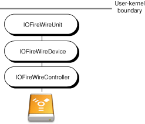
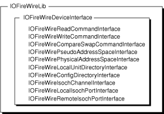
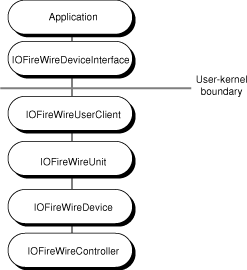
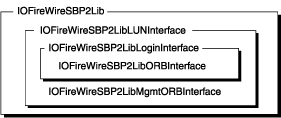
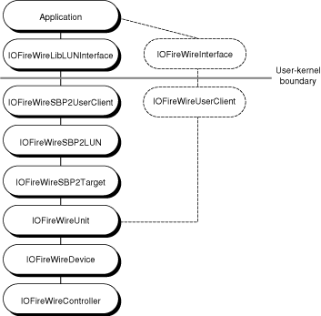
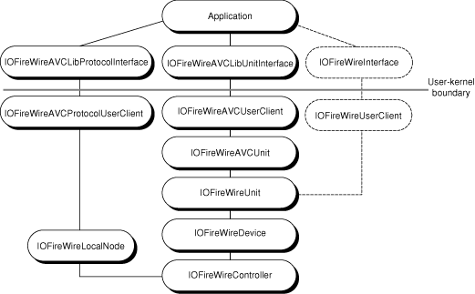

> 导航：[总目录](../../../README.md) · [documentation](../../../_indexes/documentation.md) · [FireWire Device Interface Guide](Introduction%20to%20FireWire%20Device%20Interface%20Guide.md)

[Next](Accessing%20FireWire%20Devices%20From%20Applications.md)[Previous](Introduction%20to%20FireWire%20Device%20Interface%20Guide.md)

# FireWire on OS X

FireWire is Apple’s implementation of the IEEE 1394 High Performance Serial Bus. Fast, hot-pluggable, and flexible, FireWire is a digital interface that supports daisy-chaining and branching for true peer-to-peer communication.

This chapter gives you a brief overview of FireWire. Then, it explains how the I/O Kit represents FireWire devices and describes the device interface libraries the IOFireWire family provides.

The FireWire bus appears as a large, 64-bit memory-mapped address space with each device, represented by a node, occupying a specific address range. The high-order 16 bits of each address identify the node and the remaining 48 bits are for device-specific use.

Because of FireWire’s hot-pluggable nature, the FireWire bus is by no means static. A bus reset occurs whenever nodes appear or disappear or when software initiates it. A bus reset signal erases the current topology of the bus and forces the nodes to reidentify and reconnect themselves. Although much of the logic to handle bus resets is at the device firmware level, your application must be ready to manage the affects of a bus reset at any point. In some cases, this may mean setting a flag in a command that requests it to retry after a bus reset. In others, however, you may have to perform significant device reconfiguration tasks in order to continue processing data.

FireWire supports two types of data transfer: Asynchronous and isochronous. Asynchronous transfer provides acknowledged, guaranteed delivery of data and is targeted to a specific node with an explicit address. If the data you’re sending is not error-tolerant, such as data written to a disk drive, asynchronous transfer is appropriate.

Isochronous transfer, on the other hand, is broadcast in a one-to-many or one-to-one manner. Before a node begins to send or receive isochronous data, it requests a particular amount of bandwidth and one or more isochronous channels. A channel can have one transmitter of data (or talker) and any number of receivers (or listeners). Isochronous transfers do not allow for error-checking or retransmission but they do deliver data at a constant, real-time rate. If you’re sending time-critical, error-tolerant data, such as a video stream, isochronous transfers are preferable.

As a medium for data transmission that defines how to move packets on the FireWire bus, FireWire does not specify any high-level communication protocol to use. Protocols are special sets of communication guidelines that simplify and standardize the data transmission between FireWire devices. OS X supports user-space access for two protocols commonly used on FireWire: SBP-2 and AV/C.

The Serial Bus Protocol 2, or SBP-2, is a storage protocol used to efficiently transfer large amounts of data at high speed. Printers, scanners, and hard drives are typically SBP-2 devices. The SBP-2 protocol defines a data and command transaction entity called an ORB, or Operation Request Block. You use normal ORBs to send data and commands to your device and special management ORBs to perform device login and logout. The SBP-2 protocol sends ORBs using FireWire’s asynchronous data transport mode. You can get more information about the SBP-2 specification at [http://t10.org](http://t10.org/).

The Audio/Video Control, or AV/C, protocol defines a command set used to control devices such as video recorders and digital cameras. Like SBP-2, the AV/C protocol uses FireWire’s asynchronous data transport mode. An AV/C command or response is first encapsulated in a Function Control Protocol (or FCP) frame. Then, a FireWire write or block write transaction transports the FCP frame to and from the device.

The AV/C protocol uses the concept of a plug to describe an end-point of a connection an AV/C unit implements to receive or transmit data. Plugs can be external, physical plugs on the device itself, internal, virtual plugs the AV/C unit implements, or serial bus plugs that are accessible through the plug control registers (or PCRs). For more information about the AV/C specification, see [http://www.1394ta.org](http://www.1394ta.org/).

A Digital Video (or DV) device, such as a DV camcorder, implements a subunit of the AV/C specification. If you want to communicate with a DV camcorder, you should use the QuickTime APIs OS X provides. QuickTime supplies APIs and components to encode and decode DV data, communicate with a DV device, and handle video digitizing. For more information on QuickTime, see [Reference Library > QuickTime](https://developer.apple.com/library/archive/navigation/redirect.html#//apple_ref/doc/uid/TP30000943-TP30000433-TP30000511). In [Using the IOFireWireAVCLib](Using%20the%20FireWire%20Device%20Interface%20Libraries.md#apple-f4xwc4dqnrsv64tfmyxwi33df52wszbpkridimbqgaydsnrzfvbuqmrqgmwugq2iircuessi), this document describes how to communicate with AV/C devices that are not DV camcorders.

In the kernel, several layers of objects represent each FireWire device. For each FireWire hardware interface on the Macintosh, such as FireWire OHCI (or Open Host Controller Interface), the IOFireWire family publishes an IOFireWireController object in the I/O Registry. The IOFireWireController object provides bus management services for the multiple devices and protocols that can exist on one FireWire hardware interface.

The IOFireWire family then tries to read the configuration ROM of each device on the bus. A device’s configuration ROM (or config ROM) contains information such as device identification and addresses of various registers. For each device that responds with its bus information block, the IOFireWire family publishes an IOFireWireDevice object in the I/O Registry. The IOFireWireDevice object keeps track of the device’s node ID (which can change with the dynamic reconfiguration of the bus) and it copies properties from the device’s configuration ROM, such as the device’s globally unique identification (or GUID), into its property list. Most importantly, however, the IOFireWireDevice object scans the configuration ROM for unit directories. For each unit directory it finds, it publishes an IOFireWireUnit object in the I/O Registry. Figure 1-1 shows the stack of objects instantiated for a FireWire unit.

__Figure 1-1__  In-kernel objects supporting a FireWire unit

The IOFireWireUnit object copies properties from the device’s unit into its property list in the I/O Registry. The I/O Kit uses these properties to enable matching on a specific unit specification ID and unit software version. When an SBP-2 unit appears in the I/O Registry, for example, the IOFireWireSBP2 kernel extension (or KEXT) matches on it and loads. The IOFireWireSBP2 family then publishes an IOFireWireSBP2Target object that scans the configuration ROM and publishes an IOFireWireSBP2LUN object for each logical unit (or LUN) it finds.

For AV/C units, the process is similar: The IOFireWireAVC KEXT matches an AV/C unit and publishes an IOFireWireAVCUnit object in the I/O Registry for it.

The same device and unit properties the I/O Kit uses for in-kernel driver matching are available to you for application-level device matching (described in [Device Matching for FireWire Devices](Accessing%20FireWire%20Devices%20From%20Applications.md#apple-f4xwc4dqnrsv64tfmyxwi33df52wszbpkridimbqgaydsnrzfvbuqmrqgiwugq2iizeeurcf)). Because many devices, such as scanners, digital cameras, and printers, are better driven from applications, you can use the device interfaces the IOFireWire family provides to access them. Nearly all services available to in-kernel drivers are also available to an application through one of the IOFireWire family’s device interfaces.

To communicate with FireWire devices or units from an application, the IOFireWire family provides three libraries that each include several device interfaces:

- IOFireWireLib for standard FireWire commands and isochronous communication
- IOFireWireSBP2Lib for sending ORBs to an SBP-2 unit and managing login status
- IOFireWireAVCLib for sending AV/C commands to an AV/C unit

The header files for all three libraries are part of `IOKit.framework`, located in `/System/Library/Frameworks`. In your application, you link against `IOKit.framework` to get access to these libraries.

The IOFireWireLib is a library of device interfaces that give applications access to both standard FireWire device functions and isochronous communication. The IOFireWireLib provides the lowest-level FireWire interfaces available in user space, allowing you to browse the configuration ROM of an external device, send commands, and perform FireWire bus operations. IOFireWireLib also gives you control of isochronous communication with a FireWire device by providing an interface that allows you to open a channel object and send and receive isochronous data. Figure 1-2 shows the interfaces available in the IOFireWireLib.

__Figure 1-2__  IOFireWireLib device interfaces

In order to use the other interfaces in the IOFireWireLib, you must first get an instance of the primary interface, IOFireWireDeviceInterface. The IOFireWireDeviceInterface includes functions that allow you to communicate directly with a device and methods that create the other interfaces listed in Figure 1-2. You can get an IOFireWireDeviceInterface for a FireWire device or even the local node (defined to be the Macintosh itself). Figure 1-3 shows how an application uses an instance of the IOFireWireDeviceInterface to communicate with a device on the FireWire bus.

__Figure 1-3__  Using the IOFireWireDeviceInterface

When you have an instance of the IOFireWireDeviceInterface, you can:

- Perform a FireWire bus reset
- Create FireWire command object interfaces to perform asynchronous read, write and lock operations
- Create an isochronous interface that provides isochronous services, such as creating and managing isochronous channels and sending and receiving isochronous data
- Create other interfaces that provide miscellaneous services, such as managing local unit directories in the Macintosh and accessing and browsing remote device configuration ROMs

You can also use the IOFireWireLib services and interfaces in conjunction with interfaces from the other two FireWire device interface libraries. [Figure 1-5](#apple-f4xwc4dqnrsv64tfmyxwi33df52wszbpkridimbqgaydsnrzfvbuqmrqgewugq2ijfbeirkh) and [Figure 1-7](#apple-f4xwc4dqnrsv64tfmyxwi33df52wszbpkridimbqgaydsnrzfvbuqmrqgewugq2iijcesskf) show how an application can use the IOFireWireDeviceInterface in cooperation with interfaces from other libraries. For more information on how to do this, see [Getting Multiple FireWire Device Interfaces](Accessing%20FireWire%20Devices%20From%20Applications.md#apple-f4xwc4dqnrsv64tfmyxwi33df52wszbpkridimbqgaydsnrzfvbuqmrqgiwugq2ijjaugskk). For code samples that illustrate how to use various FireWire device interfaces, see [Using the FireWire Device Interface Libraries](Using%20the%20FireWire%20Device%20Interface%20Libraries.md#apple-f4xwc4dqnrsv64tfmyxwi33df52wszbpkridimbqgaydsnrzfvbuqmrqgmwviucykjcummjqge).

The IOFireWireSBP2Lib is a library of interfaces and functions that allow you to control the SBP-2 functions of your device. Figure 1-4 shows the interfaces of the IOFireWireSBP2Lib.

__Figure 1-4__  IOFireWireSBP2Lib interfaces

To use the SBP-2 functions the IOFireWireSBP2Lib provides, you first acquire the primary interface, IOFireWireSBP2LibLUNInterface, which supplies the methods that control the operation of the logical unit (or LUN) as a whole. When you have the IOFireWireSBP2LibLUNInterface, you can get two other interfaces:

- The IOFireWireSBP2LibLoginInterface, which supplies methods that control the behavior and execution of an SBP-2 login session, including the execution of ORBs
- The IOFireWireSBP2LibMgmtORBInterface, which provides methods that configure and append nonlogin–related management functions

The IOFireWireSBP2LibLoginInterface itself provides another interface, the IOFireWireSBP2LibORBInterface, that supplies the methods for configuring normal command ORBs.

The IOFireWireSBP2Lib handles device communication at the SBP-2 protocol level. In other words, it is concerned mostly with sending and receiving ORBs and managing login sessions. It does not include interfaces that allow you to communicate directly with the device. If you need to send commands to the device itself, for example, to read the configuration ROM or to service additional functionality beyond the scope of SBP-2, you must use the IOFireWireDeviceInterface of the IOFireWireLib (for more information on how to do this, see [Getting Multiple FireWire Device Interfaces](Accessing%20FireWire%20Devices%20From%20Applications.md#apple-f4xwc4dqnrsv64tfmyxwi33df52wszbpkridimbqgaydsnrzfvbuqmrqgiwugq2ijjaugskk)).

Figure 1-5 shows an application using the IOFireWireSBP2LibLUNInterface to communicate with the logical unit of a FireWire SBP-2 device and, optionally, using the IOFireWireDeviceInterface to communicate with the device.

__Figure 1-5__  Using the IOFireWireSBP2LibLUNInterface and IOFireWireDeviceInterface

The IOFireWireAVCLib is a library of interfaces and functions that you can use to send AV/C commands to an AV/C unit. Figure 1-6 shows the interfaces in the IOFireWireAVCLib.

__Figure 1-6__  IOFireWireAVCLib interfaces

!

The IOFireWireAVCLib supplies two interfaces to handle AV/C units and commands: the IOFireWireAVCLibProtocolInterface and the IOFireWireAVCLibUnitInterface. Unlike the device interfaces in the IOFireWireLib and IOFireWireSBP2Lib, these device interfaces are not dependent on each other in any way. You can get either the IOFireWireAVCLibProtocolInterface or the IOFireWireAVCLibUnitInterface or both, according to what you need to accomplish. Because they are both primary interfaces, you do not need to get one before the other.

In addition, the IOFireWireAVCLib supplies a limited interface that supports a subset of asynchronous connection functionality. The IOFireWireAVCLibConsumerInterface is based on the assumption that the controller node is built into the consumer node, and that this dual entity is implemented in the Macintosh. The functions in the IOFireWireAVCLibConsumerInterface support creating an asynchronous connection to a producer, sending commands to the producer, and receiving data from the producer. The IOFireWireAVCLibConsumerInterface does not support any other configuration of the consumer, controller, and producer nodes and does not allow the consumer/controller pair to receive commands.

The IOFireWireAVCLibProtocolInterface allows your application to treat the Macintosh as an AV/C device and access its plug control registers (or PCRs). To access the PCRs of an external FireWire device, you need to use the IOFireWireDeviceInterface. Because the IOFireWireAVCLibProtocolInterface is specifically for accessing the Macintosh as an AV/C device, you can open it only on the local node. With the IOFireWireAVCLibProtocolInterface, you can:

- Allocate and deallocate input and output plugs
- Read the current value of input and output plugs
- Register callbacks for AV/C commands sent to the Macintosh and for bus reset and reconnect messages
- Update the value of input and output plugs, simulating lock transactions

The IOFireWireAVCLibUnitInterface supplies functions that issue AV/C commands to an AV/C unit. Beginning in OS X v10.4, the IOFireWireAVCLibUnitInterface includes functions that support asynchronous AV/C commands (not to be confused with AV/C asynchronous connections). You can use the asynchronous command functions to, for example, receive notifications when a user adjusts a switch on the device you're communicating with. Because the asynchronous commands are part of the IOFireWireAVCLibUnitInterface, you do not have to acquire a separate interface object to use them.

As with the IOFireWireSBP2LibLUNInterface, you can use both an IOFireWireAVCLibUnitInterface and an IOFireWireDeviceInterface to control the AV/C unit as well as the device object. For more information on how to do this, see [Getting Multiple FireWire Device Interfaces](Accessing%20FireWire%20Devices%20From%20Applications.md#apple-f4xwc4dqnrsv64tfmyxwi33df52wszbpkridimbqgaydsnrzfvbuqmrqgiwugq2ijjaugskk).

Figure 1-7 shows an application using the IOFireWireAVCLibUnitInterface, the IOFireWireAVCLibProtocolInterface, and, optionally, the IOFireWireDeviceInterface.

__Figure 1-7__  Using the IOFireWireAVCLib interfaces and IOFireWireDeviceInterface

[Next](Accessing%20FireWire%20Devices%20From%20Applications.md)[Previous](Introduction%20to%20FireWire%20Device%20Interface%20Guide.md)

