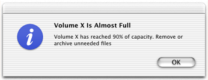
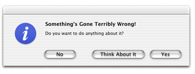
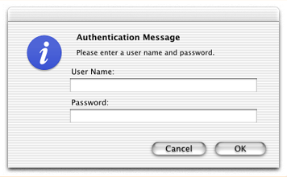
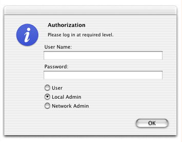

> 导航：[总目录](../../../README.md) · [documentation](../../../_indexes/documentation.md) · [IOKit Device Driver Design Guidelines](Introduction%20to%20I-O%20Kit%20Device%20Driver%20Design%20Guidelines.md)


[Next](Displaying%20Localized%20Information%20About%20Drivers.md)[Previous](Making%20Hardware%20Accessible%20to%20Applications.md)

# Kernel-User Notification

Once in a while a driver—or for that matter any type of kernel extension—may need to communicate some information to the user. In some circumstances, it might even have to prompt the user to choose among two or more alternatives. For example, a USB driver might gently remind the user that, next time, she should dismount a volume before physically disconnecting it. Or a mass storage driver might ask a user if he’s really sure he wants to reinitialize the device, giving him an option to cancel the operation.

For these situations you can use the Kernel-User Notification Center (KUNC). The APIs of the KUNC facility enable you to do the following:

- Put up a non-blocking notification dialog.

  These notifications are strictly informative and permit the calling code to return immediately. Clicking the sole button (entitled “OK”) merely closes the dialog.
- Present a blocking notification dialog.

  In this instance, the dialog has two or more buttons, each offering the user a different choice. Your driver blocks until the user clicks a button, and then responds in a manner appropriate to the button clicked.
- Launch a user-space program or open a preferences pane (System Preferences application).

  You can use this API to allow the user to install items or configure your driver.
- Load a more sophisticated user interface from a bundle.

  The bundle is typically the driver’s kernel extension and the item loaded is an XML property list. This alternative allows elements such as pop-up lists, radio buttons, and text fields, as well as button titles and a customizable message. Because the information displayed is stored in a bundle, it can be localized.

The KUNC APIs should be used sparingly. You should send notifications to user space only when it is essential that the user knows about or reacts to a particular situation related to hardware. For example, a mass media driver should _not_ put up a notification dialog when it encounters a bad block. However, if the user mounts an encrypted disk, the driver should provide some user interface enabling the user to unlock the disk.

Of course, any communication carried out through the KUNC facility can only be initiated by a kernel extension. If you have a user program that needs to communicate with a driver, you must use a suitable alternative, such as an Apple-provided device interface, a custom user client, POSIX I/O calls, or I/O Registry properties.

The KUNC APIs are defined in `Kernel.framework/Headers/UserNotification/`.

For the simpler forms of notification, the KUNC APIs provide a function that displays a notice dialog (`KUNCNotificationDisplayNotice`) and a function that displays an alert dialog (`KUNCNotificationDisplayAlert`). The distinction between a notice and an alert is straightforward:

- A notice ([Figure 5-1](#apple-f4xwc4dqnrsv64tfmyxwi33df52wszbpkridgmbqgaydmojzfvbecssfirdeuqy)) is used merely to inform the user about some situation related to hardware; because it does not require a response from the user, the calling code is not blocked. A notice has only one button or, if a time-out is used, no button. Clicking the button simply dismisses the dialog.
- An alert ([Figure 5-2](#apple-f4xwc4dqnrsv64tfmyxwi33df52wszbpkridgmbqgaydmojzfvbecssdijeueqi)) not only tells the user about some event related to hardware, but requests the user to make a choice among two or three alternatives related to that event. The code calling the KUNC alert function blocks until the user clicks one of the buttons to indicate a choice; it then must interpret which button was clicked and act appropriately. You can specify a time-out period, and if the period expires without the user making a choice, KUNC closes the dialog and returns the default action (associated with the blinking button).

__Figure 5-1__  A KUNC notice



__Figure 5-2__  A KUNC alert



The `KUNCUserNotificationDisplayNotice` and `KUNCUserNotificationDisplayAlert` functions have similar signatures, the latter’s parameter list being a superset of the former’s. [Listing 5-1](#apple-f4xwc4dqnrsv64tfmyxwi33df52wszbpkridgmbqgaydmojzfvbecsskjfaugqy) shows the prototype for `KUNCUserNotificationDisplayNotice`.

__Listing 5-1__  Definition of KUNCUserNotificationDisplayNotice

```
kern_return_t
KUNCUserNotificationDisplayNotice(
    int     timeout,
    unsigned    flags,
    char        *iconPath,
    char        *soundPath,
    char        *localizationPath,
    char        *alertHeader,
    char        *alertMessage,
    char        *defaultButtonTitle);
```

[Table 5-1](#apple-f4xwc4dqnrsv64tfmyxwi33df52wszbpkridgmbqgaydmojzfvbecssfirduira) describes the parameters of this function.

__Table 5-1__  Parameters of the KUNCUserNotificationDisplayNotice function

| Parameter | Description |
| _timeout_ | Seconds to elapse before KUNC dismisses the dialog (and the user doesn’t click the default button). If zero is specified, the dialog is not automatically dismissed. |
| _flags_ | Flags that represent the alert level (stop, note, caution, or plain), and that indicate whether no default button should appear. These flags can be OR’d together. Check the constants defined in Core Foundation’s CFUserNotification for the constants to use. |
| _iconPath_ | File-system location of a file containing an ICNS or TIFF icon to display with the message text. Specify an absolute path or `NULL` if there is no icon file. |
| _soundPath_ | File-system location of a file containing a sound to play when the dialog is displayed. Sounds in AIFF, WAV, and NeXT ".snd" formats are supported. Specify an absolute path or `NULL` if there is no icon file. (Currently unimplemented.able |
| _localizationPath_ | File-system location of a bundle containing a `Localizable.strings` file as a localized resource. If this is the case, the text and titles specified for the dialog are keys to the localized strings in this file. Specify an absolute path or `NULL` if there is no `Localizable.strings` file. |
| _alertHeader_ | The heading for the dialog. |
| _alertMessage_ | The message of the dialog. |
| _defaultButtonTitle_ | The title of the default button (the only button in this dialog). The conventional title “OK” is suitable for most situations. |

The `KUNCUserNotificationDisplayAlert` function appends three more parameters ([Table 5-2](#apple-f4xwc4dqnrsv64tfmyxwi33df52wszbpkridgmbqgaydmojzfvbecssdi5deesq)).

__Table 5-2__  Additional parameters of KUNCUserNotificationDisplayAlert

| Parameter | Description |
| _alternateButtonTitle_ | The title of the alternative button (for example, “Cancel”). |
| _otherButtonTitle_ | The title of a third button. |
| _responseFlags_ | A constant representing the button clicked: `kKUNCDefaultResponse`, `kKUNCAlternateResponse`, `kKUNCOtherResponse`, `kKUNCCancelResponse`. |

[Listing 5-2](#apple-f4xwc4dqnrsv64tfmyxwi33df52wszbpkridgmbqgaydmojzfvbecssiizfeuri) illustrates how you might call `KUNCUserNotificationDisplayAlert` and (trivially) interpret the response. If the `kern_return_t` return value is not `KERN_SUCCESS`, then the call failed for some reason; you can print a string describing the reason with the `mach_error_string` function.

__Listing 5-2__  Calling KUNCUserNotificationDisplayAlert

```
kern_return_t ret;
unsigned int rf;
ret = KUNCUserNotificationDisplayAlert(
    10,
    0,
    NULL,
    NULL,
    NULL,
    "Something's Gone Terribly Wrong!",
    "Do you want to do anything about it?",
    "Yes",  // Default
    "No", // Alternative
    "Think About It", // Other
    &rf);

    if (ret == KERN_SUCCESS) {
        if (rf == kKUNCDefaultResponse)
            IOLog("Default button clicked");
        else if (rf == kKUNCAlternateResponse)
            IOLog("Alternate button clicked");
        else if (rf == kKUNCOtherResponse)
            IOLog("Other button clicked");
    }
```


Your kernel code can use the Kernel-User Notification Center to launch applications. You can thereby engage the user’s involvement in complex installation, configuration, and other tasks related to a driver or other kernel extension. You can use KUNC not only to launch applications, but to present preference panes and run daemons or other (non-GUI) tools.

The KUNC function that you call to launch an application is `KUNCExecute`. This function takes three parameters:

- __Path to executable__ (_executionPath_). The file-system path to the application or other executable. The form of the path is indicated by the third parameter (_pathExecutionType_).
- __User authorization__ (_openAsUser_). The user-authorization level given the launched application. It can be either as the logged-in user (`kOpenAppAsConsoleUser`) or as root (`kOpenAppAsRoot`). Root-user access permits tasks such as copying to `/System/Library` without the need to authenticate; you should use root-user access judiciously.
- __Type of executable path__ (_pathExecutionType_). The form of the executable path specified in the first parameter (_executionPath_). The parameter must be one of the following constants:

| Constant | Description |
| --- | --- |
| `kOpenApplicationPath` | The absolute path to the executable. For an application, this is the binary in the application bundle’s `MacOS` directory (for example, `/Applications/Foo.app/Contents/MacOS/Foo`). |
| `kOpenPreferencePanel` | The name of a preference pane in `/System/Library/PreferencePanes` (for example, `ColorSync.prefPane`). |
| `kOpenApplication` | The name of an application (minus the .`app`) in any of the system locations for applications: `/Applications`, `/Network/Applications`, or `~/Applications`. |

The code shown in [Listing 5-3](#apple-f4xwc4dqnrsv64tfmyxwi33df52wszbpkridgmbqgaydmojzfvbecssgireuiqi) launches the Text Edit application and opens the Internet preferences pane.

__Listing 5-3__  Launching applications from a KEXT

```
kern_return_t ret;
ret = KUNCExecute("/Applications/TextEdit.app/Contents/MacOS/TextEdit", kOpenAppAsRoot, kOpenApplicationPath);
ret = KUNCExecute("Internet.prefPane", kOpenAppAsConsoleUser, kOpenPreferencePanel);
```

It’s usually a good idea to put up a notice (function `KUNCUserNotificationDisplayNotice`) at the same time you launch an application or open a preference pane to inform users what they need to do with the application or preference pane.

The dialogs created through the `KUNCUserNotificationDisplayNotice` and `KUNCUserNotificationDisplayAlert` functions have a limited collection of user-interface elements to present to users. Apart from the header, icon, and message, they permit up to three buttons, and that’s it. The only information they can elicit is the choice made through the click of a button.

The `KUNCUserNotificationDisplayFromBundle` function, however, enables you to present a much richer set of user-interface controls and to gather more information from the user. The elements that you can have on a bundled dialog include the following:

- Header, message text, sound, and icon
- Up to three buttons (default, alternative, other)
- Text fields, including password fields
- Pop-up lists
- Check boxes
- Radio buttons

Your kernel extension can obtain the selections that users make and any text that they type and process this information accordingly.

The controls and behavior of these kernel-user notification dialogs are captured as XML descriptions stored in a file within a bundle (typically the KEXT bundle itself). By virtue of being bundled, the XML descriptions are localizable. You can also update them without the need for a recompile. The XML file can be named anything. It consists of an arbitrary number of dictionary elements, one each for a dialog that the kernel extension might present. Each dialog description itself is a dictionary whose keys can be any of those described in [Table 5-3](#apple-f4xwc4dqnrsv64tfmyxwi33df52wszbpkridgmbqgaydmojzfvbecssfizfeirq).

__Table 5-3__  KUNC XML notification dialog properties

| Key | Type | Description |
| Header | string | The title of the dialog. |
| Message | string | Text of the message in the dialog. The text can include “%@” placeholders that, when the bundle is loaded, are replaced by “@”-delimited substrings in the _tokenString_ parameter of the function `KUNCUserNotificationDisplayFromBundle`. See [Table 5-4](#apple-f4xwc4dqnrsv64tfmyxwi33df52wszbpkridgmbqgaydmojzfvbecssfifauqsi) for this and other parameters. |
| OK Button Title | string | The title of the default button of the dialog (usually entitled “OK”). This button is the one closest to the right edge of the dialog. |
| Alternate Button Title | string | The title of the alternate button of the dialog (often entitled “Cancel”). This button is the one closest to the left edge of the dialog. |
| Other Button Title | string | The title of the third allowable button, which is placed between the other two buttons. |
| Icon URL | string | An absolute POSIX path identifying a file containing a TIFF or ICNS image to display next to the message text. |
| Sound URL | string | An absolute POSIX path identifying a file containing a sound to play when the dialog is displayed. Sounds in AIFF, WAV, and NeXT ".snd" formats are supported. (Currently unimplemented.) |
| Localization URL | string | An absolute POSIX path identifying a bundle containing a `Localizable.strings` file from which to retrieve localized text. If this property is specified, all text-related values in the XML description are assumed to be keys to items in `Localizable.strings`. |
| Timeout | string | A number indicating the number of seconds before the dialog is automatically dismissed. If zero is specified, the dialog will not time out. |
| Alert Level | string | Takes “Stop”, “Notice”, or “Alert” to identify the severity of the alert. Each alert level has an icon associated with it. If you don’t specify an alert level, “Notice” becomes the default. |
| Blocking Message | string | Either “0” or “1”. If “1”, the dialog has no buttons regardless of any specified. |
| Text Field Strings | array of strings | A list of labels to display just above the text fields they identify. See [Figure 5-3](#apple-f4xwc4dqnrsv64tfmyxwi33df52wszbpkridgmbqgaydmojzfvbecssdirceqsa) to see the size and placement of these fields. |
| Password Fields | array of strings | One or more numbers identifying which of the text fields (which must also be specified) is a password field. In other words, each number is an index into the array of text fields. A password field displays “•” for each character typed in it. |
| Popup Button Strings | array of strings | A list of the titles for each element in a popup button. |
| Selected Popup | string | A number (index) identifying the element to display in the popup button. If this is not specified, the first element is displayed. |
| Radio Button Strings | array of strings | A list of the titles for each radio button to display. The radio buttons are aligned vertically. Only a single button can be selected. |
| Selected Radio | string | A number (index) identifying the radio button to show as selected. |
| Check Box Strings | array of strings | A list of the titles for each check box to display. The check boxes are aligned vertically. Multiple checkboxes can be selected. |
| Checked Boxes | array of strings | A number (index) identifying the check box (or check boxes) that are selected. |

As indicated in the description of the `Localization URL` property above, you can access localized text in two ways. You can have localized versions of the XML description file itself. Or you can have a single XML description file and a `Localizable.strings` file for each localization. In the latter case, the `Localization URL` property points to the bundle containing the `Localizable.strings` files and the values of textual properties in the XML description file are keys into `Localizable.strings`.

A welcome aspect of the bundled-notifications feature of KUNC is that it is asynchronous. When you call the `KUNCUserNotificationDisplayFromBundle` function to request a dialog, the call returns immediately. Your code can go on to do other things. KUNC handles delivery of the request to user space, where the dialog is constructed and displayed. Throughout its journey, the request is identified by a notification ID that you supplied to `KUNCUserNotificationDisplayFromBundle`. When a user clicks one of the dialog buttons, a callback function implemented in your KEXT is invoked. There you can identify the request through its notification ID and handle the user’s response.

[Listing 5-4](#apple-f4xwc4dqnrsv64tfmyxwi33df52wszbpkridgmbqgaydmojzfvbecsskifceeqi) shows the signature of the `KUNCUserNotificationDisplayFromBundle` function.

__Listing 5-4__  Declaration of `KUNCUserNotificationDisplayFromBundle`

```
kern_return_t
KUNCUserNotificationDisplayFromBundle(
    KUNCUserNotificationID      notificationID,
    char                        *bundleIdentifier,
    char                        *fileName,
    char                        *fileExtension,
    char                        *messageKey,
    char                        *tokenString,
    KUNCUserNotificationCallBackcallback,
    int                         contextKey);
```

[Table 5-4](#apple-f4xwc4dqnrsv64tfmyxwi33df52wszbpkridgmbqgaydmojzfvbecssfifauqsi) describes the parameters of this function.

__Table 5-4__  Parameters of `KUNCUserNotificationDisplayFromBundle`

| Parameter | Description |
| _notificationID_ | A value of type `KUNCUserNotificationID` that identifies the dialog request. You obtain this value through the `KUNCGetNotificationID` function. |
| _bundleIdentifier_ | The location (specified as an absolute path) of the bundle containing the file with the XML descriptions of notification dialogs. An example of such a path might be “/System/Library/Extensions/MyDriver.kext”.  Upcoming versions of KUNC will permit the specification of the bundle’s `CFBundleIdentifier` instead; this will be the preferred way to identify bundles. |
| _fileName_ | The name of the file from which to retrieve the XML descriptions of dialogs. This name should omit the file’s extension. |
| _fileExtension_ | The extension of the XML file, minus the period; this can be anything, such as “dict” or “xml”. |
| _messageKey_ | Name of the XML key identifying the dialog description you want to have KUNC retrieve from the file. |
| _tokenString_ | A string that can contain one or more token substrings. Each substring, which is separated from adjacent substrings by the “@” character, is substituted in turn for each “%@” placeholder in the message text of the dialog (XML key “Message”).  Here is an example: if the message text is “Access denied after %@ attempts to access account %@.” and the token string is “4@jdoe”, the displayed string is “Access denied after 4 attempts to access account jdoe.” |
| _callback_ | The callback function that is invoked when the user clicks one of the buttons of the dialog. The function must conform to the `KUNCUserNotificationCallback` prototype. |
| _contextKey_ | Any context information you wish to provide to help your kernel extension identify the notification request (in addition to the notification ID). |

The final step in implementing bundled notifications for your kernel extension is to implement a callback function to handle user responses. This function must conform to the `KUNCUserNotificationCallback` prototype:

```
typedef void (*KUNCUserNotificationCallBack)(
    int     contextKey,
    int     responseFlags,
    void    *xmlData);
```

A couple of the parameters may seem familiar. The _contextKey_ parameter is the same value you passed into the `KUNCUserNotificationDisplayFromBundle` function to help identify the request. The _responseFlags_ parameter holds one of the constants that identify the dialog button the user clicked; these constants are discussed in[Presenting Notification Dialogs](#apple-f4xwc4dqnrsv64tfmyxwi33df52wszbpkridgmbqgaydmojzfvbecssdijducrq). What is new is the _xmlData_ parameter. This is the XML string data associated with the user’s response; if the user has entered any information (such as user name and password) or has selected a popup item, radio button, or checkbox, your code should parse the XML and extract this information.

When you parse the XML, you should look for the corresponding element of the array you passed into KUNC. For example, if you have a user-name field and a password field, you have a `Text Field Strings` array with two elements. When you parse the _xmlData_ parameter, the first element of `Text Field Strings` is the user name entered by the user; the second element is the password. Similarly, you parse the `Selected Popup` array to see which index into that array has been selected.

To illustrate how you might use the KUNC APIs for bundled notification dialogs, let’s step through a couple of examples. You create an XML file called `Messages.dict` and put it in your KEXT’s localized `.lproj`directories. This file contains the key “Password Message”; [Listing 5-5](#apple-f4xwc4dqnrsv64tfmyxwi33df52wszbpkridgmbqgaydmojzfvbecssgivaucrq) shows the associated XML description for this key.

__Listing 5-5__  XML description of a password dialog

```
    <key>Password Message</key>
    <dict>
        <key>Alternate Button Title</key>
        <string>Cancel</string>
        <key>OK Button Title</key>
        <string>OK</string>
        <key>Header</key>
        <string>Authentication Message</string>
        <key>Message</key>
        <string>Please enter a user name and password.</string>
        <key>Timeout</key>
        <string>0</string>
        <key>Alert Level</key>
        <string>Stop</string>
        <key>Text Field Strings</key>
        <array>
            <string>User Name:</string>
            <string>Password:</string>
        </array>
        <key>Password Fields</key>
        <array>
            <string>1</string>
        </array>
        <key>Blocking Message</key>
        <string>1</string>
    </dict>
```

In the code of your kernel extension, you call `KUNCUserNotificationDisplayFromBundle`, specifying “Password Message” as the message key ([Listing 5-6](#apple-f4xwc4dqnrsv64tfmyxwi33df52wszbpkridgmbqgaydmojzfvbecssjjbceqsa)).

__Listing 5-6__  Displaying the bundled password dialog

```
context = 2;
ret = KUNCUserNotificationDisplayFromBundle(KUNCGetNotificationID(),
    "/tmp/ExampleDriver/ExampleDriver.kext",
    "Messages",
    "dict",
    "Password Message",
    "",
    MyKUNCBundleCallback,
    context);
```

When this code is executed, the dialog shown in [Listing 5-6](#apple-f4xwc4dqnrsv64tfmyxwi33df52wszbpkridgmbqgaydmojzfvbecssjjbceqsa) appears on the user’s screen, as in [Figure 5-3](#apple-f4xwc4dqnrsv64tfmyxwi33df52wszbpkridgmbqgaydmojzfvbecssdirceqsa).

__Figure 5-3__  The password dialog



Of course, you can have even more complicated dialogs with a mix of user-interface elements. [Listing 5-7](#apple-f4xwc4dqnrsv64tfmyxwi33df52wszbpkridgmbqgaydmojzfvbecsskjfdusra) shows the XML description of a dialog that includes text and password fields and radio buttons.

__Listing 5-7__  XML description of a dialog with various controls

```
    <key>Mixed Message</key>
    <dict>
        <key>OK Button Title</key>
        <string>OK</string>
        <key>Header</key>
        <string>Authorization</string>
        <key>Message</key>
        <string>Please log in at required level.</string>
        <key>Timeout</key>
        <string>20</string>
        <key>Alert Level</key>
        <string>Stop</string>
        <key>Text Field Strings</key>
        <array>
            <string>User Name:</string>
            <string>Password:</string>
        </array>
        <key>Password Fields</key>
        <array>
            <string>1</string>
        </array>
        <key>Radio Button Strings</key>
        <array>
            <string>User</string>
            <string>Local Admin</string>
            <string>Network Admin</string>
        </array>
        <key>Selected Radio</key>
        <string>1</string>
    </dict>
```

When your loaded kernel extension calls the `KUNCUserNotificationDisplayFromBundle` function, supply this time “Mixed Message” as the XML dictionary key, the dialog shown in [Figure 5-4](#apple-f4xwc4dqnrsv64tfmyxwi33df52wszbpkridgmbqgaydmojzfvbecssii5bucsi) appears on the user’s screen.

__Figure 5-4__  Display of a mixed control dialog



[Next](Displaying%20Localized%20Information%20About%20Drivers.md)[Previous](Making%20Hardware%20Accessible%20to%20Applications.md)

