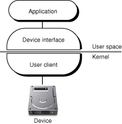
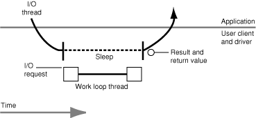
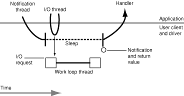
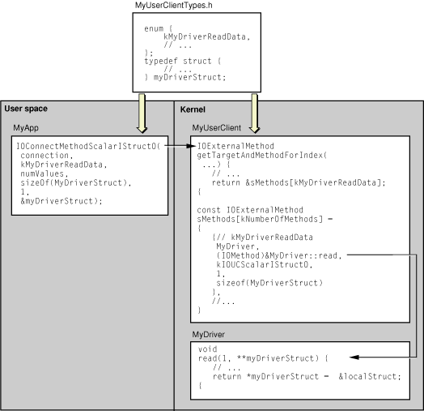

> 导航：[总目录](../../../README.md) · [documentation](../../../_indexes/documentation.md) · [IOKit Device Driver Design Guidelines](Introduction%20to%20I-O%20Kit%20Device%20Driver%20Design%20Guidelines.md)


[Next](Kernel-User%20Notification.md)[Previous](The%20IOService%20API.md)

# Making Hardware Accessible to Applications

Let's assume you have written a driver for a device, have thoroughly tested it, and are ready to deploy it. Is your job done? Not necessarily, because there is the perennial problem for driver writers of making their service accessible to user processes. A driver without clients in user space is useless (unless all of its clients reside in the kernel).

This chapter does a few things to help you on this score. It describes the architectural aspects of OS X and the Darwin kernel that underlie the transport of data across the boundary separating the kernel and user space. It describes the alternative APIs on OS X for cross-boundary transport between a driver stack and an application. And it describes how to roll your own solution by writing a custom user client, finally taking you on a detailed tour through an example implementation.

To better understand the information presented in this section, it is recommended that you become familiar with the material in_[IOKit Fundamentals](../IOKit%20Fundamentals/Introduction%20to%20I-O%20Kit%20Fundamentals.md#apple-f4xwc4dqnrsv64tfmyxwi33df52wszbpkridambqgaydcmi)_ and the relevant sections of _[Kernel Programming Guide](../../Darwin/Kernel%20Programming%20Guide/About%20This%20Document.md#apple-f4xwc4dqnrsv64tfmyxwi33df52wszbpkridgmbqgaydsmbv)_.

The Darwin kernel gives you several ways to let your kernel code communicate with application code. The specific kernel–user space transport API to use depends on the circumstances.

- If you are writing code that resides in the BSD subsystem, you use the `syscall` or (preferably) the `sysctl` API. You should use the `syscall` API if you are writing a file-system or networking extension.
- If your kernel code is not part of the BSD subsystem (and your code is not a driver), you probably want to use Mach messaging and Mach Inter-Process Communication (IPC). These APIs allow two Mach tasks (including the kernel) to communicate with each other. Mach Remote Process Communication (RPC), a procedural abstraction built on top of Mach IPC, is commonly used instead of Mach IPC.
- You may use memory mapping (particularly the BSD `copyin` and `copyout` routines) and block copying in conjunction with one of the aforementioned APIs to move large or variably sized chunks of data between the kernel and user space.

Finally, there are the I/O Kit transport mechanisms and APIs that enable driver code to communicate with application code. This section describes aspects of the kernel environment that give rise to these mechanisms and discusses the alternatives available to you.

An important feature of the OS X kernel is memory protection. Each process on the system, including the kernel, has its own address space which other processes are not free to access in an unrestricted manner. Memory protection is essential to system stability. It’s bad enough when a user process crashes because some other process trashed its memory. But it’s catastrophic—a system crash—when the kernel goes down for the same reason.

Largely (but not exclusively) because of memory protection, there are certain aspects of the kernel that affect how cross-boundary I/O takes place, or should take place:

- __The kernel is a slave to the application.__ Code in the kernel (such as in a driver) is passive in that it only reacts to requests from processes in user space. Drivers should not initiate any I/O activity on their own.
- __Kernel resources are discouraged in user space.__ Application code cannot be trusted with kernel resources such as kernel memory buffers and kernel threads. This kind of exposure leaves the whole system vulnerable; an application can trash critical areas of physical memory or do something globally catastrophic with a kernel thread, crashing the entire system. To eliminate the need for passing kernel resources to user space, the system provides several kernel–user space transport mechanisms for a range of programmatic circumstances.
- __User processes cannot take direct interrupts.__ As a corollary to the previous point, kernel interrupt threads cannot jump to user space. Instead, if your application must be made aware of interrupts, it should provide a thread on which to deliver a notification of them.
- __Each kernel–user space transition incurs a performance hit.__ The kernel's transport mechanisms consume resources and thus exact a performance penalty. Each trip from the kernel to user space (or vice versa) involves the overhead of Mach RPC calls, the probable allocation of kernel resources, and perhaps other expensive operations. The goal is to use these mechanisms as efficiently as possible.
- __The kernel should contain only code that must be there.__ Adding unnecessary code to the kernel—specifically code that would work just as well in a user process—bloats the kernel, potentially destabilizes it, unnecessarily wires down physical memory (making it unavailable to applications), and degrades overall system performance. See _Coding in the Kernel_ for a fuller explanation of why you should always seek to avoid putting code in the kernel.

On Mac OS 9, applications access hardware in a way that is entirely different from the way it is done on OS X. The difference in approach is largely due to differences in architecture, particularly in the relationship between an application and a driver.

Unlike OS X, Mac OS 9 does not maintain an inviolable barrier between an application's address space and the address space of anything that would be found in the OS X kernel. An application has access to the address of any other process in the system, including that of a driver.

This access affects how completion routines are invoked. The structure behind all I/O on a Mac OS 9 system is called a parameter block. The parameter block contains the fields typically required for a DMA transfer:

- Host address
- Target address
- Direction of transfer
- Completion routine and associated data

The completion routine is implemented by the application to handle any returned results. The driver maintains a linked list of parameter blocks as I/O requests or jobs for the DMA engine to perform. When a job completes, the hardware triggers an interrupt, prompting the driver to call the application’s completion routine. The application code implementing the completion routine runs at “interrupt time”—that is, in the context of the hardware interrupt. This leads to a greater likelihood that a programming error in the completion routine can crash or hang the entire system.

If the same thing with interrupts happened on OS X, there would additionally be the overhead of crossing the kernel–user space boundary (with its performance implications) as well as the risk to system stability that comes with exporting kernel resources to user space.

The I/O Kit gives you several ready-made alternatives for performing cross-boundary I/O without having to add code to the kernel:

- I/O Kit family device interfaces
- POSIX APIs
- I/O Registry properties

When facing the problem of communication between driver and application, you should first consider whether any of these options suits your particular needs. Each of them has its intended uses and each has limitations that might make it unsuitable. However, only after eliminating each of these alternatives as a possibility should you decide upon implementing your own driver–application transport, which is called a custom user client.

A device interface is the flip side of what is known as a user client in the kernel. A device interface is a library or plug-in through whose interface an application can access a device. The application can call any of the functions defined by the interface to communicate with or control the device. In turn, the library or plug-in talks with a user-client object (an instance of a subclass of IOUserClient) in a driver stack in the kernel. (See [The Architecture of User Clients](#apple-f4xwc4dqnrsv64tfmyxwi33df52wszbpkridgmbqgaydmojyfvbeeq2ci5deqra) for a full description of these types of driver objects.)

Several I/O Kit families provide device interfaces for applications and other user-space clients. These families include (but are not limited to) the SCSI, HID, USB, and FireWire families. (Check the header files in the I/O Kit framework to find out about the complete list of families providing device interfaces.) If your driver is a member of one of these families, your user-space clients need only use the device interface of the family to access the hardware controlled by your driver.

See [Finding and Accessing Devices](https://developer.apple.com/library/archive/documentation/DeviceDrivers/Conceptual/AccessingHardware/AH_Finding_Devices/AH_Finding_Devices.html#//apple_ref/doc/uid/TP30000379) in _[Accessing Hardware From Applications](../Accessing%20Hardware%20From%20Applications/Introduction%20to%20Accessing%20Hardware%20From%20Applications.md#apple-f4xwc4dqnrsv64tfmyxwi33df52wszbpkridgmbqgaydgnzw)_ for a detailed presentation of the procedure for acquiring and using device interfaces.

For each storage, network, and serial device the I/O Kit dynamically creates a device file in the file system’s `/dev` directory when it discovers a device and finds a driver for it, either at system startup or as part of its ongoing matching process. If your device driver is a member of the I/O Kit’s Storage, Network, or Serial families, then your clients can access your driver’s services by using POSIX I/O routines. They can simply use the I/O Registry to discover the device file that is associated with the device your driver controls. Then, with that device file as a parameter, they call POSIX I/O functions to open and close the device and read and write data to it.

Because the I/O Kit dynamically generates the contents of the `/dev` directory as devices are attached and detached, you should never hard-code the name of a device file or expect it to remain the same whenever your application runs. To obtain the path to a device file, you must use device matching to obtain a device path from the I/O Registry. Once you have found the correct path, you can use POSIX functions to access the device. For information on using the I/O Registry to find device-file paths, see _[Accessing Hardware From Applications](../Accessing%20Hardware%20From%20Applications/Introduction%20to%20Accessing%20Hardware%20From%20Applications.md#apple-f4xwc4dqnrsv64tfmyxwi33df52wszbpkridgmbqgaydgnzw)_.

The I/O Registry is the dynamic database that the I/O Kit uses to store the current properties and relationships of driver objects in an OS X system. APIs in the kernel and in user space give access to the I/O Registry, allowing code to get and set properties of objects in the Registry. This common access makes possible a limited form of communication between driver and application.

All driver objects in the kernel derive from IOService, which is in turn a subclass of the IORegistryEntry class. The methods of IORegistryEntry enable code in the kernel to search the I/O Registry for specific entries and to get and set the properties of those entries. A complementary set of functions (defined in `IOKitLib.h`) exist in the I/O Kit framework. Applications can use the functions to fetch data stored as properties of a driver object or to send data to a driver object.

This property-setting mechanism is suitable for situations where the following conditions are true:

- The driver does not have to allocate permanent resources to complete the transaction.
- The application is transferring—by copy—a limited amount of data (under a page)

  With the property-setting mechanism, the application can pass arbitrary amounts of data by reference (that is, using pointers).
- The data sent causes no change in driver state or results in a single, permanent change of state.
- You control the driver in the kernel (and thus can implement the `setProperties` method described below).

The property-setting mechanism is thus suitable for some forms of device control and is ideal for one-shot downloads of data, such as for loading firmware. It is not suitable for connection-oriented tasks because such tasks usually require the allocation of memory or the acquisition of devices. Moreover, this mechanism does not allow the driver to track when its clients die.

The general procedure for sending data from an application to a driver object as a property starts with establishing a connection with the driver. The procedure for this, described in [The Basic Connection and I/O Procedure](#apple-f4xwc4dqnrsv64tfmyxwi33df52wszbpkridgmbqgaydmojyfvbeeq2eijfessi), consists of three steps:

1. Getting the I/O Kit master port
2. Obtaining an instance of the driver
3. Creating a connection

Once you have a connection, do the following steps:

1. Call the `IOConnectSetCFProperties` function, passing in the connection and a Core Foundation container object, such as a CFDictionary.

   The Core Foundation object contains the data you want to pass to the driver. Note that you can call `IOConnectSetCFProperty` instead if you want to pass only a single, value-type Core Foundation object, such as a CFString or a CFNumber and that value’s key. Both function calls cause the invocation of the `IORegistryEntry::setProperties` method in the driver.
2. In the driver, implement the `setProperties` method.

   Before it invokes this method, the I/O Kit converts the Core Foundation object passed in by the user process to a corresponding libkern container object (such as OSDictionary). In its implementation of this method, the driver object extracts the data from the libkern container object and does with it what is expected.

The Core Foundation object passed in by the user process must, of course, have a libkern equivalent. [Table 4-1](#apple-f4xwc4dqnrsv64tfmyxwi33df52wszbpkridgmbqgaydmojyfvbeeq2djjcuuqy) shows the allowable Core Foundation types and their corresponding libkern objects.

__Table 4-1__  Corresponding Core Foundation and libkern container types

| Core Foundation | libkern |
| CFDictionary | OSDictionary |
| CFArray | OSArray |
| CFSet | OSSet |
| CFString | OSString |
| CFData | OSData |
| CFNumber | OSNumber |
| CFBoolean | OSBoolean |

The following example ([Listing 4-1](#apple-f4xwc4dqnrsv64tfmyxwi33df52wszbpkridgmbqgaydmojyfvbeeq2gjfbuqsi)) shows how the I/O Kit’s Serial family uses the I/O Registry property-setting mechanism to let a user process make a driver thread idle until a serial port is free to use (when there are devices, such as a modem and a fax, competing for the port).

__Listing 4-1__  Controlling a serial device using `setProperties`

```swift
IOReturn IOSerialBSDClient::
setOneProperty(const OSSymbol *key, OSObject *value)
{
    if (key == gIOTTYWaitForIdleKey) {
        int error = waitForIdle();
        if (ENXIO == error)
            return kIOReturnOffline;
        else if (error)
            return kIOReturnAborted;
        else
            return kIOReturnSuccess;
    }

    return kIOReturnUnsupported;
}

IOReturn IOSerialBSDClient::
setProperties(OSObject *properties)
{
    IOReturn res = kIOReturnBadArgument;

    if (OSDynamicCast(OSString, properties)) {
        const OSSymbol *propSym =
            OSSymbol::withString((OSString *) properties);
        res = setOneProperty(propSym, 0);
        propSym->release();
    }
    else if (OSDynamicCast(OSDictionary, properties)) {
        const OSDictionary *dict = (const OSDictionary *) properties;
        OSCollectionIterator *keysIter;
        const OSSymbol *key;

        keysIter = OSCollectionIterator::withCollection(dict);
        if (!keysIter) {
            res = kIOReturnNoMemory;
            goto bail;
        }

        while ( (key = (const OSSymbol *) keysIter->getNextObject()) ) {
            res = setOneProperty(key, dict->getObject(key));
            if (res)
                break;
        }

        keysIter->release();
    }

bail:
    return res;
}
```


If you cannot make your hardware properly accessible to applications using I/O Kit’s off-the-shelf device interfaces, POSIX APIs, or I/O Registry properties, then you’ll probably have to write a custom user client. To reach this conclusion, you should first have answered “no” the following questions:

- If your device a member of an I/O Kit family, does that family provide a device interface?
- Is your device a serial, networking, or storage device?
- Are I/O Registry properties sufficient for the needs of the application? (If you need to move huge amounts of data, or if you don’t have control over the driver code, then they probably aren’t.)

If you have determined that you need to write a custom user client for your hardware and its driver, read on for the information describing how to do this.

This section discusses the architecture of custom user clients, offers considerations for their design, and describes the API and procedures for implementing a custom user client. See the concluding section [A Guided Tour Through a User Client](#apple-f4xwc4dqnrsv64tfmyxwi33df52wszbpkridgmbqgaydmojyfvbuuqskivbegqq) for a guided tour through a fairly sophisticated user client.

A user client provides a connection between a driver in the kernel and an application or other process in user space. It is a transport mechanism that tunnels through the kernel–user space boundary, enabling applications to control hardware and transfer data to and from hardware.

A user client actually consists of two parts, one part for each side of the boundary separating the kernel from user space (see _[Kernel Programming Guide](../../Darwin/Kernel%20Programming%20Guide/About%20This%20Document.md#apple-f4xwc4dqnrsv64tfmyxwi33df52wszbpkridgmbqgaydsmbv)_ for a detailed discussion of the kernel–user space boundary). These parts communicate with each other through interfaces conforming to an established protocol. For the purposes of this discussion, the kernel half of the connection is the user client proper; the part on the application side is called a device interface. [Figure 4-1](#apple-f4xwc4dqnrsv64tfmyxwi33df52wszbpkridgmbqgaydmojyfvbeeq2iivdumrq) illustrates this design

__Figure 4-1__  Architecture of user clients



Although architecturally a user client (proper) and its device interface have a close, even binding relationship, they are quite different programmatically.

- A user client is a driver object (a category that includes nubs as well as drivers). A user client is thus a C++ object derived from IOService, the base class for I/O Kit driver objects, which itself ultimately derives from the libkern base class OSObject.

  Because of its inheritance from IOService, a driver object such as a user client participates in the driver life cycle (initialization, starting, attaching, probing, and so on) and within a particular driver stack has client-provider relationships with other driver objects in the kernel. To a user client’s provider—the driver that is providing services to it, and the object with which the application is communicating—the user client looks just like another client within the kernel.
- A device interface is a user-space library or other executable associated with an application or other user process. It is compiled from any code that can call the functions in the I/O Kit framework and is either linked directly into a Mach-O application or is indirectly loaded by the application via a dynamic shared library or a plug-in such as afforded by the Core Foundation types CFBundle and CFPlugIn. (See [Implementing the User Side of the Connection](#apple-f4xwc4dqnrsv64tfmyxwi33df52wszbpkridgmbqgaydmojyfvbeeq2iizeecsq) for further information.)

Custom user-client classes typically inherit from the IOUserClient helper class. (They could also inherit from an I/O Kit family’s user-client class, which itself inherits from IOUserClient, but this is not a recommended approach; for an explanation why, see the introduction to the section [Creating a User Client Subclass](#apple-f4xwc4dqnrsv64tfmyxwi33df52wszbpkridgmbqgaydmojyfvbecssfjbaucra).) The device-interface side of the connection uses the C functions and types defined in the I/O Kit framework’s `IOKitLib.h`.

The actual transport layer enabling communication between user processes and device drivers is implemented using a private programming interface based on Mach RPC.

The I/O Kit’s APIs enable several different types of transport across the boundary between the kernel and user space:

- __Passing untyped data__: This mechanism uses arrays of structures containing pointers to the methods to invoke in a driver object; the methods must conform to prototypes for primitive functions with parameters only indicating general type (scalar for a single, 32-bit value or structure for a group of values), number of scalar parameters, size of structures, and direction (input or output). The passing of untyped data using this mechanism can be synchronous or asynchronous.
- __Sharing memory__: This is a form of memory mapping in which one or more pages of memory are mapped into the address space of two tasks—in this case, the driver and the application process. Either process can then access or modify the data stored in those shared pages. The user-client mechanism for shared memory uses IOMemoryDescriptor objects on the kernel side and buffer pointers `vm_address_t` on the user side to map hardware registers to user space. This method of data transfer is intended for hardware that is not DMA-based and is ideal for moving large amounts of data between the hardware and the application. User processes can also map their memory into the kernel’s address space.
- __Sending notifications__: This mechanism passes notification ports in and out of the kernel to send notifications between the kernel and user processes. These methods are used in asynchronous data-passing.

An important point to keep in mind is that the implementation of a user client is not restricted to only one of the mechanisms listed above. It can use two or more of them; for example, it might used the synchronous untyped-data mechanism to program a DMA engine and shared memory for the actual data transfer.

Two styles of untyped-data passing are possible with the I/O Kit's user-client APIs: Synchronous and asynchronous. Each has its strengths and drawbacks, and each is more suitable to certain characteristics of hardware and user-space API. Although the asynchronous I/O model is somewhat comparable to the way Mac OS 9 applications access hardware, it is different in some respects. The most significant of these differences is an aspect of architecture shared with the synchronous model: In OS X, the client provides the thread on which I/O completion routines are called, but the kernel controls the thread. I/O completion routines execute outside the context of the kernel.

The following discussion compares the synchronous (blocking) I/O and asynchronous (non-blocking, with completion) I/O models from an architectural perspective and without discussion of specific APIs. For an overview of those APIs, see [Creating a User Client Subclass](#apple-f4xwc4dqnrsv64tfmyxwi33df52wszbpkridgmbqgaydmojyfvbecssfjbaucra).

In synchronous I/O, the user process issues an I/O request on a thread that calls into the kernel and blocks until the I/O request has been processed (completed). The actual I/O work is completed on the work-loop thread of the driver. When the I/O completes, the user client wakes the user thread, gives it any results from the I/O operation, and returns control of the thread to the user process. After handling the result of the I/O, the thread delivers another I/O request to the user client, and the process starts again.

__Figure 4-2__  Synchronous I/O between application and user client



The defining characteristic of the synchronous model is that the client makes a function call into the kernel that doesn't return until the I/O has completed. The major disadvantage of the synchronous approach is that the thread that issues the I/O request cannot do any more work until the I/O completes. However, it is possible to interrupt blocking synchronous routines by using signals, for example. In this case, the user client has to know that signals might be sent and how to handle them. It must be prepared to react appropriately in all possible situations, such as when an I/O operation is in progress when the signal is received.

In asynchronous I/O, the user-process client has at least two threads involved in I/O transfers. One thread delivers an I/O request to the user client and returns immediately. The client also provides a thread to the user client for the delivery of notifications of I/O completions. The user client maintains a linked list of these notifications from prior I/O operations. If there are pending notifications, the user client invokes the notification thread's completion routine, passing in the results of an I/O operation. Otherwise, if there are no notifications in this list, the user client puts the notification thread to sleep.

__Figure 4-3__  Asynchronous I/O between application and user client



The user process should create and manage the extra threads in this model using some user-level facility such as BSD pthreads. This necessity points at the main drawback of the asynchronous model: The issue of thread management in a multithreaded environment. This is something that is difficult to do right. Another problem with asynchronous I/O is related to performance; with this type of I/O there are two kernel–user space round-trips per I/O. One way to mitigate this problem is to batch completion notifications and have the notification thread process several of them at once. For the asynchronous approach, you also might consider basing the client's I/O thread on a run-loop object (CFRunLoop); this object is an excellent multiplexor, allowing you to have different user-space event sources.

So which model for I/O is better, synchronous or asynchronous? As with many aspects of design, the answer is a definite “it depends.” It depends on any legacy application code you're working with, it depends on the sophistication of your thread programming, and it depends on the rate of I/O. The asynchronous approach is good when the number of I/O operations per second is limited (well under 1000 per second). Otherwise, consider the synchronous I/O model, which takes better advantage of the OS X architecture.

Before you start writing the code of your user client, take some time to think about its design. Think about what the user client is supposed to do, and what is the best programmatic interface for accomplishing this. Keeping some of the points raised in [Issues With Cross-Boundary I/O](#apple-f4xwc4dqnrsv64tfmyxwi33df52wszbpkridgmbqgaydmojyfvbecssiirduuqi) in mind, consider the following questions:

- What will be the effect of your design on performance, keeping in mind that each kernel–user space transition exacts a performance toll?

  If your user client’s API is designed properly, you should need at most one boundary crossing for each I/O request. Ideally, you can batch multiple I/O requests in a single crossing.
- Does your design put any code in the kernel that could work just as well in user space?

  Remember that code in the kernel can be destabilizing and a drain on overall system resources.
- Does the API of your device interface (the user-space side of the user client) expose hardware details to clients?

  A main feature of the user-space API is to isolate applications from the underlying hardware and operating system.

The following sections describe these and other issues in more detail.

The design of the user side of a user-client connection depends on the probable number and nature of the applications (and other user processes) that want to communicate with your driver. If you’re designing your user client for only one particular application, and that application is based on Mach-O object code, then you can incorporate the connection and I/O code into the application itself. See [The Basic Connection and I/O Procedure](#apple-f4xwc4dqnrsv64tfmyxwi33df52wszbpkridgmbqgaydmojyfvbeeq2eijfessi) for the general procedure.

However, a driver writer often wants his driver accessible by more than one application. The driver could be intended for use by a family of applications made by a single software developer. Or any number of applications—even those you are currently unaware of—should be able to access the services of the driver. In these situations, you should put the code related to the user side of the user-client connection into a separate module, such as a shared library or plug-in. This module, known as a device interface, should abstract common connection and I/O functionality and present a friendly programmatic interface to application clients.

So let’s say you’ve decided to put your connection and I/O code into a device interface; you now must decide what form this device interface should take. The connection and I/O code must call functions defined in the I/O Kit framework, which contains a Mach-O dynamic shared library; consequently, all device interfaces should be built as executable code based on the Mach-O object-file format. The device interface can be packaged as a bundle containing a dynamic shared library or as a plug-in. In other words, the common API choice is between CFBundle (or Cocoa’s NSBundle) or CFPlugIn.

The decision between bundle and plug-in is conditioned by the nature of the applications that will be the clients of your user client. If there is a good chance that CFM-based applications will want to access your driver, you should use the CFBundle APIs because CFBundle provides cross-architecture capabilities. If you require a more powerful abstraction for device accessibility, and application clients are not likely to be CFM-based, you can use the CFPlugIn APIs. As an historical note, the families of the I/O Kit use CFPlugIns for their device interfaces because these types of plug-ins provide a greater range of accessibility by enabling third-party developers to create driver-like modules in user space.

If only one application is going to be the client of your custom user client, but that application is based on CFM-PEF object code, you should create a Mach-O bundle (using CFBundle or NSBundle APIs) as the device interface for the application.

In most cases, you can safely choose CFBundle (or NSBundle) for your device interface. In addition to their capability for cross-architecture calling, these bundle APIs make it easy to create a device interface.

A major factor in the design of your user client is the API of applications that currently access the hardware on other platforms, such as Mac OS 9 or Windows. Developers porting these applications to OS X will (understandably) be concerned about how hard it will be to get their applications to work with a custom user client. They will probably want to move over as much of their application's hardware-related code as they can to OS X, but this may not be easy to do.

For example, if the application API is based on interrupt-triggered asynchronous callbacks, such as on Mac OS 9, that API is not suitable for OS X, where the primary-interrupt thread must remain in the kernel. Although the I/O Kit does have APIs for asynchronous I/O, these APIs are considerably different than those in Mac OS 9. Moreover, the preferred approach for OS X is to use synchronous calls. So this might be a good opportunity for the application developer to revamp his hardware-API architecture.

If application developers decide to radically redesign their hardware API, the design of that API should influence the choices made for kernel–user space transport. For example, if the high-level API is asynchronous with callbacks, a logical choice would be to base the new application API on the I/O Kit's asynchronous untyped data–passing API. On the other hand, if the high-level API is already synchronous, than the I/O Kit's synchronous untyped data–passing API should clearly be used. The synchronous API is much easier and cleaner to implement, and if done properly does not suffer performance-wise in comparison with the asynchronous approach.

The design for your user client depends even more on the hardware your driver is controlling. Your user-client API needs to accommodate the underlying hardware. Two issues here are data throughput and interrupt frequency. If the data rates are quite large, such as with a video card, then try using mapped memory. If the hardware delivers just a few interrupts a second, you can consider handling those interrupts in user space using some asynchronous notification mechanism. But there are latency problems in such mechanisms, so if the hardware produces thousands of interrupts a second, you should handle them in the kernel code.

Finally, there is the issue of hardware memory management. Perhaps the most important aspect of a device, in terms of user-client design, is its memory-management capabilities. These capabilities affect how applications can access hardware registers. The hardware can use either PIO (Programmed Input/Output) or DMA (Direct Memory Access). With PIO, the CPU itself moves data between a device and system (physical) memory; with DMA, a bus controller takes on this role, freeing up the microprocessor for other tasks. Almost all hardware now uses DMA, but some older devices still use PIO.

The simplest approach to application control of a device is to map device resources (such as hardware registers or frame buffers) into the address space of the application process. However, this approach poses a considerable security risk and should only be attempted with caution. Moreover, mapping registers into user space is not a feasible option with DMA hardware because the user process won’t have access to physical memory, which it needs. DMA hardware requires that the I/O work be performed inside the kernel where the virtual-memory APIs yield access to physical addresses. If your device uses DMA memory-management, it is incumbent upon you to find the most efficient way for your driver to do the I/O work.

Given these requirements, you can take one of four approaches in the design of your user client. The first two are options if your hardware memory management is accessed through PIO:

- __Full PIO memory management__. Because you don’t require interrupts or physical-memory access, you can map the hardware registers into your application’s address space and control the device from there.
- __PIO memory management with interrupts__. If the PIO hardware uses interrupts, you must attempt a modified version of the previous approach. You can map the registers to user space, but the user process has to provide the thread to send interrupt notifications on. The drawback of this approach is that the memory management is not that good; it is suitable only for low data throughput.

See [Mapping Device Registers and RAM Into User Space](#apple-f4xwc4dqnrsv64tfmyxwi33df52wszbpkridgmbqgaydmojyfvbeeq2jjjdeiry) for more information on these two memory-mapping approaches.

The next two design approaches are appropriate to hardware that uses DMA for memory management. With DMA, your code requires the physical addresses of the registers and must deal with the interrupts signaled by the hardware. If your hardware fits this description, you should use a design based on the untyped data–passing mechanism of the IOUserClient class and handle the I/O within your user client and driver. There are two types of such a design:

- __Function-based user client__. This kind of user client defines complementary sets of functions on both sides of the kernel–user space boundary (for example, `WriteBlockToDevice` or `ScanImage`). Calling one function on the user side results in the invocation of the function on the kernel side. Unless the set of functions is small, you should not take this approach because it would put too much code in the kernel.
- __Register-based task files__. A task file is an array that batches a series of commands for getting and setting register values and addresses. The user client implements only four “primitive” functions that operate on the contents of the task file. Task files are fully explained in the following section, [Task Files](#apple-f4xwc4dqnrsv64tfmyxwi33df52wszbpkridgmbqgaydmojyfvbeeq2jjbbuiqy).

User clients using register-based task files are the recommended design approach when you have DMA hardware. See [Passing Untyped Data Synchronously](#apple-f4xwc4dqnrsv64tfmyxwi33df52wszbpkridgmbqgaydmojyfvbeeq2cifeuesa) for examples.

Task files give you an efficient way to send I/O requests from a user process to a driver object. A task file is an array containing a series of simple commands for the driver to perform on the hardware registers it controls. By batching multiple I/O requests in this fashion, task files mitigate the performance penalty for crossing the boundary between kernel and user space. You only need one crossing to issue multiple I/O requests.

On the kernel side, all you need are four “primitive” methods that perform the basic operations possible with hardware registers:

- Get value in register _x_
- Set register _x_ to value _y_
- Get address in register _x_
- Set register _x_ to address _y_

This small set of methods limits the amount of code in the kernel that is dedicated to I/O for the client and moves most of this code to the user-space side of the design. The device interface presents an interface to the application that is more functionally oriented. These functions are implemented, however, to “break down” functional requests into a series of register commands.

See [Passing Untyped Data Synchronously](#apple-f4xwc4dqnrsv64tfmyxwi33df52wszbpkridgmbqgaydmojyfvbeeq2cifeuesa) for an example of task files.

The first step in determining the approach to take is to look at the overall architecture of the system and decide whether any existing solutions for kernel–user space I/O are appropriate. If you decide you need a custom user client, then analyze what is the design approach to take that is most appropriate to your user-space API and hardware.

As an example, say you have a PCI card with digital signal processing (DSP) capabilities. There is no I/O Kit family for devices of this type, so you know that there cannot be any family device interface that you can use. Now, let's say the card uses both DMA memory management and interrupts, so there must be code inside the kernel to handle these things; hence, a driver must be written to do this, and probably a user client. Because a large amount of DSP data must be moved to and from the card, I/O Registry properties are not an adequate solution. Thus a custom user client is necessary.

On another platform there is user-space code that hands off processing tasks to the DSP. This code works on both Mac OS 9 and Windows. Fortunately, the existing API is completely synchronous; there can be only one outstanding request per thread. This aspect of the API makes it a logical step to adapt the code to implement synchronous data passing in the user client and map the card memory into the application's address space for DMA transfers.

Of course, if you’re writing the code for the kernel side of the user-client connection, you’re probably going to write the complementary code on the user side. First, you should become familiar with the C functions in the I/O Kit framework, especially the ones in `IOKitLib.h`. These are the routines around which you’ll structure your code. But before setting hand to keyboard, take a few minutes to decide what your user-space code is going to look like, and how it’s going to be put together.

You must complete certain tasks in the user-side code for a connection whether you are creating a library or incorporating the connection and I/O functionality in a single application client. This section summarizes those tasks, all of which involve calling functions defined in `IOKitLib.h`.

The user client and the application or device interface must agree on the indexes into the array of method pointers. You typically define these indexes as `enum` constants. Code on the driver and the user side of a connection must also be aware of the data types that are involved in data transfers. For these reasons, you should create a header file containing definitions common to both the user and kernel side, and have both application and user-client code include this file.

As illustration, [Listing 4-2](#apple-f4xwc4dqnrsv64tfmyxwi33df52wszbpkridgmbqgaydmojyfvbuuqshinbuerq) shows the contents of the SimpleUserClient project’s common header file:

__Listing 4-2__  Common type definitions for SimpleUserClient

```
typedef struct MySampleStruct
{
    UInt16 int16;
    UInt32 int32;
} MySampleStruct;

enum
{
    kMyUserClientOpen,
    kMyUserClientClose,
    kMyScalarIStructImethod,
    kMyScalarIStructOmethod,
    kMyScalarIScalarOmethod,
    kMyStructIStructOmethod,
    kNumberOfMethods
};
```


Start by calling the `IOMasterPort` function to get the “master” Mach port to use for communicating with the I/O Kit. In the current version of OS X, you must request the default master port by passing the constant `MACH_PORT_NULL`.

```
kernResult = IOMasterPort(MACH_PORT_NULL, &masterPort);
```


Next, find an instance of the driver’s class in the I/O Registry. Start by calling the `IOServiceMatching` function to create a matching dictionary for matching against all devices that are instances of the specified class. All you need to do is supply the class name of the driver. The matching information used in the matching dictionary may vary depending on the class of service being looked up.

```
classToMatch = IOServiceMatching(kMyDriversIOKitClassName);
```

Next call `IOServiceGetMatchingServices`, passing in the matching dictionary obtained in the previous step. This function returns an iterator object which you use in a call to `IOIteratorNext` to get each succeeding instance in the list. [Listing 4-3](#apple-f4xwc4dqnrsv64tfmyxwi33df52wszbpkridgmbqgaydmojyfvbeeq2hjbduksq) illustrates how you might do this.

__Listing 4-3__  Iterating through the list of current driver instances

```
    kernResult = IOServiceGetMatchingServices(masterPort, classToMatch, &iterator);

    if (kernResult != KERN_SUCCESS)
    {
        printf("IOServiceGetMatchingServices returned %d\n\n", kernResult);
        return 0;
    }

    serviceObject = IOIteratorNext(iterator);
    IOObjectRelease(iterator);
```

In this example, the library code grabs the first driver instance in the list. With the expandable buses in most computers nowadays, you might have to present users with the list of devices and have them choose. Be sure to release the iterator when you are done with it.

Note that instead of calling `IOServiceMatching`, you can call `IOServiceAddMatchingNotification` and have it send notifications of new instances of the driver class as they load.

The final step is creating a connection to this driver instance or, more specifically, to the user-client object on the other side of the connection. A connection, which is represented by an object of type `io_connect_t`, is a necessary parameter for all further communication with the user client.

To create the connection, call `IOServiceOpen`, passing in the driver instance obtained in the previous step along with the current Mach task. This call invokes `newUserClient` in the driver instance, which results in the instantiation, initialization, and attachment of the user client. If a driver specifies the `IOUserClientClass` property in its information property list, the default `newUserClient` implementation does these things for the driver. In almost all cases, you should specify the `IOUserClientClass` property and rely on the default implementation.

[Listing 4-4](#apple-f4xwc4dqnrsv64tfmyxwi33df52wszbpkridgmbqgaydmojyfvbeeq2fizceeri) shows how the SimpleUserClient project gets a Mach port, obtains an instance of the driver, and creates a connection to the user client.

__Listing 4-4__  Opening a driver connection via a user client

```
    // ...
    kern_return_t   kernResult;
    mach_port_t     masterPort;
    io_service_t    serviceObject;
    io_connect_t    dataPort;
    io_iterator_t   iterator;
    CFDictionaryRef classToMatch;
    // ...
    kernResult = IOMasterPort(MACH_PORT_NULL, &masterPort);

    if (kernResult != KERN_SUCCESS)
    {
        printf( "IOMasterPort returned %d\n", kernResult);
        return 0;
    }
    classToMatch = IOServiceMatching(kMyDriversIOKitClassName);

    if (classToMatch == NULL)
    {
        printf( "IOServiceMatching returned a NULL dictionary.\n");
        return 0;
    }
    kernResult = IOServiceGetMatchingServices(masterPort, classToMatch,
                                            &iterator);

    if (kernResult != KERN_SUCCESS)
    {
        printf("IOServiceGetMatchingServices returned %d\n\n", kernResult);
        return 0;
    }


    serviceObject = IOIteratorNext(iterator);

    IOObjectRelease(iterator);

    if (serviceObject != NULL)
    {
        kernResult = IOServiceOpen(serviceObject, mach_task_self(), 0,
                                    &dataPort);

        IOObjectRelease(serviceObject);

        if (kernResult != KERN_SUCCESS)
        {
            printf("IOServiceOpen returned %d\n", kernResult);
            return 0;
        }
    // ...
```


After you have created a connection to the user client, you should open it. The application or device interface should always give the commands to open and close the user client. This semantic is necessary to ensure that only one user-space client has access to a device of a type that permits only exclusive access.

The basic procedure for requesting the user client to open is similar to an I/O request: The application or device interface calls an `IOConnectMethod` function, passing in an index to the user client’s `IOExternalMethod` array. The SimpleUserClient project defines `enum` constants for both the open and the complementary close commands that are used as indexes in the user client's `IOExternalMethod` array.

```
enum{    kMyUserClientOpen,    kMyUserClientClose,    // ...};
```

Then the application (or device-interface library) calls one of the `IOConnectMethod` functions; any of these functions can be used because no input data is passed in and no output data is expected. The SimpleUserClient project uses the `IOConnectMethodScalarIScalarO` function (see [Listing 4-5](#apple-f4xwc4dqnrsv64tfmyxwi33df52wszbpkridgmbqgaydmojyfvbeeq2djfceusq), which assumes the prior programmatic context shown in [Listing 4-4](#apple-f4xwc4dqnrsv64tfmyxwi33df52wszbpkridgmbqgaydmojyfvbeeq2fizceeri)).

__Listing 4-5__  Requesting the user client to open

```
// ...
    kern_return_t   kernResult;
// ...
    kernResult = IOConnectMethodScalarIScalarO(dataPort, kMyUserClientOpen,
                                                0, 0);
    if (kernResult != KERN_SUCCESS)
        {
            IOServiceClose(dataPort);
            return kernResult;
        }
    // ...
```

As this example shows, if the result of the call is not `KERN_SUCCESS`, then the application knows that the device is being used by another application. The application (or device interface) then closes the connection to the user client and returns the call result to its caller. Note that calling `IOServiceClose` results in the invocation of `clientClose` in the user-client object in the kernel.

For a full description of the open-close semantic for enforcing exclusive device access, see [Exclusive Device Access and the open Method](#apple-f4xwc4dqnrsv64tfmyxwi33df52wszbpkridgmbqgaydmojyfvbeeq2ijbdumsa).

Once you have opened the user client, the user process can begin sending data to it and receiving data from it. The user process initiates all I/O activity, and the user client (and its provider, the driver) are “slaves” to it, responding to requests. For passing untyped data, the user process must use the `IOConnectMethod` functions defined in `IOKitLib.h`. The names of these functions indicate the general types of the parameters (scalar and structure) and the direction of the transfer (input and output). [Table 4-2](#apple-f4xwc4dqnrsv64tfmyxwi33df52wszbpkridgmbqgaydmojyfvbeeq2kinfeuqy) lists these functions.

__Table 4-2__  IOConnectMethod functions

| Function | Description |
| `IOConnectMethodScalarIScalarO` | One or more scalar input parameters, one or more scalar output parameters |
| `IOConnectMethodScalarIStructureO` | One or more scalar input parameters, one structure output parameter |
| `IOConnectMethodScalarIStructureI` | One or more scalar input parameters, one structure input parameter |
| `IOConnectMethodStructureIStructureO` | One structure input parameter, one structure output parameter |

The parameters of these functions include the connection to the user client and the index into the array of method pointers maintained by the user client. Additionally, they specify the number of scalar values (if any) and the size of any structures as well as the values themselves, the pointers to the structures, and pointers to buffers for any returned values,.

For instance, the `IOConnectMethodScalarIStructureO` function is defined as:

```
kern_return_t
IOConnectMethodScalarIStructureO(
    io_connect_t    connect,
    unsigned int    index,
    IOItemCount     scalarInputCount,
    IOByteCount *   structureSize,
    ... );
```

The parameters of this function are similar to those of the other `IOConnectMethod` functions.

- The _connect_ parameter is the connection object obtained through the `IOServiceOpen` call (`dataPort` in the code snippet in [Listing 4-4](#apple-f4xwc4dqnrsv64tfmyxwi33df52wszbpkridgmbqgaydmojyfvbeeq2fizceeri)).
- The _index_ parameter is the index into the user client’s `IOExternalMethod` array.
- The _scalarInputCount_ parameter is the number of scalar input values.
- The _structureSize_ parameter is the size of the returned structure.

Because these functions are defined as taking variable argument lists, following _structureSize_ are, first, the scalar values and then a pointer to a buffer the size of _structureSize_. The application in the SimpleUserClient project uses the `IOConnectMethodScalarIStructureO` function as shown in [Listing 4-6](#apple-f4xwc4dqnrsv64tfmyxwi33df52wszbpkridgmbqgaydmojyfvbeeq2kircesra).

__Listing 4-6__  Requesting I/O with the `IOConnectMethodScalarIStructureO` function

```
kern_return_t
MyScalarIStructureOExample(io_connect_t dataPort)
{
    MySampleStruct  sampleStruct;
    int             sampleNumber1 = 154;    // This number is random.
    int             sampleNumber2 = 863;    // This number is random.
    IOByteCount     structSize = sizeof(MySampleStruct);
    kern_return_t   kernResult;

    kernResult = IOConnectMethodScalarIStructureO(dataPort,
                        kMyScalarIStructOmethod, // method index
                        2,  // number of scalar input values
                        &structSize, // size of ouput struct
                        sampleNumber1,  // scalar input value
                        sampleNumber2,  // another scalar input value
                        &sampleStruct   // pointer to output struct
                        );

    if (kernResult == KERN_SUCCESS)
    {
        printf("kMyScalarIStructOmethod was successful.\n");
        printf("int16 = %d, int32 = %d\n\n", sampleStruct.int16,
                (int)sampleStruct.int32);
        fflush(stdout);
    }
    return kernResult;
}
```


When you have finished your I/O activity, first issue a close command to the user client to have it close its provider. The command takes a form similar to that used to issue the open command. Call an `IOConnectMethod` function, passing in a constant to be used as an index into the user client’s `IOExternalMethod` array. In the SimpleUserClient project, this call is the following:

```
kernResult = IOConnectMethodScalarIScalarO(dataPort, kMyUserClientClose, 0,
                                            0);
```

Finally, close the connection and free up any resources. To do so, simply call `IOServiceClose` on your `io_connect_t` connection.

When you design your device interface, try to move as much code and logic into it as possible. Only put code in the kernel that absolutely has to be there. The user-interface code in the kernel should be tightly associated with the hardware, especially when the design is based on the task-file approach.

One reason for this has been stressed before: Code in the kernel can be a drain on performance and a source of instability. But another reason should be just as important to developers. User-space code is _much_ easier to debug than kernel code.

When you create a user client for your driver, you must create a subclass of IOUserClient. In addition to completing certain tasks that all subclasses of IOUserClient must do, you must write code that is specific to _how_ the user client transfers data:

- Using the untyped-data mechanism synchronously (blocking)
- Using the untyped-data mechanism asynchronously (non-blocking, with invocation of completion routine)
- Using the memory-mapping APIs (for PIO hardware)

This section describes all three approaches, but only the first one is covered in detail because it is the most common case. It also discusses the synchronous untyped-data mechanism in the context of register task files because that is the recommended approach for user clients of this sort.

This section does not cover aspects of subclassing family user-client classes. Such classes tend to be complex and tightly integrated into other classes of the family. Of course, you could look at the open-source implementation code to understand how the are constructed and integrated, but still subclassing a family user client is not a recommended approach.

A user client is, first and foremost, a driver object. It is at the “top” of a driver stack between its provider (the driver) and its client (the user process). As a driver object, it must participate in the driver life-cycle by implementing the appropriate methods: `start`, `open`, and so on (see _[IOKit Fundamentals](../IOKit%20Fundamentals/Introduction%20to%20I-O%20Kit%20Fundamentals.md#apple-f4xwc4dqnrsv64tfmyxwi33df52wszbpkridambqgaydcmi)_ for a description of the driver life cycle). It must communicate with its provider at the appropriate moments. And it must also maintain a connection with its client (the user process) along with any state related to that connection; additionally, it’s the user client’s responsibility to clean up when the client goes away.

Given the close relationship between a driver and its user client, it’s recommended that you include the source files for your user client in the project for your driver. If you want the I/O Kit, in response to `IOServiceOpen` being called in user space, to automatically allocate, start, and attach an instance of your user-client subclass, specify the `IOUserClientClass` property in the information property list of your driver. The value of the property should be the full class name of your user client. Alternatively, your driver class can implement the IOService method `newUserClient` to create, attach, and start an instance of the your IOUserClient subclass.

In the user client’s header file, declare the life-cycle methods that you are overriding; these can include `start`, `message`, `terminate`, and `finalize`. These messages are propagated up the driver stack, from the driver object closest to the hardware to the user client. Also declare `open` and `close` methods; messages invoking these methods are propagated in the opposite direction, and are originated by the application or device interface itself. The `open` method, in which the user client opens its provider, is particularly important as the place where exclusive device access is enforced. For more on the user client’s `open` and `close` methods, see [Exclusive Device Access and the open Method](#apple-f4xwc4dqnrsv64tfmyxwi33df52wszbpkridgmbqgaydmojyfvbeeq2ijbdumsa); for the application’s role in this, see [Open the User Client](#apple-f4xwc4dqnrsv64tfmyxwi33df52wszbpkridgmbqgaydmojyfvbeeq2hjbeeisa).

There is one particular thing to note about the `start` method. In your implementation of this method, verify that the passed-in provider object is an instance of your driver’s class (using `OSDynamicCast`) and assign it to an instance variable. Your user client needs to send several messages to its provider during the time it’s loaded, so it’s helpful to keep a reference to the provider handy.

You’ll also have to declare and implement some methods specific to initialization of the user client and termination of the client process. The following sections discuss these methods.

The IOUserClient class defines the `initWithTask` method for the initialization of user-client instances. The default implementation simply calls the IOService `init` method, ignoring the parameters. The `initWithTask` method has four parameters:

- The Mach task of the client that opened the connection (type `task_t`)
- A security token to be passed to the `clientHasPrivilege` method when you are trying to determine whether the client is allowed to do secure operations (for which they need an effective UID of zero)
- A type to be passed to the `clientHasPrivilege` method when you are trying to determine whether the client is allowed to do secure operations (for which they need an effective UID of zero).
- Optionally, an OSDictionary containing properties specifying how the user client is to be created (currently unused)

The most significant of these parameters is the first, the user task. You probably should retain this reference as an instance variable so that you can easily handle connection-related activities related to the user process. [Listing 4-7](#apple-f4xwc4dqnrsv64tfmyxwi33df52wszbpkridgmbqgaydmojyfvbeeq2gjfbusry) shows a simple implementation of `initWithTask`:

__Listing 4-7__  An implementation of `initWithTask`

```
bool
com_apple_dts_SimpleUserClient::initWithTask(task_t owningTask,
                                    void *security_id , UInt32 type)
{
    IOLog("SimpleUserClient::initWithTask()\n");

    if (!super::initWithTask(owningTask, security_id , type))
        return false;

    if (!owningTask)
    return false;

    fTask = owningTask;
    fProvider = NULL;
    fDead = false;

    return true;
}
```


The user client must allow for device sharing or device exclusiveness, as required by the hardware. Many kinds of devices are designed to allow only one application at a time to access the device. For example, a device such as a scanner requires exclusive access. On the other hand, a device like a DSP PCI card (described in the scenario presented in[A Design Scenario](#apple-f4xwc4dqnrsv64tfmyxwi33df52wszbpkridgmbqgaydmojyfvbeeq2fijeegsa)) permits the sharing of its services among multiple application clients.

The ideal place for the user client to check and enforce exclusive access for devices is in the `open` method. At this point in the driver life cycle, the user client can ask its provider to open; if the provider’s `open` method fails, that means another application is accessing the services of the provider. The user client refuses access to the requesting application by returning the appropriate result code, `kIOReturnExclusiveAccess`.

As with all commands, the application issues the initial command to open. It treats the open command just as it does any command issued by calling an `IOConnectMethod` function. The SimpleUserClient project defines `enum` constants for both the open and the complementary close commands that are used as indexes in the user client's `IOExternalMethod` array. Then the application (or device interface) calls one of the `IOConnectMethod` functions to issue the open command. If the result of the call is not `KERN_SUCCESS`, then the application or device interface knows that the device is being used by another user process. See [Open the User Client](#apple-f4xwc4dqnrsv64tfmyxwi33df52wszbpkridgmbqgaydmojyfvbeeq2hjbeeisa) for more details.

For its part, the user-client subclass defines entries in the `IOExternalMethod` array for the open and close commands ([Listing 4-8](#apple-f4xwc4dqnrsv64tfmyxwi33df52wszbpkridgmbqgaydmojyfvbeeq2eirdeksi)).

__Listing 4-8__  `IOExternalMethod` entries for the open and close commands

```
 static const IOExternalMethod sMethods[kNumberOfMethods] =
    {
        {   // kMyUserClientOpen
            NULL,
            (IOMethod) &com_apple_dts_SimpleUserClient::open,
            kIOUCScalarIScalarO,
            0,
            0
        },
        {   // kMyUserClientClose
            NULL,
            (IOMethod) &com_apple_dts_SimpleUserClient::close,
            kIOUCScalarIScalarO,
            0,
            0
        },
      // ...
   );
```

In its implementation of the `getTargetAndMethodForIndex` method, when the user client receives an index of `kMyUserClientOpen`, it returns both a pointer to the `open` method and the target object on which to invoke this method (the user client itself). The implementation of the `open` method in SimpleUserClient looks like the code in [Listing 4-9](#apple-f4xwc4dqnrsv64tfmyxwi33df52wszbpkridgmbqgaydmojyfvbeeq2hincecqi).

__Listing 4-9__  Implementation of a user-client `open` method

```swift
IOReturn
com_apple_dts_SimpleUserClient::open(void)
{
    if (isInactive())
        return kIOReturnNotAttached;

    if (!fProvider->open(this))
        return kIOReturnExclusiveAccess;

    return kIOReturnSuccess;
}
```

This implementation first checks for a provider by invoking the IOService method `isInactive`. The `isInactive` method returns `true` if the provider has been terminated and is thus prevented from attaching; in this case, the user client should return `kIOReturnNotAttached`. Otherwise, if the user client has its provider attached, it can call `open` on it. If the `open` call fails, then the user client returns `kIOReturnExclusiveAccess`; otherwise it returns `kIOReturnSuccess`.

The `close` method in SimpleUserClient is similar to the `open` method, except that the implementation checks if the provider is open before calling `close` on it [Listing 4-10](#apple-f4xwc4dqnrsv64tfmyxwi33df52wszbpkridgmbqgaydmojyfvbuuqsfjjcumsq)).

__Listing 4-10__  Implementation of a user-client `close` method

```swift
IOReturn
com_apple_dts_SimpleUserClient::close(void)
{
    IOLog("SimpleUserClient::close()\n");

    if (!fProvider)
        return kIOReturnNotAttached;

    if (fProvider->isOpen(this))
        fProvider->close(this);

    return kIOReturnSuccess;
}
```

The user client’s `close` method can be invoked for a number of reasons in addition to the user-space code issuing a close command. The user process could gracefully end the connection to the user client by calling the `IOServiceClose` function or the user process could die, in which case the `clientDied` method is invoked in the user client (see [Cleaning Up](#apple-f4xwc4dqnrsv64tfmyxwi33df52wszbpkridgmbqgaydmojyfvbuuqsijbfeqqi)). If an unexpected event happens in a driver stack (for example, a device is removed), the user client receives a `didTerminate` message, to which it should respond by calling its `close` method. In its implementation of the `close` method, the user client should, after taking proper precautions, close its provider to unload it properly.

One consequence of this open-close design is that it’s up to the user client’s provider (in its `open` method) to determine when or whether another client is acceptable. For example, imagine that a DSP PCI card has a hardware limitation in that it can support only 256 clients. You could work around this limitation by multiplexing hardware access among the clients, but that would be a lot of work for an unlikely case. Instead you might choose to have the card’s driver (the user client’s provider) count the number of clients—incrementing the count in its `open` method and decrementing it in its `close` method—and return an error from `open` if the client limit has been exceeded.

The examples given above are greatly simplified and the exact implementation of `open` will depend on the nature of the application as well as the hardware. But the general open-close procedure as described here is highly recommended as it provides an enforced exclusive-access semantic that is usually appropriate for devices.

A user client cannot trust the user process that is its client. A user process can create and destroy a user client at any time. Moreover, there is no guarantee that the process will correctly close and release its user clients before quitting. The system tracks the user clients opened by each process and automatically closes and releases them if the process terminates, either gracefully or by crashing.

For these exigencies, the IOUserClient class has defined two methods, `clientClose` and `clientDied`. The `clientClose` method is called if the client process calls the `IOServiceClose` function. The `clientDied` method is called if the client process dies without calling `IOServiceClose`. The typical response of a user client in either case is to call `close` on its provider. [Listing 4-11](#apple-f4xwc4dqnrsv64tfmyxwi33df52wszbpkridgmbqgaydmojyfvbeeq2jifbeusi) shows how the SimpleUserClient class does it.

__Listing 4-11__  Implementations of `clientClose` and `clientDied`

```
IOReturn
com_apple_dts_SimpleUserClient::clientClose(void)
{

    // release my hold on my parent (if I have one).
    close();
    terminate();

    if (fTask)
    fTask = NULL;

    fProvider = NULL;

    // DON'T call super::clientClose, which just returns notSupported

    return kIOReturnSuccess;
}

IOReturn
com_apple_dts_SimpleUserClient::clientDied(void)
{
    IOReturn ret = kIOReturnSuccess;

    IOLog("SimpleUserClient::clientDied()\n");

    // do any special clean up here
    ret = super::clientDied();

    return ret;
}
```


The primary IOUserClient mechanism for passing data between a driver and an application is, at its core, an array of pointers to member functions implemented in the driver or, in some cases, the user client. The user client and the user process agree upon a set of constants that act as indexes into the array. When the user process makes a call to read or write some data, it passes this index along with some input and output parameters. Using the index, the user client finds the desired method and invokes it, passing along the required parameters.

That’s the basic mechanism in a nutshell, but the description leaves out important details. These start with the fact that the data passed into or out of the kernel is essentially untyped. The kernel cannot know or predict data types in user space and so can only accept the most generalized types of data. The ensuing discussion describes how the I/O Kit’s user-client API (on both sides of the kernel boundary) accommodates this restriction and how your subclass of IOUserClient must implement its part of the untyped data–passing mechanism. As you read along, refer to [Figure 4-4](#apple-f4xwc4dqnrsv64tfmyxwi33df52wszbpkridgmbqgaydmojyfvbeeq2ejbeegry), which graphically shows the relationships among the pieces of the untyped data–passing API.

The user-client mechanism uses only two generalized types for parameters: scalar and structure. These are further qualified by the direction of data: input or output.

Methods invoked in a driver object through the untyped-data mechanism must conform to the `IOMethod` type, which is deliberately elastic in terms of allowable parameters:

```
typedef IOReturn (IOService::*IOMethod)(void * p1, void * p2, void * p3,
                                void * p4, void * p5, void * p6 );
```

However, the parameters of an `IOMethod` method must conform to one of four generalized prototypes identified by constants defined in `IOUserClient.h` :

|  |  |
| --- | --- |
| `kIOUCScalarIScalarO` | Scalar input, scalar output |
| `kIOUCScalarIStructO` | Scalar input, structure output |
| `kIOUCStructIStructO` | Structure input, structure output |
| `kIOUCScalarIStructI` | Scalar input, structure input |

On the user-process side of a connection, `IOKitLib.h` defines four functions corresponding to these constants:

- `IOConnectMethodScalarIScalarO`
- `IOConnectMethodScalarIStructureO`
- `IOConnectMethodStructureIStructureO`
- `IOConnectMethodScalarIStructureI`

For further information, see section [Send and Receive Data](#apple-f4xwc4dqnrsv64tfmyxwi33df52wszbpkridgmbqgaydmojyfvbeeq2divaumsq) which discusses how code in user space uses these functions.

Make sure your user-client subclass includes the header file that you have created to define data types common to both kernel and user-space code. The types would include the `enum` constants to use as indexes into the `IOExternalMethod` array and any structures involved in I/O.

For more on these common type definitions, see [Defining Common Types](#apple-f4xwc4dqnrsv64tfmyxwi33df52wszbpkridgmbqgaydmojyfvbeeq2eijfeksi).

The distinctive action that a subclass of IOUserClient must perform when implementing its part of the untyped-data mechanism is identifying the driver method that the user process wants invoked at a particular moment. An important part of this task is the construction of the array of pointers to the methods to invoke. However, the contents of this array are actually more than a simple table of method pointers; each element of the array is an `IOExternalMethod` structure, of which only one member is a method pointer.

The other members of the `IOExternalMethod` structure designate the object implementing the method to invoke (the target), identify the general types of the parameters (scalar or structure, input or output), and provide some information about the parameters. [Table 4-3](#apple-f4xwc4dqnrsv64tfmyxwi33df52wszbpkridgmbqgaydmojyfvbeeq2cineuqqi) describes the `IOExternalMethod` fields.

__Table 4-3__  Fields of the `IOExternalMethod` structure

| Field (with type) | Description |
| `IOService * object` | The driver object implementing the method, usually the user client’s provider (the “target”). Can be `NULL` if the target is to be dynamically determined at run time. |
| `IOMethod func` | A pointer to the method to invoke in the target; include the class name (for example, “com_acme_driver_MyDriver::myMethod”) |
| `IOOptionBits flags` | One of the `enum` constants defined in `IOUserClient.h` for specifying general parameter types |
| `IOByteCount count0` | If first parameter designates scalar, the number of scalar values; if first parameter designates structure, the size of the structure |
| `IOByteCount count1` | If second parameter designates scalar, the number of scalar values; if second parameter designates structure, the size of the structure |

You can initialize the `IOExternalMethod` array in any of the likely places in your code:

- In static scope
- In the `start` method
- In your implementation of the IOUserClient `getTargetAndMethodForIndex` method

It is in this last method that the I/O Kit requests the `IOExternalMethod` structure to use. [Listing 4-12](#apple-f4xwc4dqnrsv64tfmyxwi33df52wszbpkridgmbqgaydmojyfvbeeq2fjbduesi) shows how the SimpleUserClient example project initializes the array.

__Listing 4-12__  Initializing the array of `IOExternalMethod` structures

```
static const IOExternalMethod sMethods[kNumberOfMethods] =
{
    {   // kMyUserClientOpen
        NULL,                   // Target determined at runtime.
        (IOMethod) &com_apple_dts_SimpleUserClient::open,
        kIOUCScalarIScalarO,    // Scalar Input, Scalar Output.
        0,                      // No scalar input values.
        0                       // No scalar output values.
    },
    {   // kMyUserClientClose
        NULL,                   // Target determined at runtime.
        (IOMethod) &com_apple_dts_SimpleUserClient::close,
        kIOUCScalarIScalarO,    // Scalar Input, Scalar Output.
        0,                      // No scalar input values.
        0                       // No scalar output values.
    },
    {   // kMyScalarIStructImethod
        NULL,                   // Target determined at runtime.
        (IOMethod) &com_apple_dts_SimpleDriver::method1,
        kIOUCScalarIStructI,    // Scalar Input, Struct Input.
        1,                      // One scalar input value.
        sizeof(MySampleStruct)  // The size of the input struct.
    },
    {   // kMyScalarIStructOmethod
        NULL,                   // Target determined at runtime.
        (IOMethod) &com_apple_dts_SimpleDriver::method2,
        kIOUCScalarIStructO,    // Scalar Input, Struct Output.
        2,                      // Two scalar input values.
        sizeof(MySampleStruct)  // The size of the output struct.
    },
    {   // kMyScalarIScalarOmethod
        NULL,                   // Target determined at runtime.
        (IOMethod) &com_apple_dts_SimpleDriver::method3,
        kIOUCScalarIScalarO,    // Scalar Input, Scalar Output.
        2,                      // Two scalar input values.
        1                       // One scalar output value.
    },
    {   // kMyStructIStructOmethod
        NULL,                   // Target determined at runtime.
        (IOMethod) &com_apple_dts_SimpleDriver::method4,
        kIOUCStructIStructO,    // Struct Input, Struct Output.
        sizeof(MySampleStruct), // The size of the input struct.
        sizeof(MySampleStruct)  // The size of the output struct.
    },
};
```


All subclasses of IOUserClient that use the untyped-data mechanism for data transfer between application and driver must implement the `getTargetAndMethodForIndex` method (or, for asynchronous delivery, `getAsyncTargetAndMethodForIndex`). A typical implementation of `getTargetAndMethodForIndex` has to do two things:

- Return directly a pointer to the appropriate `IOExternalMethod` structure identifying the method to invoke.
- Return a reference to the object that implements the method (the target).

You can either statically assign the target to the `IOExternalMethod` field when you initialize the structure, or you can dynamically determine the target at run time. Because the target is usually the user client’s provider, often all you need to do is return your reference to your provider (assuming you’ve stored it as an instance variable). [Listing 4-13](#apple-f4xwc4dqnrsv64tfmyxwi33df52wszbpkridgmbqgaydmojyfvkfawcsivddcmzr) shows one approach for doing this.

__Listing 4-13__  Implementing the `getTargetAndMethodForIndex` method

```
IOExternalMethod *
com_apple_dts_SimpleUserClient::getTargetAndMethodForIndex(IOService **
                                                target, UInt32 index)
{

     // Make sure IOExternalMethod method table has been constructed
    // and that the index of the method to call exists

    if (index < (UInt32)kNumberOfMethods)
    {
        if (index == kMyUserClientOpen || index == kMyUserClientClose)
        {
            // These methods exist in SimpleUserClient
            *target = this;
        }
        else
        {
            // These methods exist in SimpleDriver
            *target = fProvider;
        }

        return (IOExternalMethod *) &sMethods[index];
    }

    return NULL;
};
```


__Figure 4-4__  The essential code for passing untyped data



A user client should thoroughly validate all data that it handles. It shouldn’t just blindly trust its client, the user process; the client could be malicious. Some of the validation checks might be internal consistency among input and output commands and buffers, spurious or poorly defined commands, and erroneous register bits. For long and complicated code, you might want to create a configurable validation engine.

The defining characteristic of the procedure described in [Passing Untyped Data Synchronously](#apple-f4xwc4dqnrsv64tfmyxwi33df52wszbpkridgmbqgaydmojyfvbeeq2cifeuesa) is the behavior of the user-space thread making an I/O request. When the client in user space requests an I/O transfer by calling one of the `IOConnectMethod` functions, the thread bearing the request must block and wait for the user client to return when the I/O completes. This behavior is synchronous. However, the IOUserClient class also provides APIs for asynchronous data transfer between user process and user client. With these APIs, when the user process calls an `IOConnectMethod` function, it can go on immediately to other tasks because it is not blocked in the function. Later, the user client invokes a callback in the client application, passing it the result and any resulting data.

Although you can dedicate a separate application thread for notifications of I/O completions (as described in [Synchronous Versus Asynchronous Data Transfer](#apple-f4xwc4dqnrsv64tfmyxwi33df52wszbpkridgmbqgaydmojyfvbuuqsgi5bumqy)), a notification thread is not necessary for asynchronous I/O. In fact, there is an alternative to a notification thread that is much easier to implement.

You can accomplish the same asynchronous behavior using the application’s run loop (CFRunLoop). Each application’s main thread has a run-loop object that has receive rights on a Mach port set on which all event sources pertinent to the application (mouse events, display events, user-space notifications, and so on) have send rights. Running in a tight loop, the CFRunLoop checks if any of the event sources in its Mach port set have pending events and, if they do, dispatches the event to the intended destination.

Because run loops are so ubiquitous in user space—every application has one—they offer an easy solution to the problem of posting completions of I/O from the kernel to user space. An I/O notification source for the user client just needs to be added to the run loop. Then the application (or device interface) just needs to pass this port to the user client as well as a pointer to a completion routine for the user client to invoke when the I/O completes.

This section describes the general procedures that the user client and the application should follow to implement asynchronous I/O using CFRunLoop and _some_ of the APIs in the I/O Kit framework and the IOUserClient class. (Many of the APIs in the IOUserClient class that are tagged with “async” are not essential for implementing asynchronous I/O.) Although this section illustrates the procedure with only one CFRunLoop (associated with the application’s main thread) and one run-loop source, it is possible to have multiple run loops and multiple run-loop sources.

To implement its part of asynchronous untyped data-passing, the application or device interface must first obtain receive rights to a port on the application’s CFRunLoop port set, thereby becoming a run-loop source for that run loop. Then it passes this Mach port to its user client. It must also implement a callback function that the user client calls when an I/O completes.

The following procedure itemizes the steps that the application must complete to accomplish this; all APIs mentioned here are defined in `IOKitLib.h`, except for the CFRunLoop APIs which are defined in `CFRunLoop.h` in the Core Foundation framework:

1. Implement a function that conforms to the callback prototype `IOAsyncCallback` (or one of the related callback types; see `IOKitLib.h`).The initial parameter of this function (`void *refcon`) is an identifier of the I/O request; subsequent parameters are for result and return data (if any). Your implementation of the `IOAsyncCallback` routine should properly handle the result and returned data for each particular I/O request.
2. Create a notification-port object (which is based on a Mach port).

   Call `IONotificationPortCreate`, passing in the master port obtained from the earlier call to `IOMasterPort`. This call returns an `IONotificationPortRef` object.
3. Obtain a run-loop source object from the notification-port object.

   Call the `IONotificationPortGetRunLoopSource` function, passing in the `IONotificationPortRef` object. This call returns a `CFRunLoopSourceRef` object.
4. Register the run-loop source with the application’s run loop.

   Call `CFRunLoopAddSource`, specifying as parameters a reference to the application’s CFRunLoop, the `CFRunLoopSourceRef` object obtained in the previous step, and a run-loop mode of `kCFRunLoopDefaultMode`.
5. Get the Mach port backing the run-loop source for the I/O completion notifications.

   Call the `IONotificationPortGetMachPort` function, passing in the `IONotificationPortRef` object again. This call returns a Mach port typed as `mach_port_t`.
6. Give the Mach notification port to the user client.

   Call `IOConnectSetNotificationPort`, passing in the port and the connection to the user client; the two remaining parameters, type and reference, are defined per I/O Kit family and thus not needed in your case. Calling `IOConnectSetNotificationPort` results in the invocation of `registerNotificationPort` in the user client.
7. When your application is ready for an I/O transfer, issue an I/O request by calling one of the `IOConnectMethod` functions. The parameter block (such as a task file) containing the I/O request should include as its first two fields a pointer to the `IOAsyncCallback` callback routine implemented in the application or device interface. It should also include a `(void *)` refcon field to provide context for the request. Otherwise, the procedure is exactly the same as for synchronous untyped data-passing except that the `IOConnectMethod` function returns immediately.
8. When there are no more I/O transfers to make, the application or device interface should dispose of the port and remove the run-loop source it has created and registered. This involves completing the following steps:

   1. Remove the run-loop source (`CFRunLoopSourceRef`) from the run loop by calling `CFRunLoopRemoveSource`.
   2. Destroy the notification-port object by calling `IONotificationPortDestroy`. Note that this call also releases the run-loop source you obtained from the call to `IONotificationPortGetRunLoopSource` in Step 3.

The procedure the IOUserClient subclass must follow using the asynchronous I/O APIs and CFRunLoop is similar to the synchronous approach described in [Passing Untyped Data Synchronously](#apple-f4xwc4dqnrsv64tfmyxwi33df52wszbpkridgmbqgaydmojyfvbeeq2cifeuesa) in that some of the same APIs are used. However, the asynchronous I/O procedure (using the application’s run loop) differs in many significant details from the synchronous approach.

1. Construct the `IOExternalMethod` array and implement the `getTargetAndMethodForIndex` method as you would in the synchronous approach.
2. Implement the IOUserClient method `registerNotificationPort` to retain a reference to the Mach notification port that is passed in. Recall that this method is invoked as a result of the `IOConnectSetNotificationPort` call in user space, and the notification port is a run-loop source of the application’s CFRunLoop object.
3. In your implementation of the `IOMethod` method that is invoked, do the following:

   1. Check the `IOAsyncCallback` pointer field in the parameter block. If it is non-`NULL`, then you know this is an asynchronous I/O request. (If it is a `NULL` pointer, then process the request synchronously.)
   2. Call the IOUserClient `setAsyncReference` method, passing in an empty `OSAsyncReference` array, the notification port on the application’s CFRunLoop, the pointer to the application’s callback routine, and the pointer to the refcon information. The `setAsyncReference` method initializes the `OSAsyncReference` array with the following constants (in this order): `kIOAsyncReservedIndex`, `kIOAsyncCalloutFuncIndex`, and `kIOAsyncCalloutRefconIndex`. (These types are defined in the header file `OSMessageNotification.h`.)
   3. Send off the I/O request for processing by lower objects in the driver stack and return.
4. When the I/O operation completes on a driver work loop, the driver notifies the user client and gives it the result of the I/O operation and any resulting output. To notify the application, the user client calls `sendAsyncResult`, passing in the result and data from the I/O operation. This call results in the invocation of the `IOAsyncCallback` callback routine in the user-space code.
5. When there are no more I/O transfers, the user client should, in its `close` method, tear down its part of the asynchronous I/O infrastructure by calling `mach_port_deallocate` on the notification port.

If your driver has hardware with full PIO memory management, your user client may map the hardware registers into the address space of the user process. In this case, the user process does not require access to physical addresses. However, if the PIO hardware does require the use of interrupts, you will have to factor this requirement into your code. It is always possible, even with DMA hardware, to publish device RAM to user space.

The user process initiates a request for mapped memory by calling `IOConnectMapMemory`, passing in, among other parameters, a pointer to (what will become) the mapped memory in its own address space. The `IOConnectMapMemory` call results in the invocation of the `clientMemoryForType` method in the user client. In its implementation of this method, the user client returns the IOMemoryDescriptor object it created in its `open` or `start` method that backs the mapping to the hardware registers. The user process receives back this mapping in terms of virtual-memory types of `vm_address_t` and `vm_size_t`. It is now free to read from and write to the hardware registers.

Instead of creating an IOMemoryDescriptor object, a user client can (in most cases) simply get the IODeviceMemory object created by its provider's nub. Then, in its `clientMemoryForType` method, it returns a pointer to the IODeviceMemory object. (IODeviceMemory is a subclass of IOMemoryDescriptor.) If it does this, it should ensure the no-caching flag is turned on (by OR-ing the appropriate flag in the `IOOptionBits` parameter). The nub of the providing driver uses the IODeviceMemory object to map the registers of the PCI device’s physical address space to the kernel’s virtual address space. Through this object, it can get at the kernel’s address space, which most drivers do when they want to talk to hardware registers. Returning the provider’s IODeviceMemory object in the `clientMemoryForType` method is also how you publish (PCI) device RAM out to user space.

Make sure you retain the IODeviceMemory or any other IOMemoryDescriptor object in your implementation of `clientMemoryForType` so a reference to it can be returned to the caller.

If the user client creates an IOMemoryDescriptor object in its `open` method, it should release the object in its `close` method; if the user client creates an IOMemoryDescriptor object in its `start` method, it should release the object in its `stop` method. If the user client passes on an IODeviceMemory object created by its provider, it should not release it at all (the provider should release it appropriately). At the close of I/O, the device interface or application should call `IOConnectUnmapMemory`.

For example implementations of `IOConnectMapMemory` and `clientMemoryForType`, see [Listing 4-18](#apple-f4xwc4dqnrsv64tfmyxwi33df52wszbpkridgmbqgaydmojyfvbeeq2fireeuqq) and [Listing 4-24](#apple-f4xwc4dqnrsv64tfmyxwi33df52wszbpkridgmbqgaydmojyfvbuuqsgjfausra), respectively.

Double X Technologies makes a number of products. (This is a fictional company, so don’t go searching for it on the Internet.) One product is a video-capture board. This hardware uses a DMA engine for data transfer at high rates and does not permit device sharing. The company has written an OS X (Darwin) driver for it, and now wants to make device and driver accessible to as many user-space clients as possible. So they decide they need to write a user client and complementary user-space library—a device interface—for it.

The Double X engineers decide upon a design that is structured around register task files, and that uses a combination of synchronous untyped-data passing and shared memory. This section takes you on a guided tour through their design, illustrating the salient parts with code examples. The tour has three major stops corresponding to the three major parts of the design:

- Definitions of types common to both the kernel and user-space code
- The user-space library that functions as the device interface
- The subclass of IOUserClient

The project for the Double X Capture driver also includes the user-client header and source files. One of these header files contains the type definitions that are used by both the user client and the device interface. This file contains the `enum` constants used as indexes into the array of `IOExternalMethod` structures maintained by the user client. It also contains structures for the various types of task files, operation codes, and macro initializers for the task files.

[Listing 4-14](#apple-f4xwc4dqnrsv64tfmyxwi33df52wszbpkridgmbqgaydmojyfvbeeq2eineeorq) shows the definition of the `enum` constants used as method-array indexes.

__Listing 4-14__  The indexes into the `IOExternalMethod` array

```
typedef enum XXCaptureUCMethods {
    kXXCaptureUserClientActivate        // kIOUCScalarIScalarO,  3,  0
    kXXCaptureUserClientDeactivate      // kIOUCScalarIScalar0,  0,  0
    kXXCaptureUserClientExecuteCommand, // kIOUCStructIStructO, -1, -1
    kXXCaptureUserClientAbortCommand,   // kIOUCScalarIScalarO,  1,  0
    kXXCaptureLastUserClientMethod,
} XXCaptureUCMethods;
```

As you can see, the methods invoked by the user client allocate (activate) and deallocate (deactivate) kernel and hardware resources, and execute and abort commands. The activate command also results in the invocation of the user client’s `open` method (for enforcing exclusive access) and the deactivate command causes the invocation of `close`. This walk-through focuses on the execute command (`kXXCaptureUserClientExecuteCommand`).

Each task file begins with an “op code” (or operation code) that indicates the type of task to perform with the task file. The Double X Capture user client defines about a dozen op codes as `enum` constants (see [Listing 4-15](#apple-f4xwc4dqnrsv64tfmyxwi33df52wszbpkridgmbqgaydmojyfvbeeq2jifcusqy)).

__Listing 4-15__  Operation codes for task files

```
typedef enum XXCaptureOpCodes {
    kXXGetAddress = 0,                      //  0
    kXXGetRegister,                         //  1
    kXXSetAddress,                          //  2
    kXXSetRegister,                         //  3
    kXXClearRegister,                       //  4
    kXXSetToRegister,                       //  5

    // DMA control commands
    kXXDMATransferBlock,                    //  6
    kXXDMATransferNonBlock,                 //  7
    kXXLastOpCode
} XXCaptureOpCodes;
```

The op codes cover a range of register-specific actions, from getting an address or register value to setting an address or register. There are also two op codes for two kinds of DMA transfers: blocking and non-blocking. This section focuses on task files with two op codes: atomic set register to value (`kXXSetToRegister`) and blocking DMA transfer (`kXXDMATransferBlock`).

The Double X user-client code defines a task file as a structure of type `XXUCCommandData`. The first few fields of this structure are reserved for status and configuration information; the last field (`fCmds`) is an array of `XXCaptureCommandBlock` structures. [Listing 4-16](#apple-f4xwc4dqnrsv64tfmyxwi33df52wszbpkridgmbqgaydmojyfvbeeq2hjbbumra) shows the definitions of these structures.

__Listing 4-16__  Task-file structures used in some operations

```
typedef struct XXUCCommandData {
    IOReturn fErrorCode;    // Out:What type of error
    UInt32 fNumCmds;        // In:Number of commands, Out:Cmd in error
    XXCaptureCommandBlock fCmds[0];
} XXUCCommandData;

typedef struct XXCaptureCommandBlock {
    UInt16 fOp;
    UInt16 fReg;
    UInt32 fReserved[3];
} XXCaptureCommandBlock;

typedef struct XXCaptureRegisterToValue {
    UInt16 fOp;
    UInt16 fReg;            // In, register address in BAR
    UInt32 fValue;          // In|Out, value of bits to be set
    UInt32 fMask;           // In|Out, mask of bits to be set
    UInt32 fReserved2;      // 0, Do not use
} XXCaptureRegisterToValue;

typedef struct XXCaptureDMATransfer {
    UInt16 fOp;
    UInt16 fDirection;      // Direction of transfer
    UInt8 *fUserBuf;
    UInt8 fDevOffset;
    UInt32 fLength;         // In, length in bytes to transfer
} XXCaptureDMATransfer;
```

Also shown in this example are two types of structures specific to the kinds of commands we are tracing in this tour: Set register value and contiguous blocking DMA transfer. The structure types are, respectively, `XXCaptureRegisterToValue` and `XXCaptureDMATransfer`. When the device interface builds a task file containing these command structures, it puts them in the `XXCaptureCommandBlock` array even though they are not of that type. Note that `XXCaptureCommandBlock` ends with some padding (`fReserved`), guaranteeing it to be at least the same size as any other command-block structure. You just need to do the appropriate casting on an item in the `XXCaptureCommandBlock` array to get a structure of the correct type.

The common header file also defines macros that initialize commands and put them into a task file. [Listing 4-17](#apple-f4xwc4dqnrsv64tfmyxwi33df52wszbpkridgmbqgaydmojyfvbeeq2divdeuri) shows the macro initializers for the `XXCaptureRegisterValue` and `XXCaptureDMATransfer` command structures.

__Listing 4-17__  Macro initializers for some task files

```swift
#define cmdGetRegister(cmd, reg) do {                               \
    XXCaptureCommandBlock *c = (XXCaptureCommandBlock *) (cmd);     \
    c->fOp   = kXXCaptureGetRegister;                                       \
    c->fReg  = (reg);                                               \
    cmd++;                                                          \
} while (0)

#define cmdSetToRegister(cmd, reg, val) do {                        \
    XXCaptureRegisterValue *c = (XXCaptureRegisterValue *) (cmd);       \
    c->fOp    = kXXSetToRegister;                                   \
    c->fReg   = (reg);                                              \
    c->fValue = (val);                                              \
    c->fMask  = (mask);                                             \
    cmd++;                                                          \
} while (0)

#define cmdDMA(cmd, op, dir, u, d, len) do {                        \
    XXCaptureDMATransfer *c = (XXCaptureDMATransfer *) (cmd);           \
    c->fOp      = (op);                                             \
    c->fDirection = (dir);                                          \
    c->fUserBuf = (u);                                              \
    c->fDevOffset = (d);                                            \
    c->fLength  = (len);                                            \
    cmd++;                                                          \
} while (0)

#define cmdDMABlock(cmd, dir, u, d, len)                            \
        cmdDMA(cmd, kXXDMATransferBlock, dir, u, d, len)#define cmdDMANonBlock(cmd, dir, u, d, len)                         \
        cmdDMA(cmd, kXXDMATransferNonBlock, dir, u, d, len)
```

The `#define` preprocessor statement was used to construct these macros because it enables the code to increment the index automatically to the next command in the `XXCaptureCommandBlock` array.

The library implemented by Double X to function as the device interface for its video-capture hardware presents a functional programmatic interface to applications. (Application developers shouldn’t have to know low-level details of the hardware.) When it receives a functional request (equivalent to something like “write _n_ blocks of data”), the device interface breaks it down into the required hardware-register commands, puts these commands in a task file, and sends this task file to the user client for execution.

First, the application requests the Double X device interface to establish a connection to the user client. The device interface defines function `XXDeviceOpen` (not shown) for this purpose. This function completes the steps described earlier in the following sections:

1. [Get the I/O Kit Master Port](#apple-f4xwc4dqnrsv64tfmyxwi33df52wszbpkridgmbqgaydmojyfvbeeq2cifcussi)
2. [Obtain an Instance of the Driver](#apple-f4xwc4dqnrsv64tfmyxwi33df52wszbpkridgmbqgaydmojyfvbuuqsdjbduoqi)
3. [Create a Connection](#apple-f4xwc4dqnrsv64tfmyxwi33df52wszbpkridgmbqgaydmojyfvbuuqsdirbumqq)

Even though the device interface now has a connection to the user client, I/O transfers cannot yet occur. The user client must first open its provider and prepare for I/O by allocating the necessary kernel and hardware resources. The `XXDeviceConnect` function, which the application calls after it has opened a connection, is defined for this purpose (see [Listing 4-18](#apple-f4xwc4dqnrsv64tfmyxwi33df52wszbpkridgmbqgaydmojyfvbeeq2fireeuqq)).

__Listing 4-18__  Invoking the user client’s activate method, mapping card memory

```swift
// knXXCaptureUserClientActivate, kIOUCScalarIScalarO,  3,  0
kern_return_t
XXDeviceConnect(XXDeviceHandle handle,
                 Boolean fieldMode, UInt32 storeSize)
{
    XXDeviceDataRef device = (XXDeviceDataRef) handle;
    kern_return_t ret;

    ret = IOConnectMethodScalarIScalarO(device->fUCHandle,
            kXXCaptureUserClientActivate, 3, 0,
            (int) &device->fStatus, (int) fieldMode,
            storeSize);
    if (KERN_SUCCESS != ret)
        goto bail;

    ret = IOConnectMapMemory(device->fUCHandle,
                        kXXCaptureUserClientCardRam0,
                        mach_task_self(),
                        (vm_address_t *) &device->fCardRAM,
                        &device->fCardSize,
                        kIOMapAnywhere);

bail:
    return ret;
}
```

The call to `IOConnectMethodScalarIScalarO` in this example invokes the user client’s `activate` method. This method opens the provider, gets the provider’s DMA engine, adds a filter interrupt source to the work loop and maps a status block into shared memory.

The `XXDeviceConnect` function also maps the capture card’s physical memory into the address space of the user process. It stores the returned addressing information in the `XXDeviceHandle` “global” structure. This step is necessary before any DMA transfers can take place.

For actual I/O transfers, the Double X device interface defines a number of functions that present themselves with names and signatures whose significance an application developer can easily grasp. This functional I/O interface might consist of functions with names such as `XXCaptureWriteData`, `XXCaptureReadData`, and (for hardware that understands blocks) `XXCaptureWriteBlocks`. [Listing 4-19](#apple-f4xwc4dqnrsv64tfmyxwi33df52wszbpkridgmbqgaydmojyfvbuuqsfincueqi) shows how the device interface implements the `XXCaptureWriteBlocks` function.

__Listing 4-19__  The device interface’s function for writing blocks of data

```swift
#define writeCmdSize \
    (sizeof(XXUCCommandData) + kMaxCommands* sizeof(XXCaptureCommandBlock))

int XXCaptureWriteBlocks(XXDeviceHandle device, int blockNo, void *addr,
                            int *numBlocks)
{
    int res;
    int length;
    UInt8 buffer[writeCmdSize];
    XXCaptureCommandBlock *cmd, *getCmd;
    XXUCCommandData *cmds = (XXUCCommandData *) buffer;

    cmd = &cmds->fCmds[0];

    cmdSetToRegister(cmd, kXXCaptureControlReg, -1, kXXCaptureDMAResetMask);
    cmdDMABlock(cmd, kIODirectionOut, adddr, blockNo, *numBlocks);
    getCmd = cmd;
    cmdGetRegister(cmd, kXXCaptureDMATransferred);

    length = (UInt8 *) cmd - (UInt8 *) cmds;
    res = (int) IOConnectMethodStructureIStructureO(device->fUCHandle,
                kXXCaptureUserClientExecuteCommand,
                length, length, cmds, cmds);

    if (res)
        goto bail;

    res = cmds->fErrorCode;
    *numBlocks = getCmd->fValue;

bail:
    return res;
}
```

This function basically takes a request to write a block of data (whose user-space address and size is supplied in the parameters) and constructs a task file composed of three register-based commands:

- The `cmdSetToRegister` macro constructs a command that tells the hardware to reset the DMA engine.
- The `cmdDMABlock` macro puts together a command that programs the DMA engine for the I/O transfer using the passed-in parameters and specifying the direction of the transfer (`kIODirectionOut`).
- The `cmdGetRegister` macro creates a command that reads a register containing the number of blocks that were transferred.

The `XXCaptureWriteBlocks` function next calls `IOConnectMethodStructureIStructureO`, passing in a pointer to the `XXCaptureCommandBlock` task file just created. This function call results in the invocation of the user client’s `execute` method (see [The User Client](#apple-f4xwc4dqnrsv64tfmyxwi33df52wszbpkridgmbqgaydmojyfvkfawcsivddcmry)). Finally, the function determines if there was an error in the execution of the task file; if there was, it extracts the information from the output `XXCaptureCommandBlock` structure (`getCmd`) and returns this information to the calling application.

Think back to the `IOConnectMethodStructureIStructureO` call in the device interface’s `XXCaptureWriteBlocks` function.Through the magic of Mach messaging and the I/O Kit, that call comes out on the kernel side as an invocation of the user client’s `getTargetAndMethodForIndex` method with an index argument of `kXXCaptureUserClientExecuteCommand`. The IOUserClient subclass for the Double X device implements the `getTargetAndMethodForIndex` to handle this as shown in[Listing 4-20](#apple-f4xwc4dqnrsv64tfmyxwi33df52wszbpkridgmbqgaydmojyfvbeeq2ii5beira).

__Listing 4-20__  Returning a pointer to an `IOExternalMethod` structure

```
#define kAny ((IOByteCount) -1 )

static IOExternalMethod sXXCaptureUserClientMethods[] =
{
    // kXXCaptureUserClientActivate,
    { 0, Method(activate),   kIOUCScalarIScalarO,    3,    0 },
    // kXXCaptureUserClientDeactivate,
    { 0, Method(deactivate), kIOUCScalarIScalarO,    0,    0 },
    // kXXCaptureUserClientExecuteCommand,
    { 0, Method(execute),    kIOUCStructIStructO, kAny, kAny },
    // kXXCaptureUserClientAbortCommand,
    { 0, Method(abort),      kIOUCScalarIScalarO,    1,    0 },
};

IOExternalMethod *XXCaptureUserClient::
getTargetAndMethodForIndex(IOService **targetP, UInt32 index)
{
    IOExternalMethod *method = 0;

    if (index < kXXCaptureLastUserClientMethod)
    {
        *targetP = this;
        method = &sXXCaptureUserClientMethods[index];
    }

    return method;
}
```

As a result of the returned index and target, the I/O Kit invokes the `execute` method in the user client, passing in pointers to the task-file buffers (`vInCmd` and `vOutCmd`). As you can see from [Listing 4-21](#apple-f4xwc4dqnrsv64tfmyxwi33df52wszbpkridgmbqgaydmojyfvbeeq2gi5dussi), the `execute` method begins by declaring local variables and assigning the parameters to them.

__Listing 4-21__  The `execute` method—preparing the data

```
// kXXCaptureUserClientExecuteCommand, kIOUCStructIStructO, -1, -1
IOReturn XXCaptureUserClient::
execute(void *vInCmd,  void *vOutCmd,
        void *vInSize, void *vOutSizeP, void *, void *)
{
    XXCaptureCommandBlock *cmd;
    UInt32 index, numCmds, cmdSize;
    bool active;

    XXUCCommandData *inCmdBuf = (XXUCCommandData *) vInCmd;
    XXUCCommandData *outCmdBuf = (XXUCCommandData *) vOutCmd;
    UInt32 *outSizeP = (UInt32 *) vOutSizeP;
    UInt32  inSize = (UInt32) vInSize, outSize = *outSizeP;
    IOReturn ret = kIOReturnInternalError;
    UInt32 numOutCmd;
```

Before it does any I/O work, the `execute` method performs a series of validation checks on the parameters. It validates the sizes of input and output command blocks and ensures that they are internally consistent. It also checks for command blocks with spurious data, such as registers whose bits cannot be set. [Listing 4-22](#apple-f4xwc4dqnrsv64tfmyxwi33df52wszbpkridgmbqgaydmojyfvbeeq2firduurq) illustrates how the user client performs one such check on the `kXXSetToRegister` command.

__Listing 4-22__  A validation check on `kXXSetToRegister` command

```swift
        case kXXSetToRegister: {
            XXCaptureRegisterToValue *regCmd;
            regCmd = (XXCaptureRegisterToValue *) cmd;

            if ( !isValidBitsForRegister(cmd->fReg, regCmd->fMask)
            {
                DebugLog(("%s(%x)::execute() "
                          "can't set bit %x for reg(%d)\n",
                          getName(), (int) this,
                          (int) regCmd->fValue, (int) cmd->fReg));
                ret = kIOReturnBadArgument;
                goto bail;
            }
            break;
        }
```

This section of code validates the register operation, determining if the register is valid and whether it’s permitted to modify the intended bits.

After completing the validation phase, the user client carries out the I/O request. [Listing 4-23](#apple-f4xwc4dqnrsv64tfmyxwi33df52wszbpkridgmbqgaydmojyfvbeeq2ii5deqri) shows how the `execute` method handles the `kXXSetToRegister` and `kXXContTransferBlock` commands.

__Listing 4-23__  The `execute` method—executing the I/O command

```swift
    cmd = inCmdBuf->fCmds;
    for (index = 0; index < numCmds; index += cmdSize, cmd += cmdSize)
    {
        cmdSize = 1;            // Setup default command size

        switch (cmd->fOp)
        case kXXSetToRegister: {
            XXCaptureRegisterToValue *regCmd =
                (XXCaptureRegisterToValue *) &inCmdBuf->fCmds[index];
            fNub->toValueBitAtomic(cmd->fReg, regCmd->fValue, regCmd->fMask);
            break;
        }
        case kXXGetRegister: {
            XXCaptureRegisterValue *out =
                (XXCaptureRegisterValue *) &outCmdBuf->fCmds[index];

            out->fValue = fNub->getReg(regP);
            break;
        }
        case kXXDMATransferBlock:
        case kXXDMATransferNonBlock: {

            XXCaptureDMATransfer *c =
                (XXCaptureDMATransfer *) &inCmdBuf->fCmds[index];

            DMARequest *req;
            bool blocking = c->fOp == kXXDMATransferBlock;

            req = fProvider->createDMARequest(
                        (vm_address_t) c->fUserBuf,
                        fClient,
                        c->fDevOffset,
                        c->fDirection,
                        c->fLength,
                        this,
                        (XXDMAEngine::Completion)
                            &XXCaptureUserClient::dmaCompleteGated,
                        (void *) blocking);
            if (!req) {
                ret = kIOReturnError;
                goto bail;
            }
            ret = fGate->runAction(gatedFunc(runDMAGated),
                (void *) req, (void *) blocking);
            break;
        }

            // other code here ...
        }
bail:
    outCmdBuf->fErrorCode = ret;
    outCmdBuf->fNumCmds = index;

    return kIOReturnSuccess;
}
```

If the command is “set register to value” (`kXXSetToRegister`), `execute` calls a method implemented by its provider called `toValueBitAtomic`. This method sets the specified register to the specified value in an atomic manner.

If the command is “get register value” (`kXXGetRegister`), `execute` calls its provider to get the value of the specified register (in this case, holding the number of blocks transferred). The code assigns this value to the appropriate field (`fValue`) of the `kXXGetRegister` command.

If the command is “program DMA engine for contiguous blocking I/O transfer” (`kXXDMATransferBlock`), the `execute` method programs the DMA engine by completing the following steps:

1. It creates a DMA request by calling the `createDMARequest` method, which is implemented by an object representing the DMA engine.
2. It programs the DMA engine by running the `runDMAGated` method in the command gate.
3. It puts the result of the I/O operation and the number of blocks transferred in the appropriate fields of the output task file; if an error has occurred, the `fNumCmds` field of this structure (`XXUCCommandData`) holds the index of the command causing the error.

Before leaving this example, let’s look at the user client’s role in preparing shared memory for the DMA transfers. Recall how the device interface, in its `XXDeviceConnect` function, called `IOConnectMapMemory` to map the hardware registers of the video-capture board into its address space. The `IOConnectMapMemory` call causes the invocation of the `clientMemoryForType` method in the user client. [Listing 4-24](#apple-f4xwc4dqnrsv64tfmyxwi33df52wszbpkridgmbqgaydmojyfvbuuqsgjfausra) shows how the Double X user client implements this method to return an IOMemoryDescriptor.

__Listing 4-24__  Implementation of `clientMemoryForType`

```swift
IOReturn XXCaptureUserClient::
clientMemoryForType(UInt32 type, UInt32 *flags,
                    IOMemoryDescriptor **memory)
{
    IOMemoryDescriptor *mem;
    IOReturn ret;

    switch(type)
    {
    case kXXCaptureUserClientCardRam0:
        mem = fNub->getDeviceRAM();
        break;

    default:
        ret = kIOReturnUnsupported;
        goto bail;
    }

    if (!mem)
    {
        ret = kIOReturnNoMemory;
        goto bail;
    }

    mem->retain();
    *memory = mem;
    ret = kIOReturnSuccess;

bail:

    return ret;
}
```

In this method, the user client simply gets the memory descriptor of its provider if the type of the memory requested is `kXXCaptureUserClientCardRam0`. This memory-descriptor object is an instance of the IODeviceMemory class, which inherits from IOMemoryDescriptor. It represents the registers of a PCI device (the video-capture card, in this case) and, more particularly, the mapping of those physical addresses into the kernel’s virtual address space. Before returning the IODeviceMemory object, this implementation retains it. When the user client returns this IODeviceMemory object (by indirection), the I/O Kit converts it to the application’s address space in terms of `vm_address_t` memory pointer and length.

[Next](Kernel-User%20Notification.md)[Previous](The%20IOService%20API.md)

