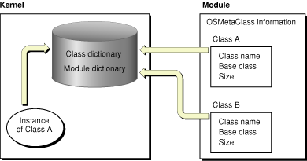
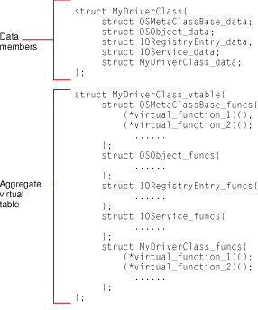

> 导航：[总目录](../../../README.md) · [documentation](../../../_indexes/documentation.md) · [IOKit Device Driver Design Guidelines](Introduction%20to%20I-O%20Kit%20Device%20Driver%20Design%20Guidelines.md)


[Next](libkern%20Collection%20and%20Container%20Classes.md)[Previous](Introduction%20to%20I-O%20Kit%20Device%20Driver%20Design%20Guidelines.md)

# The libkern C++ Runtime

When they designed the OS X kernel, Apple engineers decided upon a restricted form of C++ because they felt the excluded features—exceptions, multiple inheritance, templates, and runtime type information (RTTI)—were either insufficient or not efficient enough for a high-performance, multithreaded kernel. But because some form of RTTI was required, Apple devised an enhanced runtime typing system. This system, which is implemented by the libkern library, provides the following features:

- Dynamic object allocation and object construction and destruction
- Object introspection and dynamic casting of objects
- Runtime object accounting (tracking the number of current instances per class)
- Safeguards for binary compatibility

The principal agent behind these features is libkern’s OSMetaClass class. OSMetaClass is a peer class to OSObject—the class that all device drivers ultimately derive from—because both classes directly inherit from the same true root class, OSMetaClassBase. This chapter explores in some depth the APIs and services of the OSMetaClass and OSMetaClassBase classes and discusses how you can best take advantage of them in your code. The APIs of OSMetaClass and OSMetaClassBase are defined in `OSMetaClass.h`.

The libkern library builds and updates its C++ runtime system whenever kernel extensions are loaded (or unloaded) from the kernel. Each class in the libkern or I/O Kit libraries is itself an object of type OSMetaClass. The OSMetaClass class specifies four instance variables to characterize class instances:

- Class name
- Base class (pointer to)
- Size of class
- Current number of instances

When the kernel loader loads a kernel extension (KEXT), it needs to register the first three bits of information with the runtime system. This system is actually a metaclass database consisting of two cross-indexed dictionaries. One dictionary—call it the class dictionary—is indexed by class name; the other dictionary, known as the module dictionary, is indexed by the name of the KEXT binary.

- The class dictionary consists of class-name keys paired with OSMetaClass objects. It is essential to the dynamic creation of libkern objects, including driver instances.
- The module dictionary consists of the KEXT-binary names paired with an array of the OSMetaClass objects in the binary. It is an essential part of the way KEXTs are safely unloaded from the kernel

[Figure 1-1](#apple-f4xwc4dqnrsv64tfmyxwi33df52wszbpkridgmbqgaydmojvfvbecssiifeeqsq) illustrates how the libkern runtime writes class information to these dictionaries when KEXTs are loaded into the kernel.

__Figure 1-1__  Registering metaclass information from a KEXT binary



There are three distinct phases to metaclass registration that the loader performs when loading a kernel extension:

1. __Before Loading__ The loader calls the OSMetaClass member function `preModLoad`. This function grabs a lock to guarantee single-threading during the loading of multiple kernel extensions. It also generates global information about classes in KEXT binaries in preparation for registration.
2. __Loading__ The loader calls each of the static constructors created by OSMetaClass macros as part of a class definition (see[Object Creation and Destruction](#apple-f4xwc4dqnrsv64tfmyxwi33df52wszbpkridgmbqgaydmojvfvbecssdinbeosq)). As a result, the OSMetaClass constructor for each class is invoked; the arguments for this constructor are three of the OSMetaClass data members: Class name, pointer to the base class, and class size. The loader updates the class and module dictionaries, using the KEXT-binary name and class names as keys and inserting the just-created OSMetaClass objects into those dictionaries. It also links up all base-class inheritance pointers.
3. __After Loading__ After all static constructors are called, the loader calls the OSMetaClass member function `postModLoad`. This function releases the lock and returns the result code from the loading. If this code indicates an error, such as a badly formed constructor, the load attempt is aborted.

Whenever kernel code creates an instance of an OSObject-derived class, the libkern runtime typing system increments the instance counter of the associated OSMetaClass object; it decrements the counter whenever an instance is freed. The runtime system uses this running tally of instances to prevent the unloading of kernel extensions having “live” objects in the system. (Of course, if code improperly retains and releases objects, this could lead to the retention of KEXTs that should be unloaded—and, consequently, memory leaks. And leaked object references lead to annoying and costly delays in the development cycle.)

When the instance count of all classes in a KEXT binary reaches zero, the kernel unloader waits a minute (to ensure that the binary won’t be used again soon) before unloading the binary from the kernel. Just before unloading, the unloader calls the static destructor of each class in the binary, which removes all references to that class from the runtime system.

Because exceptions are excluded from the kernel’s restricted form of C++, you cannot implement “normal” C++ constructors and destructors without jeopardy. Constructors and destructors are typed to return no value (such as an error code). Normally, if they encounter a problem, they raise an exception. But because exceptions aren’t supported in the kernel’s C++ runtime, there is no way for you to know when an allocation or deallocation error has occurred.

This situation prompted a design feature of the libkern’s C++ runtime system that uses OSMetaClass macros to specify the structure of a class—that is, the metaclass data structures and functional interfaces—for the runtime typing system. The macros also define the primary constructor and a destructor for a class. These macro-created constructors are guaranteed not to fail because they do not themselves perform any allocations. Instead, the runtime system defers the actual allocation of objects until their initialization (usually in the `init` member function). Because the `init` function is typed to return a `bool`, it makes it possible to return an error upon any failure.

When you create a C++ class based on OSObject, your code must call a matching pair of macros based upon the OSMetaClass class. The calls must be among the first statements in both the definition and implementation of the class. These macros are critical to your class because they enter metaclass information about it into the libkern runtime typing facility and define the static constructor and destructor for your class.

For concrete (that is, non-abstract) classes, the first macro, `OSDeclareDefaultStructors` declares the C++ constructors; by convention you insert this macro as the first element of the class declaration in the header file. For example:

```
class com_MyCompany_driver_MyDriver : public IOService
{
    OSDeclareDefaultStructors(com_MyCompany_driver_MyDriver);
    /* ... */
};
```

Your class implementation must include the companion “define” macro, `OSDefineMetaClassAndStructors`. This macro defines the constructor and destructor, implements the OSMetaClass allocation member function (`alloc`) for the class, and supplies the metaclass information for the runtime typing system. `OSDefineMetaClassAndStructors` takes as arguments the name of your driver’s class and the name of its base class. It uses these to generate code that allows your driver class to be loaded and instantiated while the kernel is running. It typically occurs as one of the first statements of the class implementation. For example, `MyDriver.cpp` might begin like this:

```c
#include "MyDriver.h"

// This convention makes it easy to invoke base class member functions.
#define super    IOService

// You cannot use the "super" macro here, however, with the
//  OSDefineMetaClassAndStructors macro.
OSDefineMetaClassAndStructors(com_MyCompany_driver_MyDriver, IOService);
```

If the class you are defining is an abstract class intended only to be inherited from, use the `OSDeclareAbstractStructors` and `OSDefineMetaClassAndAbstractStructors` macros instead. These macros do the same things as their non-abstract counterparts except that they make the primary constructor private and define the `alloc` member function to return zero.

The `OSDefineMetaClassAndStructors` and `OSDefineMetaClassAndAbstractStructors`macros are based on two other OSMetaClass macros: `OSDefineMetaClassAndStructorsWithInit` and `OSDefineMetaClassAndAbstractStructorsWithInit`, respectively. These latter two macros are deprecated and should not be used directly.

The OSMetaClass plays an important role in the libkern C++ runtime by allocating objects based upon class type. Derived classes of OSMetaClass can do this dynamically by implementing the `alloc`function; the class type is supplied by the OSMetaClass derived class itself. As mentioned in the previous section, [Object Scope and Constructor Invocation](#apple-f4xwc4dqnrsv64tfmyxwi33df52wszbpkridgmbqgaydmojvfvkfawcsivddcmbt), the constructors created by the OSMetaClass macros implement `alloc` automatically for your class.

The container classes of libkern and the families of the I/O Kit provide various helper member functions for creating (allocating) objects, and these are what you use most of the time. But you can also directly allocate an instance of any libkern or I/O Kit class using two kinds of OSMetaClass calls:

- By calling one of the OSMetaClass `allocClassWithName`functions, supplying an identification of class type (as an OSSymbol, OSString, or C-string)
- By calling the macro `OSTypeAlloc` (defined in the OSMetaClassBase class)

Both the `allocClassWithName` and the `OSTypeAlloc` macro are similar in that they take some indication of type as the sole argument. However, there is an important difference. Because of a preprocessor artifact, the macro takes a type argument that is a compile-time symbol and not a string; thus the macro is more efficient than the dynamic allocation performed by the `allocClassWithName` member functions, but it is not truly dynamic. The allocation member functions defer binding until runtime, whereas the macro will generate a link-time error if the kernel extension doesn’t properly specify the dependencies of the type argument. In addition, the macro, unlike the functions, casts the result to the appropriate type for you.

The `OSTypeAlloc` macro is intended to replace the C++ `new` operator when you are creating objects derived from OSObject. The reason behind this change is binary compatibility: The `new` operator is fragile if you are creating an object that doesn’t exist in the same kernel extension as your code. By passing the size of a class as an argument to `malloc`, C++ compiles the size value into the calling binary. But if there are any dependencies on that size and the class later becomes larger, the binary might break in sundry subtle ways, such as by writing over succeeding allocation blocks. The `OSTypeAlloc` macro, on the other hand, allows the class doing the allocation to determine its own size.

Freshly allocated objects created with the allocation macro or functions have a retain count of one as their sole data member and are otherwise uninitialized. After allocation, you should immediately invoke the object’s initialization member function (typically `init` or some variant of `init`). The initialization code thus has the opportunity to test whether the object is valid and to return an appropriate error code if it isn’t.

Global constructors—sometimes called global initializers—are a useful feature of the C++ language. For drivers, they permit the safe initialization and allocation of resources that must be available before the driver starts transferring data. To properly understand what global constructors are and why they are useful, let’s first review _when_ C++ objects with various kinds of scope are constructed and destroyed.

C++ gives you four different ways to create an object. In each case, the object has a specific scope because the invocations of its constructor and destructor occur at specific times. Where the construction of the object occurs as a result of declaration (automatic local, static local, and global), only the default constructor is invoked.

- __Explicitly created objects__ Such objects are dynamically created through the `new` operator and are destroyed through the `delete` operator. The life time of the object is the period between `new` and `delete`, because that is when the constructor and destructor are called. OSMetaClass bases its mechanism for dynamic allocation of libkern objects on the `new` operator. All objects that inherit from OSObject can only be explicitly created objects. OSMetaClassBase’s `retain` and `release` calls implement a more sophisticated reference-counting mechanism—based on `new` and `delete`—for object persistence.
- __Automatic local objects__ An automatic local object is created each time control pass through its declaration within a member function. Its destructor is called each time control passes back above the object’s declaration or out of the enclosing block. The following example illustrates the scope of automatic local objects (`IntArray` is a C++ class):

```
void func() {
    IntArray a1;                // a1 constructed here 1 time
    int l = 2;
    for (i=0; i < 3; i++) {
        IntArray a2;            // a2 constructed here 3 times
        if (i == l) {
            IntArray a3;        // a3 constructed here 1 time
            // ...                 (when "if" is true)
        }                       // a3 destroyed at exit of "if" block
    }                           // a2 destroyed here 3 times
}                               // a1 destroyed here 1 time
```
- __Static local objects__ These objects are similar to automatic local objects, but with a few important differences. Static local objects are declared within a member function with a `static` keyword. Like an automatic local object, a static object’s constructor is called when control passes through the declaration, but only the first time. It won’t be constructed if control never passes through its declaration. A static local object’s destructor is called only when the executable exits normally (such as when `main` returns or `exit` is called or a kernel extension is unloaded).
- __Global objects__ A global object is declared outside of any function. It exists throughout the runtime life of an executable. The constructor of a global object is invoked before an executable’s entry point; the destructor is called after the program exits. Adding the keyword `static` to the declaration limits the scope of the object to the translation unit (typically an object file) in which it is defined.

For I/O Kit drivers, the scope of a global object entails a guarantee that two things will happen:

- The constructor is called before the invocation of its KEXT-binary’s functional entry point. For drivers, global constructors are called at load time; for other kernel extensions, global constructors are called before `MODULE_START`.
- The code running in the constructor is single-threaded (per KEXT binary).

Because of these guarantees, a global constructor—or, more descriptively, a global initializer—is an ideal programming locale for implementing locks (taking advantage of the single-threadedness) and for initializing global resources.

There are a couple of caveats to note about C++ objects with global scope. First, such objects cannot derive from OSObject; as noted earlier, libkern permits only the explicit creation of objects. Second, if your code has multiple global initializers in the same translation unit, they are invoked in the order of their definition. However, if you have multiple global initializers in different KEXT binaries, the order of their invocation between binaries is undefined. Because of this, it is good programming practice to avoid dependencies among global initializers.

As the previous section makes clear, global initializers are an ideal means for initializing global data structures and for setting up resources such as locks, typically to protect those data structures. Let’s look at how a global initializer might be used in driver writing.

The I/O Kit Serial family uses a global initializer to initialize global data structures. [Listing 1-1](#apple-f4xwc4dqnrsv64tfmyxwi33df52wszbpkridgmbqgaydmojvfvbecssdizeeiqy) shows the definition of the (private) IOSerialBSDClientGlobals class. Following the definition is the declaration of a `static` variable of the class; this definition generates a single instance of the class and tells the compiler that this instance and its data are global in scope.

__Listing 1-1__  Definition of a class to be declared global

```
class IOSerialBSDClientGlobals {
private:

    unsigned int fMajor;
    unsigned int fLastMinor;
    IOSerialBSDClient **fClients;
    OSDictionary *fNames;

public:
    IOSerialBSDClientGlobals();
    ~IOSerialBSDClientGlobals();

    inline bool isValid();
    inline IOSerialBSDClient *getClient(dev_t dev);

    dev_t assign_dev_t();
    bool registerTTY(dev_t dev, IOSerialBSDClient *tty);
    const OSSymbol *getUniqueTTYSuffix
        (const OSSymbol *inName, const OSSymbol *suffix, dev_t dev);
    void releaseUniqueTTYSuffix(const OSSymbol *inName, const OSSymbol *suffix);
};

static IOSerialBSDClientGlobals sBSDGlobals;
```

The declaration of the `sBSDGlobals` variable kicks off the constructor for the IOSerialBSDClientGlobals class (and other global initializers) at load time. The Serial family implements this constructor as shown in [Listing 1-2](#apple-f4xwc4dqnrsv64tfmyxwi33df52wszbpkridgmbqgaydmojvfvbecssei5eeiqy).

__Listing 1-2__  Implementation of a global constructor

```
#define OSSYM(str) OSSymbol::withCStringNoCopy(str)
IOSerialBSDClientGlobals::IOSerialBSDClientGlobals()
{
    gIOSerialBSDServiceValue = OSSYM(kIOSerialBSDServiceValue);
    gIOSerialBSDTypeKey      = OSSYM(kIOSerialBSDTypeKey);
    gIOSerialBSDAllTypes     = OSSYM(kIOSerialBSDAllTypes);
    gIOSerialBSDModemType    = OSSYM(kIOSerialBSDModemType);
    gIOSerialBSDRS232Type    = OSSYM(kIOSerialBSDRS232Type);
    gIOTTYDeviceKey          = OSSYM(kIOTTYDeviceKey);
    gIOTTYBaseNameKey        = OSSYM(kIOTTYBaseNameKey);
    gIOTTYSuffixKey          = OSSYM(kIOTTYSuffixKey);
    gIOCalloutDeviceKey      = OSSYM(kIOCalloutDeviceKey);
    gIODialinDeviceKey       = OSSYM(kIODialinDeviceKey);
    gIOTTYWaitForIdleKey     = OSSYM(kIOTTYWaitForIdleKey);

    fMajor = (unsigned int) -1;
    fNames = OSDictionary::withCapacity(4);
    fLastMinor = 4;
    fClients = (IOSerialBSDClient **)
                IOMalloc(fLastMinor * sizeof(fClients[0]));
    if (fClients && fNames) {
        bzero(fClients, fLastMinor * sizeof(fClients[0]));
        fMajor = cdevsw_add(-1, &IOSerialBSDClient::devsw);
    }

    if (!isValid())
        IOLog("IOSerialBSDClient didn't initialize");
}
#undef OSSYM
```

This code creates OSSymbol objects for various attributes of the Serial family and allocates other global resources. One thing to note about this example code is the call to `isValid`; this member function simply verifies whether the global initialization succeeded. Because exceptions are excluded from the kernel’s restricted form of C++, you need to make some validation check like this either in the constructor itself or in the `start` member function. If the global initializer did not do its work, your driver should gracefully exit.

The destructor for the IOSerialBSDClientGlobals (see [Listing 1-3](#apple-f4xwc4dqnrsv64tfmyxwi33df52wszbpkridgmbqgaydmojvfvbecsseijcukqq)) class frees the global resources created by the constructor. A global destructor is called after the invocation of the `MODULE_STOP` member function or, in the case of drivers, at unload time.

__Listing 1-3__  Implementation of a global destructor

```
IOSerialBSDClientGlobals::~IOSerialBSDClientGlobals()
{
    SAFE_RELEASE(gIOSerialBSDServiceValue);
    SAFE_RELEASE(gIOSerialBSDTypeKey);
    SAFE_RELEASE(gIOSerialBSDAllTypes);
    SAFE_RELEASE(gIOSerialBSDModemType);
    SAFE_RELEASE(gIOSerialBSDRS232Type);
    SAFE_RELEASE(gIOTTYDeviceKey);
    SAFE_RELEASE(gIOTTYBaseNameKey);
    SAFE_RELEASE(gIOTTYSuffixKey);
    SAFE_RELEASE(gIOCalloutDeviceKey);
    SAFE_RELEASE(gIODialinDeviceKey);
    SAFE_RELEASE(gIOTTYWaitForIdleKey);
    SAFE_RELEASE(fNames);
    if (fMajor != (unsigned int) -1)
        cdevsw_remove(fMajor, &IOSerialBSDClient::devsw);
    if (fClients)
        IOFree(fClients, fLastMinor * sizeof(fClients[0]));
}
```

As shown in this example, the destructor should always check if initializations did occur before attempting to free resources.

Object introspection is a major benefit that the libkern runtime typing facility brings to kernel programming. By querying this facility, the functions and macros of the OSMetaClass and OSMetaClassBase classes allow you to discover a range of information about arbitrary objects and classes:

- The class of which an object is a member
- Whether an object inherits from (directly or indirectly) a specified class
- Whether one object is equal to another object
- The current number of runtime instances for a class and its derived classes
- The size, name, and base class of a particular class

[Table 1-1](#apple-f4xwc4dqnrsv64tfmyxwi33df52wszbpkridgmbqgaydmojvfvbecssjjfdemqi) describes the introspection functions and macros.

__Table 1-1__  OSMetaClass and OSMetaClassBase introspection macros and member functions

| Member Function or Macro | Description |
| `OSTypeID` | A macro that, given a class name (not quoted), returns the indicated OSMetaClass instance. |
| `OSTypeIDInst` | A macro that, given an instance of an OSObject derived class, returns the class of that object (as an OSMetaClass instance). |
| `OSCheckTypeInst` | A macro that determines whether a given object inherits directly or indirectly from the same class as a reference object (that is, an object whose class type is known). |
| `isEqualTo` | Returns `true` if two objects are equivalent. What equivalence means depends upon the libkern or I/O Kit derived class overriding this member function. OSMetaClassBase implements this function as a shallow pointer comparison. |
| `metaCast` | Determines whether an object inherits from a given class; variants of the member function let you specify the class as an OSMetaClass instance, an OSSymbol object, an OSString object, or a C-string. Defined by the OSMetaClassBase class. |
| `checkMetaCastWithName` | Similar to `metaCast`, but implemented as a static member function of OSMetaClass. |
| `getInstanceCount` | OSMetaClass accessor that returns the current number of instances for a given class (specified as an instance of OSMetaClass) and all derived classes of that class. |
| `getSuperClass` | OSMetaClass accessor function that returns the base class of the specified class. |
| `getClassName` | OSMetaClass accessor function that returns the name of the specified class. |
| `getClassSize` | OSMetaClass accessor function that returns the size of the specified class. |

OSMetaClassBase also includes a useful macro named `OSDynamicCast`. This macro does basically the same thing as the standard C++ `dynamic_cast<`_type_ `*>(`_object_`)` operator: It converts the class type of an object to another, compatible type. But before the `OSDynamicCast` macro converts the type of the instance, it verifies that the cast is valid—that is, it checks if the given instance inherits from the given type. If it doesn’t, it returns zero. It also returns zero if either the class type or the instance specified as a parameter is zero. No type qualifiers, such as `const`, are allowed in the parameters.

[Listing 1-4](#apple-f4xwc4dqnrsv64tfmyxwi33df52wszbpkridgmbqgaydmojvfvbecsskijduiqi) illustrates how you might do some introspection tests and dynamic casts.

__Listing 1-4__  Code showing dynamic casting and introspection

```swift
void testIntrospection() {

    unsigned long long val = 11;
    int count;
    bool yup;
    OSString *strObj = OSString::withCString("Darth Vader");
    OSNumber *numObj = OSTypeAlloc(OSNumber);
    numObj->init(val, 3);

    yup = OSCheckTypeInst(strObj, numObj);
    IOLog("strObj %s the same as numObj\n", (yup ? "is" : "is not"));

    count = (OSTypeIDInst(numObj))->getInstanceCount();
    IOLog("There are %d instances of OSNumber\n", count);

    if (OSDynamicCast(OSString, strObj)) {
    IOLog("Could cast strObj to OSString");
    } else {
    IOLog("Couldn't cast strObj to OSString");
    }
}
```


Something that has long plagued C++ library developers is the fragile base class problem. The libkern library and, more specifically, the OSMetaClass class offer ways to avoid the danger to backward binary compatibility posed by fragile base classes. But before you learn about those APIs, you might find a summary of the fragile base class problem helpful.

The fragile base class problem affects only non-leaf classes, and then only when those classes are defined in different KEXTs. So if you never intend your libkern or I/O Kit class to be a base class, then fragile base classes won’t be an issue (and you have no need to read further). But if your class could be a base class to some other class, and you later change your class in certain ways, all external KEXTs with dependencies on your class are likely to experience problems that will cause them to break.

Not all changes to a non-leaf class make it a fragile base class. For instance, you can add non-virtual functions or even new classes to a kernel extension without peril. If you have a function that is a polymorphed version of a base class virtual function you won’t have a problem either. And you can always reimplement a member function, virtual or non-virtual. But there are certain additions and modifications that are almost certain to cause binary-compatibility problems:

- New virtual member functions
- Changes to the order of virtual-function declarations
- New instance variables (data members)
- Changes to the type or size of instance variables (for example, changing a `short` to a `long` or increasing the maximum size of an array)

The reason these modifications to a non-leaf class introduce fragility is that KEXTs containing derived classes of that class incorporate knowledge of characteristics of the base class such as:

- The size of the object
- Offsets to protected or public data
- The size of your class’s virtual table (vtable) as well as the offsets in it

Code that is dependent on these sizes and offsets will break if a size or offset subsequently changes. To look at it another way, each compiled C++ class is, internally, two structures. One structure holds the aggregate data members in an inheritance chain; the other structure contains the aggregate virtual tables of the same inheritance chain. (An instance of the class holds _all_ of the aggregate data members and contains a pointer to one instance of the aggregate virtual tables.) The C++ runtime uses the sizes and offsets created by these concatenated structures to locate data members and member functions. [Figure 1-2](#apple-f4xwc4dqnrsv64tfmyxwi33df52wszbpkridgmbqgaydmojvfvbecssdijeuiry) illustrates in an abstract way how these structures might be laid out internally.

__Figure 1-2__  The aggregate data and vtable structures of a compiled class



The libkern C++ library has mechanisms that mitigate the fragile base class problem. Basically, these techniques let you create “pad slots” (that is, reserved fields) for both data members and virtual functions anticipated for future expansion. The following sections explain how to pad a class, and then how to adjust the padding whenever you add new data members or virtual functions.

To prepare your non-leaf class for any future addition of data members, specify an empty `ExpansionData` structure and a `reserved` pointer to that structure. Then, when you add a field to this structure, allocate this additional data in the initialization member function for the class (typically `init`).

Enter the lines in [Listing 1-5](#apple-f4xwc4dqnrsv64tfmyxwi33df52wszbpkridgmbqgaydmojvfvbecssginfeoqi) into your class header file in a section with protected scope (as indicated).

__Listing 1-5__  Initial declarations of the `ExpansionData` structure and `reserved` pointer

```
protected:
/*! @struct ExpansionData
    @discussion This structure helps to expand the capabilities of
    this class in the future.
    */
    struct ExpansionData { };

/*! @var reserved
    Reserved for future use.  (Internal use only)  */
    ExpansionData *reserved;
```

Later, when you need to add new data members to your class, add the field or fields to the `ExpansionData` structure and define a preprocessor symbol for the field as referenced by the `reserved` pointer. [Listing 1-6](#apple-f4xwc4dqnrsv64tfmyxwi33df52wszbpkridgmbqgaydmojvfvbecssei5buosq) shows how you might do this.

__Listing 1-6__  Adding a new field to the `ExpansionData` structure

```swift
struct ExpansionData { int eBlastIForgot; };
ExpansionData *reserved;
#define fBlastIForgot ((com_acme_driver_MyDriverClass::ExpansionData *)
            com_acme_driver_MyDriverClass::reserved)->eBlastIForgot)
```

Finally, at initialization time, allocate the newly expanded structure.

The first step toward padding the virtual table of your class is to estimate how many pad slots you’ll need—that is, how many virtual functions might be added to your class in the future. You don’t want to add too many, for that could unnecessarily bloat the memory footprint of your code, and you don’t want to add too few, for obvious reasons. A good estimation technique is the following:

1. Count the virtual functions in your class that are just polymorphed versions of a base class virtual function.
2. Subtract that value from the total number of virtual functions in your class.
3. Pick a number between the result of the subtraction and the total number of virtual functions. Your choice, of course, should be influenced by your sense of how much updating the API might undergo in the future.

When you’ve determined how many reserved slots you’ll need for future expansion, specify the `OSMetaClassDeclareReservedUnused` macro in your class header file for each slot. This macro takes two parameters: the class name and the index of the pad slot. [Listing 1-7](#apple-f4xwc4dqnrsv64tfmyxwi33df52wszbpkridgmbqgaydmojvfvbecssdi5dusry) shows how the IOHIDDevice class specifies the `OSMetaClassDeclareReservedUnused` macro.

__Listing 1-7__  The initial padding of a class virtual table (header file)

```
public:
    // ...
    OSMetaClassDeclareReservedUnused(IOHIDDevice,  0);
    OSMetaClassDeclareReservedUnused(IOHIDDevice,  1);
    OSMetaClassDeclareReservedUnused(IOHIDDevice,  2);
    OSMetaClassDeclareReservedUnused(IOHIDDevice,  3);
    OSMetaClassDeclareReservedUnused(IOHIDDevice,  4);
    OSMetaClassDeclareReservedUnused(IOHIDDevice,  5);
    OSMetaClassDeclareReservedUnused(IOHIDDevice,  6);
    OSMetaClassDeclareReservedUnused(IOHIDDevice,  7);
    OSMetaClassDeclareReservedUnused(IOHIDDevice,  8);
    OSMetaClassDeclareReservedUnused(IOHIDDevice,  9);
    OSMetaClassDeclareReservedUnused(IOHIDDevice, 10);
    // ...
```

In your class implementation file, type the corresponding `OSMetaClassDefineReservedUnused` macros. These macros also take the name of the class and the index of the pad slot as parameters. [Listing 1-8](#apple-f4xwc4dqnrsv64tfmyxwi33df52wszbpkridgmbqgaydmojvfvbecssgijceusa) shows these macros as they appear in the `IOHIDDevice.cpp` file

__Listing 1-8__  The initial padding of a class virtual table (implementation file)

```
// at end of function implementations
OSMetaClassDefineReservedUnused(IOHIDDevice,  0);
OSMetaClassDefineReservedUnused(IOHIDDevice,  1);
OSMetaClassDefineReservedUnused(IOHIDDevice,  2);
OSMetaClassDefineReservedUnused(IOHIDDevice,  3);
OSMetaClassDefineReservedUnused(IOHIDDevice,  4);
OSMetaClassDefineReservedUnused(IOHIDDevice,  5);
OSMetaClassDefineReservedUnused(IOHIDDevice,  6);
OSMetaClassDefineReservedUnused(IOHIDDevice,  7);
OSMetaClassDefineReservedUnused(IOHIDDevice,  8);
OSMetaClassDefineReservedUnused(IOHIDDevice,  9);
OSMetaClassDefineReservedUnused(IOHIDDevice, 10);
// ...
```

When you subsequently add a virtual function to your class, replace the `OSMetaClassDeclareReservedUnused` macro having the lowest index in your class header file with an `OSMetaClassDeclareReservedUsed` macro; be sure to use the same index number. To document the replacement, have the macro immediately precede the declaration of the function. The IOHIDDevice class does this as shown in [Listing 1-9](#apple-f4xwc4dqnrsv64tfmyxwi33df52wszbpkridgmbqgaydmojvfvbecssci5auuqq).

__Listing 1-9__  Adjusting the pad slots when adding new virtual functions—header file

```
public:
// ...
    OSMetaClassDeclareReservedUsed(IOHIDDevice,  0);
    virtual IOReturn updateElementValues(IOHIDElementCookie * cookies,
                                        UInt32 cookieCount = 1);

protected:
    OSMetaClassDeclareReservedUsed(IOHIDDevice,  1);
    virtual IOReturn postElementValues(IOHIDElementCookie * cookies,
                                        UInt32 cookieCount = 1);

public:
    OSMetaClassDeclareReservedUsed(IOHIDDevice,  2);
    virtual OSString * newSerialNumberString() const;

    OSMetaClassDeclareReservedUnused(IOHIDDevice,  3);
    OSMetaClassDeclareReservedUnused(IOHIDDevice,  4);
    OSMetaClassDeclareReservedUnused(IOHIDDevice,  5);
    OSMetaClassDeclareReservedUnused(IOHIDDevice,  6);
    OSMetaClassDeclareReservedUnused(IOHIDDevice,  7);
    OSMetaClassDeclareReservedUnused(IOHIDDevice,  8);
    OSMetaClassDeclareReservedUnused(IOHIDDevice,  9);
    OSMetaClassDeclareReservedUnused(IOHIDDevice, 10);
// ...
```

In the implementation file, replace the lowest-indexed `OSMetaClassDefineReservedUnused` macro with a `OSMetaClassDefineReservedUsed` macro for each new virtual function. Again, for clarity’s sake, consider putting the macro immediately before the function implementation. See [Listing 1-10](#apple-f4xwc4dqnrsv64tfmyxwi33df52wszbpkridgmbqgaydmojvfvbecsskivbugqi) for an example.

__Listing 1-10__  Adjusting the pad slots when adding new virtual functions—implementation file


```
OSMetaClassDefineReservedUsed(IOHIDDevice,  0);
IOReturn IOHIDDevice::updateElementValues(IOHIDElementCookie *cookies,
                                        UInt32 cookieCount) {
    // implementation code...
}

OSMetaClassDefineReservedUsed(IOHIDDevice,  1);
IOReturn IOHIDDevice::postElementValues(IOHIDElementCookie * cookies,
                                        UInt32 cookieCount) {
    // implementation code...
}

OSMetaClassDefineReservedUsed(IOHIDDevice,  2);
OSString * IOHIDDevice::newSerialNumberString() const
{    // implementation code ...
}
OSMetaClassDefineReservedUnused(IOHIDDevice,  3);
OSMetaClassDefineReservedUnused(IOHIDDevice,  4);
OSMetaClassDefineReservedUnused(IOHIDDevice,  5);
OSMetaClassDefineReservedUnused(IOHIDDevice,  6);
OSMetaClassDefineReservedUnused(IOHIDDevice,  7);
OSMetaClassDefineReservedUnused(IOHIDDevice,  8);
OSMetaClassDefineReservedUnused(IOHIDDevice,  9);
OSMetaClassDefineReservedUnused(IOHIDDevice, 10);
// ...
```

[Next](libkern%20Collection%20and%20Container%20Classes.md)[Previous](Introduction%20to%20I-O%20Kit%20Device%20Driver%20Design%20Guidelines.md)

