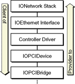
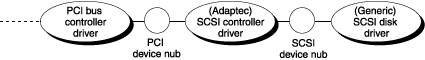
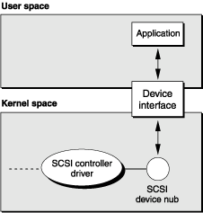

> 导航：[总目录](../../../README.md) · [documentation](../../../_indexes/documentation.md) · [IOKit Fundamentals](Introduction%20to%20I-O%20Kit%20Fundamentals.md)

[Next](The%20I-O%20Registry.md)[Previous](What%20Is%20the%20I-O%20Kit.md)

# Architectural Overview

As you can with any complex system, you can look at the design of the I/O Kit from various angles and at different granularities. This chapter introduces you to the more important architectural elements and conceptual domains of the I/O Kit:

- Hardware modeling, the layering of driver objects, and the roles played by families, drivers, and nubs
- The runtime environment of device drivers
- The I/O Kit Registry and I/O Catalog
- Driver matching
- The I/O Kit class hierarchy
- Device interfaces

Keep in mind that this chapter is an overview, and so the discussion it devotes to each of these topics is intentionally brief. Later chapters cover most of these topics in more detail. In the case of device interfaces, the document _[Accessing Hardware From Applications](../Accessing%20Hardware%20From%20Applications/Introduction%20to%20Accessing%20Hardware%20From%20Applications.md#apple-f4xwc4dqnrsv64tfmyxwi33df52wszbpkridgmbqgaydgnzw)_ describes the technology in great detail.

Central to the design of the I/O Kit is a modular, layered runtime architecture that models the hardware of an OS X system by capturing the dynamic relationships among the multiple pieces—hardware and software—involved in an I/O connection. The layers of the connection, comprising driver objects and the families these objects are members of, are stacked in provider-client relationships.

The chain of interconnected services or devices starts with a computer’s logic board (and the driver that controls it) and, through a process of discovery and “matching,” extends the connection with layers of driver objects controlling the system buses (PCI, USB, and so on) and the individual devices and services attached to these buses.

You can view the layering of driver objects in a running OS X system using the I/O Registry Explorer application, included in the developer version of OS X. The developer version also includes a command-line version of the application, `ioreg`, that you can run in a Terminal window to display current I/O Registry information.

This section examines the I/O Kit’s layered architecture and describes the major constituent elements: families, drivers, and nubs.

An I/O Kit family is one or more C++ classes that implement software abstractions common to all devices of a particular type. The I/O Kit has families for bus protocols (such as SCSI Parallel, USB, and FireWire), for storage (disk) devices, for network services (including Ethernet), for human-interface devices (such as mice, keyboards, and joysticks), and for a host of other devices.

A driver becomes a member of a family through inheritance; the driver’s class is almost always a subclass of some class in a family. By being a member of a family, the driver inherits the data structures (instance variables) and the behaviors that are common to all members of the family. For example, all SCSI controllers have certain things they must do, such as scanning the SCSI bus; the SCSI Parallel family defines and implements this scanning functionality. Thus, you do not need to include scanning code in your new SCSI controller driver (unless you require a different scanning implementation).

Most I/O Kit development involves writing specific driver classes, each of which inherits from the superclass in the family that provides the functionality the driver requires. A driver for an Ethernet controller, for example, inherits from the IOEthernetController superclass in the Network family. The bulk of a driver’s interaction with its own family involves implementing member functions that the family invokes. These are typically client configuration and I/O requests. Some families also define objects and functions for your driver to use. The exact nature of these objects and functions depends on the family your driver works with.

However, a driver typically works with two families. In addition to the family a driver is a member of, the driver class must communicate with a nub published by the family for the bus or protocol the device is attached to. A nub (as [Drivers and Nubs](#apple-f4xwc4dqnrsv64tfmyxwi33df52wszbpkridambqgaydcmznijcuqrcdirceg) explains in detail) is an object that defines an access point and communication channel for a given protocol. A family (usually representing a bus such as PCI or USB) acts as the driver’s provider through the nub that it creates. The driver uses the nub to attach into the I/O Registry and communicate with its device. As an example, a PCI Ethernet driver would use an `IOPCIDevice` nub from the PCI family to attach to and communicate over the PCI bus. A driver’s main interaction with the nub involves the issuing of requests or commands on whatever bus the nub is a client of. A SCSI device driver, for example, issues SCSI command blocks and checks results through the nub.

For more on families, particularly the nature and composition of superclasses in a family, see [The I/O Kit Family Classes](#apple-f4xwc4dqnrsv64tfmyxwi33df52wszbpkridambqgaydcmznijauerchifcus)

The I/O Kit supports two broad types of driver objects. The first is the nub, an object that defines an access point and communication channel, usually for a given protocol, such as PCI, USB, or Ethernet. The second type is the specific driver for an individual device or service. The specific driver communicates with the hardware, through a nub, to perform I/O operations. Both drivers and nubs in the I/O Kit must inherit from the IOService class.

A driver is an I/O Kit object that manages a specific piece of hardware. Drivers are written as kernel extensions and are usually installed in the Extensions folder (at `/System/Library/Extensions`.) See [Kernel Extension Overview](https://developer.apple.com/library/archive/documentation/Darwin/Conceptual/KernelProgramming/Extend/Extend.html#//apple_ref/doc/uid/TP30000905-CH220) in _[Kernel Programming Guide](../../Darwin/Kernel%20Programming%20Guide/About%20This%20Document.md#apple-f4xwc4dqnrsv64tfmyxwi33df52wszbpkridgmbqgaydsmbv)_ for more information about creating and installing kernel extensions.

When a driver is selected for a device, but before it is loaded into the kernel (as a kernel extension), all required families—in terms of superclasses and their dependencies—are loaded to provide the common functionality for the driver and others of its type. (Of course, if these families have already been loaded, this step is not necessary.) After all requirements for the driver are met, the driver is loaded and instantiated as an object. See [The Anatomy of an I/O Connection](#apple-f4xwc4dqnrsv64tfmyxwi33df52wszbpkridambqgaydcmznijauerccijdem) for an illustration of this process.

A nub is an I/O Kit object that represents a communication channel for a device or logical service and mediates access to the device and service. For example, a nub could represent a bus, a disk, a disk partition, a graphics adaptor, or a keyboard. It might help to think of a nub as the software representation of a device slot or connector. Nubs also provide services such as arbitration, power management, and driver matching (see [The I/O Registry and the I/O Catalog](#apple-f4xwc4dqnrsv64tfmyxwi33df52wszbpkridambqgaydcmznijauesscineeg)).

Nubs act as bridges between two drivers and, by extension, between two families. A driver communicates with a nub (and the nub’s family) as its client and may, through its family, publish a nub which finds (by matching) a driver for which it is a provider. Usually a driver publishes one nub for each individual device or service it controls; however, when a driver supports a specific piece of hardware it can act as its own nub.

The I/O Kit’s layered architecture models the chain of connections between the system’s hardware buses and devices, gathering common functionality into classes your driver can interact with. Each layer is a client of the layer below it and a provider of services to the layer above it. Broad groupings of layers, defined by the I/O Kit families, define the functionality common to a general type of I/O provider, such as networking or PCI bus devices.

Consider [Figure 2-1](#apple-f4xwc4dqnrsv64tfmyxwi33df52wszbpkridambqgaydcmzninbuirseifbek) which illustrates a typical layering of client and provider objects for a PCI-based Ethernet controller driver in the Network family.

__Figure 2-1__  Driver objects as clients and providers

As this diagram shows, your driver typically fits between two families, inheriting from a class in the upper-layer family and using the services of the lower-layer family. In the case of the Ethernet controller, the driver participates in a stack of C++ objects comprising instances of classes from the networking and PCI families:

|  |  |
| --- | --- |
| IONetworkStack (interface managing object) | Connects I/O Kit objects to the BSD networking facilities. |
| IOEthernetInterface (nub) | Manages device-independent data transmission and reception. |
| Controller Driver (driver) | Operates the Ethernet controller through the IOPCIDevice object. This object inherits from a networking family class called IOEthernetController. |
| IOPCIDevice (nub) | Match point for the controller; provides basic PCI bus interaction to the controller. |
| IOPCIBridge (driver) | Manages the PCI bus. (Other objects provide services to the IOPCIBridge; their specific identities depend on the hardware configuration.) |

Another way to look at a stack of driver objects in a typical I/O connection is to consider the stack from a dynamic perspective. In other words, what happens when an OS X system discovers a new device attached to it? How is the stack of driver objects constructed? For this, let’s use the example of a SCSI disk drive; the general order of creation or discovery in [Figure 2-2](#apple-f4xwc4dqnrsv64tfmyxwi33df52wszbpkridambqgaydcmznijaueskbifbek) is left to right.

__Figure 2-2__  Driver objects in a connection for a SCSI disk driver

This figure illustrates how a SCSI disk driver, a member of the Storage family, is connected to the PCI bus. As each individual connection is made, the newly created driver or nub is also added to the I/O Registry (described in [The I/O Registry and the I/O Catalog](#apple-f4xwc4dqnrsv64tfmyxwi33df52wszbpkridambqgaydcmznijauesscineeg)). The chain of connections takes place in several steps:

1. The PCI bus controller driver, a member of the PCI family, discovers a PCI device and announces its presence by creating a nub (`IOPCIDevice`).
2. The nub identifies (matches) an appropriate device driver—in this case, a SCSI controller driver—and requests that it be loaded. Loading the SCSI controller driver causes the SCSI Parallel family, and all families that it depends on, to be loaded as well. The SCSI controller driver is given a reference to the `IOPCIDevice` nub.
3. The SCSI controller driver, which is a client of the PCI family and a provider of SCSI Parallel family services, scans the SCSI bus for devices that might be clients of these services. Upon finding such a device (a disk), the driver announces the device’s presence by creating a nub (`IOSCSIDevice`).
4. The nub, by going through the matching procedure, finds a device driver (a disk driver) that is appropriate for the device and requests that this driver be loaded. Loading the disk driver causes the Storage family, and all families that it depends on, to be loaded as well. The disk driver is now a client of the SCSI Parallel family and a member of the Storage family. The disk driver is given a reference to the `IOSCSIDevice` nub.

In many cases, applications and other “user space” programs can use the I/O Kit’s device-interface technology to drive devices (including mass storage devices), obviating the need for a kernel-resident driver. See [Controlling Devices From Outside the Kernel](#apple-f4xwc4dqnrsv64tfmyxwi33df52wszbpkridambqgaydcmznijcuqrkhjbcuo) for an overview of this plug-in technology.

The I/O Kit provides a runtime environment with several powerful features for driver writers, including:

- A dynamic, layered driver architecture that allows drivers to be loaded and unloaded at any time and delays reserving costly system resources until they’re needed
- Standard facilities for managing data during common I/O operations
- A robust system for protecting access to driver resources during I/O operations, which frees driver writers from having to write their own code to enable and disable interrupts and manage locks on the driver’s private resources
- Access to services in the libkern C++ library (on which the I/O Kit itself is based) to manage collections, perform atomic operations, and byte-swap values for use on different kinds of hardware

The following section summarizes each of these features.

I/O Kit drivers can be loaded and unloaded or activated and deactivated at any time, through events initiated by software—as when networking stacks are brought up and down—and by hardware—as when a USB device is added to or removed from the bus. Nearly all drivers must work within the context of a dynamically changing system. The I/O Kit makes this easier by defining a standard life cycle for driver objects. By implementing a small set of functions, summarized in [The General I/O Kit Classes](#apple-f4xwc4dqnrsv64tfmyxwi33df52wszbpkridambqgaydcmznkrifqusfiyytani) your driver can gracefully handle the addition and removal of devices and services, as well as changes induced by the power-management system.

Nearly all I/O operations require the same preparation in OS X:

- Paging virtual memory into physical memory
- Wiring memory down so it can’t be paged out during I/O operations
- Building scatter/gather lists that describe the data buffers to read or write

The I/O Kit provides a set of utility classes to help drivers prepare memory for I/O operations and to build scatter/gather lists, including the IOMemoryDescriptor and IOMemoryCursor classes. For more information on these facilities, see the chapter [Managing Data](Managing%20Data.md#apple-f4xwc4dqnrsv64tfmyxwi33df52wszbpkridambqgaydcojnijbusrshi5bes)

Drivers running in a multithreaded system must be able to protect their resources from reentrant or concurrent access. The I/O Kit includes a small set of classes for this purpose. A work loop object runs a dedicated thread and manages a gating mechanism for exclusive access to data. Other objects, called event sources, use the gating mechanism to serialize function calls that access critical resources, closing the work loop gate before invoking the function. For more information on work loops and event sources, see the chapter [Handling Events](Handling%20Events.md#apple-f4xwc4dqnrsv64tfmyxwi33df52wszbpkridambqgaydcobnijauursgjjaui)

The libkern C++ library, on which the I/O Kit itself is based, provides services commonly needed by drivers, including:

- Arithmetic and logical operations that are guaranteed to be atomic
- Byte-swapping of values between big-endian and little-endian formats
- Classes for common collections of data such as strings, arrays, and dictionaries

For more information on the libkern classes see [The OS Classes](#apple-f4xwc4dqnrsv64tfmyxwi33df52wszbpkridambqgaydcmznkrifqusfiyytana) as well as the libkern reference documentation installed with the OS X Developer package.

Kernel code is always held resident in physical memory, and cannot be paged out by the virtual memory system. This makes kernel resources much more expensive than application program resources. Your driver should reside in the kernel if:

- It takes primary interrupts (in which case it must live in the kernel)
- Its primary client resides in the kernel; for example, mass storage drivers because file-system stacks reside in the kernel

Drivers for disks, network controllers, and keyboards, for example, reside in the kernel. If your driver is only occasionally used by one user-space program at a time, it should be loaded by the program and reside within it. Drivers for such devices as scanners and printers reside within user-space programs, using the I/O Kit’s device-interface mechanism to communicate with devices. For more information on device interfaces, see [Controlling Devices From Outside the Kernel](#apple-f4xwc4dqnrsv64tfmyxwi33df52wszbpkridambqgaydcmznijcuqrkhjbcuo)

Even if your driver resides in the kernel, you should minimize the amount of kernel-resident code and the amount of processing done by that code. For example, a dedicated application that controls an interrupt-driven hardware device should supply a driver that puts the minimum code in the kernel needed to service the interrupt, make the data available to its client, then return. For additional reasons to be cautious about programming in the kernel, see [Should You Program in the Kernel?](What%20Is%20the%20I-O%20Kit.md#apple-f4xwc4dqnrsv64tfmyxwi33df52wszbpkridambqgaydcmrnijbegrscifeem)

If your driver must reside in the kernel, you should be aware of the following issues:

- Most importantly, the kernel is a single program—there is no memory protection between your driver and the rest of the kernel. A kernel-resident driver that behaves badly can crash or hang the operating system.
- A more subtle issue is that function call stacks within the kernel are limited to 16 KB. Be careful not to declare large local variables in functions. Whenever possible, you should preallocate buffers and reuse them.

Kernel-resident drivers have full access to kernel programming interfaces. However, because of their low level of operation, drivers should use only Mach calls and not BSD calls. Many parts of the BSD kernel code aren’t currently safe for multithreading or multiprocessing. In any case, drivers rarely need to perform Mach calls directly, as the I/O Kit provides interfaces to most of the kernel-level functionality needed by a driver.

The I/O Registry is a dynamic database that records the network of driver objects participating in hardware connections on an OS X system and tracks the provider-client relationships among those objects. A device driver must be recorded in the I/O Registry to participate in most I/O Kit services.

The I/O Registry is a critical part of the I/O Kit because it supports the dynamic features of the operating system, which allows users to add or remove devices (particularly FireWire or USB devices) to and from a running system and have them immediately available, without the need for a reboot. As hardware is added, the system automatically finds and loads the necessary drivers and updates the I/O Registry to reflect the new device configuration; when hardware is removed, the appropriate drivers are unloaded and the Registry is updated again. The Registry always resides in system memory and is not stored on disk or archived between boots.

The I/O Registry structures its data as an inverted tree. Each object in the tree descends from a parent node and can have one or more child nodes; if it is a “leaf” node, it has no children. Almost every node in the tree represents a driver object: a nub or an actual driver. These objects must inherit from the IORegistryEntry class (which is the superclass of IOService, the superclass of all driver classes). The central characteristic of IORegistryEntry objects is a list of associated properties. These properties reflect the personality used in driver matching (see [Driver Matching](#apple-f4xwc4dqnrsv64tfmyxwi33df52wszbpkridambqgaydcmznijauerckijdui)) and otherwise add information about a driver. The properties captured in the Registry derive from each driver’s information property list, a file in the driver KEXT containing key-value pairs describing the driver’s characteristics, settings, and requirements.

Another dynamic database, the I/O Catalog, works closely with the I/O Registry. The I/O Catalog maintains entries for all available drivers on a system. When a nub discovers a device, it requests a list of all drivers of the device’s family from the I/O Catalog.

You can examine the I/O Registry using the I/O Registry Explorer application and the `ioreg` command-line tool, both included in the OS X Developer package. You can also programmatically explore and manipulate the properties of Registry entries using the member functions of the IORegistryEntry class. From applications and other programs in user space, you can search for and access driver information in the I/O Registry using APIs in the I/O Kit framework.

For more about the I/O Registry and the I/O Catalog see the chapter [The I/O Registry](The%20I-O%20Registry.md#apple-f4xwc4dqnrsv64tfmyxwi33df52wszbpkridambqgaydcnbnkrids) For further information about the IORegistryEntry class see [Dynamic Driver Registration (IORegistryEntry)](The%20Base%20Classes.md#apple-f4xwc4dqnrsv64tfmyxwi33df52wszbpkridambqgaydcnrnijauussiijdeq) in the chapter “[The Base Classes](The%20Base%20Classes.md#apple-f4xwc4dqnrsv64tfmyxwi33df52wszbpkridambqgaydcnrnijauussgineeu)”

A primary function of nubs is to provide matching services, matching drivers to devices. Unlike in Mac OS 8 and 9, drivers are not loaded automatically simply because they are installed. In OS X, a driver must first be matched to an existing device before that driver can be loaded.

Driver matching is an I/O Kit process in which a nub, after discovering a specific hardware device, searches for the driver or drivers most suited to that device. To support driver matching, each device driver defines one or more __personalities__that specify the kinds of devices it can support. This information is stored in XML dictionaries defined in the information property list in the driver’s bundle. The dictionary values specify whether a driver is a candidate for a particular device. 

When a nub detects a device, the I/O Kit finds and loads a driver for the nub in three distinct phases, using a subtractive process until a successful candidate is found. The phases of matching are:

1. __Class matching__—eliminates drivers of the wrong device class.
2. __Passive matching__—examines each remaining driver’s personalities for properties specific to the device, eliminating those drivers that don’t match.
3. __Active matching__—the remaining driver candidates probe the device to verify that they can drive it.

When a matching driver is found, its code is loaded and an instance of the principal class listed in the personality is created. At this point the driver’s life cycle begins. See [Driver Object Life Cycle](The%20Base%20Classes.md#apple-f4xwc4dqnrsv64tfmyxwi33df52wszbpkridambqgaydcnrninbuir2biffee) in the chapter “[The Base Classes](The%20Base%20Classes.md#apple-f4xwc4dqnrsv64tfmyxwi33df52wszbpkridambqgaydcnrnijauussgineeu)” for details.

For a detailed discussion of driver personalities and the matching process, see the chapter [Driver and Device Matching](Driver%20and%20Device%20Matching.md#apple-f4xwc4dqnrsv64tfmyxwi33df52wszbpkridambqgaydcnjnkrids)

The I/O Kit encompasses dozens of C++ classes and is itself an extension of the libkern C++ library, the foundation for loadable kernel modules. Taken together, the I/O Kit and libkern would seem to form a forbiddingly large and complex hierarchy of classes. Yet the essential structure of that hierarchy is fairly simple, as [Figure 2-3](#apple-f4xwc4dqnrsv64tfmyxwi33df52wszbpkridambqgaydcmznijaueqscijauc) illustrates.

You can break down the extended I/O Kit class hierarchy into three broad groupings:

- The classes of libkern (sometimes called the OS classes because of their “OS” prefix)
- The I/O Kit base classes and helper classes
- The classes of the I/O Kit families

For information on where the binaries and header files of libkern and the I/O Kit library are installed, see [Frameworks and Libraries](What%20Is%20the%20I-O%20Kit.md#apple-f4xwc4dqnrsv64tfmyxwi33df52wszbpkridambqgaydcmrnijbegssbineeg) For detailed information on the features and interfaces of the base classes in this hierarchy—OSObject, OSMetaClass, IORegistryEntry, and IOService—see [The Base Classes](The%20Base%20Classes.md#apple-f4xwc4dqnrsv64tfmyxwi33df52wszbpkridambqgaydcnrnijauussgineeu)

__Figure 2-3__  I/O Kit extended class hierarchy

The I/O Kit is built on top of the libkern C++ library; that is to say, the root superclass for the I/O Kit–specific classes is IORegistryEntry, which inherits from libkern’s OSObject. As is the I/O Kit, libkern is written in a subset of C++ suitable for use in loadable kernel modules. Specifically, the libkern C++ environment excludes the C++ exception-handling and the Runtime Type Information (RTTI) facilities. Instead the OS base classes implement a suitable equivalent of the RTTI feature, among other things.

At the root of the extended hierarchy is the OSObject class and closely related to this class is the OSMetaClass class. All other OS classes are “helper” classes for such things as collections and other data containers. The following summarizes the roles these classes play:

- OSMetaClass implements a runtime type information (RTTI) mechanism, enables some degree of object introspection, and supports runtime allocation of objects derived from OSObject by class name.
- OSObject features APIs for reference counting (`retain` and `release`), memory management of retained objects, and the automatic disposal of objects when they are no longer needed. OSObject also provides a dynamic default implementation of the `init` and `free` methods.
- The OS data containers are subclasses of OSObject whose instances encapsulate various types of data values (such as booleans, numbers, strings) and implement and iterate over collections such as arrays and dictionaries.

  The OS data containers approximately match their user-space counterparts, the Core Foundation containers, in both name and behavior. Because the characteristics of the OS and Core Foundation classes are so similar, the system can easily convert a Core Foundation type to an OS type and vice versa. For example, a CFArray object is transformed into an OSArray when crossing the user-kernel boundary.

The OS classes are generally useful for all code written for the kernel, not just device drivers. For example, kernel extensions implementing networking services or file systems can also take advantage of these classes. OSObject in particular is an essential common superclass for kernel code. For one kernel module (KMOD) to reference objects created by another KMOD, the objects must ultimately derive from OSObject. Most I/O Kit classes assume that the objects being passed around are derived from OSObject.

If you are porting existing C++ code to the I/O Kit, you are not required to use the OS classes. But if you decide to forgo the features that the these classes provide, such as reference counting or data containers, you’ll probably need to implement them yourself.

For more on the OSObject and OSMetaClass classes, see [The libkern Base Classes](The%20Base%20Classes.md#apple-f4xwc4dqnrsv64tfmyxwi33df52wszbpkridambqgaydcnrnijauurkhi5des) in the chapter “[The Base Classes](The%20Base%20Classes.md#apple-f4xwc4dqnrsv64tfmyxwi33df52wszbpkridambqgaydcnrnijauussgineeu)”

The middle group of the extended class hierarchy comprises the IO Kit base classes— IORegistryEntry and IOService—and a set of helper classes for resource management, data management, and thread and input control. This group of I/O Kit classes is designated “general” because all device-driver classes can potentially make use of them.

The root class of the I/O Kit hierarchy is IORegistryEntry; by virtue of inheritance from IORegistryEntry, an I/O Kit object can be a node in the I/O Registry and have one or more property tables (driver personalities) associated with it. IORegistryEntry implements a number of features:

- It manages connection into the Registry through a driver’s `attach` and `detach` entry points
- It manages the property tables defining driver personalities using OSDictionary objects
- It implements locking in the Registry, allowing updates to the Registry to be made atomically

IOService is the sole direct subclass of IORegistryEntry. Almost all I/O Kit family superclasses inherit, directly or indirectly, from IOService. Most importantly, IOService specifies the life cycle of device drivers within a dynamic runtime environment. Through matching pairs of virtual functions—such as `init`/`free`, `start`/`stop`, and `open`/`close`—IOService defines how driver objects initialize themselves, attach themselves into the I/O Registry, perform all necessary allocations, and then reverse the effects of these actions in the proper order. To support its management of driver life cycles, IOService provides matching services (assisting with probing, for instance) and instantiates drivers based on the existence of a provider. In addition, IOService includes member functions that are useful for various purposes, including:

- Notification and messaging
- Power management
- Device memory (mapping and accessing)
- Device interrupts (registering, unregistering, enabling, causing, and so on)

For more on the IORegistryEntry and IOService classes, see [The I/O Kit Base Classes](The%20Base%20Classes.md#apple-f4xwc4dqnrsv64tfmyxwi33df52wszbpkridambqgaydcnrnijauurkfi5aum) in the chapter “[The Base Classes](The%20Base%20Classes.md#apple-f4xwc4dqnrsv64tfmyxwi33df52wszbpkridambqgaydcnrnijauussgineeu)”

Most I/O Kit helper classes have several functions related to the runtime environment of device drivers:

- Implementing work loops and event sources (interrupts, timers and commands) along with associated locks and queues
- Implementing memory cursors and memory descriptors for managing the data involved in I/O transfers

For more on the I/O Kit helper classes, see the chapters [Handling Events](Handling%20Events.md#apple-f4xwc4dqnrsv64tfmyxwi33df52wszbpkridambqgaydcobnijauursgjjaui) and [Managing Data](Managing%20Data.md#apple-f4xwc4dqnrsv64tfmyxwi33df52wszbpkridambqgaydcojnijbusrshi5bes)

Most drivers are instances of a subclass of a class in an I/O Kit family; the family classes, in turn, tend to be subclasses of IOService. Your driver class should be a direct subclass of the most appropriate family class for the driver you’re trying to write. For example, if you are writing an Ethernet controller driver, your driver class should be a subclass of IOEthernetController, not IONetworkController (the superclass of IOEthernetController).

The I/O Kit has over a dozen families, each with its own set of classes; these families include the following:

- ADB
- ATA and ATAPI
- Audio
- FireWire
- Graphics
- HID (Human Interface Devices)
- Network
- PC Card
- PCI and AGP
- SBP-2
- SCSI Architectural Model
- SCSI Parallel
- Serial
- Storage
- USB

Apple will add additional families as they are developed. If you require a family for a device and it’s currently not supported, you can try writing your own family classes. However, don’t assume that a new family is required if one does not currently exist. In many cases, the IOService class provides all the services a driver requires; such “family-less” drivers can support many devices that are specific to certain vendors. For more information on families, see the chapter [I/O Kit Families](I-O%20Kit%20Families.md#apple-f4xwc4dqnrsv64tfmyxwi33df52wszbpkridambqgaydcnznkrifqusfiyytami) and the appendix [I/O Kit Family Reference](I-O%20Kit%20Family%20Reference.md#apple-f4xwc4dqnrsv64tfmyxwi33df52wszbpkridambqgaydemjnijaueq2dijeuu)

Perhaps one of the more compelling features of OS X is the inviolable separation it enforces between the virtual address spaces of processes. Unless laborious arrangements are made for shared memory, one process cannot directly touch data mapped to another process’s address space. This separation enhances the stability and reliability of the system by preventing memory trashers and similar annoyances from bringing processes down.

Even more important is the separation between the address spaces of the kernel and of all other processes, which are sometimes said (from the perspective of the kernel) to inhabit “user space.” If an application or other program in user space somehow violates the address space of the kernel, the whole system can come crashing down. To make this separation between kernel and user space even more airtight, programs in user space cannot even directly call kernel APIs. They must make system calls to (indirectly) access kernel APIs.

Sometimes, however, a program in user space needs to control or configure a device, and thus needs access to I/O Kit services in the kernel. For example, a game might need to set monitor depth or sound volume, or a disk-backup program might need to act as the driver for a tape drive. Other examples of applications that must somehow interact with the kernel to drive hardware include those running or interpreting data from scanners, joysticks, and digital cameras.

To answer this requirement, the I/O Kit includes two mechanisms: device interfaces and POSIX device nodes. Through a plug-in architecture and well-defined interfaces, the device-interface mechanism enables a program in user space to communicate with a nub in the kernel that is appropriate to the type of device it wishes to control. Through the nub the program gains access to I/O Kit services and to the device itself. For storage, serial, and networking devices, applications can obtain the information they need from the I/O Kit to access and control these devices using POSIX APIs.

Keep in mind that there are some family services that the I/O Kit refuses to export to user space as device interfaces; these services are available only inside the kernel. An example is the PCI family. For reasons of stability and security, external access to PCI resources is forbidden. The appendix [I/O Kit Family Reference](I-O%20Kit%20Family%20Reference.md#apple-f4xwc4dqnrsv64tfmyxwi33df52wszbpkridambqgaydemjnijaueq2dijeuu) identifies the families that export device interfaces.

This section summarizes information in _[Accessing Hardware From Applications](../Accessing%20Hardware%20From%20Applications/Introduction%20to%20Accessing%20Hardware%20From%20Applications.md#apple-f4xwc4dqnrsv64tfmyxwi33df52wszbpkridgmbqgaydgnzw)_. Refer to this document for a complete description of device interfaces and how to use them.

A device interface is a plug-in interface between the kernel and a process in user space. The interface conforms to the plug-in architecture defined by Core Foundation Plug-in Services (CFPlugIn), which, in turn, is compatible with the basics of Microsoft’s Component Object Model (COM). In the CFPlugIn model, the kernel acts as the plug-in host with its own set of well-defined I/O Kit interfaces, and the I/O Kit framework provides a set of plug-ins (device interfaces) for applications to use.

Conceptually, a device interface straddles the boundary between user space and the kernel. It handles negotiation, authentication, and similar tasks as if it were a kernel-resident driver. On the user-space side, it enables communication with the application (or other program) through its exported programmatic interfaces. On the kernel side it enables communication with an appropriate I/O Kit family through a nub created by a driver object of that family. From the kernel’s perspective, a device interface appears to be a driver and is known as a “user client.” From the application’s perspective, the device interface appears as a set of functions that it can call and through which it can pass data to the kernel and receive data back from it. That’s because, at an elemental level, a device interface is a pointer to a table of function pointers (although it can also include data fields). Applications, once they obtain an instance of a device interface, can call any of the functions of the interface.

[Figure 2-4](#apple-f4xwc4dqnrsv64tfmyxwi33df52wszbpkridambqgaydcmznijauerchjjaum) illustrates the architecture of a device interface, showing an application that has acquired access to a SCSI hard disk through a device interface. It is best to view this diagram as a variation of [Figure 2-2](#apple-f4xwc4dqnrsv64tfmyxwi33df52wszbpkridambqgaydcmznijaueskbifbek) which shows the series of driver-object connections made for a kernel-resident SCSI disk driver.

__Figure 2-4__  An application controlling a SCSI device through a device interface.

At the start, the same series of actions—device discovery, nub creation, matching, driver loading—occurs from the PCI bus driver to the SCSI device nub. But then the SCSI device nub matches and loads the device interface as its driver instead of a kernel-resident driver.

Before an application can use the device-interface mechanism to access a device, it must find the device. It accomplishes this through a process called device matching. In device matching, an application creates a “matching dictionary” that specifies the properties of the target device, then calls an I/O Kit function, passing in the dictionary. The function searches the I/O Registry and returns one or more matching driver objects that the application can then use to load an appropriate device interface. For more on this topic, see [Device Matching](Driver%20and%20Device%20Matching.md#apple-f4xwc4dqnrsv64tfmyxwi33df52wszbpkridambqgaydcnjnkrifqusfiy2q)

If you develop a custom driver that is a not a subclass of a class in an I/O Kit family, and you want applications to be able to access the driver, you have to write your own device interface. Any code that communicates between user space and the kernel must use of one or more of the following facilities:

- BSD system calls
- Mach IPC
- Mach shared memory

The I/O Kit uses primarily Mach IPC and Mach shared memory. In contrast, the networking and file-system components of OS X use primarily BSD system calls. 

BSD, a central component of the OS X kernel environment, exports a number of programmatic interfaces that are consistent with the POSIX standard. These interfaces enable communication with serial, storage, and network devices through device files. In any UNIX-based system such as BSD, a device file is a special file located in `/dev` that represents a block or character device such as a terminal, disk drive, or printer. If you know the name of a device file (for example, `disk0s2` or `mt0`) your application can use POSIX functions such as `open`, `read`, `write`, and `close` to access and control the associated device.

The I/O Kit dynamically creates the device files in `/dev` as it discovers devices. Consequently, the set of device files is constantly changing; different devices might be attached to the device files in `/dev` at any one time, and the same devices might have different device-file names at different times. Because of this, your application cannot hard-code device file names. For a particular device, you must obtain from the I/O Kit the path to its device file through a procedure involving device matching. Once you have the path, you can use POSIX APIs to access the device.

Note that you can access networking services from user space using the BSD socket APIs. However, you should generally use sockets only if the higher-level networking APIs in the Carbon and Cocoa environments do not provide you with the features you require.

[Next](The%20I-O%20Registry.md)[Previous](What%20Is%20the%20I-O%20Kit.md)

