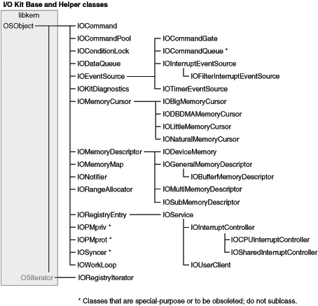

> 导航：[总目录](../../../README.md) · [documentation](../../../_indexes/documentation.md) · [IOKit Fundamentals](Introduction%20to%20I-O%20Kit%20Fundamentals.md)

[Next](Bibliography.md)[Previous](Managing%20Device%20Removal.md)

# Base and Helper Class Hierarchy

The following chart presents the class hierarchy of all I/O Kit classes that are not members of a specific family. See the preceding appendix, [I/O Kit Family Reference](I-O%20Kit%20Family%20Reference.md#apple-f4xwc4dqnrsv64tfmyxwi33df52wszbpkridambqgaydemjnijaueq2dijeuu) for the class hierarchy charts of most families.

[Next](Bibliography.md)[Previous](Managing%20Device%20Removal.md)

