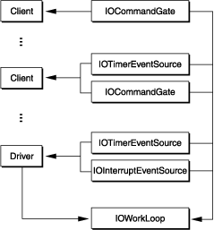
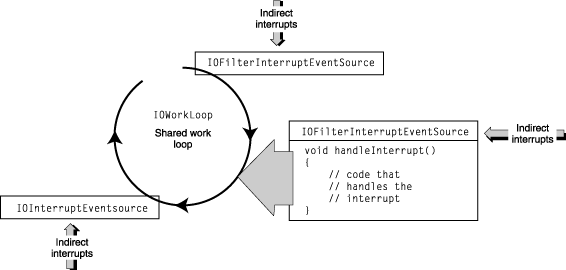

> 导航：[总目录](../../../README.md) · [documentation](../../../_indexes/documentation.md) · [IOKit Fundamentals](Introduction%20to%20I-O%20Kit%20Fundamentals.md)


[Next](Managing%20Data.md)[Previous](I-O%20Kit%20Families.md)

# Handling Events

A device driver works in perhaps the most chaotic of environments within an operating system. Many devices require a sequence of commands to perform a single I/O operation. However, multiple threads can enter the driver’s code at any place and at any time, whether through client I/O requests, hardware interrupts, or timeout events; on a multiprocessor system, threads can even be running concurrently. The driver must be prepared to handle them all.

This flurry of incoming threads, each with its own event, poses some problems for a driver. The driver needs a way to protect its data structures from access by different threads because such simultaneous access can lead to data corruption, or worse. It needs to guarantee exclusive access to a thread for any single command or operation that must complete in order to preserve the integrity of the driver’s data, or to prevent a deadlock or race condition. In the I/O Kit, this protection is provided by the `IOWorkLoop` class and its attendant event-source classes.

An `IOWorkLoop` object (or simply, a work loop) is primarily a gating mechanism that ensures single-threaded access to the data structures used by hardware. For some event contexts, a work loop is also a thread. In essence, a work loop is a mutually exclusive (mutex) lock associated with a thread. It does several things:

- Its gating mechanism synchronizes the actions among event sources.
- It provides a stackable environment for event handling.
- It spawns a dedicated thread for the completion of indirect interrupts delivered by the interrupt controller. This mechanism serializes interrupt handling for the work loop’s driver, preventing simultaneous access to driver data by multiple interrupts.

To put the role of the work loop in perspective, it helps first to consider the event sources that it is designed for. In the I/O Kit there are five broad categories of asynchronous events:

- Interrupt events—indirect (secondary) interrupts originating from devices
- Timer events—events delivered periodically by timers, such as timeouts
- I/O commands—I/O requests issued by driver clients to their providers
- Power events—typically generated through calls down the driver stack
- Structural events—typically events involving the I/O Registry

The I/O Kit provides classes to handle these event sources: `IOInterruptEventSource`, `IOTimerEventSource`, and `IOCommandGate`. (You handle power and structural events using the mechanism provided by `IOCommandGate` objects.) Each of the event-source classes defines a mechanism specific to an event type for invoking a single function within the protected context of the work loop. If a thread carrying an event needs access to a driver’s critical data, it must do so through an object of one of these classes.

Generally, client drivers set up their work loops, event sources, and event handlers in their `start` function. In order to avoid deadlocks and race conditions, all code that accesses the same data should share a single work loop, registering their event sources with it so that a single gating mechanism is used. Work loops can be safely shared among unrelated objects, of course, and often are shared by objects at different levels in a single driver stack. Work loops can also be dedicated for use by a particular driver and its clients. See [Shared and Dedicated Work Loops](#apple-f4xwc4dqnrsv64tfmyxwi33df52wszbpkridambqgaydcobnijauurcbijcuu) for more information.

The I/O Kit work-loop mechanism offers functionality roughly similar to that of the Vertical Retrace Manager, the Time Manager, and the Deferred Task Manager of Mac OS 9.

The I/O Kit’s work-loop mechanism mitigates the performance penalty exacted by context switching, a by-product of the underlying event-handling model commonly used in some operating systems. To guarantee a single-threaded context for event handling, this model completes everything on one thread. Unfortunately, the transfer of work to the thread requires a switch in the context of the event-bearing thread. More precisely, when this thread goes from a running context to a non-running context, its current register state must be saved. When the secure thread completes its work, the state of the originating thread is restored and control branches back to the function originally referenced by the thread. This switching back and forth between thread contexts consumes cycles.

The work-loop model works quite differently for I/O commands and timer events. In these instances, the thread of the respective event source simply grabs the mutex lock held by the work loop. No other event from any source can be processed until the `Action` routine for the current event returns. Although the lock is mutually exclusive, it doesn’t prevent reentrancy. Also, you can have multiple work loops in the same driver stack, and this increases the possibility of deadlock. However, work loops do avoid self-deadlocks because they are based on a recursive lock: They always check to see if they are the thread that currently own the lock.

The way the I/O Kit manages interrupt event sources does involve context switching. The completion routines for interrupts run on the work loop’s thread and not on the thread delivering the interrupt. Context switching is required in this case because the interrupt controller must immediately dispatch direct (primary) interrupts to other threads to run the completion routines for those interrupts. See [Handling Interrupts](#apple-f4xwc4dqnrsv64tfmyxwi33df52wszbpkridambqgaydcobnkrifqusfiyytanq) for more information.

Two factors influence the order in which a work loop queries its event sources for work. The relative priority of threads is the main determinant, with timers having the highest priority. A client thread can modify its own priority and thereby expedite the delivery of I/O requests (it might not affect how soon they are processed, however, because I/O requests are usually queued in FIFO order). For interrupt event sources, which also have a relatively high priority, the order in which they are added to the work loop determines the order in which they are queried for work. See [Handling Interrupts](#apple-f4xwc4dqnrsv64tfmyxwi33df52wszbpkridambqgaydcobnkrifqusfiyytanq) for further details.

Regardless of event source and mechanism, a work loop is primarily used for one thing: to run the completion or `Action` routines specified by the event source. It guarantees that the routine handling an event is the only one running at any given time. This aspect of work loops raises a design point. When a thread is running code to handle an event, other events can be asynchronously delivered to their event sources, but they cannot be processed until the handler returns. Therefore event handlers should not attempt to complete large chunks of work or do anything that might _block_ (that is, wait for some other process to complete), such as allocating memory or other resources. Instead they should, if possible, queue up the work or otherwise defer it for later processing.

All I/O Kit services can easily share their provider’s work loop. The base of the driver Registry, representing the logic board of the computer, always contains a work loop, so a driver is assured of having a work loop even if it doesn’t create one itself. All a driver needs to do is call the IOService function `getWorkLoop` to access its provider’s work loop.

In this way, an entire stack of driver objects, or a subset of such objects, can share one work loop. [Figure 7-1](#apple-f4xwc4dqnrsv64tfmyxwi33df52wszbpkridambqgaydcobninbuirkiizcee) shows how a work loop shared by multiple driver objects uses event sources to manage access to its gating mechanism.

__Figure 7-1__  Driver objects sharing a work loop



Most drivers won’t create their own work loop. If hardware doesn’t directly raise interrupts in your driver, or if interrupts rarely occur in your driver, then you don’t need your own work loop. However, a driver that takes direct interrupts—in other words, that interacts directly with the interrupt controller—should create its own dedicated work loop. Examples of such drivers are PCI controller drivers (or any similar driver with a provider class of IOPCIDevice) and RAID controller drivers. Even these work loops may be shared by the driver’s clients, however, so it’s important to realize that in either case, the driver must not assume that it has exclusive use of the work loop. This means that a driver should rarely enable or disable all events on its work loop, since doing so may affect other I/O Kit services using the work loop.

If a driver handles interrupts or for some other reason needs its own work loop, it should override the IOService function `getWorkLoop` to create a dedicated work loop, used by just the driver and its clients. If `getWorkLoop` isn’t overridden, a driver object gets the next work loop down in its stack.

To obtain a work loop for your client driver, you should usually use your provider’s work loop or, if necessary, create your own. To obtain your provider’s work loop, all you have to do is call the IOService function `getWorkLoop` and retain the returned object. Immediately after getting your work loop you should create your event sources and add them to the work loop (making sure they are enabled).

To create a dedicated work loop for your driver, override the `getWorkLoop` function. [Listing 7-1](#apple-f4xwc4dqnrsv64tfmyxwi33df52wszbpkridambqgaydcobnijauurccjfcuo) illustrates a thread-safe implementation of `getWorkLoop` that creates the work loop lazily and safely.

__Listing 7-1__  Creating a dedicated work loop

```
protected:
    IOWorkLoop *cntrlSync;/* Controllers Synchronizing context */
// ...
IOWorkLoop * AppleDeviceDriver::getWorkLoop()
{
    // Do we have a work loop already?, if so return it NOW.
    if ((vm_address_t) cntrlSync >> 1)
        return cntrlSync;

    if (OSCompareAndSwap(0, 1, (UInt32 *) &cntrlSync)) {
        // Construct the workloop and set the cntrlSync variable
        // to whatever the result is and return
        cntrlSync = IOWorkLoop::workLoop();
    }
    else while ((IOWorkLoop *) cntrlSync == (IOWorkLoop *) 1)
        // Spin around the cntrlSync variable until the
        // initialization finishes.
        thread_block(0);

    return cntrlSync;
}
```

This code first checks if `cntrlSync` is a valid memory address; if it is, a work loop already exists, so the code returns it. Then it tests to see if some other thread is trying to create a work loop by atomically trying to compare and swap the controller synchronizer variable from 0 to 1 (1 cannot be a valid address for a work loop). If no swap occurred, then some other thread is initializing the work loop and so the function waits for the `cntrlSync` variable to stop being 1. If the swap occurred then no work loop exists and no other thread is in the process of creating one. In this case, the function creates and returns the work loop, which unblocks any other threads that might be waiting.

As you would when getting a shared work loop, invoke `getWorkLoop` in `start` to get your work-loop object (and then retain it). After creating and initializing a work loop, you must create and add your event sources to it. See the following section for more on event sources in the I/O Kit.

A work loop can have any number of event sources added to it. An event source is an object that corresponds to a type of event that a device driver can be expected to handle; there are currently event sources for hardware interrupts, timer events, and I/O commands. The I/O Kit defines a class for each of these event types: `IOInterruptEventSource`, `IOTimerEventSource`, and `IOCommandGate`, respectively. Each of these classes directly inherits from the abstract class `IOEventSource`.

An event-source object acts as a queue for events arriving from a particular event source and hands off those events to the work-loop context when it asks them for work. When you create an event-source object, you specify a callback function (also known as an “action” function) to be invoked to handle the event. Similar to the Cocoa environment’s target/action mechanism, the I/O Kit stores as instance variables in an event source the target of the event (the driver object, usually) and the action to perform. The handler’s signature must conform to an `Action` prototype declared in the header file of the event-source class. As required, the work loop asks each of its event sources in turn (by invoking their `checkForWork` function) for events to process. If an event source has a queued event, the work loop runs the handler code for that event in its own protected context.  Note that when you register an event source with a work loop, the event source is provided with the work loop's signaling semaphore, which it uses to wake the work loop. (For more information on how the work loop sleeps and wakes, see the `threadMain` function in `IOWorkLoop` documentation.)

A client driver, in its activation phase (usually the `start` function), creates the event sources it needs and adds them to its work loop. The driver must also implement an event handler for each event source, ensuring that the function’s signature conforms to the `Action` function prototype defined for the event-source class. For performance reasons, the event handler should avoid doing anything that might block (such as allocating memory) and defer processing of large amounts of data. See [Work Loops](#apple-f4xwc4dqnrsv64tfmyxwi33df52wszbpkridambqgaydcobnijauursjinces) for further information on event priority and deferring work in event handlers.

The procedure for adding event sources to a work loop is similar for each type of event source. It involves four simple steps:

1. Obtain your work loop.
2. Create the event-source object.
3. Add the object to the work loop.
4. Enable the event source.

Disposing of an event source also has a common procedural pattern:

1. Disable the event source.
2. Remove it from the work loop.
3. Release the event source.

The following sections discuss the particulars of each event source and give examples specific to each kind.

Interrupts are typically the most important type of event that drivers handle. They are the way that devices attached to a computer inform the operating system that an asynchronous action has occurred and that, consequently, they have some data. For example, when the user moves a mouse or plugs a Zip drive into a USB port, a hardware interrupt is generated and the affected driver is notified of this event. This section discusses interrupt handling in the I/O Kit, with particular attention to the role played by objects of `IOInterruptEventSource` and its subclasses.

The I/O Kit’s model for interrupt handling does not conform to the standard UNIX model. I/O Kit drivers nearly always work in the indirect-interrupt context instead of dealing with direct interrupts, as does the UNIX model. Indirect interrupts are less restrictive and permit the Mach scheduler to do its job. (Indirect interrupts are sometimes known as secondary interrupts and direct interrupts as primary interrupts.) The difference between the two types of interrupts has to do with the context in which the interrupt is dealt with.

Two types of events trigger an interrupt: 

- Command-based events, such as incoming networking packets and reads of storage media
- Asynchronous events, such as keyboard presses

When an interrupt occurs, a specific interrupt line is set and, once the interrupted thread finishes the current instruction, control branches to the interrupt controller registered with the Platform Expert. When the interrupt controller receives the interrupt, its thread becomes that of the direct (primary) interrupt. There is typically only one direct interrupt in the system at any one time, and the direct-interrupt context has the highest priority in the system. The following list indicates the relative priorities of threads in the system:

1. Direct interrupt
2. Timers and page-out
3. Real time (multimedia)
4. Indirect interrupts (drivers)
5. Window Manager
6. User threads (including I/O requests)

Because of its extremely high priority, the direct-interrupt context has a design responsibility to hand off the interrupt to lower-priority threads as soon as possible. The interrupt controller must decode why the interrupt was taken, assign it to the appropriate driver object, and return.

In the direct-interrupt model, the target driver assumes the context carrying the direct interrupt. It must handle the interrupt in this highest-priority context. The problem with direct interrupts is that they can be neither lowered in priority nor preempted. All other interrupts are effectively disabled until the current interrupt is handled. Direct interrupts especially don’t scale well in the OS X multiprocessing environment.

With indirect interrupts, the interrupt controller dispatches the interrupt it reads off the interrupt line to the appropriate interrupt event-source object of the target driver, effectively causing it to schedule on the driver’s work-loop thread. The completion (or `Action`) routine defined by the event source is then run on the work-loop thread to handle the interrupt. The priority of the work-loop thread, although high compared to most client threads, is lower than the thread carrying the direct interrupt. Thus the completion routine running in the work-loop thread can be preempted by another direct interrupt.

The I/O Kit does not prohibit access to the direct-interrupt context, and in fact provides a separate programming interface for this purpose (see [Using Interrupt Handlers With No Work Loops](#apple-f4xwc4dqnrsv64tfmyxwi33df52wszbpkridambqgaydcobnijauuqsfizeuq)). However, use of direct interrupts is strongly discouraged.

A work loop can have several `IOInterruptEventSource` objects attached to it. The order in which these objects are added to the work loop (through `IOWorkLoop`’s `addEventSource` function) determines the general order in which interrupts from different sources are handled.

[Figure 7-2](#apple-f4xwc4dqnrsv64tfmyxwi33df52wszbpkridambqgaydcobnijauuqsfjfdei) illustrates some of these concepts. It shows events originating from different sources being delivered to the corresponding event-source objects “attached” to the work loop. As with any event-source object, each interrupt event source acts as a queue for events of that type; when there is an event in the queue, the object signals the work loop that it has work for it. The work loop (that is, the dedicated thread) awakes and queries each installed event source in turn. If an event source has work, the work loop runs the completion routine for the event (in this case, an interrupt) in its own protected thread. The previous thread—the client thread running the event-source code—is blocked until the routine finishes processing the event. Then the work loop moves to the next interrupt event source and, if there is work, runs the completion routine for that interrupt in its protected context. When there is no more work to do, the work loop sleeps.

__Figure 7-2__  A work loop and its event sources



Remember that the order in which you add interrupt event sources to a work loop determines the order of handling for specific interrupt events. 

A driver typically creates an interrupt event-source object—generally of the `IOInterruptEventSource` or `IOFilterInterruptEventSource` class—in its `start` function by calling the factory creation method for the class (for example, `interruptEventSource`). This method specifies the driver itself as a target and identifies an action member function (conforming to the `Action` type defined for the event-source class) to be invoked as the completion routine for the event source. The factory method also associates the driver with a provider that deals with the hardware interrupt facility (usually a nub such as an IOPCIDevice). The driver then registers the event source with the work loop through `IOWorkLoop`’s `addEventSource` function.

[Listing 7-2](#apple-f4xwc4dqnrsv64tfmyxwi33df52wszbpkridambqgaydcobnijauurscjbfem) provides an example for setting up an interrupt event source.

__Listing 7-2__  Adding an interrupt event source to a work loop

```swift
myWorkLoop = (IOWorkLoop *)getWorkLoop();

interruptSource = IOInterruptEventSource::interruptEventSource(this,
    (IOInterruptEventAction)&MyDriver::interruptOccurred,
    provider);

if (!interruptSource) {
    IOLog("%s: Failed to create interrupt event source!\n", getName());
    // Handle error (typically by returning a failure result).
    }

if (myWorkLoop->addEventSource(interruptSource) != kIOReturnSuccess) {
    IOLog("%s: Failed to add interrupt event source to work loop!\n",
        getName());
    // Handle error (typically by returning a failure result).
}
```

In this example, if you do not specify a provider in the `interruptEventSource` call, the event source assumes that the client will call `IOInterruptEventSource`’s `interruptOccurred` method explicitly. Invocation of this function causes the safe delivery of asynchronous events to the driver’s `IOInterruptEventSource`.

Events originating from direct interrupts are handled within the work loop’s thread, which should never block indefinitely. This specifically means that the completion routines that handle interrupts, and any function they invoke, must not allocate memory or create objects, as allocation can block for unbounded periods of time.

You destroy an interrupt event source in a driver’s deactivation function (usually `stop`). Before you release the `IOInterruptEventSource` object, you should disable it and then remove it from the work loop. [Listing 7-3](#apple-f4xwc4dqnrsv64tfmyxwi33df52wszbpkridambqgaydcobnijauursci5dec) gives an example of how to do this.

__Listing 7-3__  Disposing of an `IOInterruptEventSource` object


```swift
if (interruptSource) {
    interruptSource->disable();
    myWorkLoop->removeEventSource(interruptSource);
    interruptSource->release();
    interruptSource = 0;
}
```


The I/O Kit supports shared interrupts, where drivers share a single interrupt line. For this purpose it defines the `IOFilterInterruptEventSource` class, a subclass of `IOInterruptEventSource`. Apple highly recommends that third-party device driver writers base their interrupt event sources on the `IOFilterInterruptEventSource` class instead of the `IOInterruptEventSource` class. The latter class does not ensure that the sharing of interrupt lines is safe.

The `IOFilterInterruptEventSource` class follows the same model as its superclass except that it defines, in addition to the `Action` completion routine, a special callback function. When an interrupt occurs the interrupt invokes this function for each driver sharing the interrupt line. In this function, the driver responds by indicating whether the interrupt is something that it should handle.

[Listing 7-4](#apple-f4xwc4dqnrsv64tfmyxwi33df52wszbpkridambqgaydcobninfeeskhinbuq) shows how to set up and use an `IOFilterInterruptEventSource`.

__Listing 7-4__  Setting up an IOFilterInterruptEventSource

```swift
bool myDriver::start(IOService * provider)
{
    // stuff happens here

    IOWorkLoop * myWorkLoop = (IOWorkLoop *) getWorkLoop();
    if (!myWorkLoop)
        return false;

    // Create and register an interrupt event source. The provider will
    // take care of the low-level interrupt registration stuff.
    //
    interruptSrc =
        IOFilterInterruptEventSource::filterInterruptEventSource(this,
                    (IOInterruptEventAction) &myDriver::interruptOccurred,
                    (IOFilterInterruptAction) &myDriver::checkForInterrupt,
                    provider);
    if (myWorkLoop->addEventSource(interruptSrc) != kIOReturnSuccess) {
        IOLog("%s: Failed to add FIES to work loop.\n", getName());
    }
    // and more stuff here...
}


bool myDriver::checkForInterrupt(IOFilterInterruptEventSource * src)
{
    // check if this interrupt belongs to me

    return true; // go ahead and invoke completion routine
}


void myDriver::interruptOccurred(IOInterruptEventSource * src, int cnt)
{
    // handle the interrupt
}
```

If your filter routine (the `checkForInterrupt` routine in [Listing 7-4](#apple-f4xwc4dqnrsv64tfmyxwi33df52wszbpkridambqgaydcobninfeeskhinbuq)) returns `true`, the I/O Kit will automatically start your interrupt handler routine on your work loop. The interrupt will remain disabled in hardware until your interrupt service routine (`interruptOccurred` in [Listing 7-4](#apple-f4xwc4dqnrsv64tfmyxwi33df52wszbpkridambqgaydcobninfeeskhinbuq)) completes.

The IOService class provides member functions for registering interrupt handlers that operate outside of the work-loop mechanism. These handlers can be invoked in a direct interrupt context and must call the interrupt management code of a provider such as an IOPCIDevice nub. Only one handler can be installed per interrupt source. It must be prepared to create and run its own threads and do its own locking.

Few drivers need to use interrupt handlers that are created and controlled in this way. One example where such an interrupt handler is justified is a multifunction card that needs to route direct interrupts to drivers. If you take this course, be careful. Very few system APIs are safe to call in the direct-interrupt context.

More information on this subject is forthcoming. 

Device drivers occasionally need to set timers, usually to implement a timeout so the driver can determine if an I/O request doesn’t complete within a reasonable period. The `IOTimerEventSource` class is designed for that purpose.

A driver creates an `IOTimerEventSource` with a callback `Action` function and a time at which to invoke that function, and then registers it with the work loop to run on. When the timeout passes, the event source is scheduled with the work loop. When the work loop queries it for work, the event source closes the work-loop gate (by taking the work loop’s lock), invokes the callback function, and then releases the work-loop lock to open the gate. [Listing 7-5](#apple-f4xwc4dqnrsv64tfmyxwi33df52wszbpkridambqgaydcobnijauurshjjdum) show how to create and register a timer event source.

__Listing 7-5__  Creating and registering a timer event source

```swift
myWorkLoop = (IOWorkLoop *)getWorkLoop();

timerSource = IOTimerEventSource::timerEventSource(this,
    (IOTimerEventSource::Action)&MyDriver::timeoutOccurred);

if (!timerSource) {
    IOLog("%s: Failed to create timer event source!\n", getName());
    // Handle error (typically by returning a failure result).
    }

if (myWorkLoop->addEventSource(timerSource) != kIOReturnSuccess) {
    IOLog("%s: Failed to add timer event source to work loop!\n", getName());
    // Handle error (typically by returning a failure result).
}

timerSource->setTimeoutMS(MYDRIVER_TIMEOUT);
```

Often a driver wants to set the timer and issue an I/O request at the same time. If the I/O request completes before the timer event is triggered, the driver should cancel the timer immediately. If a timer event is triggered first, the driver typically reissues the time-out I/O request (at which time it resets the timer).

If you want the timer event to be recurrent, you should reset the timer to the desired interval in the `Action` handler. The `IOTimerEventSource` class does not have a mechanism for setting periodic timers. The class does provide a few functions for setting relative and absolute timer intervals at various granularities (nanoseconds, microseconds, and so on). The code fragment in [Listing 7-5](#apple-f4xwc4dqnrsv64tfmyxwi33df52wszbpkridambqgaydcobnijauurshjjdum) uses `setTimeoutMS` to set the timer with a specific time-out millisecond interval.

Events originating from timers are handled by the driver’s `Action` routine. As with other event handlers, this routine should never block indefinitely. This specifically means that timer handlers, and any function they invoke, must not allocate memory or create objects, as allocation can block for unbounded periods of time.

To dispose of a timer event source, you should cancel the pending timer event before removing the event source from the work loop and releasing it. [Listing 7-6](#apple-f4xwc4dqnrsv64tfmyxwi33df52wszbpkridambqgaydcobnijauuq2hijcui) illustrates how you might do this in your driver’s deactivation function.

__Listing 7-6__  Disposing of a timer event source

```swift
if (timerSource) {
    timerSource->cancelTimeout();
    myWorkLoop->removeEventSource(timerSource);
    timerSource->release();
    timerSource = 0;
}
```


Driver clients use `IOCommandGate` objects to issue I/O requests to a driver. A command gate controls access to the work-loop lock, and in this way it serializes access to the data involved in I/O requests. It does not require a thread context switch to ensure single-threaded access. An `IOCommandGate` event source simply takes the work-loop lock before it runs its `Action` routine; by doing so, it prevents other event sources on the same work loop from scheduling. This makes it an efficient mechanism for I/O transfers.

Note that nub classes usually define `Action` functions for their own clients to use, so that driver classes don’t have to use command gates themselves.

Calls originated by clients through a command gate are known as down calls. These always originate in a thread other than the work loop’s context, and so they may safely block without causing a deadlock (as long as they don’t hold the work-loop gate). All allocation should occur on the down-call side of an I/O request before the command gate is closed.

Up calls, which are originated by an interrupt or timer event, occur within the work loop’s context and should never block indefinitely. This specifically means that interrupt and timeout handlers, and any function they invoke, must not allocate memory or create objects, as allocation can block and, as a potential consequence, cause a paging deadlock.

It’s possible for an up call to result in a client notification that immediately results in another I/O request through the command gate. A work loop can handle recursive closing of its gate by the same thread, so this situation never results in deadlock. However, because the new request is occurring on the context of an up call, that request cannot block; this concern belongs to the system client making the I/O request, though, so you need never worry about this as a driver developer.

Prior to closing a command gate, you should adequately prepare the I/O request. An I/O request involves three things: the command itself (which is family-specific), the memory involved in the transfer (defined as an IOMemoryDescriptor object), and the function to call to process the request within the context of the command gate. See [Managing Data](Managing%20Data.md#apple-f4xwc4dqnrsv64tfmyxwi33df52wszbpkridambqgaydcojnijbusrshi5bes) for information on IOMemoryDescriptors and related objects.

Command gates should be closed for the briefest possible period, during which the least amount of work possible is performed. The longer a command gate holds the work-loop lock, the greater the likelihood of contention. As with all event sources, the command-gate function should not allocate memory or any other unbounded resource because of the danger of blocking. Instead, the client should preallocate the required resources before control is transferred to the work-loop context. For example, it could allocate a pool of resources in its `start` function.

You create an `IOCommandGate` object by calling the `commandGate` factory method, specifying as parameters the object “owner” of the event source (usually `this`) and a pointer to a function conforming to the `Action` prototype. You then register the command gate with the client’s work loop using `IOWorkLoop`’s `addEventSource` function. [Listing 7-7](#apple-f4xwc4dqnrsv64tfmyxwi33df52wszbpkridambqgaydcobnijauurkdjbcug) gives an example of this procedure.

__Listing 7-7__  Creating and registering a command gate

```swift
workLoop = (IOWorkLoop *)getWorkLoop();
commandGate = IOCommandGate::commandGate(this,
                 (IOCommandGate::Action)receiveMsg);
if (!commandGate ||
    (workLoop->addEventSource(commandGate) != kIOReturnSuccess) ) {
    kprintf("can't create or add commandGate\n");
    return false;
}
```

The `IOCommandGate` class provides two alternatives for initiating the execution of an I/O request within the command gate. One is the `runCommand` member function and the other is the `runAction` member function. These functions work similarly. When the client wishes to invoke the `Action` function, rather than invoking it directly, it invokes the command gate’s `runCommand` or `runAction` function, passing in all required arguments. The command gate then grabs the work-loop lock (that is, it closes the command gate), invokes the `Action` function, and then opens the gate.

Where the two functions differ is in their flexibility. The `runCommand` function makes use of the same target/action mechanism used by the other event-source classes. In this mechanism, the created `IOCommandGate` object encapsulates (a pointer to) an `Action` function as well as the target (or “owner”) object that implements this function. In this model, only one `Action` function can be invoked for an I/O request.

However, a driver often has to deal with multiple sources of I/O requests. If this is the case, you can use the `runAction` function to issue I/O requests in multiple command gates. This function lets you define the function to be called within the command-gate context; you must specify a pointer to this function as the first parameter.

[Listing 7-8](#apple-f4xwc4dqnrsv64tfmyxwi33df52wszbpkridambqgaydcobnijauursfirfei) illustrates one the use of the `runCommand` function to issue an I/O request.

__Listing 7-8__  Issuing an I/O request through the command gate


```swift
void ApplePMU::enqueueCommand ( PMUrequest * request )
{
    commandGate->runCommand(request);
}

void receiveMsg ( OSObject * theDriver, void * newRequest, void *, void *, void * )
{
    ApplePMU * PMUdriver = (ApplePMU *) theDriver;
    PMUrequest * theRequest = (PMUrequest*)newRequest;

    // Inserts the request in the queue:
    theRequest->prev = PMUdriver->queueTail;
    theRequest->next = NULL;
    if ( PMUdriver->queueTail != NULL ) {
        PMUdriver->queueTail->next = theRequest;
    }
    else {
        PMUdriver->queueHead = theRequest;
    }
    PMUdriver->queueTail =  theRequest;

    // If we can, we process the next request in the queue:
    if ( (PMUdriver->PGE_ISR_state == kPMUidle) && !PMUdriver->adb_reading) {
        PMUdriver->CheckRequestQueue();
    }
}
```

In this example, the `runCommand` function is used to indirectly invoke the command gate’s `Action` function, `receiveMsg`. One important tactic that this example shows is how to defer processing I/O requests—when allocation of memory and other resources might be necessary—until no more events are queued at the command gate. The `receiveMsg` function queues up each incoming request and, if no more requests are pending, calls a `CheckRequestQueue` function to do the actual I/O work.

A typical procedure is to set a timeout (using an `IOTimerEventSource` object) at the same time you issue an I/O request. If the I/O request does not complete within a reasonable period, the timer is triggered, giving you the opportunity to correct any problem (if possible) and reissue the I/O request. If the I/O request is successful, remember to disable the timer. See [Handling Timer Events](#apple-f4xwc4dqnrsv64tfmyxwi33df52wszbpkridambqgaydcobnkrifqusfiyytamy) for details on using `IOTimerEventSource` objects.

You destroy an command-gate event source in a driver’s deactivation function (usually `stop`). Before you release the `IOCommandGate` object, you should remove it from the work loop. [Listing 7-9](#apple-f4xwc4dqnrsv64tfmyxwi33df52wszbpkridambqgaydcobninfeercbindue) gives an example of how to do this.

__Listing 7-9__  Disposing of an `IOCommandGate` object


```swift
if (commandGate) {
    myWorkLoop->removeEventSource(commandGate);
    commandGate->release();
    commandGate = 0;
}
```

[Next](Managing%20Data.md)[Previous](I-O%20Kit%20Families.md)

