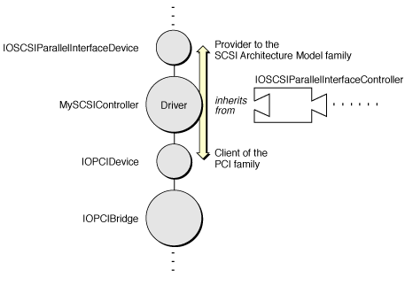
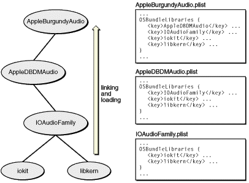

> 导航：[总目录](../../../README.md) · [documentation](../../../_indexes/documentation.md) · [IOKit Fundamentals](Introduction%20to%20I-O%20Kit%20Fundamentals.md)


[Next](Handling%20Events.md)[Previous](The%20Base%20Classes.md)

# I/O Kit Families

In the I/O Kit, families are collections of classes that define and implement the abstractions common to all devices of a particular type. They provide the programmatic interfaces and generic support code for developing drivers that are members (providers) or clients of such families.

This chapter describes a number of concepts related to I/O Kit families:

- The relation of drivers to families
- Families as libraries, including the versioning and loading of libraries
- The programmatic structure of families and naming conventions

In addition, this chapter offers some tips for those who want to write their own I/O Kit families. For a reference to the current set of the I/O Kit families provided by Apple, see the appendix [I/O Kit Family Reference](I-O%20Kit%20Family%20Reference.md#apple-f4xwc4dqnrsv64tfmyxwi33df52wszbpkridambqgaydemjnijaueq2dijeuu)

An I/O Kit family is a library that implements some bus protocol (for example, PCI or USB) or some common set of services. But the support that a family provides is generic. A family does not include any of the details for getting at hardware because it cannot make assumptions about the specific hardware under the general layer it represents. It’s the driver writer’s responsibility to write code that bridges between the concrete and the abstract—that is, between the hardware and the abstraction defined by the family. A driver must extend a family to support specific hardware or to acquire specific features.

Take the SCSI Parallel family as an example. The SCSI Parallel family encapsulates the SCSI Parallel Interface-5 specification, which is well-defined. One of the things the specification describes is how to go about scanning the bus and detecting devices. Because this is an expensive operation, many SCSI Parallel controllers include firmware that can cache information about detected devices. To take advantage of this caching optimization, you could design your controller driver—member of the SCSI Parallel family—so that it overrides the scanning functionality to interact with the firmware.

Families commonly perform certain generic tasks, such as scanning buses, querying clients, queuing and validating commands, recovering from errors, and matching and loading drivers. Drivers do the tasks that impinge on hardware in some way. To continue with the example of the SCSI Parallel family, the primary job of the SCSI Parallel controller driver, as member of the SCSI Parallel family, is to receive SCSI commands from its family, execute each command on the hardware, and send a notification when the command completes.

Some I/O Kit families are clearly delimited by the specifications they encapsulate. Other families, such as the Audio family, are not as easily defined because there is no single specification prescribing what the family should include. In cases such as these, Apple carefully chose the set of abstractions to incorporate in the family to make it flexible and comprehensive enough. All families must advertise their capabilities and it is up to the higher levels of the driver stack to manage these capabilities.

A driver is both a provider and a client in its relationships to I/O Kit families. A driver that is a provider for a family (through its nub) is also a member of that family; it should inherit from a particular class in the family that describes the service it exports (however augmented). On the other hand, a driver is a client of the family whose service it imports (through a nub of the family). For example, a SCSI disk driver would inherit from the storage family rather than the SCSI Parallel family, to which it would be a client (see [Figure 6-1](#apple-f4xwc4dqnrsv64tfmyxwi33df52wszbpkridambqgaydcnznijauurkjijces)). A USB mouse driver would inherit from the HID (Human Interface Devices) family and would be a client of the USB family. A PCI Audio card driver would inherit from the Audio family and would be a client of the PCI family.

__Figure 6-1__  A driver’s relationships with I/O Kit families



Families are implemented as libraries packaged as kernel extensions (KEXTs). They specify their defining attributes in an information property list and are installed in `/System/Library/Extensions`. Families are, mechanically, little different than ordinary drivers.

Two related characteristics distinguish a family from a driver. First, a driver expresses a dependency on a family using the `OSBundleLibraries` property; second, a family is loaded only as a byproduct of a driver listing it as a library. A driver specifies the libraries on which it depends as elements of the `OSBundleLibraries` dictionary. The I/O Kit guarantees that these libraries will be loaded into the kernel before it loads the driver and links it with its families. Note that libraries themselves declare the libraries (kernel extensions and the kernel itself) on which they depend using the `OSBundleLibraries` property.

You specify a library as a key-value pair in the `OSBundleLibraries` dictionary where the key is the bundle identifier (`CFBundleIdentifier`) of the library and the value is the earliest version of the library that the driver is compatible with. All versions are expressed in the `'vers'` resource style. [Listing 6-1](#apple-f4xwc4dqnrsv64tfmyxwi33df52wszbpkridambqgaydcnznijauurscijcus) gives an example from the information property list of the AppleUSBAudio driver.

__Listing 6-1__  The OSBundleLibraries property

```
<key>OSBundleLibraries</key>
    <dict>
        <key>com.apple.iokit.IOAudioFamily</key>
        <string>1.0.0</string>
        <key>com.apple.iokit.IOUSBFamily</key>
        <string>1.8</string>
    </dict>
```

Although the I/O Kit loads the libraries before it loads the driver that specifies these dependencies, and loads libraries in proper dependency order, there is no guarantee about the order in which it loads libraries that have no interdependencies.

Generally, developers should declare dependencies for their device driver or any other kernel extension. (If the KEXT doesn’t have an executable, dependency declaration is unnecessary.) What dependencies they need to declare depends on which symbols need to get resolved. If you include a header file of a family or other library, or if a header indirectly ends up including a library, you should declare that dependency. If you unsure whether a dependency exists, declare it anyway.

To be available for loading and linking into the kernel, a family or other library has to declare its compatibility information using two properties: `CFBundleVersion` and `OSBundleCompatibleVersion`. The `CFBundleVersion` property defines the forward limit of compatibility—that is, the current version. The `OSBundleCompatibleVersion` property defines the backward limit of compatibility by identifying the last `CFBundleVersion`-defined version of the library that broke binary compatibility with prior versions.

Every time you revise a driver or a family, you should increment your `CFBundleVersion` value appropriately. You reset the `OSBundleCompatibleVersion` value (to the current `CFBundleVersion`) only when the revision makes the binary incompatible with prior versions, as when you remove a function or other symbol, or change a class such that the vtable layout changes. If you are writing an I/O Kit family, make sure that you specify an `OSBundleCompatibleVersion` property for your library; otherwise, drivers and other kernel extensions cannot declare a dependency on it and thus cannot link against it.

For both drivers and families (and, indeed, all kernel extensions), make sure that you also set the version in the kernel module and that this value is equivalent to the `CFBundleVersion` in the information property list. You set the version in the executable through the `MODULE_VERSION` setting in Xcode, in the target’s Customized Settings list (you find this in the target’s Build view).

The KEXT manager functions as the kernel loader and linker. At boot time or whenever the system detects a newly attached device, the I/O Kit kicks off the matching process to find a suitable driver for a device. When such a driver is found, it is the KEXT manager’s job to load the driver into the kernel and link it with the libraries on which it depends.

But before it can do this, the KEXT manager must ensure that those libraries, and all the other libraries on which those libraries depend, are loaded first. To do this, the manager builds a dependency tree of all libraries and other kernel modules required for the driver. It builds this tree using the contents of the `OSBundleLibraries` property, first of the driver and then of each required library.

After it builds the dependency tree, the KEXT manager checks if the libraries that are the most remote from the driver in the tree are already loaded. If any of these libraries is not loaded, the manager loads it and calls its start routine (the routine varies according to type of KEXT). It then proceeds up the dependency tree in similar fashion—linking, loading, and starting—until all required libraries have been linked and loaded. See [Figure 6-2](#apple-f4xwc4dqnrsv64tfmyxwi33df52wszbpkridambqgaydcnznijauuqskiveek) for an illustration of this procedure.

__Figure 6-2__  OSBundleLibraries and the dependency tree



If the KEXT manager encounters a problem initializing a library, or it doesn’t find a library with a compatible version (based on the value of `OSBundleCompatibleVersion`), it stops and (usually) returns a failure code. The modules already loaded stay loaded for awhile. Generally, unloading of modules does not happen immediately when they are not used. The I/O Kit includes a feature that tracks idle time and unloads modules after a certain period of idleness.

Although I/O Kit families tend to be quite different from each other, they have some structural elements in common. First, IOService is the common superclass for all I/O Kit families; at least one important class in each family, and possibly more, inherits from IOService (see [The I/O Kit Base Classes](The%20Base%20Classes.md#apple-f4xwc4dqnrsv64tfmyxwi33df52wszbpkridambqgaydcnrnijauurkfi5aum) for more information). And each family has one or more classes that present an interface to drivers.

A family typically defines two classes for drivers:

- A class describing the nub interface for drivers that are clients of the family
- A superclass for drivers that are members of the family, and thus providers to its nubs

In other words, I/O Kit families usually define an upward interface and a downward interface. These interfaces are required for the layering of driver objects involved in an I/O connection. The upward interface—the nub interface—presents to the rest of the system the hardware abstractions and rule definitions encapsulated by the family. The downward interface provides the subclassing interface for member drivers. Together, the interfaces define the up calls into the family and the down calls that member drivers are expected to make.

In addition to these two classes, families typically define a number of utility classes and support classes. The appendix [I/O Kit Family Reference](I-O%20Kit%20Family%20Reference.md#apple-f4xwc4dqnrsv64tfmyxwi33df52wszbpkridambqgaydemjnijaueq2dijeuu) describes some of these classes.

Some families specify subclasses for particular varieties of client or member drivers. The Storage family, for example, defines a generic block storage class for nub objects (IOBlockStorageDevice) and then also provides specific subclasses for certain varieties: IOCDBlockStorageDevice and IODVDBlockStorageDevice. In addition, families can include classes for device interfaces (as subclasses of IOUserClient) as well as commands specific to the family (as subclasses of IOCommand). Families can also have various helper classes and header files for family-specific type definitions.

Some families do not include a public nub or provider class for drivers when there is little need for such drivers. And Apple has not provided families for all types of hardware. If you find that the I/O Kit does not have a family or interface for your needs, you can always create a driver that inherits directly from IOService. Such “family-less” drivers are sometimes necessary if the potential applications for the driver are few. They must incorporate the abstractions and range of functionality found in families as well as the hardware-specific code typical of drivers. Besides directly inheriting from IOService, family-less drivers frequently make use of the I/O Kit helper classes such as IOWorkLoop, the event-source classes, IOMemoryCursor, and IOMemoryDescriptor.

Generally, Apple’s position on class naming within families is that the name should indicate what the class represents. Often, this name is dictated by the specification for the hardware. For example, the PCI family defines the IOPCIBridge class for drivers that are providers for the family. The reason for this name is simple: the PCI bridge (as the specification makes clear) is what the PCI controller drivers control. When there is no clear naming precedent for a family’s classes, the I/O Kit follows a naming convention of IO_FamilyName_Device for nub (client) classes and IO_FamilyName_Controller for provider classes.

If you are writing your own I/O Kit family, Apple recommends that you follow the same naming guidelines for your classes. And there are a few other general naming conventions to be aware of. Each class, function, type, and so on should have prefix that designates the vendor writing the software. Be sure not to use any of the prefixes that Apple reserves for itself ([Table 6-1](#apple-f4xwc4dqnrsv64tfmyxwi33df52wszbpkridambqgaydcnznijauuq2hivaum)).

__Table 6-1__  API prefixes reserved by Apple

| Prefix | Meaning |
| OS, os | libkern or other kernel service |
| IO, io | I/O Kit or I/O Kit family |
| MK, mk, mach_ | Mach kernel |
| Apple, APPLE, apple, AAPL, aapl, com_apple_ | Apple hardware support (for example, Apple-provided drivers) |

In addition, private, internal symbols should have an underscore “_” prefix, following the convention used by Apple. Do not access these private APIs from a KEXT. As with drivers, use of reverse DNS notation (substituting underscores for periods) is highly recommended to avoid naming conflicts.

There might be occasions when you deem it worthwhile to write your own I/O Kit family. Usually this happens when there is a standard or protocol for which no family exists, and you discern a need for interoperability among drivers for devices based on this protocol or standard. An example might be the IEEE488 standard for plotters and lab equipment.

If you decide to implement a family, here are a few guidelines to help you:

- At the beginning, write the family and driver code together; don’t worry yet about the division of functionality and interface between driver and family. Just concentrate on coming up with a good object-oriented design, determining what objects are necessary and what relationships they should have.
- After you have a working driver and have solved the stack for a particular device, separate the family code from the hardware-specific code. One approach that might be useful for locating family-generic code, especially for complex families, is to write two or more drivers for different hardware and then abstract away the common code.
- Define what the family’s nub objects look like to drivers—that is, the APIs your clients will see. To do this, look at the specification and encapsulate the important features (it’s not necessary to include rarely or never-used features). Keep in mind that the nubs of most families do very little. Most often they encapsulate addressing and arbitration details.
- Define the superclass for drivers that will be members of your family.
- Keep the layering separation of a family airtight. A family should not include headers from any other family or driver and should not define the superclass of clients.

There can also be situations that might call for the creation of a “superfamily”: a family that extends an existing family in a way similar to a subclass, but with a big difference; its aim is generality rather than specificity. Third-party vendors might want to have a superfamily to contain the code common to drivers based on different bus protocols. This would eliminate the need to load code that isn’t needed. For example, a mouse vendor might have a driver capable of driving both USB and ADB mice. If a system requires a USB mouse, you don’t want to have the ADB-specific code loaded as well. Thus the vendor might write a superfamily that acts as a service library; it would separate out the layers of code specific to a bus protocol into subfamilies and put the remaining code into the superfamily. Only the code specific to the currently used bus would be loaded.

[Next](Handling%20Events.md)[Previous](The%20Base%20Classes.md)

