> 导航：[总目录](../../../README.md) · [documentation](../../../_indexes/documentation.md) · [IOKit Fundamentals](Introduction%20to%20I-O%20Kit%20Fundamentals.md)


[Next](Document%20Revision%20History.md)[Previous](Glossary.md)

# I/O Kit Family Reference

This appendix describes each of the I/O Kit families in detail, paying particular attention to client/provider relationships. For most families, it provides a class hierarchy chart. It also tells you if a family exports a device interface, thereby allowing applications to access devices represented by the family. You should seriously consider taking the device-interface approach before attempting to write a kernel-resident driver. For information on using device interfaces, see the document _[Accessing Hardware From Applications](../Accessing%20Hardware%20From%20Applications/Introduction%20to%20Accessing%20Hardware%20From%20Applications.md#apple-f4xwc4dqnrsv64tfmyxwi33df52wszbpkridgmbqgaydgnzw)_.

Some categories of devices are not currently supported by an I/O Kit family. If your device falls into an unsupported category, you might be able to write a “family-less” driver, use an SDK other than the I/O Kit, or create a new family. See [Devices Without I/O Kit Families](#apple-f4xwc4dqnrsv64tfmyxwi33df52wszbpkridambqgaydemjnijauescji5dek) for details.

You may find it helpful to examine the source code for an I/O Kit family or a specific device driver. To do this, visit [Darwin Releases](http://www.opensource.apple.com/darwinsource/), select the appropriate version of OS X, and click Source to view the available source projects.

The ADB family provides support for, and access to, devices attached to the Apple Desktop Bus (ADB). It provides an abstraction for ADB bus controller drivers (IOADBController) and another for drivers of ADB devices (IOADBDevice).

__Bundle identifier__:

- `com.apple.iokit.IOADBFamily`

__Headers at:__

- Kernel resident: `Kernel.framework/Headers/IOKit/adb/`
- Device interface: `IOKit.framework/Headers/adb`

__References and specifications__:

- Technical note HW01 ([http://developer.apple.com/technotes/hw/hw_01.html](https://developer.apple.com/technotes/hw/hw_01.html))
- _Guide to the Macintosh Family Hardware_, second edition, Apple Computer.

__Class hierarchy:__

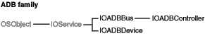

__Device Interface__:

- Exports an interface for reading and writing registers on ADB devices. The interface is defined in `IOADBLib.h`. Only polled mode operations are supported through this library. Interrupt operations are only supported for kernel-resident clients.

__Table A-1__  Clients and providers of the ADB family

|  | Client of the nub | Provider for the nub |
| __Action__ | Drives devices that plug into an ADB port. | Drives an ADB bus controller |
| __Example__ | A driver for an ADB mouse is a _client_ of the ADB family but is a _member_ of the HID family (in the IOHIPointing class). |  |
| __Classes__ | An instance of IOADBDevice matches your driver and loads it into the kernel. Your driver communicates with its family through an instance of IOADBDevice. | ADB bus controller drivers should inherit from the IOADBController class as defined in the header file `IOADBController.h` |
| __Notes__ | Common client families include the HID family (IOHIPointing and, IOHIKeyboard classes) and the Graphics family (IODisplay class). | All current ADB bus hardware produced by Apple is well supported by drivers that are included with OS X. Third-party developers should not need to write drivers for the ADB family, except for ADB-USB adaptors. |

The ATA and ATAPI family provides support for ATA controllers, and access to ATA and ATAPI devices on the ATA bus.

__Bundle identifier__:

- `com.apple.iokit.IOATAFamily`

__Headers in__:

- Kernel resident: `Kernel.framework/Headers/IOKit/ata`

__References and specifications__:

- American National Standards Institute (ANSI)—[http://www.ansi.org](http://www.ansi.org/)
- National Committee for Information Technology Standards (NCITS)—[http://www.ncits.org](http://www.ncits.org/)
- Technical Committee 13 (T13)—[http://www.t13.org](http://www.t13.org/)

__Class hierarchy__:

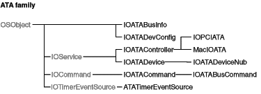

__Device interface__:

- Although this family does not itself export device interfaces, the [SCSI Architecture Model](#apple-f4xwc4dqnrsv64tfmyxwi33df52wszbpkridambqgaydemjnijauerkdi5beo) family does provide device-interface support for ATAPI devices.

__Table A-2__  Clients and providers of the ATA and ATAPI family

|  | Client of the nub | Provider for the nub |
| __Action__ | Drives a device that is connected to an ATA bus. | Drives an ATA bus controller. |
| __Example__ | An ATA hard drive or an ATAPI DVD-ROM drive. The Storage family is the most common family for clients. |  |
| __Classes__ | Clients of this family match against an instance of IOATADevice, one of which is created and published by the controller driver for every ATA or ATAPI device that is detected on the bus. They use the services provided by that object to communicate with the physical device on the bus. |  |
| __Notes__ | Clients of the ATA family must issue ATA/ATAPI commands encapsulated by an IOATACommand object. This command object encapsulates all the information necessary to encode a single ATA/ATAPI command as well as the results of the command’s execution. | Third-party developers should never need to create a member of the ATA/ATAPI family. |

The Audio family provides support to enable access to devices that record or play back audio signals. It provides a flexible abstraction for audio devices that permits an unlimited number of channels as well as arbitrary sample rates, bit depths, and sample formats. The Audio family utilizes a high-resolution time base that is used as the basis for timing information for the entire audio and MIDI system in OS X. (The Audio family itself does not provide any MIDI services; these are provided by the Core MIDI framework.)

The Audio Hardware Abstraction Layer (Audio HAL) provides all audio services to applications in OS X. The Audio HAL is accessed through the Core Audio framework and has its programmatic interface defined in `AudioHardware.h` in that framework. The Audio family provides the link between an audio driver and the Audio HAL. Because the Audio HAL is a client of the Audio family, all audio device functionality is available to clients of the Audio HAL.

__Bundle identifier__:

- `com.apple.iokit.IOAudioFamily`

__Headers in__:

- Kernel resident: `Kernel.framework/Headers/IOKit/audio/`

__Device interface__:

- Although this family does not directly export device interfaces, the Audio family does provide a device interface that is used by the Audio Hardware Abstraction Layer (Audio HAL) to access all of the abstractions provided by the Audio family (see description above).

__Power management__:

- The Audio family performs most power management tasks for subclassed device drivers. An audio driver does not have to call `PMinit`, `joinPMtree`, `registerPowerDriver`, or `PMstop`, because the Audio family takes care of initializing power management, attaching the driver into the power plane and registering it with power management, and terminating power management.

  Although an audio driver does not have to implement the `IOService` method `setPowerState`, it does need to implement the `IOAudio` method `performPowerStateChange` to do the work of changing its device’s power state.
- The Audio family implements idleness determination by keeping track of active audio engines, so a custom audio driver never needs to call `activityTickle` or determine idleness on its own.

__Table A-3__  Clients and providers of the Audio family

|  | Client of the nub | Provider for the nub |
| __Action__ | A kernel-resident client is not necessary. Use the Core Audio framework to access Audio HAL. | Either records or plays back audio signals. |
| __Example__ |  | PCI audio cards, external USB or FireWire audio devices and any other device that produces or consumes audio. |
| __Classes__ |  | An audio driver must contain subclasses of both IOAudioDevice and IOAudioEngine. |
| __Notes__ |  | An audio driver is a client of other families that provide access to the hardware that the driver supports. For example, a driver for a PCI audio card will be a client of the PCI family. |

The FireWire family provides support for, and access to, devices attached to the FireWire bus (FireWire is an Apple trademark applied to the IEEE 1394 standard, also sometimes known as i.LINK™).

The FireWire family has strong affinities with the SBP2 family. A driver that uses the SBP-2 transport protocol is the most common client of the FireWire family.

__Bundle identifier__:

- `com.apple.iokit.IOFireWireFamily`

__Headers in__:

- Kernel-resident: `Kernel.framework/Headers/IOKit/firewire/`
- Device interface: `IOKit.framework/Headers/firewire`

__References and specifications__:

- 1394 Trade Association—[http://www.1394ta.org](http://www.1394ta.org/)
- IEEE—[http://www.ieee.org/portal/site](http://www.ieee.org/portal/site). Copies of the IEEE 1394 specification can be purchased here.

__Class hierarchy__

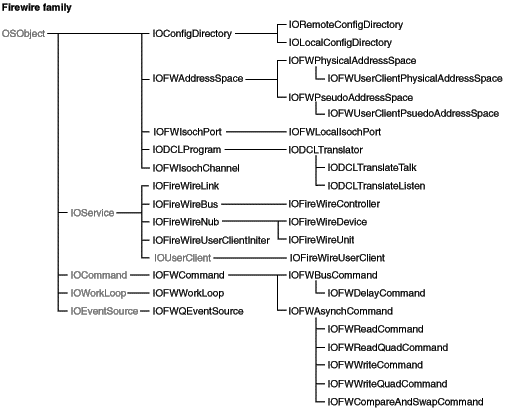

__Device interface__:

- Provides a device interface exporting an interface for sending and receiving packets on the FireWire bus and for adding entries into the computer’s own FireWire config ROM.

__Table A-4__  Clients and providers of the FireWire family

|  | Client of the nub | Provider for the nub |
| __Action__ | _Unit drivers:_ Drives communication with a unit of a device that plugs into the FireWire bus. _Protocol drivers:_ Adds support for a protocol enabling peer-to-peer communication or emulation over FireWire. | Drives a FireWire bus controller. |
| __Example__ | _Unit drivers:_ A driver for a FireWire speakers. _Protocol drivers:_ A driver that provides TCP/IP over FireWire. |  |
| __Classes__ | _Unit drivers:_ An instance of IOFireWireUnit, representing a unit found in a device’s configuration ROM, is matched against the driver and it is loaded into the kernel. The driver communicates with the FireWire family through this instance. _Protocol drivers:_ An instance of IOFireWireController matches a protocol driver and loads it into the kernel. The driver communicates with the FireWire family through this instance. | Driver classes should inherit from the IOFireWireController class as defined in the header file `IOFireWireController.h`. |
| __Notes__ | The most common client family is the SBP2 family. | OS X ships drivers for all Open Host Controller Interface (OHCI) bus controllers. Third-party developers generally should not need to write bus-controller drivers for the FireWire family. |

In some cases, you can write a driver for a FireWire device instead of for a unit. An example might be a driver for a device with a minimal config ROM (that is, with just a vendor ID). However, use of the minimal config ROM is strongly discouraged by Apple. Also, if your driver matches against a FireWire unit, it is often possible to do some things with the device.

The Graphics family provides support for frame buffers and display devices (monitors).

__Bundle identifier__:

- `com.apple.iokit.IOGraphicsFamily`

__Headers in__:

- Kernel resident: `Kernel.framework/Headers/IOKit/graphics/`
- Device interface: `IOKit.framework/Headers/graphics`

__Class hierarchy__:

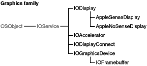

__Device interface__:

- The Graphics family exports several device interfaces since most access of graphics devices is from user space. However, the Quartz layer arbitrates access to frame buffers from user space through the windowing system or the CGDirectDisplay API. Other layers, such as Carbon Draw Sprockets, provide application access to graphics.
- Graphics acceleration is supplied by modules loaded into user address space. A CFPlugIn interface, defined in `IOGraphicsInterface.h`, implements two-dimensional acceleration. Similarly, OpenGL defines a loadable-bundle interface for three-dimensional rendering. Because there is no standard way to implement this functionality, hardware-specific code can exist in both user-space code and in a kernel-loaded driver.

__Table A-5__  Clients and providers of the Graphics family

|  | Client of the nub | Provider for the nub |
| __Action__ |  | Implements support for a frame buffer. |
| __Example__ |  |  |
| __Classes__ |  | Frame-buffer drivers must be subclasses of the IOFramebuffer class. The IONDRVFramebuffer class supports native Power PC Mac OS graphics drivers (known as “`ndrv`"s); this support is automatic, provided the drivers are written correctly to the specification. |
| __Notes__ | Support for kernel-resident clients is limited. Because the Quartz layer owns the display, the kernel generally does not render graphics directly. | Apple provides generic support for displays and so displays should not generally require third-party drivers. |

NDRV graphics drivers should function in OS X if they are correctly written. If they are not correctly written, the many differences in OS X’s runtime environment could cause them to fail, be ignored, or even cause a crash. If you are writing an NDRV driver, follow these rules:

- Access the card hardware using virtual addressing. Do not assume the card is mapped into its physically assigned address. In Mac OS 9, NDRV cards are mapped one-to-one, but in OS X, this is not guaranteed. Obtain the virtual addresses for your card's hardware via the `AAPL,address` property as documented in “Designed Cards and Drivers for PCI Power Macintosh.”
- Link only on the native driver libraries, which are NameRegistryLib, DriverServicesLib, and VideoServicesLib. If your card links on InterfaceLib or any other application-level library, it probably won’t work on OS X.
- Do not access low memory; doing so causes a crash (kernel panic) in OS X.
- Name registry calls are not supported from interrupt level in Mac OS 9 or OS X. They return errors in OS X.
- Secondary interrupts are not supported in OS X. There is no need to fake vertical blank interrupts if your card does not support them—simply do not create a VBL service. Mac OS 9 continues to require a VBL service to be installed to move the cursor on your device.
- Stack size is limited to 16K on OS X; any NDRV invocation should consume no more than 4K of stack.

If you want to make runtime conditional changes to your NDRV code, the property `AAPL,iokit-ndrv` is set in the PCI device properties before OS X uses your driver.

OS X supports 32 bits-per-pixel, alpha-blended cursors in hardware. If your device supports an alpha-blended direct color cursor, it should call `VSLPrepareCursorForHardwareCursor` with these fields set in the `HardwareCursorDescriptor` record:

```
bitDepth = 32 maskBitDepth = 0 numColors = 0colorEncodings = NULL
```

The `hardwareCursorData` buffer in the `HardwareCursorInfo` should point to a buffer of 32 bits per pixel, ARGB data. The data is not premultiplied by the alpha channel.

The Human Interface Device (HID) class is one of several device classes described by the USB (Universal Serial Bus) architecture. The HID class consists primarily of devices humans use to control a computer system’s operations. Examples of such HID class devices include:

- Keyboards and pointing devices such as mice, trackballs, and joysticks
- Front-panel controls such as knobs, switches, sliders, and buttons
- Controls that might be found on games or simulation devices such as data gloves, throttles, and steering wheels

Currently, OS X provides the HID Manager to allow applications to access joysticks, audio devices, and non-Apple displays. You can also use the HID Manager to get information from another type of HID class device, a UPS (uninterruptible power supply) device. UPS devices share the same report descriptor structure as other HID class devices and provide information such as voltage, current, and frequency. The OS X HID Manager consists of three layers:

- The HID Manager client API that provides definitions and functions your application can use to work with HID class devices
- the HID family that provides the in-kernel HID infrastructure such as the base classes, the kernel-user space memory mapping and queueing code, and the HID parser
- the HID drivers provided by Apple

__Bundle identifier__:

- `com.apple.iokit.IOHIDFamily`

__Headers in__:

- Kernel resident: `Kernel.framework/Headers/IOKit/hid/` and `Kernel.framework/Headers/IOKit/hidsystem/`
- Device interface: `IOKit.framework/Headers/hid/` and `IOKit.framework/Headers/hidsystem/`

__References and specifications__:

- HID Information section of USB.org—Developers website ([http://www.usb.org/developers/hidpage](http://www.usb.org/developers/hidpage))
- _[HID Class Device Interface Guide](../HID%20Class%20Device%20Interface%20Guide/Introduction%20to%20Working%20With%20HID%20Class%20Device%20Interfaces.md#apple-f4xwc4dqnrsv64tfmyxwi33df52wszbpkridimbqgaydsnzq)_

__Class hierarchy__:

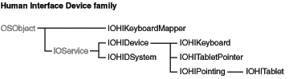

__Device interface__:

- The HID family exports a device interface through the HID Manager client API. The HID Manager includes `IOHIDLib.h` and `IOHIDKeys.h` (located in `/System/Library/Frameworks/IOKit.framework/Headers/hid` ) which define the property keys that describe a device, the element keys that describe a device’s elements, and the device interface functions and data structures you use to communicate with a device. After you’ve created a device interface for a selected HID class device, you can use the device interface functions to open and close the device, get the most recent value of an element, or set an element value.

__Table A-6__  Clients and providers of the HID family

|  | Client of the nub | Provider for the nub |
| __Action__ |  | Drives an input device such as a multi-button mouse, trackball, or joystick. |
| __Example__ |  |  |
| __Classes__ |  |  |
| __Notes__ |  | Support for most simple input devices is provided by the generic driver. |

The Network family provides support for network controllers. The Network family consists of two logical layers:

- Controller layer—this layer represents the network controller.
- Interface layer—this layer represents the network interface published by the network controller.

__Bundle identifier__:

- `com.apple.iokit.IONetworkingFamily`

__Headers in__:

- Kernel resident: `Kernel.framework/Headers/IOKit/network/`
- Device interface: `IOKit.framework/Headers/network/`

__Class hierarchy__:

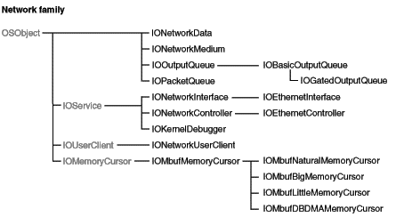

__Device interface__:

- The device interface for this family is usually the BSD network stack. Applications use the socket interface provided by the network stack to access indirectly the services provided by the Network family.

__Power management__:

The Network family performs most of the power-management set-up and tear-down tasks for subclassed device drivers. If you’re developing a driver for a network device that can be passively power managed (which describes most network devices), you can meet most of your basic power-management needs by overriding the `IONetworkController` method `registerWithPolicyMaker` and calling the `IOService` method `registerPowerDriver`.

In your implementation of `registerWithPolicyMaker`, create an array of `IOPMPowerState` structures to define your device’s power states and pass them in to `registerPowerDriver`. Then, return `kIOReturnSuccess` from `registerWithPolicyMaker` to tell the Network family that your driver can respond to power-management calls. (The default implementation of `registerPowerDriver` returns `kIOReturnUnsupported`.) The following code snippet shows one way to do this:

```swift
IOReturn MyEthernetDriver::registerWithPolicyMaker( IOService * policyMaker )
{
IOReturn ioreturn;
static IOPMPowerState powerStateArray[ kPowerStateCount ] = {
   { 1,0,0,0,0,0,0,0,0,0,0,0 },
   { 1,kIOPMDeviceUsable,kIOPMPowerOn,kIOPMPowerOn,0,0,0,0,0,0,0,0 }
};
fCurrentPowerState = kPowerStateOn;
ioreturn = policyMaker->registerPowerDriver( this, powerStateArray, kPowerStateCount );
return ioreturn;
}
```

Most network device drivers handle power changes related to sleep and wake in their implementations of the `IONetworkController` methods `enable` and `disable`. Note that the Network family enables a device when it transitions to a power state for which the `kIOPMDeviceUsable` flag is set. When a currently enabled device moves to a power state for which the `kIOPMDeviceUsable` flag is not set, the Network family disables it.

If you need to perform additional tasks to handle sleep and wake, you can override the `IOService` method `setPowerState`. Be aware, however, that the Network family will call `disable` _before_ you receive a call to your `setPowerState` implementation if the new power state puts the device into an unusable state. Conversely, the Network family calls `enable` _after_ you receive a `setPowerState` call to move the device to a usable state.

If your network device driver performs DMA, you should override the `IOService` method `systemWillShutdown`, which was introduced in OS X v10.5. This is especially important for drivers that run in Intel-based Macintosh computers. In your implementation of `systemWillShutdown`, you should make sure that the DMA engine is shut off, which results in the necessary disabling of the port.

__Table A-7__  Clients and providers of the Network family

|  | Client of the nub | Provider for the nub |
| __Action__ |  | Drives a network controller. |
| __Example__ |  | Controllers on Ethernet, Token Ring, and FDDI adapters. |
| __Classes__ |  | Driver must be an instance of a subclass of a controller class that implements generic network controller functionality, such as IONetworkController or of a controller class that builds upon IONetworkController to specialize for Ethernet controller support (IOEthernetController). See discussion on Network family classes below for more information. |
| __Notes__ | Drivers are typically not clients of the Network family. The primary system client of this family is the DLIL (Data Link Interface Layer) module in the BSD network stack. |  |

Member drivers must also create IONetworkInterface objects that are registered with the DLIL; such registration associates the driver with a network interface (for example, `en0`) in the system. You can create a Network Kernel Extension (NKE) and insert it at various locations above the IOKit/DLIL boundary to intercept the packets, commands, or other event traffic between an IONetworkInterface object and the upper layers.

Another client of this family is the KDP (Kernel Debugger Protocol) module in the kernel. A driver can create an IOKernelDebugger object that vends debugging services and allows kernel debugging through the network hardware managed by the driver. Only drivers that drive a built-in network controller are required to provide this support.

Other classes of the Network family include:

- IOOutputQueue—assists in queuing outbound packets.
- IOPacketQueue—represents a generic `mbuf` packet FIFO queue.
- IOMbufMemoryCursor—translates `mbuf` packets into a scatter-gather list of physical addresses and length pairs.
- IONetworkData—represents a container for a single group of statistics counters.
- IONetworkMedium—represents a single network medium supported by the network device.

The PC Card family supports 32-bit PC cards (CardBus), 16-bit PC cards (I/O and memory), and Zoom Video cards. This support encompasses controllers that are compatible with ExCA (Intel 82365) and Yenta register sets. Apple’s PC Card family’s Card Services are, for the most part, compliant with the 1997 PC Card™ standard.

CardBus cards are essentially PCI devices in a different form factor. If you are writing a driver for a CardBus card, you can choose to subclass from either IOPCIDevice or IOCardBusDevice. See the reference section `[PCI and AGP](#apple-f4xwc4dqnrsv64tfmyxwi33df52wszbpkridambqgaydemjnijaueqsjizdeq)` for more information about the PCI family.

Other classes provided by the family include:

- IOPCCard16Device—represents a 16-bit PC card device.
- IOPCCard16Enabler—allows you to override the card configuration process for 16-bit cards. It is used mainly for cards with broken or missing CIS entries.
- IOZoomVideoDevice—represents a Zoom Video device.
- IOPCCardBridge—represents a PC Card bridge; this class is a subclass of IOPCI2PCIBridge which is a subclass of IOPCIBridge.

__Bundle identifier__:

- `com.apple.iokit.IOPCCardFamily`

__Headers in__:

- Kernel resident: `Kernel.framework/Headers/IOKit/pccard/`

__References and specifications__:

- Documentation for Card Services can be found in the `doc` directory of the PC Card family source (available via Darwin CVS). You can also find in the same location a sample 16-bit driver.
- Apple Developer Connection—[https://developer.apple.com/hardwaredrivers/](https://developer.apple.com/hardwaredrivers/)

__Class hierarchy__:

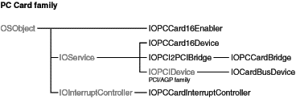

__Device interface__:

- None.

__Power management__:

- Classes `IOPCCardBridge`, `IOPCCard16Device`, `IOPCCard16Enabler`, and `IOCardBusDevice` provide some power-management support.

The PCI and AGP family provides support for, and access to, devices attached to PCI and AGP buses and PCI bridges.

__Bundle identifier__:

- `com.apple.iokit.IOPCIFamily`

__Headers in__:

- `Kernel.framework/Headers/IOKit/pci/`

__References and specifications__:

- This family supports all major features of the PCI Localbus 2.1 specification.
- PCI Special Interest Group—[http://www.pcisig.com](http://www.pcisig.com/)
- Apple Developer Connection—[https://developer.apple.com/hardwaredrivers/](https://developer.apple.com/hardwaredrivers/)

__Class hierarchy__:

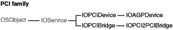

__Device interface__:

- None. Applications are not permitted direct access to PCI bus hardware for security reasons. Instead, applications should interact with higher-level services, such as those provided by device interfaces of the USB or other families.

__Matching properties__:

- The PCI/AGP family permits matching based on Open Firmware or on PCI registers. See the description of the IOPCIDevice class in the reference documentation for details.

Check the Darwin Open Source project for example PCI drivers.

__Table A-8__  Clients and providers of the PCI and AGP family

|  | Client of the nub | Provider for the nub |
| __Action__ | Drives a device that plugs into a PCI bus. | Drives a PCI bus controller or a PCI bridge. |
| __Example__ | A driver for a PCI SCSI controller card is a _client_ of the PCI family but is a _member_ of the SCSI Parallel family. |  |
| __Classes__ | The driver communicates with its family via an instance of IOPCIDevice or IOAGPDevice. An instance of one of these classes matches your driver and loads it into the kernel. | PCI family member drivers should inherit from the IOPCIBridge class. |
| __Notes__ | The most common client families are the USB, Network, SCSI, Graphics, and Audio families. | OS X supports most PCI bus hardware with a set of generic drivers. In general, third-party developers do not need to write drivers for the PCI and AGP family unless they are building a PCI expansion chassis or developing drivers for a PCI bridge with special characteristics not addressed by the generic drivers. |

The SBP2 family (Serial Bus Protocol 2) provides support for, and access to, devices attached to the FireWire bus that use the SBP-2 transport protocol. The SBP2 family is a client of the FireWire family. SBP-2 devices require FireWire to run.

__Bundle identifier__:

- `com.apple.iokit.IOFireWireSBP2`

__Headers in__:

- Kernel resident: `Kernel.framework/Headers/IOKit/sbp2/`
- Device interface: `IOKit.framework/Headers/sbp2`

__References and specifications__:

- T10 Technical Committee —[http://www.t10.org](http://www.t10.org/)
- SBP-2 standard: [ftp://ftp.t10.org/t10/drafts/sbp2/](ftp://ftp.t10.org/t10/drafts/sbp2/)

__Class hierarchy__:

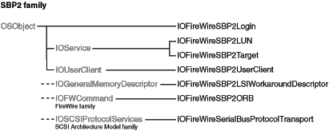

__Device interface__:

- The SBP2 family provides a device interface that exports an interface for sending SBP-2 ORBs to a device.

__Table A-9__  Clients and providers of the SBP2 family

|  | Client of the nub | Provider for the nub |
| __Action__ | Drives a device that uses the SBP-2 transport protocol. | Provides SBP-2 transport services |
| __Example__ | A driver for a typical FireWire hard disk drive is a _client_ of the SBP2 family but is a _member_ of the mass storage family. |  |
| __Classes__ | A client driver communicates with the SBP2 family through an instance of IOFireWireSBP2LUN. An instance of this class is created for each LUN (Logical Unit Number) found in a configuration ROM unit directory; this instance matches your driver and loads it into the kernel. | SBP2 family-member drivers should inherit from the IOFireWireSBP2Target class. |
| __Notes__ | The most common client family is the Storage family. |  |

The SCSI Parallel family provides support for, and access to, devices attached to a parallel SCSI bus. This family supports all major features of the SCSI Parallel Interface-5 (SPI-5) specification for parallel buses.

__Bundle identifier__:

- `com.apple.iokit.IOSCSIParallelFamily`

__Headers in__:

- Kernel resident: `Kernel.framework/Headers/IOKit/scsi/spi`. The header file `IOSCSIParallelInterfaceController.h` supports the development of a driver for a SCSI card.

__References and specifications__:

- T10 Technical Committee —[http://www.t10.org](http://www.t10.org/)
- SCSI Technical Library of Information—[http://www.scsilibrary.com/](http://www.scsilibrary.com/)

__Class hierarchy__:

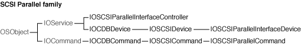

__Device interface__:

- Device interface support for parallel SCSI devices is provided by the SCSI Architecture Model family. See [SCSI Architecture Model](#apple-f4xwc4dqnrsv64tfmyxwi33df52wszbpkridambqgaydemjnijauerkdi5beo)

__Table A-10__  Clients and providers of the SCSI Parallel family

|  | Client of the nub | Provider for the nub |
| __Action__ | Drives a device that plugs into a SCSI bus. | Drives a SCSI host adapter or controller chip. |
| __Example__ | A driver for a SCSI disk drive is a _client_ of the SCSI Parallel family but a _member_ of the Storage family. |  |
| __Classes__ | A client driver communicates with the SCSI Parallel family through an instance of IOSCSIDevice. Your driver would match on this instance and be loaded into the kernel. Another class of interest is IOSCSICommand. | Because the SCSI Parallel family presently supports parallel buses, member drivers use the IOSCSIParallelInterfaceController class. |
| __Notes__ | Common client families include the Transport Drivers for storage devices. | OS X includes generic drivers for most built-in SCSI hardware. In general, third-party developers do not need to write drivers that are members of the SCSI Parallel family unless they are developing drivers for an expansion card. |

The SCSI Architecture Model family provides common client support for SCSI, USB (Storage), FireWire SBP-2 and ATAPI devices. Many of the classes of this family belong to the Transport Driver layer, which is summarized in [Table A-11](#apple-f4xwc4dqnrsv64tfmyxwi33df52wszbpkridambqgaydemjnijauuq2kjjdeu)

__Table A-11__  SCSI Architecture Model family—Transport Driver layer

| Type | Classes | Comments |
| Device Services Linkage | IOBlockStorageServices IOReducedBlockServices IOCompactDiscServices IODVDServices | Linkage objects that understand the APIs from the Device Services layer (Storage family) and export APIs that the Logical Unit drivers (in the Transport Driver layer) understand. |
| Logical Unit drivers | IOSCSIPeripheralDeviceType00 IOSCSIPeripheralDeviceType05 IOSCSIPeripheralDeviceType07 IOSCSIPeripheralDeviceType0E | Drive mass storage devices that have file systems or are bootable. |
| Peripheral Device Type Nub | IOSCSIPerpheralDeviceNub | Not really an I/O Kit nub, but an object that queries the device and determines which Logical Unit driver is needed. |
| SCSI Protocol drivers | IOUSBMassStorageClass IOATAPIProtocolTransport IOFireWireSerialBusProtocol- Transport IOSCSIParallelInterface- ProtocolTransport | Classes for bus-specific drivers. Although these classes belong to other families, they are part of the SCSI Architecture Model layering. |

The Logical Unit drivers and the Peripheral Device Type Nub are in the SCSI Application layer, which inherits (ultimately) from IOSCSIPrimaryCommandsDevice. The SCSI Protocol drivers are in the SCSI Protocol layer, which inherits from IOSCSIProtocolServices.

The SCSI Architecture Model family supports multimedia command set devices, such as CD-RW drives.

__Bundle identifier__:

- `com.apple.iokit.IOSCSIArchitectureModelFamily`

__Headers in__:

- Kernel-resident: `Kernel.framework/Headers/IOKit/scsi-commands/`
- Device interface: `IOKit.framework/Headers/scsi-commands`

__Class hierarchy__:

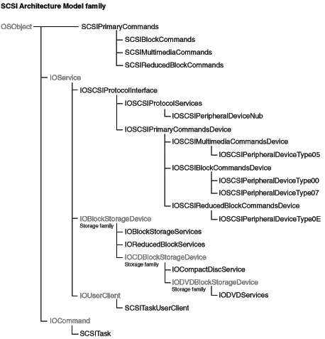

__Device interface__:

- The library for the SCSI Architecture Model family is called SCSITaskLib. It includes three interfaces: MMCDeviceInterface, SCSITaskDeviceInterface, and SCSITaskInterface. The user-client class is SCSITaskUserClient. If you need to access a SCSI Parallel device _and_ your application must run in versions of OS X prior to v10.2, see [Accessing SCSI Parallel Devices](https://developer.apple.com/library/archive/documentation/DeviceDrivers/Conceptual/WorkingWithSAM/WWS_ParaSCSI/WWS_ParallelSCSI.html#//apple_ref/doc/uid/TP30000386) for information on how to do this. Otherwise, you should use the device interfaces in the SCSITaskLib to access your device (see [Accessing SCSI Architecture Model Devices](https://developer.apple.com/library/archive/documentation/DeviceDrivers/Conceptual/WorkingWithSAM/WWS_SAMDevInt/WWS_SAM_DevInt.html#//apple_ref/doc/uid/TP30000387) for information on how to do this).

__Power management__:

The SCSI Architecture Model family performs most of the power-management set-up and tear-down tasks for both protocol services drivers and logical unit drivers. In general, a protocol services driver, such as IOATAPIProtocolTransport, must be able to transition the physical interconnect device between the off and on states. On the other hand a logical unit driver, such as IOSCSIPeripheralDeviceType05, must be able to manage a multimedia device that supports all the power states defined by the SCSI multimedia commands specification. In addition, a logical unit driver might need to determine if a power-state change is needed, block incoming I/O when the device is not in an appropriate power state, and specify the power state a device should enter at boot time.

As shown in the class hierarchy diagram above, the SCSI Architecture Model family defines a common superclass for both types of drivers: `IOSCSIProtocolInterface`. The `IOSCSIProtocolInterface` class defines a number of power-management methods that subclass drivers can call or, less frequently, override.

- If you’re developing a custom protocol services driver, you do not need to perform the steps outlined in [Implementing Basic Power Management](Managing%20Power.md#apple-f4xwc4dqnrsv64tfmyxwi33df52wszbpkridambqgaydembnknltg) Instead, you must call the `IOSCSIProtocolInterface` method `InitializePowerManagement` in your driver’s `start` routine. Then, if there is device-specific work to do to handle power-state changes, you can implement the methods `HandlePowerOn` and `HandlePowerOff`.
- Similarly, if you’re developing a custom logical unit driver, you do not need to perform the steps outlined in [Implementing Basic Power Management](Managing%20Power.md#apple-f4xwc4dqnrsv64tfmyxwi33df52wszbpkridambqgaydembnknltg) If your device complies with the appropriate command-set specification, you do not need to override any methods in your driver unless you want to implement custom power-management functionality. For example, you might want your device to transition from the active state directly to the sleep state, instead of through the intermediate states between active and sleep.

  In the `IOSCSIProtocolInterface` class, the SCSI Architecture Model family provides the following methods a logical unit driver subclass can implement:

  - `InitializePowerManagement`. The superclass implementation of this method performs power-management setup tasks. A subclass driver can override this method to provide information about the power states the device supports.
  - `TicklePowerManager`. The superclass implementation of `TicklePowerManager` calls the `activityTickle` method, which results in a request to change your device to its active power state. A subclass driver can override this method to specify a state different from the active one.
  - `GetInitialPowerState`. This method is used to specify the default state (usually active) a device should be in when the system boots. If a device should enter a different state when the system boots, the subclass driver can override this method and specify that state.
  - `GetNumberOfPowerStateTransitions`. A subclass driver can override this method to report the number of transitions between the lowest and highest specification-defined power states the device supports. Note that system sleep is not counted in the transitions because it is not a power state the device enters voluntarily.
  - `HandlePowerChange`. A subclass driver overrides this method to perform the work of changing the device’s power state.

The Serial family provides support for serial byte character streams.

__Bundle identifier__:

- `com.apple.iokit.IOSerialFamily`

__Headers in__:

- Kernel resident: `Kernel.framework/Headers/IOKit/serial/`
- Device interface: `IOKit.framework/Headers/serial/`

__References and specifications__:

- See `termios`. Also see the related header file `Kernel.framework/Headers/sys/termios.h`

__Class hierarchy__:

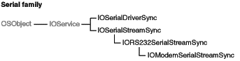

__Device interface__:

- Applications can access the Serial family through the BSD device nodes, the most common client of this family. An application can read and write data using the BSD device nodes in `/dev`. Data is also routed through to PPP via these device nodes. You can find keys and other properties for use in device access in `IOKit.framework/Headers/serial/IOSerialKeys.h`.

__Table A-12__  Clients and providers of the Serial family

|  | Client of the nub | Provider for the nub |
| __Action__ | _Requires_ a single-banded data streaming service with elementary flow control. | _Provides_ a single-banded streaming service; in other words, it cannot be packet-based. although it may be bi-directional. The driver may also implement flow control. The driver must describe the services it is capable of providing. |
| __Classes__ |  | Serial port writers should subclass IOSerialDriverSync for their drivers, then publish as nubs objects of the IOModemSerialStreamSync or IORS232SerialStreamSync classes, or (if neither of these suffices) a concrete subclass of IOSerialStreamSync. The I/O Kit uses these objects to create the appropriate user-client interface for user-space access via BSD. |
| __Notes__ | Developers should use the BSD device file mechanism documented in _[Accessing Hardware From Applications](../Accessing%20Hardware%20From%20Applications/Introduction%20to%20Accessing%20Hardware%20From%20Applications.md#apple-f4xwc4dqnrsv64tfmyxwi33df52wszbpkridgmbqgaydgnzw)_. |  |

The Storage family provides high-level support for random-access mass storage devices. It is separate from the underlying technology that transports the data to and from the represented storage space. The interface to the underlying transport technology is declared in the abstract class IOBlockStorageDevice. Storage driver objects communicate all mass-storage requests across this interface, without having to have knowledge of, or involvement with, the commands and mechanisms used to communicate with the device or bus.

The scope of the Storage Family encompasses the IOBlockStorageDevice interface, at one end (provider direction), and the BSD interface at the other end (client direction), with various driver and media layers in the between. [Figure A-1](#apple-f4xwc4dqnrsv64tfmyxwi33df52wszbpkridambqgaydemjnijauurcbijcum) illustrates this stack.

__Figure A-1__  Storage family driver stack

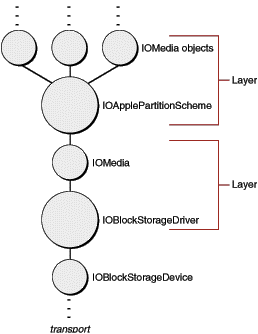

Each layer consists of a set of two objects—a driver object and the child media object (or objects) it publishes. The IOStorage class is the common base class for both driver and media objects. It is an abstract class that declares the basic open, close, read, and write interfaces that subclasses are to implement. It establishes the protocol with which media objects can talk to driver objects without needing to be subclassed for each driver. The read and write interfaces provide byte-level access to the storage space.

The IOBlockStorageDriver class is the common base class for generic block storage drivers. It matches and communicates via an IOBlockStorageDevice interface, and connects to the remainder of the storage framework via the IOStorage protocol. It extends the IOStorage protocol by implementing the appropriate open and close semantics, deblocking for unaligned transfers, polling for ejectable media, implementing locking and ejection policies, creating and tearing down media object, and gathering and reporting statistics. The Storage family supports other basic types of drives, such as CD drives and DVD drives, through subclasses of the IOBlockStorageDriver. You rarely, if ever, need to subclass the generic block storage driver to handle device idiosyncrasies; rather, you should change the underlying transport drivers to correct any non-conforming behavior.

The IOMedia class is an abstraction of a random-access disk device. It is equivalent to the “device object” or “interface object” in other I/O Kit families.

- It represents the presence of a device, or a piece thereof.
- It presents an programmatic interface to that device.
- It is backed by a separate driver that implements the required functionality.

IOMedia provides a consistent interface for both real and virtual disk devices, for subdivisions of disks such as partitions, for supersets of disks such as RAID volumes, and so on. It extends the IOStorage class by implementing the appropriate open, close, read, write, and matching semantics for media objects. Its properties reflect the properties of real disk devices, including natural block size and writability.

The other driver and media layers in the Storage Family are known as filter schemes. These optional layers separate media objects, providing some kind of data manipulation or offset manipulation between media objects. These layers may stack arbitrarily on top one another, as they are both a client and a provider of media objects. Most third-parties will develop drivers for the filter scheme layer, if not for the underlying transport technology. Refer to [IOMedia Filter Schemes](#apple-f4xwc4dqnrsv64tfmyxwi33df52wszbpkridambqgaydemjnijauuq2ijbcei) for more information on developing filter scheme drivers.

For more information on developing drivers for the underlying transport technology, refer to SCSI Architecture Model Family documentation. The SCSI Architecture Model Family is the common underlying transport technology for ATAPI, FireWire, SCSI, and USB. It provides a consistent CDB-based access model for application writers and driver writers, and a simple infrastructure for correcting device idiosyncrasies.

__Bundle identifier__:

- `com.apple.iokit.IOStorageFamily`

__Headers in__:

- Kernel resident: `Kernel.framework/Headers/IOKit/storage/`
- Device interface: `IOKit.framework/Headers/storage`

__Class hierarchy__:

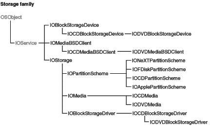

__Device interface__:

- See [Accessing IOMedia From Applications](#apple-f4xwc4dqnrsv64tfmyxwi33df52wszbpkridambqgaydemjnijauurkejbeeq)

A filter scheme is a driver for IOMedia objects. It acts as both as a client and a provider of media objects. The filter-scheme driver receives mass storage requests through its abstract `read` and `write` member-function interfaces, in which it can perform the data manipulation or offset manipulation before passing the request on to its provider IOMedia object (or objects). There are several different kinds of media filter schemes:

- One-to-one—A block-level compression or encryption scheme, for example, would match against one IOMedia object and produce one child IOMedia object representing the uncompressed or unencrypted content.
- One-to-many—A partition scheme, for example, would match against one IOMedia object and produce multiple child IOMedia objects representing the content of each distinct partition (see [Partition Schemes](#apple-f4xwc4dqnrsv64tfmyxwi33df52wszbpkridambqgaydemjnijauuqsgifbes) for more information).
- Many-to-one—A RAID scheme, for example, would match against multiple IOMedia objects and produce one child IOMedia object representing the RAIDed content.
- Many-to-many—A many-to-many scheme would match against multiple IOMedia objects and produce multiple child IOMedia objects.

A filter-scheme driver inherits from the IOStorage class and necessarily participates in the IOStorage match category (IOMatchCategory’s value in personality).

OS X includes two standard partition schemes:

- IOApplePartitionScheme, the standard Apple partition scheme driver
- IOFDiskPartitionScheme, the standard PC partition scheme driver

A partition-scheme driver inherits from the IOPartitionScheme class (which inherits from IOStorage), matches against a single IOMedia parent, and produces one or more IOMedia child objects for each partition it must represent. It participates in the IOStorage match category, as with all filter scheme drivers.

A partition scheme need not be subclassed in order to make use of developer-defined content within a partition. A partition’s contents is represented by a distinct IOMedia object, published as a child of the partition-scheme driver. Each child media object has properties that further identify information known about the partition, such the content hint, size, and natural block size. The content hint field is a string formed similarly to the well-known "Apple_Driver" and "Apple_HFS" strings, or by definition, in the form "MyCompany_MyContent". It permits partitions with developer-defined contents to be identified uniquely (when the partition is created), and permits filter-scheme drivers to match against such content automatically without ever probing a disk.

[Table A-13](#apple-f4xwc4dqnrsv64tfmyxwi33df52wszbpkridambqgaydemjnijauuq2djbfek) lists the standard set of properties for all IOMedia objects. These properties can be used as matching properties in I/O Kit’s search and notification APIs, as well as for filter scheme driver matching purposes.

__Table A-13__  Storage family (IOMedia) properties

| Key | Type | Description |
| `kIOMediaEjectableKey` | Boolean | Is the media ejectable? |
| `kIOMediaLeafKey` | Boolean | Is the media a leaf in the media tree? This is false whenever a client filter-scheme driver has matched against the media object. |
| `kIOMediaPreferredBlockSizeKey` | Number | The media’s natural block size in bytes. |
| `kIOMediaSizeKey` | Number | The media’s entire size in bytes. |
| `kIOMediaWholeKey` | Boolean | Is the media at the root of the media tree? This is true for the physical media representation, a RAID media representation, and similar representations. |
| `kIOMediaWritableKey` | Boolean | Is the media writable? |
| `kIOMediaContentKey` | String | The media’s content description, as forced upon by the client filter-scheme driver. (This content description is copied automatically from the client filter-scheme driver’s `kIOMediaContentMaskKey` property.) The string’s format follows the "MyCompany_MyContent" convention, and defaults to the Content Hint string should no client filter scheme have matched against the object. Used for informational purposes in user disk utilities. |
| `kIOMediaContentHintKey` | String | The media’s content description, as hinted at the time of the object’s creation. The string’s format follows the “MyCompany_MyContent” convention. Used for matching purposes in filter scheme drivers. |
| `kIOBSDNameKey` | String | The media’s BSD device node name. The name is dynamically assigned at the time of the object’s creation. Used for read and write access to the media’s contents (see [Accessing IOMedia From Applications](#apple-f4xwc4dqnrsv64tfmyxwi33df52wszbpkridambqgaydemjnijauurkejbeeq)). |

A media object also has a unique I/O Kit path, which can be obtained via standard I/O Kit APIs.

The standard user-space mechanism for accessing data on a piece of media is the BSD device interface. The BSD device interface is abstracted at the file-system layer through distinct read and write APIs, while general user application access is provided via the `read` and `write` system calls (see the corresponding man pages for more documentation). The properties and structure of a physical disk are represented in the I/O Kit Registry object hierarchy and in each media object’s properties, including the BSD device interface name assigned to the media object.

A specific media object can be found via the standard I/O Kit search and notification APIs. The dictionary used to describe the IOMedia might refer to specific property values, to a specific service path or device tree path, or to a specific subclass of media. A CD, for example, appears as an IOCDMedia subclass, with properties appropriate to a CD, such as `kIOCDMediaTOCKey`. Such properties can be combined to describe a media object uniquely in the system, or generalized to identify a certain kind of media with multiple possible matches (returned in an iterator).

The Carbon APIs and Cocoa APIs provide mechanisms for sending notifications of file system mount and unmount events, as well as for file access within the file system. An application can obtain the associated BSD device interface name for a given file system through `GetVolParms` (`vMDeviceID`) in Carbon and through `getmntinfo` in BSD. The associated IOMedia object can be obtained for a given BSD device interface name through I/O Kit APIs using the `kIOBSDNameKey` property.

The USB family provides support for, and access to, devices attached to a Universal Serial Bus (USB).

Two basic types of drivers are clients of this family: kernel-mode drivers and user-mode drivers. Kernel-mode drivers are required when the clients of the driver also reside in the kernel (such as HID devices, mass storage devices, or networking devices). User-mode drivers are preferred when only one process has access to the device (for example printers and scanners).

__Bundle identifier__:

- `com.apple.iokit.IOUSBFamily`

__Headers in__:

- Kernel resident: `Kernel.framework/Headers/IOKit/usb/`
- Device interface: `IOKit.framework/Headers/usb`

__References and specifications__:

Apple Developer Connection—[https://developer.apple.com/hardwaredrivers/](https://developer.apple.com/hardwaredrivers/)

__Class hierarchy__:

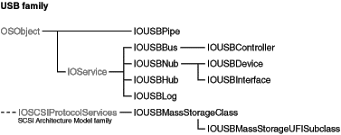

__Device interface__:

- User mode clients use an API which is part of the I/O Kit framework; this API is defined in `IOKit/usb/IOUSBLib.h`. Clients use user mode abstractions of the IOUSBDevice and IOUSBInterface classes found in the kernel in order to communicate with the USB device or USB interface.

__Kernel-resident drivers__:

- Kernel drivers for physical USB devices can be written for either USB devices or for USB interfaces. A physical USB device consists of a device descriptor that can describe any number of interfaces. When writing a kernel-resident driver, you need to decide if the driver is to control the whole USB device or if it is to control only an interface of a USB device.

The USB family for kernel-resident drivers consists of three main classes:

- __IOUSBDevice__: The IOUSBDevice class is an abstraction of a physical USB device. There is one IOUSBDevice class instantiated for every USB device connected to the bus. The provider for an IOUSBDevice object is an IOUSBController object (which is an abstraction of a USB controller).
- __IOUSBInterface__: The IOUSBInterface class is an abstraction of one of the interfaces of a USB device. There is one of these classes instantiated for every interface in a device. When it is created, the IOUSBInterface creates IOUSBPipe objects for each endpoint described in the interface descriptor of the interface. The provider for an IOUSBInterface object is an IOUSBDevice object.
- __IOUSBPipe__: The IOUSBPipe class contains the methods that are used for communicating with a USB device or a USB interface. There is one IOUSBPipe object created for the default control endpoint and an additional one for each endpoint described in the interface descriptor. The provider for an IOUSBPipe object is an IOUSBInterface object.

Kernel-resident USB drivers are clients of the family that provides the transport services and are members of the family from which they get their class inheritance. For example, a driver for a USB keyboard is a client of the IOUSBInterface object (that is, the IOUSBInterface object is the provider for the driver) but the keyboard driver is a member of the IOHIDFamily. The USB family provides the mechanism for getting at the key presses in the keyboard. The keyboard driver supports methods from the HID family for sending those key presses to the event system.

As mentioned above, you can write a driver to match against a USB device or a USB interface. The IOUSBDevice or IOUSBInterface classes are the providers for the drivers. The drivers themselves can be members of a separate family (such as the IOHIDFamily or IOAudioFamily) or can be members of the IOService family.

__Power management__:

All in-kernel USB device drivers should implement at least basic power management to increase power saving in the system. In OS X v10.5, the USB family introduced the `IOUSBHubPolicyMaker` object, which is an abstraction of a USB hub that includes power-management capabilities. When you develop a USB device driver to run in OS X v10.5 and later and you call `joinPMtree`, your driver is attached into the power plane as a power child of an `IOUSBHubPolicyMaker` object. (In earlier versions of OS X, the power parent of a USB device driver was an `IOUSBController` object representing the controller to which the device was attached.)

Your USB device driver can communicate with its `IOUSBHubPolicyMaker` object to determine the power state of its hub. This can be useful if, for example, you need to handle an imminent shutdown differently from a restart. The `IOUSBHubPolicyMaker` object supports the following five power states for a hub:

- On. The hub is fully functional and at least one of its ports is active (that is, not suspended).
- Sleep. If the hub supports sleep, its ports are inactive and it is not supplying power to any attached devices; if not, the sleep state is identical to the off state.
- Doze. This is an idle power-saving state a hub can enter when all its ports are suspended or disconnected and all attached devices are in either the off or doze state. Not all hubs support the doze state.
- Off. The hub enters this state when the system is about to shut down.
- Restart. This state is identical to the off state, except that a hub enters it when the system is about to restart.

USB devices seldom support more than the first four of these power states, and many support only on, sleep, and off. If you’re developing a driver for a USB device that supports doze, you should call `SuspendDevice` when you switch the device’s power state to doze, so the hub can suspend the port to which the device is attached. If the drivers for all the devices attached to a hub do this, the hub can enter the doze state, which can result in significant power saving for the system. However, if your driver calls `SuspendDevice` without also changing the device’s power state to doze, you prevent the hub from entering the doze state and saving power.

If the hub to which your device is attached does not support sleep, the device must go to its off state when the system goes to sleep. Of course, if your device does not support sleep, it must also go to its off state when the system goes to sleep, even if its hub does support sleep.

During a power-state change, note that a USB hub's power state is not updated until the hub receives a `powerChangeDone` call, which does not happen until after all downstream hubs and devices have received their `powerChangeDone` calls. This means that if you use the `getPowerState` call introduced in OS X v10.5 to get an upstream hub’s current power state, you might receive stale power-state information. However, if your device is changing to its on state, you can assume that the upstream hubs are actually on, even if their power-state values haven’t yet been updated.

__Table A-14__  Clients and providers of the USB family

|  | Client of the nub | Provider for the nub |
| __Action__ | Drives a device that plugs into a USB port. | Drives a USB bus controller. |
| __Example__ | A keyboard driver is an interface driver; its provider is the driver for the USB _device_. The keyboard driver inherits from the IOHIKeyboard class—it’s a member of the HID family. |  |
| __Classes__ | IOUSBDevice drivers can only communicate with the USB device through the default control pipe. IOUSBInterface drivers have IOUSBPipe objects created for all the endpoints that are described in the interface descriptor for the current configuration. The driver uses these objects to communicate with the device. | USB family-member drivers should inherit from the IOUSBController class. |
| __Notes__ | Common client families include the HID family (IOHIPointing and IOHIKeyboard classes) and the Transport Drivers for Storage family devices. Most kernel-mode clients of the USB family are interface drivers, and only occasionally device drivers. | OS X includes generic drivers that support all Open Host Controller Interface (OHCI) bus controllers. In general, third-party developers do not need to write drivers for the USB family. |

__Driver matching__: The USB family uses the USB Common Class Specification, revision 1.0 to match devices and interfaces to drivers (for a link to this specification, see the section above titled “References and specifications”). The driver should use the keys defined in this specification to create a matching dictionary that defines a particular driver personality. There are two tables of keys in the specification. The first table contains keys for finding devices and the second table contains keys for finding interfaces. Both tables present the keys in order of specificity: the first key in each table defines the most specific search and the last key defines the broadest search. Each key consists of the combination of elements listed in the left column of the table.

For a successful match, you must add the elements of exactly one key to your personality. If your personality contains a combination of elements not defined by any key, the matching process will not find your driver. For example, if you’re attempting to match a device and you add values representing that device’s vendor, product, and protocol to your matching dictionary, the matching process is unsuccessful even if a device with those same values in its device descriptor is currently represented by an IOUSBDevice nub in the I/O Registry. This is because there is no key that combines the elements of vendor number, product number, and protocol.

Some categories of devices do not have family support from I/O Kit. In general, there are three reasons why a particular device may not be supported by an I/O Kit family.

- Support for certain devices is provided by other frameworks. The I/O Kit is not the most appropriate place for the abstractions that represent these devices. Examples of such devices include printers, scanners, digital cameras, and other imaging devices. If you are developing a driver for this category of device, you should use the appropriate imaging SDK.
- For some devices, it is not possible to provide a set of useful, common abstractions. Such devices might include USB security dongles, data acquisition cards, and other vendor-specific devices. These devices do not share a sufficiently large number of characteristics to make creation of I/O Kit families worthwhile. For example, although security dongles all connect via USB, there is no easily defined set of abstractions common to all such devices. An I/O Kit family would not provide substantial assistance to developers. It should not be assumed, however, that a family is required to write a new driver. In many cases, the `IOService` class provides everything a driver requires to write a “family-less” driver.
- For many devices, it is possible to define a set of useful abstractions; however, Apple has not chosen to create a family for one or more reasons. These devices may be part of a technology that is not a common Macintosh market. Or, Apple’s engineers may not have sufficient in-house expertise with certain devices to create the best family definition. In these cases, an opportunity exists for third-party developers to extend the I/O Kit model by developing families of their own. In addition, families developed under the Apple Public Source License can be sent back to Apple for possible inclusion in future releases of OS X.

There is no I/O Kit family for imaging devices (cameras, printers, and scanners). Instead, support for particular imaging device characteristics is handled by user-space code (see [Controlling Devices From Outside the Kernel](Architectural%20Overview.md#apple-f4xwc4dqnrsv64tfmyxwi33df52wszbpkridambqgaydcmznijcuqrkhjbcuo) for further discussion). Developers who need to support imaging devices should employ the appropriate imaging SDK.

To add digital video capabilities to your software, use the QuickTime APIs.

There is, at present, no I/O Kit family specifically designed for sequential access devices, such as tape drives. However, third-party developers can use the SAM device interface to create plug-in components for such devices.

There is, at present, no I/O Kit family for telephony devices. Apple is evaluating plans for a Telephony family for the future.

For some devices, it is not possible to provide a set of useful, common abstractions. Because families define the set of abstractions shared by all devices within the family, it is not feasible to create a family for these devices.

In most cases, however, a family is not necessary in order to write a driver for these devices. Developers should start by inheriting functionality from `IOService`, then use the `GetProperty` and `SetProperty` calls to communicate with their driver. In many cases, this should suffice. In some cases, however, such as data acquisition cards requiring high bandwidth, the developer should create their own user client (for a device-interface plug-in). Such objects can provide shared memory and procedure-call interfaces to a user-space library (see `IOUserClient.h`). You can find several good examples in IOKitExamples on the Darwin Open Source site.

[Next](Document%20Revision%20History.md)[Previous](Glossary.md)

