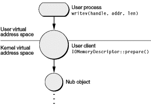
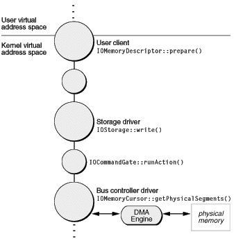

> 导航：[总目录](../../../README.md) · [documentation](../../../_indexes/documentation.md) · [IOKit Fundamentals](Introduction%20to%20I-O%20Kit%20Fundamentals.md)

[Next](Managing%20Power.md)[Previous](Handling%20Events.md)

# Managing Data

A driver’s essential work is to shuffle data in and out of the system in response to client requests as well as events such as hardware-generated interrupts. The I/O Kit defines standard mechanisms for drivers to do this using a handful of classes. Drivers use the IOMemoryDescriptor and IOMemoryCursor classes (and, in OS X v10.4.7 and later, the IODMACommand class) to perform pre-I/O and post-I/O processing on data buffers, such as translating them between client formats and hardware-specific formats. This chapter discusses these classes and various issues related to device drivers and data management.

Drivers handle client requests and other events using the IOWorkLoop and IOEventSource classes to serialize access and thereby protect their critical data. Because of these mechanisms, drivers rarely have to worry about such issues as protecting critical data or disabling and enabling interrupts during the normal course of handling a request. See the chapter [Handling Events](Handling%20Events.md#apple-f4xwc4dqnrsv64tfmyxwi33df52wszbpkridambqgaydcobnijauursgjjaui) for information.

An I/O transfer is little more than a movement of data between one or more buffers in system memory and a device. “System memory” in this context, however, refers to actual physical memory, not the virtual memory address space used by both user and kernel tasks in OS X. Because I/O transfers at the level of device drivers are sensitive to the limitations of hardware, and hardware can “see” only physical memory, they require special treatment.

Input/output operations in OS X occur within the context of a virtual memory system with preemptive scheduling of tasks and threads. In this context, a data buffer with a stable virtual address can be located anywhere in physical memory, and that physical memory location can change as virtual memory is paged in and out. It’s possible for that data buffer to not be in physical memory at all at any given time. Even kernel memory, which isn’t subject to relocation, is accessed by the CPU in a virtual address space.

For a write operation, where data in the system is being sent out, a data buffer must be paged in if necessary from the virtual memory store. For a read operation, where a buffer will be filled by data brought into the system, the existing contents of the data buffer are irrelevant, so no page-in is necessary; a new page is simply allocated in physical memory, with the previous contents of that page being overwritten (after being paged out, if necessary).

Yet a requirement for I/O transfers is that the data in system memory not be relocated during the duration of the transfer. To guarantee that a device can access the data in buffers, the buffers must be resident in physical memory and must be wired down so that they don’t get paged out or relocated. Then the physical addresses of the buffers must be made available to the device. After the device is finished with the buffers, they must be unwired so that they can once again be paged out by the virtual memory system.

To help you deal with these and other constraints of hardware, the I/O Kit puts several classes at your disposal.

In a preemptive multitasking operating system with built-in virtual memory, I/O transfers require special preparation and post-completion processing:

- The space needed for an I/O transfer must reside in physical memory and must be wired down so it can’t be paged out until the transfer completes.
- The virtual memory addresses used by software must be converted to physical addresses, and the buffer addresses and lengths must be collected into the scatter/gather lists that describe the data to be transferred.
- After the transfer completes, the memory must be unwired so it can be paged out.

In the I/O Kit, all of this work is performed by objects of the IOMemoryDescriptor and IOMemoryCursor classes (see [Supporting DMA on 64-Bit System Architectures](#apple-f4xwc4dqnrsv64tfmyxwi33df52wszbpkridambqgaydcojnknlte) for information on the IODMACommand class, which supersedes IOMemoryCursor in OS X v10.4.7 and later). An I/O request typically includes an IOMemoryDescriptor object that describes the areas of memory involved in the transfer. Initially, the description takes the form of an array of structures, each consisting of a client task identifier (`task_t`), an offset into the client’s virtual address space, and a length in bytes. A driver uses the memory descriptor to prepare the memory pages—paging them into physical memory, if necessary, and wiring them down—by invoking the descriptor’s `prepare` function.

When the memory is prepared, a driver at a lower level of the stack—typically a driver that controls a DMA (Direct Memory Access) engine—then uses a memory-cursor object to get the memory descriptor’s buffer segments and with them generate a scatter/gather list suitable for use with the hardware. It does this by invoking the `getPhysicalSegments` function of the memory cursor and doing any necessary processing on the segments it receives. When the I/O transfer is complete, the driver originating the I/O request invokes the memory descriptor’s `complete` function to unwire the memory and update the virtual-memory state. When all this is done, it informs the client of the completed request.

Beginning in OS X v10.2, IOBufferMemoryDescriptor (a subclass of IOMemoryDescriptor) allows a buffer to be allocated in any task for I/O or sharing through mapping. In previous versions of OS X, an IOBufferMemoryDescriptor object could only represent a buffer allocated in the kernel’s address space. In OS X v10.2 and later, however, the changes to the IOBufferMemoryDescriptor API support a better way to handle I/O generated at the behest of a nonkernel client. Apple recommends that such I/O be sent to buffers the kernel allocates in the client’s address space using the IOBufferMemoryDescriptor API. This gives control of the allocation method to the kernel, ensuring that the buffer is allocated in accordance with internal guidelines dictated by the virtual-memory system. The user task can still specify the kind of buffer to be allocated, such as pageable or sharable. And, the user task can still access the buffer using the `vm_address_t` and `vm_size_t` variables it receives from the user client. For software running in OS X v10.2 and later, Apple recommends that:

- User tasks no longer use `malloc` or other user-level library functions to allocate I/O buffers in their own address space.
- User clients use IOBufferMemoryDescriptor objects to represent kernel-allocated buffers instead of the IOMemoryDescriptor objects that represented user task–allocated buffers.

Network drivers are the exception to the use of IOMemoryDescriptor objects. The Network family instead uses the `mbuf` structure defined by the BSD kernel networking stacks. BSD `mbuf` structures are already optimized for handling network packets, and translating between them and memory descriptors would merely introduce unnecessary overhead. The network family defines subclasses of IOMemoryCursor for extracting scatter/gather lists directly from `mbuf` structures, essentially making this aspect of I/O handling the same for network drivers as for any other kind of driver.

IOMemoryDescriptor and IOMemoryCursor are capable of handling the management and reuse of memory buffers for most drivers. Drivers with special requirements, such as that all buffer memory be contiguous or located within a particular area in physical memory, must perform the extra work necessary to meet these requirements, but still use memory descriptors and cursors for their interaction with the I/O Kit.

Although the preceding section discusses how I/O Kit drivers transfer data between device and system memory by using objects of the IOMemoryDescriptor and IOMemoryCursor classes, it does so at a fairly general level. It’s also instructive to consider an I/O request at a more detailed level: What happens from the moment a user process makes a call to write or read data to the instant the data is transferred to or from a device? What are the exact roles played by IOMemoryDescriptors, IOMemoryCursors, and other I/O Kit objects in this chain of events?

All read and write operations in user space—that is, made by applications or other non-kernel processes—are based ultimately on I/O vectors. An I/O vector is an array of structures, each of which gives the address and length of a contiguous chunk of memory of a particular process; this memory is expressed in the virtual address space of the process. An I/O vector is sometimes known as a scatter/gather list.

To start with a more specific example, a process makes a call to write some data to a device. It must pass in a minimum set of parameters: a handle to the target of the call (`io_service_t`), a command (“write”), the base address of the I/O vector array, and the number of array elements. These parameters get passed down to the kernel. But how is the kernel to make sense of them, particularly the base address of the array, which is typed as `void` \*. The kernel lives in its own virtual address space, and the virtual address space of a user process, untranslated, means nothing to it.

Before going further, let’s review the memory maps maintained by the operating system. In OS X there are three different kinds of address space:

- The virtual address space of individual user processes (such as applications and daemons)
- The virtual address space of the kernel (which includes the I/O Kit)
- Physical address space (system memory)

When a user process issues an I/O call, the call (with its parameters) percolates down to the kernel. There the I/O Kit converts the handle parameter to an object derived from an appropriate IOUserClient subclass. The user-client object logically sits astride the boundary separating the kernel and user space. There is one user client per user process per device. From the perspective of the kernel, the user client is a client driver at the top of the stack that communicates with the nub object below it (see [Figure 8-1](#apple-f4xwc4dqnrsv64tfmyxwi33df52wszbpkridambqgaydcojnijbussshirauq)).

__Figure 8-1__  The role of the user client in an I/O command

The user client also translates between the address spaces, mapping the user-process buffers into the kernel’s virtual address space. To do this, it creates an IOMemoryDescriptor object from the other parameters specified in the original call. The particular power of an IOMemoryDescriptor object is that it can describe a piece of memory throughout its use in an I/O operation and in each of the system’s address spaces. It can be passed between various drivers up and down the driver stack, giving each driver an opportunity to refine or manipulate the command. A driver can also reuse a memory descriptor; in some circumstances, it is better—if continuous allocation is going to involve a performance hit—to create a pool of IOMemoryDescriptors ahead of time and recycle them.

After the user client creates (or reuses) the IOMemoryDescriptor object, it immediately invokes the memory descriptor’s `prepare` member function. The `prepare` call first makes sure physical memory is available for the I/O transfer. Because this is a write operation, the virtual memory system may have to page in the data from its store. If it were a read operation, the virtual-memory (VM) pager might have to swap out some other pages from physical memory to make room for the I/O transfer. In either case, when the VM pager is involved in preparing physical memory, there are implications for bus controller drivers that program DMA engines or otherwise must deal directly with the requirements of devices (see [DMA and System Memory](#apple-f4xwc4dqnrsv64tfmyxwi33df52wszbpkridambqgaydcojnijbusrsiizfeu)). After sufficient physical memory is secured for the I/O transfer, the `prepare` function wires the memory down so it cannot be paged out.

The `prepare` call must be made before the I/O command crosses formally into the I/O Kit, and it should also be made on the requesting client’s thread and before taking any locks. Never invoke `prepare` within the command-gate context because `prepare` is a synchronous call and can _block_ (that is, wait for some other process to complete) indefinitely. When `prepare` returns, the user client (typically) initiates the call to schedule the I/O request, passing the memory descriptor to a driver down the stack (through established interfaces, as described in [Relaying I/O Requests](#apple-f4xwc4dqnrsv64tfmyxwi33df52wszbpkridambqgaydcojnkrifqusfiyytcma)). The memory descriptor might be passed along to other drivers, each of which might manipulate its contents, until it eventually reaches an object that is close to the hardware itself—typically a bus controller driver or that driver’s client nub. This object schedules the I/O request and takes the command (see [I/O Requests and Command Gates](Handling%20Events.md#apple-f4xwc4dqnrsv64tfmyxwi33df52wszbpkridambqgaydcobnkrifqusfiyytana) for information on command gates). Within the command gate it usually queues up the request for processing as soon as the hardware is free.

__Figure 8-2__  The principal I/O Kit objects in an I/O transfer

Ultimately receiving the request at the lower levels of the driver stack is a bus controller driver (such as for ATA or SCSI). This lower-level driver object must program the controller’s DMA engine or otherwise create a scatter/gather list to move data directly into and out of the device. Using an IOMemoryCursor object, this driver generates physical addresses and lengths from the memory descriptor’s buffer segments and does any other work necessary to create a scatter/gather list with the alignment, endian format, and size factors required by the hardware. To generate the segments, it must call the `getPhysicalSegments` function of the memory cursor. This whole procedure is run in the work-loop context. At the completion of the transfer, a hardware interrupt is typically generated to initiate an I/O transfer in the other direction.

When the I/O transfer is complete, the object that called `prepare` invokes the memory descriptor’s `complete` function to unwire the memory and update the virtual-memory state. It’s important to balance each `prepare` with a corresponding `complete`. When all this is done, the user client informs the originating process of the completed request.

Beginning with OS X v10.3 and later, Apple introduced some changes to allow existing device drivers to work with the new 64-bit system architectures. The problem to be solved involved the communication between devices on the PCI bus, which can handle 32-bit addresses, and the 64-bit main memory.

Then, in OS X v10.4.7, Apple introduced the [IODMACommand](https://developer.apple.com/documentation/kernel/iodmacommand) class to allow device drivers that perform DMA to address 64-bit main memory in Intel-based Macintosh computers. The following sections describe these changes.

Apple solved the problem with address translation which “maps” blocks of memory into the 32-bit address space of a PCI device. In this scheme, the PCI device still sees a 4-gigabyte space, but that space can be made up of noncontiguous blocks of memory. A part of the memory controller called the DART (device address resolution table) translates between the PCI address space and the much larger main memory address space. The DART handles this by keeping a table of translations to use when mapping between the physical addresses the processor sees and the addresses the PCI device sees (called I/O addresses).

The address-translation process is transparent if your driver adheres to documented, Apple-provided APIs. For example, when your driver calls the IOMemoryDescriptor method `prepare`, a mapping is automatically placed in the DART. Conversely, when your driver calls IOMemoryDescriptor’s `release` method, the mapping is removed. Although this has always been the recommended procedure, failure to do this in a driver running on OS X v10.3 or later may result in random data corruption or panics. Be aware that the `release` method does not take the place of the `complete` method. As always, every invocation of `prepare` should be balanced with an invocation of `complete`.

If your driver experiences difficulty on an OS X v10.3 system, you should first ensure that you are following these guidelines:

- Always call `IOMemoryDescriptor::prepare` to prepare the physical memory for the I/O transfer (this also places a mapping into the DART).
- Balance each `IOMemoryDescriptor::prepare` with an `IOMemoryDescriptor::complete` to unwire the memory.
- Always call `IOMemoryDescriptor::release` to remove the mapping from the DART.
- On hardware that includes a DART, pay attention to the DMA direction for reads and writes. On a 64-bit system, a driver that attempts to write to a memory region whose DMA direction is set up for reading will cause a kernel panic.

One side effect of these changes in the memory subsystem is that OS X is likely to return physically contiguous page ranges in memory regions. In earlier versions of OS X, the system returned multi-page memory regions in reverse order, beginning with the last page and moving towards the first page. Because of this, a multi-page memory region seldom contained a physically contiguous range of pages.

The greatly increased likelihood of seeing physically contiguous blocks of memory in memory regions might expose latent bugs in drivers that did not previously have to handle physically contiguous pages. Be sure to check for this possibility if your driver is behaving incorrectly or panicking.

Another result of the memory-subsystem changes concerns physical addresses a driver might obtain directly from the pmap layer. Because there is not a one-to-one correspondence between physical addresses and I/O addresses, physical addresses obtained from the pmap layer have no purpose outside the virtual memory system itself. Drivers that use pmap calls (such as `pmap_extract`) to get such addresses will fail to work on systems with a DART. To prevent the use of these calls, OS X v10.3 will refuse to load a kernel extension that uses them, even on systems without a DART.

As described in Address Translation on 64-Bit System Architectures drivers running in OS X v10.3 and later that use documented, Apple-provided APIs experience few (if any) problems when addressing physical memory on 64-bit systems, because the address translation performed by the DART is transparent to them. However, current Intel-based Macintosh computers do not include a DART and this has ramifications for device drivers that need to use physical addresses, such as those that perform DMA.

Because there is no hardware-supported address translation, or remapping, performed in current Intel-based Macintosh computers, device drivers that need to access physical memory must be able to address memory above 4 gigabytes. In OS X v10.4.7 and above, you can use the IODMACommand class to do this.

The [IODMACommand](https://developer.apple.com/documentation/kernel/iodmacommand) class supersedes the IOMemoryCursor class: it provides all the functionality of IOMemoryCursor and adds a way for you to specify your hardware’s addressing capability and functions to copy memory to a bounce buffer when necessary. When you instantiate an IODMACommand object, you can specify the following attributes:

- The number of address bits your hardware can support (for example, 32, 40, or 64)
- The maximum segment size
- Any alignment restrictions required by your hardware
- The maximum I/O transfer size
- The format of the physical address segments IODMACommand returns (for example, 32-bit or 64-bit and big-endian, little-endian, or host-endian)

In the typical case, you use an IODMACommand object in the following way:

1. Create an IODMACommand object per I/O transaction (you can create a pool of IODMACommand objects when your driver starts).
2. When an I/O request arrives, use `IODMACommand::setMemoryDescriptor` to target the IOMemoryDescriptor object representing the request.
3. Call `IODMACommand::prepare` (among other things, this function allocates the mapping resources that may be required for the transfer).
4. Use IODMACommand functions to generate the appropriate physical addresses and lengths (`IODMACommand::gen64IOVMSegments` returns 64-bit addresses and lengths and `IODMACommand::gen32IOVMSegments` returns 32-bit addresses and lengths).
5. Start the hardware I/O.
6. When the I/O is finished, call `IODMACommand::complete` (to complete the processing of DMA mappings), followed by `IODMACommand::clearMemoryDescriptor` (to copy data from the bounce buffer, if necessary, and release resources).

If your DMA engine does complicated things, such as performing partial I/Os or synchronizing multiple accesses to a single IOMemoryDescriptor, you should write your driver assuming that the memory will be bounced. You don’t need to add code that checks for bouncing, because IODMACommand functions, such as `synchronize`, are no-ops when they are unnecessary.

Client requests are delivered to drivers through specific functions defined by the driver’s family. A storage family driver, for example, handles read requests by implementing the function `read`. Similarly, a network family driver handles requests for transmitting network packets by implementing the function `outputPacket`.

An I/O request always includes a buffer containing data to write or providing space for data to be read. In the I/O Kit this buffer takes the form of an IOMemoryDescriptor object for all families except networking, which uses the `mbuf` structure defined by BSD for network packets. These two buffer mechanisms provide all drivers with optimized management of data buffers up and down the driver stacks, minimizing the copying of data and performing all the steps required to prepare and complete buffers for I/O operations.

An I/O Kit family defines I/O and other request interfaces. You typically don’t have to worry about protection of resources in a reentrant context for your driver, unless it specifically forgoes the protection offered by the family or the I/O Kit generally.

A memory descriptor is an object inheriting from the IOMemoryDescriptor class that describes how a stream of data, depending on direction, should either be laid into memory or extracted from memory. It represents a segment of memory holding the data involved in an I/O transfer and is specified as one or more physical or virtual address ranges (a range being a starting address and a length in bytes).

An IOMemoryDescriptor object permits objects at various levels of a driver stack to refer to the same piece of data as mapped into physical memory, the kernel’s virtual address space, or the virtual address space of a user process. The memory descriptor provides functions that can translate between the various address spaces. In a sense, it encapsulates the various mappings throughout the life of some piece of data involved in an I/O transfer.

IOMemoryDescriptor is an abstract base class defining common methods for describing physical or virtual memory. Although it is an abstract class, the I/O Kit provides a concrete general-purpose implementation of IOMemoryDescriptor for objects that are directly instantiated from the class. The I/O Kit also provides two specialized public subclasses of IOMemoryDescriptor: IOMultiMemoryDescriptor and IOSubMemoryDescriptor. [Table 8-1](#apple-f4xwc4dqnrsv64tfmyxwi33df52wszbpkridambqgaydcojnijbusqskirdug) describes these classes.

__Table 8-1__  Subclasses of IOMemoryDescriptor

| Class | Description |
| IOMultiMemoryDescriptor | Wraps multiple general-purpose memory descriptors into a single memory descriptor. This is commonly done to conform to a bus protocol. |
| IOSubMemoryDescriptor | Represents a memory area which comes from a specific subrange of some other IOMemoryDescriptor. |

The IOMemoryDescriptor base class itself defines several methods that can be usefully invoked from objects of all subclasses. Some methods return the descriptor’s physically contiguous memory segments (for use with an IOMemoryCursor object) and other methods map the memory into any address space with caching and placed-mapping options.

A related and generally useful class is IOMemoryMap. When you invoke IOMemoryDescriptor’s `map` method to map a memory descriptor in a particular address space, an IOMemoryMap object is returned. Objects of the IOMemoryMap class represent a mapped range of memory as described by an IOMemoryDescriptor. The mapping may be in the kernel or a non-kernel task, or it may be in physical memory. The mapping can have various attributes, including processor cache mode.

An IOMemoryCursor lays out the buffer ranges in an IOMemoryDescriptor object in physical memory. By properly initializing a memory cursor and then invoking that object’s `getPhysicalSegments` function on an IOMemoryDescriptor, a driver can build a scatter/gather list suitable for a particular device or DMA engine. The generation of the scatter/gather list can be made to satisfy the requirements of segment length, transfer length, endian format, and alignment imposed by the hardware.

A controller driver for a bus such as USB, ATA, or FireWire is typically the object that uses IOMemoryCursors. Such drivers should create an IOMemoryCursor and configure the memory cursor to the limitations of the driver’s DMA hardware or (if PIO is being used instead) the limitations of the device itself. For instance, the memory cursor used for the FireWire SBP-2 protocol should be configured to a maximum physical segment size of 65535 and an unlimited transfer size.

You can configure an IOMemoryCursor in a variety of ways. The most obvious way is to supply the initialization parameters: maximum segment size, maximum transfer length, and a pointer to a segment function. This callback function, typed `SegmentFunction`, writes out a single physical segment to an element in a vector array defining the scatter/gather list. Your driver can also perform post-processing on the extracted segments, swapping bytes or otherwise manipulating the contents of the segments. Finally, you can create a subclass of IOMemoryCursor or use one of the subclasses provided by Apple. See [IOMemoryCursor Subclasses](#apple-f4xwc4dqnrsv64tfmyxwi33df52wszbpkridambqgaydcojnijbusr2iinaus) for more on this topic.

Writers of bus controller drivers have two basic considerations when they effect I/O transfers. They are receiving data laid out in memory in a particular way and they must send that data to a destination that might expect a radically different memory layout. Depending on direction, the source and destination can be either a DMA engine (or a specific device) or the client memory represented by an IOMemoryDescriptor. Additionally, memory coming from the system might be conditioned by the Unified Buffer Cache (UBC) and this has implications for driver writers. This section discusses some of these factors.

Direct Memory Access (DMA) is a built-in capability of certain bus controllers for directly transferring data between a device attached to the bus and system memory—that is, the physical memory on the computer’s motherboard. DMA enhances system performance by freeing the microprocessor from having to do the transfer of data itself. The microprocessor can work on other tasks while the DMA engine takes care of moving data in and out of the system.

Each bus on an OS X system has its own DMA engine and they all are different. The PCI bus controller on OS X uses bus master DMA, a type of DMA wherein the controller controls all I/O operations on behalf of the microprocessor. Other bus controllers (ATA, SCSI, or USB, for example) implement different DMA engines. Each engine can have its own alignment, endian format, and size restrictions.

An alternative to DMA is the Programmed Input/Output (PIO) interface, usually found on older or under-designed hardware. In PIO, all data transmitted between devices and system memory goes through the microprocessor. PIO is slower than DMA because it consumes more bus cycles to accomplish the same transfer of data.

OS X supports both bus master DMA and PIO for moving data in and out of the system. In fact, some drivers could conceivably make use of both models for the same I/O transfer—for example, processing most bytes using DMA and then processing the last few bytes using PIO, or using PIO to handle error conditions.

The Unified Buffer Cache (UBC) is a kernel optimization that combines the file-system cache and the virtual-memory (VM) cache. The UBC eliminates the situation where the same page is duplicated in both caches. Instead, there is just one image in memory and pointers to it from both the file system and the VM system. The underlying structure of the UBC is the Universal Page List (UPL). The VM pager deals with memory as defined by UPLs; when an I/O request is based on paged-in memory, it is called a conforming request. A non-conforming request is one that isn’t UPL-defined. A UPL segment of memory has certain characteristics; it:

- Is page sized (4 kilobytes)
- Is page aligned
- Has a maximum segment size of 128 kilobytes
- Is already mapped into the kernel’s virtual address space

The I/O Kit has adapted its APIs to the UPL model because it’s more efficient for I/O transfers; in addition, it makes it easier to batch I/O requests. An IOMemoryDescriptor object might be backed—entirely or partially—by UPL-defined memory. If the object is backed by a UPL, then there cannot be more than a prearranged number of physical segments. The bus controller driver that extracts the segments (using an IOMemoryCursor) must allocate sufficient resources to issue the I/O request associated with the memory descriptor.

Apple’s policy on how drivers should deal with hardware constraints is generous toward clients of DMA controller drivers and places certain expectations on the drivers themselves.

- Clients of DMA controller drivers have no alignment restrictions placed on them. Generally, UPL-defined data (page-aligned and page-sized) should be optimal, but it is not required.
- If the memory is UPL-defined, then in order to avoid deadlocking the driver should not allocate memory. Controller drivers must be able to process a UPL without allocating any buffers, or they must preallocate sufficient resources prior to any particular UPL-based I/O transfer. Operations that don’t meet the pager constraints (that is, that aren’t UPL-based) can allocate buffers.
- A controller driver must do its best to honor any request that it receives. If necessary, it should even create a buffer (or even use a static buffer), or preallocate resources and copy the data. (Remember that allocation during an I/O request can cause a deadlock.) If the driver cannot execute the I/O request, it should return an appropriate error result code.

In summary, driver writers must be prepared to handle a request for any alignment, size, or other restriction. They should first attempt to process the request as conforming to UPL specifications; if the assumption of UPL proves true, they should never allocate memory because doing so could lead to deadlock. If the request is non-conforming, the driver should (and can) do whatever it has to do to satisfy the request, including allocating resources.

Apple provides several subclasses of IOMemoryCursor for different situations. If your DMA engine requires a certain endian data format for its physical segments, your driver can use the subclasses that deal with big-endian and little-endian data formats (and thus will not have to perform this translation when it builds the scatter/gather lists for the DMA engine). Another subclass enables your driver to lay out data in the byte orientation expected by the system’s processor. [Table 8-2](#apple-f4xwc4dqnrsv64tfmyxwi33df52wszbpkridambqgaydcojnijbusq2iirfeg) describes these subclasses.

__Table 8-2__  Apple-provided subclasses of IOMemoryCursor

| Subclass | Description |
| IONaturalMemoryCursor | Extracts and lays out a scatter/gather list of physical segments in the natural byte order for the given CPU. |
| IOBigMemoryCursor | Extracts and lays out a scatter/gather list of physical segments encoded in big-endian byte format. Use this memory cursor when the DMA engine requires a big-endian address and length for each segment. |
| IOLittleMemoryCursor | Extracts and lays out a scatter/gather list of physical segments encoded in little-endian byte format. Use this memory cursor when the DMA engine requires a little-endian address and length for each segment. |

Of course, you can create your own subclass of the virtual IOMemoryCursor or of one of its subclasses to have your memory cursor accomplish exactly what you need it to do. But in many cases, you may not have to create a subclass to get the behavior you’re looking for. Using one of the provided memory-cursor classes, you can implement your own `outputSegment` callback function (which must conform to the `SegmentFunction` prototype). This function is called by the memory cursor to write out a physical segment in the scatter/gather list being prepared for the DMA engine. In your implementation of this function, you can satisfy any special layouts required by the hardware, such as alignment boundaries.

[Next](Managing%20Power.md)[Previous](Handling%20Events.md)

