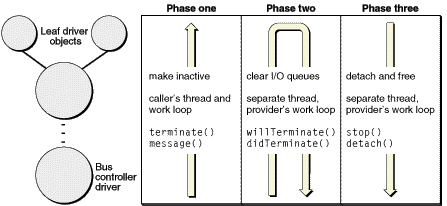

> 导航：[总目录](../../../README.md) · [documentation](../../../_indexes/documentation.md) · [IOKit Fundamentals](Introduction%20to%20I-O%20Kit%20Fundamentals.md)

[Next](Base%20and%20Helper%20Class%20Hierarchy.md)[Previous](Managing%20Power.md)

# Managing Device Removal

OS X is an operating system that includes hot-swapping as a feature. Users can plug in and remove external devices (for example, mass-storage drives, CD-RW drives, modems, and scanners) and the system immediately does what is necessary to make the device usable or, in the case of removal, to register the absence of the device. No system restart or shutdown is necessary.

This chapter describes how your driver should respond to the removal of its device.

When a user plugs a device into the system, the I/O Kit responds to the event using the normal process for discovering and loading drivers. A low-level driver scans its bus, notices a new device, and kicks off the matching process to find a suitable driver. The I/O Kit then loads the driver into the kernel and the device is usable.

When a user removes a device, however, the situation is different. A driver stack must be torn down rather than built up. Before the drivers in the stack can be released, they must, in a coordinated manner, stop accepting new requests and clear out all queued and in-progress work; this requires a special programming interface and procedure.

The I/O Kit performs an orderly tear-down of a driver stack upon device removal in three phases. The first phase makes the driver objects in the stack inactive so they receive no new I/O requests. The second phase clears out pending and in-progress I/O requests from driver queues. Finally, in the third phase, the I/O Kit invokes the appropriate driver life-cycle methods on drivers to clean up allocated resources and detach the objects from the I/O Registry before freeing them. [Figure 10-1](#apple-f4xwc4dqnrsv64tfmyxwi33df52wszbpkridambqgaydcmjninedemrtfvbecsskijeemqi) summarizes what happens during the three phases, including the calling direction within the driver stack.

__Figure 10-1__  Phases of device removal

Just as a bus controller driver scans its bus to detect a newly inserted device, it also detects devices that have just been removed. When this happens, it calls `terminate` on its client nub; the `terminate` method has the default behavior of making the called object inactive immediately. The `terminate` method is also recursively invoked on clients; it is called on each object in the stack above the bus controller until all objects in the stack are made inactive.

As a consequence of being made inactive, each object also sends its clients (or, in rare cases, providers) a `kIOServicesIsTerminated` message via the `message` method. When the `terminate` call returns to the original caller (the bus controller driver), all objects in the stack are inactive, but the stack is still attached to the I/O Registry.

The I/O Kit assumes that objects that have multiple providers (drivers of RAID devices, for instance) do not want to be torn down and thus does not call `terminate` on them. If these objects do want to receive the `terminate` message, they should implement the `requestTerminate` method to return `true`.

The `terminate` call is asynchronous to avoid deadlocks and, in this first phase, takes place in the thread and work-loop context of the caller, the bus controller driver.

The I/O Kit itself coordinates the second phase of the device-removal procedure. It starts with the newly inactive client of the bus controller driver and, as in the first phase, moves up the driver stack until it reaches the leaf objects. It calls the `willTerminate` method on each object it encounters. Drivers should implement the `willTerminate` method to clear out any queues of I/O requests they have. To do this, they should return an appropriate error to the requester for each request in a queue.

After `willTerminate` has been called on each object, I/O Kit then reverses direction, going from the leaf object (or objects) to the root object of the driver stack, calling `didTerminate` on each object. Certain objects at the top of the stack—particularly user clients—may decide to keep a count of I/O requests they have issued and haven’t received a response for (“in-flight” I/O requests). (To ensure the validity of this count, the object should increment and decrement the count in a work-loop context.) By this tracking mechanism, they can determine if any I/O request hasn’t been completed. If this is the case, they can implement `didTerminate` to return a deferral response of `true`, thereby deferring the termination until the final I/O request completes. At this point, they can signal that termination should proceed by invoking `didTerminate` on themselves and returning a deferral response of `false`.

If a driver attaches to a client nub and has it open, the I/O Kit assumes a deferred response (`true`) to `didTerminate`. The termination continues to be deferred until the client driver closes its provider.

At the end of this second phase, there shouldn’t be any I/O requests queued or “in flight.” The I/O Kit completes this phase of the device-removal procedure on its own separate thread and makes all calls to clients on the work-loop context of the provider.

In the third phase of the procedure for device removal, the I/O Kit calls the driver life-cycle methods `stop` and `detach` (in that order) in each driver object in the stack to be torn down, starting from the leaf object (or objects). The driver should implement its `stop` function to close, release, or free any resources it opened or created in its `start` function, and to leave the hardware in the state the driver originally found it. The driver can implement `detach` to remove itself from its nub through its entry in the I/O Registry; however, this behavior is the default, so a driver usually does not need to override `detach`. The `detach` method usually leads immediately to the freeing of the driver object because the I/O Registry typically has the final `retain` on the object.

The I/O Kit completes this phase of the device-removal procedure on its own separate thread and makes all calls to clients on the work-loop context of the provider.

[Next](Base%20and%20Helper%20Class%20Hierarchy.md)[Previous](Managing%20Power.md)

