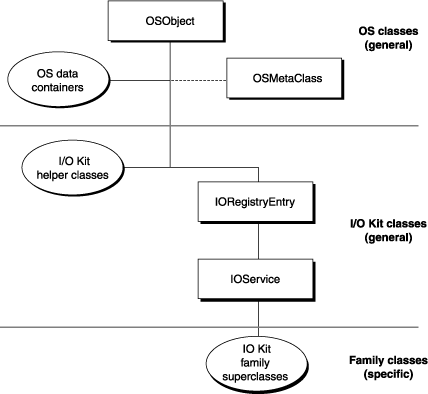
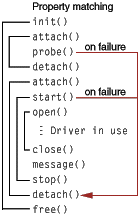

> 导航：[总目录](../../../README.md) · [documentation](../../../_indexes/documentation.md) · [IOKit Fundamentals](Introduction%20to%20I-O%20Kit%20Fundamentals.md)


[Next](I-O%20Kit%20Families.md)[Previous](Driver%20and%20Device%20Matching.md)

# The Base Classes

The I/O Kit is an object-oriented framework consisting primarily of dozens, if not hundreds, of C++ classes. These classes can be organized by virtue of their inheritance relationships in a class hierarchy. As with all class hierarchies, the I/O Kit’s can be depicted as an inverted tree, with childless nodes—classes without any subclasses—as the leaves of the tree. Carrying the analogy further, the classes at the trunk and, especially, the root of the tree are those that most classes of the hierarchy inherit from. These are the base classes.

[Figure 5-1](#apple-f4xwc4dqnrsv64tfmyxwi33df52wszbpkridambqgaydcnrnijauuq2kijbum) shows the general outline of the I/O Kit’s class hierarchy and the positions of the base classes within this hierarchy.

__Figure 5-1__  The base classes of the I/O Kit class hierarchy



As the diagram illustrates, the base classes specific to the I/O Kit are IOService and IORegistryEntry; also included as base classes—through inheritance—are the libkern library’s OSObject and (in a special sense) OSMetaClass.

Given the centrality of these classes, it is apparent how important it is to understand them. They provide not just the behavior and data structures that all other classes of the I/O Kit inherit. They define the _structure_ of behavior for kernel and driver objects: how objects are created and disposed of, how metaclass information is captured and revealed, how driver objects should behave within a dynamic runtime environment, and how the client/provider relationships among driver objects are dynamically established. If you’re writing device drivers using the I/O Kit, you’re going to have to deal with the base classes in your code early on and frequently thereafter, so it’s a good idea to become familiar with them.

This chapter also gives an overview of some generally useful functions and data types. Even though these functions and types do not properly belong in a discussion of base classes (since they are not affiliated with any class), their utility in a variety of circumstances makes them almost as central as any of the base classes.

The I/O Kit is built on top of the libkern C++ library, which is written in a subset of C++ suitable for use in loadable kernel modules. Specifically, the libkern C++ environment does not support multiple inheritance, templates, the C++ exception-handling facility, and runtime type information (RTTI). The C++ RTTI facility is omitted because it doesn’t support dynamic allocation of classes by name, a feature required for loading kernel extensions. RTTI also makes considerable use of exceptions. However, the libkern C++ environment defines its own runtime typing system, which does support dynamic loading.

Exceptions are forbidden in the kernel for reasons of both cost and stability. They increase the size of the code, thereby consuming precious kernel memory, and introduce unpredictable latencies. Further, because I/O Kit code may be invoked by many client threads, there’s no way to guarantee that an exception will be caught. Using `try`, `throw`, or `catch` in any kernel extension is not supported and will result in a compilation error. Although you can’t use exceptions in an I/O Kit driver, your driver should always check return codes where appropriate.

Apple highly recommends that you base all kernel C++ code, including that for device drivers, on the libkern base classes, OSObject and OSMetaClass, and observe the conventions prescribed by those classes (see [Type Casting, Object Introspection, and Class Information](#apple-f4xwc4dqnrsv64tfmyxwi33df52wszbpkridambqgaydcnrnkrifqusfiyytana)). Classes that are completely private to your driver need not be based on OSObject and need not follow these conventions. Such classes, however, will be limited in their interaction with libkern classes. For example, all libkern collection classes store objects that inherit from OSObject. Custom classes that don’t inherit from OSObject can’t be stored in libkern collections such as OSDictionary or OSArray objects.

OSObject is at the root of the extended I/O Kit hierarchy. It inherits from no (public) superclass, and all other libkern and I/O Kit classes (except for OSMetaClass) inherit from it. OSObject implements the dynamic typing and allocation features needed to support loadable kernel modules. Its virtual functions and overridden operators define how objects are created, retained, and disposed of in the kernel. OSObject is an abstract base class, and therefore cannot itself be instantiated or copied.

The standard C++ constructors cannot be used in libkern because these constructors use exceptions to report failures; as you may recall, the restricted form of C++ chosen for libkern excludes exceptions. So the main purpose of the OSObject class (and also of the OSMetaClass class) is to reimplement object construction.

For constructing objects, OSObject defines the `init`function and overrides the `new` operator. The `new` operator allocates memory for an object and sets the object’s reference count to one. After it uses the `new` operator, the client must call the `init` function on the new object to perform all initializations required to make it a usable object. If the `init` call fails, then the client must immediately release the object.

In support of OSObject’s `init` and `new`, the OSMetaClass class implements macros related to object construction. These macros bind a class into the kernel’s runtime typing facility and automatically define functions that act as the constructor and destructor for the class. See [Runtime Type Information (OSMetaClass)](#apple-f4xwc4dqnrsv64tfmyxwi33df52wszbpkridambqgaydcnrninfeerskivbuo) for more information on these macros and OSMetaClass’s implementation of RTTI.

Subclasses of OSObject do not explicitly implement their constructors and destructors since these are essentially created through the OSMetaClass macros. Moreover, you typically invoke neither constructor and destructor functions, nor the C++ `new` and `delete`operators. These functions and operators are reserved for use by the dynamic typing and allocation facilities, which implicitly define them for a class. In their place, OSObject defines a convention for creating and initializing objects. Subclasses do, however, typically override the `init` function to perform initializations specific to the class.

Most libkern and I/O Kit classes define one or more static functions for creating instances. The naming convention varies from class to class, but the name is usually either the base name of the class itself (with a lowercase first letter), or some form of `with...` where the name describes the initialization arguments. For example, OSArray defines the static creation functions `withCapacity`, `withObjects`, and `withArray`; IOTimerEventSource defines `timerEventSource`; and IOMemoryCursor defines `withSpecification`. If a class doesn’t have static creation functions, you must use `new` and then invoke the initialization method that takes the place of the C++ constructor, as shown in [Listing 5-2](#apple-f4xwc4dqnrsv64tfmyxwi33df52wszbpkridambqgaydcnrninbuiscbinfee)

For an overview of the boilerplate code you need to specify your class’s constructor and destructor functions, see [Type Casting, Object Introspection, and Class Information](#apple-f4xwc4dqnrsv64tfmyxwi33df52wszbpkridambqgaydcnrnkrifqusfiyytana)

OSObject defines a reference-counting and automatic-deallocation mechanism to support the safe unloading of kernel extensions. For this mechanism it uses three virtual member functions—`retain`, `release`, and `free`—and overrides the `delete`operator. Of these, the only functions you should call in your code are `retain` and `release`, and you should follow certain conventions that dictate when to call them.

Newly created objects and copied objects have a reference count of one. If you have created or copied a libkern object and have no need to keep it beyond the current context, you should call `release` on it. This decrements the object’s reference count. If that count is zero, the object is deallocated; specifically, the `release` method invokes the alternative destructor, named `free`, and finally invokes the `delete` operator. If you don’t own an object—that is, you did not create or copy it—and you want to keep it past the current context, call `retain` on it to increment its reference count. If you did not create, copy, or call `retain` on an object, you should never call `release` on it.

In addition, some functions that return objects pass ownership to the caller, meaning the caller must release the object when it is finished with it, while others don’t. See the reference documentation for a given function to find out if your code needs to retain or release an object it receives.

Never invoke the `delete` operator explicitly to free an object. Also, never call `free` directly to free an object; however, you may (and should, in most circumstances) override the `free` function to deallocate memory allocated in your `init` function.

Although libkern’s restricted form of C++ excludes the native runtime type information (RTTI) facility, OSMetaClass implements an alternative runtime typing facility that does support dynamic allocation of classes by name. OSMetaClass is not a base class in the true sense; no public libkern or I/O Kit class inherits from it. However, OSMetaClass provides APIs and functionality that are essential for object construction and destruction. OSMetaClass itself is an abstract class and cannot be directly constructed.

The functionality that OSMetaClass offers all libkern-based code includes the following:

- A mechanism for tracking the class hierarchy dynamically
- Safe loading and unloading of kernel modules

  The runtime typing facility enables the system to track how many instances of each libkern (and I/O Kit) class are currently extant and to assign each of these instances to a kernel module (KMOD).
- Automatic construction and deconstruction of class instances
- Macros and functions for dynamic type casting, type discovery, membership evaluation, and similar introspective behavior
- Dynamic allocation of libkern class instances based on some indication of their class type, including C-string names

In libkern’s runtime typing facility, one static metaclass instance (derivative of OSMetaClass) is created for every class in a kernel module (KMOD) loaded into the kernel. The instance encapsulates information on the class’s name, size, superclass, kernel module, and the current count of instances of that class. The process of loading a kernel module takes place in two phases, the first initiated by the `preModLoad` member function and the second by the `postModLoad` function. During the `preModLoad` phase, OSMetaClass statically constructs, within the context of a single, lock-protected thread, a metaclass instance for each class in the module. In the `postModLoad` phase, OSMetaClass links together the inheritance hierarchy of constructed metaclass objects, inserts the metaclass instances into the global register of classes, and records for each instance the kernel module it derived from. See the OSMetaClass reference documentation for more on `preModLoad`, `postModLoad`, and related functions.

The created store of metaclass information forms the basis for the capabilities of OSMetaClass listed above. The following sections explore the more important of these capabilities in some detail.

One of the features of OSMetaClass is its ability to allocate libkern objects based upon some indication of class type. Subclasses of OSMetaClass can do this dynamically by implementing the `alloc`function; the class type is supplied by the OSMetaClass subclass itself. You can also allocate an instance of any libkern class by calling one of the `allocClassWithName`functions, supplying an appropriate identification of class type (OSSymbol, OSString, or C string).

Freshly allocated objects have a retain count of 1 as their sole instance variable and are otherwise uninitialized. After allocation, the client should immediately invoke the object’s initialization function (which is `init` or some variant of `init`).

OSMetaClass defines a number of runtime type-declaration macros and object-construction macros based on the `alloc` function. Based on the type of class (virtual or otherwise), you must insert one of these macros as the first statement in class declarations and implementations:

**`OSDeclareDefaultStructors`**
: Declares the data and interfaces of a class, which are needed as runtime type information. By convention this macro should immediately follow the opening brace in a class declaration.

**`OSDeclareAbstractStructors`**
: Declares the data and interfaces of a virtual class, which are needed as runtime type information. By convention this macro should immediately follow the opening brace in a class declaration. Use this macro when the class has one or more pure virtual methods.

**`OSDefineMetaClassAndStructors`**
: Defines an OSMetaClass subclass and the primary constructors and destructors for a non-abstract subclass of OSObject. This macro should appear at the top of the implementation file just before the first function is implemented for a particular class.

**`OSDefineMetaClassAndAbstractStructors`**
: Defines an OSMetaClass subclass and the primary constructors and destructors for a subclass of OSObject that is an abstract class. This macro should appear at the top of the implementation file just before the first function is implemented for a particular class.

**`OSDefineMetaClassAndStructorsWithInit`**
: Defines an OSMetaClass subclass and the primary constructors and destructors for a non-abstract subclass of OSObject. This macro should appear at the top of the implementation file just before the first function is implemented for a particular class. The specified initialization routine is called once the OSMetaClass instance has been constructed at load time.

**`OSDefineMetaClassAndAbstractStructorsWithInit`**
: Defines an OSMetaClass subclass and the primary constructors and destructors for a subclass of OSObject that is an abstract class. This macro should appear at the top of the implementation file just before the first function is implemented for a particular class. The specified initialization routine is called once the OSMetaClass instance has been constructed at load time.

See [Type Casting, Object Introspection, and Class Information](#apple-f4xwc4dqnrsv64tfmyxwi33df52wszbpkridambqgaydcnrnkrifqusfiyytana) for more information on using these macros, including examples of usage.

OSMetaClass defines many macros and functions that you can use in almost any situation. They help you safely cast from one type to another, discover an arbitrary object’s class, determine if an object inherits from a given superclass, find out how many instances of a given class are still allocated, and yield other useful information. [Table 5-1](#apple-f4xwc4dqnrsv64tfmyxwi33df52wszbpkridambqgaydcnrninfeer2bindue) summarizes these macros and functions.

__Table 5-1__  OSMetaClass type-casting and introspection APIs

| Function or macro | Description |
| `OSTypeID` | This macro returns the type ID of a class based on its name. |
| `OSTypeIDInst` | This macro returns the type ID of the class a given instance is constructed from. |
| `OSCheckTypeInst` | This macro checks if one instance is of the same class type as another instance. |
| `OSDynamicCast` | This macro dynamically casts the class type of an instance to a suitable class. It is basically equivalent to RTTI’s `dynamic_cast`. |
| `isEqualTo` | This function verifies if the invoking OSMetaClass instance (which represents a class) is the same as another OSMetaClass instance. The default implementation performs a shallow pointer comparison. |
| `metaCast` (multiple) | This set of functions determines if an OSMetaClass instance (which represents a class) is, or inherits from, a given class type. The type can be specified as OSMetaClass, OSSymbol, OSString, or a C string. |
| `modHasInstance` | Returns whether a kernel module has any outstanding instances. This function is usually called to determine if a module can be unloaded. |
| `getInstanceCount` | This function returns the number of instances of the class represented by the receiver. |
| `getSuperClass` | This function returns the receiver’s superclass. |
| `getClassName` | This function returns the name (as a C string) of the receiver. |
| `getClassSize` | This function returns the size (in bytes) of the class represented by the receiver. |

When implementing a C++ class based on OSObject, you invoke a pair of macros based upon the OSMetaClass class. These macros tie your class into the libkern runtime typing facility by defining a metaclass and by defining the constructor and destructor for your class that perform RTTI bookkeeping tasks through the metaclass.

The first macro, `OSDeclareDefaultStructors` declares the C++ constructors; by convention you insert this macro as the first element of the class declaration in the header file. For example:

```
class MyDriver : public IOEthernetController
{
    OSDeclareDefaultStructors(MyDriver);
    /* ... */
};
```

Your class implementation then uses the companion macro, `OSDefineMetaClassAndStructors`, to define the constructor and destructor, as well as the metaclass that provides the runtime typing information. `OSDefineMetaClassAndStructors` takes as arguments the name of your driver and the name of its superclass. It uses these to generate code that allows your driver class to be loaded and instantiated while the kernel is running. For example, `MyDriver.cpp` might begin like this:

```c
#include "MyDriver.h"

// This convention makes it easy to invoke superclass methods.
#define super    IOEthernetController

// You cannot use the "super" macro here, however, with the
//  OSDefineMetaClassAndStructors macro.
OSDefineMetaClassAndStructors(MyDriver, IOEthernetController);
```

The definition of the `super`macro allows convenient access to superclass methods without having to type the whole name of the superclass every time. This is a common idiom of libkern and I/O Kit class implementations.

In place of the C++ constructor and destructor, your class implements an initialization method and a `free`method. For non–I/O Kit classes, the initialization method takes whatever arguments are needed, can have any name (although it usually begins with `init`), and returns a C++ `bool` value. The `free` method always takes no arguments and returns `void`.

The initialization method for your driver class should invoke the appropriate superclass initialization method before doing anything else, as shown in [Listing 5-1](#apple-f4xwc4dqnrsv64tfmyxwi33df52wszbpkridambqgaydcnrninbuiskgjfbuu) If the superclass returns `false`, your class’s initialization method should abort, release any allocated resources, and return `false`. Otherwise your class can perform its initialization and return `true`. When the libkern C++ runtime system creates an instance of a class, it zero-fills all of the member variables, so you don’t need to explicitly initialize anything to zero, false, or null values.

__Listing 5-1__  Implementing an init method

```
bool MyDriver::init(IOPhysicalAddress * paddr)
{
    if (!super::init()) {
        // Perform any required clean-up, then return.
        return false;
    }
    physAddress = paddr;  // Set an instance variable.
    return true;
}
```

To create an instance using the initialization method, you write code such as this:

__Listing 5-2__  Creating an instance and calling its init method

```swift
MyDriver * pDrv = new MyDriver; // This invokes the predefined constructor
                                //  of MyDriver itself

if (!pDrv) {
    // Deal with error.
}

if (!pDrv->init(memAddress)) {
    // Deal with error.
    pDrv->release();    // Dispose of the driver object.
}
```

Because this makes creating instances more cumbersome, you may want to write a convenience method in the manner of many of the kernel C++ classes, as for example:

```swift
MyDriver * MyDriver::withAddress(IOPhysicalAddress *paddr)
{
    MyDriver * pDrv = new MyDriver;


    if (pDrv && !pDrv->init(paddr)) {
        pDrv->release();
        return 0;
    }
    return pDrv;
}
```

Using this convenience method, you can create an instance of your driver with code like the following:

```
MyDriver * pDrv = MyDriver::withAddress(paddr);

if (!pDrv) {
    // Deal with error of not being able to create driver object.
}
else {
    // Go on after successful creation of driver object.
}
```

A class’s `free` method should release any resources held by the instance and then invoke the superclass’s `free` method, as in [Listing 5-3](#apple-f4xwc4dqnrsv64tfmyxwi33df52wszbpkridambqgaydcnrninbuirscifeuq):

__Listing 5-3__  Implementing the free function

```swift
void MyDriver::free(void)
{
    deviceRegisterMap->release();
    super::free();
    return;
}
```

Again, note that your code should never invoke `free` or the `delete` operator directly with objects based on the OSObject class. Always call `release` on such objects to dispose of them.

All driver objects based on the I/O Kit inherit from the two base classes IORegistryEntry and IOService. The second of these classes, IOService, directly inherits from IORegistryEntry and all driver objects ultimately inherit from IOService. The IORegistryEntry class defines a driver object as a node in the I/O Registry, and IOService defines the life cycle of a driver object as well as implementing other behavior common to drivers.

The close inheritance relationship between IORegistryEntry and IOService might invite speculation as to why these classes weren’t designed as one class. The reason is performance. Having IORegistryEntry as a superclass of IOService is an optimization because, in terms of memory footprint, the IORegistryEntry object is much more lightweight.

An IORegistryEntry object defines a node (or entry) in the I/O Registry. As the chapter [The I/O Registry](The%20I-O%20Registry.md#apple-f4xwc4dqnrsv64tfmyxwi33df52wszbpkridambqgaydcnbnkrids) explains in detail, the I/O Registry is a dynamic database that captures the current graph of “live” driver objects, tracking the client/provider relationships among these objects and recording the properties that describe their personalities. The I/O Registry plays an essential role in the dynamic features of OS X; when users add or remove hardware, the system uses the Registry in the driver-matching process and immediately updates it to reflect the new configuration of devices.

Each IORegistryEntry object has two dictionaries (that is, instances of OSDictionary) associated with it. One is the property table for the object, which is typically also a driver object. This property table is the matching dictionary that specifies one of the driver’s personalities. (See [Driver Personalities and Matching Languages](Driver%20and%20Device%20Matching.md#apple-f4xwc4dqnrsv64tfmyxwi33df52wszbpkridambqgaydcnjnijauurkjinbeo) for information on personalities.) The other dictionary of an IORegistryEntry object is the plane dictionary, which specifies how the object is connected to other objects in the registry.

In addition to reflecting all client/provider relationships among driver objects, the I/O Registry identifies subsets of these relationships. Both the totality of the Registry tree and the subsets of it are called __planes__. Each plane expresses a different provider/client relationship between objects in the I/O Registry by showing only those connections that exist in that relationship. Often the plane relationship is one of a dependency chain. The most general plane is the Service plane which displays the total hierarchy of registry entries. Every object in the Registry is a client of the services provided by its parent, so every object’s connection to its ancestor in the Registry tree is visible on the Service plane. In addition to the Service plane, there are the Power, Audio, Device, FireWire, and USB planes. For more information on planes, see [I/O Registry Architecture and Construction](The%20I-O%20Registry.md#apple-f4xwc4dqnrsv64tfmyxwi33df52wszbpkridambqgaydcnbninduorsjizcug)

It is possible to have an IORegistryEntry object that is not also an IOService object. Such an object could be used purely for holding information associated with that node in the Registry. However, there is little actual need for such objects.

The IORegistryEntry class includes many member functions that driver objects might find useful; these functions fall into several categories:

- Property-table functions allow you to set, get, and remove properties of an IORegistryEntry object’s property table as well as serializing property tables. Some `getProperty`functions perform a synchronized, recursive search through the Registry for the property of a given key.
- Positional functions let an IORegistryEntry object manipulate its position in the Registry tree. It can locate, identify, and attach to or detach from another IORegistryEntry object.
- Iteration functions enable your code to traverse the entire Registry tree, or a portion or it, and optionally invoke an “applier” callback function on IORegistryEntry objects encountered.

See the reference documentation for IORegistryEntry for details.

Every driver object in the I/O Kit is an instance of a class that ultimately inherits from the IOService class. IOService most importantly defines, through complementary pairs of virtual functions, a driver’s life cycle within a dynamic runtime environment. It manages the matching and probing process, implements default matching behavior, and registers drivers and other services. But the IOService class also provides a wealth of functionality for many other purposes, including:

- Accessing a driver’s provider, clients, state, and work loop
- Posting notifications and sending messages to other driver objects or services
- Managing power in devices
- Implementing user clients (device interfaces)
- Accessing device memory
- Registering and controlling interrupt handlers

This section first describes the life cycle of a driver object and IOService’s role in that life cycle. Then it summarizes each of the other major IOService APIs.

An I/O Kit driver can be loaded and unloaded, or activated and deactivated, at any time. Every driver’s life cycle follows the same pattern, as laid out in a set of functions defined by the standard driver superclass, IOService. Some of these functions must be implemented by the driver; others are implemented by IOService, but can be overridden by the driver for additional flexibility.

__Figure 5-2__  Driver object life-cycle functions



[Figure 5-2](#apple-f4xwc4dqnrsv64tfmyxwi33df52wszbpkridambqgaydcnrninduuq2hi5fei) shows the sequence of functions that gets invoked during the life of a driver object. The bracketing lines show how these functions are grouped into complementary pairs. A driver object class can override any of these functions, but must be sure to invoke the superclass’s implementation of that same function at the appropriate point in its own implementation. For example, when you override the opening function of a complementary pair, such as `init` or `start`, your version must invoke the corresponding function of its superclass before doing its own initialization, as shown in [Listing 5-1](#apple-f4xwc4dqnrsv64tfmyxwi33df52wszbpkridambqgaydcnrninbuiskgjfbuu) When you override a closing function, such as `free` or `stop`, you should perform your own cleanup before invoking the corresponding function in the superclass, as shown in [Listing 5-3](#apple-f4xwc4dqnrsv64tfmyxwi33df52wszbpkridambqgaydcnrninbuirscifeuq)

The first group of functions—`init`, `attach`, `probe`, and `detach`—is invoked during the process of driver matching and loading. This process occurs at boot time and at any time devices are added or removed. The following paragraphs summarize the matching process, paying special attention to the functions involved; see [Driver Matching and Loading](Driver%20and%20Device%20Matching.md#apple-f4xwc4dqnrsv64tfmyxwi33df52wszbpkridambqgaydcnjnkrifqusfiyytaoi) for an extended discussion of the process.

The matching process is kicked off when a service provider detects a device. Usually this provider is the controller driver for a bus (such as a PCI bus), which detects the device by scanning its bus. The provider (usually through its family) then creates and registers any required nubs by calling the IOService function, `registerService`; this call, in turn, triggers the matching process.

As orchestrated by IOService, the I/O Kit finds and loads a driver for a nub in three distinct phases, using a subtractive process. In each phase, drivers that are _not_ considered to be likely candidates for a match are subtracted from the total pool of possible candidates until a successful candidate is found. The phases are:

1. __Class matching__—the I/O Kit eliminates any drivers of the wrong provider (nub) class.
2. __Passive matching__—the I/O Kit examines the remaining drivers’ personalities for family-specific properties.
3. __Active matching__—IOService calls each of the remaining drivers’ `probe` functions with reference to the object the driver is being matched against. This function allows the driver to communicate with the device and verify that it can in fact drive that device. A probe score is returned that reflects how well suited the driver is to drive the device.

When a matching driver is found, its code is loaded and an instance of the principal class listed in the personality is created.

In the first two phases, none of the driver’s life-cycle functions is called. It is only during the third stage of active matching, when the driver is asked to probe a device for suitability, that the first group of functions is invoked.

Whether a driver is loaded to drive a device or is merely asked to probe it, the first life-cycle function invoked is `init`, which is the libkern equivalent of the constructor function for the class. For I/O Kit drivers, this function takes as its sole argument an OSDictionary containing the matching properties from the personality in the XML file. The driver can use this to determine what specific personality it’s been loaded for, determine the level of diagnostic output to produce, or otherwise establish basic operating parameters. However, I/O Kit drivers typically don’t override the `init` function, performing their initialization in later stages, as described below. For more on `init`, and the related `free` function, see [Object Creation and Disposal (OSObject)](#apple-f4xwc4dqnrsv64tfmyxwi33df52wszbpkridambqgaydcnrnijauusscireee)

Before a driver object can either probe or start, it must be attached into the I/O Registry. To do this, the nub invokes the driver’s `attach` function, which attaches the driver to the nub through the I/O Registry. The complementary function `detach` removes the driver from its nub. IOService gives both of these functions default implementations. A driver can override them, but rarely needs to do so.

If active matching is occurring, the nub next invokes the driver object's probe function. The probe function returns an IOService. This is usually the driver object itself, but the driver can return an instance of a different class, such as a specialized subclass included in the driver's kernel extension bundle. IOService's default implementation of probe simply returns the this pointer without altering the probe score. Overriding probe is optional; most drivers get enough information from property matching and don't need to override it. If you do override probe, however, you must make sure that the probe is not destructive, leaving the device in the state it found it. Hardware specifications generally define how to conduct non-destructive probes.

A driver’s `start`function, just as with implementations of `probe`, should perform only the minimum necessary allocation of system resources to verify that it can operate the hardware. This conservative approach delays consumption of kernel resources until they’re actually needed.

Each family, such as PCI, USB, or storage, defines a pair of activation and deactivation functions to indicate that the driver should prepare to service I/O requests and that the driver’s services are no longer needed. These two functions are typically named `open` and `close`. Most drivers implement these functions to allocate and deallocate all of the necessary buffers and other structures in preparation for I/O processing.

Some families define additional levels of activation and deactivation. A networking driver, for example, does very little in `open` and `close`, instead performing setup and teardown in the `enable` and `disable` functions. Whatever the specific activation and deactivation functions, they can be invoked many times during a driver’s life span; a driver should be able to function no matter how many times it gets activated or deactivated.

Another function that can be invoked many times during a driver’s life span is the `message`function. This function informs the driver of important system status changes, such as when a disk is forcibly removed, when a power management change (sleep, wake-up) is occurring, or when the driver is being shut down. IOService’s implementation of this function does nothing and returns an “unsupported” result code. For more on the notification and messaging functionality provided by IOService, see [Notification and Messaging](#apple-f4xwc4dqnrsv64tfmyxwi33df52wszbpkridambqgaydcnrnijauusshivcem)

When a driver is going to be permanently shut down, its `message` function is invoked with a terminate message (`kIOMessageServiceIsTerminated`). If the driver accepts the termination, its `stop` function is then invoked. The driver should implement its `stop`function to close, release, or free any resources it opened or created in its `start` function, and to leave the hardware in the state the driver originally found it. Assuming the driver implements the activation and deactivation functions, there is usually little to do in the `stop` function. The final stage of driver shutdown is invocation of `free`, which occurs when the driver object’s reference count reaches zero. In this function the driver can dispose of any resources it created in its `init` function.

If you are implementing a provider driver object (that is, a subclass that is a member of an I/O Kit family) you may want to override IOService’s `matchPropertyTable` member function. When IOService performs matching for a driver object, it calls this method so the provider class can implement its own specific matching criteria in addition to the generic ones provided by IOService. The provider should examine the matching dictionary passed to see if it contains properties the family understands for matching and use them to match with the specific driver object if it does understand them.

IOService provides two mechanisms for driver objects to communicate with each other and with the I/O Kit: notifications and messaging. Notifications are delivered to interested clients when a certain event occurs with an active service or driver that has properties matching a given dictionary. Messages are more targeted and flow in one direction, from provider to client. Any provider can send a message to any of its clients to notify it of some change in the runtime environment.

As discussed earlier in [Driver Object Life Cycle](#apple-f4xwc4dqnrsv64tfmyxwi33df52wszbpkridambqgaydcnrninbuir2biffee) driver clients implement the `message`function to receive and respond to messages from their providers. This function allows them to adapt to changes in the runtime environment. The messages can inform them of changes in system status, such as changes in power state, suspension of service, or impending service terminations. Providers implement the `messageClient`(or `messageClients`) functions to send messages by invoking their client’s `message` methods. The I/O Kit defines some messages while others may be defined by families. See the header file `Kernel.framework/Headers/IOKit/IOMessage.h` for the generic messages that the `messageClient` and `messageClients` functions can deliver to a driver.

The broadcasting of notifications is a bit more complicated. Any driver object can install a notification handler through the `addNotification` or `installNotification` functions. The notification handler is set up to be invoked when a specific driver object (identified by a dictionary of matching properties) experiences a specific type of state change, such as when a driver is first published, matched at any time, or is terminated. Each notification handler is also given a priority number in case multiple notifications of the same type and for the same object are triggered at the same time.

The notification handler (of type `IOServiceNotificationHandler`) is invoked if any driver object whose personality matches the supplied matching dictionary changes to the specified state. For example, when a service provider calls `registerServices`, that not only starts the registration process but it also delivers notifications to all registered clients interested in the publication of the provider. The notification request is identified by an instance of an IONotifier object, through which the notification can be enabled, disabled, or removed.

IOService includes, as a convenience, a number of accessor member functions giving quick access to a driver object’s state and the objects that are closely related to it. These functions return the following objects or values:

- The driver’s state (`getState`), a bitfield indicating whether the driver is inactive, registered, matched, and so on
- The work loop being used by the driver (`getWorkLoop`) (see [Handling Events](Handling%20Events.md#apple-f4xwc4dqnrsv64tfmyxwi33df52wszbpkridambqgaydcobnijauursgjjaui)) for further information)
- The driver’s primary provider (`getProvider`), as well as an OSIterator object for iterating over the driver’s providers, if multiple (for example, a RAID device)
- The driver’s primary client (`getClient`), as well as an OSIterator object for iterating over the driver’s clients, if multiple

IOService incorporates functionality (other than that summarized above) that is useful for many categories of device driver. Most notably, this functionality includes the following features:

- __User client__. The `newUserClient`function creates an IOUserClient-based connection for communication with a non-kernel client; the client invokes this function by calling the `IOServiceOpen`function of the I/O Kit framework.
- __Device memory__. Several IOService member functions get, map, and set the physical memory ranges allocated to a memory-mapped device. These functions are intended for driver objects that are clients of PCI devices.
- __Interrupt handling__. IOService provides low-level functions for registering, unregistering, manipulating, and accessing interrupt handlers that are called at primary-interrupt time for a device’s interrupt. The functions provide a mechanism for installing interrupt handlers that is not based on a work loop.

[Next](I-O%20Kit%20Families.md)[Previous](Driver%20and%20Device%20Matching.md)

