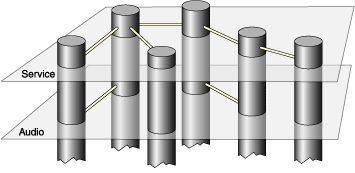
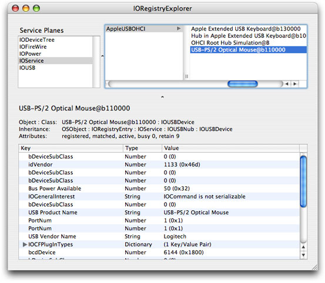

> 导航：[总目录](../../../README.md) · [documentation](../../../_indexes/documentation.md) · [IOKit Fundamentals](Introduction%20to%20I-O%20Kit%20Fundamentals.md)

[Next](Driver%20and%20Device%20Matching.md)[Previous](Architectural%20Overview.md)

# The I/O Registry

The I/O Registry is a dynamic database that describes a collection of “live” objects (nubs or drivers) and tracks the provider-client relationships between them. When hardware is added or removed from the system, the Registry is immediately updated to reflect the new configuration of devices. A dynamic part of the I/O Kit, the Registry is not stored on disk or archived between boots. Instead, it is built at each system boot and resides in memory.

The I/O Registry is made accessible from user space by APIs in the I/O Kit framework. These APIs include powerful search mechanisms that allow you to search the Registry for an object with particular characteristics. You can also view the current state of the Registry on your computer using applications provided with the developer version of OS X.

This chapter describes the I/O Registry architecture and the planes the Registry uses to represent relationships between objects. It also provides an overview of device matching and introduces applications that allow you to browse the Registry.

It is most useful to think of the I/O Registry as a tree: Each object is a node that descends from a parent node and has zero or more child nodes. The Registry follows the definition of a tree in nearly all respects, with the exception of a small minority of nodes that have more than one parent. The primary example of this situation is a RAID disk controller where several disks are harnessed together to appear as a single volume. Exceptional cases aside, however, viewing the Registry as a tree will help you visualize how it is constructed and updated.

At boot time, the I/O Kit registers a nub for the Platform Expert, a driver object for a particular motherboard that knows the type of platform the system is running on. This nub serves as the root of the I/O Registry tree. The Platform Expert nub then loads the correct driver for that platform, which becomes the child node of the root. The Platform driver discovers the buses that are on the system and it registers a nub for each one. The tree continues to grow as the I/O Kit matches each nub to its appropriate bus driver, and as each bus driver discovers the devices connected to it and matches drivers to them.

When a device is discovered, the I/O Kit requests a list of all drivers of the device’s class type from another dynamic database, the I/O Catalog. Whereas the I/O Registry maintains the collection of objects active in the currently running system, the I/O Catalog maintains the collection of available drivers. This is the first step in a three-step process known as driver matching that is described in [Driver and Device Matching](Driver%20and%20Device%20Matching.md#apple-f4xwc4dqnrsv64tfmyxwi33df52wszbpkridambqgaydcnjnkrids)

Information such as class type is kept in the driver’s information property list, a file containing XML-structured property information. The property list describes a driver’s contents, settings, and requirements in the form of a dictionary of key-value pairs. When read into the system, this information is converted into OS containers such as dictionaries, arrays, and other types. The I/O Kit uses this list in driver matching; a user application can search the I/O Registry for objects with specific properties in a process known as device matching. You can also view the property lists of your computer’s currently loaded drivers using I/O Registry Explorer, an application that displays the Registry.

Keeping the tree-like structure of the I/O Registry in mind, now visualize each node extending into the third dimension like a column. The two-dimensional Registry tree, with the Platform Expert nub at its root, is now visible on a plane that cuts perpendicularly through these columns. The I/O Kit defines a number of such planes (you can think of them as a set of parallel planes cutting through the columns at different levels). See [Figure 3-1](#apple-f4xwc4dqnrsv64tfmyxwi33df52wszbpkridambqgaydcnbnincumrsfijbeg) for an illustration of this structure.

__Figure 3-1__  Two planes in the I/O Registry

There are six planes defined in the I/O Registry:

- Service
- Audio
- Power
- Device Tree
- FireWire
- USB

Each plane expresses a different provider-client relationship between objects in the I/O Registry by showing only those connections that exist in that relationship. The most general is the Service plane which displays the objects in the same hierarchy in which they are attached during Registry construction. Every object in the Registry is a client of the services provided by its parent, so every object’s connection to its ancestor in the Registry tree is visible on the Service plane.

The other planes show more specific relationships:

- The Audio plane provides a representation of the audio signal chain that Core Audio framework and its plug-ins use to discover information about the audio signal paths between the system’s audio devices.
- The Power plane shows the power interdependencies between I/O Registry objects, allowing you to trace the flow of power from provider to client and discover which objects might be affected if a particular device is powered down.
- The Device Tree plane represents the Open Firmware device hierarchy.
- The FireWire and USB planes each represent the internal hierarchies defined by those standards.

It is important to remember the following points about planes in the I/O Registry:

- All I/O Registry objects exist on all planes, but on any individual plane, only those objects connected by the relationship defined by that plane are visible.
- A driver does not get attached to the Registry on any one particular plane. Instead it may participate in a plane’s connections if its provider-client relationships with other objects fit that plane’s definition.

The developer version of OS X provides an application called the I/O Registry Explorer that you can use to examine the configuration of devices on your computer. I/O Registry Explorer provides a graphical representation of the I/O Registry tree. By default, it displays the Service plane, but you can choose to examine any plane. The command-line equivalent, `ioreg`, displays the tree in a Terminal window. This tool has the advantage of allowing you to cut and paste sections of the tree if, for example, you want to send that information in an email message. You can get a complete description of the usage of `ioreg` by typing `man ioreg` at the shell prompt in the Terminal application.

When you open I/O Registry Explorer, a divided window appears with I/O Registry objects in the upper right, the six planes in the upper left, and the property list of the selected object in the lower half of the window. An object followed by a disclosure triangle indicates that it is a parent node. You can traverse the I/O Registry tree by clicking a parent node and dragging the scroller to the right to display its children. [Figure 3-2](#apple-f4xwc4dqnrsv64tfmyxwi33df52wszbpkridambqgaydcnbnincumssfivbui) shows an example of a property list in the I/O Registry Explorer window.

Commands in the Tools menu help you search the I/O Registry and examine its contents:

- __Dump Registry Dictionary to Output__ places the I/O Registry contents into the console log (viewable through the Console application in `/Applications/Utilities`) if the I/O Registry Explorer was opened from the Finder.
- __Inspector__ displays the property list of the currently selected object in ASCII form. Selecting a particular property in the main window causes its value to be displayed in the Inspector window.
- __Force Registry Update__ updates I/O Registry Explorer’s picture of the I/O Registry to reflect any changes that may have occurred since you first opened the application.
- __Find__ performs a case insensitive search on your input string and, if successful, displays the path to the occurrence of the string with object names separated by colons.

__Figure 3-2__  A sample I/O Registry Explorer window

[Next](Driver%20and%20Device%20Matching.md)[Previous](Architectural%20Overview.md)

