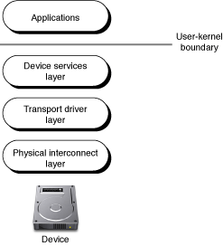
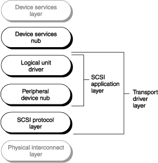
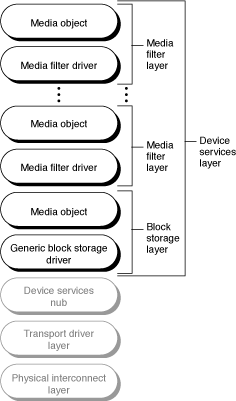
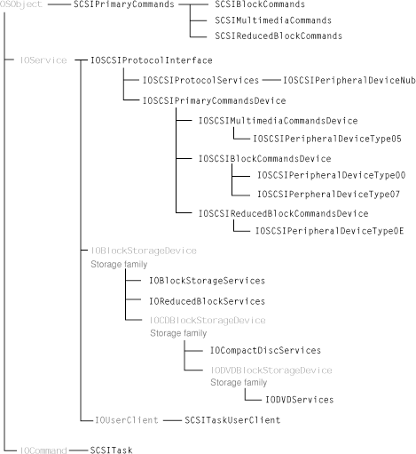
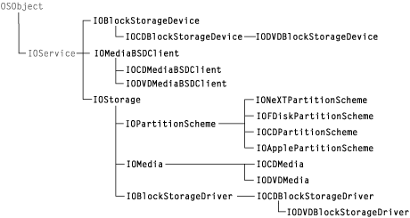
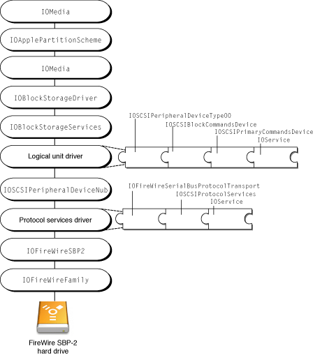
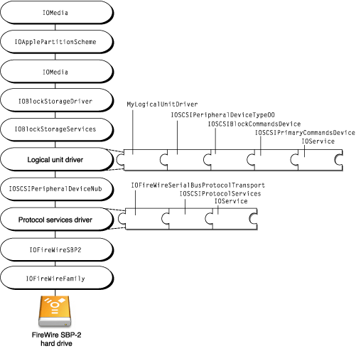
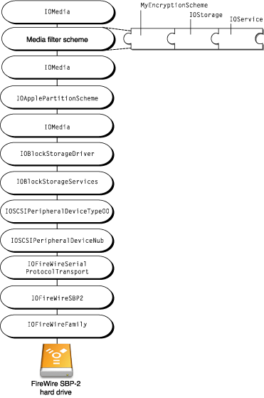

> 导航：[总目录](../../../README.md) · [documentation](../../../_indexes/documentation.md) · [Mass Storage Device Driver Programming Guide](Introduction%20to%20Mass%20Storage%20Device%20Driver%20Programming%20Guide.md)

[Next](Mass%20Storage%20Device%20Compliance.md)[Previous](Introduction%20to%20Mass%20Storage%20Device%20Driver%20Programming%20Guide.md)

# Mass Storage Overview

The term mass storage encompasses a wide range of devices. Broadly defined, a mass storage device is any storage device that has media local to a machine and can support a file system. OS X supports mass storage devices with a stack of drivers that manage the physical connection of the device to the bus, the translation of commands from the system to the device, and the device partitions that the user sees.

This chapter describes the construction and implementation of the mass storage driver stack. It also describes the SCSI Architecture Model family which implements the SCSI Architecture Model specifications in the transport driver layer and the Storage family which supports the device services layer.

The OS X mass storage driver stack represents a completely different model of mass storage device support from that in earlier versions of the Mac OS. Instead of a unique driver for every mass storage device, the OS X mass storage driver stack separates device communication into different layers that comprise separate drivers. Apple-provided drivers provide services such as event handling and hot-plugging support, allowing you to write a driver that supports only the different or additional functionality your device requires.

In OS X, ATA mass storage device drivers do not fully participate in the mass storage driver stack. A driver for an ATA mass storage device exists in a separate stack, providing the same functionality as the drivers in the lower layers of the mass storage driver stack. It does communicate with the device services layer, however, through an interface it provides.

The mass storage driver stack in OS X version 10.1 and later supports SCSI devices of peripheral device types $00, $05, $07, and $0E. This includes devices such as CD-ROM and DVD-ROM drives, flash cards, and magneto-optical devices. In later versions of OS X, however, the mass storage stack will include support for other SCSI peripheral devices, such as scanners. Until then, separate drivers outside the mass storage driver stack continue to provide support for these devices.

Traditionally, the term “SCSI” referred to the original parallel bus defined by the SCSI Architecture Model-1 and SCSI Architecture Model-2 specifications. With the introduction of Fibre Channel and Serial Storage Architecture (SSA), however, the SCSI Architecture Model-3 specification expanded the term to define an architecture that treats in a consistent manner devices that adhere to the SCSI Architecture Model specifications, independent of the physical bus the device is attached to.

In this document, the term “SCSI” refers to any physical bus (FireWire, ATAPI, parallel SCSI, or USB) or device that complies with the SCSI Architecture Model-2 specifications. This document refers to the original SCSI parallel bus technology as SCSI Parallel Interconnect (SPI) or parallel SCSI.

In versions of the Mac OS before OS X, mass storage I/O requests were serviced by a monolithic device driver that was responsible for every partition scheme, command set, and bus protocol associated with its device. There was a one-to-one correspondence between drivers and devices: A new device required a new driver, no matter how similar the new driver might be to a preexisting one. With the introduction of OS X, however, this device driver model was replaced by the I/O Kit, an object-oriented driver development framework emphasizing modularity and reusability.

In OS X, a driver for a mass storage device that mounts a file system or is bootable is a kernel extension, or KEXT. This KEXT inherits much of its functionality from an I/O Kit family that implements software abstractions common to all devices of a particular type.

In OS X, a single mass storage device driver is therefore no longer responsible for partition information, bus protocols, or parameter block controls because these details are handled by other objects in the mass storage driver stack. In addition, the complexities introduced by features of OS X such as its multithreaded kernel and hot-plugging support are handled by family code, freeing the driver to support the functions unique to its device or device type.

The I/O Kit’s concept of family provides the perfect framework for the implementation of the industry standard SCSI Architecture Model. The SCSI Architecture Model specifications ([http://t10.org](http://t10.org/)) provide guidelines for implementing a system across all SCSI interconnect and protocol environments. The SCSI Architecture Model specifications are in no way confined to parallel SCSI devices alone. Transcending SCSI hardware, the SCSI Architecture Model defines the functional partitioning of the SCSI command sets and protocol standards for devices that understand command descriptor blocks and adhere to the SCSI Architecture Model specifications, regardless of the physical bus they are attached to.

The SCSI Architecture Model family (described in [The SCSI Architecture Model Family](#apple-f4xwc4dqnrsv64tfmyxwi33df52wszbpkridgmbqgaydomzufvbeur2gjjdemsa)) implements the SCSI Architecture Model specifications in code abstractions that provide support for a wide range of devices across different buses. The Storage family (described in [The Storage Family](#apple-f4xwc4dqnrsv64tfmyxwi33df52wszbpkridgmbqgaydomzufvbeeq2kjfcuosa)) provides APIs that support access to the storage space represented by devices, independent of the underlying technology involved in the transport of data.

[The Mass Storage Driver Stack](#apple-f4xwc4dqnrsv64tfmyxwi33df52wszbpkridgmbqgaydomzufvbeur2djfdeeqi) gives an overview of the mass storage driver stack, concentrating on the architecture of the stack and introducing the interaction of its layers. Although it’s important to remember that the objects inhabiting these layers inherit from I/O Kit base classes and partake of functionality provided by I/O Kit families, it is equally important to avoid confusing the architecture of the driver stack with the “architecture” of the class hierarchy. To emphasize the distinction between the logical stacking of mass storage drivers and the I/O Kit class hierarchy of those drivers, the I/O Kit implementation of the driver stack is described separately in [Mass Storage Driver Objects](#apple-f4xwc4dqnrsv64tfmyxwi33df52wszbpkridgmbqgaydomzufvbeur2kizceqra).

The mass storage driver stack consists of three fundamental layers, shown in [Figure 1-1](#apple-f4xwc4dqnrsv64tfmyxwi33df52wszbpkridgmbqgaydomzufvbeoq2jifeuksa). The stack is oriented with the physical device at the bottom and the ultimate client of that device (the application or the system) at the top.

__Figure 1-1__  The mass storage driver stack

At the top of the figure, above the device services layer, is the user-kernel boundary. Applications reside above this boundary along with application-based drivers, like those for scanners, tape drives, and digital cameras.

On the kernel side of the boundary is the top layer of the mass storage stack, the device services layer. This layer contains the generic block storage driver and optional filter schemes that can implement encryption or validation.

The generic block storage driver views a mass storage device as simply a storage space with no knowledge of device command sets or physical interconnect protocols. The filter schemes view mass storage devices even more abstractly: Mass storage devices can contain media objects that may represent any subset of a device, such as a disk partition, or even a set of multiple devices, such as a RAID disk controller that harnesses several disks together to appear as a single volume.

It is not likely that you will need to subclass the generic block storage driver to support a particular device’s idiosyncrasies. A much better solution is to subclass a logical unit or protocol services driver in the transport driver layer. Creating a filter-scheme driver, however, is a good way to provide support for additional data manipulation your device may require. [The Device Services Layer](#apple-f4xwc4dqnrsv64tfmyxwi33df52wszbpkridgmbqgaydomzufvbeeq2jjfeeusq) describes this layer in more detail.

The middle layer of the mass storage stack is the transport driver layer. This layer comprises information about communicating with particular types of devices. I/O requests from the device services layer come into the transport driver layer where they are translated into commands suitable for the target device and then sent via the appropriate bus in the physical interconnect layer. The logical unit drivers and protocol services drivers from which you can subclass your device-specific and bus-specific drivers are in this layer. The transport driver layer itself is multilayered and is the focus of [The Transport Driver Layer](#apple-f4xwc4dqnrsv64tfmyxwi33df52wszbpkridgmbqgaydomzufvbeur2fjjbuusq).

The layer above the device is the physical interconnect layer. As its name suggests, this layer consists of a collection of objects that are associated with the connection of the device to the bus. The bus controller drivers for FireWire, USB, and ATAPI are here, along with objects representing the device and, in some cases, logical portions of the device.

Unless there are bus-related issues you need to address for your device, it is not likely that you will need to subclass any physical interconnect driver.

The transport driver layer transforms generic I/O requests into device-specific commands, suitable for transport on a particular bus. This layer (shown in [Figure 1-2](#apple-f4xwc4dqnrsv64tfmyxwi33df52wszbpkridgmbqgaydomzufvbeeq2kinceqqy)) consists of a link to the device services layer and two primary sublayers that accomplish the translation of I/O requests.

__Figure 1-2__  The transport driver layer

Between the device services layer and the transport driver layer proper is the device services nub. This nub presents the APIs the device implements and provides an attachment point between the block storage driver in the device services layer and the logical unit driver in the transport driver layer.

When a logical unit driver loads for a particular device, it publishes the corresponding device services nub which contains the device’s type in the I/O Registry so that the appropriate block storage driver can be loaded. Once the block storage driver loads, it communicates with the objects in the transport driver layer through the device services nub.

The main responsibility of the SCSI application sublayer is to translate generic I/O requests into device-specific commands. This is done in the logical unit driver specific to the type of device. The SCSI Architecture Model specifications define several device categories, called peripheral device types. For example, sequential access devices such as tape drives are defined as peripheral device type $01 and printers are defined as peripheral device type $02.

Because neither tape drives nor printers are bootable or mount file systems, their logical unit drivers do not need to be in the kernel. Logical unit drivers for peripheral devices such as CD-ROM drives that are bootable and do mount file systems, however, must reside in the kernel. Apple provides four logical unit drivers corresponding to peripheral device types $00, $05, $07, and $0E:

- `IOSCSIPeripheralDeviceType00` for block storage devices such as internal disk drives
- `IOSCSIPeripheralDeviceType05` for multimedia devices such as CD and DVD drives
- `IOSCSIPeripheralDeviceType07` for magneto-optical devices
- `IOSCSIPeripheralDeviceType0E` for reduced block command devices such as flash cards and smart media devices

The logical unit driver uses an associated utility class called a command set builder to create an object called `SCSITask`. The `SCSITask` object (described more fully in [The SCSITask Object](#apple-f4xwc4dqnrsv64tfmyxwi33df52wszbpkridgmbqgaydomzufvbeoq2ejbdussq)) contains the command descriptor block, or CDB, created from the generic I/O request together with all the data required during the life span of a single I/O transaction. This data includes information such as potential errors encountered, callback function pointers, and retry status. The `SCSITask` object is the fundamental unit of I/O transactions in the transport driver layer.

The other part of the SCSI application sublayer shown in [Figure 1-2](#apple-f4xwc4dqnrsv64tfmyxwi33df52wszbpkridgmbqgaydomzufvbeeq2kinceqqy) is the peripheral device nub. The function of the peripheral device nub is to determine what type of logical unit driver a particular device needs. When a device is discovered on the bus, the peripheral device nub queries it and publishes its device type in the I/O Registry so the appropriate logical unit driver can be loaded for it. After the peripheral device nub has fulfilled its function in the building of the mass storage driver stack, it is not involved in the subsequent processing of I/O requests.

The SCSI protocol sublayer contains physical interconnect protocol–specific information. The protocol services drivers, `IOUSBMassStorageClass`, `IOATAPIProtocolTransport`, and `IOFireWireSerialBusProtocolTransport`, are responsible for translating the `SCSITask` object received from the SCSI application sublayer into a bus-specific format. For example, a hard drive plugged into a FireWire SBP-2 bus understands the CDB inside the `SCSITask` object but the FireWire SBP-2 bus does not. In order to process the `SCSITask` object, the `IOFireWireSerialBusProtocolTransport` driver removes the CDB and other elements from the `SCSITask` object and repackages them in an operation request block (or ORB) that is understood by the FireWire SBP-2 bus.

The device services layer of the mass storage driver stack provides high-level support for random-access mass storage devices. The Storage family supports the device services layer and is responsible for sending generic I/O requests through the interface provided by the device services nub. The device services layer (shown in [Figure 1-3](#apple-f4xwc4dqnrsv64tfmyxwi33df52wszbpkridgmbqgaydomzufvbeeq2kizeugra)) consists of the block storage driver layer and an arbitrary number of media filter layers.

__Figure 1-3__  The device services layer

At the top of the device services layer are the optional media filter layers. Each media filter layer comprises a filter-scheme driver and the media object it publishes. A filter-scheme driver is both a provider and a client of media objects: It receives abstract mass storage I/O requests from its client, performs the required data or offset manipulation, and passes on the modified request to its provider.

There are four basic kinds of media filter schemes:

- One-to-one—A block-level encryption or compression scheme, for example, matches against one media object and produces one media object that represents the unencrypted or uncompressed content.
- One-to-many—A partition scheme, for example, matches against one media object and produces multiple media objects each representing the content of one partition.
- Many-to-one—A RAID scheme, for example, matches against multiple media objects and produces a single media object that represents the aggregate content.
- Many-to-many—A media filter driver matches against multiple media objects and produces multiple media objects.

The block storage layer consists of the generic block storage driver and the media object it publishes. When the generic block storage driver appropriate to the device type loads, it publishes a media object representing the device in the I/O Registry. In addition to representing the device, the media object presents an interface to the device with APIs implemented by the generic block storage driver. These APIs include `open`, `close`, `read`, and `write` functions that are appropriate to the device. The media object also has properties that reflect the properties of the device type it represents, such as natural block size and writability.

Between the device services layer and the transport driver layer proper, is the device services nub. This nub supplies the interface between the generic block storage driver in the device services layer and the device-specific logical unit driver in the transport driver layer.

When a logical unit driver loads for a mass storage device, it publishes the corresponding device services nub in the I/O Registry. The appropriate generic block storage driver matches on the device type published in the device services nub and loads. It then communicates all mass storage I/O requests across the interface the device services nub provides. This frees the generic block storage driver from all knowledge of the specific commands and mechanisms the transport driver layer objects employ to communicate with the device or bus.

The section [The Mass Storage Driver Stack](#apple-f4xwc4dqnrsv64tfmyxwi33df52wszbpkridgmbqgaydomzufvbeur2djfdeeqi) describes the mass storage stack in architectural terms with only superficial regard to its implementation. This section describes the object-oriented implementation of the objects in the stack and the I/O Kit families that support the device services layer and the transport driver layer.

The mass storage driver stack comprises I/O Kit objects that inherit from I/O Kit families. The I/O Kit defines a family as one or more C++ classes that implement software abstractions common to all devices of a particular type. A driver becomes a member of a family through inheritance: A driver’s class is almost always a subclass of some class in a family. Being a member of a family means that a driver inherits the instance variables (data structures) and behaviors that are common to all members of the family.

When a device is discovered on the bus, the I/O Kit finds and loads an appropriate driver for it, using a subtractive matching process (for more information on this process, see [Driver Personalities and the Matching Process](Mass%20Storage%20Driver%20Matching%20and%20Loading.md#apple-f4xwc4dqnrsv64tfmyxwi33df52wszbpkridgmbqgaydomzwfvbeeskejjfeora)). Loading the driver causes the driver’s family and all other objects the driver depends on to be loaded as well. The loading of the generic block storage driver, for example, causes the loading of the Storage family and all dependent classes, such as IOMedia.

The I/O Kit’s object-oriented approach to driver development provides a way to separate common functionality from specific functionality and achieve modular and reusable code. For example, if your device is a FireWire SBP-2 hard drive that complies with the SCSI Architecture Model specifications for block storage devices, the Apple logical unit driver `IOSCSIPeripheralDeviceType00` is sufficient to drive it. If, however, your hard drive implements its `read` command differently than the specification, you can simply subclass the `IOSCSIPeripheralDeviceType00` driver to create a new driver whose only function is to override the `read` command implementation.

Then, by placing properties that uniquely describe your device into your driver’s personality, your driver gets loaded when your device is discovered on the bus. Your driver then implements the `read` command, relying on the `IOSCSIPeripheralDeviceType00` driver to implement the remaining commands common to block storage devices. Similarly, the `IOSCSIPeripheralDeviceType00` logical unit driver relies on the SCSI Architecture Model family to implement functionality needed by all device drivers such as power management and work loops.

If you’re developing a filter-scheme driver that implements an encryption or validation scheme, the process is similar except that you do not subclass an existing filter-scheme driver. Instead, you subclass `IOStorage` and implement the appropriate methods to create a new filter scheme. Then, your disk utility program places a string that uniquely identifies your content into a partition. In your driver’s personality, you place the same string and when the I/O Kit initiates matching on the new media objects the partition scheme publishes, your driver matches and loads.

[Construction of a Mass Storage Driver Stack](#apple-f4xwc4dqnrsv64tfmyxwi33df52wszbpkridgmbqgaydomzufvbeur2gjjeuuqi) describes the building of an example mass storage driver stack and how a subclassed logical unit driver and a new filter-scheme driver fit in.

The SCSI Architecture Model family supports the transport driver layer of the mass storage driver stack. [Figure 1-4](#apple-f4xwc4dqnrsv64tfmyxwi33df52wszbpkridgmbqgaydomzufvbeoq2kijfeksi) illustrates the scope of the SCSI Architecture Model family by listing most of its leaf classes in a hierarchical inheritance chart.

__Figure 1-4__  SCSI Architecture Model family inheritance

At the top of the chart, inheriting from `SCSIPrimaryCommands`, are the three command set builder classes, `SCSIBlockCommands`, `SCSIMultimediaCommands`, and `SCSIReducedBlockCommands`. Each command set builder class corresponds to one of the shared command sets defined by the SCSI Architecture Model specifications: SCSI block commands, SCSI multimedia commands, and SCSI reduced block commands.

Each command set builder class implements every command listed in the corresponding shared command set specification. This allows the instantiated command set builder object to create a `SCSITask` object that is consistent with the shared command set specification the device is compliant with.

The base class for all logical unit drivers and protocol services drivers is `IOSCSIProtocolInterface`. This class provides the methods for sending, completing, and aborting commands.

Inheriting from `IOSCSIProtocolInterface` is the base class of the SCSI protocol sublayer, `IOSCSIProtocolServices`, and the peripheral device nub, `IOSCSIPeripheralDeviceNub`. The `IOSCSIProtocolServices` class provides the queueing model for sending commands across the physical interconnect. Some of the other methods the `IOSCSIProtocolServices` class provides are methods for accessing the `SCSITask` object and its attributes and methods that get information about the CDB inside the `SCSITask` object.

Although the protocol services drivers such as `IOFireWireSerialBusProtocolTransport` and `IOUSBMassStorageClass` inherit from the SCSI protocol sublayer base class, they are not considered to be part of the SCSI Architecture Model family and therefore do not appear in [Figure 1-4](#apple-f4xwc4dqnrsv64tfmyxwi33df52wszbpkridgmbqgaydomzufvbeoq2kijfeksi). Instead, they are considered to be members of specific protocol families such as the FireWire family or the USB family.

Also inheriting from `IOSCSIProtocolInterface` is `IOSCSIPrimaryCommandsDevice`, the base class of the SCSI application sublayer. Some of the methods this class provides are methods to get, manipulate, and release `SCSITask` objects and methods to get and release objects instantiated from the command set builder classes.

The three subclasses of `IOSCSIPrimaryCommandsDevice`, `IOSCSIMultimediaCommandsDevice`, `IOSCSIBlockCommandsDevice`, and `IOSCSIReducedBlockCommandsDevice`, correspond to three of the shared command sets defined in the SCSI Architecture Model specifications. The in-kernel logical unit drivers are subclasses of these three classes.

Although the device services nubs, `IOBlockStorageServices`, `IOReducedBlockServices`, `IOCompactDiscServices`, and `IODVDServices`, inherit from base classes in the Storage family, they are considered to be members of the SCSI Architecture Model family. These nubs export APIs from the device services layer to the transport driver layer. Each nub exports the API that corresponds to the device’s type. For example, the `IOCompactDiscServices` nub exports special methods for reading a disc’s table of contents, getting and setting the audio volume, and getting and setting disc speed.

Inheriting from `IOUserClient`, the `SCSITaskUserClient` class provides application-based drivers with access to devices that can be supported by SCSI Architecture Model drivers. The `SCSITaskUserClient` class provides device interfaces for device access (described in [SCSI Architecture Model Family Device Interfaces](#apple-f4xwc4dqnrsv64tfmyxwi33df52wszbpkridgmbqgaydomzufvbeoq2jjfbuqsa)) and should not itself be subclassed.

The `SCSITask` class, which inherits from `IOCommand`, provides methods to get and set the values of the `SCSITask` object’s attributes and populate the CDB, among many others. The `SCSITask` class should not be subclassed.

The SCSI Architecture Model family provides the logical unit and protocol services drivers access to CDBs through the `SCSITask` object. The `SCSITask` object is based on the SCSI command model, described in section 5 of the SCSI Architecture Model specification. The SCSI command model defines the format of the CDB and several status indicators relating to the execution of a SCSI command. The `SCSITask` object encapsulates these elements, giving you access to extensive information about the status of the command in addition to access to the CDB itself.

Status attributes of the `SCSITask` object include the following:

- Task attribute—defines how this task should be managed when determining order for queueing and submission to the appropriate device server.
- Task state—represents the current state of the task such as new, enabled, or blocked.
- Task status—represents the completion status of the task.

The `SCSITask` object also includes information such as the service response from the transport driver, the data transfer direction, and memory buffers. The header file defining the `SCSITask` object and its accessor methods is in `/System/Library/Frameworks/IOKit.framework/Headers/scsi-commands/SCSITask.h`.

The SCSI Architecture Model family provides a device interface mechanism that allows applications to send commands to mass storage devices that are controlled by SCSI Architecture Model family drivers. For more detailed information on how to use this device interface mechanism, see _[SCSI Architecture Model Device Interface Guide](../SCSI%20Architecture%20Model%20Device%20Interface%20Guide/Introduction%20to%20SCSI%20Architecture%20Model%20Device%20Interface%20Guide.md#apple-f4xwc4dqnrsv64tfmyxwi33df52wszbpkridimbqgaydsnzr)_.

There are two access modes available to applications: Exclusive and nonexclusive. Exclusive access consists of an application acting as the logical unit driver for a device. For example, if a tape drive is discovered on the FireWire bus, the peripheral device nub (described in [The Transport Driver Layer](#apple-f4xwc4dqnrsv64tfmyxwi33df52wszbpkridgmbqgaydomzufvbeur2fjjbuusq)) publishes device type $01 in the I/O Registry. There are no in-kernel logical unit drivers for that peripheral device type so the matching and loading process comes to a halt.

When an application-based driver for peripheral device type $01 launches, however, it finds the nub representing the tape drive in the I/O Registry and instantiates a `SCSITaskDeviceInterface` object. This gives the application unrestricted access to the device—in short, the application becomes the logical unit driver.

Nonexclusive access is available for authoring applications. If a CD or DVD drive is discovered, the I/O Kit finds and loads the in-kernel logical unit driver for peripheral device type $05 and the rest of the stack is built as usual. As long as no other client currently holds exclusive access to the device, an authoring application can gain nonexclusive access to the device by instantiating an `MMCDeviceInterface` object. It can then use device interface APIs to get information such as the amount of free space on the device.

If the authoring application later requires exclusive access to the device, for example, to burn a CD or DVD, it first reserves the media in the drive. Then it instantiates a `SCSITaskDeviceInterface` object and requests exclusive access. At this point, the in-kernel logical unit driver yields control to the application and the device services layer of the mass storage stack is torn down. The application then serves as the logical unit driver until it is closed, at which point the in-kernel logical unit driver regains control and the rest of the stack is rebuilt.

When an application has exclusive access to a device, it uses objects provided by a third device interface, the `SCSITaskInterface`, to manipulate the in-kernel `SCSITask` objects. Each `SCSITaskInterface` object corresponds to exactly one `SCSITask` object, allowing the application the same access to commands enjoyed by in-kernel logical unit drivers.

The Storage family supports the device services layer of the mass storage driver stack. [Figure 1-5](#apple-f4xwc4dqnrsv64tfmyxwi33df52wszbpkridgmbqgaydomzufvbeeq2fircugri) shows the Storage family in a hierarchical inheritance chart.

__Figure 1-5__  Storage family inheritance

At the top of the chart is the abstract class `IOBlockStorageDevice`. This class declares the interface to the underlying mechanisms of the transport driver layer that transport data to and from the represented storage space. Mass storage I/O requests pass through this interface without any involvement in the actual commands the transport driver layer objects use to communicate with the device. A transport family or driver subclasses `IOBlockStorageDevice`, implements the interface APIs, and instantiates a device services nub object. The generic block storage driver then drives this object, unconcerned with the device-specific and bus-specific objects below it.

The SCSI Architecture Model family declares two subclasses of `IOBlockStorageDevice`, the device services nubs `IOBlockStorageServices` and `IOReducedBlockServices`. These device services nubs relay generic requests from the generic block storage driver to the device-specific logical unit driver in the transport driver layer (for more information on this family, see [The SCSI Architecture Model Family](#apple-f4xwc4dqnrsv64tfmyxwi33df52wszbpkridgmbqgaydomzufvbeur2gjjdemsa)).

There are other families and drivers that subclass `IOBlockStorageDevice` to create nubs that provide the interface between device-specific transport drivers and the generic block storage driver. These include the ATA transport layer (`IOATABlockStorage`), the USB UFI transport layer, and the Disk Images transport layer.

The Storage family declares two subclasses of `IOBlockStorageDevice`: `IOCDBlockStorageDevice` and `IODVDBlockStorageDevice`. These subclasses provide the protocol for generic CD and DVD functionality, independent of the underlying physical interconnect protocol. The SCSI Architecture Model family subclasses `IOCDBlockStorageDevice` for the device services nub `IOCompactDiscServices` and subclasses `IODVDBlockStorageDevice` for the device services nub `IODVDServices`.

The `IOStorage` class is the common base class for both driver and media objects. It is an abstract class that declares the basic `open`, `close`, `read`, and `write` interfaces that its subclasses implement. The `read` and `write` interfaces provide byte-level access to the storage space. The `IOStorage` class also establishes the protocol media objects use to communicate with driver objects without needing media objects to be subclassed for each driver.

The `IOMedia` subclass of `IOStorage` is a random-access disk device abstraction. It provides a consistent interface for both real and virtual disk devices, for subdivisions of disks, such as partitions, and for supersets of disks, such as RAID volumes. The `IOMedia` class implements the appropriate `open`, `close`, `read`, `write`, and matching semantics for media objects. It has properties that reflect the properties of actual media, such as its total size in bytes and whether it is ejectable.

The subclasses of `IOMedia` provide properties, methods, and advanced interfaces that are specific to CD and DVD media objects. The `IOCDMedia` subclass includes properties such as the type of CD media object and its table of contents, and implements methods that read special areas of the CD. The `IODVDMedia` subclass includes properties that describe the type of DVD media object, such as DVD-ROM or DVD-R/W, and implements additional methods specific to DVDs.

The `IOMediaBSDClient` class publishes a BSD interface for all media objects. The `IOMediaBSDClient` driver represents `IOMedia` objects as device files in the OS X BSD execution environment. You can access these device files using BSD APIs such as `open`, `close`, `read`, `write`, and `ioctl`. The `ioctl` system call provides methods to determine various media properties and control various aspects of the media. The subclasses of `IOMediaBSDClient`, `IOCDMediaBSDClient` and `IODVDMediaBSDClient`, extend `ioctl` behavior to include CD-specific and DVD-specific functionality.

Partition-scheme drivers inherit from `IOPartitionScheme`, an abstract subclass of `IOStorage`. Apple provides the following partition schemes:

- `IOApplePartitionScheme`, the standard Apple partition-scheme driver
- `IOFDiskPartitionScheme`, the standard PC partition-scheme driver
- `IONeXTPartitionScheme`, the NeXT partition-scheme driver
- `IOCDPartitionScheme`, the partition-scheme driver for CD tracks that require treatment as partitions

The `IOPartitionScheme` class provides a basic framework for a partition-scheme driver that implements the appropriate `open` and `close` semantics for partition objects, and the default `read` and `write` interfaces. Although the `open`, `close`, `read`, and `write` implementations `IOPartitionScheme` provides are sufficient for simple partition schemes, more complicated schemes may need to perform more processing.

The `IOBlockStorageDriver` subclass of `IOStorage` is the common base class for generic block storage drivers. It extends the `IOStorage` protocol by implementing methods such as deblocking for unaligned transfers, polling for ejectable media, and statistics gathering and reporting. Because the `IOBlockStorageDriver` functions independently of the underlying device and bus transport protocols, you should not subclass it to handle device idiosyncrasies. A new type of generic device, however, might require the subclassing of the `IOBlockStorageDriver`.

The `IOCDBlockStorageDriver` subclass of `IOBlockStorageDriver` implements methods that support CD drives, such as getting information related to the table of contents and reading special areas of the disc. The `IODVDBlockStorageDriver` subclass of `IOCDBlockStorageDriver` implements methods that support DVD drives such as getting information related to the encryption and key for the drive.

A mentioned in [The Device Services Layer](#apple-f4xwc4dqnrsv64tfmyxwi33df52wszbpkridgmbqgaydomzufvbeeq2jjfeeusq), a filter scheme driver is both the client of an `IOMedia` object and the provider of `IOMedia` objects. If you’re interested in developing a filter-scheme driver you might assume that you need to subclass an existing partition scheme. This is unnecessary, however, because you can access your content within an existing partition. A partition-scheme driver, such as `IOApplePartitionScheme`, publishes a distinct `IOMedia` object for each partition’s contents. If you’ve placed your content within a partition, your filter-scheme driver can match on your unique identifier, contained in the content hint property of the `IOMedia` object representing that partition (see [Figure 1-9](#apple-f4xwc4dqnrsv64tfmyxwi33df52wszbpkridgmbqgaydomzufvbeeq2ejjeegra) for an example of how this might look). As a subclass of `IOStorage`, therefore, your filter-scheme driver can match directly on your content within a partition and avoid the I/O overhead and potential stale data issues associated with actively probing the media for your signature.

It's important to realize that a filter-scheme driver should never produce an `IOCDMedia` or `IODVDMedia` object, because these objects have provider requirements a filter-scheme driver would be unable to meet. For example, an `IODVDMedia` object has requirements specific to DVD media that only an `IODVDBlockStorageDriver` (or subclass) can meet. An `IOMedia` object, on the other hand, has more generic requirements that an `IOStorage` subclass (such as a custom filter-scheme driver) can meet. See [Developing a Filter Scheme](Developing%20a%20Filter%20Scheme.md#apple-f4xwc4dqnrsv64tfmyxwi33df52wszbpkridgmbqgaydomzzfvkfawcsivddcmbr) for information on how to implement a filter-scheme driver.

The Storage family provides a device interface to access `IOMedia` objects from applications using the BSD device interface. Each `IOMedia` object has a BSD client driver that produces a device node (in the form of `/dev/disk`) in the OS X BSD execution environment. Applications can use the `read` and `write` system calls to access the data represented by an `IOMedia` object and `ioctl` system calls to manipulate the special characteristics of devices.

Applications can use standard I/O Kit search and notification APIs to find specific `IOMedia` objects. An application searching for a CD, for example, can create a matching dictionary for the subclass `IOCDMedia` and, using properties the `IOMedia` object publishes, narrow the search to ejectable media only. An example of this process is in _[Device File Access Guide for Storage Devices](../Device%20File%20Access%20Guide%20for%20Storage%20Devices/Introduction%20to%20Device%20File%20Access%20Guide%20for%20Storage%20Devices.md#apple-f4xwc4dqnrsv64tfmyxwi33df52wszbpkridimbqgaydsnry)_.

This section describes how the mass storage driver stack is built up from the discovery of a specific device. Then, it shows how a subclassed logical unit driver and a new filter-scheme driver fit into the stack.

The illustrations in this section use a “puzzle piece” shape (shown in [Figure 1-6](#apple-f4xwc4dqnrsv64tfmyxwi33df52wszbpkridgmbqgaydomzufvbeoq2djjauqri)) to show the inheritance chain of each subclassed driver.

__Figure 1-6__  Subclasses inheriting from a base class

Inheritance runs from right to left: Each subclass locks onto its ancestor on its right edge and provides a projection for another (potential) subclass on its left edge.

The device in this example is a FireWire SBP-2 hard drive. [Figure 1-7](#apple-f4xwc4dqnrsv64tfmyxwi33df52wszbpkridgmbqgaydomzufvbeoq2jjbdecsa) shows the stack layers built up above the hard drive, with inheritance chains shown for the logical unit driver and the protocol services driver.

__Figure 1-7__  An example mass storage stack

When you plug in the hard drive, the FireWire bus controller in the physical interconnect layer discovers it and instantiates an `IOFireWireDevice` object. The `IOFireWireDevice` object scans the device’s configuration ROM and produces an `IOFireWireUnit` object for each unit directory in the device. The I/O Kit performs matching on the `IOFireWireUnit` and, since the hard drive is a FireWire SBP-2 device, instantiates an `IOFireWireSBP2Target` object.

The `IOFireWireSBP2Target` object scans the device’s configuration ROM and produces an `IOFireWireSBP2LUN` object for each logical unit it finds. After performing matching on the `IOFireWireSBP2Target` object, the I/O Kit instantiates the `IOFireWireSerialBusProtocolTransport` driver object.

The instantiation of the protocol services driver causes the instantiation of the peripheral device nub, which sends an inquiry command to the device. The response to this inquiry describes the device’s type and the peripheral device nub publishes a nub containing the key “peripheral device type 00” in the I/O Registry.

The I/O Kit performs matching on this nub, ultimately finding and loading the `IOSCSIPeripheralDeviceType00` driver. When the `IOSCSIPeripheralDeviceType00` driver object instantiates, the corresponding device services nub, `IOBlockStorageServices`, instantiates and initiates the matching process for the block storage driver.

When the matching block storage driver is found, it loads and publishes an `IOMedia` object that represents the whole device. The I/O Kit then finds and loads a partition-scheme driver that matches on the whole device. For Apple-formatted disks, this will probably be `IOApplePartitionScheme`. `IOApplePartitionScheme` then publishes an `IOMedia` object for each partition it finds.

Now, imagine you need to support a FireWire SBP-2 hard drive that implements the `read` command differently than as defined by the SCSI Architecture Model specifications. You subclass the `IOSCSIPeripheralDeviceType00` driver and override the `read` method. Because your driver should be loaded only for your device, you place matching information that uniquely identifies your device in your driver’s personality dictionary.

When the I/O Kit discovers your device, it builds the mass storage driver stack as before until it searches for a logical unit driver. The I/O Kit matching process gives the driver with the most matching keys the first chance to drive a device. Since your driver matches on vendor, product, and perhaps even software revision values associated with your device, the I/O Kit favors your driver over the `IOSCSIPeripheralDeviceType00` driver which matches only on the peripheral device type. Your driver loads, along with the SCSI Architecture Model family and other dependencies.

[Figure 1-8](#apple-f4xwc4dqnrsv64tfmyxwi33df52wszbpkridgmbqgaydomzufvbeoq2iizaueqq) shows the mass storage stack after your logical unit driver (named “MyLogicalUnitDriver”) matches and loads.

__Figure 1-8__  Adding a subclassed logical unit driver

Now suppose you want to implement an encryption scheme that works over any transport. This new encryption-scheme driver would match on an `IOMedia` object and produce another `IOMedia` object. To create the driver, you subclass `IOStorage` and implement the encryption and decryption behavior in the driver’s `read` and `write` methods. Because your filter-scheme driver should be loaded only for a partition containing your content, you place a content-hint string, of the form _MyCompany_MyContent_, in your driver’s personality.

Then, you make a disk utility program available so a user can format the disk to contain your encryption scheme. When the disk utility program reformats the disk, it also places your content-hint string in one of the partitions.

When the disk utility program completes its task, the partition-scheme driver publishes an `IOMedia` object for each partition. This causes an update to the I/O Registry. The I/O Kit then searches for a filter-scheme driver to match on the content-hint property in the new `IOMedia` object and it finds just one—your encryption-scheme driver.

Because your driver matches on the same content-hint string your disk utility program placed in the partition, there is no doubt that this is your content, so implementing the `probe` method is optional. If you don’t implement the `probe` method, by default it returns `true`.

When your encryption-scheme driver loads, it publishes an `IOMedia` object representing the unencrypted content on the media. [Figure 1-9](#apple-f4xwc4dqnrsv64tfmyxwi33df52wszbpkridgmbqgaydomzufvbeeq2ejjeegra) shows the mass storage driver stack after your driver, called “MyEncryptionScheme,“ loads.

__Figure 1-9__  Adding an encryption scheme

[Next](Mass%20Storage%20Device%20Compliance.md)[Previous](Introduction%20to%20Mass%20Storage%20Device%20Driver%20Programming%20Guide.md)

