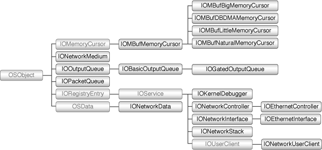
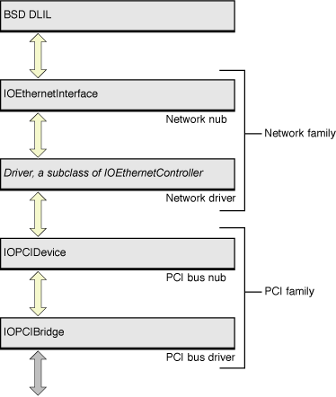
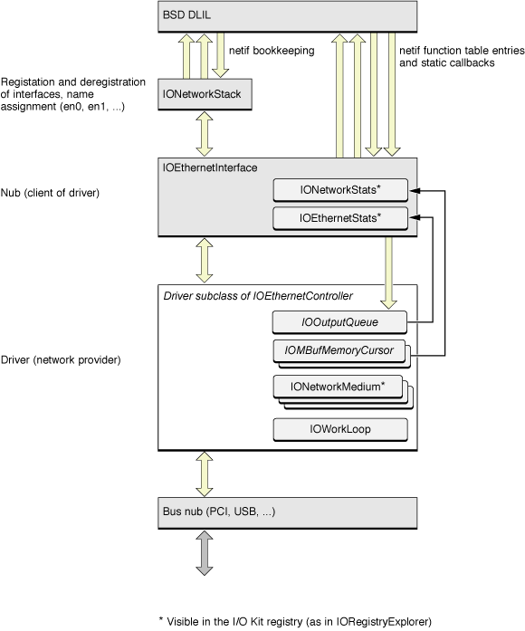

> 导航：[总目录](../../../README.md) · [documentation](../../../_indexes/documentation.md) · [Network Device Driver Programming Guide](Introduction%20to%20Network%20Device%20Driver%20Programming%20Guide.md)

[Next](Tips%20on%20Bringing%20Up%20a%20UNIX%20Network%20Driver.md)[Previous](Introduction%20to%20Network%20Device%20Driver%20Programming%20Guide.md)

# I/O Networking Family API

The network family defines a framework for building drivers of network controllers. It includes the superclasses for network drivers, which transfer network packets to and from the controller hardware, and for network interfaces, which serve as nubs connecting the BSD networking stack to the driver. Writing a driver involves creating a subclass of the appropriate superclass for a controller driver. The network family currently supports ethernet controllers, with an abstract superclass for controller drivers and a concrete interface class. It’s also possible to add support for new controller types, such as token ring or FDDI, by creating new classes for drivers and interfaces.

A network driver is a provider within the network family, but it is also a client of whatever bus the physical device connects to. The CDC Ethernet driver, for example, uses an IOUSBDevice nub to connect to the USB bus. For information on client setup, see the document appropriate for that device.

The network family comprises a small group of core driver and nub classes, along with a host of utility and helper classes. [Figure 2-1](#apple-f4xwc4dqnrsv64tfmyxwi33df52wszbpkridimbqgaydsmjtfvbuqmrqgiwuescjiveegrch) shows the inheritance hierarchy for the network family. The principal driver classes are IONetworkController, which is the superclass for any kind of network driver, and IOEthernetController, which is the superclass for an ethernet controller driver. A network controller object publishes a nub that forms an interface between the driver and the BSD Data Link Interface Layer, or DLIL. The superclass for a network interface is, IONetworkInterface; the IOEthernetInterface class defines the interface for ethernet controllers. You create a new interface class if you are extending the network family to add support for a new networking hardware protocol, such as FDDI.

__Figure 1-1__  Network family inheritance hierarchy

The remaining classes are mostly helpers or managers of data for the network controller and interface objects. An IONetworkStack object connects a network interface object to the BSD networking stack. The various IOMBufMemoryCursor classes work like the IOMemoryCursor classes used in the rest of the I/O Kit, but on BSD `mbuf_t` structures rather than on IOMemoryDescriptor objects. An IONetworkMedium describes a physical link medium of the hardware. IOOutputQueue and its subclasses, along with IOPacketQueue, perform packet queuing for network controller objects. IONetworkData is used to hold standard C structures used by the BSD networking layer so that I/O Kit driver can access them.

A few other classes are less relevant to most network drivers. An IOKernelDebugger object is used in place of a network interface object when a computer is being debugged through the Kernel Debugger Protocol (KDP). The drivers for the built-in network controllers on Macintosh computers include support for KDP; third-party drivers rarely need to support it. An IONetworkUserClient object gives user-space programs direct access to networking services. Since networking services are typically made available to the whole system, this class is also of less relevant for third-party network drivers.

A driver in the network family is a subclass of the abstract IONetworkController class, typically through an intermediate protocol-specific class such as IOEthernetController. [Figure 2-2](#apple-f4xwc4dqnrsv64tfmyxwi33df52wszbpkridimbqgaydsmjtfvbuqmrqgiwuescjjjauesse) shows a simplified view of the IORegistry stack for an ethernet driver. In this figure the driver is a client of the family representing the bus that the controller card uses, and a provider to a network interface object. In the same manner as IONetworkController, IONetworkInterface is the abstract superclass for interfaces, with subclasses for specific network protocols.

__Figure 1-2__  Network family objects in the IORegistry

The network interface object represents the generic interface to a given networking protocol. In its provider role, it offers a device-independent networking interface to the operating system, and in its client role it relies on the driver to implement its services. The network family currently includes an interface object class for the ethernet protocol. It is possible to add support for other protocols by creating new subclasses of the abstract controller and interface classes.

Above the network interface is the BSD data link interface layer (DLIL). The interface object presents itself to the DLIL as a standard BSD netif-style interface, providing the appropriate callbacks and invoking DLIL routines for handling network traffic. Drivers don’t interact with the DLIL, but interfaces do. If you’re extending the network family to add support for a new hardware protocol, you’ll need to interface with the DLIL. See _“Network Kernel Extensions Programming Guide”_for more information.

__Figure 1-3__  Network family objects used by a driver

The driver itself makes use of several other classes and structures defined by the network family and by the I/O Kit in general. These are shown in [Figure 2-3](#apple-f4xwc4dqnrsv64tfmyxwi33df52wszbpkridimbqgaydsmjtfvbuqmrqgiwuescjjfbeerkg), which presents a more complete picture of how a network driver interacts with these objects. The IOOutputQueue class defines an abstract interface for queuing packets to be transmitted; subclasses provide different locking and synchronization mechanisms. IOMBufMemoryCursor objects help the driver manage BSD `mbuf_t` structures, building scatter/gather lists and coalescing buffers as necessary. IONetworkMedium objects describe the physical link media of the hardware. The driver can collect statistics using two structures maintained by the network interface, IONetworkStats and a protocol-specific structure, in this case IOEthernetStats. As a driver that handles interrupts, a network driver typically creates its own IOWorkLoop object. An IONetworkStack object moderates the registration and deregistration of interfaces, assigning unique names as expected by BSD (such as `en0`) and performing other netif bookkeeping.

[Writing a Driver for an Ethernet Controller](Writing%20a%20Driver%20for%20an%20Ethernet%20Controller.md#apple-f4xwc4dqnrsv64tfmyxwi33df52wszbpkridimbqgaydsmjtfvbuqmrqgqwviubz) describes how to set up these structures for your network driver.

[Next](Tips%20on%20Bringing%20Up%20a%20UNIX%20Network%20Driver.md)[Previous](Introduction%20to%20Network%20Device%20Driver%20Programming%20Guide.md)

