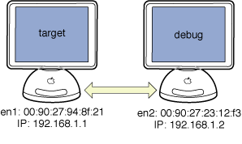

> 导航：[总目录](../../../README.md) · [documentation](../../../_indexes/documentation.md) · [Network Device Driver Programming Guide](Introduction%20to%20Network%20Device%20Driver%20Programming%20Guide.md)


[Next](Writing%20a%20Driver%20for%20an%20Ethernet%20Controller.md)[Previous](I-O%20Networking%20Family%20API.md)

# Tips on Bringing Up a UNIX Network Driver

If you’ve never brought up a network driver on a UNIX operating system before, you’ll want to learn about the tools you can use to set up interfaces, test packet transmission and reception, and gather information. Detailed documentation of these tools is outside the scope of this manual, but you can always use the UNIX `man` command to display the standard system manual pages in a Terminal window.

This chapter assumes you’re using two machines to bring up your driver, one that has your driver, and the other to act as a source or destination for network traffic. [Figure 3-1](#apple-f4xwc4dqnrsv64tfmyxwi33df52wszbpkridimbqgaydsmjtfvbuqmrqgmwuescjiveegrch) shows a typical setup, with the ethernet and IP addresses that will be used. The machine that contains your driver will be referred to as the target. The second machine is typically the machine you use to debug your driver, and will be referred to here as the debug host.

__Figure 2-1__  Two-machine target-debug setup



The IP addresses shown are merely examples. If you are debugging on the wider network (which is not recommended), you should use legal IP addresses for that network. If you are debugging over a private link between the two machines, you can choose any IP addresses, as long as you set up static address binding as shown below.

After you load your network driver using `kextload`, you have to find out which network interface name it was assigned, and then bring up a network link for that interface. You use the `ifconfig` program to do this. If you are using a dedicated link between two machines to avoid flooding the wider network, you may also have to bring up the dedicated link on the debug host.

To get a list of network interfaces, run `ifconfig` with the `-a` flag. The interface for your driver should be listed without an “inet” field, and with the ethernet address of the controller. Here’s an example for the target machine shown in [Figure 3-1](#apple-f4xwc4dqnrsv64tfmyxwi33df52wszbpkridimbqgaydsmjtfvbuqmrqgmwuescjiveegrch):

```
# ifconfig -a
lo0: flags=8009<UP,LOOPBACK,MULTICAST> mtu 16384
    inet 127.0.0.1 netmask 0xff000000
en0: flags=8863<UP,BROADCAST,b6,RUNNING,SIMPLEX,MULTICAST> mtu 1500
    inet 17.202.40.235 netmask 0xfffffc00 broadcast 17.202.43.255
    ether 00:05:02:3b:45:cb
en1: flags=822<BROADCAST,b6,SIMPLEX> mtu 1500
    ether 00:90:27:94:8f:21
```

In this case, the existing interface `en0` represents the built-in ethernet port on the computer. The interface `en1` represents the new driver being brought up. To bring up the link on the added interface, run `ifconfig` on it with an IP address and a netmask, and specify `up`, as shown here:

```
# ifconfig en1 inet 192.168.1.1 netmask 255.255.255.0 up
```

When you run `ifconfig` with the `up` argument, you are directly calling the device driver’s `enable` function. This function will be described in depth in [Writing a Driver for an Ethernet Controller](Writing%20a%20Driver%20for%20an%20Ethernet%20Controller.md#apple-f4xwc4dqnrsv64tfmyxwi33df52wszbpkridimbqgaydsmjtfvbuqmrqgqwviubz).

If you are using a private link, and have not configured the debug machine to set up its link at startup, you can use `ifconfig` on it as well. With the example setup, the command would look like this:

```
# ifconfig en2 inet 192.168.1.2 netmask 255.255.255.0 up
```

To make some aspects of testing easier, you may want to set up static IP address binding for the two machines. Normally this task is performed automatically by your computer, but if your network driver is not transmitting and receiving packets, the binding will never complete. You do this by running the `arp` command on each machine, giving the IP address and the hardware address for the other machine. Based on the examples above, on the target host you would enter this command:

```
# arp -s 192.168.1.2 00:90:27:23:12:f3
```

And on the debug host you would enter this command:

```
# arp -s 192.168.1.1 00:90:27:94:8f:21
```

With that, you have a network connection between the two systems, which you can use to test your driver.

While developing your driver, you will want to test that either receiving or transmitting is working before both are. Since your driver is not yet capable of handling round-trip network traffic, you have to use different tools to check these two cases. You will likely be using plenty of logging in your driver as well to make sure things are working as you expect.

To verify that your driver is receiving packets, you can use the `ping` utility from the debug host to send packets to the target machine, and use logging in the driver’s packet-reception code to verify that packets are being received. Running `ping` normally performs an ARP request to get the hardware address for the target. If your driver can’t transmit yet, `ping` will fail if you did not set up a static IP address binding with the `arp` command. If you do not want to set up a static IP address binding, you can run `ping` on the broadcast address for the private network, bypassing address resolution.

To verify that your driver is sending packets, you can use `ping` on the target machine to send packets to the debug host. If your driver does not yet support receiving, you can use the `tcpdump` utility on the debug host to verify that packets are coming from the target machine. To do this, specify the `-v` flag for verbose output, and the `-i` flag to name the interface to examine.

If the debug machine is connected to the target on the interface `en2`, for example, you would enter this command:

```
# tcpdump -v -i en2
```

With `tcpdump` running, you can start `ping` on the target machine and examine the output of `tcpdump` on the debug host. If there is no output, your driver is not transmitting. If there is output, verify that the IP address for your driver’s network interface on the target system appears in the output. If it does, your driver is successfully transmitting packets.

Once your driver can both receive and transmit, you can just use `ping` without setting up static IP address binding, and perform tests to verify data integrity.

If you implement general statistics-gathering in your network driver, you can verify that it is working with the `netstat` program. Run this program with the `-I` flag, followed by the name of your driver’s network interface. Here is an example:

```
% netstat -I en1
Name  Mtu   Network     Address           Ipkts Ierrs    Opkts Oerrs  Coll
en1   1500  <Link>    00.90.27.94.8f.21      17     0       19     0     0
en1   1500  192.168.1   192.168.1.1          17     0       19     0     0
```

The output shows that the driver has received 17 packets (Ipkts, or incoming packets) and transmitted 19 (Opkts, or outgoing packets). See the UNIX man page for `netstat` for more information.

Once you have enabled IP communication on a device using `ifconfig`, the IP protocol is attached to your driver inside the kernel’s networking stack. (See _[Network Kernel Extensions Programming Guide](../../Darwin/Network%20Kernel%20Extensions%20Programming%20Guide/Introduction%20to%20Network%20Kernel%20Extensions%20Programming%20Guide.md#apple-f4xwc4dqnrsv64tfmyxwi33df52wszbpkridimbqgaytqnjy)_ for more information about the networking stack.) Once a protocol is attached, your driver cannot be unloaded until you detach the protocol.

To detach the IP protocol from your network device, you can issue the following command from the command line:

```
ipconfig set en1 NONE
```

Substitute the appropriate interface name instead of `en1`, of course. This will disable IP networking for the interface. You can then unload the driver KEXT using `kextunload`.

For more information, see the manual pages for `ipconfig(8)` and `kextunload(8)`.

[Next](Writing%20a%20Driver%20for%20an%20Ethernet%20Controller.md)[Previous](I-O%20Networking%20Family%20API.md)

