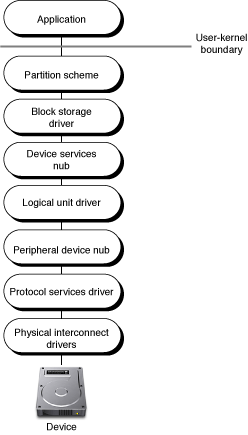
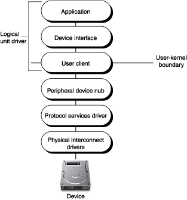
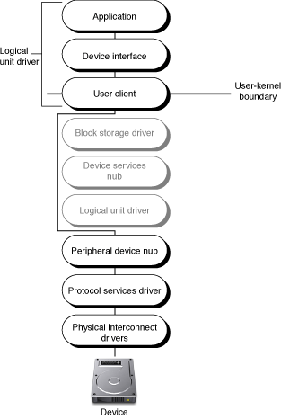

> 导航：[总目录](../../../README.md) · [documentation](../../../_indexes/documentation.md) · [SCSI Architecture Model Device Interface Guide](Introduction%20to%20SCSI%20Architecture%20Model%20Device%20Interface%20Guide.md)


[Next](Document%20Revision%20History.md)[Previous](Accessing%20SCSI%20Parallel%20Devices.md)

# Accessing SCSI Architecture Model Devices

For devices supported by SCSI Architecture Model family drivers, the SCSI Architecture Model family provides two types of device interface, one for exclusive access to the device and one for nonexclusive access to media-mastering devices only. This chapter focuses on how to use these device interfaces to communicate with devices supported by SCSI Architecture Model family drivers and includes sample code that illustrates how to gain access to a CD-R/W drive.

If you need to access a SCSI Parallel device _and_ your application must run in versions of OS X prior to v10.2, see [Accessing SCSI Parallel Devices](Accessing%20SCSI%20Parallel%20Devices.md#apple-f4xwc4dqnrsv64tfmyxwi33df52wszbpkridgmbqgaydgobwfvbecsseiffeisq) for information on how to use the API of both the SCSI Architecture Model family and the deprecated SCSI family to find your device. (Note that the APIs of the deprecated SCSI family will not work in an Intel-based Macintosh.)

Although the sample code in this document has been compiled and tested, it is not intended to meet the needs of a commercial application. For example, error handling is minimal and simply facilitates debugging of this code—you should develop your own techniques for detecting and handling errors. In addition, you must employ your own method of disk arbitration. Therefore Apple does not recommend that you directly incorporate the entire sample program into a commercial application.

The SCSI Architecture Model family supports peripheral devices that comply with both the SCSI Primary Commands specification, or SPC, and one of the following bus transport protocols:

- The ATA/ATAPI-5 specification ([http://t13.org](http://t13.org/))
- The FireWire SBP-2 specification ([http://t10.org](http://t10.org/))
- The USB Mass Storage Class specification ([http://www.usb.org](http://www.usb.org/))
- The SCSI Parallel specification (SPI-4)

The SCSI Architecture Model family provides in-kernel logical unit drivers that translate generic I/O requests into device-specific commands for devices on these buses that declare one of the following four peripheral device types:

- $00 for block storage devices that comply with the SCSI block commands specification
- $05 for multimedia devices that comply with the SCSI multimedia commands specification
- $07 for magneto-optical devices that comply with the SCSI block commands specification
- $0E for reduced block command devices that comply with the SCSI reduced block commands specification

For devices that declare other peripheral device types, such as scanners, tape drives, and medium changers, the SCSI Architecture Model family provides a device interface, called the SCSITaskDeviceInterface, that allows an application to be the logical unit driver for that device.

The SCSI Architecture Model family also provides access to authoring devices that are supported by in-kernel logical unit drivers. The device interface for multimedia commands, called the MMCDeviceInterface, allows an application to gain nonexclusive access to an authoring device. This allows the application to get information about the device prior to obtaining exclusive access to it with the SCSITaskDeviceInterface.

The SCSI Architecture Model family provides a third interface, called the SCSITaskInterface, that allows an application acting as a logical unit driver to manipulate the in-kernel SCSITask object. The SCSITask object contains the command being sent to the device, together with information such as task status and callback function pointers.

By design, OS X does not allow applications to send SCSI or ATA commands to storage devices unless the application developer also provides an in-kernel device driver that supports the commands. The SCSI Architecture Model family allows only one logical unit driver to control a device at a time and provides in-kernel logical unit drivers for storage devices (as listed in [SCSI Architecture Model Family Device Support](#apple-f4xwc4dqnrsv64tfmyxwi33df52wszbpkridgmbqgaydgobxfvbeeskejbaumsi)). Similarly, the ATA family does not allow applications to send ATA commands directly to ATA or SATA (Serial ATA) devices. This design preserves the integrity of the operating system and enhances the security of the user's data in two ways:

- An arbitrary application cannot directly change the state of a device without the explicit cooperation of a developer's custom in-kernel logical unit driver.
- An application cannot bypass the file-system permissions set by the user by sending I/O commands directly to a storage device.

Both the SCSI Architecture Model family and the ATA family provide device interfaces that allow applications various types of access to devices. The remaining sections in this chapter describe the device interfaces the SCSI Architecture Model family provides to allow an application to send commands to specific device types. The ATA family provides a device interface that allows applications to get SMART (self-monitoring, analysis, and reporting technology) data from ATA and SATA devices that implement the SMART feature set. For more information on this device interface, see the API reference documentation for `ATASMARTLib.h` in _[I/O Kit Framework Reference](https://developer.apple.com/documentation/iokit)_.

If your application needs information available from a SCSI `INQUIRY` or ATA `IDENTIFY DEVICE` command, however, you do not need to send commands to the device or use a device interface. Much of the information provided by the `INQUIRY` and `IDENTIFY DEVICE` commands is available in the I/O Registry, which you can view with the I/O Registry Explorer application (in /`Developer/Applications)` or the command-line tool `ioreg`.

If your application needs to perform block-level I/O operations on a storage device, you can access the BSD raw disk device node in `/dev`. For more information on how to do this, see _[Device File Access Guide for Storage Devices](../Device%20File%20Access%20Guide%20for%20Storage%20Devices/Introduction%20to%20Device%20File%20Access%20Guide%20for%20Storage%20Devices.md#apple-f4xwc4dqnrsv64tfmyxwi33df52wszbpkridimbqgaydsnry)_.

If you decide that your application must send SCSI or ATA commands to devices not supported by the device interfaces provided by the SCSI Architecture Model and ATA families, you will need to write a custom in-kernel logical unit driver. If you do create your own in-kernel logical unit driver, be sure you don't send `READ` or `WRITE` commands from the driver. If you send these commands, you create a security hole malicious code can take advantage of by using your driver to read or destroy data on a device that a user has protected by setting access permissions. For more information on how to write a custom in-kernel logical unit driver, see _[Mass Storage Device Driver Programming Guide](../Mass%20Storage%20Device%20Driver%20Programming%20Guide/Introduction%20to%20Mass%20Storage%20Device%20Driver%20Programming%20Guide.md#apple-f4xwc4dqnrsv64tfmyxwi33df52wszbpkridimbqgaydsnzu)_ and the code sample _[VendorSpecificType00](../../../samplecode/VendorSpecificType00/VendorSpecificType00.md#apple-f4xwc4dqnrsv64tfmyxwi33df52wszbpirkfgmjqgaydanbtgm)_.

When a device is discovered on OS X, the I/O Kit finds and loads the drivers required to support it. In the case of a SCSI Architecture Model peripheral device that declares a peripheral device type of $00, $05, $07, or $0E, the I/O Kit loads several layers of drivers. Together, these layers are known as the mass storage driver stack (for more in-depth information about the mass storage driver stack, see [Introduction to Mass Storage Device Driver Programming Guide](https://developer.apple.com/library/archive/documentation/DeviceDrivers/Conceptual/MassStorage/01_Introduction/Introduction.html#//apple_ref/doc/uid/TP30000733)).

The mass storage driver stack is divided into three main layers.

- The physical interconnect layer includes physical interconnect drivers that support the physical connection of the device to the bus.
- The transport driver layer includes the logical unit driver and protocol services driver that translate generic I/O requests into device-specific commands suitable for transport across a particular bus.
- The device services layer includes the block storage driver which supports generic system requests and optional filter drivers that can implement encryption or validation schemes.

[Figure 2-1](#apple-f4xwc4dqnrsv64tfmyxwi33df52wszbpkridgmbqgaydgobxfvbegskejfcuuqq) shows the mass storage driver stack supporting a mass storage device that declares a peripheral device type of $00, $05, $07, or $0E.

__Figure 2-1__  The mass storage driver stack



The SCSI Architecture Model family supports the transport driver layer. It provides the logical unit driver that translates generic system requests into commands specific to the SCSI command set the device is compliant with and the protocol services driver that packages the commands from the logical unit driver into the format the bus expects.

The SCSI Architecture Model family enforces an exclusive-access policy for logical unit drivers. This means that there can be only one logical unit driver for each logical unit of a device. This applies to both in-kernel and application-based logical unit drivers.

When a device declaring a peripheral device type of $00, $05, $07, or $0E is discovered on one of the supported buses, the I/O Kit first finds and loads the appropriate physical interconnect drivers and protocol services driver. Then, an I/O Kit nub object, called the peripheral device nub, queries the device and publishes its peripheral device type in the I/O Registry. The I/O Kit then finds and loads the logical unit driver that matches the published peripheral device type.

Another I/O Kit nub object, called the device services linkage object, then publishes the logical unit driver’s type in the I/O Registry. If the device is authoring-capable, the SCSI Architecture Model family publishes the `SCSITaskDeviceCategory` key in this nub object. This key, with the value `SCSITaskAuthoringDevice`, indicates that the MMCDeviceInterface is available for the device. The SCSI Architecture Model family also adds a globally unique identification value (or GUID) to the nub that an application can use to identify the device.

Next, the I/O Kit finds and loads the block storage driver, and, if the device is a CD-ROM or DVD-ROM with media present, it loads a CD or DVD partition scheme. The device is then ready to process I/O requests from the host system.

When a device that declares a peripheral device type other than $00, $05, $07, or $0E is discovered on a supported bus, the I/O Kit begins the matching and loading process described in [SCSI Architecture Model Devices on OS X](#apple-f4xwc4dqnrsv64tfmyxwi33df52wszbpkridgmbqgaydgobxfvbegskkjjcuoqy).

As before, the peripheral device nub publishes the peripheral device type reported by the device. Because the peripheral device type is _not_ $00, $05, $07, or $0E, the SCSI Architecture Model family adds the GUID and the `SCSITaskDeviceCategory` key with the value `SCSITaskUserClientDevice` to the peripheral device nub. This key-value pair indicates that an application can use the SCSITaskDeviceInterface to drive the device.

Because there are no in-kernel logical unit drivers that match on a peripheral device type other than $00, $05, $07, or $0E, the building of the driver stack halts after the peripheral device nub is published. [Figure 2-2](#apple-f4xwc4dqnrsv64tfmyxwi33df52wszbpkridgmbqgaydgobxfvbegskfjfdumqy) shows the mass storage driver stack when an application-based driver is the logical unit driver for a device that declares a peripheral device type of $01.

__Figure 2-2__  An application-based logical unit driver



When an application-based driver for a device with no in-kernel logical unit driver starts, it searches the I/O Registry for the device or device type it can drive. When it finds the device, it acquires a SCSITaskDeviceInterface and the application becomes the logical unit driver for the device.

Because the application has exclusive access to the device, the device has no other clients and the device services layer of the mass storage driver stack is unnecessary.

When an authoring or media-mastering device, such as a CD-R/W or DVD-R/W, is discovered on a supported bus, the I/O Kit performs the matching and loading of drivers required to build the entire mass storage driver stack (as shown in [Figure 2-1](#apple-f4xwc4dqnrsv64tfmyxwi33df52wszbpkridgmbqgaydgobxfvbegskejfcuuqq)). Because the SCSI Architecture Model family enforces an exclusive access policy, however, an authoring application must somehow replace the in-kernel logical unit driver to gain exclusive access to the device. [Figure 2-3](#apple-f4xwc4dqnrsv64tfmyxwi33df52wszbpkridgmbqgaydgobxfvbegskdjfcuora) shows the mass storage driver stack when an authoring application is the logical unit driver for a CD-R/W device.

__Figure 2-3__  An authoring application



The authoring application replaces the logical unit driver, with the help of the SCSI Architecture Model family and the I/O Kit, in two phases:

1. The authoring application obtains an MMCDeviceInterface that provides nonexclusive access to the device while the in-kernel logical unit driver continues to drive it. The MMCDeviceInterface allows the application to safely query the device and determine if it can, in fact, support it.

   The application can also use the MMCDeviceInterface to determine if media is present in the device and, if so, to get information about the media such as its type and size.
2. Based on information obtained from its query, the application reserves the media, obtains a SCSITaskDeviceInterface, and requests exclusive access to the device.

When the request for exclusive access is granted, the in-kernel logical unit driver yields control to the authoring application. The block storage driver in the device services layer also relinquishes control and the Storage family tears down any partition schemes that were present. While the authoring application has exclusive access to the device, it can perform authoring functions.

When the authoring application terminates, the in-kernel logical unit driver and the block storage driver regain control of the device and the Storage family rebuilds the partition scheme, if needed.

Logical unit drivers, whether in-kernel or application-based, use SCSITask objects to communicate with devices. The SCSITask object encapsulates all the information required during the life span of a single I/O transaction. This information includes the command descriptor block (or CDB) appropriate to the SCSI command set specification the device complies with, task retry status, and callback function pointers.

An application-based logical unit driver must have exclusive access to a device before it can create and use SCSITask objects. Because an application-based driver cannot manipulate the in-kernel SCSITask object directly, it must obtain a SCSITaskInterface. The SCSITaskInterface provides access to the in-kernel SCSITask object—each SCSITaskInterface object corresponds to exactly one SCSITask object.

This section provides an overview of some of the issues related to developing a universal binary version of an application that accesses a SCSI Architecture Model (or SCSI Parallel) device. Before you read this section, be sure to read _[Universal Binary Programming Guidelines, Second Edition](../../Mac%20OSX/Universal%20Binary%20Programming%20Guidelines%2C%20Second%20Edition/Introduction.md#apple-f4xwc4dqnrsv64tfmyxwi33df52wszbpkridimbqgazdemjx)_. That document covers architectural differences and byte-ordering formats and provides comprehensive guidelines for code modification and building universal binaries. The guidelines in that document apply to all types of applications, including those that access hardware.

Before you build your application as a universal binary, make sure that:

- You port your project to GCC 4 (Xcode uses GCC 4 to target Intel-based Macintosh computers)
- You install the OS X v10.4 universal SDK
- You develop your project in Xcode 2.1 or later

Devices that comply with the SCSI architecture and command-set standards return data in the big-endian format, regardless of the native endian format of the computer your application is running in. Because a PowerPC-based Macintosh is also big-endian, you should examine your PowerPC application for places where you might assume that multibyte data never needs to be swapped.

You should also search for hard-coded byte swaps in your application (such as code that always swaps a multibyte value from one endian format to another). If your code contains such swaps (or it assumes byte swaps will never be necessary), it will not run correctly in an Intel-based Macintosh. Replace all hard-coded swaps with the appropriate conditional byte-swapping macros defined in the Kernel framework in `libkern/OSByteOrder.h`. These macros are available for use in any project, including high-level applications. For example, the Authoring Unit Test sample project (in `/Developer/Examples/IOKit/scsi/SCSITaskLib/Authoring/Cocoa`) uses the `OSReadBigInt16` function to ensure the data returned from the disc is in host-endian byte order, as shown in Listing 2-1:

__Listing 2-1__  Ensuring correct endian format of data read from a disc

```objc
// Here, "interface" is an instance of an MMCDeviceInterface.
- (void) testReadDiscInfo {
    UInt8            discInfoBuffer[4096];
    IOReturn         err;
    SCSITaskStatus   taskStatus;
    SCSI_Sense_Data  senseData;
    UInt16           discInfoSize;
    ...
    // Issue a READ_DISC_INFORMATION command to the device. Ask for
    // 4 bytes to get the length field.
    err = (*interface)->ReadDiscInformation (interface, discInfoBuffer, 4, &taskStatus, &senseData);
    // ...If the command completed successfully:
    // The first word contains the size. Add 2 bytes for the first word since it isn't counted
    discInfoSize = OSReadBigInt16 ( discInfoBuffer, 0 ) + sizeof ( UInt16 );
    ...
}
```

Fortunately, the SCSI command model specification defines the CDB (command descriptor block) as a byte array. This means that these bytes are stored in the defined order regardless of the native endian format of the computer your application is running in. As you create CDB commands using a SCSITaskInterface object, you do not have to worry about the endian format of the values you use.

You may need to perform byte swapping on values your application reads from a SCSI Parallel or SCSI Architecture Model device. Whether you have to perform byte swapping on the values you send and receive in parameters to device interface functions depends on the type of the value:

- A buffer containing multibyte fields that gets passed in a parameter must be in the big-endian format. For example, if you use the MMCDeviceInterface function `SetWriteParametersModePage` to issue a `MODE_SELECT` command, the buffer pointed to by the `buffer` parameter must be in the big-endian format.
- Other parameter values do not need to be byte-swapped. You should pass these parameter values in the computer's host format and the values you receive in the device interface functions will be in the computer's host format.

The device interfaces the SCSI Architecture Model family provides are plug-ins that specify functions your application can call to communicate with a device. These interfaces are defined in `/System/Library/Frameworks/IOKit.framework/Headers/scsi/SCSITaskLib.h`

Before you can use these interfaces, however, you must find the device you’re interested in. Device matching is the process of using I/O Kit functions to search the I/O Registry for particular devices or device types. This process varies depending on whether you are developing an authoring application or an application-based driver for a device that has no in-kernel logical unit driver. The next two sections describe how to perform device matching for both cases. Then, [Accessing the Device](#apple-f4xwc4dqnrsv64tfmyxwi33df52wszbpkridgmbqgaydgobxfvbegskeineucqq) outlines the remaining steps in the process of getting and using SCSI Architecture Model family device interfaces.

If you’re developing an authoring application, you first create a matching dictionary that matches on authoring-capable SCSI Architecture Model devices. To create the dictionary, you use Core Foundation functions as in this example:

```
CFMutableDictionaryRef          matchingDictionary;

matchingDictionary = CFDictionaryCreateMutable ( kCFAllocatorDefault, 0, NULL, NULL );
```

Now you need to place a key-value pair in the matching dictionary. The key is the `IOPropertyMatch` key and the value is a subdictionary you create. The subdictionary contains the `SCSITaskDeviceCategory` key with the value `SCSITaskAuthoringDevice`. Listing 2-2 shows how to create the subdictionary.

__Listing 2-2__  Creating a subdictionary for the SCSITaskDeviceCategory

```
CFMutableDictionaryRef          subDictionary;

subDictionary = CFDictionaryCreateMutable ( kCFAllocatorDefault, 0, NULL, NULL );
CFDictionarySetValue ( subDictionary, CFSTR ( kIOPropertySCSITaskDeviceCategory ), CFSTR ( kIOPropertySCSITaskAuthoringDevice ) );
```

If you do not need to perform a more specific search, you add the `IOPropertyMatch` key and this subdictionary to the matching dictionary you created earlier, as in this example:

`CFDictionarySetValue ( matchingDictionary, CFSTR ( kIOPropertyMatchKey ), subDictionary );`

You can refine this search by adding other properties to match on. For example, you can define a match on your device’s GUID. You add a key-value pair for the GUID to the subdictionary you created above, as in this example:

```
CFDictionarySetValue ( subDictionary, CFSTR ( kIOPropertySCSITaskUserClientInstanceGUID ), myGUID );
```

You can also create other subdictionaries that contain the physical interconnect protocol or device characteristics that describe your device. You then add these subdictionaries to the `SCSITaskDeviceCategory` subdictionary you created.

The Protocol Characteristics subdictionary can contain either or both of the following keys:

- `Physical Interconnect`
- `Physical Interconnect Location`

The Device Characteristics subdictionary can contain any of the following keys:

- `Vendor Name`
- `Product Name`
- `Product Revision Level`

If, for example, you need to match on a particular vendor and product name, you can create a subdictionary that contains those key-value pairs and add it to the `SCSITaskDeviceCategory` subdictionary you created earlier. [Listing 2-3](#apple-f4xwc4dqnrsv64tfmyxwi33df52wszbpkridgmbqgaydgobxfvbegskdjjfekri) shows how to do this.

__Listing 2-3__  Creating a device characteristics subdictionary

```
#define kMyVendorNameString     “MyVendorName”
#define kMyProductNameString    “MyProductName”

CFMutableDictionaryRef          deviceCharacteristicsDict;

deviceCharacteristicsDict = CFDictionaryCreateMutable ( kCFAllocatorDefault, 0, NULL, NULL );
CFDictionarySetValue ( deviceCharacteristicsDict, CFSTR ( kIOPropertyVendorNameKey ), CFSTR ( kMyVendorNameString ) );
CFDictionarySetValue ( deviceCharacteristicsDict, CFSTR ( kIOPropertyProductNameKey ), CFSTR ( kMyProductNameString ) );

CFDictionarySetValue ( subDictionary, CFSTR ( kIOPropertyDeviceCharacteristicsKey ), deviceCharacteristicsDict );
```


For an application that drives a device with no in-kernel logical unit driver, you create a matching dictionary that contains the `IOPropertyMatch` key. The value of this key is a subdictionary you create that contains the `SCSITaskDeviceCategory` key and the value `SCSITaskUserClientDevice`. [Listing 2-4](#apple-f4xwc4dqnrsv64tfmyxwi33df52wszbpkridgmbqgaydgobxfvbegskhjbcuoqq) shows how to do this.

__Listing 2-4__  Creating a matching dictionary for a nonauthoring device

```
CFMutableDictionaryRef          matchingDictionary;
CFMutableDictionaryRef          subDictionary;

matchingDictionary = CFDictionaryCreateMutable ( kCFAllocatorDefault, 0, NULL, NULL );
subDictionary = CFDictionaryCreateMutable ( kCFAllocatorDefault, 0, NULL, NULL );

CFDictionarySetValue ( subDictionary, CFSTR ( kIOPropertySCSITaskDeviceCategory ), CFSTR ( kIOPropertySCSITaskUserClientDevice ) );

CFDictionarySetValue ( matchingDictionary, CFSTR ( kIOPropertyMatchKey ), subDictionary );
```

You can refine this search by matching on your device’s GUID. Before you add the subdictionary to the matching dictionary, you place a key-value pair that represents the GUID in the subdictionary, as in this example:

```
CFDictionarySetValue ( subDictionary, CFSTR ( kIOPropertySCSITaskUserClientInstanceGUID ), myGUID );
```


The steps you take to access a device are divided into two sets. The first set applies only to authoring applications. The second set applies to both application-based drivers of devices with no in-kernel logical unit drivers _and_ authoring applications that have already completed the first set of steps. The sample code in [Accessing a SCSI Architecture Model Device](#apple-f4xwc4dqnrsv64tfmyxwi33df52wszbpkridgmbqgaydgobxfvbegskjivduusq) accesses a CD-R/W device and follows both sets of steps.

Use these steps _only_ if you’re developing an authoring application. Once you have completed these steps, continue on to the second set of steps. If you’re developing an application that drives a device with no in-kernel driver, skip these steps and follow the second set of steps.

1. Get the device interface MMCDeviceInterface. This device interface provides functions that give you information about the media in the device, such as its size and whether or not it is blank.
2. Use the MMCDeviceInterface functions to query the device, if necessary.
3. If a disc is currently in the drive, reserve the media.

Use these steps if you’re developing an application-based driver for a device with no in-kernel logical unit driver _or_ you’re developing an authoring application and you’ve already followed the first set of steps.

1. Get the device interface SCSITaskDeviceInterface. This device interface provides functions to help you prepare to send SCSITask objects to the device. It also enforces the exclusive access policy and provides functions to add asynchronous callback mechanisms to your run loop.
2. Request exclusive access to the device. To do this, you use the SCSITaskDeviceInterface function `ObtainExclusiveAccess`.
3. Create a SCSITask object to communicate with the device. To do this you use the SCSITaskDeviceInterface function `CreateSCSITask`.

This section provides step-by-step instructions, including sample code, for accessing a CD-R/W drive. The sample code finds the device in the I/O Registry by setting up a matching dictionary like the one in [Device Matching for Authoring-Capable Devices](#apple-f4xwc4dqnrsv64tfmyxwi33df52wszbpkridgmbqgaydgobxfvbegskiijdeory) and then follows the first set of steps in [Accessing the Device](#apple-f4xwc4dqnrsv64tfmyxwi33df52wszbpkridgmbqgaydgobxfvbegskeineucqq) to acquire an MMCDeviceInterface. Then, it follows the second set of steps to get a SCSITaskDeviceInterface and request exclusive access.

When the sample code has exclusive access to the CD-R/W drive, it gets a SCSITaskInterface and sends SCSITask objects to test the device. The sample code also shows how to set up notifications for the dynamic addition and removal of a device.

The sample code in this chapter is from an Xcode project that builds a Core Foundation tool. If you need detailed documentation on using Xcode you can find it at [Guides > Tools > Xcode](https://developer.apple.com/library/archive/navigation/redirect.html#//apple_ref/doc/uid/TP30000440-TP30000436-TP30000557).

To set up Xcode to build the sample code, do the following:

1. Choose “Core Foundation Tool” when creating your project. This creates a skeletal `main.c` file and includes `CoreFoundation.h` in the project.
2. Use Add Frameworks... from the Projects menu to add `IOKit.framework` and `System.framework` to your project.
3. Replace the `main.c` file with [Listing 2-5](#apple-f4xwc4dqnrsv64tfmyxwi33df52wszbpkridgmbqgaydgobxfvbegskhjfeumra) through [Listing 2-14](#apple-f4xwc4dqnrsv64tfmyxwi33df52wszbpkridgmbqgaydgobxfvbegskhizfecri), inclusive.
4. Build your code in the Mach-O executable format (Xcode’s default format).
5. It’s recommended that you start by building with debugging turned on. To do this in Xcode, open the target list by clicking the disclosure triangle. Double-click the only target listed. In the inspector that appears, click the build tab, then click the checkbox next to 'Generate Debug Symbols'.

[Listing 2-5](#apple-f4xwc4dqnrsv64tfmyxwi33df52wszbpkridgmbqgaydgobxfvbegskhjfeumra) shows the header files you’ll need to include for the sample code in this chapter.

__Listing 2-5__  Header files

```c
#include <IOKit/IOKitLib.h>
#include <IOKit/scsi-commands/SCSITaskLib.h>
```

The sample code in this chapter uses the global variables in [Listing 2-6](#apple-f4xwc4dqnrsv64tfmyxwi33df52wszbpkridgmbqgaydgobxfvbegskfircugqi) to set up asynchronous notifications for device addition and removal.

__Listing 2-6__  Global variables

```
static IONotificationPortRef    gNotifyPort;
static io_iterator_t            gAppearedIter;
static io_iterator_t            fDisappearedIter;
```


The sample code for working with a CD-R/W drive supported by a SCSI Architecture Model family driver begins with the `main` function, shown in [Listing 2-7](#apple-f4xwc4dqnrsv64tfmyxwi33df52wszbpkridgmbqgaydgobxfvbegskkifdeisq). This function accomplishes the following tasks.

- It sets up a signal handler (shown in [Listing 2-8](#apple-f4xwc4dqnrsv64tfmyxwi33df52wszbpkridgmbqgaydgobxfvbegskeincecry)) to take care of the command line interrupt used to exit the run loop.
- It establishes communication with the I/O Kit and sets up a matching dictionary to find authoring devices.
- It sets up an asynchronous notification that is called when a device is first attached to the I/O Registry and another that is called when a device is removed.
- It starts the run loop so the notifications will be received.

The `main` function uses I/O Kit functions to set up and modify a matching dictionary and set up notifications and Core Foundation functions to set up the run loop for receiving the notifications. It calls the following functions to get access to the device.

- `DeviceAppeared` (shown in [Listing 2-9](#apple-f4xwc4dqnrsv64tfmyxwi33df52wszbpkridgmbqgaydgobxfvbegskejfcukqq)) iterates over the set of matching devices and calls `TestDevice` (shown in [Listing 2-11](#apple-f4xwc4dqnrsv64tfmyxwi33df52wszbpkridgmbqgaydgobxfvbegskdjbauiqy)) for each one.
- `DeviceDisappeared` (shown in [Listing 2-10](#apple-f4xwc4dqnrsv64tfmyxwi33df52wszbpkridgmbqgaydgobxfvbegskji5deurq)) iterates over the set of matching devices and releases each one in turn.

__Listing 2-7__  Setting up a main function to access a CD-R/W device

```
int main (int argc, const char *argv[])
{
    mach_port_t         masterPort;
    CFMutableDictionaryRef  matchingDict;
    CFMutableDictionaryRef  subDict;
    CFRunLoopSourceRef      runLoopSource;
    kern_return_t       kr;
    sig_t           oldHandler;

    // Set up a signal handler so we can clean up when we're interrupted from the command line
    // Otherwise we stay in our run loop forever.
    oldHandler = signal(SIGINT, SignalHandler);
    if (oldHandler == SIG_ERR)
        printf("Could not establish new signal handler");

    // first create a master_port for my task
    kr = IOMasterPort(MACH_PORT_NULL, &masterPort);
    if (kr || !masterPort)
    {
        printf("ERR: Couldn't create a master IOKit Port(%08x)\n", kr);
        return -1;
    }

    // Create the dictionaries
    matchingDict = CFDictionaryCreateMutable ( kCFAllocatorDefault, 0, NULL, NULL );
    subDict      = CFDictionaryCreateMutable ( kCFAllocatorDefault, 0, NULL, NULL );

    // Create a dictionary with the "SCSITaskDeviceCategory" key = "SCSITaskAuthoringDevice"
    CFDictionarySetValue (  subDict,
                            CFSTR ( kIOPropertySCSITaskDeviceCategory ),
                            CFSTR ( kIOPropertySCSITaskAuthoringDevice ) );

    // Add the dictionary to the main dictionary with the key "IOPropertyMatch" to
    // narrow the search to the above dictionary.
    CFDictionarySetValue (  matchingDict,
                            CFSTR ( kIOPropertyMatchKey ),
                            subDict );

    // Create a notification port and add its run loop event source to our run loop
    // This is how async notifications get set up.
    gNotifyPort = IONotificationPortCreate(masterPort);
    runLoopSource = IONotificationPortGetRunLoopSource(gNotifyPort);

    CFRunLoopAddSource(CFRunLoopGetCurrent(), runLoopSource, kCFRunLoopDefaultMode);

    // Retain a reference since we arm both the appearance and disappearance notifications
    // and the call to IOServiceAddMatchingNotification() consumes a reference each time.
    matchingDict = ( CFMutableDictionaryRef ) CFRetain ( matchingDict );

    // Now set up two notifications, one to be called when a raw device is first matched by I/O Kit, and the other to be
    // called when the device is terminated.
    kr = IOServiceAddMatchingNotification(  gNotifyPort,
                                            kIOFirstMatchNotification,
                                            matchingDict,
                                            DeviceAppeared,
                                            NULL,
                                            &gAppearedIter );

    DeviceAppeared(NULL, gAppearedIter);    // Iterate once to get already-present devices and
                                                // arm the notification

    kr = IOServiceAddMatchingNotification(  gNotifyPort,
                                            kIOTerminatedNotification,
                                            matchingDict,
                                            DeviceDisappeared,
                                            NULL,
                                            &gDisappearedIter );

    DeviceDisappeared(NULL, gDisappearedIter);  // Iterate once to arm the notification

    // Now done with the master_port
    mach_port_deallocate(mach_task_self(), masterPort);
    masterPort = 0;

    // Start the run loop. Now we'll receive notifications.
    CFRunLoopRun();

    // We should never get here
    return 0;
}
```

When you press Control-C to stop the run loop and exit the program, some objects may still be in use. The `SignalHandler` function, shown in [Listing 2-8](#apple-f4xwc4dqnrsv64tfmyxwi33df52wszbpkridgmbqgaydgobxfvbegskeincecry), releases these objects and exits.

__Listing 2-8__  Handling command-line interrupts

```
void SignalHandler(int sigraised)
{
    printf("\nInterrupted\n");

    // Clean up here
    IONotificationPortDestroy(gNotifyPort);

    if (gAppearedIter)
    {
        IOObjectRelease(gAppearedIter);
        gAppearedIter = 0;
    }

    if (gDisappearedIter)
    {
        IOObjectRelease(gDisappearedIter);
        gDisappearedIter = 0;
    }

    exit(0);
}
```

Now that you’ve obtained an iterator for a set of matching devices, you can use it to gain access to each device. The function `DeviceAppeared` (shown in [Listing 2-9](#apple-f4xwc4dqnrsv64tfmyxwi33df52wszbpkridgmbqgaydgobxfvbegskejfcukqq)) uses the I/O Kit function `IOIteratorNext` to access each device object and then calls the function `TestDevice` (shown in [Listing 2-11](#apple-f4xwc4dqnrsv64tfmyxwi33df52wszbpkridgmbqgaydgobxfvbegskdjbauiqy))to create device interfaces for the device and test it.

__Listing 2-9__  Accessing the set of matching devices

```
void DeviceAppeared(void *refCon, io_iterator_t iterator)
{
    kern_return_t   kr;
    io_service_t    obj;

    while (obj = IOIteratorNext(iterator))
    {
        printf("Device appeared.\n");

        TestDevice(obj);

        kr = IOObjectRelease(obj);
    }
}
```

The function `DeviceDisappeared` (shown in [Listing 2-10](#apple-f4xwc4dqnrsv64tfmyxwi33df52wszbpkridgmbqgaydgobxfvbegskji5deurq)) simply uses the iterator obtained from the `main` function (shown in [Listing 2-7](#apple-f4xwc4dqnrsv64tfmyxwi33df52wszbpkridgmbqgaydgobxfvbegskkifdeisq)) to release each device object. This also has the effect of arming the device termination notification so it will notify the program of future device removals.

__Listing 2-10__  Releasing the device objects

```

void DeviceDisappeared(void *refCon, io_iterator_t iterator)
{
    kern_return_t   kr;
    io_service_t    obj;

    while (obj = IOIteratorNext(iterator))
    {
        printf("Device disappeared.\n");
        kr = IOObjectRelease(obj);
    }
}
```


The function `TestDevice` (shown in [Listing 2-11](#apple-f4xwc4dqnrsv64tfmyxwi33df52wszbpkridgmbqgaydgobxfvbegskdjbauiqy)) creates an intermediate plug-in interface for the device and then queries this interface to obtain an MMCDeviceInterface. The sample code does not use the MMCDeviceInterface to query the device although functions such as `GetPerformance` and `GetTrayState` are available.

The function `TestDevice` uses I/O Kit functions to create the MMCDeviceInterface and then calls the MMCDeviceInterface function `GetSCSITaskDeviceInterface` to create the SCSITaskDeviceInterface. Once it gets the SCSITaskDeviceInterface, it calls its function `ObtainExclusiveAccess` to request exclusive access to the device. After receiving exclusive access, `TestDevice` calls the following functions to create SCSITask objects and send them to the device.

- `Inquiry`, (shown in [Listing 2-12](#apple-f4xwc4dqnrsv64tfmyxwi33df52wszbpkridgmbqgaydgobxfvbegskkjbbusqy)), creates a SCSITask object to send an INQUIRY command to the device and prints out the inquiry data it receives.
- `TestUnitReady`, (shown in [Listing 2-13](#apple-f4xwc4dqnrsv64tfmyxwi33df52wszbpkridgmbqgaydgobxfvbegskiirauesa)), creates a SCSITask object to send a TEST_UNIT_READY command to the device and calls `PrintSenseString` (shown in [Listing 2-14](#apple-f4xwc4dqnrsv64tfmyxwi33df52wszbpkridgmbqgaydgobxfvbegskhizfecri)) to print the sense string the device returns.

`TestDevice` then relinquishes exclusive access to the device and releases the SCSITaskDeviceInterface and MMCDeviceInterface.

__Listing 2-11__  Getting an MMCDeviceInterface and obtaining exclusive access

```swift
void TestDevice(io_service_t service)
{
    SInt32                          score;
    HRESULT                         herr;
    kern_return_t                   err;
    IOCFPlugInInterface             **plugInInterface = NULL;
    MMCDeviceInterface              **mmcInterface = NULL;
    SCSITaskDeviceInterface         **interface = NULL;

    // Create the IOCFPlugIn interface so we can query it.
    err = IOCreatePlugInInterfaceForService (   service,
                                                kIOMMCDeviceUserClientTypeID,
                                                kIOCFPlugInInterfaceID,
                                                &plugInInterface,
                                                &score );

    if ( err != noErr )
    {
        printf("IOCreatePlugInInterfaceForService returned %d\n", err);
        return;
    }

    // Query the interface for the MMCDeviceInterface.
    herr = ( *plugInInterface )->QueryInterface ( plugInInterface,
                                        CFUUIDGetUUIDBytes ( kIOMMCDeviceInterfaceID ),
                                        ( LPVOID *) &mmcInterface );
    if ( herr != S_OK )
    {
        printf("QueryInterface returned %ld\n", herr);
        return;
    }

    interface = ( *mmcInterface )->GetSCSITaskDeviceInterface ( mmcInterface );
    if ( interface == NULL )
    {
        printf("GetSCSITaskDeviceInterface returned NULL\n");
        return;
    }

    err = ( *interface )->ObtainExclusiveAccess ( interface );
    if ( err != noErr )
    {
        printf("ObtainExclusiveAccess returned %d\n", err);
        return;
    }

    Inquiry(interface);
    TestUnitReady(interface);

    ( *interface )->ReleaseExclusiveAccess ( interface );

    // Release the SCSITaskDeviceInterface.
    ( *interface )->Release ( interface );
    ( *mmcInterface )->Release ( mmcInterface );

    IODestroyPlugInInterface ( plugInInterface );
}
```

Now that you’ve obtained exclusive access, you can create SCSITask objects and send them to the device. The function `Inquiry` (shown in [Listing 2-12](#apple-f4xwc4dqnrsv64tfmyxwi33df52wszbpkridgmbqgaydgobxfvbegskkjbbusqy)) uses the SCSITaskDeviceInterface function `CreateSCSITask` to create a SCSITaskInterface object. It then uses SCSITaskInterface functions to prepare the object to send an INQUIRY command. If the command executes successfully, `Inquiry` prints the results. Finally, `Inquiry` releases the SCSITaskInterface object and returns.

__Listing 2-12__  Sending an INQUIRY command to the device


```swift
void Inquiry(SCSITaskDeviceInterface **interface)
{

    SCSICmd_INQUIRY_StandardData    inqBuffer;
    SCSITaskStatus                  taskStatus;
    SCSI_Sense_Data                 senseData;
    SCSICommandDescriptorBlock      cdb;
    SCSITaskInterface **            task  = NULL;
    UInt8 *                         bufPtr = ( UInt8 * ) &inqBuffer;
    char                            vendorID[9];
    char                            productID[17];
    char                            firmwareRevLevel[5];
    IOReturn                        err   = 0;
    UInt32                          index = 0;
    IOVirtualRange *                range = NULL;
    UInt64                          transferCount = 0;
    UInt32                          transferCountHi = 0;
    UInt32                          transferCountLo = 0;

    // Create a task now that we have exclusive access
    task = ( *interface )->CreateSCSITask ( interface );
    if ( task != NULL )
    {

        // Zero the buffer.
        memset ( bufPtr, 0, sizeof ( SCSICmd_INQUIRY_StandardData ) );

        // Allocate a virtual range for the buffer. If we had more than 1 scatter-gather entry,
        // we would allocate more than 1 IOVirtualRange.
        range = ( IOVirtualRange * ) malloc ( sizeof ( IOVirtualRange ) );
        if ( range == NULL )
        {
            printf("*********** ERROR Malloc'ing IOVirtualRange ***********\n\n");
        }

        // zero the senseData and CDB
        memset ( &senseData, 0, sizeof ( senseData ) );
        memset ( cdb, 0, sizeof ( cdb ) );

        // Set up the range. The address is just the buffer's address. The length is our request size.
        range->address  = ( IOVirtualAddress ) bufPtr;
        range->length   = sizeof ( SCSICmd_INQUIRY_StandardData );

        // We're going to execute an INQUIRY to the device as a
        // test of exclusive commands.
        cdb[0] = 0x12 /* inquiry */;
        cdb[4] = sizeof ( SCSICmd_INQUIRY_StandardData );

        // Set the actual CDB in the task
        err = ( *task )->SetCommandDescriptorBlock ( task, cdb, kSCSICDBSize_6Byte );
        if ( err != kIOReturnSuccess )
        {
            printf("*********** ERROR Setting CDB ***********\n\n");
        }

        // Set the scatter-gather entry in the task
        err = ( *task )->SetScatterGatherEntries ( task, range, 1, sizeof ( SCSICmd_INQUIRY_StandardData ),
                                                    kSCSIDataTransfer_FromTargetToInitiator );
        if ( err != kIOReturnSuccess )
        {
            printf("*********** ERROR Setting SG Entries ***********\n\n");
        }

        // Set the timeout in the task
        err = ( *task )->SetTimeoutDuration ( task, 10000 );
        if ( err != kIOReturnSuccess )
        {
            printf("*********** ERROR Setting Timeout ***********\n\n");
        }

        printf("*********** Requesting Inquiry Data ***********\n\n");

        // Send it!
        err = ( *task )->ExecuteTaskSync ( task, &senseData, &taskStatus, &transferCount );
        if ( err != kIOReturnSuccess )
        {
            printf("*********** ERROR Executing Task ***********\n\n");
        }

        // Get the transfer counts
        transferCountHi = ( ( transferCount >> 32 ) & 0xFFFFFFFF );
        transferCountLo = ( transferCount & 0xFFFFFFFF );

        printf("taskStatus = %d, transferCountHi = 0x%08lx, transferCountLo = 0x%08lx\n", taskStatus, transferCountHi, transferCountLo);

        // Task status is not GOOD, print any sense string if they apply.
        if ( taskStatus == kSCSITaskStatus_GOOD )
        {

            printf("*********** INQUIRY DATA ***********\n\n");

            printf("Peripheral Device Type = %d\n", bufPtr[0] & 0x1F);
            printf("Removable Media Bit = %d\n", ( bufPtr[1] & 0x80 ) == 0x80);

            for ( index = 8; index < 16; index++ )
            {
                if ( bufPtr[index] == 0 )
                    break;
                vendorID[index-8] = bufPtr[index];
            }
            vendorID[index-8] = 0;

            for ( index = 16; index < 32; index++ )
            {
                if ( bufPtr[index] == 0 )
                    break;
                productID[index-16] = bufPtr[index];
            }
            productID[index-16] = 0;

            for ( index = 32; index < 36; index++ )
            {
                if ( bufPtr[index] == 0 )
                    break;
                firmwareRevLevel[index-32] = bufPtr[index];
            }
            firmwareRevLevel[index-32] = 0;

            printf("Vendor Identification = %s\n", ( char * ) vendorID);
            printf("Product Identification = %s\n", ( char * ) productID);
            printf("Product Revision Level = %s\n", ( char * ) firmwareRevLevel);

            printf("\n");

        }

        // Be a good citizen and cleanup
        free ( range );

        // Release the task interface
        ( *task )->Release ( task );

    }

}
```

The function `TestUnitReady` (shown in [Listing 2-13](#apple-f4xwc4dqnrsv64tfmyxwi33df52wszbpkridgmbqgaydgobxfvbegskiirauesa)) sends a TEST_UNIT_READY command to the device. First, it creates a SCSITaskInterface object and then it creates a CDB that contains the command. After sending the command, `TestUnitReady` checks the task status and, depending on the status value, calls the function `PrintSenseString` (shown in [Listing 2-14](#apple-f4xwc4dqnrsv64tfmyxwi33df52wszbpkridgmbqgaydgobxfvbegskhizfecri)) to print the sense data. Before returning, `TestUnitReady` releases the SCSITaskInterface object.

__Listing 2-13__  Sending a TEST_UNIT_READY command to the device

```swift
void TestUnitReady(SCSITaskDeviceInterface **interface)
{

    SCSITaskStatus                  taskStatus;
    SCSI_Sense_Data                 senseData;
    SCSICommandDescriptorBlock      cdb;
    SCSITaskInterface **            task  = NULL;
    IOReturn                        err   = 0;
    UInt64                          transferCount = 0;

    // Create a task now that we have exclusive access
    task = ( *interface )->CreateSCSITask ( interface );
    if ( task != NULL )
    {

        // zero the senseData and CDB
        memset ( &senseData, 0, sizeof ( senseData ) );
        memset ( cdb, 0, sizeof ( cdb ) );

        // The TEST_UNIT_READY code consists of all zeroes so it is
        // not necessary to set any additional values in the CDB
        // Set the actual CDB in the task
        err = ( *task )->SetCommandDescriptorBlock ( task, cdb, kSCSICDBSize_6Byte );
        if ( err != kIOReturnSuccess )
        {
            printf("*********** ERROR Setting CDB ***********\n\n");
        }

        // Set the timeout in the task
        err = ( *task )->SetTimeoutDuration ( task, 5000 );
        if ( err != kIOReturnSuccess )
        {
            printf("*********** ERROR Setting Timeout ***********\n\n");
        }

        // Send it!
        err = ( *task )->ExecuteTaskSync ( task, &senseData, &taskStatus, &transferCount );
        if ( err != kIOReturnSuccess )
        {
            printf("*********** ERROR Executing Task ***********\n\n");
        }

        printf("taskStatus = %d\n", taskStatus);

        // Task status is not GOOD, print any sense string if they apply.
        if ( taskStatus == kSCSITaskStatus_GOOD )
        {
            printf("Good Status\n");
        }
        else if ( taskStatus == kSCSITaskStatus_CHECK_CONDITION )
        {
            // Something happened. Print the sense string
            PrintSenseString(&senseData);
        }
        else
        {
            printf("taskStatus = 0x%08x\n", taskStatus);
        }

        printf("\n");

        // Release the task interface
        ( *task )->Release ( task );
    }
}
```

The function `PrintSenseString` (shown in [Listing 2-14](#apple-f4xwc4dqnrsv64tfmyxwi33df52wszbpkridgmbqgaydgobxfvbegskhizfecri)) prints the sense data the device returns after executing the TEST_UNIT_READY command sent in `TestUnitReady` (shown in [Listing 2-13](#apple-f4xwc4dqnrsv64tfmyxwi33df52wszbpkridgmbqgaydgobxfvbegskiirauesa)).

__Listing 2-14__  Printing the sense data

```swift
void
PrintSenseString ( SCSI_Sense_Data * sense )
{

    char    str[256];
    UInt8   key, ASC, ASCQ;

    key     = sense->SENSE_KEY & 0x0F;
    ASC     = sense->ADDITIONAL_SENSE_CODE;
    ASCQ    = sense->ADDITIONAL_SENSE_CODE_QUALIFIER;

    // Print the sense string information.
    sprintf ( str, "Key: $%02lx, ASC: $%02lx, ASCQ: $%02lx  ", key, ASC, ASCQ );

}
```

[Next](Document%20Revision%20History.md)[Previous](Accessing%20SCSI%20Parallel%20Devices.md)

