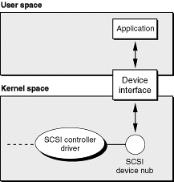

> 导航：[总目录](../../../README.md) · [documentation](../../../_indexes/documentation.md) · [SCSI Architecture Model Device Interface Guide](Introduction%20to%20SCSI%20Architecture%20Model%20Device%20Interface%20Guide.md)


[Next](Accessing%20SCSI%20Architecture%20Model%20Devices.md)[Previous](Introduction%20to%20SCSI%20Architecture%20Model%20Device%20Interface%20Guide.md)

# Accessing SCSI Parallel Devices

In versions of OS X prior to v10.2, if you wanted to access a SCSI Parallel device that was not accessible with the SCSI Architecture Model family’s device interfaces, you used the SCSI family’s device interfaces. Beginning with OS X v10.2, however, Apple introduced the SCSI Parallel family to support SCSI controllers. The new family is designed to allow the SCSI Architecture Model family to support SCSI devices attached to those controllers, which means you can use the SCSI Architecture Model family’s device interfaces to access all SCSI devices that do not declare a peripheral device type of $00, $05, $07, or $0E.

As third-party developers release new SCSI controller drivers that use the SCSI Parallel family and as users install these new drivers, the SCSI Parallel family will replace the SCSI family. During the transition, however, the APIs of both families are available. This means that you can use the API of both families to look up your device and then use the API that successfully found your device to communicate with it. You might need to use both APIs in a single application if the following is true:

- Your application must remain compatible with OS X v10.2.x or earlier.
- You need to access a SCSI Parallel device you could not previously access using the SCSI Architecture Model family’s device interfaces.

If these statements describe your situation, you can use both APIs to find and communicate with your device. This way, your application will be able to find all the devices it’s interested in regardless of the SCSI controller drivers the user has installed. More importantly, your application will still work when the SCSI family is replaced and all SCSI controllers are supported by the SCSI Parallel family. (Note, however, that the APIs of the deprecated SCSI family will not work in an Intel-based Macintosh.)

If, on the other hand, compatibility with OS X v10.2.x or earlier is not required or your application already uses the device interfaces of the SCSI Architecture Model family to access your device, you should not use the SCSI family API in your application. Instead, see [Accessing SCSI Architecture Model Devices](Accessing%20SCSI%20Architecture%20Model%20Devices.md#apple-f4xwc4dqnrsv64tfmyxwi33df52wszbpkridgmbqgaydgobxfvbegskjizbuuqq) for information on how to use the SCSI Architecture Model family device interfaces.

This chapter describes how to use the deprecated SCSI family API to find and access a SCSI Parallel device that you cannot access using the SCSI Architecture Model family API. To illustrate this, it uses the _[SCSIOldAndNew](../../../samplecode/SCSIOldAndNew/SCSIOldAndNew.md#apple-f4xwc4dqnrsv64tfmyxwi33df52wszbpirkfgmjqgaydanbuha)_ sample project, which employs the API of both families to find and access a SCSI Parallel device. Because the SCSI Architecture Model family’s device interfaces are thoroughly covered in [Accessing SCSI Architecture Model Devices](Accessing%20SCSI%20Architecture%20Model%20Devices.md#apple-f4xwc4dqnrsv64tfmyxwi33df52wszbpkridgmbqgaydgobxfvbegskjizbuuqq), this chapter focuses on the SCSI family’s application-level support for SCSI devices. Although the _SCSIOldAndNew_ sample project demonstrates how to use the APIs of both families to find and access a SCSI Parallel device, this chapter does not describe the project’s use of the SCSI Architecture Model API. If you are unfamiliar with the SCSI Architecture Model family and you plan to use the APIs of both families in your application, be sure to read [Accessing SCSI Architecture Model Devices](Accessing%20SCSI%20Architecture%20Model%20Devices.md#apple-f4xwc4dqnrsv64tfmyxwi33df52wszbpkridgmbqgaydgobxfvbegskjizbuuqq) in addition to reading this chapter.

Although the sample code outlined in this chapter has been compiled and tested to some degree, Apple does not recommend that you directly incorporate this code into a commercial application. Its function is to illustrate the techniques you need to access a SCSI Parallel device; it does not attempt to exercise all features of the APIs or to demonstrate exhaustive error handling or an ideal user interface.

The SCSI (Small Computer System Interface) Parallel Interface is an industry standard parallel data bus that provides a consistent method of connecting computers and peripheral devices. SCSI Parallel devices use SCSI Parallel technology to communicate with a computer.

On computers that do not have new SCSI Parallel family–supported SCSI controller drivers installed, the SCSI family provides application-level access to SCSI Parallel devices with two device interfaces:

- The IOSCSIDeviceInterface, which provides functions that access the device
- The IOCDBCommandInterface, which provides functions that create and execute CDB (command descriptor block) commands

The IOSCSIDeviceInterface is defined in `IOSCSILib.h` and the IOCDBCommandInterface is defined in `IOCDBLib.h`, both in the I/O Kit framework. This section provides a brief description of CDB performance and an outline of how to gain access to a SCSI Parallel device.

A command descriptor block is defined as a structure up to 16 bytes in length that is used to communicate a command from an application client to a device server. To improve performance, OS X queues CDB commands to help keep a SCSI Parallel device busy. When you use asynchronous commands, you can create more than one CDB command instance and execute subsequent commands as soon as you have queued the first command (by executing it). In fact, for best performance, you should try to use at least two commands whenever possible.

When a command completes, you can reuse the CDB command instance to execute another command. In reusing commands, keep the following in mind:

- No data in a CDB command is changed by executing the command, so that when you reuse the command, you must reset any values that need to be different for the next command.
- When you use the `setAndExecuteCommand` function to set up and execute a CDB command, it sets every CDB option, so you don’t need to worry about clearing previous data.
- Once you have executed a command, it is not safe to change its value until its completion routine is called.

You should create and communicate with a CDB command only from code in a single thread. However, you can have multiple threads that each create, execute, and reuse multiple commands. CDB commands are executed in the order sent, but if you use multiple threads to execute multiple commands, your code is responsible for ensuring any required ordering of commands.

When using multiple commands, don’t call `close` on the device until all the commands have completed. If you close a device with one or more outstanding asynchronous commands, some queued commands may be cancelled with a completion status of failed.

The I/O Kit’s SCSI family provides a SCSI device interface that applications can use to access SCSI Parallel devices on OS X. For the full definition of the SCSI device interface, see `IOSCSILib.h`.

You may need to access SCSI Parallel devices for a number of reasons, such as:

- Your utility application needs to list all the currently available SCSI Parallel devices, query them, and possibly perform operations on them (you can find devices and obtain cached device information from the I/O Registry without creating a device interface, but to query or control the device you do need a device interface).
- Your application needs to drive a SCSI scanner.

[Figure 1-1](#apple-f4xwc4dqnrsv64tfmyxwi33df52wszbpkridgmbqgaydgobwfvbecqskjjeuusq) shows an application that uses a device interface to act as a driver for a SCSI Parallel scanner. The application calls functions of the device interface, which communicates with a SCSI device nub (based on the IOSCSIDevice class) in the kernel.

__Figure 1-1__  An application communicating with a SCSI device through a device interface



To the application, the device interface is just a plug-in interface that provides access to the device through functions such as `open`, `close`, and `reset`. To the device nub, the device interface looks like just another driver the nub can communicate with.

Although each I/O Kit family that provides application-level access to devices may implement the device-interface mechanism in a slightly different way, the fundamental steps you take to use a device interface to access a device from an application remain the same:

1. Get the I/O Kit master port that allows applications to communicate with the I/O Kit.
2. Use family matching information and I/O Kit functions to find the device.
3. Get the appropriate device interface for the device.
4. Open a connection to the device and send it commands (in some cases, this step requires you to get an additional device interface).
5. Close the device and release any device interfaces you’ve acquired.

This section guides you through these steps, using code from the _SCSIOldAndNew_ sample project to illustrate an example implementation. In the interest of brevity, this section does not reproduce the sample project in its entirety. Instead, this section provides partial listings from the project to illustrate the techniques you use to access a SCSI Parallel device using the API of the deprecated SCSI family. To run the sample project with your own devices, download the project from [Sample Code > Hardware & Drivers > SCSI](https://developer.apple.com/library/archive/navigation/redirect.html#//apple_ref/doc/uid/TP30000925-TP40003576-TP30000567) and build it on your computer.

Fundamental to the design of the _SCSIOldAndNew_ sample project is the strict separation of the SCSI family functions from those of the SCSI Architecture Model family. Although you might choose to structure your code differently, the partitioning of the _SCSIOldAndNew_ project is a useful feature to emulate. If your compatibility requirements change in the future, for example, it will be much easier to remove the code that uses the deprecated SCSI family API if it is kept separate from the rest of your application. The sample project divides its code into three modules:

- A main module, called `SCSIOldAndNew.c`, that establishes the user interface and calls functions from the remaining two modules to find and access the user-selected device.
- The `STUCMethod.c` module, which uses the SCSI Architecture Model family API to find and access the device. (The abbreviation STUC stands for SCSITaskUserClient, the in-kernel counterpart of the SCSI Architecture Model family’s SCSITaskDeviceInterface you use to access a SCSI device.)

  For more information about the SCSI Architecture Model family’s device interfaces, see [Accessing SCSI Architecture Model Devices](Accessing%20SCSI%20Architecture%20Model%20Devices.md#apple-f4xwc4dqnrsv64tfmyxwi33df52wszbpkridgmbqgaydgobxfvbegskjizbuuqq).
- The `OldMethod.c` module, which uses the deprecated SCSI family API to find and access the device.

The _SCSIOldAndNew_ sample project is a Carbon application that defines an application-level event handler to process the user’s device selection. Because this is a design issue that does not affect the core purpose of the application, this section glosses over the Carbon-related implementation details, focusing instead on the use of the I/O Kit and SCSI family APIs to find and access the device.

The first step in accessing a device from an application is getting the I/O Kit master port. Because this step is required regardless of which family’s API you use to find and access the device, the _SCSIOldAndNew_ project performs it in its main module.

The main module of the _SCSIOldAndNew_ project, called `SCSIOldAndNew.c`, gives the user a list of peripheral device types from which to choose. The application’s event handler, a function called `DoAppCommandProcess`, passes the user’s choice to the function `TestDevices`. `TestDevices` (shown in [Listing 1-1](#apple-f4xwc4dqnrsv64tfmyxwi33df52wszbpkridgmbqgaydgobwfvbuuqscineekqi)) acquires the I/O Kit master port and then attempts to find a device with the passed-in peripheral device type, first with the SCSI Architecture Model family API and then with the SCSI family API.

__Listing 1-1__  Setting up device look-up for both families

```
void TestDevices(int peripheralDeviceType)
{
    kern_return_t   kr;
    mach_port_t     masterPort = NULL;
    io_iterator_t   iterator = NULL;

    kr = IOMasterPort(MACH_PORT_NULL, &masterPort);
    if (kr != kIOReturnSuccess) {
        fprintf(stderr, "Couldn't retrieve the master I/O Kit port.
                    (0x%08x)\n", kr);
        return;
    }

    // First try to find the device using the SCSI Architecture
    // Model family API:
    if (FindDevicesUsingSTUC(peripheralDeviceType, masterPort, &iterator)) {
        TestDevicesUsingSTUC(peripheralDeviceType, iterator);
    }
    else // Now try the SCSI family API:
        if (FindDevicesUsingOldMethod(peripheralDeviceType, masterPort,
                    &iterator)) {
        TestDevicesUsingOldMethod(iterator);
    }
    else {
        fprintf(stderr, "No devices with peripheral device type %02Xh
                    found.\n", peripheralDeviceType);
    }

    if (iterator) {
        IOObjectRelease(iterator);
    }

    if (masterPort) {
        mach_port_deallocate(mach_task_self(), masterPort);
    }
}
```

Although you might choose to develop your application differently, you should consider replicating the basic structure of this function somewhere in your code. If you require compatibility with OS X v10.2.x or earlier or your device wasn’t previously accessible using the SCSI Architecture Model family’s API, you should first attempt to find the device using the SCSI Architecture Model API and if that fails, then try to find the device using the SCSI family API. You should then use whichever API successfully found the device to access the device.

To perform device matching (finding a device by locating its entry in the I/O Registry), you first create a matching dictionary. A matching dictionary is a dictionary of key-value pairs that describe the properties of a device or other service. Recall that when a device is discovered on an OS X system, the I/O Kit instantiates a nub object that represents the device, attaches the nub to the I/O Registry, and registers it. The device family publishes properties in the nub that the I/O Kit uses to find a suitable driver for the device. Once you’ve created a matching dictionary, you can add keys and values that specify these properties to match on.

The _SCSIOldAndNew_ project performs all its SCSI family–specific device matching and device access tasks in the module named `OldMethod.c`. To find a device of the user-selected peripheral device type, the main module calls the `FindDevicesUsingOldMethod` function (shown later in [Listing 1-3](#apple-f4xwc4dqnrsv64tfmyxwi33df52wszbpkridgmbqgaydgobwfvbuuqsijbduqqi)), passing it the peripheral device type, the I/O Kit master port, and a pointer to an iterator. The iterator, an object of type `io_iterator_t`, will hold a reference to the first device object in a list of matching device objects found in the I/O Registry, if any.

First, however, `FindDevicesUsingOldMethod` must create a matching dictionary that describes the device. To do this, it declares a variable of type `CFMutableDictionaryRef` and passes the address of this dictionary and the peripheral device type to the function `CreateMatchingDictionaryForOldMethod`, shown in [Listing 1-2](#apple-f4xwc4dqnrsv64tfmyxwi33df52wszbpkridgmbqgaydgobwfvbuuqsgifbugqi).

__Listing 1-2__  Creating a matching dictionary for a SCSI Parallel device

```
void CreateMatchingDictionaryForOldMethod(SInt32 peripheralDeviceType,
                CFMutableDictionaryRef *matchingDict)
{
    SInt32  deviceTypeNumber = peripheralDeviceType;
    CFNumberRef deviceTypeRef = NULL;

    // Set up a matching dictionary to search the I/O Registry by class name
    // for all subclasses of IOSCSIDevice.
    *matchingDict = IOServiceMatching(kIOSCSIDeviceClassName);

    if (*matchingDict != NULL)
    {
        // Add key for device type to refine the matching dictionary.
        // First create a CFNumber to store in the dictionary.
        deviceTypeRef = CFNumberCreate(kCFAllocatorDefault, kCFNumberIntType,
                        &deviceTypeNumber);
        CFDictionarySetValue(*matchingDict, CFSTR(kSCSIPropertyDeviceTypeID),
                        deviceTypeRef);
    }
}
```

The `IOProviderClass`-_myDeviceClassName_ key-value pair is a common one in matching dictionaries. The function in [Listing 1-2](#apple-f4xwc4dqnrsv64tfmyxwi33df52wszbpkridgmbqgaydgobwfvbuuqsgifbugqi) passes the device-class name to the I/O Kit convenience function `IOServiceMatching`, which creates the matching dictionary and places in it this key-value pair. Because the resulting dictionary would match on a potentially large number of devices, however, the `CreateMatchingDictionaryForOldMethod` function also adds another key-value pair to narrow down the search to devices that identify themselves as the passed-in peripheral device type.

With the matching dictionary from `CreateMatchingDictionaryForOldMethod`, the `FindDevicesUsingOldMethod` function performs device look-up, using the I/O Kit function `IOServiceGetMatchingServices`. This I/O Kit function looks in the I/O Registry for devices whose properties match the key-value pairs in the matching dictionary. It returns an `io_iterator_t` object you can think of as a pointer to a list of matching devices. To access each device, you pass the iterator object to the I/O Kit function `IOIteratorNext`, which returns an `io_object_t` object representing a matching device and resets the iterator to “point to” the next matching device. A partial listing of `FindDevicesUsingOldMethod` is shown in [Listing 1-3](#apple-f4xwc4dqnrsv64tfmyxwi33df52wszbpkridgmbqgaydgobwfvbuuqsijbduqqi).

__Listing 1-3__  Finding a device

```
boolean_t FindDevicesUsingOldMethod(SInt32 peripheralDeviceType,
                mach_port_t masterPort, io_iterator_t *iterator)
{
    CFMutableDictionaryRef  matchingDict = NULL;
    boolean_t           result = false;

    CreateMatchingDictionaryForOldMethod(peripheralDeviceType,
                    &matchingDict);
    // ...

    // Now search I/O Registry for matching devices.
    kr = IOServiceGetMatchingServices(masterPort, matchingDict,
                            iterator);

    if (*iterator && kr == kIOReturnSuccess) {
        result = true;
    }

    // IOServiceGetMatchingServices consumes a reference to the matching
    // dictionary, so we don't need to release the dictionary reference.

    return result;
}
```

The result `FindDevicesUsingOldMethod` returns tells the main module if it found any devices of the specified peripheral device type that the SCSI family supports.

A device interface provides functions your application or other code running on OS X can use to access a device. Device interfaces are plug-in interfaces that conform to the Core Foundation plug-in model (for more information on Core Foundation plug-ins, see [Reference Library > Core Foundation](https://developer.apple.com/library/archive/navigation/redirect.html#//apple_ref/doc/uid/TP30000943-TP30000421-TP30000456)).

An I/O Kit family that provides a device interface defines a type that represents the collection of interfaces it supports and a type for each individual interface. The family gives these types UUIDs (universally unique IDs) that identify them. Most families also define meaningful names for these identifiers you can use in place of the 128-bit UUID values. The SCSI family, for example, defines the constant `kIOSCSIUserClientTypeID` as a synonym for the UUID B4291228-0F0F-11D4-9126-0050E4C6426F that identifies the SCSI device interface.

Before you can get a family-specific device interface, however, you must first create an interface of type `IOCFPlugInInterface`. This interface sets up functions required for all interfaces based on the Core Foundation plug-in model. Chief among these is the `QueryInterface` function, which creates instances of family-specific device interfaces.

To get the SCSI family device interface, your application performs the following steps:

1. Get an intermediate interface of type `IOCFPlugInInterface`.

   To obtain this interface, the application calls the `IOCreatePlugInInterfaceForService` function, passing the `io_object_t` representing the matching device (received from `IOIteratorNext`), the value `kIOSCSIUserClientTypeID` for the plug-in type parameter, and the value `kIOCFPlugInInterfaceID` for the interface type parameter. (`kIOSCSIUserClientTypeID` is defined in `IOSCSILib.h` and `kIOCFPlugInInterfaceID` and `IOCreatePlugInInterfaceForService` are defined in `IOCFPlugIn.h`.)
2. Get a SCSI device interface.

   To do this, the application calls the `QueryInterface` function of the IOCFPlugInInterface object, passing the UUID of the desired device interface. To retrieve the UUID from the family-defined device interface name, use the following term:

   `CFUUIDGetUUIDBytes(kIOSCSIDeviceInterfaceID)`
3. Release the intermediate IOCFPlugInInterface object.

   To do this, the application calls the `IODestroyPlugInInterface` function (defined in `IOCFPlugIn.h`).

After completing these steps, you have a device interface of type `IOSCSIDeviceInterface` you can use to examine the device’s cached information, open the device, and create the more specific CDB command interface.

The _SCSIOldAndNew_ project performs these steps in the `CreateDeviceInterfaceUsingOldMethod` function in the `OldMethod.c` module. [Listing 1-4](#apple-f4xwc4dqnrsv64tfmyxwi33df52wszbpkridgmbqgaydgobwfvbuuqskircemsi) shows part of this function, which is passed an `io_object_t` representing a matching device (received from a call to `IOIteratorNext`) and a pointer to an interface of type `IOSCSIDeviceInterface`.

__Listing 1-4__  Creating a SCSI device interface

```swift
void CreateDeviceInterfaceUsingOldMethod(io_object_t scsiDevice,
                    IOSCSIDeviceInterface ***interface)
{
    IOCFPlugInInterface **plugInInterface = NULL;
    HRESULT     plugInResult = S_OK;
    kern_return_t   kr = kIOReturnSuccess;
    SInt32      score = 0;

    // Create the base interface of type IOCFPlugInInterface.
    // This object will be used to create the SCSI device interface object.
    kr = IOCreatePlugInInterfaceForService( scsiDevice,
                          kIOSCSIUserClientTypeID, kIOCFPlugInInterfaceID,
                          &plugInInterface, &score);

    if (kr != kIOReturnSuccess) {
        fprintf(stderr, "Couldn't create a plug-in interface for the
                    io_service_t. (0x%08x)\n", kr);
    }
    else {
        // Query the base plug-in interface for an instance of the specific
        // SCSI device interface object.
        plugInResult = (*plugInInterface)->QueryInterface(plugInInterface,
                            CFUUIDGetUUIDBytes(kIOSCSIDeviceInterfaceID),
                            (LPVOID *) interface);

        if (plugInResult != S_OK) {
            fprintf(stderr, "Couldn't create SCSI device interface.
                        (%ld)\n", plugInResult);
        }
        // We're now finished with the instance of IOCFPlugInInterface.
        IODestroyPlugInInterface(plugInInterface);
    }
}
```


With the SCSIDeviceInterface object you’ve created, you can examine cached information about a device before you open it. You might choose to do this if, for example, you want to display this information and allow the user to verify that this is, in fact, the desired device.

The SCSIDeviceInterface defines a function called `getInquiryData` that retrieves the information about the device. In the `OldMethod.c` module of the _SCSIOldAndNew_ project, the function `GetInquiryDataUsingOldMethod` (shown in [Listing 1-5](#apple-f4xwc4dqnrsv64tfmyxwi33df52wszbpkridgmbqgaydgobwfvbuuqsfivbusra)) demonstrates how to call this device-interface function.

__Listing 1-5__  Getting cached data about a SCSI Parallel device

```swift
void GetInquiryDataUsingOldMethod(IOSCSIDeviceInterface **interface)
{
    UInt8       inquiryData[255];
    UInt32      inquiryDataSize = sizeof(inquiryData);
    kern_return_t   kr = kIOReturnSuccess;

    bzero(inquiryData, sizeof(inquiryData));    // Zero data block.

    // Call a function of the SCSI device interface that returns cached
    // information about the device.
    kr = (*interface)->getInquiryData(interface, (SCSIInquiry *) inquiryData,
                        sizeof(inquiryData), &inquiryDataSize);

    // If error, print message and hang (for debugging purposes).
    if (kr != kIOReturnSuccess) {
        fprintf(stderr, "Couldn't get inquiry data for device. (0x%08x)\n",
                    kr);
    }
    else {
        PrintSCSIInquiryDataUsingOldMethod((SCSIInquiry *) inquiryData,
                    inquiryDataSize);
    }
}
```

The function `PrintSCSIInquiryDataUsingOldMethod` (not shown here) simply formats and displays device information, including:

- Peripheral device type
- Vendor ID
- Product ID and revision level
- Response data format
- Removability of media

Although you can get this information without opening the device, if you want to send commands to a SCSI Parallel device, you must open the device and create an additional interface, called a CDBCommandInterface.

The SCSIDeviceInterface defines the `open` function, which opens the device and, if it succeeds, causes all other calls to `open` to fail with the `kIOReturnExclusiveAccess` error. After you’ve opened the device, you use the SCSIDeviceInterface’s `QueryInterface` function (common to all Core Foundation plug-in interfaces) to create a CDBCommandInterface. You can use the CDBCommandInterface to send to the SCSI Parallel device commands such as:

- INQUIRY
- TEST UNIT READY
- READ BUFFER
- WRITE BUFFER
- REQUEST SENSE

These and other commands are defined in `SCSIPublic.h` in the I/O Kit framework.

The function `TestADeviceUsingOldMethod` (not shown here) demonstrates how to open a SCSI Parallel device using the `open` function of the passed-in SCSIDeviceInterface:

`(*interface)->open(interface);`

It then passes the SCSIDeviceInterface object to the function `CreateCommandInterfaceUsingOldMethod` to create the CDBCommandInterface object. `CreateCommandInterfaceUsingOldMethod` is shown in [Listing 1-6](#apple-f4xwc4dqnrsv64tfmyxwi33df52wszbpkridgmbqgaydgobwfvbuuqskiveekqy).

__Listing 1-6__  Getting a CDBCommandInterface object

```swift
IOCDBCommandInterface **CreateCommandInterfaceUsingOldMethod
                            (IOSCSIDeviceInterface **interface)
{
    HRESULT         plugInResult = S_OK;
    IOCDBCommandInterface   **cdbCmdInterface = NULL;

    fprintf(stderr, "Opened device\n");

    // Use the constant kIOCDBCommandInterfaceID, defined in
    // IOCDBLib.h, to identify the CDBCommandInterface.
    plugInResult = (*interface)->QueryInterface(interface,
                        CFUUIDGetUUIDBytes(kIOCDBCommandInterfaceID),
                        (LPVOID *) &cdbCmdInterface);

    // If error, print message and hang (for debugging purposes).
    if (plugInResult != S_OK) {
        fprintf(stderr, "Couldn't create a CDB command. (%ld)\n",
                            plugInResult);
    }

    return cdbCmdInterface;
}
```

With a CDBCommandInterface, you can send SCSI commands to your device. The `ExecuteInquiryUsingOldMethod` function in the `OldMethod.c` module uses the INQUIRY command to illustrate how to set up a CDB command structure (defined in `CDBCommand.h`) and send it to the device. To do this, the `ExecuteInquiryUsingOldMethod` function performs the following steps:

1. It allocates and initializes stack variables (including `inquiryData`, `range`, and `cdb`) to specify an INQUIRY command and to store the results.
2. It sets up a variable of type `CDBInfo` to specify the command, then calls the `setAndExecuteCommand` function of the CDB command interface to set command values and execute the command.

   On return from the `setAndExecuteCommand` function, for an asynchronous command, the `seqNumber` variable contains a unique sequence number. For a synchronous command, the sequence number is always 0.

   The `setAndExecuteCommand` function (defined in `IOCDBLib.h`) is a utility function you can use instead of making multiple calls to set values and then calling the `execute` function.
3. It calls the `getResults` function of the CDB command interface to obtain the results of the INQUIRY command.
4. It calls the `MyPrintSCSIInquiryData` utility function (not shown here) to print the results.
5. Because it uses only stack variables, it has nothing to release.

[Listing 1-7](#apple-f4xwc4dqnrsv64tfmyxwi33df52wszbpkridgmbqgaydgobwfvbuuqsijbfeesi) shows the `ExecuteInquiryUsingOldMethod` function, minus its error-checking code.

__Listing 1-7__  Using a CDBCommandInterface object to send commands

```swift
void ExecuteInquiryUsingOldMethod(IOCDBCommandInterface
                        **cdbCommandInterface)
{
    UInt8           inquiryData[36 /* 255 */];
    IOVirtualRange  range[1];
    CDBInfo         cdb;
    CDBResults      results;
    UInt32          seqNumber;
    kern_return_t   kr = kIOReturnSuccess;

    bzero(inquiryData, sizeof(inquiryData));    // Zero data block.

    range[0].address = (IOVirtualAddress) inquiryData;
    range[0].length  = sizeof(inquiryData);

    bzero(&cdb, sizeof(cdb));
    cdb.cdbLength = 6;
    cdb.cdb[0] = kSCSICmdInquiry;
    cdb.cdb[4] = sizeof(inquiryData);

    kr = (*cdbCommandInterface)->setAndExecuteCommand(
                                    cdbCommandInterface,
                                    &cdb,
                                    sizeof(inquiryData),
                                    range,
                                    sizeof(range) / sizeof(range[0]),
                                    0, /* isWrite */
                                    0, /* timeoutMS */
                                    0, /* target */
                                    0, /* callback */
                                    0, /* refcon */
                                    &seqNumber);

    // Check to be sure the INQUIRY command executed correctly here.

    kr = (*cdbCommandInterface)->getResults(cdbCommandInterface, &results);

    // Check to be sure the getResults command executed correctly here.

    PrintSCSIInquiryDataUsingOldMethod((SCSIInquiry *) inquiryData,
                    results.bytesTransferred);
}
```


When you’ve finished sending commands to the SCSI Parallel device, you must close it and release the device interfaces you acquired. Functions in the `OldMethod.c` module perform these tasks in reverse order, starting with the most recently acquired interface. The `TestADeviceUsingOldMethod` function releases the CDBCommandInterface object:

```swift
IOCDBCommandInterface **cdbCommandInterface;
(*cdbCommandInterface)->Release(cdbCommandInterface);
```

Next, it closes the device, using the SCSIDeviceInterface function `close`:

```swift
IOSCSIDeviceInterface **interface;
(*interface)->close(interface);
```

Finally, the `TestDevicesUsingOldMethod` function releases the SCSIDeviceInterface object:

```swift
IOSCSIDeviceInterface **interface;
(*interface)->Release(interface);
```

[Next](Accessing%20SCSI%20Architecture%20Model%20Devices.md)[Previous](Introduction%20to%20SCSI%20Architecture%20Model%20Device%20Interface%20Guide.md)

