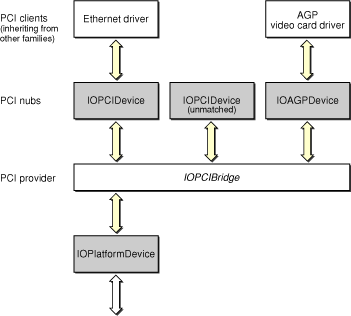

> 导航：[总目录](../../../README.md) · [documentation](../../../_indexes/documentation.md) · [Writing PCI Drivers](About%20This%20Book.md)

[Next](Writing%20a%20Driver%20for%20a%20PCI%20Bridge.md)[Previous](About%20This%20Book.md)

# PCI Family Architecture

The PCI family defines the driver classes for PCI bridge controllers and the nub classes used by drivers of devices attached to a PCI bus. As a provider of PCI services, a PCI bridge controller driver scans the PCI bus and creates a nub for each device found. Each nub then starts the matching and loading process to find a driver for its PCI device, and the driver uses the nub to perform communication over the PCI bus.

Drivers for PCI bridge controllers are members of the PCI family, inheriting from a superclass within the family. Drivers of individual PCI devices are clients of the PCI family but are typically members of another family. A driver for a PCI Ethernet controller, for example, inherits from the Network family’s `IOEthernetController` class but uses an instance of the PCI family’s `IOPCIDevice` nub class to connect to the PCI bus. If you are writing a driver for a PCI device, you should read both this document and the document for the family from which your driver will actually inherit.

The PCI family is quite small, comprising only four classes. `[Figure 2-1](#apple-f4xwc4dqnrsv64tfmyxwi33df52wszbpkridgmbqgaydgnbvfvbuqrcfjjbucsi)` shows the inheritance hierarchy for the PCI family. The two bridge classes, `IOPCIBridge` and `IOPCI2PCIBridge`, drive PCI host bridge controllers and PCI-to-PCI bridge controllers, respectively. `IOPCIBridge` is an abstract superclass that declares the general mechanism for a PCI bridge controller; hardware-specific subclasses implement this mechanism. `IOPCI2PCIBridge` is a concrete class that connects two hardware-specific bridge controller drivers.

__Figure 2-1__  PCI family inheritance hierarchy

The two device classes, `IOPCIDevice` and `IOAGPDevice`, represent the access points for drivers of PCI and AGP devices. `IOPCIDevice` is the basic nub class for the PCI family, representing any PCI device in a PCI slot. For AGP devices, the nub class is `IOAGPDevice`. A driver object for a PCI device matches against a nub, using it to establish a connection to the PCI bus and to access the hardware registers on the device. Because `IOAGPDevice` is a subclass of `IOPCIDevice`, all of the `IOPCIDevice` methods can also be used on an `IOAGPDevice`.

`[Figure 2-2](#apple-f4xwc4dqnrsv64tfmyxwi33df52wszbpkridgmbqgaydgnbvfvbuqrciifauksi)` shows a typical arrangement of objects built on a PCI bus. Starting from the bottom, an `IOPlatformDevice` nub represents some controller built in to the logic board of the computer. In this case, it is a PCI host bridge controller. The appropriate instance of an `IOPCIBridge` subclass serves as the driver for the PCI bridge controller. The `IOPCIBridge` driver scans the PCI bus and creates an `IOPCIDevice` or `IOAGPDevice` for each device it finds; in this case it creates two regular PCI device nubs and an AGP device nub. These nubs then trigger driver matching and loading for their devices. One of the PCI devices turns out to be an Ethernet card, and the other an AGP video card. Because the remaining device does not have a driver installed, it remains unmatched.

__Figure 2-2__  PCI family objects in the I/O Registry

[Next](Writing%20a%20Driver%20for%20a%20PCI%20Bridge.md)[Previous](About%20This%20Book.md)

