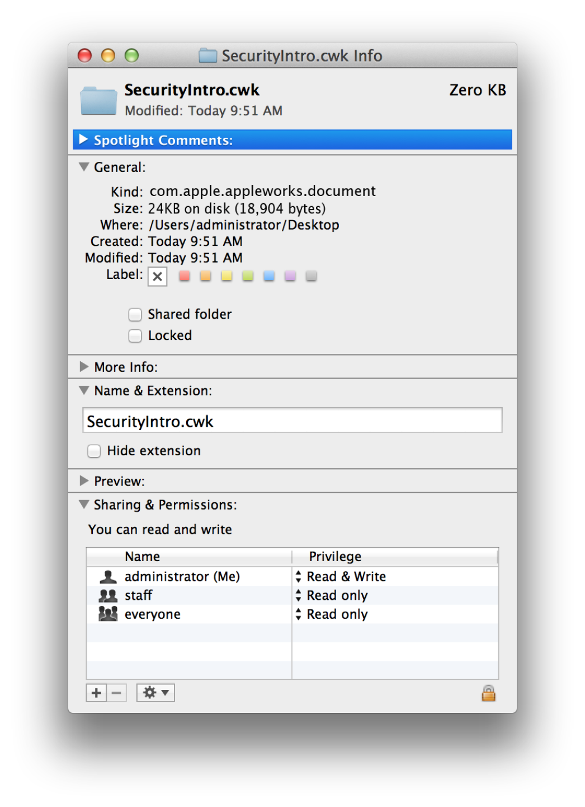

> 导航：[总目录](../../../README.md) · [documentation](../../../_indexes/documentation.md) · [File System Programming Guide](About%20Files%20and%20Directories.md)


[Next](Document%20Revision%20History.md)[Previous](macOS%20Library%20Directory%20Details.md)

# File System Details

This appendix includes information about the file systems supported by macOS, iOS, watchOS, and tvOS.

Mac computers support a variety of file systems and volume formats, including those listed in Table B-1. Although the primary volume format is APFS, macOS can also boot from a disk formatted with the HFS+ file system.

__Table B-1__  File systems supported by macOS

| File System | Description |
| APFS | The default file system for Apple platforms in macOS High Sierra and later, iOS 10.3 and later, watchOS 4.0 and later, and tvOS 10.2 and later. |
| HFS Plus | Mac OS Extended file system. The standard file system for prior versions of macOS, iOS, watchOS, and tvOS. |
| HFS | Mac OS Standard file system. The standard file system for older versions of macOS. File systems of this type are treated as read only in macOS 10.6 and later. |
| WebDAV | Used for directly accessing files on the web. For example, iDisk uses WebDAV for accessing files. |
| UDF | Universal Disk Format. The standard file system for all forms of DVD media (video, ROM, RAM and RW) and some writable CD formats. |
| FAT | The MS-DOS file system, with 16- and 32-bit variants. Fat 12-bit is not supported. |
| ExFAT | An interchange format used by digital cameras and other peripherals. |
| SMB/CIFS | Used for sharing files with Microsoft Windows SMB file servers and clients. |
| AFP | Apple Filing Protocol. The primary network file system for all versions of Mac OS. |
| NFS | Network File System. A commonly-used UNIX file sharing standard. macOS supports NFSv2 and NFSv3 over TCP and UDP. macOS 10.7 and later also supports NFSv4 over TCP. |
| FTP | A file system wrapper for the standard Internet File Transfer Protocol. |
| Xsan | Apple’s 64-bit cluster file system used in storage area networks. |
| NTFS | A standard file system for computers running the Windows operating system. |
| CDDAFS | A file system used to mount audio CDs and present audio tracks on disc to users as AIFF-C encoded files. |
| ISO 9660 | The file system format used by CD-ROMs. |

Many file systems require specific separator characters to denote paths. It is best to use the `NSURL` file construction methods to construct strings rather than doing so manually.

Because the Finder is the user’s main access to the file system in macOS, it helps to understand a little about how the Finder presents and works with files.

The Finder’s sort order for file and directory names is based on the Unicode Collation Algorithm (Technical Standard UTS #10) defined by the Unicode Consortium. That standard provides a complete and unambiguous sort ordering for all Unicode characters and is available on the Unicode Consortium website ([http://www.unicode.org](http://www.unicode.org/)). The Finder alters the default sorting behavior of this algorithm slightly by taking advantage of some sanctioned alternatives, specifically:

- Punctuation and symbols are significant for sorting.
- Substrings of digits are sorted according to their numeric value, as opposed to sorting the actual characters in the number.
- Case is not considered during sorting.

The Finder uses several pieces of information to determine how to present files and directories. The file’s bundle bit, type code, creator code, and filename extension all help determine the icon. User settings also play a role. The following steps explain the process used to choose icons for files and directory:

- For files:

  1. The Finder asks Launch Services to provide an appropriate icon. (File icons are nominally provided by the app that defines the appropriate file type. The system apps also provide default icons for many known file types.)
  2. If no icon is available, the finder displays the generic file icon.
- For nonbundled directories:

  1. For specific system directories, the Finder displays a custom icon. These custom icons are typically a generic folder icon overlaid with an image that indicates the purpose of the directory.
  2. For all other directories, the system displays the generic folder icon.
- For [bundled](https://developer.apple.com/library/archive/documentation/General/Conceptual/DevPedia-CocoaCore/Bundle.html#//apple_ref/doc/uid/TP40008195-CH4) directories:

  1. The system presents the directory as a file and does not let the user navigate further down into the directory by default. (Users can still view the contents of the bundle directory by Control-clicking the directory and selecting Show Package Contents from the contextual menu that appears.)
  2. If the bundled directory has the extension `.app` in its filename, the Finder applies the icon associated with the app bundle. If no icon is provided.
  3. For a bundled directory, the Finder looks up the type code, creator code, and filename extension in the Launch Services database and uses that information to locate the appropriate custom icon.
  4. If no custom icon is available for either a file or directory, the Finder displays the default icon appropriate for the given item type.

     The default icon can differ based on whether the item is a document, unbundled directory, app, plug-in, or generic bundle, among others.

File type and creator codes are an older way of identifying the type of a file and the app that created it. A file type code (a 32-bit value usually specified as a sequence of four characters) identifies the type of content contained in a file. A creator code (similarly identified using a sequence of four characters) identifies the app that created the file and acts as the primary editor for that specific file. Although these codes are generally deprecated, you may see them in legacy files and apps and in some places in the system.

macOS provides file system security policies that limit access to files and directories (including special files and directories such as mount points for volumes, block and character special device files that represent hardware devices, symbolic links, named pipes, UNIX domain sockets, and so on). This appendix explains these policies and how they affect apps.

macOS provides three file system security schemes: UNIX (BSD) permissions, POSIX access control lists (ACLs), and sandbox entitlements. In addition, the BSD layer provides several per-file flags that override UNIX permissions. These schemes are described in the sections that follow.

In addition, macOS allows admin users to disable ownership and permissions checking for removable volumes on a per-volume basis by choosing Get Info on the volume in Finder, then checking the “Ignore ownership on this volume” checkbox.

These permissions models fit together as follows:

1. If the app’s sandbox forbids the requested access, the request is denied. See [Sandbox Entitlements](#apple-f4xwc4dqnrsv64tfmyxwi33df52wszbpkridimbqgeydmnzsfvbuqobnknlte) for details.
2. If ownership checking has been disabled for the volume in question by the system administrator (with a checkbox in its Finder Get Info window), the request is granted.
3. If an access control entry exists on the file, it is evaluated and used to determine access rights. See [POSIX ACLs](#apple-f4xwc4dqnrsv64tfmyxwi33df52wszbpkridimbqgeydmnzsfvbuqobnknltg) for details.
4. If a file flag prohibits the operation, the operation is denied. See [BSD File Flags](#apple-f4xwc4dqnrsv64tfmyxwi33df52wszbpkridimbqgeydmnzsfvbuqobnknltq) for details.
5. Otherwise, if the user ID matches the owner of the file, the “user” permissions (also called “owner” permissions) are used. See [UNIX Permissions](#apple-f4xwc4dqnrsv64tfmyxwi33df52wszbpkridimbqgeydmnzsfvbuqobnknltm) for details.
6. Otherwise, if the group ID matches the group for the file, the “group” permissions are used. See [UNIX Permissions](#apple-f4xwc4dqnrsv64tfmyxwi33df52wszbpkridimbqgeydmnzsfvbuqobnknltm) for details.
7. Otherwise, the “other” permissions are used. See [UNIX Permissions](#apple-f4xwc4dqnrsv64tfmyxwi33df52wszbpkridimbqgeydmnzsfvbuqobnknltm) for details.

macOS supports the use of a sandbox to limit an app’s ability to access files. These limits override any permissions the app might otherwise have. Sandbox limits are subtractive, not additive. Therefore, the file system permissions represent the maximum access an app might be allowed if its sandbox also permits that access.

Starting in macOS 10.4, the Mach and BSD permissions policies are supplemented by support in the kernel for ACLs  (access control lists), which are data structures that provide much more detailed control over permissions than does BSD. For example, ACLs allow the system administrator to specify that a specific user can delete a file but cannot write to it. ACLs also provide compatibility with Active Directory and with the SMB/CIFS networks used by the Windows operating system. For more information on ACL support in macOS for different network file systems, see [Network File Systems](#apple-f4xwc4dqnrsv64tfmyxwi33df52wszbpkridimbqgeydmnzsfvbuqobnknlteny).

An _ACL_ consists of an ordered list of ACEs  (access control entries), each of which associates a user or group with a set of permissions and specifies whether each permission is allowed or denied. ACEs also include attributes related to inheritance (see [Inheritance of Permissions](#apple-f4xwc4dqnrsv64tfmyxwi33df52wszbpkridimbqgeydmnzsfvbuqobnknltema)).

You can use file system ACLs to implement more detailed and complex access control policies than are possible using only BSD permissions. They do so by using many more permission bits than the three used by BSD and by implementing both allow and deny associations for each permission for each user or group. Table B-2 shows the permission bits used by ACLs. Compare these to the BSD permission bits shown in [Table B-3](#apple-f4xwc4dqnrsv64tfmyxwi33df52wszbpkridimbqgeydmnzsfvbuqobnknltcmi).

__Table B-2__  File permission bits using ACLs

| Bit | File | Directory |
| read | Open file for read | List directory contents |
| write | Open file for write | Add a file entry to the directory |
| execute | Execute file | Search through the directory (to access files or directories within it) |
| delete | Delete file | Delete directory |
| append | Append to file | Add subdirectory to directory |
| delete child | — | Remove a file or subdirectory entry from the directory |
| read attributes | Read basic attributes | Read basic attributes |
| write attributes | Write basic attributes | Write basic attributes |
| read extended | Read extended (named) attributes | Read extended (named) attributes |
| write extended | Write extended (named) attributes | Write extended (named) attributes |
| read permissions | Read file permissions (ACL) | Read directory permissions (ACL) |
| write permissions | Write file permissions (ACL) | Write directory permissions (ACL) |
| take ownership | Take ownership | Take ownership |

Notice that the right to change permissions is itself controlled by a permission.

One of the main reasons for implementing ACLs in macOS is to support network file systems such as SMB/CIFS (see [SMB/CIFS](#apple-f4xwc4dqnrsv64tfmyxwi33df52wszbpkridimbqgeydmnzsfvbuqobnknltgma)). In order to be able to identify users and groups throughout the network, each file or directory must have universally unique identifiers (UUIDs) in addition to the locally-unique UID and GID used by BSD. Each file or directory that has associated ACLs, therefore, has four associated identities, two to support BSD and two to support ACLs:

- User ID (UID)
- Group ID (GID)
- Owner UUID
- Group UUID

Unlike BSD, which specifies three permissions for each file (one for the file’s owner, one for members of the file’s group, and one for everyone else), an ACL can specify different permissions for each ACE. Another contrast between ACLs and BSD is that, whereas in BSD the file owner must be an individual, in the ACL permission scheme the file owner can be either a user or a group. If a file is owned by a group, its GID (used by BSD) and group UUID are always coherent (that is, there is always a simple, 1:1 mapping between them). However, because BSD does not support the concept of a group as owner of a file, in this case the system assigns a special UID that identifies the file as owned by “not a user” and the owner UUID represents a group. If the file is owned by a single individual, its UID and owner UUID are coherent.

The owner of a file using an ACL has certain irrevocable permissions (read and write permissions) regardless of the contents of the ACL. If the file is owned by an individual, the group UUID associates a group with a file system object and affects the inheritance of certain ACEs (see [Inheritance of Permissions](#apple-f4xwc4dqnrsv64tfmyxwi33df52wszbpkridimbqgeydmnzsfvbuqobnknltema)) but does not confer any special permissions on the group.

Each ACE in an ACL either allows or a denies some set of permissions. It is very important to understand that a deny ACE is not the same as the absence of an allow ACE. Rather, the system evaluates the ACEs in sequence until either all requested permissions are allowed or any requested permission is denied. A request for authorization includes a credential (which identifies the requesting entity) and the permissions required for the operation. macOS 10.4 and later evaluates permissions using the following algorithm (also, see [Inheritance of Permissions](#apple-f4xwc4dqnrsv64tfmyxwi33df52wszbpkridimbqgeydmnzsfvbuqobnknltema) for a discussion of inherited permissions):

1. If the requested permissions would change the object, and the file system is read-only or the object is marked as immutable, the operation is denied.
2. If the entity making the request is the root user, the operation is allowed.
3. If the entity making the request is the object’s owner, the requestor is given Read Permissions and Write Permissions access. If that is sufficient to satisfy the request, the operation is allowed.
4. If the object has an ACL, the ACEs in the ACL are scanned in order. (Those with deny associations are usually placed before those with allow associations.) Each ACE is evaluated according to the following criteria until either a required permission has been denied, all required permissions have been allowed, or the end of the ACL is reached:

   1. The ACE is checked for applicability. The ACE is not considered applicable if it does not refer to any of the requested permissions. In addition, the requesting entity must be the same as the entity named in the ACE, or the requestor must be a member of a group named in the ACE. (Groups may be nested and an external directory service may be used to resolve group membership.) Non-applicable ACEs are ignored.
   2. If the ACE denies any of the requested permissions, then the request is denied. (Note that Read Permissions and Write Permissions are granted to the object’s owner, regardless of whether allowed or denied by ACEs.)
   3. If the ACE allows any of the requested permissions, the system adds this permission to the list of granted permissions. If the granted permissions include all the requested permissions, the request is allowed and the process stops. If the list is not complete, the system goes on to check the next ACE.
5. If the end of the ACL is reached without finding all of the required permissions, and if the object also has BSD permissions, then the system checks the unsatisfied permissions against the BSD permissions. If these are sufficient to grant all required permissions, the request is allowed. If the permission requested has no BSD equivalent (such as “take ownership”), then it is considered still outstanding and the request is denied.
6. If the file system object has no ACL, then permissions are evaluated according to the BSD security policies, as described in [UNIX Permissions](#apple-f4xwc4dqnrsv64tfmyxwi33df52wszbpkridimbqgeydmnzsfvbuqobnknltm) and [BSD File Flags](#apple-f4xwc4dqnrsv64tfmyxwi33df52wszbpkridimbqgeydmnzsfvbuqobnknltq).

The credential of the requesting entity is equivalent to the effective UID (that is, the EUID) of the program attempting to open or execute a file. The EUID is normally the same as the UID of the user or process that executes the process., but it can differ in special circumstances (involving the setuid bit) as described in Owner or Root Security Policy.

BSD permissions are assigned only on a per-file basis, so that the permissions assigned to a directory do not affect the permissions of a new file or subdirectory created in that directory. Although you can apply the permissions of a directory to enclosed items, doing so is a one-time operation. Any newly created files or subdirectories are not affected—they are created with default permissions.

With ACLs, by contrast, newly created files and subdirectories can inherit permissions from their enclosing directory. Each ACE on a directory can contain any combination of the following inheritance flags:

- Inherited (this ACE was inherited)
- File Inherit (this ACE should be inherited by files created within this directory)
- Directory Inherit (this ACE should be inherited by directories created within this directory)
- Inherit Only (this ACE should not be checked during authorization)
- No Propagate Inherit (this ACE should be inherited only by direct children; that is, the ACE should lose any Directory Inherit or File Inherit bit when inherited)

When it creates a new file, the kernel goes through the entire access control list of the parent directory and copies to the file’s ACL any ACEs that are marked for file inheritance. Similarly, when it creates a new subdirectory, the kernel copies to the subdirectory’s ACL any ACEs that are marked for directory inheritance.

If a file is copied and pasted into a directory, the kernel replicates the contents of the source file into a new file at the destination. Because it is creating a new file, the system checks the ACL of the parent directory and adds any inherited ACEs to whatever ACEs were in the original file. If a file is moved into a directory, on the other hand, the original file is not replicated and no ACEs are inherited. In this case, the parent directory’s ACEs are added to the moved file only if the administrator specifically propagates ACEs from the parent directory through contained files and subdirectories. Similarly, once a file has been created, changing the ACL of the parent directory does not affect the ACL of contained files and subdirectories unless the administrator specifically propagates the change.

In BSD, applying a directory’s permissions to enclosed files and subdirectories completely replaces the permissions of the enclosed objects. With ACLs, in contrast, inherited ACEs are added to other ACEs already on the file or directory.

The order in which ACEs are placed in an ACL—and therefore the order in which they are evaluated to determine permissions—is as follows:

1. Explicitly specified deny associations
2. Explicitly specified allow associations
3. Inherited associations, in the same order in which they appeared in the parent

Therefore, any explicitly specified ACEs take precedence over all inherited ACEs. For more information on how ACEs are evaluated, see [Evaluating Access Control Lists](#apple-f4xwc4dqnrsv64tfmyxwi33df52wszbpkridimbqgeydmnzsfvbuqobnknltcoi).

Because ACEs can be inherited, administrators can control the fine-grained permissions of files created in a directory by assigning inheritable ACEs to the directory. Doing so saves the work of assigning ACEs to each file individually. In addition, because ACEs can apply to groups of users, administrators can assign permissions to groups rather than having to specify permissions for each individual. Applying access security to directories and groups rather than to files and individuals saves administrator time and gives better file system performance in many circumstances.

For app programmers, the automatic inheritance of ACEs greatly simplifies working with file permissions. You do not need to create an ACL every time you create a new file. You also don’t need to maintain inherited ACEs when saving files. Instead, the kernel automatically creates the ACL for every new file using inherited ACEs.

Note that assignment and inheritance of BSD permissions are not affected by ACLs. If ACLs are not supported, the BSD permissions are used. For more information on the way permissions are evaluated when both ACLs and BSD permissions are set, see [Security Schemes](#apple-f4xwc4dqnrsv64tfmyxwi33df52wszbpkridimbqgeydmnzsfvbuqobnknltcma).

In macOS Server 10.4, the server administrator can perform the following operations:

- Copy permissions from a parent directory to all files and directories below it in the hierarchy. This makes permissions uniform in the directory tree and should be used only for BSD permissions.
- Propagate permissions from a parent directory to all files and directories below it in the hierarchy. In this case, explicitly specified ACEs are unchanged and ACEs inherited from them are unchanged. Files and subdirectories inherit ACEs as if they had been newly created in place under the directories that have explicitly specified ACEs, as illustrated in Figure B-1.
- Apply inheritance from a parent directory to a specific directory or file.
- Make inherited ACEs in directories explicit.
- Remove all ACEs from directories and files.
- Enable or disable ACLs on a volume.

The server GUI cannot directly manipulate ACEs of files. There is no GUI in the Finder to set or change ACEs. ACEs can be read and set both on the server and client using the command-line tools `ls` and `chmod`.

__Figure B-1__  Propagating permissions: initial state

!

__Figure B-2__  Propagating permissions: propagating changes

!

In addition to the standard UNIX file permissions, macOS supports several BSD file flags provided by the [chflags](https://developer.apple.com/library/archive/documentation/System/Conceptual/ManPages_iPhoneOS/man2/chflags.2.html#//apple_ref/doc/man/2/chflags) API and the related `chflags` command. These flags override the UNIX permissions.

| C flag name  Command-line name | Hex value | Meaning |
| --- | --- | --- |
| `UF_NODUMP`  `nodump` | `0x1` | Do not back up the file when using the UNIX `dump` command. This flag is largely superfluous in macOS.  This flag can be changed by either the file’s owner or the superuser (`root`). |
| `UF_IMMUTABLE`  `uchg`, `uchange`, or `uimmutable` | `0x2` | File cannot be moved, renamed, or deleted (except by `root` in single-user mode).  This flag can be changed by either the file’s owner or the superuser (`root`). |
| `UF_APPEND`  `uappnd` or `uappend` | `0x4` | Software can only append to the file, not modify the existing data.  This flag can be changed by either the file’s owner or the superuser (`root`). |
| `UF_OPAQUE`  `opaque` | `0x8` | Directory is opaque with respect to union mounts. This means that if a directory in the underlying file system exists and has the same name, its contents are not visible.  This flag can be changed by either the file’s owner or the superuser (`root`). |
| ---------- | `0x10` | Reserved. |
| `UF_COMPRESSED`  (no command equivalent) | `0x20` | File is compressed at the file system level.  This flag can be changed by either the file’s owner or the superuser (`root`). |
| ---------- | `0x40`–`0x4000` | Reserved. |
| `UF_HIDDEN`  `hidden` | `0x8000` | Hint that the file should be hidden in the GUI.  This flag can be changed by either the file’s owner or the superuser (`root`). |
| `SF_ARCHIVED`  `arch` or `archived` | `0x10000` | File has been archived.  This flag can be changed only by the superuser (`root`). |
| `SF_IMMUTABLE`  `schg`, `schange`, or `simmutable` | `0x20000` | File cannot be moved, renamed, or deleted (except by `root` in single-user mode).  This flag can be changed only by the superuser (`root`). |
| `SF_APPEND`  `sappnd` or `sappend` | `0x40000` | Software can only append to the file, not modify the existing data.  This flag can be changed only by the superuser (`root`). |

Each file system object has a set of UNIX permissions defined by three attributes:

- UID, short for user ID. Commonly referred to as the _File’s Owner_.
- GID, short for group ID.
- Flags that include permission bits and other related attributes.

The flags for a file or directory are a 16-bit value that is often represented as a three-digit or four-digit octal value (with the top four or seven bits dropped):

- Bits 12–15: Flags indicating the type of the file. These bits are immutable and are omitted when representing permissions.
- Bits 9–11: Special permissions bits described in [Table B-4](#apple-f4xwc4dqnrsv64tfmyxwi33df52wszbpkridimbqgeydmnzsfvbuqobnknltcmq). Usually 0; may be omitted if not set.
- Bits 6–8: Owner rights bits. These bits limit access by any process whose effective user ID (EUID) is equal to the UID of the file or directory).

  These bits have the highest precedence.
- Bits 3–5: Group rights bits. These bits limit access by any process with an effective group ID (EGID) matching the GID of the file or directory.

  These rights do _not_ apply to any process whose EUID matches the UID of the file or directory. These bits have lower precedence than the Owner rights, but higher precedence than the Other rights.
- Bits 0–2: Other rights bits. These bits apply to any process that matches neither the UID nor GID of the file or directory.

The Owner, Group, and Other bit sets contain three bits: read, write, execute (`rwx` for short). The effect of these bits differs for files and directories, as shown in Table B-3.

__Table B-3__  File permission bits in BSD

| Bit | File | Directory |
| read | Can open file for read | Can list directory contents |
| write | Can open file for write | Can modify directory contents (move, rename, or delete enclosed files or directories) |
| execute | Can treat file as a program to run | Can search through the directory (to access files or directories inside it) |

In addition to the `r`, `w`, and `x` bits, each file system object also has three ancillary permission bits: `setuid`, `setgid`, and `sticky`.

__Table B-4__  Special file-system permissions bits

| Bit | File | Directory |
| setuid | For a binary executable, when executed, the EUID of the resulting process is set to the file’s UID instead of the EUID of the parent process.  The RUID of the resulting process is still set to the EUID of the parent process as usual.  This flag has no effect for interpreted scripts or non-executable files. | The UID of any file or directory created within the directory is set to the UID of the directory. |
| setgid | For a binary executable, when executed, the EGID of the resulting process is set to the file’s GID instead of the EGID of the parent process.  The RGID of the resulting process is still set to the EGID of the parent process as usual.  This flag has no effect for interpreted scripts or non-executable files. | The GID of any file or directory created within the directory is set to the GID of the directory. |
| sticky | No effect in macOS.  For portability, you should avoid setting this bit, as it does have an effect in other UNIX variants. | Restricts deletion of enclosed files or directories to the following three users:   - The file or directory’s owner (EUID = file UID) - `root` (EUID = 0) - The owner of the sticky directory (EUID = directory UID) |

For example, if the owner of a binary executable file is the root user and the setuid bit is set, the program always runs with an EUID of 0. Because such a program runs with root privileges when executed by someone other than `root`, it can create a security vulnerability. Therefore, it is important to restrict the creation and use of setuid and setgid programs.

A user can change the permissions only on files owned by that user. Therefore, only the root user can set the setuid bit on a program owned by `root`.

UNIX permissions are visible to users in Terminal and in the Finder. In Terminal, they look like this:

```
$ ls -ld filename dirname
drwxr-xr-x  2 username  groupname  68 Jun 16 13:40 dirname
-rw-r--r--  1 username  groupname   0 Jun 16 13:40 filename
```

The format of the permissions (at left) is described further in [Shell Script Security](https://developer.apple.com/library/archive/documentation/OpenSource/Conceptual/ShellScripting/ShellScriptSecurity/ShellScriptSecurity.html#//apple_ref/doc/uid/TP40004268-CH8) in _[Shell Scripting Primer](../../Shell%20Scripting%20Primer/Introduction.md#apple-f4xwc4dqnrsv64tfmyxwi33df52wszbpkridimbqga2denry)_.

In the Finder, UNIX permissions take the form of the Ownership and Permissions information in a file or folder’s Info dialog (Figure B-3).

__Figure B-3__  Ownership and Permissions information



This section lists specific users and groups in macOS that have elevated privileges or the right to obtain elevated privileges.

The _root user_ owns many of the primary system processes and has unlimited access to the file system objects on the devices attached to the computer. For example, the root user can:

- Read, write, and execute any file
- Copy, move, and rename any file or folder
- Transfer ownership and reset permissions for any file

A major difference between standard BSD permission semantics and the macOS implementation is that in macOS the root user is disabled after system installation. In most cases, it is not necessary for an administrator to run as `root` (see [The Admin Group](#apple-f4xwc4dqnrsv64tfmyxwi33df52wszbpkridimbqgeydmnzsfvbuqobnknltenq)). You may also assume root power by using the `sudo` utility. Although the `sudo` utility does not require you to enable the root user, you can use it only from the Terminal app; that is, you must have physical access to the machine to use it. See the `sudo` man page for more information on its use.

The root user should not be enabled on user systems. If your app needs to perform operations as the root user, you must use Authorization Services. For more information, see _[Authorization Services C Reference](https://developer.apple.com/documentation/security/authorization_services)_ and _[Authorization Services Programming Guide](../../Security/Authorization%20Services%20Programming%20Guide/Introduction%20to%20Authorization%20Services%20Programming%20Guide.md#apple-f4xwc4dqnrsv64tfmyxwi33df52wszbpkridgmbqgaydsojv)_ in Security Documentation.

Whereas most user permissions apply across networks, `setuid` and `setgid` are often ignored on network volumes, as is the concept of a root user.

For example, when accessing remote volumes over NFS, by default, the root user is mapped to _nobody_—a special user with very little access. This prevents the root user on one computer from becoming the root user on another computer.

There is a special group in BSD called the _wheel group_. Membership in the wheel group confers on users the ability to become the root user by using the `su` utility on the command line. Users who are not in the wheel group can’t become the root user, even if they have the correct password.

In macOS 10.3 and later, the wheel group is not used. Its functions have been assumed by the `admin` group.

macOS provides the `admin` group in place of the root user. A member of the _admin group_ (referred to as an _administrator_) can perform almost all functions the root user can, and can do them using the Finder—that is, without resorting to the command line. The only thing the administrator is prevented from doing is directly adding, modifying, or deleting files in the system domain. An administrator can use special apps such as Installer or Software Update for this purpose, however.

The user who installs macOS on a system becomes automatically the first administrator for the system. Thereafter, this user (or any other administrator) can use Accounts preferences to create accounts on the local system for new users and can grant administrative privileges to any user on the system.

This section discusses the use of permissions by network file server protocols. macOS supports four network file server protocols:

- __AFP.__ Apple Filing Protocol, the principal file-sharing protocol in Mac OS 9 systems, used by AppleShare servers and clients.
- __NFS.__ Network File System, the main file-sharing protocol used by UNIX systems.
- __SMB/CIFS.__ Server Message Block/Common Internet File System, a file-sharing protocol used on Windows and UNIX systems
- __WebDAV.__ Web-based Distributed Authoring and Versioning, an extension of HTTP that allows collaborative file management on the web.

If the AppleShare client and server both support AFP 3.0, the actual BSD permissions are transported over the connection. If the file or directory on the AFP server has an ACL, the ACL is transported over the connection and the effective permissions are displayed by the Finder. However, enforcement of permissions is done only on the server, not on the client. See [POSIX ACLs](#apple-f4xwc4dqnrsv64tfmyxwi33df52wszbpkridimbqgeydmnzsfvbuqobnknltg) for more information on the macOS implementation of ACLs.

If the connection is using AFP 2.x, be aware of the differences in how permissions work:

- BSD supports permissions on files, whereas AFP 2.x does not.
- BSD implements a “best match” permissions policy. If you’re the owner, you get the owner permissions. If you’re not the owner but you’re in the file’s group, you get the group permissions. Otherwise you get the other permissions. AFP implements a cumulative permissions policy: your permissions are the union of the permissions you derive from the owner, group, and other permissions. For example, if a folder is writable by the group but not by the owner, AFP permissions let the owner modify the folder but BSD permissions do not.
- BSD interprets the `rwx` bits for folders as shown in Table B-3. AFP permissions define them as “See Files”, “See Folders”, and “Make Changes”. When dealing with an AppleShare 2.x server, the macOS AppleShare client maps between these privilege models. A similar mapping applies when you connect to a macOS server using an AppleShare 2.x client.
- ACLs are not supported by AFP 2.x.

AFP excludes a process having an EUID of 0 (that is, one running as `root`) from accessing any data over the network.

In general, NFS is not a secure protocol, because most NFS servers trust their clients. That is, if a client says that this file operation is done on behalf of user Bob, the server does the operation on behalf of user Bob. However, if you have root access on the client, you can pretend to be user Bob and access any of Bob’s files on the NFS server. To maintain some security, most NFS servers map the root user to a special user, `nobody`, which owns no files or directories. For this reason, if your EUID is 0 you can, in general, access only those files on an NFS server that allow access to “other”.

_SMB_ is a networking protocol for file sharing commonly used on Windows networks. CIFS is often used as a synonym for SMB. _Samba_ is software that implements an SMB/CIFS server on UNIX. Therefore, this file sharing protocol is variously referred to as SMB, CIFS, SMB/CIFS, Samba, and Windows file sharing.

macOS 10.4 and later implements SMB/CIFS-compatible access control lists (ACLs). Although individual users cannot set or alter ACLs, server administrators can do so. (Administrators can use the SMB server command line to manipulate ACLs, but only if both the client and server are bound to the same Active Directory domain.) However, enforcement of permissions is done only on the server, not on the client. See [POSIX ACLs](#apple-f4xwc4dqnrsv64tfmyxwi33df52wszbpkridimbqgeydmnzsfvbuqobnknltg) for more information on the macOS implementation of ACLs.

For OS X 10.3 and earlier, all of the SMB access controls are implemented on the server, not the client. Consequently, when a user mounts an SMB file server, the volume, directory, or file mounted appears in the Finder to allow read, write, and execute access and to be owned by the user. However, when the user attempts to open a folder or file, the server evaluates the user’s access permissions and either allows access or prompts the user for a new user name and password before granting access.

For more information on SMB/CIFS permissions and to learn how to modify their behavior, see the man page for SMB (`man 5 smb.conf`).

The _WebDAV_ protocol is an extension to the HTTP protocol that allows users to write and edit web content remotely; that is, over a network connection. The macOS WebDAV file system uses WebDAV and HTTP requests to access resources on a WebDAV-enabled HTTP server as files and directories.

The WebDAV protocol does not support users and groups. Furthermore, a WebDAV client cannot determine access permissions for files and directories on a WebDAV server before attempting to access them. Therefore, the WebDAV file system in macOS sets the user and group IDs to `unknown` for all files and directories and the permissions default to `read`, `write`, and `execute` for everyone: user, group, and other.

When the WebDAV file system sends a request to a WebDAV-enabled HTTP server, the server determines whether authorization is required. If no authorization is required, the server accepts the request. If authorization is required, the server checks for authentication credentials (such as a user name and password) and, if they are present and correct, the server authorizes the client and allows access. If authorization is required and no credentials were sent or the credentials are not correct, the server rejects the request with a challenge for authentication. If the user cannot supply the correct credentials, the WebDAV file system refuses access.

For more information on the protocols used by the WebDAV file system, see the following documents:

- _Hypertext Transfer Protocol—HTTP/1.1_[http://www.ietf.org/rfc/rfc2616.txt](http://www.ietf.org/rfc/rfc2616.txt)
- _HTTP Authentication: Basic and Digest Access Authentication_[http://www.ietf.org/rfc/rfc2617.txt](http://www.ietf.org/rfc/rfc2617.txt?number=2617)
- _HTTP Extensions for Distributed Authoring—WEBDAV_[http://www.ietf.org/rfc/rfc2518.txt](http://www.ietf.org/rfc/rfc2518.txt?number=2518)

Although the underlying permissions model in iOS is the same as in macOS, in practice, iOS apps are limited by their sandbox such that an app can generally only access files created by that app. (Apps can access certain other files such as address book data and photos, but only through APIs specifically designed for that purpose.)

In addition, if file protection is enabled on an iOS device, apps can choose to prevent access to specific files to when the device is locked. You might do this for files that contain private user data or sensitive information.

As with the keychain, encrypted files in iOS are also encrypted in any backups of the mobile device. In addition to enabling encryption, you can also cause a file to be excluded from appearing in backups entirely.

For more information about file protection APIs, see the information in [Advanced App Tricks](https://developer.apple.com/library/archive/documentation/iPhone/Conceptual/iPhoneOSProgrammingGuide/PerformanceTips/PerformanceTips.html#//apple_ref/doc/uid/TP40007072-CH7) in _[App Programming Guide for iOS](https://developer.apple.com/library/archive/documentation/iPhone/Conceptual/iPhoneOSProgrammingGuide/Introduction/Introduction.html#//apple_ref/doc/uid/TP40007072)_.

[Next](Document%20Revision%20History.md)[Previous](macOS%20Library%20Directory%20Details.md)

