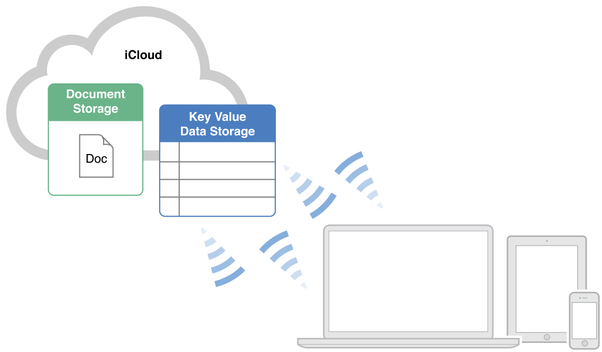

> 导航：[总目录](../../../README.md) · [documentation](../../../_indexes/documentation.md) · [File System Programming Guide](About%20Files%20and%20Directories.md)

[Next](Using%20the%20Open%20and%20Save%20Panels.md)[Previous](The%20Role%20of%20File%20Coordinators%20and%20Presenters.md)

# iCloud File Management

Use the iCloud Storage APIs to write user documents and data to a central location and access those items from all of a user’s computers and iOS devices. Making a user’s documents ubiquitous using iCloud means that a user can view or edit those documents from any device without having to sync or transfer files explicitly. Storing documents in a user’s iCloud account also provides a layer of security for that user. Even if a user loses a device, the documents on that device are not lost if they are in iCloud storage.

Documents in iCloud provide the central location from which updates can be delivered to a user’s computers and iOS devices. All documents must be created on a local disk initially and moved to a user’s iCloud account later. A document targeted for iCloud storage is not moved to iCloud immediately, though. First, it is moved from its current location in the file system to a local system-managed directory where it can be monitored by the iCloud service. After that transfer, the file is transferred to iCloud and to the user’s other devices as soon as possible.

While in iCloud storage, changes made on one device are stored locally and then pushed to iCloud using a local daemon, as shown in Figure 4-1. To prevent large numbers of conflicting changes from occurring at the same time, apps are expected to use file coordinator objects to perform all changes. File coordinators mediate changes between your app and the daemon that facilitates the transfer of the document to and from iCloud. In this way, the file coordinator acts like a locking mechanism for the document, preventing your app and the daemon from modifying the document simultaneously.

__Figure 4-1__  Pushing document changes to iCloud

!

From an implementation perspective, the easiest way to manage documents in iCloud is to use the [NSDocument](https://developer.apple.com/documentation/appkit/nsdocument) class. This class does most of the heavy lifting required to read and write files that are stored in iCloud. Specifically, the `NSDocument` class handles the creation and use of file coordinators to modify the document. This class also seamlessly integrates document changes coming from other devices. The class even helps handle the potential conflicts that can arise when two devices do manage to update the same file in conflicting ways. You are not required to use the `NSDocument` class to manage your app’s documents, but using it requires less effort on your part.

Most apps will use iCloud document storage to share documents from a user’s iCloud account. This is the feature that users think of when they think of iCloud storage. A user cares about whether documents are shared across devices and can see and manage those documents from a given device. In contrast, the iCloud key-value data store is not something a user would see. It is a way for your app to share very small amounts of data (tens of kilobytes) with other instances of itself. Apps can use this feature to store important state information. A magazine app might save the issue and page that the user read last, while a stocks app might store the stock symbols the user is tracking.

The sections that follow provide more details about how to implement different aspects of iCloud storage for your app. For additional information about using specific classes and interfaces, see the corresponding reference documentation.

When your app needs to read or write a document in iCloud, it must do so in a coordinated manner. Your app might not be the only app trying to manipulate the local file at any given moment. The daemon that transfers the document to and from iCloud also needs to manipulate it periodically. To prevent your app from interfering with the daemon (and vice versa), the system provides a coordinated locking mechanism that works with the files and directories you target for iCloud storage.

At the heart of the iCloud locking mechanism are file coordinators and file presenters. Whenever you need to read and write a file, you do so using a _file coordinator_, which is an instance of the [NSFileCoordinator](https://developer.apple.com/documentation/foundation/nsfilecoordinator) class. The job of a file coordinator is to coordinate the reads and writes performed by your app and the sync daemon on the same document. For example, your app and the daemon may both read the document at the same time but only one may write to the file at any single time. Also, if one process is reading the document, the other process is prevented from writing to the document until the reader is finished.

In addition to coordinating operations, file coordinators also work with file presenters to notify apps when changes are about to occur. A _file presenter_ is any object that conforms to the [NSFilePresenter](https://developer.apple.com/documentation/foundation/nsfilepresenter) protocol and takes responsibility for managing a specific file (or directory of files) in an app. The job of a file presenter is to protect the integrity of its own data structures. It does this by listening for messages from other file coordinators and using those messages to update its internal data structures. In most cases, a file presenter may not have to do anything. However, if a file coordinator declares that it is about to move a file to a new URL, the file presenter would need to replace its old URL with the new one provided to it by the file coordinator. The [NSDocument](https://developer.apple.com/documentation/appkit/nsdocument) class is an example of a file presenter that tracks changes to its underlying file or file package.

Here is a checklist of the things your app must do to work with documents in iCloud:

- Manage each document in iCloud using a file presenter. The recommended way to do this is to use the `NSDocument` class, but you may define custom file presenters if you prefer. You can use a single file presenter to manage a file package or a directory of files.
- After creating a file presenter, register it by calling the [addFilePresenter:](https://developer.apple.com/documentation/foundation/nsfilecoordinator/1417120-addfilepresenter) class method of `NSFileCoordinator`. Registration is essential. The system can notify only registered presenter objects.
- Before deleting a file presenter, unregister it by calling the [removeFilePresenter:](https://developer.apple.com/documentation/foundation/nsfilecoordinator/1414924-removefilepresenter) method of `NSFileCoordinator`.

All file-related operations must be performed through a file coordinator object. To read or write a document, or move or delete it, follow these steps:

1. Create an instance of the [NSFileCoordinator](https://developer.apple.com/documentation/foundation/nsfilecoordinator) class and initialize it with the file presenter object that is about to perform the file operation.
2. Use the methods of the `NSFileCoordinator` object to read or write the file:

   - To read all or part of a single file, use the [coordinateReadingItemAtURL:options:error:byAccessor:](https://developer.apple.com/documentation/foundation/nsfilecoordinator/1407416-coordinate) method
   - To write to a file or delete it, call the [coordinateWritingItemAtURL:options:error:byAccessor:](https://developer.apple.com/documentation/foundation/nsfilecoordinator/1413344-coordinate) method.
   - To perform a sequence of read or write operations, use the [coordinateReadingItemAtURL:options:writingItemAtURL:options:error:byAccessor:](https://developer.apple.com/documentation/foundation/nsfilecoordinator/1413385-coordinatereadingitematurl) method.
   - To write to multiple files, or to move a file to a new location, use the [coordinateWritingItemAtURL:options:writingItemAtURL:options:error:byAccessor:](https://developer.apple.com/documentation/foundation/nsfilecoordinator/1408970-coordinate) method.

   You perform the actual file-related operations in the block that you pass to these methods. You should perform operations as quickly as possible to avoid blocking other apps that might be trying to access the file at the same time.
3. When you are done with the operations, release the file coordinator object.

For more information about using file coordinators and file presenters, see [The Role of File Coordinators and Presenters](The%20Role%20of%20File%20Coordinators%20and%20Presenters.md#apple-f4xwc4dqnrsv64tfmyxwi33df52wszbpkridimbqgeydmnzsfvbuqmjrfvjvomi).

To move a document to iCloud storage:

1. Create and save the file in an appropriate local directory.
2. If you are not using the [NSDocument](https://developer.apple.com/documentation/appkit/nsdocument) class to manage your file, create a file presenter to be responsible for it. For information on file presenters, see Working with Documents in iCloud.
3. Create an [NSURL](https://developer.apple.com/documentation/foundation/nsurl) object that specifies the destination of the file in a user’s iCloud storage.

   You must put files in one of the container directories associated with your app. Call the [URLForUbiquityContainerIdentifier:](https://developer.apple.com/documentation/foundation/nsfilemanager/1411653-urlforubiquitycontaineridentifie) method of `NSFileManager` to get the root URL for the directory, and then append any additional directory and filenames to that URL. (Apps may put documents in any container directory for which they have the appropriate entitlement.)
4. Call the [setUbiquitous:itemAtURL:destinationURL:error:](https://developer.apple.com/documentation/foundation/filemanager/1413989-setubiquitous) method of `NSFileManager` to move the file to the specified destination in iCloud.

When moving documents to iCloud, you can create additional subdirectories inside the container directory to manage your files. It is strongly recommended that you create a `Documents` subdirectory and use that directory for storing user documents. In iCloud, the contents of the `Documents` directory are made visible to the user so that individual documents can be deleted. Everything outside of the `Documents` directory is grouped together and treated as a single entity that a user can keep or delete. You create subdirectories in a user’s iCloud storage using the methods of the `NSFileManager` class just as you would any directory.

After you move a document to iCloud, it is not necessary to save a URL to the document’s location persistently. If you manage a document using a `NSDocument` object, that object automatically updates its local data structures with the document’s new URL. However, it does not save that URL to disk, and neither should your custom file presenters. Instead, because documents can move while in a user’s iCloud storage, you should use an [NSMetadataQuery](https://developer.apple.com/documentation/foundation/nsmetadataquery) object to search for documents. Searching guarantees that your app has the correct URL for accessing the document. For information on how to search for documents in iCloud, see iCloud Storage APIs.

For more information about the methods of the `NSFileManager` class, see _[NSFileManager Class Reference](https://developer.apple.com/documentation/foundation/filemanager)_.

To locate documents in iCloud storage, your app must search using an [NSMetadataQuery](https://developer.apple.com/documentation/foundation/nsmetadataquery) object. Searching is a guaranteed way to locate documents in a user’s iCloud storage. You should always use query objects instead of saving URLs persistently because the user can delete files from iCloud storage when your app is not running. Using a query to search is the only way to ensure an accurate list of documents.

The `NSMetadataQuery` class supports the following search scopes for your documents:

- Use the [NSMetadataQueryUbiquitousDocumentsScope](https://developer.apple.com/documentation/foundation/nsmetadataqueryubiquitousdocumentsscope) constant to search for documents in iCloud that reside somewhere inside a `Documents` directory. (For any given container directory, put documents that the user is allowed to access inside a `Documents` subdirectory.)
- Use the [NSMetadataQueryUbiquitousDataScope](https://developer.apple.com/documentation/foundation/nsmetadataqueryubiquitousdatascope) constant to search for documents in iCloud that reside anywhere other than in a `Documents` directory. (For any given container directory, use this scope to store user-related data files that your app needs to share but that are not files you want the user to manipulate directly.)

To use a metadata query object to search for documents, create a new [NSMetadataQuery](https://developer.apple.com/documentation/foundation/nsmetadataquery) object and do the following:

1. Set the search scope of the query to an appropriate value (or values). It’s important to note that it is not possible to combine local file system searches with iCloud searches. The search must be run separately.
2. Add a predicate to narrow the search results. For example, to search for all files, specify a predicate with the format `NSMetadataItemFSNameKey == *`.
3. Register for the query notifications and configure any other query parameters you care about, such as sort descriptors, notification intervals, and so on.

   The `NSMetadataQuery` object uses notifications to deliver query results. At a minimum, you should register for the [NSMetadataQueryDidUpdateNotification](https://developer.apple.com/documentation/foundation/nsnotification/name/1413406-nsmetadataquerydidupdate) notification, but you might want to register for others in order to detect the beginning and end of the results-gathering process.
4. Call the [startQuery](https://developer.apple.com/documentation/foundation/nsmetadataquery/1407304-startquery) method of the query object.
5. Run the current run loop so that the query object can generate the results.

   If you started the query on your app’s main thread, simply return and let the main thread continue processing events. If you started the query on a secondary thread, you must configure and execute a run loop explicitly. For more information about executing run loops, see _[Threading Programming Guide](../../Cocoa/Threading%20Programming%20Guide/Introduction.md#apple-f4xwc4dqnrsv64tfmyxwi33df52wszbpgeydambqga2to2i)_.
6. Process the results in your notification-handler methods.

   When processing results, always disable updates first. Doing so prevents the query object from modifying the result list while you are using it. When you are done processing the results, reenable updates again to allow new updates to arrive.
7. When you are ready to stop the search, call the [stopQuery](https://developer.apple.com/documentation/foundation/nsmetadataquery/1408021-stopquery) method of the query object.

For more information on how to create and run metadata queries, see _[File Metadata Search Programming Guide](../../Carbon/File%20Metadata%20Search%20Programming%20Guide/About%20File%20Metadata%20Queries.md#apple-f4xwc4dqnrsv64tfmyxwi33df52wszbpkridimbqgaytqnbr)_.

File wrappers let you treat a hierarchy of directories and files as a single package. However, by default iCloud does not recognize these packages and treats their contents as ordinary collections of directories and files. As a result, all of the file wrapper’s contents might be returned by a [NSMetadataQuery](https://developer.apple.com/documentation/foundation/nsmetadataquery). The contents might also appear when a user examines the iCloud storage for your app using Settings (iOS) or System Preferences (macOS).

To ensure that your file wrapper is treated as a single package, your app must export a properly formatted UTI for your package. Specifically, you must specify that the UTI conforms to `com.apple.package`, and you must set the extension as an additional property using the `UTTypeTagSpecification` and `public.filename-extension` keys, as shown in Figure 4-2.

__Figure 4-2__  Exporting File Wrapper UTIs

!

For detailed information about setting and exporting document UTIs, see [Document-Based Application Preflight](https://developer.apple.com/library/archive/documentation/DataManagement/Conceptual/DocumentBasedAppPGiOS/DocumentImplPreflight/DocumentImplPreflight.html#//apple_ref/doc/uid/TP40011149-CH3). For additional information about file wrappers, see [Using FileWrappers as File Containers](Using%20FileWrappers%20as%20File%20Containers.md#apple-f4xwc4dqnrsv64tfmyxwi33df52wszbpkridimbqgeydmnzsfvbuqmjtfvjvomq).

When multiple instances of your app (running on different computers or iOS devices) try to modify the same document in iCloud, a conflict can occur. For example, if two iOS devices are not connected to the network and the user makes changes on both, both devices try to push their changes to iCloud when they are reconnected to the network. At this point, iCloud has two different versions of the same file and has to decide what to do with them. Its solution is to make the most recently modified file the _current file_ and to mark any other versions of the file as _conflict versions_.

Your app is notified of conflict versions through its file presenter objects. It is the job of the file presenter to decide how best to resolve any conflicts that arise. Apps are encouraged to resolve conflicts quietly whenever possible, either by merging the file contents or by discarding the older version if the older data is no longer relevant. However, if discarding or merging the file contents is impractical or might result in data loss, your app might need to prompt the user for help in choosing an appropriate course of action. For example, you might let the user choose which version of the file to keep, or you might offer to save the older version under a new name.

Apps should always attempt to resolve conflict versions as soon as possible. When conflict versions exist, all of the versions remain in a user’s iCloud storage (and locally on any computers and iOS devices) until your app resolves them. The current version of the file and any conflict versions are reported to your app using instances of the [NSFileVersion](https://developer.apple.com/documentation/foundation/nsfileversion) class.

To resolve conflicts:

1. Get the current file version using the [currentVersionOfItemAtURL:](https://developer.apple.com/documentation/foundation/nsfileversion/1412963-currentversionofitematurl) class method of `NSFileVersion`.
2. Get an array of conflict versions using the [unresolvedConflictVersionsOfItemAtURL:](https://developer.apple.com/documentation/foundation/nsfileversion/1417854-unresolvedconflictversionsofitem) class method of `NSFileVersion`.
3. For each conflict version object, perform whatever actions are needed to resolve the conflict. Options include:

   - Merging the conflict versions with the current file automatically, if it is practical to do so.
   - Ignoring the conflict versions, if doing so does not result in any data loss.
   - Prompting the user to select which version (current or conflict) to keep. This should always be your last option.
4. Update the current file as needed.

   - If the current file version remains the winner, you do not need to update the current file.
   - If a conflict version is chosen as the winner, use a coordinated write operation to overwrite the contents of the current file with the contents of the conflict version.
   - If the user chooses to save the conflict version under a different name, create the new file with the contents of the conflict version.
5. Set the [resolved](https://developer.apple.com/documentation/foundation/nsfileversion/1414906-resolved) property of the conflict version objects to `YES`.

   Setting this property to `YES` causes the conflict version objects (and their corresponding files) to be removed from the user’s iCloud storage.

For more information about file versions and how you use them, see _[NSFileVersion Class Reference](https://developer.apple.com/documentation/foundation/nsfileversion)_.

Apps that take advantage of iCloud storage features should act responsibly when storing data in there. The space available in each user’s account is limited and is shared by all apps. In addition, users can see how much space is consumed by a given app and choose to delete documents and data associated with your app. For these reasons, it is in your app’s interest to be responsible about what files you store. Here are some tips to help you manage documents appropriately:

- Rather than storing all documents, let a user choose which documents to store in an iCloud account. If a user creates a large number of documents, storing all of those documents in iCloud could overwhelm that user’s available space. Providing a way for a user to designate which documents to store in iCloud gives that user more flexibility in deciding how best to use the available space.
- Remember that deleting a document removes it from a user’s iCloud account and from all of that user’s computers and devices. Make sure that users are aware of this fact and confirm any delete operations. For your app to refresh the local copy of a document, use the [evictUbiquitousItemAtURL:error:](https://developer.apple.com/documentation/foundation/nsfilemanager/1409696-evictubiquitousitematurl) method of `NSFileManager`.
- When storing documents in iCloud, place them in a `Documents` directory whenever possible. Documents inside a `Documents` directory can be deleted individually by the user to free up space. However, everything outside that directory is treated as data and must be deleted all at once.
- Never store caches or other files that are private to your app in a user’s iCloud storage. A user’s iCloud account should be used only for storing user data and content that cannot be re-created by your app.

[Next](Using%20the%20Open%20and%20Save%20Panels.md)[Previous](The%20Role%20of%20File%20Coordinators%20and%20Presenters.md)

