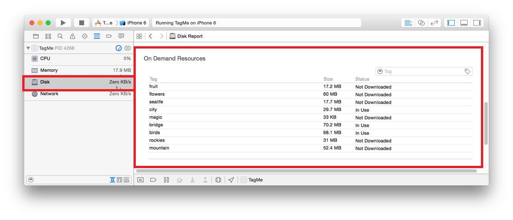

> 导航：[总目录](../../../README.md) · [documentation](../../../_indexes/documentation.md) · [On-Demand Resources Guide](index.md)

## Debugging On-Demand Resources

As you develop apps that provide on-demand resources you can encounter different types:

- __Downloading resources.__ Issues with downloading resources.
- __Local storage space.__ Running out of local storage for downloading on-demand resources or for already downloaded resources..
- __Unexpected state.__ On-demand resource tags are not in the expected state. For example, a tag shows that it is in use when all parts of the app should have ended access.

### Problems Downloading Resources

Problems with downloading resources fall into three categories:

- Networking issues
- Asset pack size
- Nonexistent resources

### Networking Issues

Debugging networking issues is made easier with the [Reachability](https://developer.apple.com/library/archive/samplecode/Reachability/Introduction/Intro.html#//apple_ref/doc/uid/DTS40007324-Intro) sample code. It can check for network connectivity and the type of connection, and it can determine whether a specific host is reachable. You can use the information to isolate common networking problems. For example, if the host is reachable but the resources cannot be downloaded, either the app has the wrong URL for resources, or the host configuration has changed.

Other common network issues include the following:

- The device is not connected to the network.
- The device is connected to cellular, and the user has turned off data access for the app.
- There is connectivity, but the server is not available.
- The app is using self-hosted on-demand resources, and the URL for the content has changed.

### Asset Pack Sizes

Asset packs that are large can take too long to download. Find these kind of problems by testing the downloads under various conditions. For more information, see [Optimization with Testing](TestingPerformance.md#apple-f4xwc4dqnrsv64tfmyxwi33df52wszbpkridimbqge2taobtfvbuqmrrfvjvomi).

### Nonexistent Resources

The error of having nonexistent resources occurs when one or more of the tags in the resource request are invalid.

Calling [beginAccessingResourcesWithCompletionHandler:](https://developer.apple.com/documentation/foundation/nsbundleresourcerequest/1614840-beginaccessingresources) sets the `error` code to `NSBundleOnDemandResourceInvalidTagError`.

The error can also happen in a call to [conditionallyBeginAccessingResourcesWithCompletionHandler:](https://developer.apple.com/documentation/foundation/nsbundleresourcerequest/1614834-conditionallybeginaccessingresou). Generally this error is due to a typo in the tag list.

The best approach to finding the error is to compare the tags in the [NSBundleResourceRequest](https://developer.apple.com/documentation/foundation/nsbundleresourcerequest) object against the tags in the project.

### Problems with Storage Space

There are two types of problems that can occur with storage space:

- The requested resources exceed the maximum in-use memory.
- The requested resources exceed the available system memory.

### Exceeding Maximum In-Use Memory

Requesting access to resources that exceed the in-use memory happens in a call to [beginAccessingResourcesWithCompletionHandler:](https://developer.apple.com/documentation/foundation/nsbundleresourcerequest/1614840-beginaccessingresources) or [conditionallyBeginAccessingResourcesWithCompletionHandler:](https://developer.apple.com/documentation/foundation/nsbundleresourcerequest/1614834-conditionallybeginaccessingresou). The `error` in the block passed to `beginAccessingResourcesWithCompletionHandler:` is `NSBundleOnDemandResourceExceededMaximumSizeError`.

To fix the problem, release in-use on-demand resources. You can release a tag by sending [endAccessingResources](https://developer.apple.com/documentation/foundation/nsbundleresourcerequest/1614843-endaccessingresources) to [NSBundleResourceRequest](https://developer.apple.com/documentation/foundation/nsbundleresourcerequest) using the tag. You can also deallocate the resource requests. Remember that a tag can be referred to by multiple resource requests.

For the in-use memory limits, see [Platform Sizes for On-Demand Resources](PlatformSizesforOn-DemandResources.md#apple-f4xwc4dqnrsv64tfmyxwi33df52wszbpkridimbqge2taobtfvbuqmrtfvjvomi).

### Exceeding System Memory

The error of exceeding the amount of system memory for on-demand resources can occur in two ways.

The first way to run out of system memory is to request access to resources that require more memory than is currently available. Calling [beginAccessingResourcesWithCompletionHandler:](https://developer.apple.com/documentation/foundation/nsbundleresourcerequest/1614840-beginaccessingresources) when this problem happens sets the `error` code to `NSBundleOnDemandResourceOutOfSpaceError`. You can tell how much memory is in use by looking at the debug disk gauge.

The error also happens when the system runs out of space to allocate on-demand resources and needs to free up space in the cache. This error can happen at any time, including when your app is in the background. For information on detecting this storage problem, see [Low-Space Warning](Managing.md#apple-f4xwc4dqnrsv64tfmyxwi33df52wszbpkridimbqge2taobtfvbuqnbnknltcmy).

### Unexpected State

The most useful tool for debugging an unexpected state problem is the disk gauge shown in the debug navigator when your app is run in debug mode. The gauge contains a section for on-demand resources that indicates their current state as shown in [Figure 6-1](#apple-f4xwc4dqnrsv64tfmyxwi33df52wszbpkridimbqge2taobtfvbuqnrnknlto).

__Figure 6-1__On-demand resources in the disk gauge

The disk gauge shows the size and status for each tag. The size is the slimmed size for the current device.

### Tag Status

Table 6-1 gives a description of the possible values for the status of a tag in the disk gauge tool.

__Table 6-1__Tag status

| Status | Description |
| --- | --- |
| Not Downloaded | The tag has not been downloaded to the device during this debug session. |
| Partially Downloaded | The tag is partially downloaded likely due to an interruption in connectivity. |
| Downloading | The tag is downloading. If possible, a progress bar is shown. |
| Downloaded | The tag is on the device and not in use by any `NSBundleResourceRequest` objects. |
| In Use | The tag is on the device and in use by the app. |
| Purged | The tag was on the device and has been purged from local storage. Before being used, it must be downloaded. |

### Opening the Disk Gauge

You can use the disk gauge when you run your app in debug mode in the simulator or on a device.

__To open the disk gauge__

1. Choose View > Navigators > Show Debug Navigator.
2. Use the Scheme pop-up menu to choose a target and a device.
3. Choose Product > Run to launch your app.

   The app launches on the chosen device, and the debugger attaches to the app.
4. Click the Disk Gauge icon in the list of gauges in the debug navigator.

   The disk gauge appears in the content area of the workspace window.
5. Scroll down until the On-Demand Resources category is visible.

   You may want to resize the content area to show all of your tags.

After the disk gauge is open, use your app and monitor the status of your tags.

[Accessing and Downloading On-Demand Resources](Managing.md#apple-f4xwc4dqnrsv64tfmyxwi33df52wszbpkridimbqge2taobtfvbuqnbnknltc)

[Hosting Essentials](IntrotoHostingODR.md#apple-f4xwc4dqnrsv64tfmyxwi33df52wszbpkridimbqge2taobtfvbuqmjxfvjvomi)
