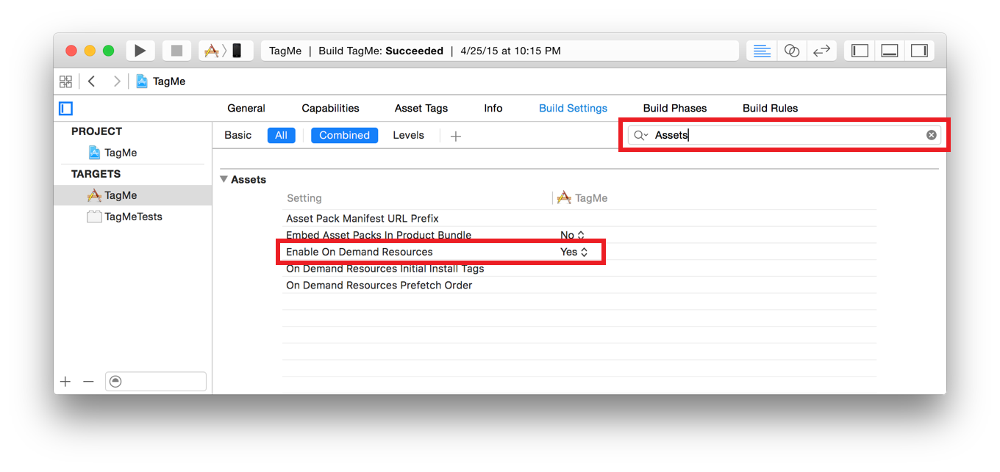

> 导航：[总目录](../../../README.md) · [documentation](../../../_indexes/documentation.md) · [On-Demand Resources Guide](index.md)

## Enabling On-Demand Resources

On-demand resources are enabled by default for apps targeting iOS 9.0 or later. You can manually change this in the build settings for a target (Figure 2-1).

__Figure 2-1__Enable on-demand resources build setting

__Setting enable or disable on-demand resources__

1. In the project navigator, select the project file.
2. In the project editor, select the target.
3. Select the Build Settings pane.
4. Show the Assets category.

   > [!TIP]
   > 
5. Set the value of the Enable On-Demand Resources setting.

   - Yes enables on-demand resources for the target.
   - No disables on-demand resources for the target.

> [!NOTE]
> 

[On-Demand Resources Essentials](index.md#apple-f4xwc4dqnrsv64tfmyxwi33df52wszbpkridimbqge2taobtfvbuqmrnknltc)

[Creating and Assigning Tags](Tagging.md#apple-f4xwc4dqnrsv64tfmyxwi33df52wszbpkridimbqge2taobtfvbuqmznknltc)
