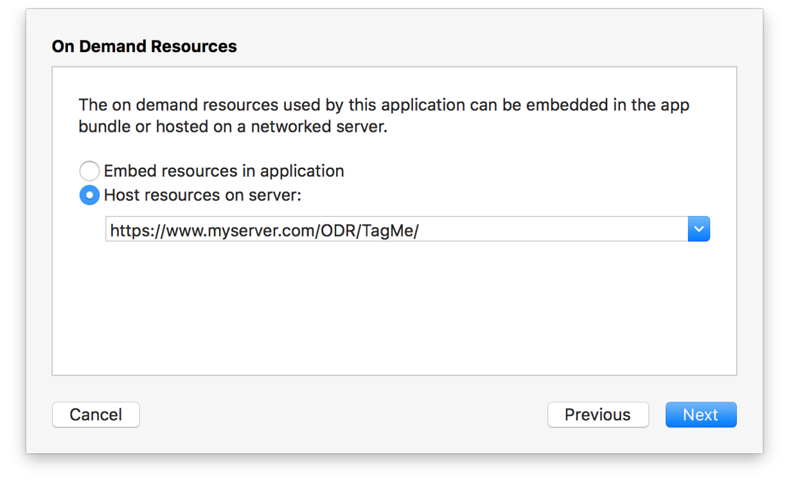
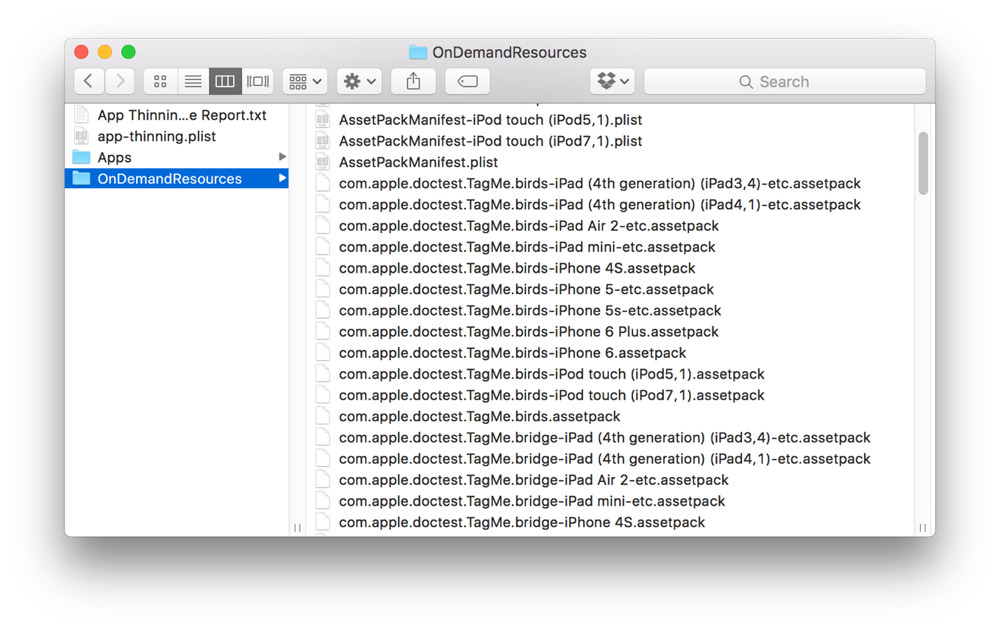

> 导航：[总目录](../../../README.md) · [documentation](../../../_indexes/documentation.md) · [On-Demand Resources Guide](index.md)

## Generating Hosted Asset Packs

Generate the asset packs for your server by exporting an archive of your app.

__To generate asset packs__

1. Open the Archives organizer window by choosing Window > Organizer.

   The Organizer window opens.
2. If the Crashes organizer is showing, click the Archives button to show the Archives pane.
3. Choose your app in the list of apps on the left side of the window.

   The archives for your app appear in the main window.

   If there are no archives or if the desired archive is not shown, create an archive using the directions in Archiving Your App in the _App Distribution Guide_.
4. Choose the desired archive of your app.
5. Click the Export button.
6. Choose the export option, and click Next.
7. From the pop-up menu that appears, choose your team.
8. In the Device Support dialog, choose to export a universal app, an app for a specific device, or app variants for every device and click Next.

   Your choice controls how many sets of asset packs are generated. One set is generated for each app variant.
9. Select "Host resources on server:" in the On Demand Resources dialog, enter the URL for the hosted resources, and click Next.

   The On-Demand Resources dialog is configured to generate asset packs with a hosted URL of `https://.www.myserver.com/ODR/TagMe/`.

   
10. In the Summary dialog, click Next. Xcode generates the app bundles and asset packs.

    Xcode opens the exported app folder by default. The asset packs are in the `OnDemandResources` folder.

    

After you’ve generated the asset packs, copy them to the correct location on your server.

[Setting the Host in an App](EnablingHosting.md#apple-f4xwc4dqnrsv64tfmyxwi33df52wszbpkridimbqge2taobtfvbuqmjyfvjvomi)

[General Design Principles](AboutDesigningODR.md#apple-f4xwc4dqnrsv64tfmyxwi33df52wszbpkridimbqge2taobtfvbuqmrqfvjvomi)
