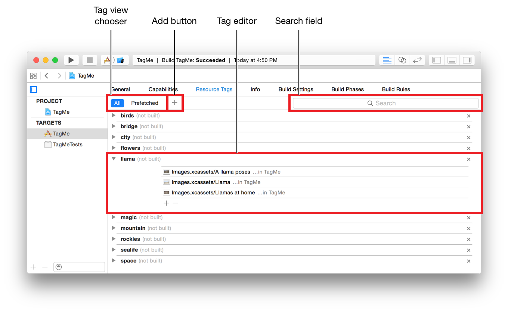
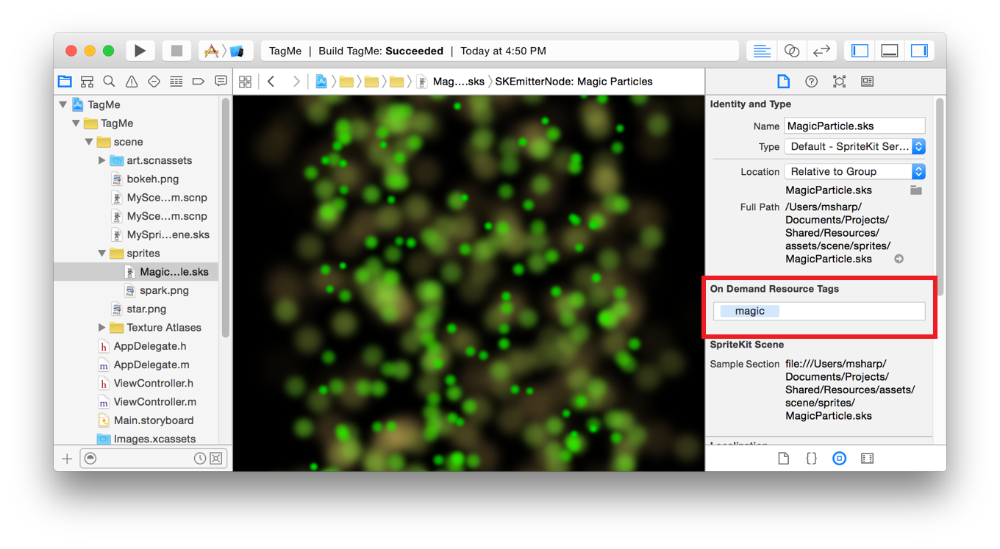
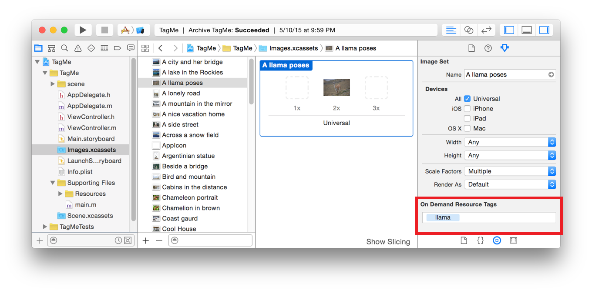
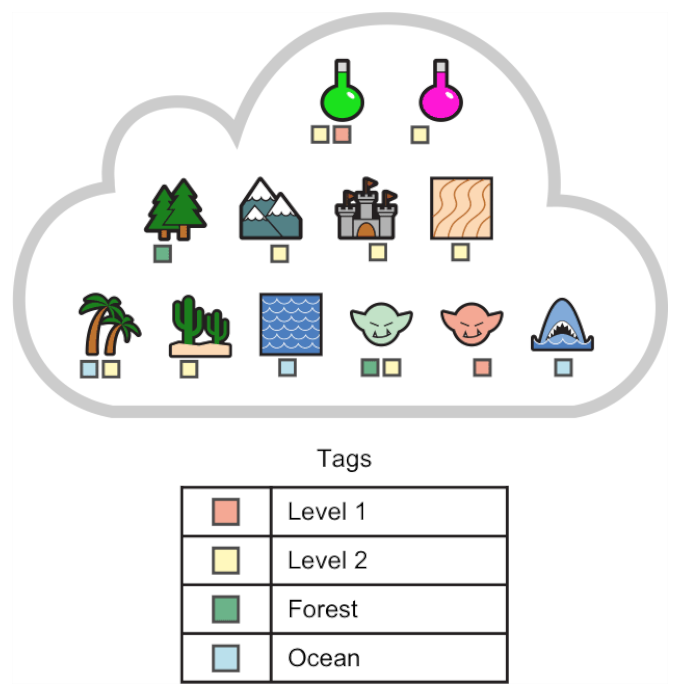
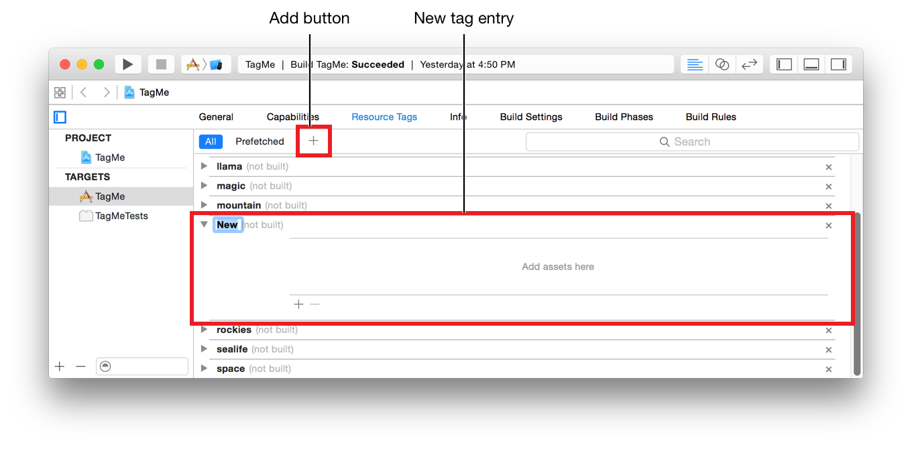
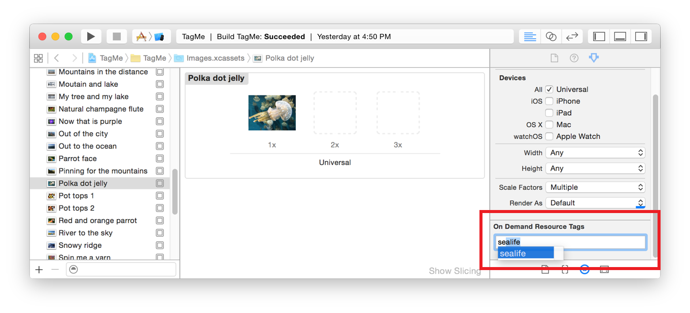
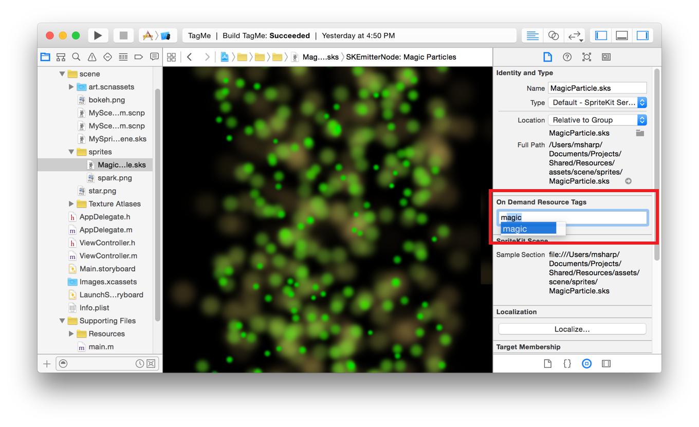
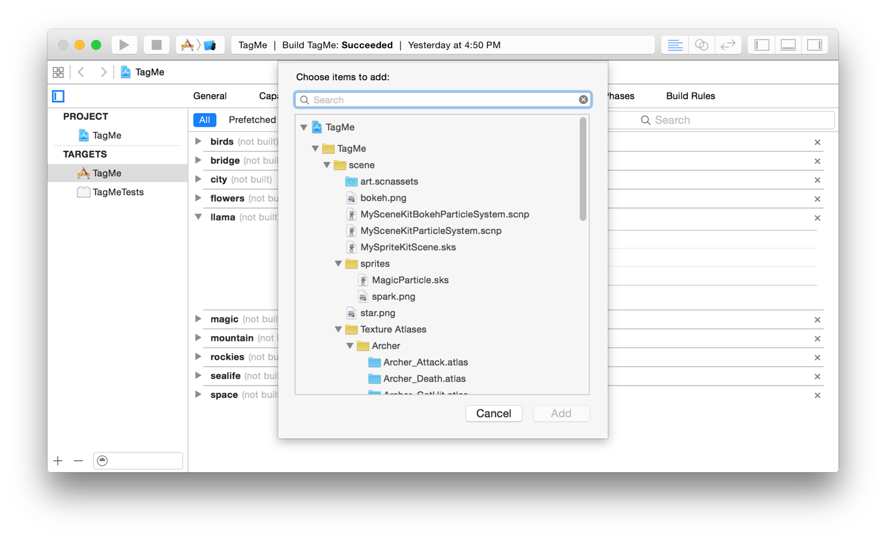
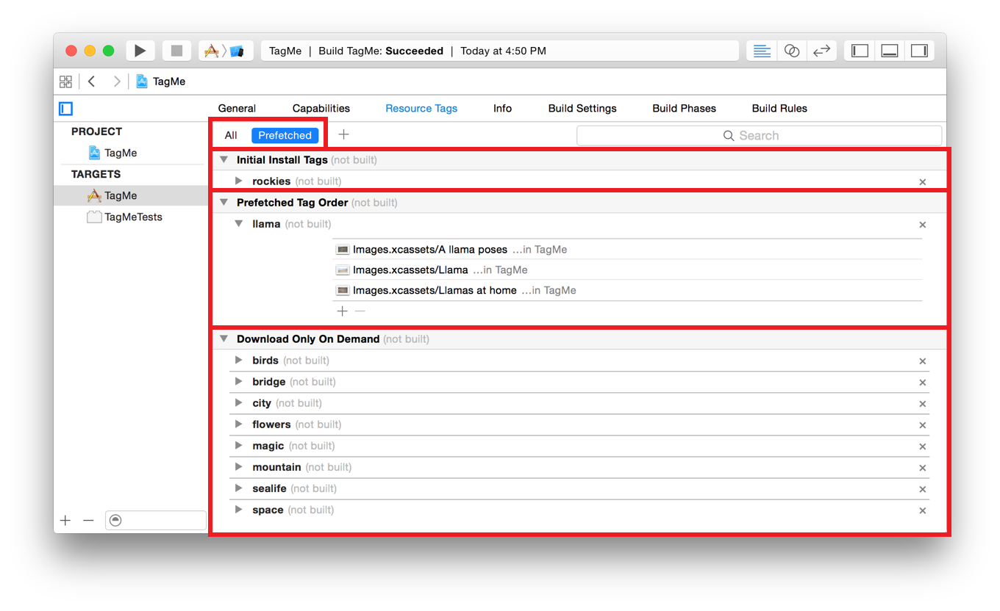

> 导航：[总目录](../../../README.md) · [documentation](../../../_indexes/documentation.md) · [On-Demand Resources Guide](index.md)

## Creating and Assigning Tags

_Tags_ are used to identify and manage sets of on-demand resources. Assigning one or more tags to a resource in your project identifies it as an on-demand resource. At runtime, all calls for managing on-demand resources work with tags, not individual resources. Runtime management of on-demand resources is covered in [Accessing and Downloading On-Demand Resources](Managing.md#apple-f4xwc4dqnrsv64tfmyxwi33df52wszbpkridimbqge2taobtfvbuqnbnknltc).

### Resource Tags in Xcode

Xcode provides tools for creating and editing tags, adding and deleting the resources that are part of a tag, and specifying when the resources associated with a tag are downloaded by the operating system.

### The Resource Tags Pane

The Resource Tags pane (Figure 3-1) includes:

- __Tag view chooser.__ Switch between viewing all tags or viewing tags grouped by prefetch category.
- __Add button.__ Create new tags.
- __Tag editor.__ Change the name of the tag, delete the tag, and add and delete resources to the tag. The total storage size for all resources that are part of a tag are displayed in parentheses next to a tag name. The size is based on the device that was the target of the last build.
- __Search field.__ Find specific tags or resources.

__Figure 3-1__Resource tags pane

### The On-Demand Resource Tags Field

The On-Demand Resource Tags field is a quick way to view, add, and delete tags for a file, folder, or resource. For files and folders in the Project navigator, the field is shown in the File inspector. The field is enabled for folders or for any types of files that can be tagged, as shown in Figure 3-2.

__Figure 3-2__Resource tags field for a file

In an asset catalog, the field is shown in the Attributes inspector for folders or for any types of assets that can be tagged, as shown in Figure 3-3. For more information on asset catalogs, see Asset Catalog Help.

__Figure 3-3__Resource tags field for an asset catalog item

When you build your project, Xcode examines all the tagged items in both the project and in asset catalogs and generates the asset packs used by the operating system. The advantage to using asset catalogs is that the on-demand resources will be sliced when they are downloaded to a device. For more information on slicing, see App Thinning (iOS, watchOS).

### Creating Tags

The first step in creating tags is examining how your app uses resources at runtime. Look for resources that:

- Enhance the user experience but are not required to launch the app. These include resources that provide high-resolution artwork, higher-quality sounds, and other enhancements.
- Are required only when the app is in well-defined states.

Resources belonging to these categories are possible on-demand resources. Resources that are required soon after the first app launch can be set to automatically prefetch after installation. For information on how to do this, see [Prefetching Tags](#apple-f4xwc4dqnrsv64tfmyxwi33df52wszbpkridimbqge2taobtfvbuqmznknlte).

Group the on-demand resources into related sets. The tag name for each set can identify how the resources in that set are used. For example, one set could be all scenery associated with a forest and called `forest-scenery`. Assigning a tag to a resource makes it a member of set of associated resources for that tag. A resource can be a member of multiple sets. For example, in Figure 3-4, the resources for the game are divided into both levels and locations.

__Figure 3-4__Tagged resource sets

__To create a new tag__

1. In the project navigator, select the project file.
2. Open the project editor for the target for the new tag.
3. Select the Resource Tags pane.
4. Click the Add button (+) in the upper-left corner of the pane.

   A new tag entry appears.

   
5. Replace the selected placeholder name of the new tag entry with your tag name.

You can also create tags by typing a new name in the On-Demand Resources Tags field as shown in [Associating Tags with Resources](#apple-f4xwc4dqnrsv64tfmyxwi33df52wszbpkridimbqge2taobtfvbuqmznknltm).

### Associating Tags with Resources

Tags can be added to any folder or valid on-demand resource type in an asset catalog or in the project. See [Table 1-1](index.md#apple-f4xwc4dqnrsv64tfmyxwi33df52wszbpkridimbqge2taobtfvbuqmrnknltm) for a list of valid types.

> [!NOTE]
> 

__To add a tag to a folder or resource in the asset catalog__

1. In the project navigator, select an asset catalog.
2. In the set list, select the folder or resource.
3. Open the Attributes inspector for the selected item.
4. In the On-Demand Resources Tags field, type the name of the tag.

   Xcode uses name completion as you type characters.

   
5. Accept the tag name by pressing the Return key.

   > [!NOTE]
   > 

__To add a tag to a folder or file in the project__

1. In the project navigator, select a file.
2. Open the utilities area and click on File inspector button in the inspector bar.
3. In the utilities area, click on the File inspector.
4. In the On-Demand Resources Tags field, type the name of the tag.

   Xcode uses name completion as you type characters.

   
5. Accept the tag name by pressing the Return key.

   > [!NOTE]
   > 

__To add a file or folder from the project to a tag using the Resource Tags pane__

1. In the project navigator, select the project file.
2. Open the project editor for the target.
3. Select the Resource Tags pane.
4. In the search field, type the name of the tag.

   The list of tags is filtered based on the search string.
5. Click the Add button (+).

   A dialog appears.

   
6. In the search field, type the name of the resource file.
7. Select the desired resource file and click Add.

   The resource file is added to the tag.

### Prefetching Tags

Usually the operating system starts downloading resources associated with a tag when the tag is requested by an app and the resources are not already on the device. Some tags contain resources that are important the first time the app launches or are required soon after the first launch. For example, a tutorial is important the first time the app is launched, but it is unlikely to be used again.

You assign tags to one of three prefetch categories in the Prefetched view in the Resource Tags pane: Initial Install Tags, Prefetched Tag Order, and Download Only On Demand, see Figure 3-5.

__Figure 3-5__Prefetch view of the resource tags editor

The default category for a tag is Download Only On Demand. The view displays the tags grouped by their prefetch category and the total size for each category. The size is based on the device that was the target of the last build. Tags can be dragged between categories.

- __Initial install tags.__ The resources are downloaded at the same time as the app. The size of the resources is included in the total size for the app in the App Store. The tags can be purged when they are not being accessed by at least one [NSBundleResourceRequest](https://developer.apple.com/documentation/foundation/nsbundleresourcerequest) object.
- __Prefetch tag order.__ The resources start downloading after the app is installed. The tags will be downloaded in the order in which they are listed in the Prefetched tag order group.
- __Dowloaded only on demand.__ The tags are downloaded when requested by the app.

Prefetching of on-demand resources occurs only when the app is installed. The resources are downloaded to local device storage but are not retained. If the user takes a long time between installing the app and launching the app, it is possible that prefetched resources are no longer on the device.

When the operating system downloads a tag, it downloads only resources not already on the device.

__To set a tag to be included with app install__

1. In the project navigator, select the project file.
2. Open the project editor for the target.
3. Select the Resource Tags pane.
4. In the Tag view chooser, click Preferred.
5. In the content area, click the disclosure triangle next to the Initial Install Tags category.
6. In the content area, click the disclosure triangle next to the category containing the tag you want to include in the initial install.
7. Click and drag the tag into the Initial Install Tags list.

__To set a tag to be downloaded after the app is installed__

1. In the project navigator, select the project file.
2. Open the project editor for the target.
3. Select the Resource Tags pane.
4. In the Tag view chooser, click Preferred.
5. In the content area, click the disclosure triangle next to the Prefetched Tag Order category.
6. In the content area, click the disclosure triangle next to the category containing the tag you want to be prefetched.
7. Click and drag the tag into the Prefetched Tag Order list.

   The position in the list determines download order. The item at the top of the list is downloaded first.

__To set a tag to be downloaded only when requested by the app__

1. In the project navigator, select the project file.
2. Open the project editor for the target.
3. Select the Resource Tags pane.
4. In the Tag view chooser, click Preferred.
5. In the content area, click the disclosure triangle next to the Downloaded Only On Demand category.
6. In the content area, click the disclosure triangle next to the category containing the tag you want to download only on demand.
7. Click and drag the tag into the Downloaded Only On Demand list.

### Removing a Resource from a Tag

You remove a resource from a tag by removing the tag from the On-Demand Resources Tags field. A resource can also be removed from a tag in the Resource Tags pane.

__To remove a resource from a tag using the Resource Tags pane__

1. In the project navigator, select the project file.
2. Open the project editor for the target.
3. Select the Resource Tags pane.
4. In the search field, type the name of the tag that contains the resource you want to remove.

   The list of tags is filtered based on the search string.
5. On the line for the tag, click the disclosure triangle to show the tag editor.
6. In the tag editor, select the resource from the list.
7. In the tag editor, click the Delete (–) key.

__To remove a resource from a tagged set using the asset catalog__

1. In the project navigator, select an asset catalog.
2. In the set list, select an item.
3. Open the Attributes inspector for the selected item.
4. In the On-Demand Resources Tags field, select the tag and click Delete.

__To remove a project file from a tag__

1. In the project navigator, select a file.
2. Open the utilities area and click the File inspector button in the inspector bar.
3. In the utilities area, click the File inspector.
4. In the On-Demand Resources Tags field, select the tag and press Delete.

[Enabling On-Demand Resources](EnablingODR.md#apple-f4xwc4dqnrsv64tfmyxwi33df52wszbpkridimbqge2taobtfvbuqobnknltc)

[Platform Sizes for On-Demand Resources](PlatformSizesforOn-DemandResources.md#apple-f4xwc4dqnrsv64tfmyxwi33df52wszbpkridimbqge2taobtfvbuqmrtfvjvomi)
