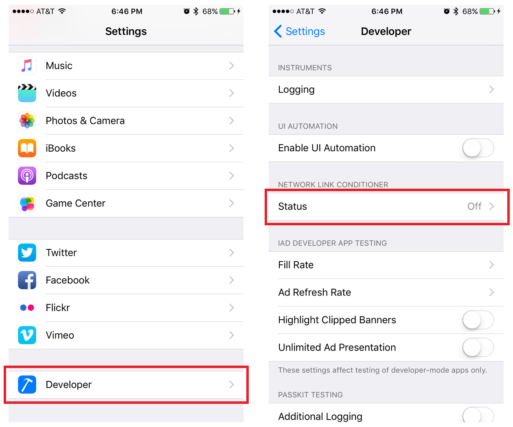
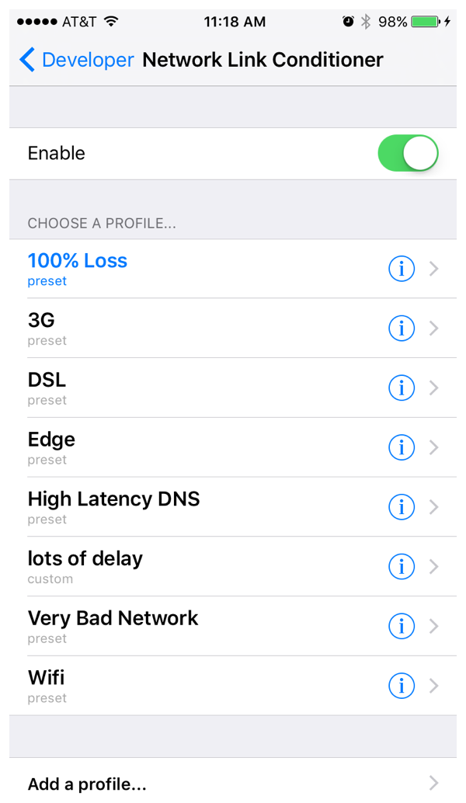
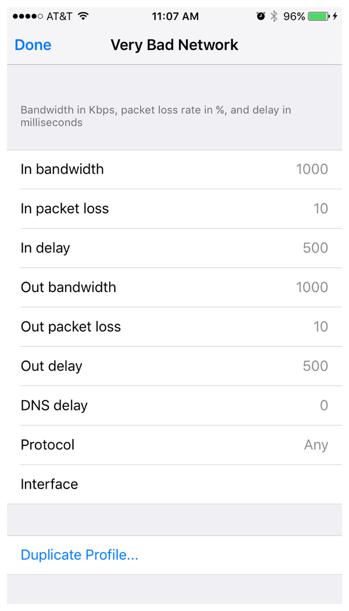

> 导航：[总目录](../../../README.md) · [documentation](../../../_indexes/documentation.md) · [On-Demand Resources Guide](index.md)

## Optimization with Testing

Use testing to optimize the design. To test memory, use the disk gauge in Xcode with the simulator or an attached device. For information on the disk gauge, see [Debugging Tools](https://developer.apple.com/library/archive/documentation/DeveloperTools/Conceptual/debugging_with_xcode/chapters/debugging_tools.html#//apple_ref/doc/uid/TP40015022-CH8) and Using Debug Gauges.

Testing download times requires real-world testing using devices. On-demand resources can be hosted by TestFlight or your own web server. For information on using your own server during development, see [Hosting On-Demand Resources](IntrotoHostingODR.md#apple-f4xwc4dqnrsv64tfmyxwi33df52wszbpkridimbqge2taobtfvbuqmjwfvjvomi).

When you are testing, remember that the system will cache resources after they are downloaded. After you have completed a test for a set of resources, delete the app from the device to clear the cache.

Make sure you test any network transports that will be used for downloading resources, including WiFi and cellular. Test the transports using different connection conditions. The easiest way to test different conditions is by using the network link conditioner on development devices.

### Network Link Conditioner

You can use the network link conditioner to simulate different types of networks and networking conditions with development devices attached to your development machine.

The network link conditioner is available on debug development devices. You access the conditioner by choosing Settings > Developer. Select as shown in Figure 11-1.

__Figure 11-1__Showing the network link conditioner

The item for the network link conditioner shows whether it is on or off. Tapping on the item shows the settings screen as seen in Figure 11-2. From this screen you can turn the conditioner on and off, select a profile for the connection, and add add or edit profiles.

__Figure 11-2__Network link conditioner settings

The attributes from the current profile are applied to any network traffic coming over the existing connection. Figure 11-3 shows the attributes that can be adjusted.

__Figure 11-3__Network link profile details

[General Design Principles](AboutDesigningODR.md#apple-f4xwc4dqnrsv64tfmyxwi33df52wszbpkridimbqge2taobtfvbuqmrqfvjvomi)

[Patterns of On-Demand Resource Use](PreservingDownloadedResources.md#apple-f4xwc4dqnrsv64tfmyxwi33df52wszbpkridimbqge2taobtfvbuqmrsfvjvomi)
