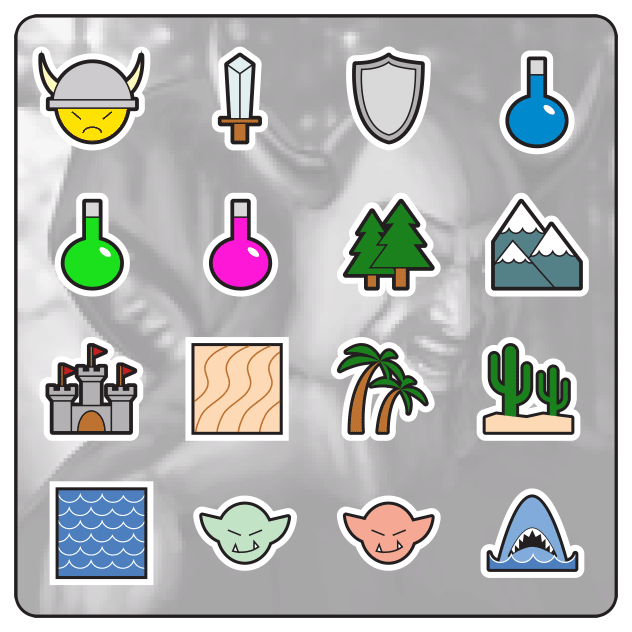
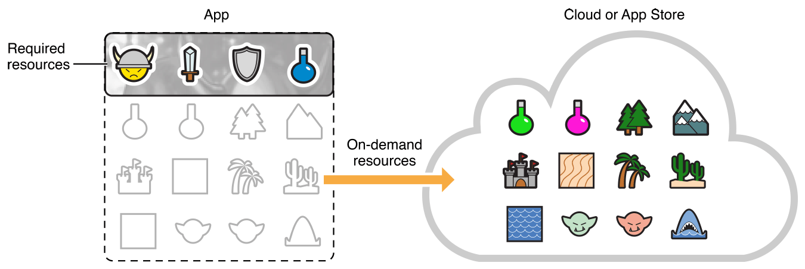
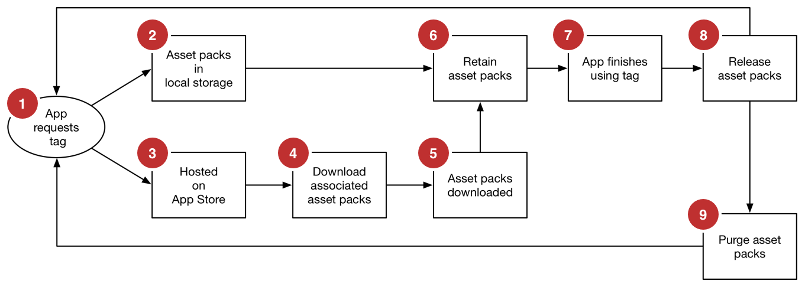
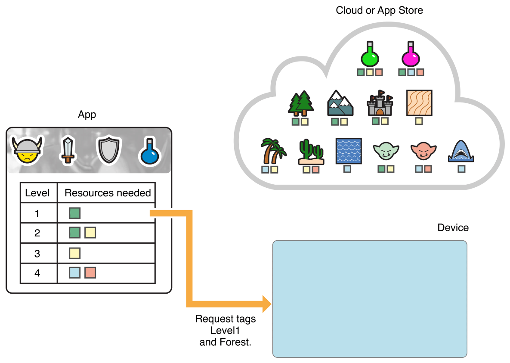
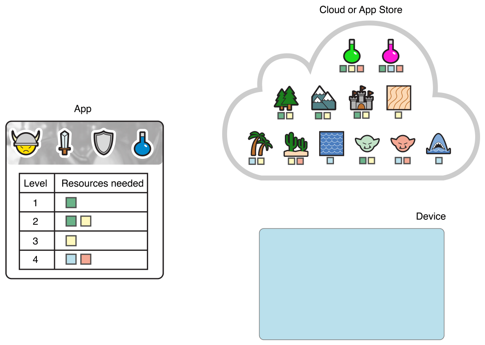
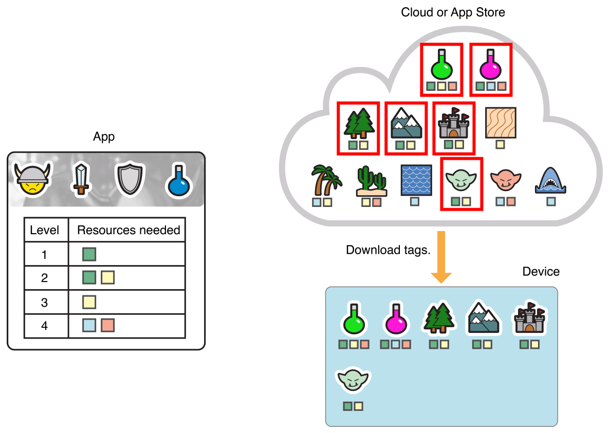
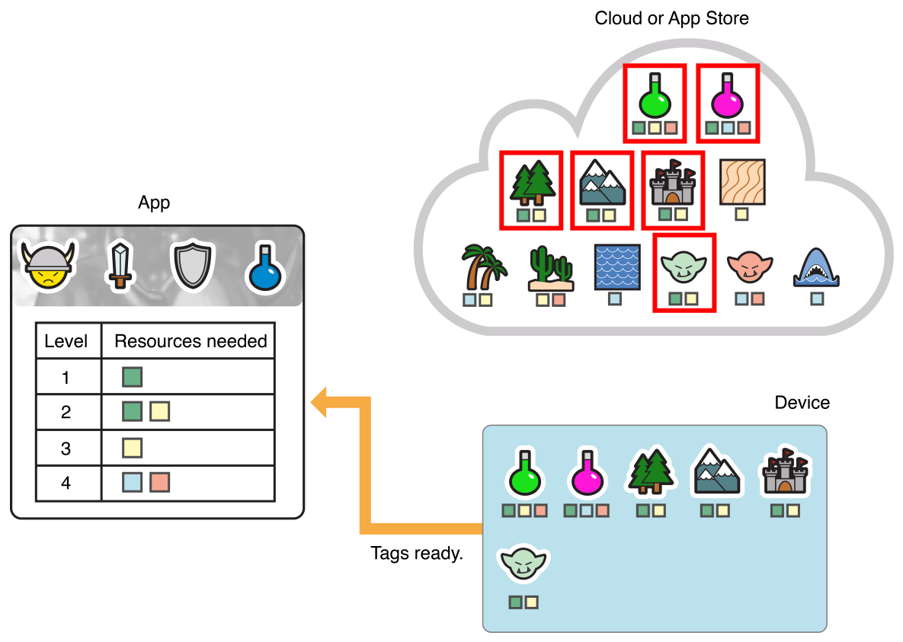
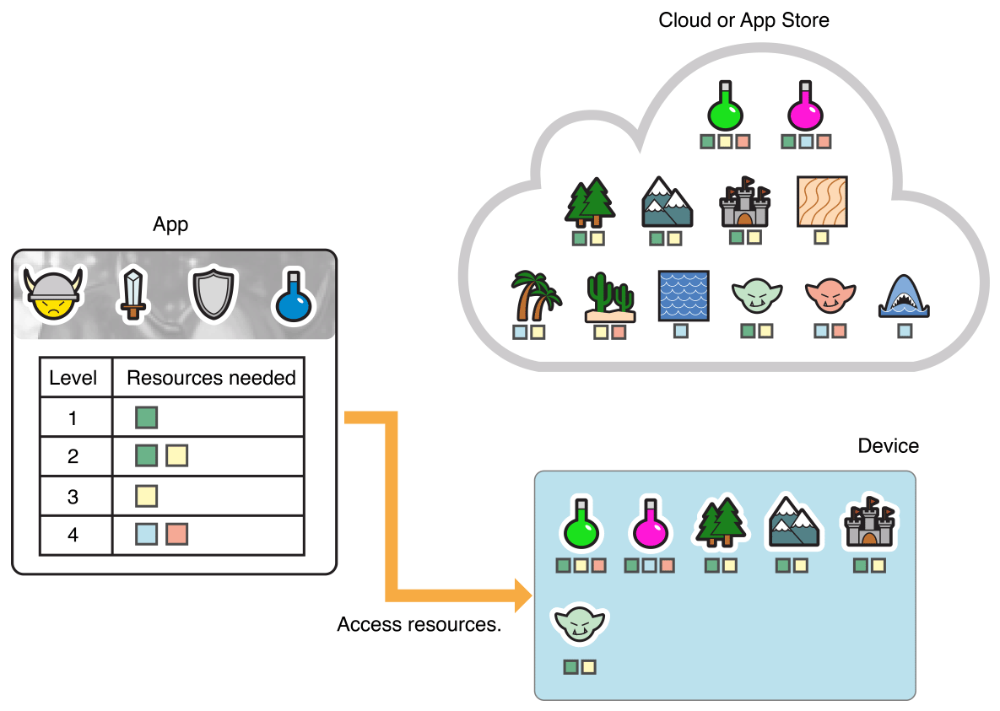

> 导航：[总目录](../../../README.md) · [documentation](../../../_indexes/documentation.md)

## On-Demand Resources Essentials

_On-demand resources_ are app contents that are hosted on the App Store and are separate from the related app bundle that you download. They enable smaller app bundles, faster downloads, and richer app content. The app requests sets of on-demand resources, and the operating system manages downloading and storage. The app uses the resources and then releases the request. After downloading, the resources may stay on the device through multiple launch cycles, making access even faster.

The resources can be of any type supported by bundles except for executable code. Table 1-1 shows supported on-demand resource types and indicates whether those types are included in the target as a file or in an asset catalog.

__Table 1-1__On-demand resource types

| Type | Asset catalog | File |
| --- | --- | --- |
| Data file | ✓ | ✓ |
| Image | ✓ | ✓ |
| OpenGL shader | – | ✓ |
| SpriteKit particle | – | ✓ |
| SpriteKit scene | – | ✓ |
| SpriteKit texture atlas | ✓ | ✓ |
| Apple TV Image Stack | ✓ | ✓ |

A data file can contain any sort of data except for executable Swift, Objective-C, C, or C++ code. Files generated by scripting languages can be on-demand resources.

### Benefits of On-Demand Resources

Some of the main ways apps can benefit from on-demand resources include:

- __Smaller app size.__ The size of the app bundle downloaded by the user is smaller resulting in faster downloads and more storage room on the device.
- __Lazy loading of app resources.__ The app has resources that are used only in certain states. The resources are requested when the app is likely to enter the appropriate state. For example, in a game with many levels, the user needs only the resources associated with the current and next levels.
- __Remote storage of rarely used resources.__ The app has resources that are used infrequently. The resources are requested as they are needed. For example, an app tutorial is usually shown once after the app is opened for the first time, and may never be used again. The app requests the tutorial on first launch, and then requests the tutorial only when needed or when new features are added.
- __Remote storage of in-app purchase resources.__ The app offers in-app purchases that includes additional resources. The resources for purchased modules are requested by the app after it is launched. For example, a user purchases the SuperGeeky emoticon pack in a keyboard app. The app requests the pack after it finishes launching.

### How Tags Work

You identify on-demand resources during development by assigning them one or more tags. A _tag_ is a string identifier you create. You can use the name of the tag to identify how the included resources are used in your app. In a game, for example, use the tag `level-5` for each of the resources associated with level five. For more information on tags, see [Creating and Assigning Tags](Tagging.md#apple-f4xwc4dqnrsv64tfmyxwi33df52wszbpkridimbqge2taobtfvbuqmznknltc).

At runtime, you request access to remote resources by specifying a set of tags. The operating system downloads any resources marked with those tags and then retains them in storage until the app finishes using them. When the operating system needs more storage, it purges the local storage associated with one or more tags that are no longer retained. Tagged sets of resources may remain on the device for some time before they are purged. For information on requesting access to the resources associated with tags, see [Accessing and Downloading On-Demand Resources](Managing.md#apple-f4xwc4dqnrsv64tfmyxwi33df52wszbpkridimbqge2taobtfvbuqnbnknltc).

Continuing with the game example, in a game divided into many levels the user needs only the resources associated with the level at which the user is playing and the next likely level. Figure 1-1 shows an app bundle that includes all of the resources for all the levels.

__Figure 1-1__Traditional app including all resources

The size of the app bundle is reduced by creating tagged sets of on-demand resources for the different levels, and for other shared resources that do not need to be included in the app. Figure 1-2 shows a smaller app with the tagged sets of resources hosted on the App Store.

__Figure 1-2__Smaller app using on-demand-resources

Other functionality lets you specify tags that must be loaded when your app is installed from the App Store, set a loading priority for a resource request, track the progress of a download, and set a preservation priority for downloaded tags you are no longer using.

### On-Demand Resource Life Cycle

The first time a user launches the app, the only on-demand resources on the device are the ones set for prefetching. For information on setting up resources for prefetching, see [Prefetching Tags](Tagging.md#apple-f4xwc4dqnrsv64tfmyxwi33df52wszbpkridimbqge2taobtfvbuqmznknlte). As the user interacts with the app, the app requests tags representing sets of resources, uses the resources associated with the tags, and then informs the operating system that it has finished using the tags. Some time after that, the operating system purges one or more tags.

> [!IMPORTANT]
> 

As you develop apps using on-demand resources, you may notice that requesting one tag results in the resources associated with other tags being downloaded. This is because the operating system works with asset packs that are optimized for downloading shared resources. One tag may result in multiple asset packs. Asset packs are generated by Xcode when your app is built. One example is a game where the `Level1` and `Level2` tags share some resources. Xcode generates three asset packs:

- `Level 1`. The resources that have only the `Level1` tag.
- `Level 2`. The resources that have only the `Level2` tag.
- `Level 1 + Level 2`. The resources that have both the `Level1` and `Level2` tags.

The overall life cycle for requesting tags and the associated resources is shown in Figure 1-3.

__Figure 1-3__On-demand resource life cycle

1. The app requests tags from the operating system.

   The operating system translates the requested tags into a set of asset packs containing the associated resources.

   In Figure 1-4, the app requests the resources associated with the `Level1` and `Forest` tags.

   __Figure 1-4__Request tags `Level1` and `Forest`
   
2. The asset packs for the tags are in local storage, so the life cycle moves to phase 6.
3. One or more of the asset packs for the tags are hosted on the App Store either because it is the first launch of the app or the resources previously loaded on the device were purged (see phase 9 below.)

   In Figure 1-5, all of the on-demand resources are on the App Store.

   __Figure 1-5__All on-demand resources on the App Store
   
4. The operating system starts downloading to the device the resources associated with any asset packs that are not already in local storage.
5. The resources for the asset packs associated with the requested tags finish downloading to the device.

   In Figure 1-6, the resources associated with the `Level1` and `Forest` tags are downloaded to the device.

   __Figure 1-6__Downloading resources for `Level1` and `Forest`
   
6. If the resources for the asset packs associated with the requested tags are downloaded successfully or if the asset packs are already in device storage, the operating increments the retain count for the asset packs and informs the app that the requested tags are available.

   In Figure 1-7, the app is informed that the resources associated with the `Level1` and `Forest` are tags available.

   __Figure 1-7__Making the resources for `Level1` and `Forest` available
   

   After the tags are available, the app uses the resources associated with those tags. On-demand resources are accessed in the same way as resources bundled with the downloaded app. The figure shows the downloaded resources as virtual members of the app.

   __Figure 1-8__Accessing downloaded resources
   
7. The app informs the operating system that it has finished using the requested tags.
8. The operating system releases the tags in local storage. This is done by decrementing the retain count for the asset packs associated with the tags.

   Making another request for tags that are already on the device moves to phase 1.
9. The operating system purges the cached resources associated with the asset pack from local storage.

   An asset pack is eligible for purging when all of the associated tags are no longer retained by any request. The resources associated with a tag may remain on the device for some time before it is purged, including across app launches.

   Making another request for the tags moves the lifecycle back to phase 1. You can influence the order of purging by setting the preservation priority for a tag. For more information, see [Accessing and Downloading On-Demand Resources](Managing.md#apple-f4xwc4dqnrsv64tfmyxwi33df52wszbpkridimbqge2taobtfvbuqnbnknltc).

[Enabling On-Demand Resources](EnablingODR.md#apple-f4xwc4dqnrsv64tfmyxwi33df52wszbpkridimbqge2taobtfvbuqobnknltc)
