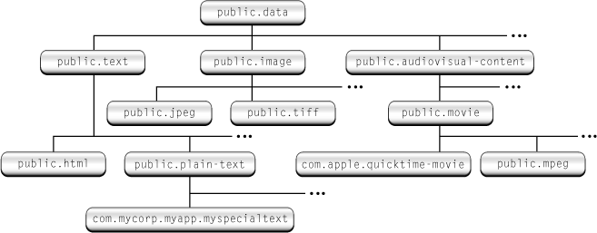
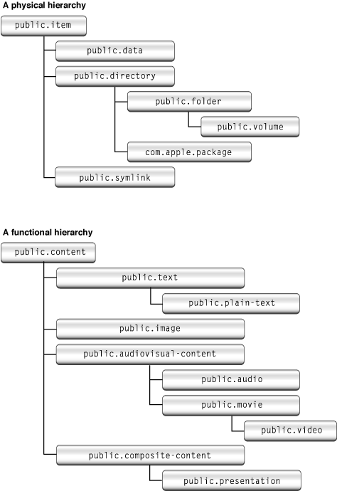

> 导航：[总目录](../../../README.md) · [documentation](../../../_indexes/documentation.md) · [Uniform Type Identifiers Overview](Introduction%20to%20Uniform%20Type%20Identifiers%20Overview.md)


[Next](Adopting%20Uniform%20Type%20Identifiers.md)[Previous](Introduction%20to%20Uniform%20Type%20Identifiers%20Overview.md)

# Uniform Type Identifier Concepts

Uniform type identifiers (UTIs) provide a unified way to identify data handled within the system, such as documents, pasteboard data, and bundles. This chapter describes the concepts behind UTIs and shows how to specify them in your application bundles.

A uniform type identifier is a string that uniquely identifies a class of entities considered to have a “type.” For example, for a file or other stream of bytes, “type” refers to the format of the data. For entities such as packages and bundles, “type” refers to the internal structure of the directory hierarchy. Most commonly, a UTI provides a consistent identifier for data that all applications and services can recognize and rely upon, eliminating the need to keep track of all the existing methods of tagging data. Currently, for example, a JPEG file might be identified by any of the following methods:

- A four-character file type code (an `OSType`) of `'JPEG'`
- A filename extension of `.jpg`
- A filename extension of `.jpeg`
- A MIME type of `image/jpeg`

A UTI replaces all these incompatible tagging methods with the string `public.jpeg`. This string identifier is fully compatible with any of the older tagging methods, and you can call utility functions to translate from one to the other. That is, for a given UTI, you can generate the equivalent `OSType`, MIME type, or filename extension, and vice versa.

Because UTIs can identify any class of entity, they are much more flexible than the older tagging methods; you can also use them to identify any of the following entities:

- Pasteboard data
- Folders (directories)
- Bundles
- Frameworks
- Streaming data
- Aliases and symbolic links

In addition, you can define your own UTIs for application-specific use. For example, if your application uses a special document format, you can declare a UTI for it. Third-party applications or plug-ins that want to support your format can then use that UTI to identify your files.

A uniform type identifier is a Unicode string that usually contains characters in the ASCII character set. However, only a subset of the ASCII characters are permitted. You may use the Roman alphabet in upper and lower case (A–Z, a–z), the digits 0 through 9, the dot (“.”), and the hyphen (“-”). This restriction is based on DNS name restrictions, set forth in RFC 1035.

Uniform type identifiers may also contain any of the Unicode characters greater than U+007F.

Uniform type identifiers use the reverse-DNS format initially used to describe elements of the Java class hierarchy and now also used in OS X and iOS for bundle identification. Some examples:

```
com.apple.quicktime-movie
com.mycompany.myapp.myspecialfiletype
public.html
com.apple.pict
public.jpeg
```

The UTI syntax ensures that a given identifier is unique without requiring a central authority to register or otherwise keep track of them. Note that the domain (`com`, `public`, and so on) is used only to identify the UTIs position in the domain hierarchy; it does not imply any grouping of similar types.

- The `public` domain is reserved for common or standard types that are of general use to most applications:

```
public.text
public.plain-text
public.jpeg
public.html
```

  UTIs with the `public` domain are called public identifiers. Currently only Apple can declare public identifiers.
- The `dyn` domain is reserved for special dynamic identifiers. See [Dynamic Type Identifiers](#apple-f4xwc4dqnrsv64tfmyxwi33df52wszbpkridimbqgaytgmjzfvbuqmrqgiwueq2hinceqskk) for more information.
- All other domains are available for use by third parties. Typically, identifiers declared by companies will begin with the `com` domain.

```
com.apple.quicktime-movie
com.yoyodyne.buckybits
```


A key advantage of uniform type identifiers over other type identification methods is that they are declared in a conformance hierarchy. A conformance hierarchy is analogous to a class hierarchy in object-oriented programming. Instead of “type A conforms to type B,” you can also think of this as “all instances of type A are also instances of type B.”

[Figure 1-1](#apple-f4xwc4dqnrsv64tfmyxwi33df52wszbpkridimbqgaytgmjzfvbuqmrqgiwueq2hjjduur2b) shows a conformance hierarchy for some uniform type identifiers.

__Figure 1-1__  A conformance hierarchy



For example, the UTI `public.html`, which defines HTML text, conforms to the base text identifier, `public.text`. In this case, conformance lets applications that can open general text files identify HTML files as ones it can open as well.

You need to declare conformance only with your type’s immediate “superclass,” because the conformance hierarchy allows for inheritance between identifiers. That is, if you declare your identifier as conforming to the `public.tiff` identifier, it automatically conforms to identifiers higher up in the hierarchy, such as `public.image` and `public.data`.

The conformance hierarchy supports multiple inheritance. For example, the UTI for an application bundle (`com.apple.application-package`) conforms to both the generic bundle type (`com.apple.bundle`) and the packaged directory type (`com.apple.package`).

When specifying conformance for your UTI, your items should ideally conform to both a physical and functional hierarchy. That is, the conformance should specify both its physical nature (a directory, a file, and so on) as well as its usage (an image, a movie, and so on).

- A UTI in the physical hierarchy should conform through the inheritance hierarchy to `public.item`.
- A UTI in a functional hierarchy should conform through inheritance to a base UTI that is not `public.item`. For example, `public.content`, `public.executable` and `public.archive` are all examples of functional base UTIs.

While conforming to the functional hierarchy is not mandatory, doing so allows for better integration with system features. For example, Spotlight associates named attributes (title, authors, version, comments, and so on) with functional UTIs.

[Figure 1-2](#apple-f4xwc4dqnrsv64tfmyxwi33df52wszbpkridimbqgaytgmjzfvbuqmrqgiwueq2hjfeesskd) shows examples of physical and functional hierarchies:

__Figure 1-2__  Physical and functional hierarchies



In some cases, you need to declare conformance to only one UTI to cover both hierarchies. For example, `public.text`, `public.image` and `public.audiovisual-content` conform to both `public.data` (physical) and `public.content` (functional), so conforming (directly or indirectly) to one of these items covers both hierarchies.

Conformance gives your application much more flexibility in determining what types it is compatible with; not only do you avoid writing lots of conditional code, your application can be compatible with types that you had never anticipated.

Sometimes you may run across a data type that does not have a UTI declared for it. UTIs handle this case transparently by creating a dynamic identifier for that type. For example, say your application finds a NSPasteboard type that it does not recognize. Using the utility functions, it can still convert the type to a UTI that it can then pass around.

Dynamic identifiers have the domain `dyn`, with the rest of the string that follows being opaque. You handle dynamic identifiers just as any other UTI, and you can extract the original identifier tag using utility functions. You can think of a dynamic identifier as a UTI-compatible wrapper around an otherwise unknown filename extension, MIME type, `OSType`, and so on.

Each UTI can have one or more tags associated with it. These tags indicate alternate methods of type identification, such as filename extension, MIME type, or NSPasteboard type. You use these tags to assign specific extensions, MIME types, and so on, as being equivalent types in a UTI declaration.

For example, the `public.jpeg` identifier declaration includes one OSType tag (`'JPEG'`) and two filename extension tags (`.jpg` and `.jpeg`). These tags are then considered alternate identifiers for the `public.jpeg` type.

Essentially, you use the tags to group all the possible methods of identifying a type under one UTI. That is, a file with extension `.jpg` or `.jpeg`, or an OSType of `'JPEG'` are all considered to be of type `public.jpeg`.

Mac apps can declare new UTIs for their own proprietary formats. You declare new UTIs inside a bundle’s information property list. See [Declaring New Uniform Type Identifiers](Declaring%20New%20Uniform%20Type%20Identifiers.md#apple-f4xwc4dqnrsv64tfmyxwi33df52wszbpkridimbqgaytgmjzfvbuqmrqgqwvgvzr) for more information.

[Next](Adopting%20Uniform%20Type%20Identifiers.md)[Previous](Introduction%20to%20Uniform%20Type%20Identifiers%20Overview.md)

