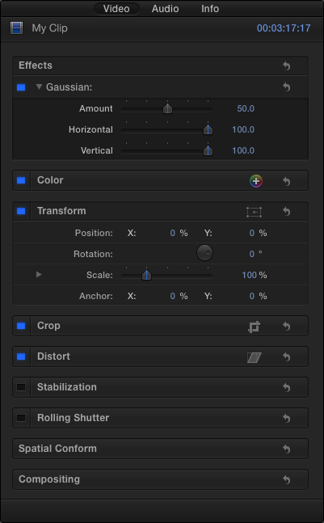
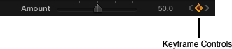
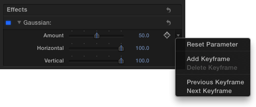
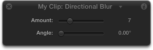
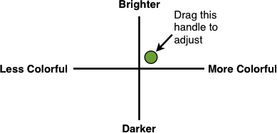

> 导航：[总目录](../../../README.md) · [documentation](../../../_indexes/documentation.md) · [FxPlug Human Interface Guidelines](About%20the%20FxPlug%20Human%20Interface%20Guidelines.md)

[Next](FxPlug%20UI%20Element%20Guidelines-%20Controls.md)[Previous](User%20Experience%20Guidelines.md)

# FxPlug Host Built-in UI Elements

The Inspector displays all parameters of your plug-in in a compact space. Users can easily collapse the Inspector in both Final Cut Pro X and Motion, so although it’s critical to design for the Inspector contents, consider that users may not have it available at all times. Do not assume that the Inspector is the only way the user can interact with your plug-in.

Several controls are built in to the FxPlug host application, and they are always available to your plug-in without additional coding.

The keyframe controls are used to add, delete, and navigate between keyframes. These controls also act as a status indicator to show when a parameter is being controlled by a behavior or a rig (Motion only).

The parameter menu displays several options to control a parameter. The menu is accessible by clicking the small downward arrow that appears to the right of a parameter on rollover.

Depending on the options of the parameter, the commands are:

- Reset Parameter
- Disable Animation (Motion only)
- Add Keyframe
- Delete Keyframe
- Previous Keyframe
- Next Keyframe
- Publish (Motion only)
- Show in Keyframe Editor (Motion only)
- Add to Rig (Motion only)
- Add Parameter Behavior (Motion only)

Crop determines whether your effect can render outside the input bounds of the image or whether it is automatically cropped at the edges of the input bounds. Although it is not a built-in control, a similar parameter can be useful to add to your plug-in where appropriate. Follow the example that the built-in FxPlug plug-ins have established for better integration into the host application.

The Mix parameter allows the user to adjust the amount of your effect, to “fade” the effect on the image. This parameter is automatically included in the UI with any filter plug-in, so there is no need to re-create this parameter in your code.

The heads-up display (HUD) displays specific parameters from your plug-in in a small, semitransparent window that floats over your document. The HUD’s transparency is designed so that the user can place it anywhere, including over the image in the Canvas. Unlike the Inspector, the HUD only contains parameters from the currently selected single object, filter, or behavior. The HUD is intended to include only a subset of all the parameters that the user can adjust within your plug-in. The user can easily access the Inspector, which automatically includes all parameters, with a single click from the HUD. You can specify which parameters are included in the HUD by adding the [kFxParameterFlag_DONT_DISPLAY_IN_DASHBOARD](https://developer.apple.com/documentation/fxplug/2625055-anonymous/kfxparameterflag_dont_display_in_dashboard) flag to parameters you don’t want displayed in the HUD.

The HUD is available only in Motion, so design your plug-in to be usable regardless of whether the HUD is present in the host application.

The HUD is intended to serve as a “control panel” for any plug-in or object, and should contain only the most commonly used parameters of your plug-in. Because the HUD floats over the rest of the user interface, the HUD should remain small for best effect. Do not add every parameter in your plug-in to the HUD unless your plug-in contains very few parameters. Avoid adding more than five to seven parameters to the HUD. Adding more not only makes the HUD larger and more intrusive, it also increases the learning curve for your plug-in.

The HUD is not resizable, nor does it provide scroll bars. A HUD containing too many parameters may be cut off at the bottom of the display.

The HUD should be placed where the user first experiences how to use your plug-in. With a compact and useful set of parameters to draw attention to what the plug-in can do, the HUD can help the user to rapidly navigate the capabilities of your plug-in.

The HUD is a great companion to onscreen controls, allowing the user to adjust a wide variety of controls with a minimal UI footprint. If a parameter is connected to a custom onscreen control in your plug-in, don’t add that parameter to the HUD. The HUD, because it is semitransparent and mobile, should serve as a complement to the onscreen control. For example, if your plug-in includes an onscreen control point picker that adjusts the X and Y positions in the Canvas, don’t include those same X and Y position parameters in the HUD.

The HUD can also contain custom UI controls unique to your plug-in. These controls can appear in both the HUD and the Inspector, or exclusively in the Inspector. Consider creating graphical versions of your plug-in’s parameters to make it easier for the user to visualize the effect of the plug-in.

For example, if your plug-in has a pair of parameters—one to adjust the amount of color in the image and another to adjust the relative brightness or darkness of the image—a custom graphical control might show both of these parameters in a graph, with a handle that the user can drag in two dimensions.

[Next](FxPlug%20UI%20Element%20Guidelines-%20Controls.md)[Previous](User%20Experience%20Guidelines.md)

