> 导航：[总目录](../../../README.md) · [documentation](../../../_indexes/documentation.md) · [FxPlug Human Interface Guidelines](About%20the%20FxPlug%20Human%20Interface%20Guidelines.md)

[Next](FxPlug%20Custom%20UI%20Guidelines.md)[Previous](FxPlug%20Host%20Built-in%20UI%20Elements.md)

# FxPlug UI Element Guidelines: Controls

A _button_ performs an immediate action.

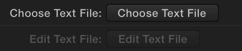

FxPlug 3.0 or later.

A button always contains text; it does not contain an image.

Use a button in the plug-in to perform an instantaneous action, such as Add or Delete. A button can also open another window to complete its operation.

__Decide whether to use a button by itself or in a parameter group header.__ If the button is a standalone command, set it up as an independent parameter. If the button command is related to a group of other parameters, you can place it in a parameter group header.

__Avoid using a button to mimic the behavior of other controls.__ Users expect an immediate action to occur when they click a button, including opening another window or closing a dialog. Do not use a button to indicate a state, such as on or off. Instead, use checkboxes to indicate a state, as described in [Checkbox](#apple-f4xwc4dqnrsv64tfmyxwi33df52wszbpkridimbqgeztoobsfvbuqnbnknltm).

__Provide enough space between buttons so that users can easily click a specific one.__ In particular, if a button can lead to a potentially dangerous or destructive action (such as Delete), it should be positioned away from the other buttons so that users are unlikely to click it accidentally.

__Avoid displaying an icon in a button.__ A button should only contain text that describes the action it performs. Do not include icons or images in buttons.

__Use a verb or verb phrase for the title of a button.__ Create a title for the button that describes the action it performs, such as Save, Close, Print, Delete, Change Password, and so on. If a button acts on a single setting or entity, name the button as specifically as possible. For example, “Choose Picture...” is more helpful than “Choose...”. Because buttons initiate an immediate action, do not use the word “Now” (for example, Analyze Now) in the button title.

__Use title-style capitalization for the button title, and add an ellipsis if necessary.__ To learn more about title-style capitalization, see [Capitalize Labels and Text](Text%20Style%20Guidelines.md#apple-f4xwc4dqnrsv64tfmyxwi33df52wszbpkridimbqgeztoobsfvbuqnrnknltc). If the button immediately opens another window, dialog, or application to perform its action, use an ellipsis in the title. An ellipsis prepares users to complete their action in another window.

__Resize a button’s width to accommodate the title.__ If you don’t make a button wide enough, the end caps clip the text. The height of a button is always fixed.

A _checkbox_ presents a state, action, or value that can be on or off.

The selected and unselected appearances of a checkbox are provided automatically; no text or images are displayed in a checkbox.

Use a checkbox when you want to allow users to choose between two opposite states, actions, or values.

__Provide a label for each checkbox that clearly implies two opposite states.__ The label should make clear what happens when the option is selected or unselected. Checkbox labels should have sentence-style capitalization (for more on this style, see [Capitalize Labels and Text](Text%20Style%20Guidelines.md#apple-f4xwc4dqnrsv64tfmyxwi33df52wszbpkridimbqgeztoobsfvbuqnrnknltc)), unless the state or value is the title of some other capitalized element in the interface.

A _combination color well_ indicates the current color of a parameter.

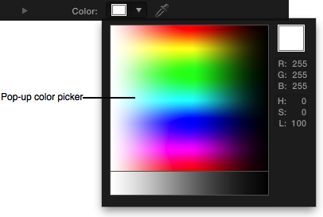

When the user clicks this element, the combination color well displays the Color window, in which the user can specify a color. When the user clicks the down arrow, a pop-up color picker opens where the user can specify a color more quickly. With the eyedropper icon, the user can choose a color directly from the Viewer or Canvas. Color wells also have a disclosure triangle to reveal Red, Green, Blue, and optional Opacity sliders to specify a color value numerically.

__Use the Opacity channel of a color only when necessary.__ Specifying the alpha value of a color can be confusing to the user when the RGB values are the only relevant channels of the color.

A _dial_ is a circular control with a small dimple that provides the same functionality as the thumb of a linear slider: Users drag the dimple clockwise or counterclockwise to change the values.

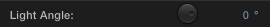

You can specify a range for a dial, although the dial is easier to control if the range of values is the full rotation of 360 degrees, or infinite.

A dial is always circular and is always accompanied by a value scrubber (see [Value Scrubber](#apple-f4xwc4dqnrsv64tfmyxwi33df52wszbpkridimbqgeztoobsfvbuqnbnknltiny)).

__Use a dial control for a parameter that has a visual orientation in the Viewer.__ For example, with the dial in the Directional Blur filter, users can choose the angle of the blur. The dial not only displays the full range of values (0 to 360 degrees) in a compact way, it also mirrors the orientation of the blur itself as it is displayed in the Viewer.

__Avoid setting a range of less than 360 degrees.__ The appearance of the dial encourages (but does not require) the user to adjust in a circular motion, so a parameter with a smaller range means that the UI may not respond as effectively as the user would expect.

A _font picker_ displays two pop-up menus that contain a list of system fonts and styles associated with each font.

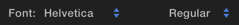

FxPlug 3.0 or later.

A font picker has two pop-up menus in the same row, each with the same appearance and behavior as a normal pop-up menu.

- The first pop-up menu contains a list of all active fonts.
- The second pop-up menu contains a list of all available styles (for example, bold, italic, condensed) for the currently selected font.

Use the font picker to automatically display a list of available fonts and font styles.

A _gradient editor_ displays a series of colors that blend together to create a color gradient.

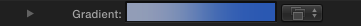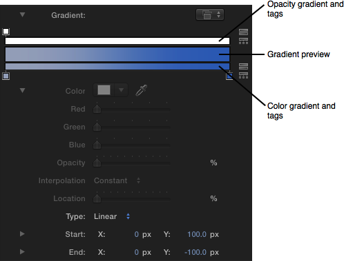

When collapsed, the gradient editor displays a preview of the final gradient, along with a pop-up menu to choose one of the built-in or saved gradient presets.

You can set your plug-in to use a color gradient, an opacity gradient, or both.

When expanded, the gradient editor can display up to three gradient bars:

- The top bar represents opacity, with a series of tags specifying the opacity values along the gradient.
- The middle bar displays a preview of the final gradient.
- The bottom bar represents color, with a series of tags specifying the color values along the gradient.

The icons to the right reverse and evenly distribute either the opacity or color tags.

When the user selects either a color tag or an opacity tag, the current tag values are displayed in the Color, Opacity, Interpolation, and Location parameters.

The user can also specify Linear or Radial gradient types, when appropriate.

__In general, use the gradient editor to specify gradients rather than to create custom UI.__ A custom gradient control UI would only confuse users already familiar with the standard gradient controls used throughout Final Cut Pro X and Motion.

A _help button_ displays additional information about your FxPlug plug-in.

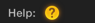

FxPlug 3.0 or later.

A help button appears as a round button with a question mark. Do not customize the appearance or label of a help button.

Use a help button in the plug-in to display documentation, display a web site, launch an application, open the system Help window, or display other information.

__For general documentation about your plug-in, use the system Help.__ The system Help can display useful text and graphics in a window.

__For information about your plug-in that requires frequent updates, display a web page.__ The user might want to access information that changes on a regular basis; in this case, make the help button launch the specified URL in a browser.

__Display an in-app window for in-context information.__ If you want to provide contextual help based on the user’s current workflow, use a window that appears within the host application. Displaying in-context information in a web browser distracts the user from the task they were performing when they clicked the help button.

A _histogram_ is a two-dimensional graph, commonly used for displaying the number of red, green, blue, and luminance pixels within an image.

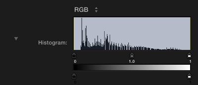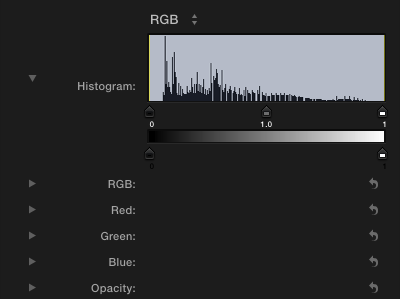

When collapsed, the histogram displays a line graph of the input image. The x-axis represents the value of the pixels. The y-axis represents the number of pixels of that value present in the image.

The user can adjust the handles representing the Black In, Black Out, White In, White Out, and Gamma of the image.

When the histogram is expanded, sliders appear, which the user can adjust to change the numeric values of the handles.

__Both host applications include a Levels filter, so don’t duplicate that functionality.__ The Levels filter includes a histogram, and both Final Cut Pro X and Motion users can easily access it.

__Use the standard histogram for unique functionality within your plug-in.__ For example, if you are creating a keyer plug-in that needs a feature to help the user evaluate a matte’s effectiveness, including a histogram is appropriate.

A _media well_ is a drag-and-drop target for an image or clip.

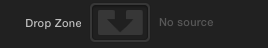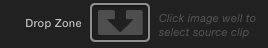

The media well is a recessed rounded area where users can drag an image. In Final Cut Pro X, users can click the media well and then select a clip from the Events library by skimming to the clip they want, and then clicking to select that clip.

__Use the media well to get an image for your plug-in from an alternate source in the project.__ For example, the Bump Map filter uses a second media source to determine the “bumpiness” of the original image.

__If your plug-in requires multiple media wells, the first media well listed in the plug-in can take advantage of convenient shortcuts.__ In Motion, the user can drag an object directly to the filter or generator in the project to quickly assign that object to the first media well it encounters. Keep this shortcut in mind when you determine the order of the media wells in your plug-in.

A _parameter group_ collects related parameters into a folder that can be shown or hidden using a disclosure triangle.

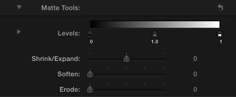

A parameter group is in the closed position (that is, with the triangle pointing to the right) by default. When the user clicks the disclosure triangle, it points down, the group opens, and the additional parameters are displayed.

Use a parameter group when you want to provide a simple default view of your plug-in but need to allow users access to more advanced parameters, or to perform additional actions at specific times.

In general, use a disclosure triangle in the following two ways:

- To reveal more parameters in plug-ins that have a minimal state and an expanded state. For example, you might want to use a parameter group to hide advanced features that most users aren’t interested in seeing.
- To reveal subordinate items in a hierarchical list. For example, the Matte Tools parameter group in the Keyer filter displays parameters that adjust the matte of the key.

__Avoid using more than one sublevel of a parameter group.__ A multilevel hierarchy of parameters is difficult to navigate, and the farther down you go, the more difficult it becomes to distinguish between the levels of the hierarchy (and the more cramped the Inspector becomes). Keep parameter groups at the top level of the plug-in hierarchy.

A _pop-up menu_ presents a list of mutually exclusive choices.

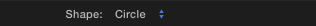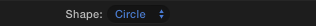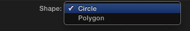

A pop-up menu:

- Has a double-arrow indicator.
- Contains nouns (things) or adjectives (states or attributes), but not verbs (commands).
- Displays a checkmark to the left of the currently selected value when open.

A pop-up menu behaves like other menus in OS X: The user clicks to open the menu and then drags to choose an item. The chosen item flashes briefly and is displayed in the closed pop-up menu. If the user moves the pointer outside the open menu without releasing the mouse button, the current value remains active. An exploratory press in the menu to see what’s available doesn’t select a new value.

Use a pop-up menu to present up to 12 mutually exclusive choices that users don’t need to see all the time.

__Use a pop-up menu to provide a menu of things or states.__ If you need to provide a menu of commands (verbs), use a pull-down menu. (To learn more about menus, see UI Element Guidelines: Menus in _OS X Human Interface Guidelines_.) Use title-style capitalization for each item in a pop-up menu.

__In general, provide an introductory label to the left of the pop-up menu (in left-to-right scripts).__ Use sentence-style capitalization for the label (for more information on this capitalization style, see [Capitalize Labels and Text](Text%20Style%20Guidelines.md#apple-f4xwc4dqnrsv64tfmyxwi33df52wszbpkridimbqgeztoobsfvbuqnrnknltc)).

__Avoid adding a submenu to an item in a pop-up menu.__ A submenu tends to hide choices too deeply and can be physically difficult for users to use.

__Avoid using a pop-up menu to display a variable number of items.__ Because users must open a pop-up menu to see its contents, they should be able to rely on the contents remaining the same.

__Don’t use a pop-up menu when more than one simultaneous selection is appropriate.__ For example, a list of text styles from which users can choose both bold and italic should not be displayed in a pop-up menu. In this situation, use checkboxes or a pull-down menu in which checkmarks appear.

A _position picker_ creates two parameters for X and Y position, along with a companion onscreen control to adjust the X and Y position in the Viewer.

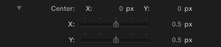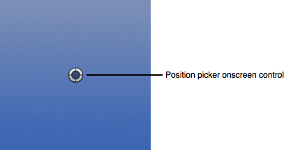

A position picker in the Inspector displays two value scrubbers on the same row, one for X and one for Y. When the user expands the disclosure triangle, the same parameters are displayed with sliders in individual rows.

The position picker onscreen control displays a target control that the user can drag to set the position of the parameter in the Viewer.

Use a position picker when you want to provide control over spatial positioning, such as the center of a radial blur.

A _slider_ presents a continuous range of allowable values.

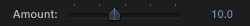

A slider is always linear. The movable part of a slider is called the _thumb_. In FxPlug, a slider always includes a minimum number of tick marks and is always accompanied by a value scrubber (see [Value Scrubber](#apple-f4xwc4dqnrsv64tfmyxwi33df52wszbpkridimbqgeztoobsfvbuqnbnknltiny)).

Use a slider to allow users to make fine-grained adjustments or choices throughout a range of values. Sliders support live feedback (live dragging), so they’re especially useful when you want users to see the effect of moving a slider in real time. For example, users can watch the effect of a blur as they move the Blur Amount slider in the Gaussian Blur filter.

__As much as possible, make sure each use of a slider control is appropriate for the values it represents.__ For example, a slider is an appropriate control for the Amount of a Blur filter because the values ramp continuously from very small (minimal blurring) to very large (heavy blurring). The slider visually represents very small values at the left side of the slider, with a continuous ramp to the large values at the right side of the slider.

__When appropriate, specify a useful range for the slider, different from the value scrubber’s range.__ The user can move the slider to adjust the parameter within the suggested range of values, while using the value scrubber to adjust the parameter beyond the suggested range. For example, you may have a blur parameter that is most visually useful when set to values between 0 and 100, but the feature may allow values up to 1000. Set the slider to the 0–100 range, and set the value scrubber to the maximum range of 0–1000.

A _text input field_ accepts user-entered text.

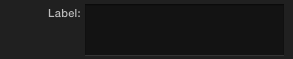

A text input field (also called an _editable text field_) is a rectangular area in which the user enters text or modifies existing text. A text input field displays user-supplied text in a system font that is appropriate for the size of the control.

By default, a text input field supports keyboard focus.

Use a text input field to get information from the user, which can then be displayed in the output of your plug-in.

__Perform appropriate edit checks when you receive user input.__ For example, if the only legitimate value for a field is a string of digits, an application should issue an alert if the user types characters other than digits. In most cases, the appropriate time to check the data in the field is when the user clicks outside the field or presses the Return, Enter, or Tab key.

A value scrubber shows the values of a parameter. It is always displayed with a slider or dial.

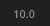  Value scrubber

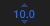  Value scrubber (on rollover)

A value scrubber displays numerical values. On rollover, the value scrubber shows arrows to indicate that the user can drag up or down to adjust the value. The user can drag directly on the numerical value to increase or decrease the value. The user can also hold down modifier keys to adjust the value in fine or coarse increments.

Clicking the numeric value highlights the value, and the user can enter a value on the keyboard. Double-clicking the value scrubber displays the value in a text field, where the user can edit it.

__Specify appropriate increment values for a value scrubber.__ There are three different increment values for a value scrubber:

- The _delta_ value, which is specified by your plug-in, is the default increment of the parameter when dragged with no modifier keys pressed. A typical delta value is 1.0.
- The _fine_ value is the increment of the parameter when dragged while holding down the Option key. It is defined by FxPlug as the delta value divided by 10. If the delta value is 1.0, the fine value is 0.1.
- The _coarse_ value is the increment of the parameter when dragged while holding down the Shift key. It is defined by FxPlug as the delta value multiplied by 10. If the delta value is 1.0, the fine value is 10.0.

Setting the right delta value helps the user easily adjust your plug-in’s parameters while feeling in control of the feedback.

[Next](FxPlug%20Custom%20UI%20Guidelines.md)[Previous](FxPlug%20Host%20Built-in%20UI%20Elements.md)

