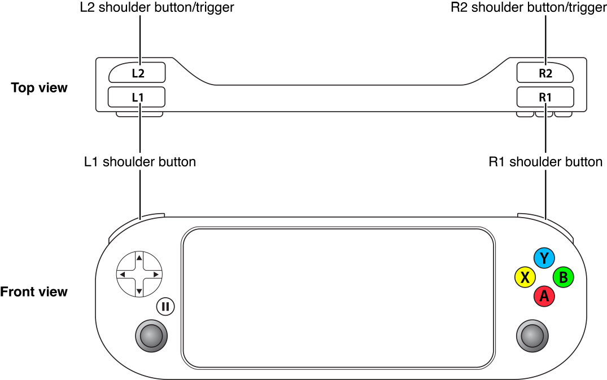

> 导航：[总目录](../../README.md) · [documentation](../../_indexes/documentation.md)

[Next](Incorporating%20Controllers%20into%20Your%20Game.md)

# About Game Controllers

Game controllers provide physical controls to trigger actions in your game. You can rely on a consistent set of high-quality controls in all game controllers because Apple has specified the look and behavior of the controls to MFi accessory manufacturers. By supporting the Game Controller framework in your game, you support all of these game controllers.

The Game Controller framework makes it easy to discover game controllers connected to a Mac, iOS device or Apple TV. Your game discovers and configures a controller, and then reads the control inputs as part of its normal gameplay.

The devices that the Game Controller framework supports can differ in three distinct ways:

- Every device supports a specific layout of controls.
- A device can be either a standalone controller or a controller fitted directly to an iOS device. In the latter case, the touchscreen and motion sensors are still available to your app.
- A device can be either plugged directly into a device or connected to it wirelessly.

### Controllers Must Be Optional on iOS and OS X

Even though controllers are intended to enhance gameplay, not every person who purchases your game is going to own one. Therefore, never require the use of game controllers in your game. If a controller is not available, your game must provide alternative controls.

- When designing an iOS game, use the touchscreen and integrated sensors. Further, when you support the game controller, you may not require the use of the extended controller layout, although you can take advantage of the extended controls when they are available.
- When designing a Mac game, use the keyboard and mouse. Because all standalone controllers provide the extended controller layout, your app can always use the extended controller layout.
- When designing a tvOS game, you may require the use of an MFi game controller, but where possible you should also support the Siri Remote.

### Controllers Are Automatically Connected Once Discovered

When a controller is connected directly to an iOS device using the lightning connector, it is automatically discovered by the Game Controller framework and made available to your game. Controllers may also connect to an iOS device, Apple TV, or Mac wirelessly, and these controllers work slightly differently: A wireless controller must be paired before it can be discovered by your game. Although support for pairing is normally provided by the operating system (typically in the Preferences or Settings, you can use the Game Controller framework to pair devices inside your game. During the discovery process, your game should display its own custom user interface and pause gameplay. Pairing needs to happen only once. After it is paired, whenever the game controller is turned on, it is automatically connected and made available to your game.

Your game can inquire about which controllers are connected, or it can be notified when controllers connect or disconnect. Typically, most games use notifications so that they can provide the proper in-game experience to the player. When a controller is connected, you use the notification’s controller object to obtain an object that represents the physical controller. When a controller is disconnected, you usually pause the gameplay and switch back to the default controls.

### Profiles Map Hardware Controls to Software Needs

When adding controller support to your game, focus on how the player interacts with the game controller to play your game. If your game is being played on an iOS device with a formfitting controller, also decide whether the touchscreen and motion controls should also be available to the player. When a game is being played with a standalone controller, these options are not available to you. This means you may need to design multiple ways for your game to be played, depending on the feature set that is available. For best results, you should test your gameplay on multiple controllers.

Although the control layouts are defined by Apple, different devices may have small variations in style. For example, a controller designed for an adult may differ from one designed for a child’s smaller hands. You do not need to worry about these small differences in physical layout. Instead, focus on supporting one of the control profiles provided by the Game Controller framework. A few controller profiles are available:

- Extended Gamepad Profile
- Micro Gamepad Profile
- Motion Profile

Each profile describes a predefined set of physical controls that are guaranteed to be available on the controller. A hardware controller can support multiple profiles. The Game Controller framework is responsible for mapping a controller’s hardware controls to the software control elements provided by the profile.

Once you have a controller profile, you either poll its control elements or you can register blocks to be called when control elements are manipulated by the player.

### Snapshots Record Controller Data

If you have a controller profile, you can gather a snapshot of the control elements. The snapshot is gathered atomically and represents the complete state of those control elements at the moment when the snapshot was taken. Typically, you take the snapshot when you want to know whether multiple elements have changed state at the same time. But you can also take a snapshot at one point in time and use it later. For example, you might use a snapshot to:

- Synchronize the controller state over multiple threads of execution
- Send the controller state over a network
- Save the controller state to a file

Because a snapshot is actually a profile object, reading the controller values at a later point in time works exactly as if you were reading inputs from a physical controller.

The first chapter, [Incorporating Controllers into Your Game Design](Incorporating%20Controllers%20into%20Your%20Game.md#apple-f4xwc4dqnrsv64tfmyxwi33df52wszbpkridimbqgeztenzwfvbuqnbnknlti), describes the controllers that are supported by the Game Controller framework. It goes into depth about the requirements for games that support game controllers, and provides guidance for associating actions with a game controller’s controls. The next two chapters describe how to discover controllers, configure them, and work with their inputs. The last chapter, Checklist for Adding Controllers, summarizes the requirements and suggestions for implementing controller support in your game.

Before attempting to create a game that uses game controllers, you need to be familiar with [blocks](https://developer.apple.com/library/archive/documentation/General/Conceptual/DevPedia-CocoaCore/Block.html#//apple_ref/doc/uid/TP40008195-CH3).

To find a detailed description of the classes in the Game Controller framework, see _[Game Controller Framework Reference](https://developer.apple.com/documentation/gamecontroller)_.

[Next](Incorporating%20Controllers%20into%20Your%20Game.md)

