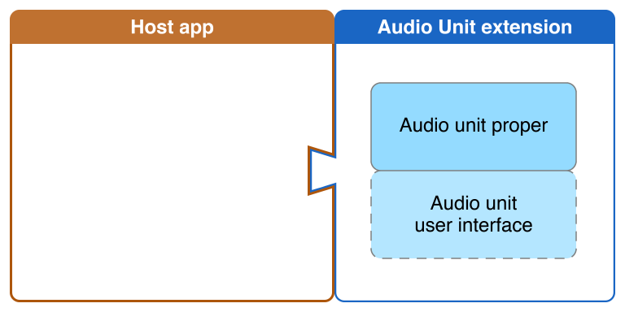
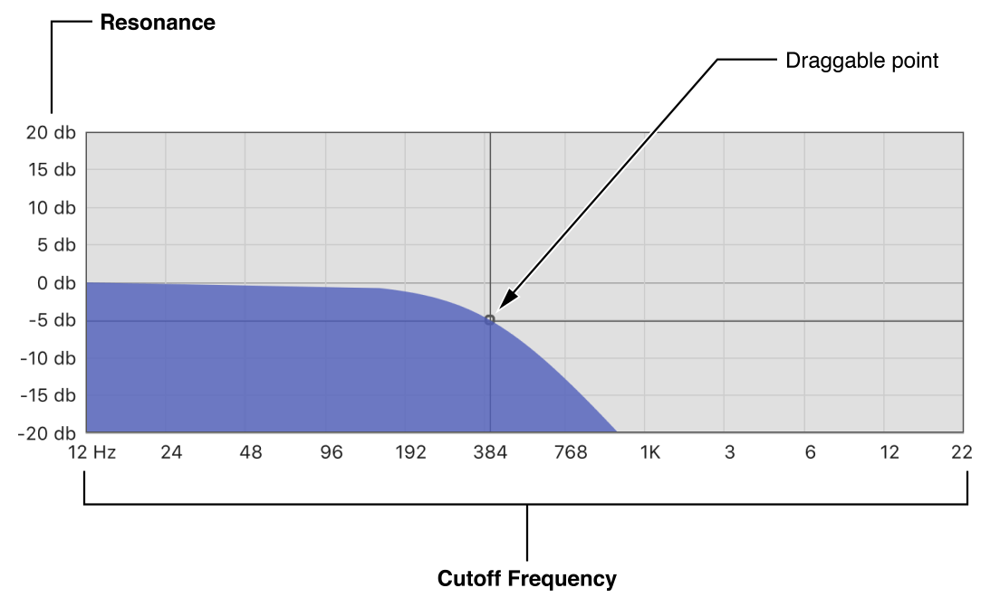

> 导航：[总目录](../../../README.md) · [documentation](../../../_indexes/documentation.md) · [App Extension Programming Guide](index.md)

## Audio Unit

An Audio Unit app extension gives users a convenient way to create or modify audio in any iOS or macOS app that uses sound, including music production apps such as GarageBand or Logic Pro X.

An Audio Unit app extension has two main elements: an audio unit proper and a user interface (UI) to control the audio unit. The audio unit itself is a custom plug-in in which you implement an audio creation or an audio processing algorithm. You build the audio unit using the Audio Unit framework, whose APIs are described in _[Audio Unit Framework Reference](https://developer.apple.com/documentation/audiounit)_. (Designing and building audio units is not covered in the current document, which instead explains how to incorporate an audio unit into an Audio Unit app extension target.) When creating an Audio Unit app extension, you design and create its UI in the storyboard file that is included in the extension’s Xcode template.

Figure 6-1 shows the architectural relationships between an audio unit proper and its user interface, which are both contained in the Audio Unit app extension, and between the extension and the host app that is using it.

__Figure 6-1__Architecture of an Audio Unit app extension in use by a host app

If you have need to provide an Audio Unit app extension without a UI, you can do so by excluding the audio unit user interface, as suggested by the dashed outline in the figure.

> [!NOTE]
> 

Figure 6-2 shows an example UI for a custom filter Audio Unit app extension. The “draggable point” in the figure is a control that lets the user modify audio unit parameters for resonance and cutoff frequency.

__Figure 6-2__User interface of a custom filter Audio Unit app extension

For a video introduction to Audio Unit app extensions, watch the WWDC 2015 presentation [Audio Unit Extensions](https://developer.apple.com/videos/play/wwdc2015/508/). For a code example that shows how to create an Audio Unit app extension, see _[AudioUnitV3Example: A Basic AudioUnit Extension and Host Implementation](https://developer.apple.com/library/archive/samplecode/AudioUnitV3Example/Introduction/Intro.html#//apple_ref/doc/uid/TP40016185)_. For more information on the audio unit API, see _[Audio Unit Framework Reference](https://developer.apple.com/documentation/audiounit)_.

Audio Unit app extensions are supported in iOS 9.0 and later, and in macOS v10.11 and later. The Audio Unit app extension template is available starting in Xcode 7.

### How Audio Unit App Extensions Work

In a host app that supports audio units in its audio processing pipeline, a user can choose to use an Audio Unit app extension to add the app extension’s features to the host app.

Each Audio Unit app extension contains exactly one audio unit. There are four audio unit types you can choose from, according to the role for your app extension:

- __For audio creation:__ A _generator unit_ creates audio according to a digital signal processing (DSP) algorithm that you provide. An _instrument unit_ creates audio, typically using a voice bank, in response to MIDI events.
- __For audio modification:__ An _effect unit_ modifies audio according to a DSP algorithm. A _music effect unit_ modifies audio, using DSP, in response to MIDI events.

Table 6-1 summarizes the four variants of Audio Unit app extension you can create, according to the contained audio unit type:

__Table 6-1__Audio unit types for the four Audio Unit app extension variants

| Category | Employs DSP | Employs DSP and responds to MIDI events |
| --- | --- | --- |
| Audio creation | [kAudioUnitType_Generator](https://developer.apple.com/documentation/audiotoolbox/kaudiounittype_generator) (Generator variant) | [kAudioUnitType_MusicDevice](https://developer.apple.com/documentation/audiotoolbox/1584142-audio_unit_types/kaudiounittype_musicdevice) (Instrument variant) |
| Audio modification | [kAudioUnitType_Effect](https://developer.apple.com/documentation/audiotoolbox/1584142-audio_unit_types/kaudiounittype_effect) (Effect variant) | [kAudioUnitType_MusicEffect](https://developer.apple.com/documentation/audiotoolbox/1584142-audio_unit_types/kaudiounittype_musiceffect) (Music Effect variant) |

.

For the principal class in an Audio Unit app extension, subclass the [AUViewController](https://developer.apple.com/documentation/coreaudiokit/auviewcontroller) class. (If you need to provide an Audio Unit app extension with no UI, subclass the [NSObject](https://developer.apple.com/library/archive/documentation/LegacyTechnologies/WebObjects/WebObjects_3.5/Reference/Frameworks/ObjC/Foundation/Classes/NSObject/Description.html#//apple_ref/occ/cl/NSObject) class instead.) The principal class for your extension must conform to the [AUAudioUnitFactory](https://developer.apple.com/documentation/audiotoolbox/auaudiounitfactory) protocol.

### Using the Xcode Audio Unit App Extension Template

The Xcode Audio Unit app extension template includes default source files for an [AUAudioUnit](https://developer.apple.com/documentation/audiotoolbox/auaudiounit) subclass for the audio unit itself, an `Info.plist` file, an [AUViewController](https://developer.apple.com/documentation/coreaudiokit/auviewcontroller) subclass, and a `MainInterface.storyboard` file.

Listing 6-1 shows the `Info.plist` keys and values for an iOS Audio Unit app extension for the Effect variant. The `type` key in this property list specifies the audio unit type that determines the variant, in this case with a value of `aufx`. For explanations of all the available keys and values, see [Table 6-2](#apple-f4xwc4dqnrsv64tfmyxwi33df52wszbpkridimbqge2demjufvbuqmrsfvjvomq).

__Listing 6-1__Audio Unit app extension template for an Effect variant

1. `<key>NSExtension</key>`
2. `<dict>`
3. `<key>NSExtensionAttributes</key>`
4. `<dict>`
5. `<key>AudioComponents</key>`
6. `<array>`
7. `<dict>`
8. `<key>description</key>`
9. `<string>TremoloUnit</string>`
10. `<key>manufacturer</key>`
11. `<string>Aaud</string>`
12. `<key>name</key>`
13. `<string>Aaud: TremoloUnit</string>`
14. `<key>sandboxSafe</key>`
15. `<true/>`
16. `<key>subtype</key>`
17. `<string>tmlo</string>`
18. `<key>tags</key>`
19. `<array>`
20. `<string>Effects</string>`
21. `</array>`
22. `<key>type</key>`
23. `<string>aufx</string>`
24. `<key>version</key>`
25. `<integer>0001</integer>`
26. `</dict>`
27. `</array>`
28. `</dict>`
29. `<key>NSExtensionMainStoryboard</key>`
30. `<string>MainInterface</string>`
31. `<key>NSExtensionPointIdentifier</key>`
32. `<string>com.apple.AudioUnit-UI</string>`
33. `</dict>`

The Audio Unit app extension template includes an Audio Unit Type option that lets you pick among four variants: Instrument, Generator, Effect, and Music Effect. Each of these variants includes a storyboard file for a user interface. If you need to create an app extension without a UI, with any of these variants, perform the following steps after you have created the app extension target:

1. Replace the [AUViewController](https://developer.apple.com/documentation/coreaudiokit/auviewcontroller) subclass with an [NSObject](https://developer.apple.com/library/archive/documentation/LegacyTechnologies/WebObjects/WebObjects_3.5/Reference/Frameworks/ObjC/Foundation/Classes/NSObject/Description.html#//apple_ref/occ/cl/NSObject) subclass.
2. Replace the `NSExtensionMainStoryboard` key with the `NSExtensionPrincipalClass` key.

An Audio Unit app extension has several customizable values in its `Info.plist` file, described in Table 6-2.

__Table 6-2__Customizable Audio Unit app extension `Info.plist` values

| Key | Value description |
| --- | --- |
| `description` | A product name for the audio unit, such as `TremoloUnit`. |
| `manufacturer` | A manufacturer code for the audio unit, such as `Aaud`. This value must be exactly 4 alphanumeric characters. |
| `name` | The full name of the audio unit. This is derived from the `manufacturer` and `description` key values. |
| `sandboxSafe` | (macOS only) A Boolean value indicating whether the audio unit can be loaded directly into a sandboxed process. For more information on sandboxing, see [App Sandboxing](https://developer.apple.com/app-sandboxing/). |
| `subtype` | A subtype code for the audio unit, such as `tmlo`. This value must be exactly 4 alphanumeric characters. |
| `tags` | An array of tags that describe the audio unit. The following predefined tags are already localized for your convenience: `Bass`, `Delay`, `Distortion`, `Drums`, `Dynamics`, `Dynamics Processor`, `Effects`, `Equalizer`, `Filter`, `Format Converter`, `Guitar`, `Imaging`, `MIDI`, `Mixer`, `Offline Effect`, `Output`, `Panner`, `Pitch`, `Reverb`, `Sampler`, `Synthesizer`, `Time Effect`, `Vocal`. Optionally, include additional tags that describe the extension in a meaningful way to your users. |
| `type` | The specific variant of the Audio Unit app extension, as you choose it when setting up the Xcode template. The four possible types and their values are: Effect (`aufx`), Generator (`augn`), Instrument (`aumu`), and Music Effect (`aufm`). |
| `version` | A version number for the Audio Unit app extension, such as `0001`. |
| `NSExtensionMainStoryboard` | The name of the main storyboard file for the Audio Unit app extension. This key is required unless you are specifically creating an Audio Unit app extension without a user interface. In that unusual case, use the `NSExtensionPrincipalClass` key instead. |
| `NSExtensionPointIdentifier` | The extension point identifier for the Audio Unit app extension. This value is `com.apple.AudioUnit-UI` for a extension that has a user interface (the default and usual case), or `com.apple.AudioUnit` for one without a UI. |

### Designing the User Interface

In iOS, a host app defines the size and position of a container view that embeds the remote view controller from the Audio Unit app extension.

For more information on designing app extension user interfaces for iOS, see _iOS Human Interface Guidelines_.

For macOS, consider the size and position of the selected content in the host app when specifying the size and position of the Audio Unit app extension’s main view.

For macOS, use the [preferredContentSize](https://developer.apple.com/documentation/appkit/nsviewcontroller/1434409-preferredcontentsize) property of the [NSViewController](https://developer.apple.com/documentation/appkit/nsviewcontroller) class to specify the Audio Unit app extension main view’s preferred size, based on the size of the selected content. (You can also specify minimum and maximum sizes for the extension’s view, to ensure that a host app doesn’t make unreasonable adjustments to the view.) To specify a preferred position for the app extension main view, set the [preferredScreenOrigin](https://developer.apple.com/documentation/appkit/nsviewcontroller/1434468-preferredscreenorigin) property to the lower-left corner of the extension’s view.

For more information on designing app extensions for macOS, see _macOS Human Interface Guidelines_.

> [!IMPORTANT]
> 

### Connecting the App Extension UI to the Audio Unit

You must connect your App Extension UI—specifically, the audio unit user interface code—to the audio unit proper. Critically, you cannot assume the order in which the extension UI and its associated audio unit are loaded when a host app requests the app extension. The [AUViewController](https://developer.apple.com/documentation/coreaudiokit/auviewcontroller) subclass must attempt to connect its UI controls to its audio unit parameters when either the UI has been loaded or when the audio unit has been loaded, whichever happens first. Listing 6-2 shows code that attempts to connect the extension UI to its audio unit for both cases.

__Listing 6-2__Connecting the app extension UI to the audio unit

1. `@implementation AudioUnitViewController {`
2. `AUAudioUnit *audioUnit;`
3. `}`
5. `- (AUAudioUnit *)createAudioUnitWithComponentDescription:(AudioComponentDescription)desc error:(NSError **)error {`
6. `audioUnit = [[MyAudioUnit alloc] initWithComponentDescription:desc error:error];`
8. `// Check if the UI has been loaded`
9. `if(self.isViewLoaded) {`
10. `[self connectUIToAudioUnit];`
11. `}`
13. `return audioUnit;`
14. `}`
16. `- (void) viewDidLoad {`
17. `[super viewDidLoad];`
19. `// Check if the Audio Unit has been loaded`
20. `if(audioUnit) {`
21. `[self connectUIToAudioUnit];`
22. `}`
23. `}`
25. `- (void)connectUIToAudioUnit {`
26. `// Get the parameter tree and add observers for any parameters that the UI needs to keep in sync with the Audio Unit`
27. `}`
29. `@end`

### Overriding AUAudioUnit Properties and Methods

You must override the following properties in your [AUAudioUnit](https://developer.apple.com/documentation/audiotoolbox/auaudiounit) subclass:

- Override the [inputBusses](https://developer.apple.com/documentation/audiotoolbox/auaudiounit/1387636-inputbusses) getter method to return the app extension’s audio input connection points.
- Override the [outputBusses](https://developer.apple.com/documentation/audiotoolbox/auaudiounit/1387503-outputbusses) getter method to return the app extension’s audio output connection points.
- Override the [internalRenderBlock](https://developer.apple.com/documentation/audiotoolbox/auaudiounit/1439864-internalrenderblock) getter method to return the block that implements the app extension’s audio rendering loop.

Also override the [allocateRenderResourcesAndReturnError:](https://developer.apple.com/documentation/audiotoolbox/auaudiounit/1387620-allocaterenderresourcesandreturn) method, which the host app calls before it starts to render audio, and override the [deallocateRenderResources](https://developer.apple.com/documentation/audiotoolbox/auaudiounit/1387612-deallocaterenderresources) method, which the host app calls after it has finished rendering audio. Within each override, call the [AUAudioUnit](https://developer.apple.com/documentation/audiotoolbox/auaudiounit) superclass implementation.

[Action](Action.md#apple-f4xwc4dqnrsv64tfmyxwi33df52wszbpkridimbqge2demjufvbuqmjtfvjvomi)

[Content Blocker](ContentBlocker.md#apple-f4xwc4dqnrsv64tfmyxwi33df52wszbpkridimbqge2demjufvbuqmrwfvjvomi)
