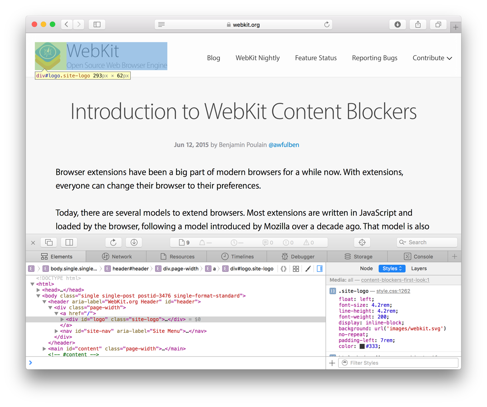
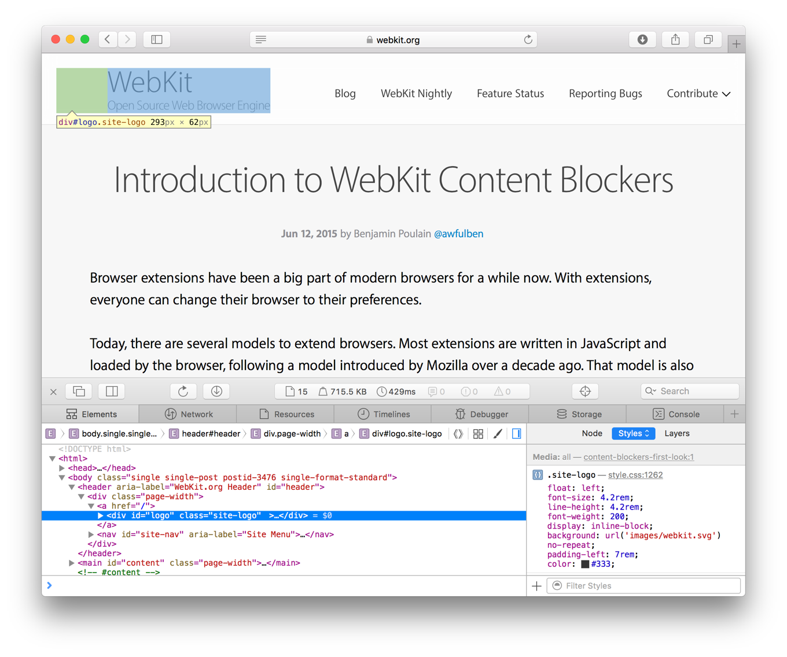
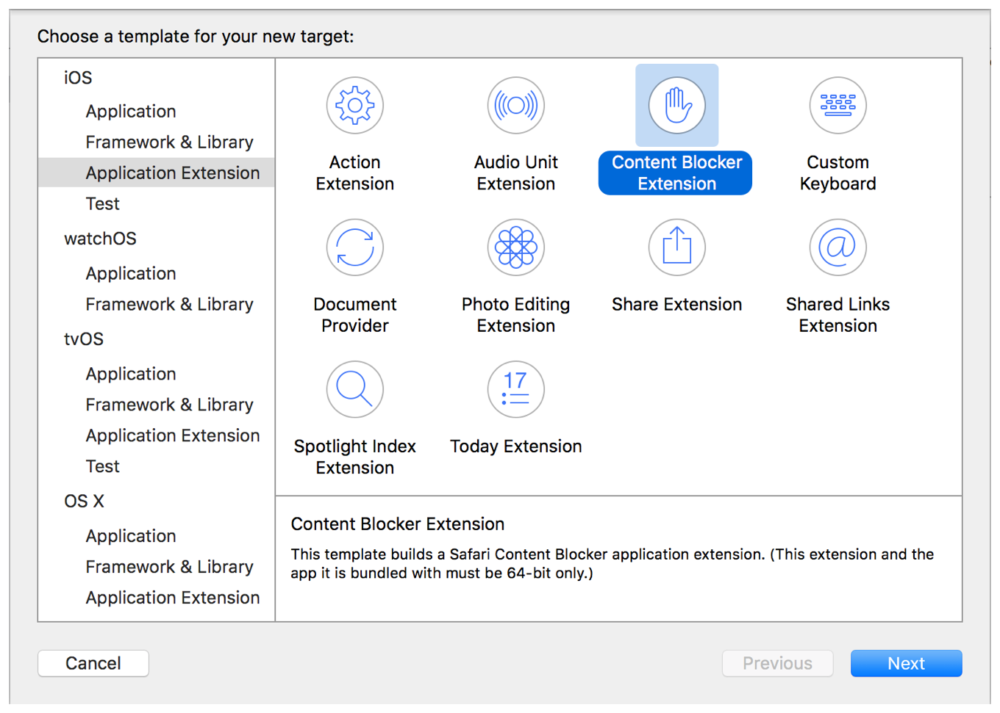

> 导航：[总目录](../../../README.md) · [documentation](../../../_indexes/documentation.md) · [App Extension Programming Guide](index.md)

## Content Blocker

In iOS, a Content Blocker extension customizes the way Safari handles your content. The extension tailors your content by hiding elements, blocking loads, and stripping cookies from Safari requests.

Using a Content Blocker extension, you provide Safari with content-blocking rules that specify how Safari treats content such as images, scripts, and pop-up windows. Your rules can hide Safari-downloaded content or prevent Safari from requesting specific content from the server. By reducing the amount of content Safari requests, your extension can reduce the amount of time required to load pages. When you block content from loading, you reduce Safari’s memory usage and improve Safari’s performance.

In addition to blocking unwanted content, a Content Blocker extension protects privacy. For example, the extension doesn’t have access to users’ browsing activity and it can’t report activity to your app. By blocking cookies and scripts, the extension reduces the information that Safari provides to other websites.

> [!IMPORTANT]
> 

### A Content Blocker in Action

Your Content Blocker extension customizes Safari content by providing content-blocking rules. Rules use specific attributes to achieve your desired result. For example, a rule with `"type": "block"` and `"resource-type": ["image"]` prevents Safari from requesting images (Listing 7-1).

__Listing 7-1__Content-blocking rule to block an image

1. `[{`
2. `"trigger": {`
3. `"url-filter": "webkit.org",`
4. `"resource-type": ["image"]`
5. `},`
6. `"action": {`
7. `"selector": "#logo",`
8. `"type": "block"`
9. `}`
10. `}]`

Safari follows this rule—that is, it loads content and omits any images that match the rule. The image highlighted in Figure 7-1 has the rule-specified URL, resource type, and selector.

__Figure 7-1__Before blocking the image

In Figure 7-2, Safari omits that image and loads the other page content.

__Figure 7-2__After blocking the image

The same rule with `"resource-type": ["image", "script"]` would prevent requests for scripts as well as images.

### Customizing Content-Blocking Rules

The Content Blocker App Extension template in Xcode contains code to send your content-blocking rules to Safari in a JSON format. The JSON consists of an array of rules (triggers and actions) for blocking specified content. Safari converts the JSON to bytecode, which it applies efficiently to all resource loads without leaking information about the user’s browsing back to the app extension. Just edit the JSON file in the template to provide your own triggers and actions. For more information on creating content-blocking rules, see _[Safari Content-Blocking Rules Reference](https://developer.apple.com/library/archive/documentation/Extensions/Conceptual/ContentBlockingRules/Introduction/Introduction.html#//apple_ref/doc/uid/TP40016265)_.

You can change content-blocking rules while your app is running. Your app's UI can offer users customization options such as choosing types of content to block and choosing whether to ignore a block list on a certain websites. Use the [SFContentBlockerManager](https://developer.apple.com/documentation/safariservices/sfcontentblockermanager) class to reload the content-blocking rules if the rules change while the extension is running.

### Use the Xcode Content Blocker Extension Template

The Xcode Content Blocker Extension template provides default source files for the principal view controller class, an `Info.plist` file, and a storyboard file. Figure 7-3 shows the new extension template selected in Xcode.

__Figure 7-3__Xcode panel to add an iOS extension

By default, the Content Blocker template supplies the following `Info.plist` keys and values:

1. `<key>NSExtension</key>`
2. `<dict>`
3. `<key>NSExtensionPointIdentifier</key>`
4. `<string>com.apple.Safari.content-blocker</string>`
5. `<key>NSExtensionPrincipalClass</key>`
6. `<string>$(PRODUCT_MODULE_NAME).ActionRequestHandler</string>`
7. `</dict>`

These are the only keys and values you need in order to create your Content Blocker extension.

### Content Blocker Errors

The most common errors in Content Blockers are caused by rule-formatting errors. The rules should be formatted as objects as shown in _[Safari Content-Blocking Rules Reference](https://developer.apple.com/library/archive/documentation/Extensions/Conceptual/ContentBlockingRules/Introduction/Introduction.html#//apple_ref/doc/uid/TP40016265)_. Missing commas, braces, and brackets will prevent Safari from compiling content-blocking rules.

You can use Safari Web Inspector to debug your Content Blocker Extension. Read _[Safari Web Inspector Guide](../../Apple%20Applications/Safari%20Web%20Inspector%20Guide/About%20Safari%20Web%20Inspector.md#apple-f4xwc4dqnrsv64tfmyxwi33df52wszbpkridimbqga3tqnzu)_ for more information.

[Audio Unit](AudioUnit.md#apple-f4xwc4dqnrsv64tfmyxwi33df52wszbpkridimbqge2demjufvbuqmrsfvjvomi)

[Custom Keyboard](CustomKeyboard.md#apple-f4xwc4dqnrsv64tfmyxwi33df52wszbpkridimbqge2demjufvbuqmjwfvjvomi)
