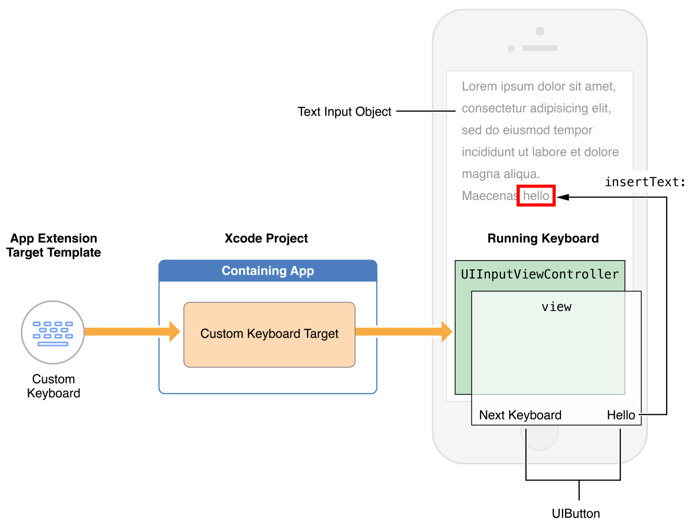
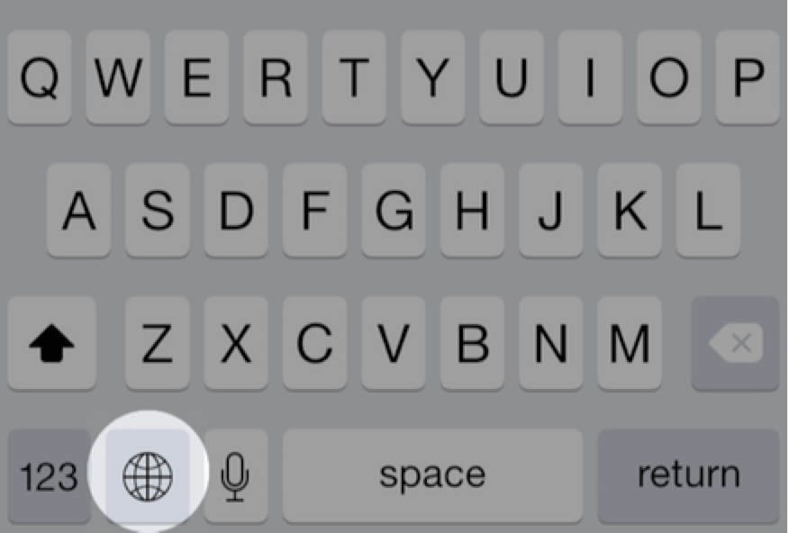

> 导航：[总目录](../../../README.md) · [documentation](../../../_indexes/documentation.md) · [App Extension Programming Guide](index.md)

## Custom Keyboard

A custom keyboard replaces the system keyboard for users who want capabilities such as a novel text input method or the ability to enter text in a language not otherwise supported in iOS. The essential function of a custom keyboard is simple: Respond to taps, gestures, or other input events and provide text, in the form of an unattributed [NSString](https://developer.apple.com/library/archive/documentation/LegacyTechnologies/WebObjects/WebObjects_3.5/Reference/Frameworks/ObjC/Foundation/Classes/NSStringClassCluster/Description.html#//apple_ref/occ/cl/NSString) object, at the text insertion point of the current text input object.

> [!NOTE]
> 

After a user chooses a custom keyboard, it becomes the keyboard for every app the user opens. For this reason, a keyboard you create must, at minimum, provide certain base features. Most important, your keyboard must allow the user to switch to another keyboard.

### Understand User Expectations for Keyboards

To understand what users expect of your custom keyboard, study the system keyboard—it’s fast, responsive, and capable. And it never interrupts the user with information or requests. If you provide features that require user interaction, add them not to the keyboard but to your keyboard’s containing app.

### Keyboard Features That iOS Users Expect

There is one feature that iOS users expect and that every custom keyboard _must_ provide: a way to switch to another keyboard. On the system keyboard, this affordance appears as a button called the _Globe key_. In iOS 8 and later, the system provides a specific API for your “next keyboard” key, described in [Providing a Way to Switch to Another Keyboard](#apple-f4xwc4dqnrsv64tfmyxwi33df52wszbpkridimbqge2demjufvbuqmjwfvjvona).

The system keyboard presents an appropriate key set or layout based on the [UIKeyboardType](https://developer.apple.com/documentation/uikit/uikeyboardtype) trait of the current text input object. With the insertion point in the To: field in Mail, for example, the system keyboard period key changes: When you press and hold that key, you can pick from among a set of top-level domain suffixes. Design your custom keyboard with keyboard type traits in mind.

iOS users also expect autocapitalization: In a standard text field, the first letter of a sentence in a case-sensitive language is automatically capitalized.

These features and others are listed next.

- Appropriate layout and features based on keyboard type trait
- Autocorrection and suggestion
- Automatic capitalization
- Automatic period upon double space
- Caps lock support
- Keycap artwork
- Multistage input for ideographic languages

You can decide whether or not to implement such features; there is no dedicated API for any of the features just listed, so providing them is a competitive advantage.

### System Keyboard Features Unavailable to Custom Keyboards

Your custom keyboard does not have access to most of the general keyboard settings in the Settings app (Settings > General > Keyboard), such as Auto-Capitalization and Enable Caps Lock. Nor does your keyboard have access to the dictionary reset feature (Settings > General > Reset > Reset Keyboard Dictionary). To give your users flexibility, create a standard settings bundle, as described in [Implementing an iOS Settings Bundle](https://developer.apple.com/library/archive/documentation/Cocoa/Conceptual/UserDefaults/Preferences/Preferences.html#//apple_ref/doc/uid/10000059i-CH6) in _[Preferences and Settings Programming Guide](../../Cocoa/Preferences%20and%20Settings%20Programming%20Guide/About%20Preferences%20and%20Settings.md#apple-f4xwc4dqnrsv64tfmyxwi33df52wszbpgeydambqga2ts2i)_. Your custom settings then appear in the Keyboard area in Settings, associated with your keyboard.

There are certain text input objects that your custom keyboard is not eligible to type into. First is any _secure_ text input object. Such an object is defined by its [secureTextEntry](https://developer.apple.com/documentation/uikit/uitextinputtraits/1624427-securetextentry) property being set to `YES``true` and is distinguished by presenting typed characters as dots.

When a user taps in a secure text input object, the system temporarily replaces your custom keyboard with the system keyboard. When the user then taps in a nonsecure text input object, your keyboard automatically resumes.

Your custom keyboard is also ineligible to type into so-called phone pad objects, such as the phone number fields in Contacts. These input objects are exclusively for strings built from a small set of alphanumeric characters specified by telecommunications carriers and are identified by having one or another of the following two keyboard type traits:

- [UIKeyboardTypePhonePad](https://developer.apple.com/documentation/uikit/uikeyboardtype/uikeyboardtypephonepad)
- [UIKeyboardTypeNamePhonePad](https://developer.apple.com/documentation/uikit/uikeyboardtype/uikeyboardtypenamephonepad)

When a user taps in a phone pad object, the system temporarily replaces your keyboard with the appropriate, standard system keyboard. When the user then taps in a different input object that requests a standard keyboard via its type trait, your keyboard automatically resumes.

An app developer can elect to reject the use of all custom keyboards in their app. For example, the developer of a banking app, or the developer of an app that must conform to the HIPAA privacy rule in the US, might do this. Such an app employs the [application:shouldAllowExtensionPointIdentifier:](https://developer.apple.com/documentation/uikit/uiapplicationdelegate/1623122-application) method from the `UIApplicationDelegate` protocol (returning a value of `NO``false`), and thereby always uses the system keyboard.

Because a custom keyboard can draw only within the primary view of its [UIInputViewController](https://developer.apple.com/documentation/uikit/uiinputviewcontroller) object, it cannot select text. Text selection is under the control of the app that is using the keyboard. If that app provides an editing menu interface (such as for Cut, Copy, and Paste), the keyboard has no access to it. A custom keyboard cannot offer inline autocorrection controls near the insertion point.

Custom keyboards, like all app extensions in iOS 8.0, have no access to the device microphone, so dictation input is not possible.

Finally, it is not possible to display key artwork above the top edge of a custom keyboard’s primary view, as the system keyboard does on iPhone when you tap and hold a key in the top row.

### API Quick Start for Custom Keyboards

This section gives you a quick tour of the APIs for building a keyboard. Figure 8-1 shows some of the important objects in a running keyboard and where they come from in a typical development workflow.

__Figure 8-1__Basic structure of a custom keyboard

The Custom Keyboard template (in the iOS “Application Extension” target template group) contains a subclass of the [UIInputViewController](https://developer.apple.com/documentation/uikit/uiinputviewcontroller) class, which serves as your keyboard’s primary view controller. The template also includes a basic implementation of the “next keyboard” key, which calls the [advanceToNextInputMode](https://developer.apple.com/documentation/uikit/uiinputviewcontroller/1618191-advancetonextinputmode) method of the `UIInputViewController` class. Add objects such as views, controls, and gesture recognizers to the input view controller’s primary view (in its [inputView](https://developer.apple.com/documentation/uikit/uiinputviewcontroller/1618192-inputview) property), as suggested in Figure 8-1. As with other app extensions, there is no window in the target, and, therefore, no root view controller per se.

The template’s `Info.plist` file comes preconfigured with the minimal values needed for a keyboard. See the `NSExtensionAttributes` dictionary key in the keyboard target’s `Info.plist` file. The keys for configuring a keyboard are described in [Configuring the Info.plist file for a Custom Keyboard](#apple-f4xwc4dqnrsv64tfmyxwi33df52wszbpkridimbqge2demjufvbuqmjwfvjvomjy).

By default, a keyboard has no network access and cannot share a container with its containing app. To enable these things, set the value of the `RequestsOpenAccess` Boolean key in the `Info.plist` file to `YES``true`. Doing this expands the keyboard’s sandbox, as described in [Designing for User Trust](#apple-f4xwc4dqnrsv64tfmyxwi33df52wszbpkridimbqge2demjufvbuqmjwfvjvomy).

An input view controller conforms to various protocols for interacting with the content of a text input object:

- To insert or delete text in response to touch events, employ the [UIKeyInput](https://developer.apple.com/documentation/uikit/uikeyinput) protocol methods [insertText:](https://developer.apple.com/documentation/uikit/uikeyinput/1614543-inserttext) and [deleteBackward](https://developer.apple.com/documentation/uikit/uikeyinput/1614572-deletebackward). Call these methods on the input view controller’s [textDocumentProxy](https://developer.apple.com/documentation/uikit/uiinputviewcontroller/1618193-textdocumentproxy) property, which represents the current text input object and which conforms to the [UITextDocumentProxy](https://developer.apple.com/documentation/uikit/uitextdocumentproxy) protocol. For example:

  1. `[self.textDocumentProxy insertText:@"hello "]; // Inserts the string "hello " at the insertion point`

  1. `[self.textDocumentProxy deleteBackward]; // Deletes the character to the left of the insertion point`

  1. `[self.textDocumentProxy insertText:@"\n"]; // In a text view, inserts a newline character at the insertion point`
- To get the data you need to determine how much text is appropriate to delete when you call the [deleteBackward](https://developer.apple.com/documentation/uikit/uikeyinput/1614572-deletebackward) method, obtain the textual context near the insertion point from the [documentContextBeforeInput](https://developer.apple.com/documentation/uikit/uitextdocumentproxy/1618190-documentcontextbeforeinput) property of the [textDocumentProxy](https://developer.apple.com/documentation/uikit/uiinputviewcontroller/1618193-textdocumentproxy) property, as follows:

  1. `NSString *precedingContext = self.textDocumentProxy.documentContextBeforeInput;`

  You can then delete the appropriate text—for example, a single character, or everything back to a whitespace character. To delete by semantic unit, such as by word, sentence, or paragraph, employ the functions described in _[CFStringTokenizer Reference](https://developer.apple.com/documentation/corefoundation/cfstringtokenizer)_ and refer to related documentation. Note that each language has its own tokenization rules.
- To control the insertion point position, such as to support text deletion in a forward direction, call the [adjustTextPositionByCharacterOffset:](https://developer.apple.com/documentation/uikit/uitextdocumentproxy/1618194-adjusttextposition) method of the `UITextDocumentProxy` protocol. For example, to delete forward by one character, use code similar to this:

  1. `- (void) deleteForward {`
  2. `[self.textDocumentProxy adjustTextPositionByCharacterOffset: 1];`
  3. `[self.textDocumentProxy deleteBackward];`
  4. `}`
- To respond to changes in the content of the active text object, or to respond to user-initiated changes in the position of the insertion point, implement the methods of the [UITextInputDelegate](https://developer.apple.com/documentation/uikit/uitextinputdelegate) protocol.

To present a keyboard layout appropriate to the current text input object, respond to the object’s [UIKeyboardType](https://developer.apple.com/documentation/uikit/uikeyboardtype) property. For each trait you support, change the contents of your primary view accordingly.

To support more than one language in your custom keyboard, you have two options:

- Create one keyboard per language, each as a separate target that you add to a common containing app
- Create a single multilingual keyboard, dynamically switching its primary language as appropriate

  To dynamically switch the primary language, use the [primaryLanguage](https://developer.apple.com/documentation/uikit/uiinputviewcontroller/1618200-primarylanguage) property of the `UIInputViewController` class.

Depending on the number of languages you want to support and the user experience you want to provide, pick the option that makes the most sense.

Every custom keyboard (independent of the value of its `RequestsOpenAccess` key) has access to a basic autocorrection lexicon through the [UILexicon](https://developer.apple.com/documentation/uikit/uilexicon) class. Make use of this class, along with a lexicon of your own design, to provide suggestions and autocorrections as users are entering text. The `UILexicon` object contains words from various sources, including:

- Unpaired first names and last names from the user’s Address Book database
- Text shortcuts defined in the Settings > General > Keyboard > Shortcuts list
- A common words dictionary

You can adjust the height of your custom keyboard’s primary view using Auto Layout. By default, a custom keyboard is sized to match the system keyboard, according to screen size and device orientation. A custom keyboard’s width is always set by the system to equal the current screen width. To adjust a custom keyboard’s height, change its primary view's height constraint.

The following code lines show how you might define and add such a constraint:

1. `CGFloat _expandedHeight = 500;`
2. `NSLayoutConstraint *_heightConstraint =
   [NSLayoutConstraint constraintWithItem: self.view
   attribute: NSLayoutAttributeHeight
   relatedBy: NSLayoutRelationEqual
   toItem: nil
   attribute: NSLayoutAttributeNotAnAttribute
   multiplier: 0.0
   constant: _expandedHeight];`
3. `[self.view addConstraint: _heightConstraint];`

> [!NOTE]
> 

### Development Essentials for Custom Keyboards

There are two development essentials for every custom keyboard:

- __Trust.__ Your custom keyboard gives you access to what a user types, so trust between you and your user is essential.
- __A “next keyboard” key.__ The affordance that lets a user switch to another keyboard is part of a keyboard’s user interface; you must provide one in your keyboard.

### Designing for User Trust

Your first consideration when creating a custom keyboard must be how you will establish and maintain user trust. This trust hinges on your understanding of privacy best practices and knowing how to implement them.

> [!NOTE]
> 

For keyboards, the following three areas are especially important for establishing and maintaining user trust:

__Safety of keystroke data.__ Users want their keystrokes to go to the document or text field they’re typing into, and not to be archived on a server or used for purposes that are not obvious to them.

__Appropriate and minimized use of other user data.__ If your keyboard employs other user data, such as from Location Services or the Address Book database, the burden is on you to explain and demonstrate the benefit to your users.

__Accuracy.__ Accuracy in converting input events to text is not a privacy issue per se but it impacts trust: With every word typed, users see the accuracy of your code.

To design for trust, first consider whether to request open access. Although open access makes many things possible for a custom keyboard, it also increases your responsibilities (see Table 8-1).

__Table 8-1__Standard and open access (network-enabled) keyboards—capabilities and privacy considerations

| Open access | Capabilities and restrictions | Privacy considerations |
| --- | --- | --- |
| _Off (default)_ | - Keyboard can perform all the normal duties expected of a basic keyboard - Access to a common words lexicon for autocorrect and text suggestion - Access to the text shortcuts list in Settings - No shared container with containing app - No access to file system apart from keyboard’s own container - No ability to participate directly or indirectly in iCloud, Game Center, or In-App Purchase | - Users know that keystrokes go only to the app that is using the keyboard |
| _On_ | - All capabilities of a nonnetworked custom keyboard - Keyboard can access Location Services and Address Book, with user permission - Keyboard and containing app can employ a shared container - Keyboard can send keystrokes and other input events for server-side processing - Containing app can provide editing interface for keyboard’s custom autocorrect lexicon - Via containing app, keyboard can employ iCloud to ensure settings and autocorrect lexicon are up to date on all devices - Via containing app, keyboard can participate in Game Center and In-App Purchase - If keyboard supports mobile device management (MDM), it can work with managed apps | - Users know that keystrokes are available to the keyboard developer - You must adhere to networked keyboard guidelines in _App Store Review Guidelines_ and _iOS Developer Program License Agreement_, linked from Apple’s [App Review Support](https://developer.apple.com/support/appstore/app-review/) page. |

If you build a keyboard without open access, the system ensures that keystrokes cannot be sent back to you or anywhere else. Use a nonnetworked keyboard if your goal is to provide normal keyboard functionality. Because of its restricted sandbox, a nonnetworked keyboard gives you a head start in meeting Apple’s data privacy guidelines and in gaining user trust.

If you enable open access (as described [Configuring the Info.plist file for a Custom Keyboard](#apple-f4xwc4dqnrsv64tfmyxwi33df52wszbpkridimbqge2demjufvbuqmjwfvjvomjy)), a variety of possibilities open up but your responsibilities increase as well.

> [!NOTE]
> 

Each keyboard capability associated with open access carries responsibilities on your part as a developer, as indicated in Table 8-2. In general, treat user data with the greatest possible respect and do not use it for any purpose that is not obvious to the user.

__Table 8-2__Open-access keyboard user benefits and developer responsibilities

| Capability | Example user benefit | Developer responsibility |
| --- | --- | --- |
| Shared container with containing app | Management UI for keyboard’s autocorrect lexicon | Consider the autocorrect lexicon to be private user data. Do not send it to your servers for any purpose that is not obvious to the user. |
| Sending keystroke data to your server | Enhanced touch-event processing and input prediction via developer’s computing resources | Do not store received keystroke or voice data except to provide services that are obvious to the user. |
| Dynamic autocorrect lexicon based on network supplied data | Names of people, places, and current events in the news added to autocorrection lexicon | Do not associate the user’s identity with their use of trending or other network-based information, for any reason that is not obvious to the user. |
| Address Book access | Names, places, and phone numbers relevant to the user added to autocorrection lexicon | Do not use Address Book data for any purpose that is not obvious to the user. |
| Location Services access | Nearby place names added to autocorrection lexicon | Do not use Location Services in the background. Do not send location data to your servers for any purpose that is not obvious to the user. |

An open-access keyboard and its containing app can send keystroke data to your server, which enables you to apply your computing resources to such features as touch-event processing and input prediction. If you employ this capability, do not store received keystroke or voice data beyond the time needed to provide text back to the user or to provide features that you explain to the user. Refer to Table 8-2 for additional responsibilities you have when using open-access-keyboard capabilities.

### Providing a Way to Switch to Another Keyboard

When more than one keyboard is enabled, the system keyboard includes a Globe key (see Figure 8-2) that lets the user switch keyboards. Your custom keyboard may require a similar “next keyboard” key.

__Figure 8-2__The system keyboard’s Globe key

To determine whether your custom keyboard needs to display a “next keyboard” key, check the [needsInputModeSwitchKey](https://developer.apple.com/documentation/uikit/uiinputviewcontroller/2875741-needsinputmodeswitchkey) property on the input view controller. If true, your keyboard should include this key.

To ask the system to switch to another keyboard, call the [advanceToNextInputMode](https://developer.apple.com/documentation/uikit/uiinputviewcontroller/1618191-advancetonextinputmode) method of the [UIInputViewController](https://developer.apple.com/documentation/uikit/uiinputviewcontroller) class. The system picks the appropriate “next” keyboard from the list of user-enabled keyboards; there is no API to obtain a list of enabled keyboards or for picking a particular keyboard to switch to.

The Xcode Custom Keyboard template includes the [advanceToNextInputMode](https://developer.apple.com/documentation/uikit/uiinputviewcontroller/1618191-advancetonextinputmode) method as the action of its Next Keyboard key. For best user experience, place your “next keyboard” key close to the same screen location as the system keyboard’s Globe key.

### Getting Started with Custom Keyboard Development

In this section you learn how to create a custom keyboard, configure it according to your goals, and run it in iOS Simulator or on a device. You’ll also learn about some UI factors to bear in mind when replacing the system keyboard.

### Using the Xcode Custom Keyboard Template

The steps to create a keyboard and its containing app differ slightly from those for other app extensions. This section walks you through getting a basic keyboard up and running.

__To create a custom keyboard in a containing app__

1. In Xcode, choose File > New > Project, and in the iOS Application template group choose the Single View Application template.
2. Click Next.
3. Name the project (for example, “ContainingAppForKeyboard”), then click Next.
4. Navigate to the location you want to save the project in, then click Create.

   At this point, you have an empty app for your project to serve the simple role, for now, of containing the keyboard target. Before you submit a containing app to the App Store, it must perform some useful function. See _App Store Review Guidelines_, linked from Apple’s [App Review Support](https://developer.apple.com/support/appstore/app-review/) page.
5. Choose File > New > Target, and in the iOS “Application Extension” target template group choose the Custom Keyboard template, then click Next.
6. Name the target as you’d like the keyboard’s name to appear in the iOS user interface (for example, Custom Keyboard).
7. Ensure that the Project and the “Embed in Application” pop-up menus display the name of the containing app, then click Finish.

   If you are prompted to activate the scheme for the new keyboard target, click Activate.

You can now optionally customize the keyboard group name as it appears in the Purchased Keyboards list in Settings, as described next.

__To customize the keyboard group name__

1. In the Xcode project navigator, choose the containing app’s `Info.plist` file, located in the app’s Supporting Files folder. The property list editor opens, showing the contents of the file.
2. Hover the cursor over the “Bundle name” row, then click the “+” button that appears. This creates a new, empty property list row and selects its Key field.
3. Start typing `Bundle display name` and when the name autocompletes, press Return.
4. Double-click in the Value field in the same row to obtain a cursor there, then enter the keyboard group name you want.
5. Choose File > Save to save your changes to property list file.

Table 8-3summarizes the UI strings for your custom keyboard that you can configure in the `Info.plist` files for the keyboard and its containing app.

__Table 8-3__User interface strings specified in target and containing app `Info.plist` files

| iOS user interface text | `Info.plist` key |
| --- | --- |
| - Keyboard group name in Purchased Keyboards list in Settings | Bundle display name in _containing app’s_ `Info.plist` file |
| - Keyboard name displayed in Settings - Keyboard name displayed in the Globe key menu | Bundle display name in _custom keyboard target’s_ `Info.plist` file |

Now you can run the template-based keyboard in iOS Simulator, or on a device, to explore its behavior and capabilities.

__To run the custom keyboard and attach the Xcode debugger__

1. In Xcode, set a breakpoint in your view controller implementation.

   For example, set a breakpoint in the [viewDidLoad](https://developer.apple.com/documentation/uikit/uiviewcontroller/1621495-viewdidload) method.
2. Use the Xcode toolbar to ensure that the active scheme popup menu specifies the keyboard’s scheme and an iOS Simulator or attached device.
3. Choose Product > Run, or click the Play button at the upper left of the Xcode project window.

   Xcode prompts you to select a host app. Select an app with a readily-available text field, such as Contacts or Safari.
4. Click Run.

   Xcode runs your specified host app. If this is your first time deploying your keyboard extension to iOS Simulator or a device, use Settings to add and enable the keyboard, as follows:

   1. Go to Settings > General > Keyboard > Keyboards.
   2. Tap Add New Keyboard.
   3. In the Purchased Keyboards group, tap the name of your new keyboard. A modal view appears with a switch to enable your keyboard.
   4. Tap the switch to enable your keyboard. A warning alert appears.
   5. In the warning alert, tap Add Keyboard to finish enabling your new keyboard. Then tap Done.
5. In iOS Simulator or on the attached device, invoke your custom keyboard.

   To do this, tap to place the insertion point in a text field—in any app, or in the Spotlight field in Springboard—to display the system keyboard. Then press and hold the Globe key and choose your custom keyboard.

   Now you can explore your custom keyboard’s behavior, but the debugger is not yet attached. The bare-bones keyboard built from the template has only one behavior, indicated by its Next Keyboard button: allowing you to switch back to the previously used keyboard.

   Before continuing, ensure that your custom keyboard is active.
6. Dismiss your keyboard (so that in step 8 you can hit the `viewDidLoad` breakpoint by again invoking the keyboard).
7. In Xcode, choose Debug > Attach to Process > By Process Identifier (PID) or Name.

   In the sheet that appears, enter the name of your keyboard extension (including spaces) as you specified it when creating it. By default, this is the name for the app extension’s group in the project navigator.
8. Click Attach.

   Xcode indicates in the Debug navigator that it is waiting to attach.
9. In any app in iOS Simulator or the device (depending on which you are using), invoke the keyboard by tapping in a text field.

   As your keyboard’s main view begins to load, the Xcode debugger attaches to your keyboard and Xcode hits your breakpoint.

### Configuring the Info.plist file for a Custom Keyboard

The information property list (`Info.plist` file) keys that are specific to a custom keyboard let you statically declare the salient characteristics of your keyboard, including its primary language and whether it requires open access.

To examine these keys, open an Xcode project to which you’ve added a Custom Keyboard target template. Now select the `Info.plist` file in the Project navigator (the `Info.plist` file is in the Supporting Files folder for the keyboard target).

In source text form, the keys for a custom keyboard are as follows:

1. `<key>NSExtension</key>`
2. `<dict>`
3. `<key>NSExtensionAttributes</key>`
4. `<dict>`
5. `<key>IsASCIICapable</key>`
6. `<false/>`
7. `<key>PrefersRightToLeft</key>`
8. `<false/>`
9. `<key>PrimaryLanguage</key>`
10. `<string>en-US</string>`
11. `<key>RequestsOpenAccess</key>`
12. `<false/>`
13. `</dict>`
14. `<key>NSExtensionPointIdentifier</key>`
15. `<string>com.apple.keyboard-service</string>`
16. `<key>NSExtensionPrincipalClass</key>`
17. `<string>KeyboardViewController</string>`
18. `</dict>`

Each of these keys is explained in [App Extension Keys](https://developer.apple.com/library/archive/documentation/General/Reference/InfoPlistKeyReference/Articles/AppExtensionKeys.html#//apple_ref/doc/uid/TP40014212). Use the keys in the `NSExtensionAttributes` dictionary to express the characteristics and needs of your custom keyboard, as follows:

`IsASCIICapable`—This Boolean value, `NO``false` by default, expresses whether a custom keyboard can insert ASCII strings into a document. Set this value to `YES``true` if you provide a keyboard type specifically for the [UIKeyboardTypeASCIICapable](https://developer.apple.com/documentation/uikit/uikeyboardtype/uikeyboardtypeasciicapable) keyboard type trait.

`PrefersRightToLeft`—This Boolean value, also `NO``false` by default, expresses whether a custom keyboard is for a right-to-left language. Set this value to `YES``true` if your keyboard’s primary language is right-to-left.

`PrimaryLanguage`—This string value, `en-US` (English for the US) by default, expresses the primary language for your keyboard using the pattern `<language>-<REGION>`. You can find a list of strings corresponding to languages and regions at [http://www.opensource.apple.com/source/CF/CF-476.14/CFLocaleIdentifier.c](http://www.opensource.apple.com/source/CF/CF-476.14/CFLocaleIdentifier.c).

`RequestsOpenAccess`—This Boolean value, `NO``false` by default, expresses whether a custom keyboard wants to enlarge its sandbox beyond that needed for a basic keyboard. If you request open access by setting this key’s value to `YES``true`, your keyboard gains the following capabilities, each with a concomitant responsibility in terms of user trust:

- Access to Location Services, the Address Book database, and the Camera Roll, each requiring user permission on first access
- Option to use a shared container with the keyboard’s containing app, which enables features such as providing a custom lexicon management UI in the containing app
- Ability to send keystrokes, other input events, and data over the network for server-side processing
- Ability to use the [UIPasteboard](https://developer.apple.com/documentation/uikit/uipasteboard) class
- Ability to play audio, including keyboard clicks using the [playInputClick](https://developer.apple.com/documentation/uikit/uidevice/1620050-playinputclick) method
- Access to iCloud, which you can use, for example, to ensure that keyboard settings and your custom autocorrect lexicon are up to date on all devices owned by the user
- Access to Game Center and In-App Purchase, via the containing app
- Ability to work with managed apps, if you design your keyboard to support mobile device management (MDM)

When considering whether to set the `RequestsOpenAccess` key’s value to `YES``true`, be sure to read [Designing for User Trust](#apple-f4xwc4dqnrsv64tfmyxwi33df52wszbpkridimbqge2demjufvbuqmjwfvjvomy), which describes your responsibilities for respecting and protecting user data.

[Content Blocker](ContentBlocker.md#apple-f4xwc4dqnrsv64tfmyxwi33df52wszbpkridimbqge2demjufvbuqmrwfvjvomi)

[Document Provider](FileProvider.md#apple-f4xwc4dqnrsv64tfmyxwi33df52wszbpkridimbqge2demjufvbuqmjyfvjvomi)
