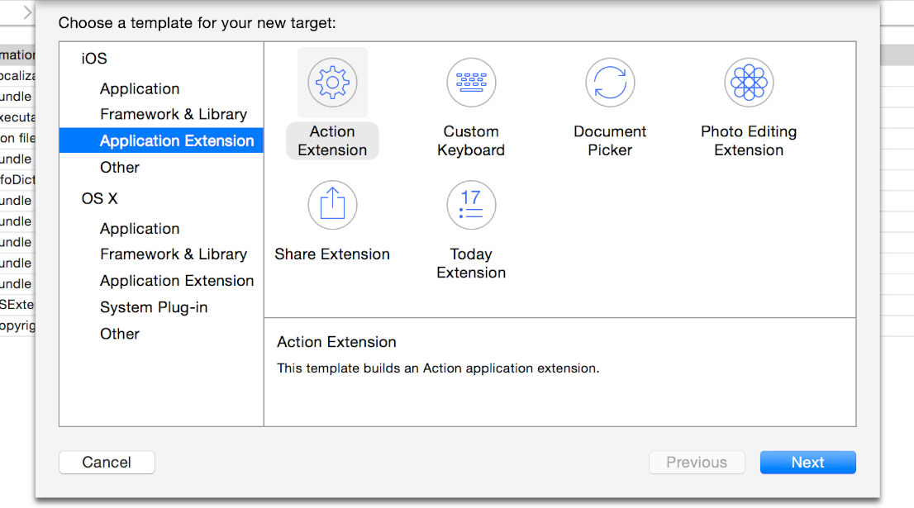

> 导航：[总目录](../../../README.md) · [documentation](../../../_indexes/documentation.md) · [App Extension Programming Guide](index.md)

## Creating an App Extension

When you’re ready to develop an app extension, begin by choosing the extension point that supports the user task you want to facilitate. Use the corresponding Xcode app extension template and enhance the default files with custom code and user interface (UI). After you optimize and test your app extension, you’re ready to distribute it within your containing app.

### Begin Development By Choosing the Right Extension Point

Because each extension point targets a well-defined user scenario, your first job is to choose the extension point that supports the type of functionality you plan to deliver. This choice is an important one because it determines the APIs that are available to you and, in some cases, the ways in which APIs behave.

The extension points supported in iOS and OS X, along with their `Info.plist` extension point identifier keys, are described in the section [NSExtensionPointIdentifier](../Information%20Property%20List%20Key%20Reference/App%20Extension%20Keys.md#apple-f4xwc4dqnrsv64tfmyxwi33df52wszbpkridimbqge2demjsfvjvomjv).

After you choose the extension point that makes sense for your app extension, add a new target to your containing app. The easiest way to add an app extension target is to use an Xcode template that provides a target preconfigured for your extension point.

To add a new target to your Xcode app project, choose File > New > Target. In the sidebar on the left side of the new target dialog, choose Application Extension for iOS or OS X. In the pane on the right side of the dialog, Xcode displays the templates you can choose. For example, Figure 3-1 shows the templates you can use to create an iOS app extension.

__Figure 3-1__Xcode supplies several app extension templates you can use

After you choose a template and finish adding the target to your project, you should be able to build and run the project even before you customize the extension code. When you build an extension based on an Xcode template, you get an extension bundle that ends in `.appex`.

> [!NOTE]
> 

In most cases, you can test the default app extension by enabling it in System Preferences or Settings and then accessing it through another app. For example, you can test an OS X Share extension by opening a webpage in Safari, clicking the Share toolbar button, and choosing your extension in the menu that appears.

### Examine the Default App Extension Template

Each app extension template includes a property list file (that is, an `Info.plist` file), a view controller class, and a default user interface, all of which are defined by the extension point. The default view controller class (or _principal class_) can contain stubs for the extension point methods you should implement.

An app extension target’s `Info.plist` file identifies the extension point and may specify some details about your extension. At a minimum, the file includes the `NSExtension` key and a dictionary of keys and values that the extension point specifies. For example, the value of the required `NSExtensionPointIdentifier` key is the extension point’s reverse DNS name, such as `com.apple.widget-extension`. Here are some of the other keys and values you may see in your extension’s `NSExtension` dictionary:

- `NSExtensionAttributes`

  A dictionary of extension point–specific attributes, such as `PHSupportedMediaTypes` for a Photo Editing extension.
- `NSExtensionPrincipalClass`

  The name of the principal view controller class created by the template, such as `SharingViewController`. When a host app invokes your extension, the extension point instantiates this class.
- `NSExtensionMainStoryboard` (iOS extensions only)

  The default storyboard file for the extension, usually named `MainInterface`.

In addition to the property list settings, a template may set some capabilities by default. Each extension point can define capabilities that make sense for the type of task the extension point supports. For example, an iOS Document Provider extension includes the `com.apple.security.application-groups` entitlement.

All templates for OS X app extensions include the App Sandbox and `com.apple.security.files.user-selected.read-only` entitlements by default. You might need to define additional capabilities for your extension if it needs to do things like use the network or access the user’s photos or contact information.

> [!NOTE]
> 

### Respond to the Host App’s Request

As you learned in [Understand How an App Extension Works](ExtensionOverview.md#apple-f4xwc4dqnrsv64tfmyxwi33df52wszbpkridimbqge2demjufvbuqmrnknlte), an app extension opens when a user chooses the extension within a host app and the host app issues a request. At a high level, your extension receives the request, helps the user perform a task, and completes or cancels the request, according to the user’s action. For example, a Share extension receives a request from a host app and responds by displaying its view. After users compose content in the view, they choose to post the content or cancel the post, and the extension completes or cancels the request accordingly.

When a host app sends a request to an app extension, it specifies an extension context. For many extensions, the most important part of the context is the set of items a user wants to work with while they’re in the extension. For example, the context for an OS X Share extension might include a selection of text that a user wants to post.

As soon as a host app issues its request (typically, by calling the [beginRequestWithExtensionContext:](https://developer.apple.com/documentation/foundation/nsextensionrequesthandling/1413395-beginrequestwithextensioncontext) method), your app extension can use the [extensionContext](https://developer.apple.com/documentation/uikit/uiviewcontroller/1621411-extensioncontext) property on its principal view controller to get the context. Child view controllers also have access to this property through chaining.

Next, you use the [NSExtensionContext](https://developer.apple.com/documentation/foundation/nsextensioncontext) class to examine the context and get the items within it. Often, it works well to get the context and items in your view controller’s [loadView](https://developer.apple.com/documentation/uikit/uiviewcontroller/1621454-loadview) method so that you can display the information in your view. To get your extension’s context you can use code like the following:

1. `NSExtensionContext *myExtensionContext = self.extensionContext;`

Of particular interest is the context object’s [inputItems](https://developer.apple.com/documentation/foundation/nsextensioncontext/1414827-inputitems) property, which can contain the items your app extension needs to use. The `inputItems` property contains an array of [NSExtensionItem](https://developer.apple.com/documentation/foundation/nsextensionitem) objects, each of which contains an item the extension can work on. To get the items from the context object, you might use code like this:

1. `NSArray *inputItems = myExtensionContext.inputItems;`

Each `NSExtensionItem` object contains a number of properties that describe aspects of the item, such as its title, content text, attachments, and user info.

Note that the [attachments](https://developer.apple.com/documentation/foundation/nsextensionitem/1416690-attachments) property contains an array of media data that’s associated with the item. For example, in an item associated with a sharing request, the `attachments` property might contain a representation of the webpage a user wants to share.

After users work with the input items (if doing so is part of using the app extension), an app extension typically gives users a choice between completing or canceling the task. Depending on the user’s choice, you call either the [completeRequestReturningItems:completionHandler:](https://developer.apple.com/documentation/foundation/nsextensioncontext/1411301-completerequest) method, optionally returning `NSExtensionItem` objects to the host app, or the [cancelRequestWithError:](https://developer.apple.com/documentation/foundation/nsextensioncontext/1412773-cancelrequestwitherror) method, returning an error code.

> [!IMPORTANT]
> 

In iOS, your app extension might need a bit more time to complete a potentially lengthy task, such as uploading content to a website. When this is the case, you can use the [NSURLSession](https://developer.apple.com/documentation/foundation/urlsession) class to initiate a transfer in the background. Because a background transfer uses a separate process, the transfer can continue, as a low priority task, after your extension completes the host app’s request and gets terminated. To learn more about using `NSURLSession` in your extension, see [Performing Uploads and Downloads](ExtensionScenarios.md#apple-f4xwc4dqnrsv64tfmyxwi33df52wszbpkridimbqge2demjufvbuqmrrfvjvomq).

> [!IMPORTANT]
> 

### Optimize Efficiency and Performance

App extensions should feel nimble and lightweight to users. Design your app extension to launch quickly, aiming for well under one second. An extension that launches too slowly is terminated by the system.

Memory limits for running app extensions are significantly lower than the memory limits imposed on a foreground app. On both platforms, the system may aggressively terminate extensions because users want to return to their main goal in the host app. Some extensions may have lower memory limits than others: For example, widgets must be especially efficient because users are likely to have several widgets open at the same time.

Your app extension doesn’t own the main run loop, so it’s crucial that you follow the established rules for good behavior in main run loops. For example, if your extension blocks the main run loop, it can create a bad user experience in another extension or app.

Keep in mind that the GPU is a shared resource in the system. App extensions do not get top priority for shared resources; for example, a Today widget that runs a graphics-intensive game might give users a bad experience. The system is likely to terminate such an extension because of memory pressure. Functionality that makes heavy use of system resources is appropriate for an app, not an app extension.

### Design a Streamlined UI

Most extension points require you to supply at least some custom UI that users see when they open your app extension. An extension’s UI should be simple, restrained, and focused on facilitating a single task. To improve performance and the user’s experience, avoid including extraneous UI that doesn’t support your extension’s main task.

Most Xcode app extension templates provide a placeholder UI that you can use to get started.

Users identify your app extension by its icon and its name. An extension’s icon must be the same as the app icon of its containing app. Using the containing app’s icon helps a user be confident that an extension is in fact provided by the app they installed.

In iOS, a custom Action extension uses a template image version of its containing app’s icon, which you must provide.

iOS Share extensions automatically employ the containing app’s icon. If you provide a separate icon in your Share extension target, Xcode ignores it. For all other app extension types, you must provide an icon that matches the containing app’s icon.

For information on how to add an icon to your app extension, see Creating an Asset Catalog and Adding an App Icon Set or Launch Image Set. For more about icon requirements for iOS app extensions, see “App Extensions” in _iOS Human Interface Guidelines_

An app extension needs a short, recognizable name that includes the name of the containing app, using the pattern _<Containing app name>—<App extension name>_. This makes it easier for users to manage extensions throughout the system. You can, optionally, use the containing app’s name as-is for your extension, in the common case that your containing app provides exactly one extension.

The displayed name of your app extension is provided by the extension target’s `CFBundleDisplayName` value, which you can edit in the extension’s `Info.plist` file. If you don’t provide a value for the `CFBundleDisplayName` key, your extension uses the name of its containing app, as it appears in the `CFBundleName` value.

Make sure you localize the app extension’s name when you provide a localized app extension.

Some app extensions also need short descriptions. For example, an OS X widget displays a description to help users choose the widgets they want to see in the Today view. To provide this text, edit the value of the `widget.description` key in your widget’s `InfoPlist.strings` file.

### Ensure Your iOS App Extension Works on All Devices

You must ensure that your submitted app extension is universal: it must work on iPhone, iPod touch, and iPad. This requirement applies no matter which targeted device family you choose for your containing app. The app extension templates in Xcode are configured correctly for the universal targeted device family.

To declare that your app extension is universal, use the targeted device family build setting in Xcode, specifying the “iPhone/iPad” value.

__To ensure that your app extension is universal__

1. In the Xcode project navigator for your keyboard project, select the project file.

   If the project & targets list in the project editor is hidden, show it. To do this, click the button at the left of the project editor tab bar.
2. In the targets group in the project & targets list, select the target for your app extension.
3. Choose the Build Settings tab in the project editor.

   Ensure that the Basic and Combined buttons are selected, to make it easier for you to locate the settings you need here.
4. In the Deployment group in the project editor, view the Targeted Device Family setting. For both the Debug and Release configuration, the value should be “iPhone/iPad.”

   If you find different values, correct them to be “iPhone/iPad.”

Employ Auto Layout and size classes when designing and building your app extension. Test your app extension to ensure it behaves as you expect it to for all device sizes and orientations. Do this in iOS Simulator, as described in _[Simulator User Guide](../../IDEs/Simulator%20User%20Guide/About%20Simulator.md#apple-f4xwc4dqnrsv64tfmyxwi33df52wszbpkridimbqgezdqnby)_, and, if possible, also test on physical devices in both orientations.

Remember that even if your containing app targets only the iPad device family, your contained app extension can appear in the context of an iPhone app running in compatibility mode.

> [!IMPORTANT]
> 

### Debug, Profile, and Test Your App Extension

> [!NOTE]
> 

Using Xcode to debug an app extension is a lot like using Xcode to debug any other process, but with one important difference: In your extension scheme’s Run phase, you specify a _host app_ as the executable. Upon accessing the extension through that specified host’s UI, the Xcode debugger attaches to the extension.

The scheme in an Xcode app extension template uses the Ask On Launch option for the executable. With this option, each time you build and run your project you’re prompted to pick a host app. If you want to instead specify a particular host to use every time, open the scheme editor and use the Info tab for the app extension scheme’s Run phase.

The steps for attaching the Xcode debugger to your app extension are:

1. Enable the app extension’s scheme by choosing Product > Scheme > `MyExtensionName` or by clicking the scheme pop-up menu in the Xcode toolbar and choosing `MyExtensionName`.
2. Click the Build and Run button to tell Xcode to launch your specified host app.

   The Debug navigator indicates it is waiting for you to invoke the app extension.
3. Invoke the app extension by way of the host app’s UI.

   The Xcode debugger attaches to the extension’s process, sets active breakpoints, and lets the extension execute. At this point, you can use the same Xcode debugging features that you use to debug other processes.

> [!NOTE]
> 

In OS X, you need to perform the user step of enabling an app extension before you can access it from a host app for testing and debugging. You enable most extension types by using the Extensions pane of System Preferences. You can also open the Extensions pane by choosing More in the Share or Action menu.

For an OS X Today widget, use the Widget Simulator to test and debug it. (There is no separate step for you to perform in System Preferences to enable the widget.)

For a custom keyboard in iOS, use Settings to enable the app extension (Settings > General > Keyboard > Keyboards).

Xcode registers a built app extension for the duration of the debugging session on OS X. This means that if you want to install the development version of your extension on OS X you need to use the Finder to copy it from the build location to a location such as the Applications folder.

> [!NOTE]
> 

Because app extensions must be responsive and efficient, it's a good idea to watch the debug gauges in the debug navigator while you're running your extension. The debug gauges show how your extension uses the CPU, memory, and other system resources while it runs. If you see evidence of performance problems, such as an unusual spike in CPU usage, you can use Instruments to profile your extension and identify areas for improvement. You can open Instruments while you’re in a debugging session by clicking Profile in Instruments in any debug gauge report (to view a debug gauge report, click the gauge in the debug area). To learn more about the debug gauges, see Debug Your App; to learn how to use Instruments, see _[Instruments User Guide](https://developer.apple.com/library/archive/documentation/DeveloperTools/Conceptual/InstrumentsUserGuide/index.html#//apple_ref/doc/uid/TP40004652)_.

> [!NOTE]
> 

To test an app extension using the Xcode testing framework (that is, the XCTest APIs), write tests that exercise the extension code using your containing app as the host environment. To learn more about testing, see _[Testing with Xcode](../../Developer%20Tools/Testing%20with%20Xcode/About%20Testing%20with%20Xcode.md#apple-f4xwc4dqnrsv64tfmyxwi33df52wszbpkridimbqge2dcmzs)_.

### Distribute the Containing App

You can’t submit an app extension to the App Store unless it’s inside a containing app, and you can’t transfer an extension from one app to another.

To deliver an iOS app extension, you must submit a containing app to the App Store.

To deliver an OS X app extension, it’s recommended that you submit your containing app to the App Store, but it’s not required.

> [!NOTE]
> 

To pass app review, your containing app must provide functionality to users; it can’t just contain app extensions.

[Understand How an App Extension Works](ExtensionOverview.md#apple-f4xwc4dqnrsv64tfmyxwi33df52wszbpkridimbqge2demjufvbuqmrnknlte)

[Handling Common Scenarios](ExtensionScenarios.md#apple-f4xwc4dqnrsv64tfmyxwi33df52wszbpkridimbqge2demjufvbuqmrrfvjvomi)
