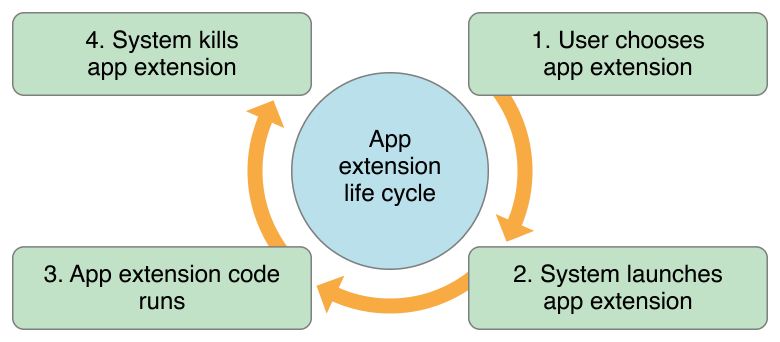
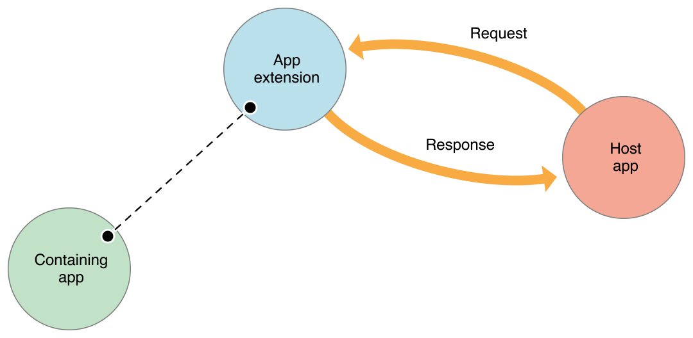
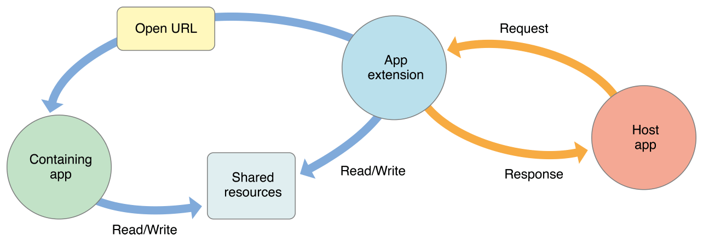

> 导航：[总目录](../../../README.md) · [documentation](../../../_indexes/documentation.md) · [App Extension Programming Guide](index.md)

## Understand How an App Extension Works

An app extension is not an app. It implements a specific, well scoped task that adheres to the policies defined by a particular extension point.

### An App Extension’s Life Cycle

Because an app extension is not an app, its life cycle and environment are different. In most cases, an extension launches when a user chooses it from an app’s UI or from a presented activity view controller. An app that a user employs to choose an app extension is called a _host app_. A host app defines the context provided to the extension and kicks off the extension life cycle when it sends a request in response to a user action. An extension typically terminates soon after it completes the request it received from the host app.

For example, imagine that a user selects some text in an OS X host app, activates the Share button, and chooses an app extension from the sharing list to help them post the text to a social sharing website. The host app responds to the user’s choice by issuing to the extension a request that contains the selected text. A generalized version of this situation is pictured in step 1 of Figure 2-1.

__Figure 2-1__The basic life cycle of an app extension

In step 2 of Figure 2-1, the system instantiates the app extension identified in the host app’s request and sets up a communication channel between them. The extension displays its view within the context of the host app and then uses the items it received in the host app’s request to perform its task (in this example, the extension receives the selected text).

In step 3 of Figure 2-1, the user performs or cancels the task in the app extension and dismisses it. In response to this action, the extension completes the host app’s request by immediately performing the user’s task or, if necessary, initiating a background process to perform it. The host app tears down the extension’s view and the user returns to their previous context within the host app. When the extension’s task is finished, whether immediately or later, a result may be returned to the host app.

Shortly after the app extension performs its task (or starts a background session to perform it), the system terminates the extension, as shown in step 4.

### How an App Extension Communicates

An app extension communicates primarily with its host app, and does so in terms reminiscent of transaction processing: There is a request from the host and a response from the extension. Figure 2-2 shows a simplified view of the relationship between a running extension, the host app that launched it, and the containing app.

__Figure 2-2__An app extension communicates directly only with the host app

There is no direct communication between an app extension and its containing app; typically, the containing app isn’t even running while a contained extension is running. An app extension’s containing app and the host app don’t communicate at all.

In a typical request/response transaction, the system opens an app extension on behalf of a host app, conveying data in an _extension context_ provided by the host. The extension displays a user interface, performs some work, and, if appropriate for the extension’s purpose, returns data to the host.

The dotted line in Figure 2-2 represents the limited interaction available between an app extension and its containing app. A Today widget (and no other app extension type) can ask the system to open its containing app by calling the [openURL:completionHandler:](https://developer.apple.com/documentation/foundation/nsextensioncontext/1416791-open) method of the [NSExtensionContext](https://developer.apple.com/documentation/foundation/nsextensioncontext) class. As indicated by the Read/Write arrows in Figure 2-3, any app extension and its containing app can access shared data in a privately defined shared container. The full vocabulary of communication between an extension, its host app, and its containing app is shown in simple form in Figure 2-3.

__Figure 2-3__An app extension can communicate indirectly with its containing app

> [!NOTE]
> 

### Some APIs Are Unavailable to App Extensions

Because of its focused role in the system, an app extension is ineligible to participate in certain activities. An app extension cannot:

- Access a [sharedApplication](https://developer.apple.com/documentation/uikit/uiapplication/1622975-shared) object, and so cannot use any of the methods on that object
- Use any API marked in header files with the `NS_EXTENSION_UNAVAILABLE` macro, or similar unavailability macro, or any API in an unavailable framework

  For example, in iOS 8.0, the HealthKit framework and EventKit UI framework are unavailable to app extensions.
- Access the camera or microphone on an iOS device (an iMessage app, unlike other app extensions, does have access to these resources, as long as it correctly configures the [NSCameraUsageDescription](../Information%20Property%20List%20Key%20Reference/Cocoa%20Keys.md#apple-f4xwc4dqnrsv64tfmyxwi33df52wszbpkridimbqga4tenjrfvjvomru) and [NSMicrophoneUsageDescription](../Information%20Property%20List%20Key%20Reference/Cocoa%20Keys.md#apple-f4xwc4dqnrsv64tfmyxwi33df52wszbpkridimbqga4tenjrfvjvomrv) `Info.plist` keys)
- Perform long-running background tasks

  The specifics of this limitation vary by platform, as described in the extension point chapters in this document.

  (An app extension can initiate uploads or downloads using an [NSURLSession](https://developer.apple.com/documentation/foundation/urlsession) object, with results of those operations reported to the containing app.)
- Receive data using AirDrop

  (An app extension can _send_ data using AirDrop in the same way an app does: by employing the [UIActivityViewController](https://developer.apple.com/documentation/uikit/uiactivityviewcontroller) class.)

[App Extensions Increase Your Impact](index.md#apple-f4xwc4dqnrsv64tfmyxwi33df52wszbpkridimbqge2demjufvbuqmrqfvjvomi)

[Creating an App Extension](ExtensionCreation.md#apple-f4xwc4dqnrsv64tfmyxwi33df52wszbpkridimbqge2demjufvbuqnjnknltc)
