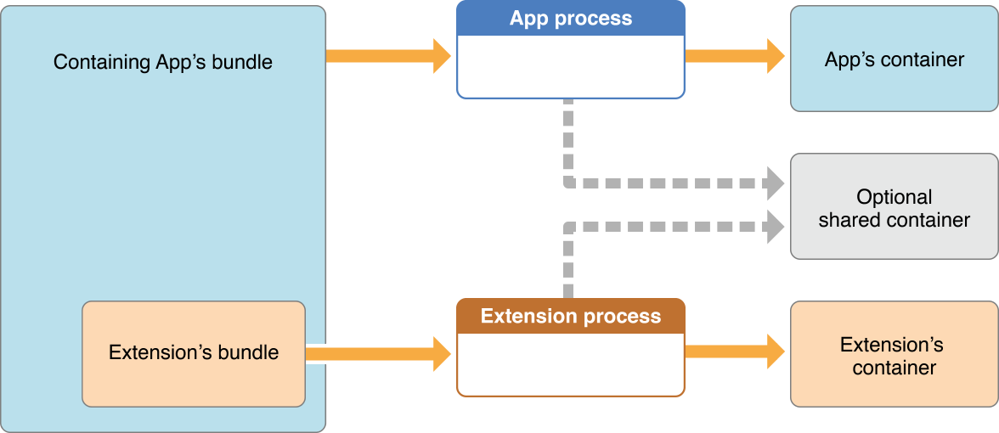

> 导航：[总目录](../../../README.md) · [documentation](../../../_indexes/documentation.md) · [App Extension Programming Guide](index.md)

## Handling Common Scenarios

As you write custom code that performs your app extension’s task, you may need to handle some scenarios that are common to many types of extensions. Use the code and recommendations in this chapter to help you implement your solutions.

### Using an Embedded Framework to Share Code

You can create an embedded framework to share code between your app extension and its containing app. For example, if you develop an image filter for use in your Photo Editing extension as well as in its containing app, put the filter’s code in a framework and embed the framework in both targets.

Make sure your embedded framework does not contain APIs unavailable to app extensions, as described in [Some APIs Are Unavailable to App Extensions](ExtensionOverview.md#apple-f4xwc4dqnrsv64tfmyxwi33df52wszbpkridimbqge2demjufvbuqmrnknltm). If you have a custom framework that does contain such APIs, you can safely link to it from your containing app but cannot share that code with the app’s contained extensions. The App Store rejects any app extension that links to such frameworks or that otherwise uses unavailable APIs.

To configure an app extension target to use an embedded framework, set the target’s “Require Only App-Extension-Safe API” build setting to Yes. If you don’t, Xcode reminds you to do so by displaying the warning _“linking against dylib not safe for use in application extensions”_.

> [!IMPORTANT]
> 

When configuring your Xcode project, you must choose “Frameworks” as the destination for your embedded framework in the Copy Files build phase.

> [!IMPORTANT]
> 

You can make a containing app available to users running iOS 7 or earlier, but then must take precautions to safely link embedded frameworks when running in iOS 8 or later. Read [Deploying a Containing App to Older Versions of iOS](#apple-f4xwc4dqnrsv64tfmyxwi33df52wszbpkridimbqge2demjufvbuqmrrfvjvomy) for details.

For more on creating and using embedded frameworks, watch the WWDC 2014 video “Building Modern Frameworks,” available at [https://developer.apple.com/videos/wwdc/2014](https://developer.apple.com/videos/wwdc/2014/#416).

### Sharing Data with Your Containing App

Even though an app extension bundle is nested within its containing app’s bundle, the running app extension and containing app have no direct access to each other’s containers.

> [!NOTE]
> 

You can, however, enable data sharing. For example, you might want to allow your app extension and its containing app to share a single large set of data, such as prerendered assets.

To enable data sharing, use Xcode or the Developer portal to enable app groups for the containing app and its contained app extensions. Next, register the app group in the portal and specify the app group to use in the containing app. To learn about working with app groups, see [Adding an App to an App Group](../../Miscellaneous/Entitlement%20Key%20Reference/Enabling%20App%20Sandbox.md#apple-f4xwc4dqnrsv64tfmyxwi33df52wszbpkridimbqgeytcojvfvbuqnbnknltcoi).

After you enable app groups, an app extension and its containing app can both use the [NSUserDefaults](https://developer.apple.com/library/archive/documentation/LegacyTechnologies/WebObjects/WebObjects_3.5/Reference/Frameworks/ObjC/Foundation/Classes/NSUserDefaults/Description.html#//apple_ref/occ/cl/NSUserDefaults) API to share access to user preferences. To enable this sharing, use the [initWithSuiteName:](https://developer.apple.com/documentation/foundation/userdefaults/1409957-init) method to instantiate a new `NSUserDefaults` object, passing in the identifier of the shared group. For example, a Share extension might update the user’s most recently used sharing account, using code like this:

1. `// Create and share access to an NSUserDefaults object`
2. `NSUserDefaults *mySharedDefaults = [[NSUserDefaults alloc] initWithSuiteName: @"com.example.domain.MyShareExtension"];`
4. `// Use the shared user defaults object to update the user's account`
5. `[mySharedDefaults setObject:theAccountName forKey:@"lastAccountName"];`

Figure 4-1shows how an extension and its containing app can use a shared container to share data.

__Figure 4-1__An app extension’s container is distinct from its containing app’s container

> [!IMPORTANT]
> 

When you set up a shared container, the containing app—and each contained app extension that you allow to participate in data sharing—have read and write access to the shared container. To avoid data corruption, you must synchronize data accesses.

Use Core Data, SQLite, or Posix locks to help coordinate data access in a shared container.

> [!NOTE]
> 

### Accessing a Webpage

In Share extensions (on both platforms) and Action extensions (iOS only), you can give users access to web content by asking Safari to run a JavaScript file and return the results to the extension. You can also use the JavaScript file to access a webpage before your extension runs (on both platforms), or to access or modify the webpage after your extension completes its task (iOS only). For example, a Share extension can help users share content from a webpage, or an Action extension in iOS might display a translation of the user’s current webpage.

To add webpage access and manipulation to your app extension, perform the following steps:

- Create a JavaScript file that includes a global object named `ExtensionPreprocessingJS`. Assign a new instance of your custom JavaScript class to this object.
- In the `NSExtensionActivationRule` dictionary in your app extension’s `Info.plist` file, give the `NSExtensionActivationSupportsWebPageWithMaxCount` key a nonzero value. (To learn more about the activation rule dictionary, see [Declaring Supported Data Types for a Share or Action Extension](#apple-f4xwc4dqnrsv64tfmyxwi33df52wszbpkridimbqge2demjufvbuqmrrfvjvooa).)
- When your app extension starts, use the [NSItemProvider](https://developer.apple.com/documentation/foundation/nsitemprovider) class to get the results returned by the execution of the JavaScript file.
- In an iOS app extension, pass values to the JavaScript file if you want Safari to modify the webpage when your extension completes its task. (You use the `NSItemProvider` class in this step, too.)

To tell Safari that your app extension includes a JavaScript file, add the `NSExtensionJavaScriptPreprocessingFile` key to the `NSExtensionAttributes` dictionary. The value of the key should be the file that you want Safari to load before your extension starts. For example:

1. `<key>NSExtensionAttributes</key>`
2. `<dict>`
3. `<key>NSExtensionJavaScriptPreprocessingFile</key>`
4. `<string>MyJavaScriptFile</string> <!-- Do not include the ".js" filename extension -->`
5. `</dict>`

On both platforms, your custom JavaScript class can define a `run()` function that Safari invokes as soon as it loads the JavaScript file. In the `run()` function, Safari provides an argument named `completionFunction`, with which you can pass results to your app extension in the form of a key-value object.

In iOS, you can also define a `finalize()` function that Safari invokes when your app extension calls `completeRequestReturningItems:completion:` at the end of its task. A `finalize()` function can use items your extension passes in `completeRequestReturningItems:completion:` to change the webpage as desired.

For example, if your iOS app extension needs the base URI of a webpage when it starts and it changes the background color of the webpage when it stops, you might write JavaScript code like that shown in Listing 4-1.

__Listing 4-1__Example `run()` and `finalize()` functions

1. `var MyExtensionJavaScriptClass = function() {};`
3. `MyExtensionJavaScriptClass.prototype = {`
4. `run: function(arguments) {`
5. `// Pass the baseURI of the webpage to the extension.`
6. `arguments.completionFunction({"baseURI": document.baseURI});`
7. `},`
9. `// Note that the finalize function is only available in iOS.`
10. `finalize: function(arguments) {`
11. `// arguments contains the value the extension provides in [NSExtensionContext completeRequestReturningItems:completion:].`
12. `// In this example, the extension provides a color as a returning item.`
13. `document.body.style.backgroundColor = arguments["bgColor"];`
14. `}`
15. `};`
17. `// The JavaScript file must contain a global object named "ExtensionPreprocessingJS".`
18. `var ExtensionPreprocessingJS = new MyExtensionJavaScriptClass;`

On both platforms, you need to write code to handle the values that get passed back from your `run()` function. To get the dictionary of results, specify the `kUTTypePropertyList` type identifier in the `NSItemProvider` method [loadItemForTypeIdentifier:options:completionHandler:](https://developer.apple.com/documentation/foundation/nsitemprovider/1403900-loaditemfortypeidentifier). In the dictionary, use the `NSExtensionJavaScriptPreprocessingResultsKey` key to get the result item. For example, to get the base URI passed in the `run()` function in [Listing 4-1](#apple-f4xwc4dqnrsv64tfmyxwi33df52wszbpkridimbqge2demjufvbuqmrrfvjvomjt), you might use code like this:

1. `[imageProvider loadItemForTypeIdentifier:kUTTypePropertyList options:nil completionHandler:^(NSDictionary *item, NSError *error) {`
2. `NSDictionary *results = (NSDictionary *)item;`
3. `NSString *baseURI = [[results objectForKey:NSExtensionJavaScriptPreprocessingResultsKey] objectForKey:@"baseURI"];`
4. `}];`

To pass a value to the `finalize()` function when your iOS app extension finishes its task, use the `NSItemProvider` `initWithItem:typeIdentifier:` method to pack the value in the dictionary for the [NSExtensionJavaScriptFinalizeArgumentKey](https://developer.apple.com/documentation/foundation/nsextensionjavascriptfinalizeargumentkey) key. For example, to specify red for the background color used in the `finalize()` function in [Listing 4-1](#apple-f4xwc4dqnrsv64tfmyxwi33df52wszbpkridimbqge2demjufvbuqmrrfvjvomjt), your extension might use code like this:

1. `NSExtensionItem *extensionItem = [[NSExtensionItem alloc] init];`
2. `extensionItem.attachments = @[[[NSItemProvider alloc] initWithItem: @{NSExtensionJavaScriptFinalizeArgumentKey: @{@"bgColor":@"red"}} typeIdentifier:(NSString *)kUTTypePropertyList]];`
3. `[[self extensionContext] completeRequestReturningItems:@[extensionItem] completion:nil];`

### Performing Uploads and Downloads

Users tend to return to the host app immediately after they finish their task in your app extension. If the task involves a potentially lengthy upload or download, you need to ensure that it can finish after your extension gets terminated. To perform an upload or download, use the [NSURLSession](https://developer.apple.com/documentation/foundation/urlsession) class to create a URL session and initiate a background upload or download task.

> [!NOTE]
> 

After your app extension initiates the upload or download task, the extension can complete the host app’s request and be terminated without affecting the outcome of the task. To learn more about how an extension handles the request from a host app, see [Respond to the Host App’s Request](ExtensionCreation.md#apple-f4xwc4dqnrsv64tfmyxwi33df52wszbpkridimbqge2demjufvbuqnjnknltg). In iOS, if your extension isn’t running when a background task completes, the system launches your containing app in the background and calls the [application:handleEventsForBackgroundURLSession:completionHandler:](https://developer.apple.com/documentation/uikit/uiapplicationdelegate/1622941-application) app delegate method.

> [!IMPORTANT]
> 

Listing 4-2 shows one way to configure a URL session and use it to initiate a download.

__Listing 4-2__An example of configuring an `NSURLSession` object and starting a download

1. `NSURLSession *mySession = [self configureMySession];`
2. `NSURL *url = [NSURL URLWithString:@"http://www.example.com/LargeFile.zip"];`
3. `NSURLSessionTask *myTask = [mySession downloadTaskWithURL:url];`
4. `[myTask resume];`
6. `- (NSURLSession *) configureMySession {`
7. `if (!mySession) {`
8. `NSURLSessionConfiguration* config = [NSURLSessionConfiguration backgroundSessionConfigurationWithIdentifier:@“com.mycompany.myapp.backgroundsession”];`
9. `// To access the shared container you set up, use the sharedContainerIdentifier property on your configuration object.`
10. `config.sharedContainerIdentifier = @“com.mycompany.myappgroupidentifier”;`
11. `mySession = [NSURLSession sessionWithConfiguration:config delegate:self delegateQueue:nil];`
12. `}`
13. `return mySession;`
14. `}`

Because only one process can use a background session at a time, you need to create a different background session for the containing app and each of its app extensions. (Each background session should have a unique identifier.) It’s recommended that your containing app only use a background session that was created by one of its extensions when the app is launched in the background to handle events for that extension. If you need to perform other network-related tasks in your containing app, create different URL sessions for them.

If you need to complete the host app’s request before you initiate a background URL session, make sure that the code that creates and uses the session is efficient. After your app extension calls [completeRequestReturningItems:completionHandler:](https://developer.apple.com/documentation/foundation/nsextensioncontext/1411301-completerequest) to tell the host app that its request is complete, the system can terminate your extension at any time.

### Declaring Supported Data Types for a Share or Action Extension

In your Share or Action extension, it’s likely that you can work with some types of data but not others. To ensure that a host app offers your extension only when the user has selected data of a type that you support, add the `NSExtensionActivationRule` key to your extension’s `Info.plist` property list file. You can also use this key to specify a maximum number of items of each type that your extension can handle.

When your extension runs, the system compares the `NSExtensionActivationRule` key’s values with the information in an extension item’s [attachments](https://developer.apple.com/documentation/foundation/nsextensionitem/1416690-attachments) property. For a complete list of keys you can use with this key, see [Action Extension Keys](../Information%20Property%20List%20Key%20Reference/App%20Extension%20Keys.md#apple-f4xwc4dqnrsv64tfmyxwi33df52wszbpkridimbqge2demjsfvjvomq).

For example, to declare that your Share extension can support up to ten images, one movie, and one webpage URL, you might use the following dictionary for the value of the `NSExtensionAttributes` key:

1. `<key>NSExtensionAttributes</key>`
2. `<dict>`
3. `<key>NSExtensionActivationRule</key>`
4. `<dict>`
5. `<key>NSExtensionActivationSupportsImageWithMaxCount</key>`
6. `<integer>10</integer>`
7. `<key>NSExtensionActivationSupportsMovieWithMaxCount</key>`
8. `<integer>1</integer>`
9. `<key>NSExtensionActivationSupportsWebURLWithMaxCount</key>`
10. `<integer>1</integer>`
11. `</dict>`
12. `</dict>`

If you don’t support a particular data type, use `0` for the value of the corresponding key or remove the key from your `NSExtensionActivationRule` dictionary.

> [!NOTE]
> 

The keys in the `NSExtensionActivationRule` dictionary are sufficient to meet the filtering needs of typical app extensions. If you need to do more complex or more specific filtering, such as distinguishing between `public.url` and `public.image`, you can create a predicate statement. Then, use the bare string that represents the predicate as the value of the `NSExtensionActivationRule` key. (At runtime, the system compiles this string into an [NSPredicate](https://developer.apple.com/documentation/foundation/nspredicate) object.)

For example, an app extension item's `attachments` property can specify a PDF file like this:

1. `{extensionItems = ({`
2. `attachments = ({`
3. `registeredTypeIdentifiers = (`
4. `"com.adobe.pdf",`
5. `"public.file-url"`
6. `);`
7. `});`
8. `})}`

To specify that your app extension can handle exactly one PDF file, you might create a predicate string like this:

1. `SUBQUERY (`
2. `extensionItems,`
3. `$extensionItem,`
4. `SUBQUERY (`
5. `$extensionItem.attachments,`
6. `$attachment,`
7. `ANY $attachment.registeredTypeIdentifiers UTI-CONFORMS-TO "com.adobe.pdf"`
8. `).@count == $extensionItem.attachments.@count`
9. `).@count == 1`

Here is an example of a more complex predicate statement:

1. `SUBQUERY (`
2. `extensionItems,`
3. `$extensionItem,`
4. `SUBQUERY (`
5. `$extensionItem.attachments,`
6. `$attachment,`
7. `ANY $attachment.registeredTypeIdentifiers UTI-CONFORMS-TO "org.appextension.action-one" ||`
8. `ANY $attachment.registeredTypeIdentifiers UTI-CONFORMS-TO "org.appextension.action-two"`
9. `).@count == $extensionItem.attachments.@count`
10. `).@count == 1`

This statement iterates over an array of [NSExtensionItem](https://developer.apple.com/documentation/foundation/nsextensionitem) objects, and secondarily over the [attachments](https://developer.apple.com/documentation/foundation/nsextensionitem/1416690-attachments) array in each extension item. For each attachment, the predicate evaluates the uniform type identifier (UTI) for each representation in the attachment. When an attachment representation UTI conforms to any of of two different specified UTIs (which you see on the right-hand side of each `UTI-CONFORMS-TO` operator), collect that UTI for the final comparison test. The final line returns `TRUE` if the app extension was given exactly one extension item attachment with a supported UTI.

During development only, you can use the `TRUEPREDICATE` constant (which always evaluates to `true`) as a stub predicate statement, to test your code path before you implement your predicate statement.

> [!IMPORTANT]
> 

To learn more about the syntax of predicate statements, see [Predicate Format String Syntax](https://developer.apple.com/library/archive/documentation/Cocoa/Conceptual/Predicates/Articles/pSyntax.html#//apple_ref/doc/uid/TP40001795) in _[Predicate Programming Guide](../../Cocoa/Predicate%20Programming%20Guide/Introduction.md#apple-f4xwc4dqnrsv64tfmyxwi33df52wszbpkridimbqgaytoobz)_.

### Deploying a Containing App to Older Versions of iOS

If you link to an embedded framework from your containing app, you can still deploy it to versions of iOS older than 8.0, even though embedded frameworks are not available in those versions.

The mechanism that lets you do this is the dlopen command, which you use to conditionally link and load a framework bundle. You employ this command as an alternative to the build-time linking you can specify in the Xcode General or Build Phases target editor. The main idea is to link embedded frameworks into your containing app only when running in iOS 8.0 or newer.

You must use Objective-C, not Swift, in your code statements that conditionally load a framework bundle. The rest of your app can be written in either language, and the embedded framework itself can likewise be written in either language.

After calling `dlopen`, access the embedded framework classes using the following type of statement:

1. `MyLoadedClass *loadedClass = [[NSClassFromString (@"MyClass") alloc] init];`

> [!IMPORTANT]
> 

__To set up an app extension Xcode project to take advantage of conditional linking__

1. For each of your contained app extensions, set the deployment target to be iOS 8.0 or later, as usual.

   Do this in the “Deployment info” section of the General tab in the Xcode target editor.
2. For your containing app, set the deployment target to be the oldest version of iOS that you want to support.
3. In your containing app, conditionalize calls to the `dlopen` command within a runtime check for the iOS version by using the [systemVersion](https://developer.apple.com/documentation/uikit/uidevice/1620043-systemversion) method.

   Call the `dlopen` command only if your containing app is running in iOS 8.0 or later. Be sure to use Objective-C, not Swift, when making this call.

Certain iOS APIs use embedded frameworks via the `dlopen` command. You must conditionalize your use of these APIs just as you do when calling `dlopen` directly. These APIs are from the [CFBundleRef](https://developer.apple.com/documentation/corefoundation/cfbundle) opaque type:

- [CFBundleGetFunctionPointerForName](https://developer.apple.com/documentation/corefoundation/1537143-cfbundlegetfunctionpointerfornam)
- [CFBundleGetFunctionPointersforNames](https://developer.apple.com/documentation/corefoundation/1537109-cfbundlegetfunctionpointersforna)

And from the [NSBundle](https://developer.apple.com/library/archive/documentation/LegacyTechnologies/WebObjects/WebObjects_3.5/Reference/Frameworks/ObjC/Foundation/Classes/NSBundle/Description.html#//apple_ref/occ/cl/NSBundle) class:

- [load](https://developer.apple.com/library/archive/documentation/LegacyTechnologies/WebObjects/WebObjects_3.5/Reference/Frameworks/ObjC/Foundation/Classes/NSBundle/Description.html#//apple_ref/occ/instm/NSBundle/load)
- [loadAndReturnError:](https://developer.apple.com/documentation/foundation/nsbundle/1411819-loadandreturnerror)
- [classNamed:](https://developer.apple.com/library/archive/documentation/LegacyTechnologies/WebObjects/WebObjects_3.5/Reference/Frameworks/ObjC/Foundation/Classes/NSBundle/Description.html#//apple_ref/occ/instm/NSBundle/classNamed:)

In a containing app you are deploying to versions of iOS older than 8.0, call these APIs only within a runtime check that ensures you are running in iOS 8.0 or newer, and call these APIs using Objective-C.

[Creating an App Extension](ExtensionCreation.md#apple-f4xwc4dqnrsv64tfmyxwi33df52wszbpkridimbqge2demjufvbuqnjnknltc)

[Action](Action.md#apple-f4xwc4dqnrsv64tfmyxwi33df52wszbpkridimbqge2demjufvbuqmjtfvjvomi)
