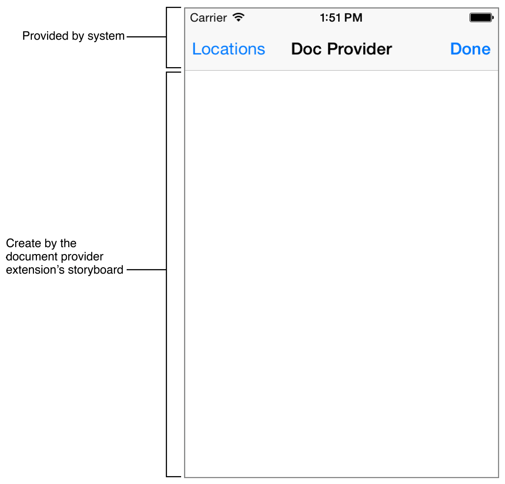

> 导航：[总目录](../../../README.md) · [documentation](../../../_indexes/documentation.md) · [App Extension Programming Guide](index.md)

## Document Provider

In iOS, consider creating a Document Provider extension for any app that remotely stores commonly used document formats. This extension (sometimes shortened here to _document provider_) allows other apps to access the documents managed by your app. Additionally, apps that are strongly associated with a specific document type may benefit from creating a document provider for their documents. Here, the document provider act as a local repository for a particular type of document, letting the user gather all those documents into one place.

Documents managed by your Document Provider extension can be accessed by any app using a document picker view controller. This combination gives users a lot of flexibility when it comes to managing and sharing their documents.

### Document Provider Extensions

The Document Provider extension acts as the interface between the files that your app manages and the other apps on the users’ devices. It lets other apps _import_ or _open_ the files, uploading and downloading them from your server as needed. Apps can also _export_ or _move_ their documents into your extension’s shared container.

The Document Provider extension consists of two separate parts: the Document Picker View Controller extension and the File Provider extension. The Document Picker View Controller extension provides your document provider’s user interface. The system displays this interface when the host app presents a document picker view controller for your document provider. This interface should let users browse through and select documents and destinations from inside your document provider. This extension can also perform basic import and export operations without any additional support.

To support open and move operations, you must also create a File Provider extension. This extension grants the host app access to files outside its sandbox. It also creates placeholders for remote files, downloads local copies when needed, and uploads any changes made by the host app.

Ideally your document provider should support all four operations, giving your users the most flexibility when it comes to working with your documents. However, producing a robust document provider with a solid user experience is a nontrivial task.

If you want only to share documents from your app, you can create a [UIDocumentPickerViewController](https://developer.apple.com/documentation/uikit/uidocumentpickerviewcontroller) object to export or move your documents. Alternatively, you can share your documents using iCloud Drive.

To opt-in to iCloud Drive support, open the Xcode capabilities pane and turn on iCloud documents. Next, open the app’s `info.plist` file. You will need to add an entry for your iCloud containers, and then define how you wish to share each container. A sample entry is shown below:

1. `<key>NSUbiquitousContainers</key>`
2. `<dict>`
3. `<key>iCloud.com.example.MyApp</key>`
4. `<dict>`
5. `<key>NSUbiquitousContainerIsDocumentScopePublic</key>`
6. `<true/>`
7. `<key>NSUbiquitousContainerSupportedFolderLevels</key>`
8. `<string>Any</string>`
9. `<key>NSUbiquitousContainerName</key>`
10. `<string>MyApp</string>`
11. `</dict>`
12. `</dict>`

These settings let iCloud Drive provide access to the files stored in your app’s iCloud container. For a detailed description of the valid keys and values, See [Cocoa Keys](https://developer.apple.com/library/archive/documentation/General/Reference/InfoPlistKeyReference/Articles/CocoaKeys.html#//apple_ref/doc/uid/TP40009251) chapter in _[Information Property List Key Reference](../Information%20Property%20List%20Key%20Reference/About%20Info.plist%20Keys%20and%20Values.md#apple-f4xwc4dqnrsv64tfmyxwi33df52wszbpkridimbqga4tenbx)_.

> [!IMPORTANT]
> 

> [!NOTE]
> 

### The Document Picker View Controller Extension

The Document Picker View Controller extension provides the user interface for import, export, open, and move operations to or from your extension’s shared container. To create a Document Picker View Controller extension (sometimes shortened here to _document picker_), subclass the [UIDocumentPickerExtensionViewController](https://developer.apple.com/documentation/uikit/uidocumentpickerextensionviewcontroller) class. Your subclass is instantiated when the user selects your document provider from a [UIDocumentMenuViewController](https://developer.apple.com/documentation/uikit/uidocumentmenuviewcontroller) object or when the host app opens your document provider directly using a [UIDocumentPickerViewController](https://developer.apple.com/documentation/uikit/uidocumentpickerviewcontroller) object.

In either case, the host app presents a document picker view controller. The system then imbeds your Document Picker View Controller extension inside the app’s view controller. The app’s view controller provides a navigation bar with the document provider’s name, a location switcher, and a Done button. Your extension must provide the rest of the user interface. [Figure 9-1](#apple-f4xwc4dqnrsv64tfmyxwi33df52wszbpkridimbqge2demjufvbuqmjyfvjvomrv) shows the relative position of these UI elements.

__Figure 9-1__Layout of the Document Picker View Controller

### The Life Cycle

1. The host app presents a [UIDocumentMenuViewController](https://developer.apple.com/documentation/uikit/uidocumentmenuviewcontroller) object.
2. The user selects your document provider from the list.
3. Your [UIDocumentPickerExtensionViewController](https://developer.apple.com/documentation/uikit/uidocumentpickerextensionviewcontroller) subclass is instantiated.
4. Your Document Picker View Controller extension’s [prepareForPresentationInMode:](https://developer.apple.com/documentation/uikit/uidocumentpickerextensionviewcontroller/1614395-prepareforpresentationinmode) method is called. The extension must present an appropriate user interface for the given mode. The open and import modes often require a different set of controls than the move or export modes. Your extension should therefore check the mode and present the correct user interface.

   The `UIDocumentPickerExtensionViewController` object acts as the root view controller for your user interface; therefore, it is often convenient to make it a container controller. You can then create a separate child view controllers for each mode, and your extension simply presents the appropriate child view controller in your `prepareForPresentationInMode:` method.
5. Your Document Picker View Controller extension is presented within the host app.
6. The user makes a selection.
7. When performing an export or move operation, your Document Picker View Controller extension must perform any required file transfers and trigger any required server updates.

   - Your Document Picker View Controller extension must copy the file to the selected location.
   - If you are not using a File Provider extension, your Document Picker View Controller extension must sync the file to your server before calling its [dismissGrantingAccessToURL:](https://developer.apple.com/documentation/uikit/uidocumentpickerextensionviewcontroller/1614391-dismissgrantingaccesstourl) method.
   - If you are using a File Provider extension and you copy the file using a file coordinator that has its purpose identifier set to your extension's provider identifier, your File Provider extension’s [itemChangedAtURL:](https://developer.apple.com/documentation/fileprovider/nsfileproviderextension/1623474-itemchanged) method is not called. Instead, your Document Picker View Controller extension must sync the file to your server before calling its [dismissGrantingAccessToURL:](https://developer.apple.com/documentation/uikit/uidocumentpickerextensionviewcontroller/1614391-dismissgrantingaccesstourl) method.

     This approach allows you to display information about the sync’s progress, its success or failure, and any appropriate error messages directly in your Document Picker View Controller extension.
   - Alternatively, if you are using a File Provider extension, and you copy the file using a default file coordinator (a file coordinator without a purpose identifier), then your File Provider extension’s [itemChangedAtURL:](https://developer.apple.com/documentation/fileprovider/nsfileproviderextension/1623474-itemchanged) method is called. The File Provider extension can sync the file to your server.

     This approach allows you to isolate all the code that interacts with your server in your File Provider extension.
8. Your Document Picker View Controller extension calls its [dismissGrantingAccessToURL:](https://developer.apple.com/documentation/uikit/uidocumentpickerextensionviewcontroller/1614391-dismissgrantingaccesstourl) method. This method dismisses the user interface and passes the provided URL back to the host app, calling the document picker delegate’s [documentPicker:didPickDocumentAtURL:](https://developer.apple.com/documentation/uikit/uidocumentpickerdelegate/1618680-documentpicker) method.
9. The `UIDocumentPickerExtensionViewController` instance is dismissed

### Creating the Document Picker View Controller Extension

To create a new Document Picker View Controller extension in Xcode, add a new target to your iOS project using the Document Picker Extension template. For detailed information, see [Creating an App Extension](ExtensionCreation.md#apple-f4xwc4dqnrsv64tfmyxwi33df52wszbpkridimbqge2demjufvbuqnjnknltc).

When creating the Document Picker View Controller extension, you have the option of creating the corresponding File Provider extension at the same time. For more information, see [Creating the File Provider Extension](#apple-f4xwc4dqnrsv64tfmyxwi33df52wszbpkridimbqge2demjufvbuqmjyfvjvooa).

The Document Picker Extension template adds a [UIDocumentPickerExtensionViewController](https://developer.apple.com/documentation/uikit/uidocumentpickerextensionviewcontroller) subclass to your project. It also adds a storyboard for your document picker’s user interface and an `info.plist` file.

### Setting the Required Property List Entries

For the system to automatically recognize and load your extension, its property list must contain the following entries:

1. `<key>NSExtension</key>`
2. `<dict>`
3. `<key>NSExtensionAttributes</key>`
4. `<dict>`
5. `<key>UIDocumentPickerModes</key>`
6. `<array>`
7. `<string>UIDocumentPickerModeImport</string>`
8. `<string>UIDocumentPickerModeOpen</string>`
9. `<string>UIDocumentPickerModeExportToService</string>`
10. `<string>UIDocumentPickerModeMoveToService</string>`
11. `</array>`
12. `<key>UIDocumentPickerSupportedFileTypes</key>`
13. `<array>`
14. `<string>public.content</string>`
15. `</array>`
16. `</dict>`
17. `<key>NSExtensionMainStoryboard</key>`
18. `<string>MainInterface</string>`
19. `<key>NSExtensionPointIdentifier</key>`
20. `<string>com.apple.fileprovider-ui</string>`
21. `</dict>`

These entries are automatically set by the Document Picker Extension template. Edit them only if you plan to change your extension’s default behavior. In particular, the `UIDocumentPickerModes` array contains entries for all the modes that your document picker supports. If you don’t plan to implement a File Provider extension, remove the entries for [UIDocumentPickerModeOpen](https://developer.apple.com/documentation/uikit/uidocumentpickermode/open) and [UIDocumentPickerModeMoveToService](https://developer.apple.com/documentation/uikit/uidocumentpickermode/movetoservice).

Similarly, if you want to create a secure drop box—where users can export files to your extension but can’t open, browse, or otherwise view them—remove all the modes except [UIDocumentPickerModeExportToService](https://developer.apple.com/documentation/uikit/uidocumentpickermode/uidocumentpickermodeexporttoservice).

The `UIDocumentPickerSupportedFileTypes` array contains a list of uniform type identifiers that your extension supports. Your extension appears as an option only when the type of files being transferred match at least one of the UTIs listed in this array. To match all document types, include both `public.content` and `public.data`.

The `NSExtensionMainStoryboard` entry holds the name of your extension’s storyboard. The storyboard’s initial view controller must be your [UIDocumentPickerExtensionViewController](https://developer.apple.com/documentation/uikit/uidocumentpickerextensionviewcontroller) subclass. You can edit this key to change how your extension instantiates its view controller and how it creates its view hierarchy.

For example, if you replace the `NSExtensionMainStoryboard` entry with an `NSExtensionPrincipalClass` key whose value is the name of your [UIDocumentPickerExtensionViewController](https://developer.apple.com/documentation/uikit/uidocumentpickerextensionviewcontroller) subclass, the extension then loads the view controller directly. This approach allows you to load your user interface from a `.xib` file, or to create your user interface programmatically.

### Subclassing UIDocumentPickerExtensionViewController

The Document Picker Extension template provides a simple [UIDocumentPickerExtensionViewController](https://developer.apple.com/documentation/uikit/uidocumentpickerextensionviewcontroller) subclass. Modify this subclass to manage your user interface and respond to user interactions, just as you would for most view controllers. Still, there are a couple of `UIDocumentPickerExtensionViewController` specific methods and properties worth noting.

- [prepareForPresentationInMode:](https://developer.apple.com/documentation/uikit/uidocumentpickerextensionviewcontroller/1614395-prepareforpresentationinmode)

  If necessary, override this method to set up any required resources. In particular, if your app uses different view hierarchies for the different modes, set up the correct view hierarchy in your implementation.
- [dismissGrantingAccessToURL:](https://developer.apple.com/documentation/uikit/uidocumentpickerextensionviewcontroller/1614391-dismissgrantingaccesstourl)

  Call this method to dismiss the document picker view controller and grant access to the provided URL. Each mode has its own requirements for the URL. For the complete details, see [Dismissing the User Interface](#apple-f4xwc4dqnrsv64tfmyxwi33df52wszbpkridimbqge2demjufvbuqmjyfvjvomy).
- [documentPickerMode](https://developer.apple.com/documentation/uikit/uidocumentpickerviewcontroller/1618681-documentpickermode)

  This read-only property returns the document picker’s mode. It is valid only after the system calls your [prepareForPresentationInMode:](https://developer.apple.com/documentation/uikit/uidocumentpickerextensionviewcontroller/1614395-prepareforpresentationinmode) method.
- [originalURL](https://developer.apple.com/documentation/uikit/uidocumentpickerextensionviewcontroller/1614392-originalurl)

  This read-only property contains the original file’s URL when in export or move mode. Otherwise it contains `nil`.
- [validTypes](https://developer.apple.com/documentation/uikit/uidocumentpickerextensionviewcontroller/1614394-validtypes)

  This read-only property contains the array of valid UTIs when in import or open mode. Otherwise it contains `nil`.
- [providerIdentifier](https://developer.apple.com/documentation/uikit/uidocumentpickerextensionviewcontroller/1614396-provideridentifier)

  This read-only property contains the value returned by your File Provider extension’s [providerIdentifier](https://developer.apple.com/documentation/uikit/uidocumentpickerextensionviewcontroller/1614396-provideridentifier) method. If you do not provide a File Provider extension, it returns `nil`.
- [documentStorageURL](https://developer.apple.com/documentation/uikit/uidocumentpickerextensionviewcontroller/1614390-documentstorageurl)

  This read-only property contains the value returned by your File Provider extension’s [documentStorageURL](https://developer.apple.com/documentation/fileprovider/nsfileproviderextension/1623476-documentstorageurl) method. If you do not provide a File Provider extension, it returns `nil`.

### Creating the User Interface

The Document Picker View Controller extension’s main purpose is to let users select files for import or open operations, and select destinations for export and move operations.

When importing or opening, your extension should create a list of all the available files and present this list to the user. Users should only be able to select files that match one of the UTIs from your [validTypes](https://developer.apple.com/documentation/uikit/uidocumentpickerextensionviewcontroller/1614394-validtypes) property. If other files are included in the list, they must be clearly marked as unavailable. You may also want to provide useful metadata about the files, including size, creation date, and whether it’s local or remote. You may even want to create and display thumbnail images of the file. For more information about working with metadata and thumbnails, see _[NSURL Class Reference](https://developer.apple.com/documentation/foundation/nsurl)_.

Your document picker can present a flat list of all the available files or it can display a complex hierarchy with directories and subdirectories. It all depends on your app’s needs. Regardless, after the user chooses a file, dismiss the user interface and pass the URL back to the host app.

For export and move operations, let the user select the destination for their file. For simple extensions, you might just provide a confirmation button. More complex extensions might let the user navigate through a hierarchy of directories and even create his or her own subdirectories. After the user has chosen a destination, dismiss the user interface.

You may also decide to handle logins, downloads, and similar tasks directly in the Document Picker View Controller extension. There are only two places where you can directly interact with the user: in the containing app and in the Document Picker View Controller extension. This means that all account management, error notifications and progress updates must be handled by one of these two components.

If you want to handle these tasks in the containing app, you can use notifications and badges to notify the user. The extensions can contact your server and request an appropriate push notification. This notification then launches the containing app in the background, letting it run in response. The containing app can also use local notifications and badges to alert the user to important events. However, the user must either select one of the notifications or open the containing app to bring it to the foreground. Therefore, this approach often requires active participation by the user, and users can miss, ignore, or even disable these notifications and badges.

Often, you can provide a better user experience by handling these tasks in the Document Picker View Controller extension directly. For more informations, see [Network-Related Tasks](#apple-f4xwc4dqnrsv64tfmyxwi33df52wszbpkridimbqge2demjufvbuqmjyfvjvomjs).

### Dismissing the User Interface

When the user makes an appropriate selection, call [dismissGrantingAccessToURL:](https://developer.apple.com/documentation/uikit/uidocumentpickerextensionviewcontroller/1614391-dismissgrantingaccesstourl) and return a properly formatted URL. The URL must meet all of the following conditions:

- __Import Document Picker mode.__ Provide a URL for the selected file. The URL must point to a local file that the Document Picker View Controller extension can access. If the user selected a remote file, your extension should download the file and save a local copy before calling the [dismissGrantingAccessToURL:](https://developer.apple.com/documentation/uikit/uidocumentpickerextensionviewcontroller/1614391-dismissgrantingaccesstourl) method. Alternatively, if you are also providing a File Provider extension, you can just provide a URL that meets the requirements for the open operation and let the file provider download it for you.
- __Open Document Picker mode.__ Provide a URL for the selected file. If the file does not yet exist at this location, your File Provider extension is called to create a placeholder or to produce the file as needed. The URL must point to a location inside the directory hierarchy referred to by your [documentStorageURL](https://developer.apple.com/documentation/uikit/uidocumentpickerextensionviewcontroller/1614390-documentstorageurl) property. This property simply calls your file provider’s [documentStorageURL](https://developer.apple.com/documentation/fileprovider/nsfileproviderextension/1623476-documentstorageurl) method and returns its value.
- __Export Document Picker mode.__ As soon as the user selects a destination, copy the file to that destination. Your extensions also need to track the file and make sure it is synced to your server.

  After the copy is complete, dismiss the user interface, providing the URL to the new copy. This URL needs to be accessible only by the Document Picker View Controller extension. The system returns the URL to the host app to indicate success; however, the host app cannot access the document at this URL.
- __Move Document Picker mode.__ As soon as the user selects a destination, copy the file to that destination. Your extensions also need to track the file and make sure it is synced to your server.

  After the copy is complete, dismiss the user interface, providing the URL to the new copy. The URL needs to be contained inside the hierarchy referred to by your [documentStorageURL](https://developer.apple.com/documentation/uikit/uidocumentpickerextensionviewcontroller/1614390-documentstorageurl) property. The system then returns the URL to the host app, and the host app can continue to access the document at this URL.

### The File Provider Extension

The File Provider extension grants access to files outside the host app’s sandbox with the open and move actions. This extension (sometimes shortened here to _file provider_) also allows the host app to download files without presenting a document picker view controller. This feature lets the host app access previously opened documents using secure URL bookmarks, even if those files are no longer stored on the device.

The File Provider extension uses placeholders to represent remote files. When the host app tries to access one of these placeholders using a coordinated read, the extension begins downloading the file. After the download is finished, the coordinated read proceeds. If the download fails, the error is propagated back to the file coordinator.

This extension also receives notifications when a file has changed, letting you upload the changes back to your remote server. It also receives notifications when the host app is no longer editing the document. At this point, your extension can delete the file and replace it with a placeholder to free up storage space.

### Creating the File Provider Extension

You can create the File Provider extension as part of the Document Picker Extension template. See [Creating the Document Picker View Controller Extension](#apple-f4xwc4dqnrsv64tfmyxwi33df52wszbpkridimbqge2demjufvbuqmjyfvjvoni). When you include the File Provider extension, the template creates a separate target for the extension. It also creates an [NSFileProviderExtension](https://developer.apple.com/documentation/fileprovider/nsfileproviderextension) subclass for this target and an `Info.plist` file with the required entries.

### Setting the Required Property List Entries

For the system to automatically recognize and load your extension, its property list must contain the following entries:

1. `<key>NSExtension</key>`
2. `<dict>`
3. `<key>NSExtensionFileProviderDocumentGroup</key>`
4. `<string>group.com.example.sharedContainerURL</string>`
5. `<key>NSExtensionPointIdentifier</key>`
6. `<string>com.apple.fileprovider-nonui</string>`
7. `<key>NSExtensionPrincipalClass</key>`
8. `<string>FileProvider</string>`
9. `</dict>`

These entries are automatically created by the Document Picker Extension template. Modify them only if you want to change the extension’s default settings.

The `NSExtensionFileProviderDocumentGroup` entry must hold the identifier for a shared container that can be accessed by both the Document Picker and the File Provider extension. This is used by the extension’s [documentStorageURL](https://developer.apple.com/documentation/fileprovider/nsfileproviderextension/1623476-documentstorageurl) method.

The `NSExtensionPrincipalClass` key must hold the name of an `NSFileProviderExtension` subclass. The system automatically instantiates this class whenever it needs to provide documents to the host app.

### Setting up the Shared Container

By default, the extension template sets up a shared container that can be accessed by both the Document Picker View Controller extension and the File Provider extension. Typically, though, you want to share this container with the containing app as well.

Open the Xcode capabilities pane and turn on the App Groups capability for your containing app. Add the identifier for the shared group. You can copy this identifier from the File Provider extension’s target.

This capability adds a `com.apple.security.application-groups` entry to the targets’ entitlements.

1. `<key>com.apple.security.application-groups</key>`
2. `<array>`
3. `<string>com.example.domain.MyFirstDocumentPickerExtension</string>`
4. `</array>`

For more information about app groups, see [Adding an App to an App Group](../../Miscellaneous/Entitlement%20Key%20Reference/Enabling%20App%20Sandbox.md#apple-f4xwc4dqnrsv64tfmyxwi33df52wszbpkridimbqgeytcojvfvbuqnbnknltcoi).

### Subclassing NSFileProviderExtension

The [NSFileProviderExtension](https://developer.apple.com/documentation/fileprovider/nsfileproviderextension) class provides a number of different methods—some that you must not override, a few that you may override, and several that you must override. These methods are described below.

### Do Not Override These Class Methods

- [writePlaceholderAtURL:withMetadata:error:](https://developer.apple.com/documentation/fileprovider/nsfileproviderextension/1623475-writeplaceholderaturl)

  Call this method whenever you need to create a placeholder. Use the [placeholderURLForURL:](https://developer.apple.com/documentation/fileprovider/nsfileproviderextension/1623477-placeholderurl) method to generate the correct URL based on the local file’s URL. The metadata that you provide depends largely on the needs of your document picker’s user interface, but the common options include file size, filename, and thumbnails.
- [placeholderURLForURL:](https://developer.apple.com/documentation/fileprovider/nsfileproviderextension/1623477-placeholderurl)

  This method maps file URLs into their corresponding placeholder URLs. You typically call this method to generate the placeholder URL before calling the [writePlaceholderAtURL:withMetadata:error:](https://developer.apple.com/documentation/fileprovider/nsfileproviderextension/1623475-writeplaceholderaturl) method.
- [providerIdentifier](https://developer.apple.com/documentation/fileprovider/nsfileproviderextension/1623473-provideridentifier)

  An identifier unique to this [NSFileProviderExtension](https://developer.apple.com/documentation/fileprovider/nsfileproviderextension) subclass. By default, this method returns the bundle identifier of the containing app.

  At least four separate processes may be trying to access the files provided by this extension at any one time; therefore, you must use file coordinators for all read and write operations.

  Both the Document Picker View Controller extension and the File Provider extension should pass the provider identifier to their file coordinator’s [purposeIdentifier](https://developer.apple.com/documentation/foundation/nsfilecoordinator/1411868-purposeidentifier) property. Sharing the purpose identifier lets the extensions coordinate with each other and prevents possible deadlocks between them.
- [documentStorageURL](https://developer.apple.com/documentation/fileprovider/nsfileproviderextension/1623476-documentstorageurl)

  The root URL for all provided documents. By default, this method returns _<container URL>_`/File Provider Storage`, where _container URL_ is the value returned by the [containerURLForSecurityApplicationGroupIdentifier:](https://developer.apple.com/documentation/foundation/nsfilemanager/1412643-containerurlforsecurityapplicati) method.

  The container URL refers to an app group container directory shared by the [UIDocumentPickerExtensionViewController](https://developer.apple.com/documentation/uikit/uidocumentpickerextensionviewcontroller) and [NSFileProviderExtension](https://developer.apple.com/documentation/fileprovider/nsfileproviderextension) extensions. You can specify this shared container using the `NSExtensionFileProviderDocumentGroup` key in the File Provider extension’s `info.plist` file.

### You May Override These Methods

The default implementation of these methods should work for most extensions; however, you may want to override them to fine-tune your extension’s behavior.

- [persistentIdentifierForItemAtURL:](https://developer.apple.com/documentation/fileprovider/nsfileproviderextension/1623479-persistentidentifierforitematurl)

  Defines a static mapping between URLs and their persistent identifiers. By default, the identifier is simply the path relative to URL returned by the [documentStorageURL](https://developer.apple.com/documentation/fileprovider/nsfileproviderextension/1623476-documentstorageurl) method. You can override the [persistentIdentifierForItemAtURL:](https://developer.apple.com/documentation/fileprovider/nsfileproviderextension/1623479-persistentidentifierforitematurl) method to provide a different mapping.
- [URLForItemWithPersistentIdentifier:](https://developer.apple.com/documentation/fileprovider/nsfileproviderextension/1623481-urlforitemwithpersistentidentifi)

  This is the inverse of the [persistentIdentifierForItemAtURL:](https://developer.apple.com/documentation/fileprovider/nsfileproviderextension/1623479-persistentidentifierforitematurl) method. It provides a URL for the given identifier.

### You Must Override These Methods

You must override these methods, even if you provide only an empty method. Do not call `super` in your implementations.

- [providePlaceholderAtURL:completionHandler:](https://developer.apple.com/documentation/fileprovider/nsfileproviderextension/1623483-provideplaceholderaturl)

  The system calls this method when the file is accessed. Both the [providePlaceholderAtURL:completionHandler:](https://developer.apple.com/documentation/fileprovider/nsfileproviderextension/1623483-provideplaceholderaturl) and [startProvidingItemAtURL:completionHandler:](https://developer.apple.com/documentation/fileprovider/nsfileproviderextension/1623482-startprovidingitematurl) methods may be triggered as the user interacts with the document picker view controller or with a coordinated read.

  Exactly which methods get triggered, and what their sequence is, depend on the intent of the access. For example, a coordinated read using the [NSFileCoordinatorReadingImmediatelyAvailableMetadataOnly](https://developer.apple.com/documentation/foundation/nsfilecoordinator/readingoptions/1411727-immediatelyavailablemetadataonly) option just triggers the creation of a placeholder. As a result, your extension should not create any dependencies between these methods. They may be called any order.
- [startProvidingItemAtURL:completionHandler:](https://developer.apple.com/documentation/fileprovider/nsfileproviderextension/1623482-startprovidingitematurl)

  When this method is called, your extension should begin to download, create, or otherwise make a local file ready for use. As soon as the file is available, call the provided completion handler. If any errors occur during this process, pass the error to the completion handler. The system then passes the error back to the original coordinated read.
- [itemChangedAtURL:](https://developer.apple.com/documentation/fileprovider/nsfileproviderextension/1623474-itemchanged)

  The system calls this method after the host app completes a coordinated write. You can override this method to upload the changes back to your server or to otherwise respond to the change.
- [stopProvidingItemAtURL:](https://developer.apple.com/documentation/fileprovider/nsfileproviderextension/1623480-stopprovidingitematurl)

  The system calls this method as soon as no processes are accessing the provided URL. You can override this method to remove the document from the local file system, freeing up storage space.

> [!NOTE]
> 

### Network-Related Tasks

Even with simple document-provider tasks, networking introduces uncertainty and, often, problems. You must contend with unreliable and slow networks, server errors, and even file-system errors. Your Document Provider extension must carefully and gracefully handle these complications.

The environment within which your app extension runs can also be complicated because multiple processes can access the files you provide. In all cases, your extension must effectively communicate progress and errors back to the user.

Remember that your Document Provider extension can impact the user experience in every host app with a document picker view controller. Therefore, you want to provide a solid, polished, and reliable user experience.

### File Coordination

> [!IMPORTANT]
> 

Because multiple processes can access the files managed by your file provider, use file coordination to perform all read and write operations. This guideline applies to the containing app, the Document Picker View Controller extension, the File Provider extension, and the host app.

For the document picker and file provider, you must also set the file coordinator’s purpose identifier. Both extensions provide a `providerIdentifier` method. You pass this method’s return value to the file coordinator’s [purposeIdentifier](https://developer.apple.com/documentation/foundation/nsfilecoordinator/1411868-purposeidentifier) property before performing your coordinated read or write. By sharing a purpose identifier, the two app extensions can coordinate with each other, preventing any possible deadlocks between them.

File coordination plays a number of important roles. First and foremost, it guarantees that each process can safely read and write to the provided files. However, because file coordination can also act as triggers for a number of other actions, coordinated reads may cause the creation of placeholders or the downloading of files from a remote server. Coordinated writes may likewise trigger an upload back to the remote server. Finally, file coordinators permit the propagation of error messages across process boundaries.

### Downloading Files

Because downloading is inherently unpredictable, provide useful feedback wherever possible. For example, let the user know which files are local and which are remote. Let them know when files are downloading, and display the download’s progress. Finally, present meaningful error messages when problems occur.

Because you have access to the user interface only from the containing app and from the Document Picker View Controller extension, you may want to provide a user interface to download files directly in the document picker. Downloading files in the document picker has several advantages over downloading files in the file provider.

- You can display the file’s size, setting the user’s expectation for how long the download might take.
- You can display the progress during the download.
- You have full control over how errors are handled.

However, downloading data from the document picker presents its own set of problems. If the user dismisses the document picker view controller, the system may terminate your app extension.

You can use an [NSURLSession](https://developer.apple.com/documentation/foundation/urlsession) background transfer to download the files, but be sure to set the [NSURLSessionConfiguration](https://developer.apple.com/documentation/foundation/nsurlsessionconfiguration) object’s [sharedContainerIdentifier](https://developer.apple.com/documentation/foundation/nsurlsessionconfiguration/1409450-sharedcontaineridentifier) property to a container shared by the app extension and the containing app. This ensures that the results can be accessed by either the extension or the containing app, as necessary.

Background transfers perform the download in a separate process, and the download continues even if your document picker is terminated. If your document picker is not running when the download completes, the system launches your containing app in the background and calls its [application:handleEventsForBackgroundURLSession:completionHandler:](https://developer.apple.com/documentation/uikit/uiapplicationdelegate/1622941-application) method.

Your containing app can use local notifications and badges to alert the user. If the user reopens the document picker before the download completes, you can reconnect with your background transfers, presenting the current status to the user, and handling the download’s completion directly.

Even if you download documents from within the Document Picker View Controller extension, you still need to support downloading from the file provider’s [startProvidingItemAtURL:completionHandler:](https://developer.apple.com/documentation/fileprovider/nsfileproviderextension/1623482-startprovidingitematurl) method. The host app may not always access your documents through a document picker view controller. Any time the user opens a file, the host app can save a security-scoped bookmark for that file. This bookmark lets the host app open that file directly. However, if the file provider has already deleted the local copy to free up storage space, it must now download a new copy.

When downloading files in the File Provider extension, you do not have access to the user interface. If an error occurs, you cannot display a message directly. Instead, you pass an [NSError](https://developer.apple.com/documentation/foundation/nserror) object to the [startProvidingItemAtURL:completionHandler:](https://developer.apple.com/documentation/fileprovider/nsfileproviderextension/1623482-startprovidingitematurl) method's completion handler. The system then passes this error back to the host app’s coordinated read.

There is also no way to report the download’s progress back to the user. The coordinated read that triggered the download won’t run until after the download is complete. If not handled properly, the download can lead to unexpected delays for the user.

This means that you may want to carefully balance the desire to conserve storage space with the desire to avoid unnecessary downloads. If your extension is overeager about replacing files with placeholders in the File Provider extension’s [stopProvidingItemAtURL:](https://developer.apple.com/documentation/fileprovider/nsfileproviderextension/1623480-stopprovidingitematurl) method, your users may be surprised when an app suddenly needs to redownload a file they were just working on. Also, if you know your user will want a given file, you may want to preemptively download it to the shared container from your containing app. This makes the file instantly available when the user asks for it.

### Detecting and Communicating Conflicts

Whenever a user can modify a file on multiple devices, conflicts become inevitable. Therefore be prepared to both detect and handle conflicts when they occur. For example, when your containing app or File Provider extension downloads an updated version of a file, you must check and see if the updated file conflicts with any local changes. Similarly, whenever you upload local changes back to the server, the server must be able to detect and handle any conflicts it might find.

There is no way to directly alert the host app about these conflicts. Instead, your extension should contact your server. You can either upload the local changes back to your server and handle the conflict there, or the server can send a push notification to the containing app, letting the app handle the conflict.

### Logging In and Out

Think carefully about how your Document Picker View Controller extension is going to log users into and out of your service.

You typically prompt the user to log in when your Document Picker View Controller extension is first displayed. However, you also want to save your user’s credentials. As described earlier, the File Provider extension may need to download or upload files without going through the document picker view controller. Therefore, it also needs access to your user’s credentials.

Save the user credentials in a shared keychain using a Keychain Access group. In the Xcode capabilities pane, turn on keychain sharing for the containing app and its extensions. Be sure to use the same group identifier for all three targets. Then, when you create a shared keychain item, include the `kSecAttrAccessGroup` key in the item’s attributes dictionary. The value of this key must be your shared identifier.

For more information on saving data to the keychain, see iOS Keychain Services Tasks.

When a user logs out, delete their login credentials and remove any placeholders to documents that they can no longer access. You may also want to remove all the local copies of files stored on the server. In general, users shouldn’t be able to access those files until they log back in.

[Custom Keyboard](CustomKeyboard.md#apple-f4xwc4dqnrsv64tfmyxwi33df52wszbpkridimbqge2demjufvbuqmjwfvjvomi)

[Finder Sync](Finder.md#apple-f4xwc4dqnrsv64tfmyxwi33df52wszbpkridimbqge2demjufvbuqmjvfvjvomi)
