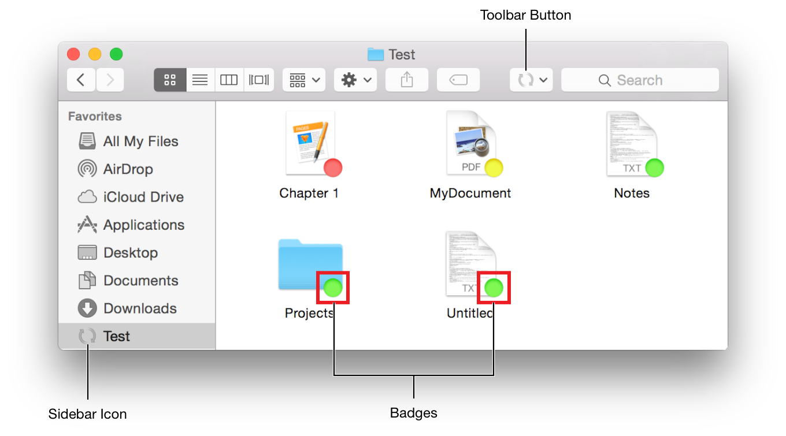
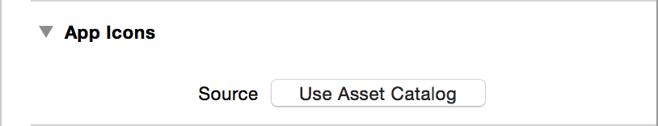

> 导航：[总目录](../../../README.md) · [documentation](../../../_indexes/documentation.md) · [App Extension Programming Guide](index.md)

## Finder Sync

In OS X, the Finder Sync extension point lets you cleanly and safely modify the Finder’s user interface to express file synchronization status and control. Unlike most extension points, Finder Sync does not add features to a host app. Instead, it lets you modify the behavior of the Finder itself.

### Finder Sync Extensions

With a Finder Sync extension you register one or more folders for the system to monitor. Your Finder Sync extension then sets badges, labels, and contextual menus for any items in the monitored folders. You can also use the extension point’s API to add a toolbar button to the Finder window or a sidebar icon for the monitored folder.

Finder Sync supports apps that synchronize the contents of a local folder with a remote data source. It improves user experience by providing immediate visual feedback directly in the Finder. Badges display the sync state of each item, and contextual menus let users manage folder contents. Custom toolbar buttons can invoke global actions, such as opening a monitored folder or forcing a sync operation.

> [!NOTE]
> 

A Finder Sync extension can:

- Register a set of folders to monitor.
- Receive notifications when the user starts or stops browsing the content of a monitored folder.

  For example, the extension receives notification when the user opens a monitored folder in the Finder or in an Open or Save dialog.
- Add, remove, and update badges and labels on items in a monitored folder.
- Display a contextual menu when the user Control-clicks an item inside a monitored folder.
- Add a custom button to the Finder’s toolbar.

  Unlike badges and contextual menu items, this button is always available, even when the user is not currently browsing a monitored folder.

> [!NOTE]
> 

### Creating a Finder Sync Extension in Xcode

To create a Finder Sync extension, add a new target to your OS X project using the Finder Sync Extension template. This template contains a custom subclass of the [FIFinderSync](https://developer.apple.com/documentation/findersync/1501586-fifindersync) class. This subclass acts as your extension’s primary class. The system automatically instantiates this class and calls the protocol methods in response to user actions.

For detailed information on adding extensions, see [Creating an App Extension](ExtensionCreation.md#apple-f4xwc4dqnrsv64tfmyxwi33df52wszbpkridimbqge2demjufvbuqnjnknltc).

### Set the Required Property List Values

For OS X to recognize and automatically load the Finder Sync extension, the extension target’s `info.plist` file must contain the following entries:

1. `<key>NSExtension</key>`
2. `<dict>`
3. `<key>NSExtensionAttributes</key>`
4. `<dict/>`
5. `<key>NSExtensionPointIdentifier</key>`
6. `<string>com.apple.FinderSync</string>`
7. `<key>NSExtensionPrincipalClass</key>`
8. `<string>$(PRODUCT_MODULE_NAME).FinderSync</string>`
9. `</dict>`

In particular, the `NSExtensionPrincipalClass` key must provide the name of your [FIFinderSync](https://developer.apple.com/documentation/findersync/1501586-fifindersync) subclass. The system automatically instantiates this class when the Finder first launches. It instantiates an additional copy whenever an Open or Save dialog is displayed. Each copy runs in its own process.

The Finder Sync Extension Xcode template configures these `Info.plist` keys automatically. If you want to change the principal class, modify the value of the `NSExtensionPrincipalClass` key.

### Specify Which Folders to Monitor

You specify the folders you want to monitor in your Finder Sync extension’s `init` method, using the default [FIFinderSyncController](https://developer.apple.com/documentation/findersync/fifindersynccontroller) object. In most cases, you want to let the user specify these folders in UI provided by the containing app. You can pass this data between the containing app and your Finder Sync extension using shared user defaults.

To enable shared user defaults, first add both your Finder Sync extension and its containing app to an app group. This group creates a shared container that both processes can access. For each target, open the Xcode capabilities pane and turn on the App Groups capability. Provide a unique identifier for the shared group. Be sure to use the same identifier for both the Finder Sync extension and the containing app.

This process adds a `com.apple.security.application-groups` entry to the targets’ entitlements.

1. `<key>com.apple.security.application-groups</key>`
2. `<array>`
3. `<string>com.example.domain.MyFirstFinderSyncApp</string>`
4. `</array>`

For more information about app groups, see [Adding an App to an App Group](../../Miscellaneous/Entitlement%20Key%20Reference/Enabling%20App%20Sandbox.md#apple-f4xwc4dqnrsv64tfmyxwi33df52wszbpkridimbqgeytcojvfvbuqnbnknltcoi).

Next, instantiate a new [NSUserDefaults](https://developer.apple.com/library/archive/documentation/LegacyTechnologies/WebObjects/WebObjects_3.5/Reference/Frameworks/ObjC/Foundation/Classes/NSUserDefaults/Description.html#//apple_ref/occ/cl/NSUserDefaults) object by calling `initWithSuiteName:` and passing in the shared group’s identifier. This `init` method creates a user default object that loads and saves data to the shared container.

1. `// Set up the folder we are syncing.`
2. `NSUserDefaults *sharedDefaults =`
3. `[[NSUserDefaults alloc] initWithSuiteName:@"com.example.domain.MyFirstFinderSyncExtension"];`
5. `self.myFolderURL = [sharedDefaults URLForKey:MyFolderKey];`
7. `if (self.myFolderURL == nil) {`
8. `self.myFolderURL = [NSURL fileURLWithPath:[@"~/Documents/MyFirstFinderSyncExtension Documents" stringByExpandingTildeInPath]];;`
9. `}`
11. `[FIFinderSyncController defaultController].folderURLs = [NSSet setWithObject:self.myFolderURL];`

### Set Up Badge Images

Create your badge images so that each can be drawn at up to 320x320 pixels. For each image, fill the entire frame edge-to-edge with your artwork (in other words, use no padding). The system determines the size and placement of a badge image on a monitored item. The pixel size ranges at which your badge might be displayed are as follows:

- __Retina screens__ 12x12 through 320x320
- __Nonretina screens__ 8x8 through 160x160

To add a badge image to your Finder Sync controller’s configuration, use the `setBadgeImage:label:forBadgeIdentifier:` method, as shown here:

1. `[[FIFinderSyncController defaultController]`
2. `setBadgeImage: uploadedImage`
3. `label: NSLocalizedString(@"Uploaded", nil)`
4. `forBadgeIdentifier: @"UploadComplete"];`

You would typically do this in the sync controller’s initialization method. You can set up as many badge images as you need. The badge identifier string that you specify here allows you to later retrieve the image for applying it to a monitored item, as described in [A Typical Finder Sync Use Case](#apple-f4xwc4dqnrsv64tfmyxwi33df52wszbpkridimbqge2demjufvbuqmjvfvjvomjq).

### Implement FIFinderSync methods

The [FIFinderSync](https://developer.apple.com/documentation/findersync/1501586-fifindersync) protocol declares a number of methods that you can implement to monitor and control the Finder. These methods let you receive notifications when the user observes monitored items, add contextual menus to monitored items, and add custom toolbar and sidebar icons.

### Receiving Notifications When Users Observe Monitored Items

Implement these methods to receive notifications as the user browses through the contents of the monitored folders.

- [beginObservingDirectoryAtURL:](https://developer.apple.com/documentation/findersync/fifindersyncprotocol/1501578-beginobservingdirectory)

  The system calls this method when the user begins looking at the contents of a monitored folder or one of its subfolders. It passes the URL of the currently open folder as an argument.

  The system calls `beginObservingDirectoryAtURL:` only once for each unique URL. As long as the content remains visible in at least one Finder window, any additional Finder windows that open to the same URL are ignored.

  > [!NOTE]
  > 
- [endObservingDirectoryAtURL:](https://developer.apple.com/documentation/findersync/1501586-fifindersync/1501582-endobservingdirectoryaturl)

  The system calls this method when the user is no longer looking at the contents of the given URL. As with `beginObservingDirectoryAtURL:`, the Open and Save dialogs are tracked separately from the Finder.
- [requestBadgeIdentifierForURL:](https://developer.apple.com/documentation/findersync/fifindersyncprotocol/1501589-requestbadgeidentifier)

  The system calls this method when a new item inside the monitored folder becomes visible to the user. This method is called once for each file initially shown in the Finder’s view. The system continues to call this method as each new file scrolls into view.

  You typically implement this method to check the state of the item at the provided URL, and then call the Finder Sync controller’s `setBadgeIdentifier:forURL:` method to set the appropriate badge. You might also want to track these URLs, in order to update their badges whenever their state changes.

### Adding Contextual Menu Items

Implement the [menuForMenuKind:](https://developer.apple.com/documentation/findersync/fifindersyncprotocol/1501585-menu) method to provide a custom contextual menu. The `menu` argument indicates the type of menu that your extension should create. Each menu kind corresponds to a different type of user interaction.

- `FIMenuKindContextualMenuForItems`

  The user Control-clicked one or more items inside your monitored folder. Your extension should present menu items that affect the selected items.
- `FIMenuKindContextualMenuForContainer`

  The user Control-clicked the Finder window’s background while browsing the monitored folder. Your extension should present menu items that affect the contents of the current folder.
- `FIMenuKindContextualMenuForSidebar`

  The user Control-clicked a sidebar item that represents the monitored folder or part of its contents. Your extension should present menu items that effect the contents of the selected item.
- `FIMenuKindToolbarItemMenu`

  The user clicked on the toolbar button provided by the extension. Because the toolbar button is always available, the user may or may not be browsing the monitored folder at this time. Your extension may present menu items that represent global actions that should always be available to the user. It can also present menu items that affect selected items inside your monitored folder, if any exist.

You can get additional information about the currently selected items using the Finder Sync controller’s [targetedURL](https://developer.apple.com/documentation/findersync/fifindersynccontroller/1501595-targetedurl) and [selectedItemURLs](https://developer.apple.com/documentation/findersync/fifindersynccontroller/1501575-selecteditemurls) methods. The `targetedURL` method returns the URL of the file or folder that the user Control-clicked. The `selectedItemURLs` method returns an array containing the URLs of all the currently selected items in the Finder window.

`targetedURL` and `selectedItemURLs` return valid values only inside the `menuForMenuKind:` method or inside one of its menu actions. If the user is not browsing the monitored folder (for example, if the user clicked the toolbar button while outside the monitored folder), both of these methods return `nil`.

### Adding a Custom Toolbar Button

To add a custom toolbar button to the Finder window, implement the getter methods for the following properties:

- [toolbarItemName](https://developer.apple.com/documentation/findersync/1501586-fifindersync/1501574-toolbaritemname)—Return the button’s name
- [toolbarItemImage](https://developer.apple.com/documentation/findersync/1501586-fifindersync/1501580-toolbaritemimage)—Return the button’s image
- [toolbarItemToolTip](https://developer.apple.com/documentation/findersync/fifindersyncprotocol/1501590-toolbaritemtooltip)—Return the tooltip text for the button

When the user clicks the toolbar button, the system calls your primary class’s [menuForMenuKind:](https://developer.apple.com/documentation/findersync/fifindersyncprotocol/1501585-menu) method, passing `FIMenuKindToolbarItemMenu` as the menu kind. Your extension must return an appropriate menu. The system then displays this menu.

### Adding a Sidebar Icon

You can provide a custom sidebar icon for any of the root folders your extension is monitoring. If the user drags one of these root folders into the Finder’s sidebar, your icon will be displayed instead of the default folder icon.

To provide a custom sidebar icon, add the icons to your containing app. For this to work, both your app’s icons and the sidebar icons must be included in an inconset. If you are using an asset catalog to manage your app’s icons, you will need to switch to an iconset.

__To create an iconset__

1. Create an iconset folder. This must be a folder named _<folder name>_`.iconset`. You can pick any name you want for the folder name, but it must end with the `.iconset` extension.
2. Create a complete set of app icons. Your icons must use the following filenames and image sizes:

| Filename | Image size |
| --- | --- |
| icon_16x16.png | 16 x 16 px |
| icon_16x16@2x.png | 32 x 32 px |
| icon_32x32.png | 32 x 32 px |
| icon_32x32@2x.png | 64 x 64 px |
| icon_128x128.png | 128 x 128 px |
| icon_128x128@2x.png | 256 x 256 px |
| icon_256x256.png | 256 x 256 px |
| icon_256x256@2x.png | 512 x 512 px |
| icon_512x512.png | 512 x 512 px |
| icon_512x512@2x.png | 1024 x 1024 px |

   Place these icons in your iconset folder. For more information on creating app icons, see Designing App Icons in _macOS Human Interface Guidelines_.
3. Create a complete set of sidebar icons. These icons must be template images—monochromatic images that are drawn just using black and transparency. The icons must use the following filenames and sizes:

| File Name | Image Size |
| --- | --- |
| sidebar_16x16.png | 16 x 16 px |
| sidebar_16x16@2x.png | 32 x 32 px |
| sidebar_18x18.png | 32 x 32 px |
| sidebar_18x18@2x.png | 64 x 64 px |
| sidebar_32x32.png | 128 x 128 px |
| sidebar_32x32@2x.png | 256 x 256 px |

   Place these icons in your iconset folder. For more information on creating template images, see Create Template Images to Put Inside Toolbar Controls in _macOS Human Interface Guidelines_.
4. Add the iconset folder to your Xcode project. Make sure it is included in the containing app’s target.
5. Open the containing app’s `info.plist`. Add an entry for the Icon File (`CFBundleIconFile`). The value should be the name of your iconset folder (everything before the `.iconset` extension).
6. In the containing app’s general pane, make sure the App Icons source is not using an asset catalog. If the asset catalog has been turned off, the source will display a button saying “Use Asset Catalog” (see Figure 10-1). If the app icon’s source setting displays a popup button, click the button and select “Don’t use asset catalogs.”

   __Figure 10-1__A target with no asset catalog set.
   

> [!NOTE]
> 

### A Typical Finder Sync Use Case

This section presents a typical use case. Your app manages and badges all the items inside the monitored folder. Because the user can populate the monitored folder with an arbitrary number of subfolders and files, the list of monitored items could grow to be very large. You must therefore consider the performance implications of adding and updating all of these badges. Specifically, avoid adding or updating the badge of any item that is not currently visible.

When dealing with a potentially large number of items, always provide the badges on demand. Provide badges to items only as they appear in the Finder window, and record all the URLs for the badges you set, so that you can update them as necessary.

1. The system calls [beginObservingDirectoryAtURL:](https://developer.apple.com/documentation/findersync/fifindersyncprotocol/1501578-beginobservingdirectory) when the user first opens the monitored folder or one of its subfolders.
2. The system calls [requestBadgeIdentifierForURL:](https://developer.apple.com/documentation/findersync/fifindersyncprotocol/1501589-requestbadgeidentifier) for each item that is currently being drawn onscreen. Inside this method, do the following:

   1. Check the state of the item and set its badge by calling [setBadgeIdentifier:forURL:](https://developer.apple.com/documentation/findersync/fifindersynccontroller/1501577-setbadgeidentifier).

      Your app is responsible for defining the states and their corresponding badges. For example, a typical syncing app might have badges that indicate unsynced local changes, syncing operations in progress, successfully synced items, and items with syncing errors or conflicts.
   2. Record the URL of every item that has received a badge.

      Your app must to continue to monitor the state of these items and update their badges as necessary. When an item’s state changes, update its badge by calling [setBadgeIdentifier:forURL:](https://developer.apple.com/documentation/findersync/fifindersynccontroller/1501577-setbadgeidentifier).
3. The system calls [endObservingDirectoryAtURL:](https://developer.apple.com/documentation/findersync/1501586-fifindersync/1501582-endobservingdirectoryaturl) when the user closes the folder. Delete all the URLs for the badged items inside that folder and stop monitoring their state.

### Performance Concerns

Finder Sync extensions may have a much longer lifespan than most other extensions. Because of this long lifespan, you must take particular care to avoid any possible performance issues. Ideally, Finder Sync extensions should spend most of their time running but idle. Limit the number of resources the extension consumes. Most important, be sure to avoid leaking any resources. Over time, even a small trickle can grow into a serious problem.

The system may also launch additional copies of your extension whenever an Open or Save dialog is displayed. This means that the user may have multiple copies of your extension running at once, and some may be very short lived. Therefore, it’s generally best if the extension focuses on handling the badges, contextual menus, and toolbar buttons. Place in a separate service (a Login Item or Launch Agent) any code that performs the sync, updates state, or communicates with remote data sources. This approach ensures that there is only one syncing service running at a time.

For more information about communicating with the login item or launchd agent, see [Using the Objective-C NSXPCConnection API](../../Mac%20OSX/Daemons%20and%20Services%20Programming%20Guide/Creating%20XPC%20Services.md#apple-f4xwc4dqnrsv64tfmyxwi33df52wszbpgeydambqge3te2jnknltmlktk4yts) in _[Daemons and Services Programming Guide](../../Mac%20OSX/Daemons%20and%20Services%20Programming%20Guide/About%20Daemons%20and%20Services.md#apple-f4xwc4dqnrsv64tfmyxwi33df52wszbpgeydambqge3te2i)_.

[Document Provider](FileProvider.md#apple-f4xwc4dqnrsv64tfmyxwi33df52wszbpkridimbqge2demjufvbuqmjyfvjvomi)

[Photo Editing](Photos.md#apple-f4xwc4dqnrsv64tfmyxwi33df52wszbpkridimbqge2demjufvbuqmjxfvjvomi)
