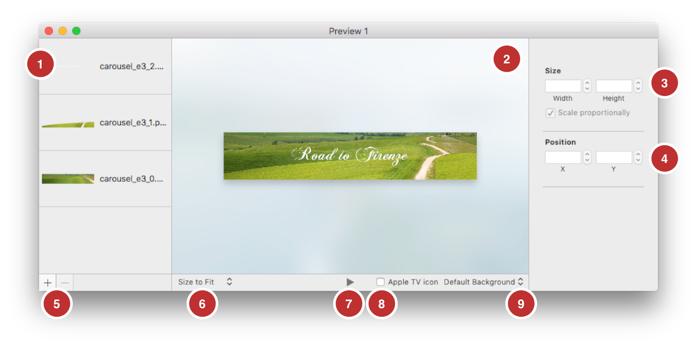
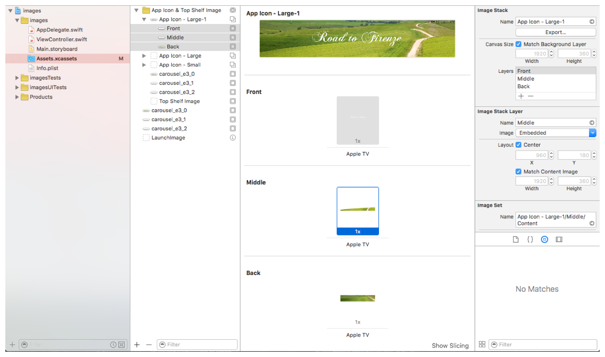

> 导航：[总目录](../../../README.md) · [documentation](../../../_indexes/documentation.md) · [App Programming Guide for tvOS](index.md)

## Creating Layered Images

Layered images are required for app icons and optional for other focusable UI elements. If your interface uses UIKit views and the focus API, UI elements that specify the appropriate layers automatically get the parallax effect treatment when they’re in focus. Focusable UI elements should contain a layered image.

> [!IMPORTANT]
> 

At runtime, UIKit understands two different formats that include layered effects. It can read layered images either from asset catalogs or a new layered image file format (`.lsr`). These formats are supported throughout the system in places where other image formats are supported. For example, achievement images in Game Center are parallax images. Create and export `.lsr` files using Xcode or the Parallax Previewer app.

### Creating LSR Images with the Parallax Previewer App

[Download](http://itunespartner.apple.com/assets/downloads/Parallax%20Previewer.dmg) the previewer app to create and preview `.lsr` images. Figure 7-1 shows the Parallax Previewer app. It has the following sections:

1. Layered image area. Contains each layer that makes up the image.
2. Viewing area. Combines and displays the layers.
3. View size. Changes the size of the image for viewing purposes only.
4. Position area. Adjusts the position of the selected image layer.
5. Plus and minus icons. Adds or deletes an image layer.
6. Size area. Adjusts the size of the selected image layer.
7. Play button. Animates the image to show the parallax effect.
8. Apple TV icon checkbox. Check to add the Apple TV icon shadow effect.
9. Background. Click to change the background for the viewing area.

__Figure 7-1__Parallax Previewer app

To create an `.lsr` image:

1. Import a separate `.png` or `.jpeg` file for each layer in the image.
2. Adjust the size and positioning of the layers as appropriate.
3. Click File -> Export -> LSR to create a new LSR file.

### Creating LSR Images Within Xcode

In Xcode, drag existing `.png` files into your app’s asset catalog to create an image stack. Each `.png` file represents a different layer for a layered image. To export a layered image in `.lsr` format, click the Export button in the upper right corner of the Xcode window. Figure 7-2 shows an app icon image.

__Figure 7-2__Xcode parallax image creation

You can also drag existing `.lsr` files directly into your asset catalog and they will be included in your app bundle. When the project is compiled, the image stacks and `.lsr` images in your asset catalogs are transformed into the `.car` file format and bundled with your app.

### Creating an LCR Image

Xcode uses `.lsr` files or asset catalogs to specify layered image files. These files are processed and included in the app bundle. If you want to load an arbitrary file that is not stored in the app bundle (or on-demand resources), then you need to process it manually into an `.lcr` file. Use the `layerutil` command-line tool included with Xcode to create `.lcr` images. The `layerutil` tool converts `.lsr` files into `.lcr` files.

Open the Terminal and use the following command to create a new `.lcr` image.

`xcrun —-sdk appletvos layerutil —-c <filename.lsr>`

The resulting `.lcr` image will have the same name as the LSR file. You can use the `—-o <new_filename.lcr>` option to create an `.lcr` file with a different basename.

### Incorporating Layered Images

To incorporate layered images in your app:

1. Create a [UIImage](https://developer.apple.com/documentation/uikit/uiimage) object.
2. You load the image differently depending on whether the image is included in your app bundle or whether you have downloaded the image.

   1. Bundle—Load images using [imageNamed:](https://developer.apple.com/documentation/uikit/uiimage/1624146-imagenamed).
   2. Downloaded file—Load images using [imageWithContentsOfFile:](https://developer.apple.com/documentation/uikit/uiimage/1624123-imagewithcontentsoffile).
3. Create a new UIImageView object using the loaded images.
4. If the [UIImageView](https://developer.apple.com/documentation/uikit/uiimageview) is part of another view, set [adjustsImageWhenAncestorFocused](https://developer.apple.com/documentation/uikit/uiimageview/1627692-adjustsimagewhenancestorfocused) to `YES``true` on the [UIImageView](https://developer.apple.com/documentation/uikit/uiimageview).

When the view comes into focus, the layered images will display correctly.

[Working with Game Controllers](WorkingwithGameControllers.md#apple-f4xwc4dqnrsv64tfmyxwi33df52wszbpkridimbqge2tenbrfvbuqmjyfvjvomi)

[iCloud Storage](iCloudStorage.md#apple-f4xwc4dqnrsv64tfmyxwi33df52wszbpkridimbqge2tenbrfvbuqmjqfvjvomi)
