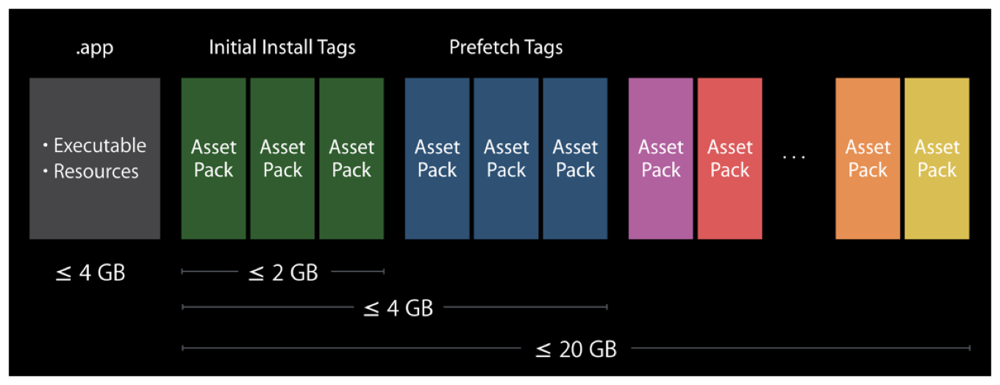

> 导航：[总目录](../../../README.md) · [documentation](../../../_indexes/documentation.md) · [App Programming Guide for tvOS](index.md)

## On-Demand Resources

_On-demand resources_ are app contents that are hosted on the App Store and are separate from the related app bundle that you download. They enable smaller app bundles, faster downloads, and richer app content. The app requests sets of on-demand resources, and the operating system manages downloading and storage. The app uses the resources, and then releases the request. After downloading, the resources may stay on the device through multiple launch cycles, making access even faster.

The maximum size for a tvOS app bundle is 4 GB. However, using tags and on-demand resources, your app can add another 20 GB of resources to a running app. This provides a maximum app size of 24 GB. In Xcode, create tags and attach them to the required resources. When your app requests the resources associated with a tag, the operating system downloads only the required assets. You must wait until the assets are downloaded before you can use them in your app. Figure 9-1 shows the different memory allowances for a tvOS app.

__Figure 9-1__tvOS memory limits

Assets should be grouped into manageable groups; for example, putting all of the assets for the fifth game level of an app into one tag. Make sure to present a UI telling the user that assets are being downloaded. Test your app to find the right downloadable file size for you app. For more information on how to implement on-demand resources, see _[On-Demand Resources Guide](https://developer.apple.com/library/archive/documentation/FileManagement/Conceptual/On_Demand_Resources_Guide/index.html#//apple_ref/doc/uid/TP40015083)_.

[iCloud Storage](iCloudStorage.md#apple-f4xwc4dqnrsv64tfmyxwi33df52wszbpkridimbqge2tenbrfvbuqmjqfvjvomi)
